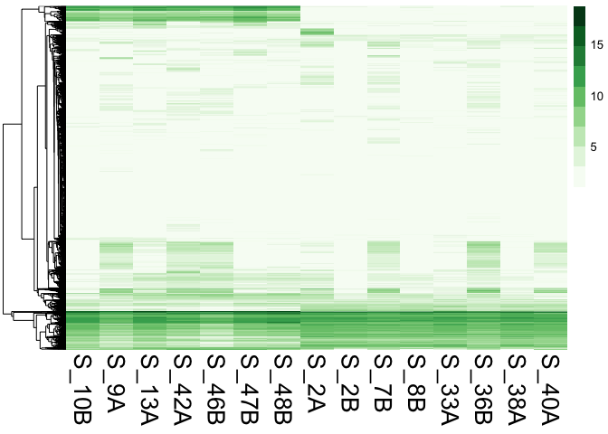
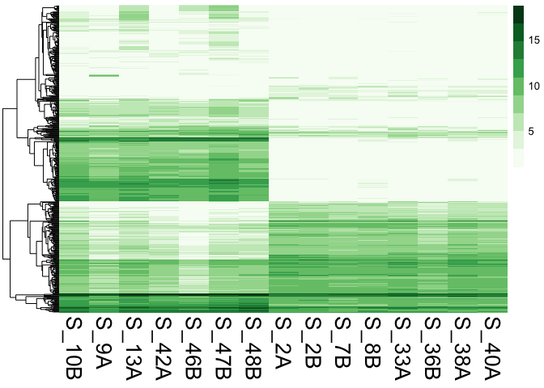
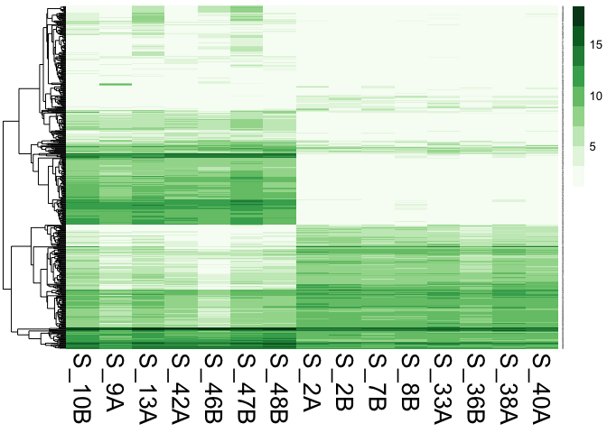
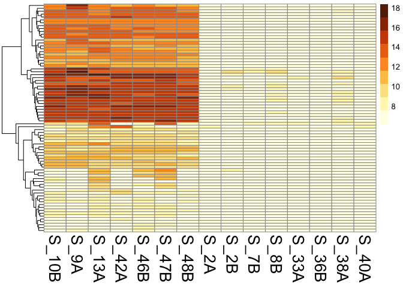
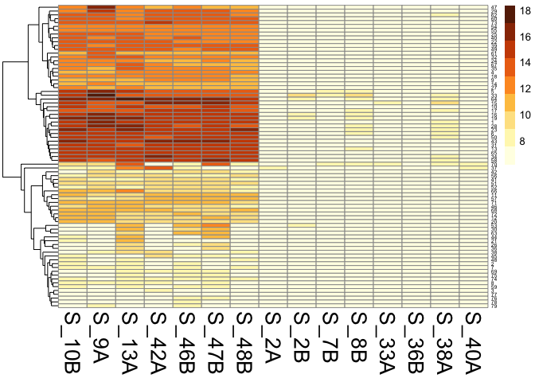

Gene Expression Heatmaps
================
Yaamini Venkataraman
7/15/2019

In this R Markdown document, I will create heatmaps for *Z. marina* and *L. zosterae* gene expression.

Set up R Markdown document
==========================

Install packages
================

``` r
#install.packages("pheatmap") #Uncomment if you need to install this package
require(pheatmap)
```

    ## Loading required package: pheatmap

``` r
#install.packages("dplyr") #Uncomment if you need to install this package
require(dplyr)
```

    ## Loading required package: dplyr

    ## 
    ## Attaching package: 'dplyr'

    ## The following objects are masked from 'package:stats':
    ## 
    ##     filter, lag

    ## The following objects are masked from 'package:base':
    ## 
    ##     intersect, setdiff, setequal, union

Obtain session information
==========================

``` r
sessionInfo()
```

    ## R version 3.5.0 (2018-04-23)
    ## Platform: x86_64-apple-darwin15.6.0 (64-bit)
    ## Running under: macOS  10.14.5
    ## 
    ## Matrix products: default
    ## BLAS: /Library/Frameworks/R.framework/Versions/3.5/Resources/lib/libRblas.0.dylib
    ## LAPACK: /Library/Frameworks/R.framework/Versions/3.5/Resources/lib/libRlapack.dylib
    ## 
    ## locale:
    ## [1] en_US.UTF-8/en_US.UTF-8/en_US.UTF-8/C/en_US.UTF-8/en_US.UTF-8
    ## 
    ## attached base packages:
    ## [1] stats     graphics  grDevices utils     datasets  methods   base     
    ## 
    ## other attached packages:
    ## [1] dplyr_0.7.8     pheatmap_1.0.10
    ## 
    ## loaded via a namespace (and not attached):
    ##  [1] Rcpp_1.0.0         knitr_1.20         bindr_0.1.1       
    ##  [4] magrittr_1.5       tidyselect_0.2.5   munsell_0.5.0     
    ##  [7] colorspace_1.3-2   R6_2.2.2           rlang_0.3.0.1     
    ## [10] stringr_1.3.1      tools_3.5.0        grid_3.5.0        
    ## [13] gtable_0.2.0       htmltools_0.3.6    yaml_2.2.0        
    ## [16] rprojroot_1.3-2    digest_0.6.15      assertthat_0.2.0  
    ## [19] tibble_1.4.2       crayon_1.3.4       bindrcpp_0.2.2    
    ## [22] purrr_0.2.5        RColorBrewer_1.1-2 glue_1.3.0        
    ## [25] evaluate_0.11      rmarkdown_1.10     stringi_1.2.4     
    ## [28] pillar_1.3.0       compiler_3.5.0     scales_1.0.0      
    ## [31] backports_1.1.2    pkgconfig_2.0.2

*Z. marina* heatmaps
====================

Create color scheme
-------------------

``` r
RColorBrewer::display.brewer.all() #Look at RColorBrewer palettes. I'm looking for something that will still make sense for someone with red-green confusion.
```


``` r
heatmapGreen <- RColorBrewer::brewer.pal(9, "Greens") #Save green color palette from RColorBrewer
```

All genes
---------

Using all genes in a heatmap will be noisy, and probably not that interesting since the changes will be hard to see.

*Verdict: I was right.*

``` r
Zostera.GE<-read.delim("EXP.CON.Zostera.logCPM.txt", header=TRUE) #Import logCPM file
head(Zostera.GE) #Confirm import
```

    ##                   GeneID    S_10B     S_9A    S_13A    S_42A    S_46B
    ## 1 TRINITY_DN102005_c0_g1 1.060435 1.060435 2.009724 1.854878 1.060435
    ## 2 TRINITY_DN102006_c0_g1 1.060435 1.498523 1.060435 1.060435 1.060435
    ## 3 TRINITY_DN102012_c0_g1 1.060435 1.498523 1.060435 3.841850 2.076238
    ## 4 TRINITY_DN102024_c0_g1 2.705404 1.060435 1.060435 1.060435 1.060435
    ## 5 TRINITY_DN102050_c0_g1 2.334413 2.334984 1.060435 1.060435 1.060435
    ## 6 TRINITY_DN102051_c0_g1 1.060435 1.060435 1.060435 1.854878 2.401306
    ##      S_47B    S_48B     S_2A     S_2B     S_7B     S_8B    S_33A    S_36B
    ## 1 1.060435 1.060435 1.060435 1.060435 2.269899 1.060435 1.775038 2.160810
    ## 2 2.220749 1.060435 1.988649 1.531364 5.008820 1.060435 1.060435 2.396989
    ## 3 1.060435 1.993144 1.440026 1.060435 2.918429 1.060435 1.060435 2.160810
    ## 4 1.060435 2.554960 1.988649 1.060435 1.060435 2.035084 4.708736 1.060435
    ## 5 1.060435 1.060435 3.168358 1.885816 2.461326 1.060435 1.060435 3.327576
    ## 6 1.060435 1.060435 2.200489 1.060435 1.060435 2.035084 1.060435 1.526533
    ##      S_38A    S_40A
    ## 1 1.060435 1.060435
    ## 2 1.555101 2.134830
    ## 3 1.060435 4.584684
    ## 4 1.060435 1.060435
    ## 5 1.060435 1.060435
    ## 6 1.060435 1.060435

``` r
rownames(Zostera.GE) <- Zostera.GE$GeneID #Set gene ID as row names
Zostera.GE.heatmap <- Zostera.GE[,-1] #Remove redundant column
head(Zostera.GE.heatmap) #Confirm changes
```

    ##                           S_10B     S_9A    S_13A    S_42A    S_46B
    ## TRINITY_DN102005_c0_g1 1.060435 1.060435 2.009724 1.854878 1.060435
    ## TRINITY_DN102006_c0_g1 1.060435 1.498523 1.060435 1.060435 1.060435
    ## TRINITY_DN102012_c0_g1 1.060435 1.498523 1.060435 3.841850 2.076238
    ## TRINITY_DN102024_c0_g1 2.705404 1.060435 1.060435 1.060435 1.060435
    ## TRINITY_DN102050_c0_g1 2.334413 2.334984 1.060435 1.060435 1.060435
    ## TRINITY_DN102051_c0_g1 1.060435 1.060435 1.060435 1.854878 2.401306
    ##                           S_47B    S_48B     S_2A     S_2B     S_7B
    ## TRINITY_DN102005_c0_g1 1.060435 1.060435 1.060435 1.060435 2.269899
    ## TRINITY_DN102006_c0_g1 2.220749 1.060435 1.988649 1.531364 5.008820
    ## TRINITY_DN102012_c0_g1 1.060435 1.993144 1.440026 1.060435 2.918429
    ## TRINITY_DN102024_c0_g1 1.060435 2.554960 1.988649 1.060435 1.060435
    ## TRINITY_DN102050_c0_g1 1.060435 1.060435 3.168358 1.885816 2.461326
    ## TRINITY_DN102051_c0_g1 1.060435 1.060435 2.200489 1.060435 1.060435
    ##                            S_8B    S_33A    S_36B    S_38A    S_40A
    ## TRINITY_DN102005_c0_g1 1.060435 1.775038 2.160810 1.060435 1.060435
    ## TRINITY_DN102006_c0_g1 1.060435 1.060435 2.396989 1.555101 2.134830
    ## TRINITY_DN102012_c0_g1 1.060435 1.060435 2.160810 1.060435 4.584684
    ## TRINITY_DN102024_c0_g1 2.035084 4.708736 1.060435 1.060435 1.060435
    ## TRINITY_DN102050_c0_g1 1.060435 1.060435 3.327576 1.060435 1.060435
    ## TRINITY_DN102051_c0_g1 2.035084 1.060435 1.526533 1.060435 1.060435

``` r
pheatmap(Zostera.GE.heatmap, cluster_row = TRUE, cluster_cols = FALSE, clustering_distance_rows = "euclidean", clustering_method = "average", show_rownames = FALSE, show_colnames = TRUE, treeheight_col = 80, legend = TRUE, color = heatmapGreen, fontsize_col = 20, fontsize_row = 12) #Create heatmap. Cluster rows, but not columns, Use euclidean distances and average method for clustering. Do not show rownames but show column names. Adjust tree height, add a legend, and specify colors and font sizes.
```



Differentially expressed genes
------------------------------

*Verdict: This is definitely the best looking one.*

``` r
zosteraDEG <- read.delim("DE.EXP.CON.FDR.Z.Annot.M.txt") #Import modified file for DEG
head(zosteraDEG) #Confirm import
```

    ##                   GeneID     logFC   logCPM         F      PValue
    ## 1 TRINITY_DN102431_c0_g1  7.879689 1.594841  9.620747 0.006469395
    ## 2 TRINITY_DN104822_c0_g1  7.264611 1.860002  8.558335 0.008354860
    ## 3 TRINITY_DN111410_c0_g1 15.913332 4.656098 44.698086 0.000003800
    ## 4 TRINITY_DN111543_c0_g1  8.141234 2.263420 10.397013 0.004969218
    ## 5 TRINITY_DN111591_c0_g1  6.205884 1.383823  9.467357 0.006822930
    ## 6 TRINITY_DN139711_c0_g1  7.930133 1.615140 11.000293 0.004072252
    ##          FDR Accession                   Isoform E.value
    ## 1 0.03949266    Q7ZX51 TRINITY_DN102431_c0_g1_i1 1.4e-40
    ## 2 0.04851462    Q69LE0 TRINITY_DN104822_c0_g1_i1 7.2e-13
    ## 3 0.00006350    Q9W020 TRINITY_DN111410_c0_g1_i1 7.3e-08
    ## 4 0.03193581    O65202 TRINITY_DN111543_c0_g1_i1 4.3e-10
    ## 5 0.04124408    O67876 TRINITY_DN111591_c0_g1_i1 1.1e-41
    ## 6 0.02739917    P21187 TRINITY_DN139711_c0_g1_i1 1.5e-24
    ##                                                                                           ProteinN
    ## 1                Tyrosine--tRNA ligase, cytoplasmic (EC 6.1.1.1) (Tyrosyl-tRNA synthetase) (TyrRS)
    ## 2                 Zinc finger A20 and AN1 domain-containing stress-associated protein 10 (OsSAP10)
    ## 3                                              Nucleolar MIF4G domain-containing protein 1 homolog
    ## 4 Peroxisomal acyl-coenzyme A oxidase 1 (AOX 1) (EC 1.3.3.6) (Long-chain acyl-CoA oxidase) (AtCX1)
    ## 5    Delta-aminolevulinic acid dehydratase (ALAD) (ALADH) (EC 4.2.1.24) (Porphobilinogen synthase)
    ## 6                                   Polyadenylate-binding protein (PABP) (Poly(A)-binding protein)
    ##                                                                                                                                                                                                                                                                                                                                                                                                                                                                                                                                     GO_BP
    ## 1                                                                                                                                                                                                                                                                                                                                                                                                                                                                                                tyrosyl-tRNA aminoacylation [GO:0006437]
    ## 2                                                                                                                                                                                                                                                                                                                                                                                                                                                                                                                                        
    ## 3                                                                                                                                                                                                                                                                                                                                                                                                                                                                                         ribosomal small subunit biogenesis [GO:0042274]
    ## 4                                                                                                                                                                                  fatty acid beta-oxidation [GO:0006635]; fatty acid beta-oxidation using acyl-CoA oxidase [GO:0033540]; jasmonic acid biosynthetic process [GO:0009695]; lipid homeostasis [GO:0055088]; long-chain fatty acid metabolic process [GO:0001676]; response to cadmium ion [GO:0046686]; response to fungus [GO:0009620]; response to wounding [GO:0009611]
    ## 5                                                                                                                                                                                                                                                                                                                                                                                                                                         heme biosynthetic process [GO:0006783]; protoporphyrinogen IX biosynthetic process [GO:0006782]
    ## 6 chemical synaptic transmission [GO:0007268]; dorsal/ventral pattern formation [GO:0009953]; male meiosis cytokinesis [GO:0007112]; male meiotic nuclear division [GO:0007140]; mRNA splicing, via spliceosome [GO:0000398]; negative regulation of neuron death [GO:1901215]; oocyte development [GO:0048599]; oogenesis [GO:0048477]; positive regulation of translation [GO:0045727]; regulation of compound eye photoreceptor development [GO:0045314]; spermatid nucleus differentiation [GO:0007289]; spermatogenesis [GO:0007283]
    ##                                                                                                                                                                                                                                   GO_CC
    ## 1                                                                                                                                                                                                                cytoplasm [GO:0005737]
    ## 2                                                                                                                                                                                                                                      
    ## 3                                                                                                                                                                                                                nucleolus [GO:0005730]
    ## 4                                                                                                                                                                                     peroxisome [GO:0005777]; plasmodesma [GO:0009506]
    ## 5                                                                                                                                                                                                                  cytosol [GO:0005829]
    ## 6 catalytic step 2 spliceosome [GO:0071013]; cytoplasm [GO:0005737]; cytoplasmic stress granule [GO:0010494]; cytosol [GO:0005829]; nucleus [GO:0005634]; precatalytic spliceosome [GO:0071011]; ribonucleoprotein complex [GO:1990904]
    ##                                                                                                                                                   GO_MF
    ## 1                                                       ATP binding [GO:0005524]; tRNA binding [GO:0000049]; tyrosine-tRNA ligase activity [GO:0004831]
    ## 2                                                                                               DNA binding [GO:0003677]; zinc ion binding [GO:0008270]
    ## 3                                                                                                                              RNA binding [GO:0003723]
    ## 4   acyl-CoA oxidase activity [GO:0003997]; FAD binding [GO:0071949]; fatty acid binding [GO:0005504]; flavin adenine dinucleotide binding [GO:0050660]
    ## 5                                                                         porphobilinogen synthase activity [GO:0004655]; zinc ion binding [GO:0008270]
    ## 6 mRNA 3'-UTR binding [GO:0003730]; mRNA binding [GO:0003729]; poly(A) binding [GO:0008143]; poly(U) RNA binding [GO:0008266]; RNA binding [GO:0003723]
    ##                                                                                                                                                                                                                                                                                               GO
    ## 1                                                                                                                                                                                                                                     GO:0000049; GO:0004831; GO:0005524; GO:0005737; GO:0006437
    ## 2                                                                                                                                                                                                                                                                         GO:0003677; GO:0008270
    ## 3                                                                                                                                                                                                                                                             GO:0003723; GO:0005730; GO:0042274
    ## 4                                                                                                                         GO:0001676; GO:0003997; GO:0005504; GO:0005777; GO:0006635; GO:0009506; GO:0009611; GO:0009620; GO:0009695; GO:0033540; GO:0046686; GO:0050660; GO:0055088; GO:0071949
    ## 5                                                                                                                                                                                                                                     GO:0004655; GO:0005829; GO:0006782; GO:0006783; GO:0008270
    ## 6 GO:0000398; GO:0003723; GO:0003729; GO:0003730; GO:0005634; GO:0005737; GO:0005829; GO:0007112; GO:0007140; GO:0007268; GO:0007283; GO:0007289; GO:0008143; GO:0008266; GO:0009953; GO:0010494; GO:0045314; GO:0045727; GO:0048477; GO:0048599; GO:0071011; GO:0071013; GO:1901215; GO:1990904
    ##     Status                               Organism
    ## 1 reviewed   Xenopus laevis (African clawed frog)
    ## 2 reviewed    Oryza sativa subsp. japonica (Rice)
    ## 3 reviewed    Drosophila melanogaster (Fruit fly)
    ## 4 reviewed Arabidopsis thaliana (Mouse-ear cress)
    ## 5 reviewed          Aquifex aeolicus (strain VF5)
    ## 6 reviewed    Drosophila melanogaster (Fruit fly)

``` r
zosteraDEG.heatmap <- merge(x = Zostera.GE, y = zosteraDEG, by = "GeneID") #Merge files by GeneID
rownames(zosteraDEG.heatmap) <- zosteraDEG.heatmap$GeneID #Set gene IDs as rownames
zosteraDEG.heatmap <- zosteraDEG.heatmap[,c(2:16)] #Only keep columns with logCPM for each sample
head(zosteraDEG.heatmap) #Confirm changes
```

    ##                           S_10B     S_9A    S_13A    S_42A    S_46B
    ## TRINITY_DN102431_c0_g1 1.060435 1.060435 2.577379 1.060435 2.076238
    ## TRINITY_DN104822_c0_g1 1.060435 1.498523 3.970485 3.284488 1.655952
    ## TRINITY_DN111410_c0_g1 6.191308 4.255874 7.816069 3.037763 3.407565
    ## TRINITY_DN111543_c0_g1 1.060435 1.498523 1.060435 3.037763 2.890313
    ## TRINITY_DN111591_c0_g1 1.833703 1.834107 2.577379 1.854878 1.060435
    ## TRINITY_DN139711_c0_g1 2.334413 1.060435 3.559861 1.060435 1.655952
    ##                           S_47B    S_48B     S_2A     S_2B     S_7B
    ## TRINITY_DN102431_c0_g1 3.630958 1.060435 1.060435 1.060435 1.060435
    ## TRINITY_DN104822_c0_g1 1.060435 1.060435 1.060435 1.060435 1.060435
    ## TRINITY_DN111410_c0_g1 4.330281 3.273137 1.060435 1.060435 1.060435
    ## TRINITY_DN111543_c0_g1 2.220749 4.931574 1.060435 1.060435 1.060435
    ## TRINITY_DN111591_c0_g1 1.060435 1.060435 1.060435 1.060435 1.060435
    ## TRINITY_DN139711_c0_g1 2.220749 1.060435 1.060435 1.060435 1.060435
    ##                            S_8B    S_33A    S_36B    S_38A    S_40A
    ## TRINITY_DN102431_c0_g1 1.060435 1.060435 1.060435 1.060435 1.060435
    ## TRINITY_DN104822_c0_g1 1.060435 1.060435 1.878252 1.060435 1.060435
    ## TRINITY_DN111410_c0_g1 1.060435 1.060435 1.060435 1.060435 1.060435
    ## TRINITY_DN111543_c0_g1 1.060435 1.060435 1.060435 1.060435 1.060435
    ## TRINITY_DN111591_c0_g1 1.060435 1.060435 1.060435 1.060435 1.060435
    ## TRINITY_DN139711_c0_g1 1.060435 1.060435 1.060435 1.060435 1.060435

### Without row numbers

``` r
#pdf("2019-07-15-Zostera-Differentially-Expressed-Genes-Heatmap.pdf", width = 11, height = 8.5) #Uncomment and run if you want to save the plot
pheatmap(zosteraDEG.heatmap, cluster_row = TRUE, cluster_cols = FALSE, clustering_distance_rows = "euclidean", clustering_method = "average", show_rownames = FALSE, show_colnames = TRUE, treeheight_col = 80, legend = TRUE, color = heatmapGreen, fontsize_col = 20, fontsize_row = 12) #Create heatmap. Cluster rows, but not columns, Use euclidean distances and average method for clustering. Do not show rownames but show column names. Adjust tree height, add a legend, and specify colors and font sizes.
```



``` r
#dev.off() #Uncomment and run after running plotting code above
```

### With row numbers

``` r
zosteraDEG.heatmap$rownumber <- seq(from = 1, to = length(zosteraDEG.heatmap$S_10B), by = 1) #Add a new column numbering rows
geneRowNumbers <- data.frame("GeneID" = rownames(zosteraDEG.heatmap),
                             "Number" = zosteraDEG.heatmap$rownumber) #Create new dataframe with gene IDs and row numbers
write.csv(geneRowNumbers, "2019-07-15-Zostera-Differentially-Expressed-Genes-RowNumbers.csv") #Save file
```

``` r
rownames(zosteraDEG.heatmap) <- zosteraDEG.heatmap$rownumber #Use numbers as row names
zosteraDEG.heatmap <- zosteraDEG.heatmap[,-16] #Remove rownumber column
head(zosteraDEG.heatmap) #Confirm changes
```

    ##      S_10B     S_9A    S_13A    S_42A    S_46B    S_47B    S_48B     S_2A
    ## 1 1.060435 1.060435 2.577379 1.060435 2.076238 3.630958 1.060435 1.060435
    ## 2 1.060435 1.498523 3.970485 3.284488 1.655952 1.060435 1.060435 1.060435
    ## 3 6.191308 4.255874 7.816069 3.037763 3.407565 4.330281 3.273137 1.060435
    ## 4 1.060435 1.498523 1.060435 3.037763 2.890313 2.220749 4.931574 1.060435
    ## 5 1.833703 1.834107 2.577379 1.854878 1.060435 1.060435 1.060435 1.060435
    ## 6 2.334413 1.060435 3.559861 1.060435 1.655952 2.220749 1.060435 1.060435
    ##       S_2B     S_7B     S_8B    S_33A    S_36B    S_38A    S_40A
    ## 1 1.060435 1.060435 1.060435 1.060435 1.060435 1.060435 1.060435
    ## 2 1.060435 1.060435 1.060435 1.060435 1.878252 1.060435 1.060435
    ## 3 1.060435 1.060435 1.060435 1.060435 1.060435 1.060435 1.060435
    ## 4 1.060435 1.060435 1.060435 1.060435 1.060435 1.060435 1.060435
    ## 5 1.060435 1.060435 1.060435 1.060435 1.060435 1.060435 1.060435
    ## 6 1.060435 1.060435 1.060435 1.060435 1.060435 1.060435 1.060435

``` r
#pdf("2019-07-15-Zostera-Differentially-Expressed-Genes-Rownames-Heatmap.pdf", width = 11, height = 8.5) #Uncomment and run if you want to save the plot
pheatmap(zosteraDEG.heatmap, cluster_row = TRUE, cluster_cols = FALSE, clustering_distance_rows = "euclidean", clustering_method = "average", show_rownames = TRUE, show_colnames = TRUE, treeheight_col = 80, legend = TRUE, color = heatmapGreen, fontsize_col = 20, fontsize_row = 1) #Create heatmap. Cluster rows, but not columns, Use euclidean distances and average method for clustering. Show row and column names. Adjust tree height, add a legend, and specify colors and font sizes.
```



``` r
#dev.off() #Uncomment and run after running plotting code above
```

*L. zosterae* heatmaps
======================

Create color scheme
-------------------

``` r
heatmapBrown <- RColorBrewer::brewer.pal(9, "YlOrBr") #Save yellow-orange-brown color palette from RColorBrewer
```

All genes
---------

*Verdict: Still not exciting.*

``` r
nZostera.GE<-read.delim("EXP.CON.nZostera.logCPM.txt", header=TRUE) #Import logCPM file
head(nZostera.GE) #Confirm import
```

    ##                   GeneID   S_10B     S_9A    S_13A    S_42A    S_46B
    ## 1 TRINITY_DN102004_c0_g1 6.14403 6.576396 6.144030 6.144030 6.144030
    ## 2 TRINITY_DN102014_c0_g1 6.14403 6.576396 6.144030 6.144030 6.144030
    ## 3 TRINITY_DN102051_c0_g1 6.14403 6.144030 6.144030 6.747021 7.354827
    ## 4  TRINITY_DN10209_c0_g1 6.14403 7.178481 7.639015 6.144030 8.685148
    ## 5  TRINITY_DN10241_c0_g1 6.14403 6.144030 6.144030 8.508854 6.668313
    ## 6 TRINITY_DN102420_c0_g1 6.14403 6.144030 6.144030 6.144030 6.668313
    ##     S_47B    S_48B     S_2A    S_2B     S_7B     S_8B    S_33A    S_36B
    ## 1 6.14403 6.144030 6.144030 6.14403 7.340733 6.144030 6.144030 7.529367
    ## 2 6.14403 6.144030 6.587514 6.14403 7.121577 6.144030 6.144030 6.144030
    ## 3 6.14403 6.144030 7.430638 6.14403 6.144030 7.250857 6.144030 6.487406
    ## 4 6.14403 7.403922 6.144030 6.14403 8.224818 6.144030 7.742589 8.689254
    ## 5 6.14403 6.144030 6.144030 6.14403 6.144030 6.144030 6.144030 6.487406
    ## 6 6.14403 6.144030 6.144030 6.14403 6.547885 6.144030 6.144030 6.487406
    ##      S_38A    S_40A
    ## 1 6.144030 6.144030
    ## 2 6.144030 6.144030
    ## 3 6.144030 6.144030
    ## 4 7.197029 6.894222
    ## 5 6.144030 6.144030
    ## 6 6.144030 6.144030

``` r
rownames(nZostera.GE) <- nZostera.GE$GeneID #Set gene ID as row names
nZostera.GE.heatmap <- nZostera.GE[,-1] #Remove redundant column
head(nZostera.GE.heatmap) #Confirm changes
```

    ##                          S_10B     S_9A    S_13A    S_42A    S_46B   S_47B
    ## TRINITY_DN102004_c0_g1 6.14403 6.576396 6.144030 6.144030 6.144030 6.14403
    ## TRINITY_DN102014_c0_g1 6.14403 6.576396 6.144030 6.144030 6.144030 6.14403
    ## TRINITY_DN102051_c0_g1 6.14403 6.144030 6.144030 6.747021 7.354827 6.14403
    ## TRINITY_DN10209_c0_g1  6.14403 7.178481 7.639015 6.144030 8.685148 6.14403
    ## TRINITY_DN10241_c0_g1  6.14403 6.144030 6.144030 8.508854 6.668313 6.14403
    ## TRINITY_DN102420_c0_g1 6.14403 6.144030 6.144030 6.144030 6.668313 6.14403
    ##                           S_48B     S_2A    S_2B     S_7B     S_8B
    ## TRINITY_DN102004_c0_g1 6.144030 6.144030 6.14403 7.340733 6.144030
    ## TRINITY_DN102014_c0_g1 6.144030 6.587514 6.14403 7.121577 6.144030
    ## TRINITY_DN102051_c0_g1 6.144030 7.430638 6.14403 6.144030 7.250857
    ## TRINITY_DN10209_c0_g1  7.403922 6.144030 6.14403 8.224818 6.144030
    ## TRINITY_DN10241_c0_g1  6.144030 6.144030 6.14403 6.144030 6.144030
    ## TRINITY_DN102420_c0_g1 6.144030 6.144030 6.14403 6.547885 6.144030
    ##                           S_33A    S_36B    S_38A    S_40A
    ## TRINITY_DN102004_c0_g1 6.144030 7.529367 6.144030 6.144030
    ## TRINITY_DN102014_c0_g1 6.144030 6.144030 6.144030 6.144030
    ## TRINITY_DN102051_c0_g1 6.144030 6.487406 6.144030 6.144030
    ## TRINITY_DN10209_c0_g1  7.742589 8.689254 7.197029 6.894222
    ## TRINITY_DN10241_c0_g1  6.144030 6.487406 6.144030 6.144030
    ## TRINITY_DN102420_c0_g1 6.144030 6.487406 6.144030 6.144030

``` r
pheatmap(nZostera.GE.heatmap, cluster_row = TRUE, cluster_cols = FALSE, clustering_distance_rows = "euclidean", clustering_method = "average", show_rownames = FALSE, show_colnames = TRUE, treeheight_col = 80, legend = TRUE, color = heatmapBrown, fontsize_col = 20, fontsize_row = 12) #Create heatmap. Cluster rows, but not columns, Use euclidean distances and average method for clustering. Do not show rownames but show column names. Adjust tree height, add a legend, and specify colors and font sizes.
```


Differentially expressed genes
------------------------------

*Verdict: Still the better one.*

``` r
nonZosteraDEG <- read.delim("DE.EXP.CON.FDR.nZ.Annot.M.txt") #Import modified file for DEG
head(nonZosteraDEG) #Confirm import
```

    ##   X                 GeneID     logFC    logCPM         F       PValue
    ## 1 1 TRINITY_DN173970_c0_g1 19.770927 14.042753 103.12321 7.150000e-12
    ## 2 2   TRINITY_DN2119_c0_g1  9.513759  6.962783  12.52156 1.411480e-03
    ## 3 3  TRINITY_DN22073_c0_g1  7.733247  6.630983  10.80687 2.704897e-03
    ## 4 4 TRINITY_DN226644_c0_g1 17.218092 10.671009  64.03393 4.600000e-09
    ## 5 5 TRINITY_DN227396_c0_g1 -9.766477  7.100089  10.95723 2.480880e-03
    ## 6 6 TRINITY_DN233011_c0_g1 19.064131 14.002500 108.54501 3.660000e-12
    ##            FDR Accession                   Isoform E.value
    ## 1 7.090000e-10    Q54IP4 TRINITY_DN173970_c0_g1_i1 1.9e-06
    ## 2 2.127183e-02    Q54HM6   TRINITY_DN2119_c0_g1_i1 1.0e-08
    ## 3 3.647340e-02    Q979Z2  TRINITY_DN22073_c0_g1_i1 1.1e-07
    ## 4 1.590000e-07    Q29RV1 TRINITY_DN226644_c0_g1_i1 2.0e-10
    ## 5 3.380859e-02    Q7LHG5 TRINITY_DN227396_c0_g1_i1 1.8e-07
    ## 6 6.020000e-10    Q55E58 TRINITY_DN233011_c0_g1_i1 3.2e-21
    ##                                                                                                                                                                                                                                                                                                                                                                                 ProteinN
    ## 1                                                                                                                                                                                                                                                                 Dual specificity protein kinase shkB (EC 2.7.11.1) (SH2 domain-containing protein 2) (SH2 domain-containing protein B)
    ## 2                                                                                                                                                                                                                                                                                                                             Cytochrome c oxidase assembly protein COX11, mitochondrial
    ## 3                                                                                                                                                                                                                                                                                                                                                   Calcium-gated potassium channel TvoK
    ## 4                                                                                                                                                                                                                                                                                                                                            Protein disulfide-isomerase A4 (EC 5.3.4.1)
    ## 5 Transposon Ty3-I Gag-Pol polyprotein (Gag3-Pol3) (Transposon Ty3-2 TYA-TYB polyprotein) [Cleaved into: Capsid protein (CA) (p24); Spacer peptide p3; Nucleocapsid protein p11 (NC); Ty3 protease (PR) (EC 3.4.23.-) (p16); Spacer peptide J; Reverse transcriptase/ribonuclease H (RT) (RT-RH) (EC 2.7.7.49) (EC 2.7.7.7) (EC 3.1.26.4) (p55); Integrase p52 (IN); Integrase p49 (IN)]
    ## 6                                                                                                                                                                                                                                                                    Probable serine/threonine-protein kinase pats1 (EC 2.7.11.1) (Protein associated with the transduction of signal 1)
    ##                                                                                                                                  GO_BP
    ## 1                                                                                                                                     
    ## 2                                                   aerobic respiration [GO:0009060]; protein-containing complex assembly [GO:0065003]
    ## 3                                                                                                                                     
    ## 4             cell redox homeostasis [GO:0045454]; protein folding [GO:0006457]; response to endoplasmic reticulum stress [GO:0034976]
    ## 5                               DNA integration [GO:0015074]; DNA recombination [GO:0006310]; transposition, RNA-mediated [GO:0032197]
    ## 6 cheating during chimeric sorocarp development [GO:0099139]; mitotic cytokinesis [GO:0000281]; protein dephosphorylation [GO:0006470]
    ##                                                                                                                              GO_CC
    ## 1                                                                                                            membrane [GO:0016020]
    ## 2               integral component of membrane [GO:0016021]; mitochondrial inner membrane [GO:0005743]; mitochondrion [GO:0005739]
    ## 3                                                        integral component of membrane [GO:0016021]; plasma membrane [GO:0005886]
    ## 4 cell surface [GO:0009986]; endoplasmic reticulum [GO:0005783]; endoplasmic reticulum lumen [GO:0005788]; melanosome [GO:0042470]
    ## 5                                          cytoplasm [GO:0005737]; nucleus [GO:0005634]; retrotransposon nucleocapsid [GO:0000943]
    ## 6                                                                                                          actomyosin [GO:0042641]
    ##                                                                                                                                                                                                                                                                                                                                                                                          GO_MF
    ## 1                                                                                                                                                                                                                                                               ATP binding [GO:0005524]; protein serine/threonine kinase activity [GO:0004674]; protein tyrosine kinase activity [GO:0004713]
    ## 2                                                                                                                                                                                                                                                                                                                                                              copper ion binding [GO:0005507]
    ## 3                                                                                                                                                                                                                                                                                                                      metal ion binding [GO:0046872]; potassium channel activity [GO:0005267]
    ## 4                                                                                                                                                                                                                                                                                                                                            protein disulfide isomerase activity [GO:0003756]
    ## 5 aspartic-type endopeptidase activity [GO:0004190]; ATP binding [GO:0005524]; DNA binding [GO:0003677]; DNA-directed DNA polymerase activity [GO:0003887]; peptidase activity [GO:0008233]; ribonuclease activity [GO:0004540]; RNA binding [GO:0003723]; RNA-directed DNA polymerase activity [GO:0003964]; RNA-DNA hybrid ribonuclease activity [GO:0004523]; zinc ion binding [GO:0008270]
    ## 6                                                                                                                                                                                                                                  ATP binding [GO:0005524]; GTP binding [GO:0005525]; phosphoprotein phosphatase activity [GO:0004721]; protein serine/threonine kinase activity [GO:0004674]
    ##                                                                                                                                                                                               GO
    ## 1                                                                                                                                                 GO:0004674; GO:0004713; GO:0005524; GO:0016020
    ## 2                                                                                                                         GO:0005507; GO:0005739; GO:0005743; GO:0009060; GO:0016021; GO:0065003
    ## 3                                                                                                                                                 GO:0005267; GO:0005886; GO:0016021; GO:0046872
    ## 4                                                                                                 GO:0003756; GO:0005783; GO:0005788; GO:0006457; GO:0009986; GO:0034976; GO:0042470; GO:0045454
    ## 5 GO:0000943; GO:0003677; GO:0003723; GO:0003887; GO:0003964; GO:0004190; GO:0004523; GO:0004540; GO:0005524; GO:0005634; GO:0005737; GO:0006310; GO:0008233; GO:0008270; GO:0015074; GO:0032197
    ## 6                                                                                                 GO:0000281; GO:0004674; GO:0004721; GO:0005524; GO:0005525; GO:0006470; GO:0042641; GO:0099139
    ##     Status
    ## 1 reviewed
    ## 2 reviewed
    ## 3 reviewed
    ## 4 reviewed
    ## 5 reviewed
    ## 6 reviewed
    ##                                                                               Organism
    ## 1                                                Dictyostelium discoideum (Slime mold)
    ## 2                                                Dictyostelium discoideum (Slime mold)
    ## 3 Thermoplasma volcanium (strain ATCC 51530 / DSM 4299 / JCM 9571 / NBRC 15438 / GSS1)
    ## 4                                                                  Bos taurus (Bovine)
    ## 5                Saccharomyces cerevisiae (strain ATCC 204508 / S288c) (Baker's yeast)
    ## 6                                                Dictyostelium discoideum (Slime mold)

I will not look at genes downregulated in the exposed treatments, so those rows should be removed.

``` r
nonZosteraDEG <- subset(x = nonZosteraDEG, subset = nonZosteraDEG$logFC > 0) #Retain upregulated genes
nonZosteraDEG.heatmap <- merge(x = nZostera.GE, y = nonZosteraDEG, by = "GeneID") #Merge files by GeneID
head(nonZosteraDEG.heatmap) #Confirm merge
```

    ##                   GeneID     S_10B      S_9A     S_13A     S_42A     S_46B
    ## 1 TRINITY_DN173970_c0_g1 15.139983 15.979684 15.285549 14.736471 14.928570
    ## 2   TRINITY_DN2119_c0_g1  7.615969  7.178481  8.155175  6.747021  8.315796
    ## 3  TRINITY_DN22073_c0_g1  6.673587  7.178481  7.289647  7.764827  6.668313
    ## 4 TRINITY_DN226644_c0_g1 11.418155 11.084327 12.075103 12.091389 11.644196
    ## 5 TRINITY_DN233011_c0_g1 14.893211 16.782572 15.502256 13.822896 13.861489
    ## 6 TRINITY_DN251134_c0_g1 14.918270 14.489588 15.207602 14.973766 14.952739
    ##      S_47B     S_48B     S_2A    S_2B     S_7B     S_8B    S_33A    S_36B
    ## 1 14.81843 14.559036 6.144030 6.14403 6.144030 7.250857 7.154239 6.144030
    ## 2  6.14403  7.403922 6.144030 6.14403 6.144030 6.144030 6.144030 6.144030
    ## 3  6.14403  6.907347 6.144030 6.14403 6.144030 6.144030 6.144030 6.144030
    ## 4 11.83356 11.720705 6.144030 6.14403 6.144030 6.144030 6.144030 6.144030
    ## 5 13.61206 13.745257 6.144030 7.12876 7.530946 7.593233 6.144030 6.764563
    ## 6 15.11006 14.694009 6.587514 6.14403 6.144030 7.593233 6.144030 6.144030
    ##      S_38A    S_40A X     logFC    logCPM         F       PValue
    ## 1 7.799234 6.894222 1 19.770927 14.042753 103.12321 7.150000e-12
    ## 2 6.144030 6.144030 2  9.513759  6.962783  12.52156 1.411480e-03
    ## 3 6.144030 6.144030 3  7.733247  6.630983  10.80687 2.704897e-03
    ## 4 6.144030 6.894222 4 17.218092 10.671009  64.03393 4.600000e-09
    ## 5 6.144030 6.144030 6 19.064131 14.002500 108.54501 3.660000e-12
    ## 6 8.222816 6.144030 7 18.856567 13.830683  86.20600 6.950000e-11
    ##            FDR Accession                   Isoform E.value
    ## 1 7.090000e-10    Q54IP4 TRINITY_DN173970_c0_g1_i1 1.9e-06
    ## 2 2.127183e-02    Q54HM6   TRINITY_DN2119_c0_g1_i1 1.0e-08
    ## 3 3.647340e-02    Q979Z2  TRINITY_DN22073_c0_g1_i1 1.1e-07
    ## 4 1.590000e-07    Q29RV1 TRINITY_DN226644_c0_g1_i1 2.0e-10
    ## 5 6.020000e-10    Q55E58 TRINITY_DN233011_c0_g1_i1 3.2e-21
    ## 6 3.560000e-09    Q99LT0 TRINITY_DN251134_c0_g1_i1 4.5e-07
    ##                                                                                                                 ProteinN
    ## 1 Dual specificity protein kinase shkB (EC 2.7.11.1) (SH2 domain-containing protein 2) (SH2 domain-containing protein B)
    ## 2                                                             Cytochrome c oxidase assembly protein COX11, mitochondrial
    ## 3                                                                                   Calcium-gated potassium channel TvoK
    ## 4                                                                            Protein disulfide-isomerase A4 (EC 5.3.4.1)
    ## 5    Probable serine/threonine-protein kinase pats1 (EC 2.7.11.1) (Protein associated with the transduction of signal 1)
    ## 6                                                                 Protein dpy-30 homolog (Dpy-30-like protein) (Dpy-30L)
    ##                                                                                                                                  GO_BP
    ## 1                                                                                                                                     
    ## 2                                                   aerobic respiration [GO:0009060]; protein-containing complex assembly [GO:0065003]
    ## 3                                                                                                                                     
    ## 4             cell redox homeostasis [GO:0045454]; protein folding [GO:0006457]; response to endoplasmic reticulum stress [GO:0034976]
    ## 5 cheating during chimeric sorocarp development [GO:0099139]; mitotic cytokinesis [GO:0000281]; protein dephosphorylation [GO:0006470]
    ## 6                                                             endosomal transport [GO:0016197]; histone H3-K4 methylation [GO:0051568]
    ##                                                                                                                                                                                                                             GO_CC
    ## 1                                                                                                                                                                                                           membrane [GO:0016020]
    ## 2                                                                                                              integral component of membrane [GO:0016021]; mitochondrial inner membrane [GO:0005743]; mitochondrion [GO:0005739]
    ## 3                                                                                                                                                       integral component of membrane [GO:0016021]; plasma membrane [GO:0005886]
    ## 4                                                                                                cell surface [GO:0009986]; endoplasmic reticulum [GO:0005783]; endoplasmic reticulum lumen [GO:0005788]; melanosome [GO:0042470]
    ## 5                                                                                                                                                                                                         actomyosin [GO:0042641]
    ## 6 Golgi apparatus [GO:0005794]; histone methyltransferase complex [GO:0035097]; MLL3/4 complex [GO:0044666]; nucleoplasm [GO:0005654]; nucleus [GO:0005634]; Set1C/COMPASS complex [GO:0048188]; trans-Golgi network [GO:0005802]
    ##                                                                                                                                                         GO_MF
    ## 1                              ATP binding [GO:0005524]; protein serine/threonine kinase activity [GO:0004674]; protein tyrosine kinase activity [GO:0004713]
    ## 2                                                                                                                             copper ion binding [GO:0005507]
    ## 3                                                                                     metal ion binding [GO:0046872]; potassium channel activity [GO:0005267]
    ## 4                                                                                                           protein disulfide isomerase activity [GO:0003756]
    ## 5 ATP binding [GO:0005524]; GTP binding [GO:0005525]; phosphoprotein phosphatase activity [GO:0004721]; protein serine/threonine kinase activity [GO:0004674]
    ## 6                                                                      identical protein binding [GO:0042802]; protein homodimerization activity [GO:0042803]
    ##                                                                                                                                   GO
    ## 1                                                                                     GO:0004674; GO:0004713; GO:0005524; GO:0016020
    ## 2                                                             GO:0005507; GO:0005739; GO:0005743; GO:0009060; GO:0016021; GO:0065003
    ## 3                                                                                     GO:0005267; GO:0005886; GO:0016021; GO:0046872
    ## 4                                     GO:0003756; GO:0005783; GO:0005788; GO:0006457; GO:0009986; GO:0034976; GO:0042470; GO:0045454
    ## 5                                     GO:0000281; GO:0004674; GO:0004721; GO:0005524; GO:0005525; GO:0006470; GO:0042641; GO:0099139
    ## 6 GO:0005634; GO:0005654; GO:0005794; GO:0005802; GO:0016197; GO:0035097; GO:0042802; GO:0042803; GO:0044666; GO:0048188; GO:0051568
    ##     Status
    ## 1 reviewed
    ## 2 reviewed
    ## 3 reviewed
    ## 4 reviewed
    ## 5 reviewed
    ## 6 reviewed
    ##                                                                               Organism
    ## 1                                                Dictyostelium discoideum (Slime mold)
    ## 2                                                Dictyostelium discoideum (Slime mold)
    ## 3 Thermoplasma volcanium (strain ATCC 51530 / DSM 4299 / JCM 9571 / NBRC 15438 / GSS1)
    ## 4                                                                  Bos taurus (Bovine)
    ## 5                                                Dictyostelium discoideum (Slime mold)
    ## 6                                                                 Mus musculus (Mouse)

``` r
rownames(nonZosteraDEG.heatmap) <- nonZosteraDEG.heatmap$GeneID #Set gene IDs as rownames
nonZosteraDEG.heatmap <- nonZosteraDEG.heatmap[,c(2:16)] #Only keep columns with logCPM for each sample
head(nonZosteraDEG.heatmap) #Confirm changes
```

    ##                            S_10B      S_9A     S_13A     S_42A     S_46B
    ## TRINITY_DN173970_c0_g1 15.139983 15.979684 15.285549 14.736471 14.928570
    ## TRINITY_DN2119_c0_g1    7.615969  7.178481  8.155175  6.747021  8.315796
    ## TRINITY_DN22073_c0_g1   6.673587  7.178481  7.289647  7.764827  6.668313
    ## TRINITY_DN226644_c0_g1 11.418155 11.084327 12.075103 12.091389 11.644196
    ## TRINITY_DN233011_c0_g1 14.893211 16.782572 15.502256 13.822896 13.861489
    ## TRINITY_DN251134_c0_g1 14.918270 14.489588 15.207602 14.973766 14.952739
    ##                           S_47B     S_48B     S_2A    S_2B     S_7B
    ## TRINITY_DN173970_c0_g1 14.81843 14.559036 6.144030 6.14403 6.144030
    ## TRINITY_DN2119_c0_g1    6.14403  7.403922 6.144030 6.14403 6.144030
    ## TRINITY_DN22073_c0_g1   6.14403  6.907347 6.144030 6.14403 6.144030
    ## TRINITY_DN226644_c0_g1 11.83356 11.720705 6.144030 6.14403 6.144030
    ## TRINITY_DN233011_c0_g1 13.61206 13.745257 6.144030 7.12876 7.530946
    ## TRINITY_DN251134_c0_g1 15.11006 14.694009 6.587514 6.14403 6.144030
    ##                            S_8B    S_33A    S_36B    S_38A    S_40A
    ## TRINITY_DN173970_c0_g1 7.250857 7.154239 6.144030 7.799234 6.894222
    ## TRINITY_DN2119_c0_g1   6.144030 6.144030 6.144030 6.144030 6.144030
    ## TRINITY_DN22073_c0_g1  6.144030 6.144030 6.144030 6.144030 6.144030
    ## TRINITY_DN226644_c0_g1 6.144030 6.144030 6.144030 6.144030 6.894222
    ## TRINITY_DN233011_c0_g1 7.593233 6.144030 6.764563 6.144030 6.144030
    ## TRINITY_DN251134_c0_g1 7.593233 6.144030 6.144030 8.222816 6.144030

### Without row numbers

``` r
#pdf("2019-07-15-nonZostera-Differentially-Expressed-Genes-Heatmap.pdf", width = 11, height = 8.5) #Uncomment and run if you want to save the plot
pheatmap(nonZosteraDEG.heatmap, cluster_row = TRUE, cluster_cols = FALSE, clustering_distance_rows = "euclidean", clustering_method = "average", show_rownames = FALSE, show_colnames = TRUE, treeheight_col = 80, legend = TRUE, color = heatmapBrown, fontsize_col = 20, fontsize_row = 12) #Create heatmap. Cluster rows, but not columns, Use euclidean distances and average method for clustering. Do not show rownames but show column names. Adjust tree height, add a legend, and specify colors and font sizes.
```



``` r
#dev.off() #Uncomment and run after running plotting code above
```

### With row numbers

``` r
nonZosteraDEG.heatmap$rownumber <- seq(from = 1, to = length(nonZosteraDEG.heatmap$S_10B), by = 1) #Add a new column numbering rows
nZgeneRowNumbers <- data.frame("GeneID" = rownames(nonZosteraDEG.heatmap),
                               "Number" = nonZosteraDEG.heatmap$rownumber) #Create new dataframe with gene IDs and row numbers
write.csv(nZgeneRowNumbers, "2019-07-15-nonZostera-Differentially-Expressed-Genes-RowNumbers.csv") #Save file
```

``` r
rownames(nonZosteraDEG.heatmap) <- nonZosteraDEG.heatmap$rownumber #Use numbers as row names
nonZosteraDEG.heatmap <- nonZosteraDEG.heatmap[,-16] #Remove rownumber column
head(nonZosteraDEG.heatmap) #Confirm changes
```

    ##       S_10B      S_9A     S_13A     S_42A     S_46B    S_47B     S_48B
    ## 1 15.139983 15.979684 15.285549 14.736471 14.928570 14.81843 14.559036
    ## 2  7.615969  7.178481  8.155175  6.747021  8.315796  6.14403  7.403922
    ## 3  6.673587  7.178481  7.289647  7.764827  6.668313  6.14403  6.907347
    ## 4 11.418155 11.084327 12.075103 12.091389 11.644196 11.83356 11.720705
    ## 5 14.893211 16.782572 15.502256 13.822896 13.861489 13.61206 13.745257
    ## 6 14.918270 14.489588 15.207602 14.973766 14.952739 15.11006 14.694009
    ##       S_2A    S_2B     S_7B     S_8B    S_33A    S_36B    S_38A    S_40A
    ## 1 6.144030 6.14403 6.144030 7.250857 7.154239 6.144030 7.799234 6.894222
    ## 2 6.144030 6.14403 6.144030 6.144030 6.144030 6.144030 6.144030 6.144030
    ## 3 6.144030 6.14403 6.144030 6.144030 6.144030 6.144030 6.144030 6.144030
    ## 4 6.144030 6.14403 6.144030 6.144030 6.144030 6.144030 6.144030 6.894222
    ## 5 6.144030 7.12876 7.530946 7.593233 6.144030 6.764563 6.144030 6.144030
    ## 6 6.587514 6.14403 6.144030 7.593233 6.144030 6.144030 8.222816 6.144030

``` r
#pdf("2019-07-15-nonZostera-Differentially-Expressed-Genes-Rownames-Heatmap.pdf", width = 11, height = 8.5) #Uncomment and run if you want to save the plot
pheatmap(nonZosteraDEG.heatmap, cluster_row = TRUE, cluster_cols = FALSE, clustering_distance_rows = "euclidean", clustering_method = "average", show_rownames = TRUE, show_colnames = TRUE, treeheight_col = 80, legend = TRUE, color = heatmapBrown, fontsize_col = 20, fontsize_row = 5) #Create heatmap. Cluster rows, but not columns, Use euclidean distances and average method for clustering. Show row and column names. Adjust tree height, add a legend, and specify colors and font sizes.
```



``` r
#dev.off() #Uncomment and run after running plotting code above
```
