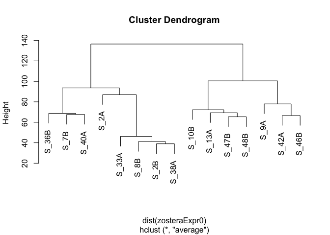
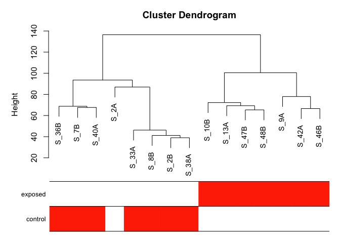
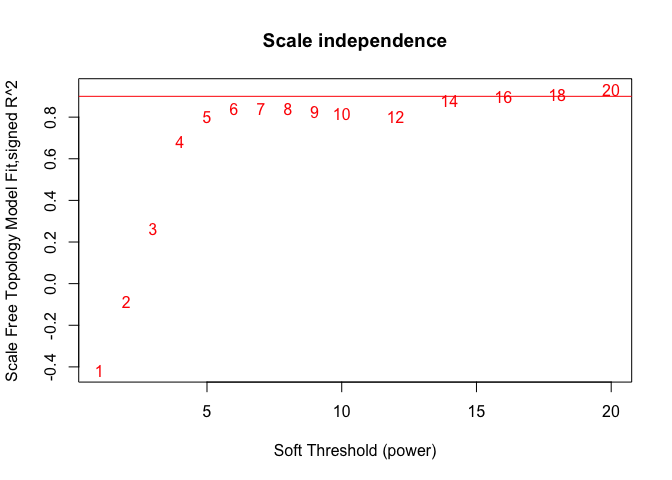
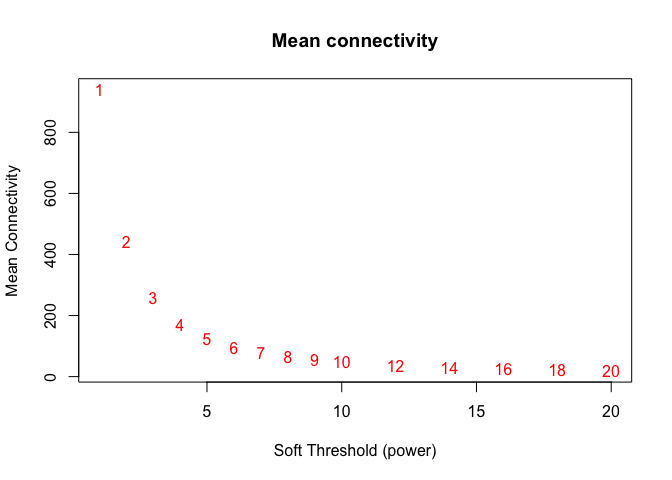
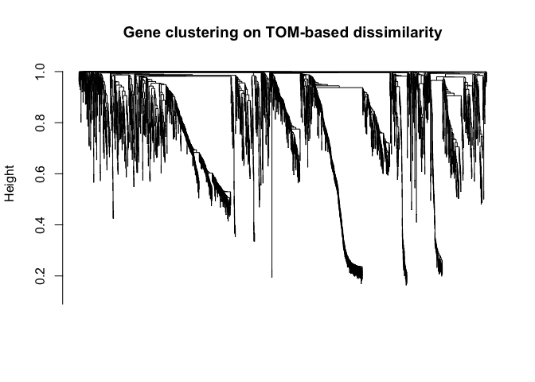
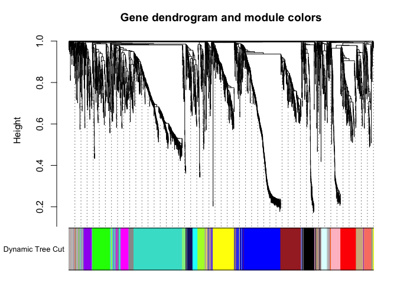
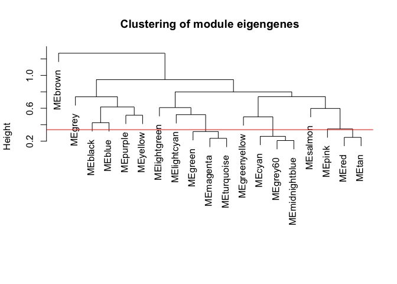
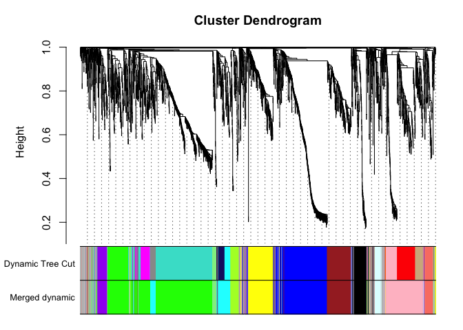
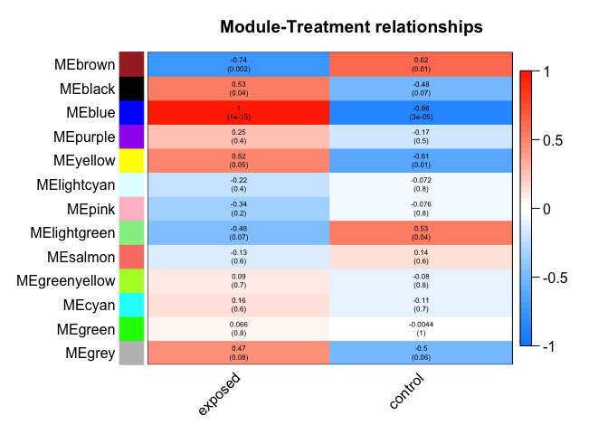

WGCNA
================
Yaamini Venkataraman
7/8/2020

In this script, I will conduct a WGCNA to understand *Z. marina* gene
expression patterns. The code is based on [tutorials from the WGCNA
package](https://horvath.genetics.ucla.edu/html/CoexpressionNetwork/Rpackages/WGCNA/Tutorials/index.html).

# Set up R Markdown file

# Install packages

``` r
#install.packages("dichromat")
#install.packages("BiocManager")
#BiocManager::install("WGCNA")
```

``` r
require(dichromat)
```

    ## Loading required package: dichromat

``` r
require(WGCNA)
```

    ## Loading required package: WGCNA

    ## Loading required package: dynamicTreeCut

    ## Loading required package: fastcluster

    ## 
    ## Attaching package: 'fastcluster'

    ## The following object is masked from 'package:stats':
    ## 
    ##     hclust

    ## 

    ## 
    ## Attaching package: 'WGCNA'

    ## The following object is masked from 'package:stats':
    ## 
    ##     cor

``` r
options(stringsAsFactors = FALSE) #Important setting to include from tutorial
```

# Obtain session information

``` r
sessionInfo() #Obtain session information
```

    ## R version 4.0.0 (2020-04-24)
    ## Platform: x86_64-apple-darwin17.0 (64-bit)
    ## Running under: macOS Catalina 10.15.6
    ## 
    ## Matrix products: default
    ## BLAS:   /Library/Frameworks/R.framework/Versions/4.0/Resources/lib/libRblas.dylib
    ## LAPACK: /Library/Frameworks/R.framework/Versions/4.0/Resources/lib/libRlapack.dylib
    ## 
    ## locale:
    ## [1] en_US.UTF-8/en_US.UTF-8/en_US.UTF-8/C/en_US.UTF-8/en_US.UTF-8
    ## 
    ## attached base packages:
    ## [1] stats     graphics  grDevices utils     datasets  methods   base     
    ## 
    ## other attached packages:
    ## [1] WGCNA_1.69            fastcluster_1.1.25    dynamicTreeCut_1.63-1
    ## [4] dichromat_2.0-0      
    ## 
    ## loaded via a namespace (and not attached):
    ##  [1] Rcpp_1.0.5            lattice_0.20-41       GO.db_3.11.4         
    ##  [4] png_0.1-7             digest_0.6.25         foreach_1.5.0        
    ##  [7] R6_2.4.1              backports_1.1.8       acepack_1.4.1        
    ## [10] stats4_4.0.0          RSQLite_2.2.0         evaluate_0.14        
    ## [13] ggplot2_3.3.2         pillar_1.4.4          rlang_0.4.6          
    ## [16] data.table_1.12.8     rstudioapi_0.11       blob_1.2.1           
    ## [19] S4Vectors_0.26.1      rpart_4.1-15          Matrix_1.2-18        
    ## [22] preprocessCore_1.50.0 checkmate_2.0.0       rmarkdown_2.3        
    ## [25] splines_4.0.0         stringr_1.4.0         foreign_0.8-80       
    ## [28] htmlwidgets_1.5.1     bit_1.1-15.2          munsell_0.5.0        
    ## [31] compiler_4.0.0        xfun_0.15             pkgconfig_2.0.3      
    ## [34] BiocGenerics_0.34.0   base64enc_0.1-3       htmltools_0.5.0      
    ## [37] nnet_7.3-14           tidyselect_1.1.0      htmlTable_2.0.1      
    ## [40] gridExtra_2.3         tibble_3.0.2          Hmisc_4.4-0          
    ## [43] IRanges_2.22.2        codetools_0.2-16      matrixStats_0.56.0   
    ## [46] crayon_1.3.4          dplyr_1.0.0           grid_4.0.0           
    ## [49] gtable_0.3.0          lifecycle_0.2.0       DBI_1.1.0            
    ## [52] magrittr_1.5          scales_1.1.1          impute_1.62.0        
    ## [55] stringi_1.4.6         doParallel_1.0.15     latticeExtra_0.6-29  
    ## [58] ellipsis_0.3.1        generics_0.0.2        vctrs_0.3.1          
    ## [61] Formula_1.2-3         RColorBrewer_1.1-2    iterators_1.0.12     
    ## [64] tools_4.0.0           bit64_0.9-7           Biobase_2.48.0       
    ## [67] glue_1.4.1            purrr_0.3.4           jpeg_0.1-8.1         
    ## [70] parallel_4.0.0        survival_3.2-3        yaml_2.2.1           
    ## [73] AnnotationDbi_1.50.1  colorspace_1.4-1      cluster_2.1.0        
    ## [76] memoise_1.1.0         knitr_1.29

# Format data

Relevant tutorial:
<https://horvath.genetics.ucla.edu/html/CoexpressionNetwork/Rpackages/WGCNA/Tutorials/FemaleLiver-01-dataInput.pdf>

## Import log CPM data

``` r
zosteraAllGenes <- read.delim("../EdgeR/EXP.CON.Zostera.logCPM.txt", header = TRUE, quote = "") #Import data with log CPM information for all expressed genes
head(zosteraAllGenes) #Confirm import
```

    ##                   GeneID    S_10B     S_9A    S_13A    S_42A    S_46B    S_47B
    ## 1 TRINITY_DN102005_c0_g1 1.060435 1.060435 2.009724 1.854878 1.060435 1.060435
    ## 2 TRINITY_DN102006_c0_g1 1.060435 1.498523 1.060435 1.060435 1.060435 2.220749
    ## 3 TRINITY_DN102012_c0_g1 1.060435 1.498523 1.060435 3.841850 2.076238 1.060435
    ## 4 TRINITY_DN102024_c0_g1 2.705404 1.060435 1.060435 1.060435 1.060435 1.060435
    ## 5 TRINITY_DN102050_c0_g1 2.334413 2.334984 1.060435 1.060435 1.060435 1.060435
    ## 6 TRINITY_DN102051_c0_g1 1.060435 1.060435 1.060435 1.854878 2.401306 1.060435
    ##      S_48B     S_2A     S_2B     S_7B     S_8B    S_33A    S_36B    S_38A
    ## 1 1.060435 1.060435 1.060435 2.269899 1.060435 1.775038 2.160810 1.060435
    ## 2 1.060435 1.988649 1.531364 5.008820 1.060435 1.060435 2.396989 1.555101
    ## 3 1.993144 1.440026 1.060435 2.918429 1.060435 1.060435 2.160810 1.060435
    ## 4 2.554960 1.988649 1.060435 1.060435 2.035084 4.708736 1.060435 1.060435
    ## 5 1.060435 3.168358 1.885816 2.461326 1.060435 1.060435 3.327576 1.060435
    ## 6 1.060435 2.200489 1.060435 1.060435 2.035084 1.060435 1.526533 1.060435
    ##      S_40A
    ## 1 1.060435
    ## 2 2.134830
    ## 3 4.584684
    ## 4 1.060435
    ## 5 1.060435
    ## 6 1.060435

``` r
zosteraExpr0 <- as.data.frame(t(zosteraAllGenes[,-1])) #Transpose dataframe to format for WGCNA package. Do not include the first column of gene IDs
names(zosteraExpr0) <- zosteraAllGenes$GeneID #Use gene ID as column names
head(zosteraExpr0) #Confirm formatting
```

    ##       TRINITY_DN102005_c0_g1 TRINITY_DN102006_c0_g1 TRINITY_DN102012_c0_g1
    ## S_10B               1.060435               1.060435               1.060435
    ## S_9A                1.060435               1.498523               1.498523
    ## S_13A               2.009724               1.060435               1.060435
    ## S_42A               1.854878               1.060435               3.841850
    ## S_46B               1.060435               1.060435               2.076238
    ## S_47B               1.060435               2.220749               1.060435
    ##       TRINITY_DN102024_c0_g1 TRINITY_DN102050_c0_g1 TRINITY_DN102051_c0_g1
    ## S_10B               2.705404               2.334413               1.060435
    ## S_9A                1.060435               2.334984               1.060435
    ## S_13A               1.060435               1.060435               1.060435
    ## S_42A               1.060435               1.060435               1.854878
    ## S_46B               1.060435               1.060435               2.401306
    ## S_47B               1.060435               1.060435               1.060435
    ##       TRINITY_DN102060_c0_g1 TRINITY_DN10208_c0_g1 TRINITY_DN102368_c0_g1
    ## S_10B               1.060435              1.060435               1.060435
    ## S_9A                1.060435              1.498523               3.000964
    ## S_13A               2.009724              2.009724               1.060435
    ## S_42A               1.060435              1.854878               1.060435
    ## S_46B               1.060435              2.076238               1.655952
    ## S_47B               1.060435              2.855422               1.060435
    ##       TRINITY_DN102375_c0_g1 TRINITY_DN102378_c0_g1 TRINITY_DN102429_c0_g1
    ## S_10B               1.060435               1.060435               1.060435
    ## S_9A                1.834107               1.060435               2.334984
    ## S_13A               1.060435               1.060435               3.300347
    ## S_42A               2.739960               1.060435               3.037763
    ## S_46B               2.076238               1.060435               1.060435
    ## S_47B               1.060435               1.060435               1.060435
    ##       TRINITY_DN102431_c0_g1 TRINITY_DN102501_c0_g1 TRINITY_DN102508_c0_g1
    ## S_10B               1.060435               1.060435               1.060435
    ## S_9A                1.060435               2.106174               1.060435
    ## S_13A               2.577379               1.060435               1.060435
    ## S_42A               1.060435               1.060435               1.854878
    ## S_46B               2.076238               1.060435               1.060435
    ## S_47B               3.630958               1.060435               1.060435
    ##       TRINITY_DN102663_c0_g1 TRINITY_DN102664_c0_g1 TRINITY_DN104204_c0_g1
    ## S_10B               1.060435               1.060435               1.060435
    ## S_9A                2.532423               2.334984               1.498523
    ## S_13A               1.060435               2.009724               1.060435
    ## S_42A               3.988270               1.060435               1.060435
    ## S_46B               3.671640               2.666430               2.076238
    ## S_47B               1.060435               2.220749               1.060435
    ##       TRINITY_DN104215_c0_g1 TRINITY_DN104274_c0_g1 TRINITY_DN104326_c0_g1
    ## S_10B               1.060435               1.060435               1.833703
    ## S_9A                2.532423               1.060435               1.834107
    ## S_13A               1.060435               1.060435               1.060435
    ## S_42A               1.060435               1.060435               1.854878
    ## S_46B               1.060435               1.060435               1.060435
    ## S_47B               1.060435               1.060435               1.060435
    ##       TRINITY_DN104336_c0_g1 TRINITY_DN104339_c0_g1 TRINITY_DN104366_c0_g1
    ## S_10B               1.833703               1.060435               1.060435
    ## S_9A                2.106174               1.498523               2.106174
    ## S_13A               1.060435               1.060435               1.060435
    ## S_42A               1.060435               1.060435               1.060435
    ## S_46B               1.060435               2.076238               1.060435
    ## S_47B               3.294686               1.060435               1.060435
    ##       TRINITY_DN104382_c0_g1 TRINITY_DN104613_c0_g1 TRINITY_DN104617_c0_g1
    ## S_10B               1.060435               1.060435               1.060435
    ## S_9A                1.060435               1.060435               1.060435
    ## S_13A               2.009724               1.060435               1.060435
    ## S_42A               2.364254               1.060435               2.739960
    ## S_46B               2.666430               1.060435               1.060435
    ## S_47B               1.060435               1.060435               1.060435
    ##       TRINITY_DN104657_c0_g1 TRINITY_DN104659_c0_g1 TRINITY_DN104662_c0_g1
    ## S_10B               1.060435               1.060435               1.060435
    ## S_9A                1.060435               2.106174               1.060435
    ## S_13A               1.060435               1.060435               1.060435
    ## S_42A               1.854878               1.060435               2.364254
    ## S_46B               1.060435               2.076238               1.060435
    ## S_47B               1.060435               1.060435               1.060435
    ##       TRINITY_DN104668_c0_g1 TRINITY_DN104808_c0_g1 TRINITY_DN104822_c0_g1
    ## S_10B               1.833703               1.060435               1.060435
    ## S_9A                1.498523               2.334984               1.498523
    ## S_13A               1.060435               1.060435               3.970485
    ## S_42A               1.060435               1.060435               3.284488
    ## S_46B               1.060435               1.655952               1.655952
    ## S_47B               2.220749               1.060435               1.060435
    ##       TRINITY_DN104879_c0_g1 TRINITY_DN105034_c0_g1 TRINITY_DN105050_c0_g1
    ## S_10B               4.309827               1.060435               1.060435
    ## S_9A                1.834107               1.060435               1.498523
    ## S_13A               2.983684               1.060435               2.577379
    ## S_42A               2.739960               2.739960               1.854878
    ## S_46B               2.401306               1.060435               2.076238
    ## S_47B               5.152626               1.060435               4.504107
    ##       TRINITY_DN105056_c0_g1 TRINITY_DN105100_c0_g1 TRINITY_DN105130_c0_g1
    ## S_10B               1.060435               1.060435               1.060435
    ## S_9A                3.454866               1.060435               2.106174
    ## S_13A               1.060435               2.983684               2.983684
    ## S_42A               2.739960               1.854878               3.495116
    ## S_46B               2.076238               1.655952               1.060435
    ## S_47B               2.220749               1.060435               1.060435
    ##       TRINITY_DN105306_c0_g1 TRINITY_DN105309_c0_g1 TRINITY_DN10562_c0_g1
    ## S_10B               1.060435               1.060435              4.198022
    ## S_9A                1.834107               1.060435              2.106174
    ## S_13A               1.060435               2.009724              2.009724
    ## S_42A               1.854878               1.060435              2.364254
    ## S_46B               1.655952               1.060435              2.076238
    ## S_47B               1.060435               1.060435              3.630958
    ##       TRINITY_DN106037_c0_g1 TRINITY_DN106038_c0_g1 TRINITY_DN106057_c0_g1
    ## S_10B               1.060435               1.060435               1.060435
    ## S_9A                2.334984               1.498523               1.060435
    ## S_13A               1.060435               1.060435               1.060435
    ## S_42A               1.854878               1.060435               1.854878
    ## S_46B               1.655952               1.060435               1.060435
    ## S_47B               1.060435               2.220749               1.060435
    ##       TRINITY_DN10633_c0_g1 TRINITY_DN106380_c0_g1 TRINITY_DN106385_c0_g1
    ## S_10B              1.060435               1.060435               1.833703
    ## S_9A               1.060435               1.060435               1.498523
    ## S_13A              1.060435               1.060435               1.060435
    ## S_42A              1.060435               3.495116               1.854878
    ## S_46B              1.060435               2.076238               2.401306
    ## S_47B              1.060435               1.060435               1.060435
    ##       TRINITY_DN106757_c0_g1 TRINITY_DN106784_c0_g1 TRINITY_DN106794_c0_g1
    ## S_10B               1.833703               1.060435               1.060435
    ## S_9A                2.532423               1.060435               1.060435
    ## S_13A               3.559861               1.060435               1.060435
    ## S_42A               1.060435               1.854878               1.060435
    ## S_46B               1.060435               1.060435               1.655952
    ## S_47B               1.060435               1.060435               1.060435
    ##       TRINITY_DN106798_c0_g1 TRINITY_DN11011_c0_g1 TRINITY_DN110214_c0_g1
    ## S_10B               1.060435              1.060435               1.060435
    ## S_9A                1.060435              1.834107               1.060435
    ## S_13A               1.060435              1.060435               1.060435
    ## S_42A               1.060435              1.060435               1.060435
    ## S_46B               1.060435              1.655952               1.060435
    ## S_47B               1.060435              1.060435               1.060435
    ##       TRINITY_DN110238_c0_g1 TRINITY_DN110403_c0_g1 TRINITY_DN110409_c0_g1
    ## S_10B               1.060435               1.060435               1.060435
    ## S_9A                1.498523               1.498523               1.834107
    ## S_13A               1.060435               1.060435               2.009724
    ## S_42A               1.060435               1.060435               1.060435
    ## S_46B               1.655952               1.655952               1.060435
    ## S_47B               1.060435               1.060435               1.060435
    ##       TRINITY_DN110605_c0_g1 TRINITY_DN11064_c0_g1 TRINITY_DN11123_c0_g1
    ## S_10B               2.334413              1.060435              1.060435
    ## S_9A                1.060435              1.834107              1.060435
    ## S_13A               1.060435              1.060435              1.060435
    ## S_42A               1.854878              2.739960              1.060435
    ## S_46B               1.060435              1.655952              1.655952
    ## S_47B               1.060435              1.060435              1.060435
    ##       TRINITY_DN111410_c0_g1 TRINITY_DN111418_c0_g1 TRINITY_DN111467_c0_g1
    ## S_10B               6.191308               1.060435               1.833703
    ## S_9A                4.255874               1.060435               1.060435
    ## S_13A               7.816069               1.060435               3.300347
    ## S_42A               3.037763               1.854878               2.364254
    ## S_46B               3.407565               1.060435               1.060435
    ## S_47B               4.330281               1.060435               1.060435
    ##       TRINITY_DN11147_c0_g1 TRINITY_DN111503_c0_g1 TRINITY_DN11152_c0_g1
    ## S_10B              1.060435               1.060435              1.060435
    ## S_9A               1.060435               1.834107              1.498523
    ## S_13A              1.060435               2.009724              1.060435
    ## S_42A              1.854878               1.060435              1.060435
    ## S_46B              1.060435               1.655952              2.401306
    ## S_47B              1.060435               1.060435              1.060435
    ##       TRINITY_DN111543_c0_g1 TRINITY_DN11157_c0_g1 TRINITY_DN111582_c0_g1
    ## S_10B               1.060435              1.060435               1.060435
    ## S_9A                1.498523              1.498523               1.060435
    ## S_13A               1.060435              1.060435               1.060435
    ## S_42A               3.037763              1.854878               1.854878
    ## S_46B               2.890313              1.060435               1.060435
    ## S_47B               2.220749              1.060435               1.060435
    ##       TRINITY_DN111591_c0_g1 TRINITY_DN111592_c0_g1 TRINITY_DN111761_c0_g1
    ## S_10B               1.833703               1.060435               1.060435
    ## S_9A                1.834107               1.834107               1.498523
    ## S_13A               2.577379               1.060435               1.060435
    ## S_42A               1.854878               3.495116               4.459238
    ## S_46B               1.060435               1.060435               2.666430
    ## S_47B               1.060435               1.060435               1.060435
    ##       TRINITY_DN111763_c0_g1 TRINITY_DN111787_c0_g1 TRINITY_DN114041_c0_g1
    ## S_10B               1.060435               1.060435               1.060435
    ## S_9A                1.060435               1.498523               1.060435
    ## S_13A               1.060435               1.060435               2.009724
    ## S_42A               1.060435               1.060435               1.854878
    ## S_46B               1.060435               1.060435               1.060435
    ## S_47B               1.060435               1.060435               1.060435
    ##       TRINITY_DN11409_c0_g1 TRINITY_DN114822_c0_g1 TRINITY_DN114829_c0_g1
    ## S_10B              1.060435               1.060435               1.060435
    ## S_9A               1.498523               3.945334               1.060435
    ## S_13A              1.060435               1.060435               1.060435
    ## S_42A              1.060435               3.841850               1.854878
    ## S_46B              1.655952               3.254868               1.060435
    ## S_47B              2.220749               1.060435               1.060435
    ##       TRINITY_DN115553_c0_g1 TRINITY_DN115800_c0_g1 TRINITY_DN115882_c0_g1
    ## S_10B               1.060435               1.060435               1.060435
    ## S_9A                1.498523               2.106174               1.060435
    ## S_13A               1.060435               1.060435               1.060435
    ## S_42A               1.854878               2.739960               2.364254
    ## S_46B               1.655952               1.060435               1.655952
    ## S_47B               1.060435               1.060435               3.630958
    ##       TRINITY_DN115924_c0_g1 TRINITY_DN116732_c0_g1 TRINITY_DN116735_c0_g2
    ## S_10B               2.705404               1.060435               1.060435
    ## S_9A                1.060435               1.060435               2.106174
    ## S_13A               1.060435               1.060435               1.060435
    ## S_42A               1.060435               1.060435               1.060435
    ## S_46B               1.060435               1.060435               2.076238
    ## S_47B               1.060435               1.060435               1.060435
    ##       TRINITY_DN116770_c0_g1 TRINITY_DN116779_c0_g1 TRINITY_DN119014_c0_g1
    ## S_10B               1.060435               1.060435               1.060435
    ## S_9A                1.498523               1.498523               1.060435
    ## S_13A               1.060435               2.577379               1.060435
    ## S_42A               1.854878               2.364254               1.854878
    ## S_46B               1.060435               1.060435               1.060435
    ## S_47B               1.060435               1.060435               1.060435
    ##       TRINITY_DN119018_c0_g1 TRINITY_DN119056_c0_g1 TRINITY_DN1195_c0_g1
    ## S_10B               1.060435               1.060435             2.705404
    ## S_9A                2.861037               1.498523             1.498523
    ## S_13A               1.060435               2.983684             1.060435
    ## S_42A               1.060435               2.739960             1.854878
    ## S_46B               1.655952               2.076238             1.060435
    ## S_47B               1.060435               1.060435             1.060435
    ##       TRINITY_DN119657_c0_g1 TRINITY_DN119659_c0_g1 TRINITY_DN1313_c0_g1
    ## S_10B               1.060435               1.060435             2.334413
    ## S_9A                1.060435               1.498523             1.060435
    ## S_13A               1.060435               1.060435             2.009724
    ## S_42A               1.060435               1.060435             1.060435
    ## S_46B               1.060435               1.060435             1.060435
    ## S_47B               1.060435               1.060435             1.060435
    ##       TRINITY_DN1318_c0_g1 TRINITY_DN13602_c0_g1 TRINITY_DN136045_c0_g1
    ## S_10B             1.060435              1.060435               1.060435
    ## S_9A              1.060435              1.834107               1.060435
    ## S_13A             1.060435              1.060435               1.060435
    ## S_42A             1.060435              2.739960               3.284488
    ## S_46B             1.060435              2.076238               1.060435
    ## S_47B             1.060435              1.060435               1.060435
    ##       TRINITY_DN136047_c0_g1 TRINITY_DN136912_c0_g1 TRINITY_DN136945_c0_g1
    ## S_10B               1.060435               1.060435               1.060435
    ## S_9A                1.060435               1.834107               1.498523
    ## S_13A               1.060435               2.009724               1.060435
    ## S_42A               1.060435               1.060435               2.364254
    ## S_46B               1.060435               1.655952               1.060435
    ## S_47B               1.060435               1.060435               1.060435
    ##       TRINITY_DN1396_c0_g1 TRINITY_DN139711_c0_g1 TRINITY_DN139737_c0_g1
    ## S_10B             1.060435               2.334413               1.060435
    ## S_9A              2.861037               1.060435               1.498523
    ## S_13A             1.060435               3.559861               1.060435
    ## S_42A             1.854878               1.060435               1.854878
    ## S_46B             3.787517               1.655952               1.655952
    ## S_47B             1.060435               2.220749               1.060435
    ##       TRINITY_DN139762_c0_g1 TRINITY_DN139765_c0_g1 TRINITY_DN139775_c0_g1
    ## S_10B               1.060435               2.334413               1.060435
    ## S_9A                1.060435               1.060435               2.532423
    ## S_13A               1.060435               1.060435               1.060435
    ## S_42A               1.060435               1.854878               1.060435
    ## S_46B               1.060435               2.076238               1.060435
    ## S_47B               1.060435               1.060435               1.060435
    ##       TRINITY_DN1500_c0_g1 TRINITY_DN15057_c0_g1 TRINITY_DN15060_c0_g1
    ## S_10B             1.060435              1.060435              1.060435
    ## S_9A              1.498523              1.498523              1.498523
    ## S_13A             1.060435              1.060435              1.060435
    ## S_42A             2.364254              1.060435              1.060435
    ## S_46B             1.060435              1.060435              1.060435
    ## S_47B             1.060435              1.060435              1.060435
    ##       TRINITY_DN15064_c0_g1 TRINITY_DN150674_c0_g1 TRINITY_DN1511_c0_g1
    ## S_10B              1.060435               1.060435             1.060435
    ## S_9A               1.498523               1.060435             2.532423
    ## S_13A              2.009724               2.577379             1.060435
    ## S_42A              1.854878               3.037763             1.060435
    ## S_46B              1.060435               1.655952             1.060435
    ## S_47B              1.060435               1.060435             1.060435
    ##       TRINITY_DN151358_c0_g1 TRINITY_DN15136_c0_g1 TRINITY_DN151574_c0_g1
    ## S_10B               1.060435              1.060435               1.060435
    ## S_9A                1.060435              1.060435               1.060435
    ## S_13A               2.983684              1.060435               1.060435
    ## S_42A               1.854878              1.854878               1.060435
    ## S_46B               1.060435              1.060435               1.060435
    ## S_47B               2.220749              1.060435               2.220749
    ##       TRINITY_DN151582_c0_g1 TRINITY_DN151589_c0_g1 TRINITY_DN151641_c0_g1
    ## S_10B               1.060435               1.060435               1.060435
    ## S_9A                1.498523               1.060435               1.060435
    ## S_13A               1.060435               1.060435               1.060435
    ## S_42A               1.854878               1.060435               1.060435
    ## S_46B               1.060435               1.060435               2.076238
    ## S_47B               1.060435               2.220749               1.060435
    ##       TRINITY_DN151645_c0_g1 TRINITY_DN15165_c0_g1 TRINITY_DN151688_c0_g1
    ## S_10B               1.060435              1.060435               1.060435
    ## S_9A                1.060435              1.498523               1.060435
    ## S_13A               3.559861              1.060435               2.577379
    ## S_42A               3.284488              1.060435               1.060435
    ## S_46B               2.666430              1.060435               2.666430
    ## S_47B               2.855422              2.220749               3.903476
    ##       TRINITY_DN151696_c0_g1 TRINITY_DN151698_c0_g1 TRINITY_DN151705_c0_g1
    ## S_10B               1.060435               1.060435               1.060435
    ## S_9A                1.060435               1.060435               1.060435
    ## S_13A               1.060435               2.009724               3.300347
    ## S_42A               1.854878               2.364254               1.060435
    ## S_46B               1.060435               2.076238               2.666430
    ## S_47B               1.060435               1.060435               4.799269
    ##       TRINITY_DN151783_c0_g1 TRINITY_DN1545_c0_g1 TRINITY_DN154815_c0_g1
    ## S_10B               1.060435             3.454077               1.060435
    ## S_9A                2.706066             1.834107               1.060435
    ## S_13A               1.060435             2.577379               1.060435
    ## S_42A               1.060435             1.060435               1.854878
    ## S_46B               1.060435             1.060435               2.401306
    ## S_47B               1.060435             1.060435               2.220749
    ##       TRINITY_DN154819_c0_g1 TRINITY_DN154829_c0_g1 TRINITY_DN1602_c0_g1
    ## S_10B               1.060435               1.060435             1.060435
    ## S_9A                2.706066               1.060435             1.498523
    ## S_13A               1.060435               1.060435             1.060435
    ## S_42A               1.060435               1.060435             3.495116
    ## S_46B               2.401306               1.060435             1.060435
    ## S_47B               1.060435               1.060435             1.060435
    ##       TRINITY_DN16031_c0_g1 TRINITY_DN160346_c0_g1 TRINITY_DN1604_c0_g1
    ## S_10B              1.060435               1.060435             1.060435
    ## S_9A               1.498523               1.498523             1.498523
    ## S_13A              1.060435               2.577379             1.060435
    ## S_42A              1.854878               2.364254             4.556349
    ## S_46B              2.401306               2.401306             2.401306
    ## S_47B              1.060435               2.855422             3.630958
    ##       TRINITY_DN1723_c0_g1 TRINITY_DN1726_c0_g1 TRINITY_DN172833_c0_g1
    ## S_10B             1.060435             1.060435               1.060435
    ## S_9A              3.245693             2.706066               1.060435
    ## S_13A             1.060435             2.009724               1.060435
    ## S_42A             1.060435             1.060435               1.060435
    ## S_46B             1.060435             1.655952               1.060435
    ## S_47B             1.060435             2.220749               1.060435
    ##       TRINITY_DN172838_c0_g1 TRINITY_DN172838_c1_g1 TRINITY_DN172839_c0_g1
    ## S_10B               4.843312               1.060435               1.060435
    ## S_9A                5.368215               3.000964               1.834107
    ## S_13A               4.551021               2.009724               2.577379
    ## S_42A               5.098043               1.854878               1.060435
    ## S_46B               4.996686               1.060435               2.076238
    ## S_47B               6.109700               1.060435               2.220749
    ##       TRINITY_DN172865_c0_g1 TRINITY_DN172870_c0_g1 TRINITY_DN172872_c0_g2
    ## S_10B               1.060435               1.060435               1.060435
    ## S_9A                2.861037               1.498523               1.060435
    ## S_13A               2.009724               1.060435               1.060435
    ## S_42A               1.060435               1.060435               1.060435
    ## S_46B               1.655952               1.060435               1.060435
    ## S_47B               1.060435               1.060435               1.060435
    ##       TRINITY_DN172938_c0_g1 TRINITY_DN172940_c0_g1 TRINITY_DN172943_c0_g1
    ## S_10B               1.060435               1.060435               1.060435
    ## S_9A                2.106174               1.060435               3.245693
    ## S_13A               2.009724               2.983684               1.060435
    ## S_42A               1.060435               1.060435               1.854878
    ## S_46B               1.655952               2.076238               2.076238
    ## S_47B               2.220749               4.330281               1.060435
    ##       TRINITY_DN173143_c0_g1 TRINITY_DN173146_c0_g1 TRINITY_DN173172_c0_g1
    ## S_10B               1.060435               1.060435               1.060435
    ## S_9A                1.060435               1.498523               1.834107
    ## S_13A               1.060435               1.060435               1.060435
    ## S_42A               3.284488               1.060435               1.060435
    ## S_46B               1.060435               1.655952               1.060435
    ## S_47B               1.060435               1.060435               1.060435
    ##       TRINITY_DN173266_c0_g1 TRINITY_DN173575_c0_g1 TRINITY_DN173576_c0_g1
    ## S_10B               1.060435               1.060435               1.060435
    ## S_9A                3.354067               1.060435               1.060435
    ## S_13A               2.009724               1.060435               1.060435
    ## S_42A               1.060435               2.739960               2.739960
    ## S_46B               1.060435               2.666430               1.060435
    ## S_47B               1.060435               1.060435               1.060435
    ##       TRINITY_DN173733_c0_g1 TRINITY_DN173734_c0_g1 TRINITY_DN173771_c0_g1
    ## S_10B               1.060435               1.060435               1.060435
    ## S_9A                2.106174               3.128511               1.498523
    ## S_13A               3.300347               2.577379               2.009724
    ## S_42A               3.037763               1.060435               1.854878
    ## S_46B               3.545636               1.655952               1.060435
    ## S_47B               2.220749               1.060435               1.060435
    ##       TRINITY_DN173775_c0_g1 TRINITY_DN173777_c0_g1 TRINITY_DN173924_c0_g1
    ## S_10B               1.060435               1.060435               1.060435
    ## S_9A                1.834107               2.706066               1.498523
    ## S_13A               1.060435               1.060435               1.060435
    ## S_42A               1.060435               2.739960               1.060435
    ## S_46B               1.655952               2.076238               1.060435
    ## S_47B               1.060435               1.060435               1.060435
    ##       TRINITY_DN173924_c0_g2 TRINITY_DN173930_c0_g1 TRINITY_DN173935_c0_g2
    ## S_10B               1.060435               1.060435               1.060435
    ## S_9A                1.834107               2.861037               1.060435
    ## S_13A               1.060435               2.577379               1.060435
    ## S_42A               1.060435               2.739960               1.060435
    ## S_46B               1.060435               2.401306               1.060435
    ## S_47B               1.060435               1.060435               1.060435
    ##       TRINITY_DN173945_c0_g1 TRINITY_DN17396_c0_g1 TRINITY_DN173975_c0_g1
    ## S_10B               1.060435              1.060435               1.060435
    ## S_9A                1.060435              2.532423               1.060435
    ## S_13A               1.060435              1.060435               1.060435
    ## S_42A               1.060435              1.060435               1.854878
    ## S_46B               1.060435              3.545636               1.060435
    ## S_47B               1.060435              1.060435               1.060435
    ##       TRINITY_DN173977_c0_g1 TRINITY_DN173983_c0_g1 TRINITY_DN175067_c0_g1
    ## S_10B               1.060435               1.060435               1.060435
    ## S_9A                1.834107               1.060435               1.060435
    ## S_13A               1.060435               2.577379               1.060435
    ## S_42A               1.060435               1.060435               3.037763
    ## S_46B               1.060435               2.401306               1.060435
    ## S_47B               1.060435               2.220749               1.060435
    ##       TRINITY_DN175110_c0_g1 TRINITY_DN175123_c0_g1 TRINITY_DN175172_c0_g1
    ## S_10B               1.060435               1.060435               1.060435
    ## S_9A                1.834107               3.000964               1.834107
    ## S_13A               1.060435               2.983684               2.009724
    ## S_42A               1.060435               2.364254               1.060435
    ## S_46B               2.401306               1.060435               2.666430
    ## S_47B               1.060435               2.220749               3.294686
    ##       TRINITY_DN175181_c0_g1 TRINITY_DN175183_c0_g1 TRINITY_DN175244_c0_g1
    ## S_10B               1.060435               1.060435               1.060435
    ## S_9A                1.834107               1.498523               1.498523
    ## S_13A               1.060435               2.577379               2.577379
    ## S_42A               1.060435               1.060435               1.060435
    ## S_46B               1.060435               1.060435               1.060435
    ## S_47B               1.060435               1.060435               1.060435
    ##       TRINITY_DN175246_c0_g1 TRINITY_DN175296_c0_g1 TRINITY_DN175438_c0_g1
    ## S_10B               1.060435               7.476385               1.060435
    ## S_9A                2.706066               7.087683               1.498523
    ## S_13A               2.983684               7.558181               2.577379
    ## S_42A               2.739960               9.652256               1.060435
    ## S_46B               2.890313              10.236473               2.666430
    ## S_47B               1.060435               9.573543               1.060435
    ##       TRINITY_DN175462_c0_g1 TRINITY_DN175482_c0_g1 TRINITY_DN175487_c0_g1
    ## S_10B               1.060435               1.060435               1.060435
    ## S_9A                3.799619               1.498523               1.834107
    ## S_13A               3.300347               2.009724               3.779733
    ## S_42A               4.890218               3.495116               2.364254
    ## S_46B               3.787517               2.401306               1.060435
    ## S_47B               1.060435               1.060435               3.630958
    ##       TRINITY_DN1760_c0_g1 TRINITY_DN17630_c0_g1 TRINITY_DN17632_c0_g1
    ## S_10B             1.060435              1.060435              1.060435
    ## S_9A              2.706066              1.060435              3.128511
    ## S_13A             1.060435              1.060435              4.138936
    ## S_42A             1.854878              1.060435              3.495116
    ## S_46B             1.060435              1.655952              3.545636
    ## S_47B             2.220749              1.060435              2.220749
    ##       TRINITY_DN1764_c0_g1 TRINITY_DN17691_c0_g1 TRINITY_DN176933_c0_g1
    ## S_10B             1.060435              1.060435               1.060435
    ## S_9A              1.060435              1.060435               3.245693
    ## S_13A             1.060435              1.060435               1.060435
    ## S_42A             1.854878              1.854878               1.854878
    ## S_46B             1.060435              1.060435               1.655952
    ## S_47B             1.060435              1.060435               1.060435
    ##       TRINITY_DN176935_c0_g1 TRINITY_DN176942_c0_g1 TRINITY_DN176951_c0_g1
    ## S_10B               1.060435               1.060435               1.060435
    ## S_9A                1.498523               1.498523               1.060435
    ## S_13A               1.060435               2.009724               1.060435
    ## S_42A               2.364254               1.854878               1.060435
    ## S_46B               1.655952               1.060435               1.060435
    ## S_47B               1.060435               2.220749               1.060435
    ##       TRINITY_DN2101_c0_g1 TRINITY_DN21031_c0_g1 TRINITY_DN210344_c0_g2
    ## S_10B             1.060435              1.060435               1.060435
    ## S_9A              1.060435              1.498523               1.498523
    ## S_13A             1.060435              1.060435               3.300347
    ## S_42A             2.364254              2.364254               1.060435
    ## S_46B             2.666430              1.060435               1.060435
    ## S_47B             1.060435              1.060435               2.220749
    ##       TRINITY_DN211146_c0_g1 TRINITY_DN211148_c0_g1 TRINITY_DN211162_c0_g1
    ## S_10B               1.060435               1.060435               1.060435
    ## S_9A                3.245693               1.498523               1.060435
    ## S_13A               3.559861               2.009724               1.060435
    ## S_42A               1.060435               3.841850               2.739960
    ## S_46B               1.060435               1.060435               1.060435
    ## S_47B               1.060435               1.060435               1.060435
    ##       TRINITY_DN211627_c0_g1 TRINITY_DN2118_c0_g2 TRINITY_DN2119_c1_g1
    ## S_10B               1.060435             1.060435             3.944493
    ## S_9A                1.834107             2.334984             2.706066
    ## S_13A               1.060435             2.009724             1.060435
    ## S_42A               1.060435             1.854878             3.284488
    ## S_46B               2.076238             1.060435             2.890313
    ## S_47B               1.060435             1.060435             2.855422
    ##       TRINITY_DN2157_c0_g1 TRINITY_DN215871_c0_g1 TRINITY_DN215878_c0_g1
    ## S_10B             1.060435               1.060435               1.060435
    ## S_9A              1.834107               1.060435               1.060435
    ## S_13A             1.060435               2.009724               1.060435
    ## S_42A             1.854878               3.495116               2.364254
    ## S_46B             1.060435               3.084075               1.655952
    ## S_47B             1.060435               2.855422               1.060435
    ##       TRINITY_DN215898_c0_g1 TRINITY_DN2184_c0_g1 TRINITY_DN2200_c0_g1
    ## S_10B               1.060435             1.060435             1.060435
    ## S_9A                2.334984             1.498523             1.060435
    ## S_13A               1.060435             1.060435             1.060435
    ## S_42A               2.739960             1.854878             2.364254
    ## S_46B               3.671640             3.084075             2.076238
    ## S_47B               1.060435             1.060435             1.060435
    ##       TRINITY_DN22013_c0_g1 TRINITY_DN220166_c0_g1 TRINITY_DN220302_c0_g1
    ## S_10B              2.334413               1.060435               1.060435
    ## S_9A               1.498523               1.060435               2.532423
    ## S_13A              1.060435               1.060435               2.009724
    ## S_42A              1.060435               1.060435               2.739960
    ## S_46B              1.060435               2.076238               3.254868
    ## S_47B              1.060435               2.220749               1.060435
    ##       TRINITY_DN220327_c0_g1 TRINITY_DN22034_c0_g1 TRINITY_DN22035_c0_g1
    ## S_10B               1.060435              1.060435              3.000244
    ## S_9A                2.861037              3.128511              1.498523
    ## S_13A               1.060435              2.009724              2.577379
    ## S_42A               1.060435              1.060435              1.060435
    ## S_46B               1.060435              2.890313              1.060435
    ## S_47B               1.060435              1.060435              2.220749
    ##       TRINITY_DN220412_c0_g1 TRINITY_DN22043_c0_g1 TRINITY_DN220742_c0_g1
    ## S_10B               1.060435              1.060435               1.060435
    ## S_9A                1.060435              2.334984               2.106174
    ## S_13A               1.060435              1.060435               1.060435
    ## S_42A               1.060435              1.854878               1.060435
    ## S_46B               1.655952              1.655952               1.060435
    ## S_47B               1.060435              1.060435               1.060435
    ##       TRINITY_DN220743_c0_g1 TRINITY_DN220745_c0_g1 TRINITY_DN220746_c0_g1
    ## S_10B               1.060435               1.060435               2.705404
    ## S_9A                1.498523               1.060435               2.106174
    ## S_13A               1.060435               1.060435               1.060435
    ## S_42A               1.060435               1.060435               1.060435
    ## S_46B               1.655952               1.060435               1.060435
    ## S_47B               1.060435               1.060435               2.220749
    ##       TRINITY_DN222132_c0_g1 TRINITY_DN222900_c0_g1 TRINITY_DN222905_c0_g1
    ## S_10B               1.060435               3.000244               1.060435
    ## S_9A                1.060435               1.060435               1.060435
    ## S_13A               1.060435               1.060435               1.060435
    ## S_42A               1.060435               1.060435               3.988270
    ## S_46B               1.060435               1.060435               1.060435
    ## S_47B               1.060435               1.060435               1.060435
    ##       TRINITY_DN222921_c0_g1 TRINITY_DN222927_c0_g1 TRINITY_DN222928_c0_g1
    ## S_10B               1.060435               3.636706               1.060435
    ## S_9A                4.077673               2.106174               1.834107
    ## S_13A               2.009724               2.577379               1.060435
    ## S_42A               3.284488               2.364254               1.854878
    ## S_46B               3.994608               1.060435               1.060435
    ## S_47B               3.294686               2.220749               1.060435
    ##       TRINITY_DN222933_c0_g1 TRINITY_DN222938_c0_g1 TRINITY_DN222961_c0_g1
    ## S_10B               1.060435               1.060435               2.334413
    ## S_9A                3.000964               2.334984               1.498523
    ## S_13A               4.138936               1.060435               1.060435
    ## S_42A               4.242887               1.060435               1.060435
    ## S_46B               4.258335               1.655952               1.060435
    ## S_47B               2.220749               1.060435               1.060435
    ##       TRINITY_DN222967_c0_g1 TRINITY_DN222984_c0_g1 TRINITY_DN222992_c1_g1
    ## S_10B               2.334413               1.833703               1.060435
    ## S_9A                3.637516               4.255874               1.060435
    ## S_13A               2.577379               2.577379               2.009724
    ## S_42A               2.739960               3.037763               2.739960
    ## S_46B               2.666430               2.890313               2.401306
    ## S_47B               3.294686               1.060435               1.060435
    ##       TRINITY_DN223621_c0_g1 TRINITY_DN223622_c0_g1 TRINITY_DN223640_c0_g1
    ## S_10B               1.060435               1.060435               1.060435
    ## S_9A                3.637516               2.334984               1.060435
    ## S_13A               2.577379               1.060435               1.060435
    ## S_42A               1.854878               1.060435               1.060435
    ## S_46B               2.401306               1.060435               1.060435
    ## S_47B               1.060435               1.060435               1.060435
    ##       TRINITY_DN223644_c0_g1 TRINITY_DN22369_c0_g1 TRINITY_DN223802_c0_g1
    ## S_10B               7.677378             10.235954               1.060435
    ## S_9A                6.733650              9.086789               2.706066
    ## S_13A               7.262300             10.377282               1.060435
    ## S_42A               8.605826              9.238464               1.854878
    ## S_46B               8.949716              8.547020               3.254868
    ## S_47B               9.823669              9.704020               1.060435
    ##       TRINITY_DN223807_c0_g1 TRINITY_DN223830_c0_g1 TRINITY_DN223873_c0_g1
    ## S_10B               1.060435               3.244933               1.060435
    ## S_9A                1.060435               1.060435               1.498523
    ## S_13A               1.060435               2.009724               3.779733
    ## S_42A               4.459238               3.037763               2.739960
    ## S_46B               1.060435               1.060435               2.076238
    ## S_47B               1.060435               4.330281               1.060435
    ##       TRINITY_DN223874_c0_g1 TRINITY_DN223877_c0_g1 TRINITY_DN223890_c0_g1
    ## S_10B               1.060435               1.060435               1.060435
    ## S_9A                1.060435               1.834107               1.834107
    ## S_13A               1.060435               1.060435               1.060435
    ## S_42A               1.060435               1.854878               2.364254
    ## S_46B               1.060435               2.401306               1.060435
    ## S_47B               1.060435               1.060435               2.220749
    ##       TRINITY_DN223890_c1_g1 TRINITY_DN223891_c0_g2 TRINITY_DN223898_c0_g1
    ## S_10B               1.060435               1.060435               1.060435
    ## S_9A                1.060435               1.060435               1.060435
    ## S_13A               1.060435               3.300347               1.060435
    ## S_42A               2.364254               1.060435               1.060435
    ## S_46B               1.655952               1.060435               1.060435
    ## S_47B               1.060435               1.060435               1.060435
    ##       TRINITY_DN226043_c0_g1 TRINITY_DN226044_c0_g1 TRINITY_DN226045_c0_g1
    ## S_10B               1.060435               1.060435               1.060435
    ## S_9A                2.532423               2.861037               1.060435
    ## S_13A               1.060435               1.060435               1.060435
    ## S_42A               1.060435               3.988270               1.060435
    ## S_46B               2.076238               3.254868               1.060435
    ## S_47B               1.060435               1.060435               1.060435
    ##       TRINITY_DN226098_c0_g1 TRINITY_DN226098_c0_g2 TRINITY_DN22612_c0_g1
    ## S_10B               1.060435               1.060435              1.060435
    ## S_9A                1.834107               1.060435              1.498523
    ## S_13A               1.060435               1.060435              1.060435
    ## S_42A               2.364254               1.060435              1.060435
    ## S_46B               1.060435               1.060435              1.060435
    ## S_47B               1.060435               1.060435              1.060435
    ##       TRINITY_DN226165_c0_g1 TRINITY_DN226183_c0_g1 TRINITY_DN226185_c0_g1
    ## S_10B               1.060435               9.637134               1.833703
    ## S_9A                2.334984               7.913470               2.706066
    ## S_13A               1.060435               9.647422               1.060435
    ## S_42A               1.060435               8.811625               1.060435
    ## S_46B               1.060435               8.767674               1.060435
    ## S_47B               1.060435              10.075169               1.060435
    ##       TRINITY_DN226189_c0_g1 TRINITY_DN226191_c0_g1 TRINITY_DN226611_c0_g1
    ## S_10B               1.060435               1.060435               1.060435
    ## S_9A                1.060435               1.060435               1.060435
    ## S_13A               1.060435               1.060435               1.060435
    ## S_42A               1.854878               1.060435               2.364254
    ## S_46B               1.060435               1.060435               2.076238
    ## S_47B               1.060435               2.220749               1.060435
    ##       TRINITY_DN226613_c0_g1 TRINITY_DN226617_c0_g1 TRINITY_DN226618_c0_g1
    ## S_10B               1.833703               1.060435               1.060435
    ## S_9A                3.354067               1.834107               1.060435
    ## S_13A               2.009724               3.300347               1.060435
    ## S_42A               1.060435               2.364254               1.854878
    ## S_46B               1.060435               2.666430               1.060435
    ## S_47B               3.630958               1.060435               2.855422
    ##       TRINITY_DN226646_c0_g1 TRINITY_DN226649_c0_g1 TRINITY_DN226662_c0_g1
    ## S_10B               1.060435               1.833703               1.060435
    ## S_9A                1.060435               1.498523               1.060435
    ## S_13A               1.060435               2.009724               1.060435
    ## S_42A               3.841850               1.854878               1.060435
    ## S_46B               1.060435               1.060435               1.060435
    ## S_47B               1.060435               1.060435               1.060435
    ##       TRINITY_DN226664_c0_g1 TRINITY_DN226665_c1_g1 TRINITY_DN226686_c0_g1
    ## S_10B               8.288473               1.060435               9.273346
    ## S_9A                7.006983               1.060435               7.831481
    ## S_13A               8.457602               1.060435               9.319434
    ## S_42A               8.547963               1.060435               8.677738
    ## S_46B               9.130670               1.060435               8.767674
    ## S_47B               9.663354               1.060435               9.672491
    ##       TRINITY_DN226687_c0_g1 TRINITY_DN226689_c0_g1 TRINITY_DN226716_c0_g1
    ## S_10B               1.060435               1.060435               1.833703
    ## S_9A                2.334984               1.498523               1.060435
    ## S_13A               2.009724               1.060435               1.060435
    ## S_42A               4.121188               1.854878               1.854878
    ## S_46B               4.548472               1.655952               1.655952
    ## S_47B               1.060435               1.060435               1.060435
    ##       TRINITY_DN226743_c0_g1 TRINITY_DN226747_c0_g1 TRINITY_DN226748_c0_g1
    ## S_10B               1.060435               1.060435               1.060435
    ## S_9A                1.060435               1.498523               2.106174
    ## S_13A               1.060435               5.133025               1.060435
    ## S_42A               1.060435               3.678875               1.854878
    ## S_46B               1.060435               1.655952               2.076238
    ## S_47B               1.060435               2.220749               1.060435
    ##       TRINITY_DN226749_c0_g1 TRINITY_DN226750_c0_g1 TRINITY_DN226751_c0_g1
    ## S_10B               1.060435               1.060435               1.060435
    ## S_9A                2.334984               1.834107               2.532423
    ## S_13A               3.300347               1.060435               1.060435
    ## S_42A               3.678875               1.060435               1.060435
    ## S_46B               3.894775               1.060435               2.401306
    ## S_47B               3.294686               1.060435               1.060435
    ##       TRINITY_DN226754_c0_g1 TRINITY_DN226758_c0_g1 TRINITY_DN226913_c0_g1
    ## S_10B               1.833703               1.060435               1.060435
    ## S_9A                4.198885               1.498523               2.106174
    ## S_13A               5.867620               1.060435               1.060435
    ## S_42A               6.180736               1.854878               1.854878
    ## S_46B               6.566904               2.076238               2.401306
    ## S_47B               5.519607               1.060435               1.060435
    ##       TRINITY_DN226917_c0_g1 TRINITY_DN226922_c0_g1 TRINITY_DN226924_c0_g2
    ## S_10B               1.060435               1.833703               1.060435
    ## S_9A                1.498523               1.060435               1.498523
    ## S_13A               1.060435               4.772147               2.009724
    ## S_42A               1.060435               4.242887               1.854878
    ## S_46B               2.666430               2.401306               1.060435
    ## S_47B               1.060435               2.855422               1.060435
    ##       TRINITY_DN226946_c0_g1 TRINITY_DN22695_c0_g1 TRINITY_DN226962_c0_g1
    ## S_10B               1.060435              2.334413               1.060435
    ## S_9A                1.060435              2.106174               2.334984
    ## S_13A               1.060435              2.009724               1.060435
    ## S_42A               4.121188              1.060435               1.854878
    ## S_46B               2.401306              1.060435               2.076238
    ## S_47B               1.060435              1.060435               1.060435
    ##       TRINITY_DN226968_c0_g1 TRINITY_DN2272_c0_g1 TRINITY_DN227312_c0_g2
    ## S_10B               1.060435             1.060435               1.060435
    ## S_9A                1.060435             2.334984               1.060435
    ## S_13A               1.060435             1.060435               1.060435
    ## S_42A               1.060435             1.060435               2.364254
    ## S_46B               1.060435             3.254868               1.060435
    ## S_47B               1.060435             1.060435               1.060435
    ##       TRINITY_DN227315_c0_g1 TRINITY_DN227330_c0_g1 TRINITY_DN227332_c0_g1
    ## S_10B               3.244933               1.060435               1.060435
    ## S_9A                2.334984               1.060435               1.060435
    ## S_13A               2.009724               1.060435               1.060435
    ## S_42A               2.364254               1.854878               1.060435
    ## S_46B               1.060435               1.655952               1.060435
    ## S_47B               2.220749               2.220749               1.060435
    ##       TRINITY_DN227339_c0_g1 TRINITY_DN227348_c0_g1 TRINITY_DN227360_c0_g1
    ## S_10B               1.060435               1.060435               1.060435
    ## S_9A                3.000964               2.861037               2.106174
    ## S_13A               2.009724               2.009724               1.060435
    ## S_42A               1.854878               1.060435               1.060435
    ## S_46B               2.076238               1.655952               1.060435
    ## S_47B               1.060435               1.060435               2.220749
    ##       TRINITY_DN227360_c0_g2 TRINITY_DN227361_c0_g1 TRINITY_DN22737_c0_g1
    ## S_10B               1.060435               1.060435              1.060435
    ## S_9A                2.106174               1.060435              1.060435
    ## S_13A               3.559861               2.577379              1.060435
    ## S_42A               1.060435               3.037763              2.364254
    ## S_46B               1.060435               2.401306              1.060435
    ## S_47B               2.855422               1.060435              1.060435
    ##       TRINITY_DN227390_c0_g1 TRINITY_DN227391_c0_g1 TRINITY_DN227395_c0_g1
    ## S_10B               3.000244               1.060435               1.060435
    ## S_9A                1.060435               1.060435               1.834107
    ## S_13A               2.577379               1.060435               1.060435
    ## S_42A               3.284488               3.037763               1.060435
    ## S_46B               1.060435               1.655952               1.060435
    ## S_47B               1.060435               1.060435               1.060435
    ##       TRINITY_DN227395_c0_g2 TRINITY_DN227517_c0_g1 TRINITY_DN227518_c0_g1
    ## S_10B               1.060435               1.060435               1.060435
    ## S_9A                2.334984               3.549079               1.060435
    ## S_13A               3.300347               3.300347               3.300347
    ## S_42A               1.060435               3.284488               2.364254
    ## S_46B               2.076238               2.401306               1.060435
    ## S_47B               2.220749               1.060435               1.060435
    ##       TRINITY_DN227519_c0_g1 TRINITY_DN227521_c0_g1 TRINITY_DN227522_c0_g1
    ## S_10B               1.060435               1.060435               1.060435
    ## S_9A                2.532423               1.498523               1.060435
    ## S_13A               1.060435               1.060435               3.779733
    ## S_42A               1.060435               1.060435               1.854878
    ## S_46B               1.060435               1.060435               2.076238
    ## S_47B               1.060435               1.060435               2.855422
    ##       TRINITY_DN227532_c0_g1 TRINITY_DN227534_c0_g1 TRINITY_DN227581_c0_g1
    ## S_10B               1.060435               1.060435               1.060435
    ## S_9A                1.060435               1.060435               1.060435
    ## S_13A               1.060435               1.060435               1.060435
    ## S_42A               1.060435               2.739960               1.060435
    ## S_46B               1.060435               1.655952               1.060435
    ## S_47B               1.060435               1.060435               1.060435
    ##       TRINITY_DN227581_c0_g2 TRINITY_DN227587_c0_g1 TRINITY_DN227743_c0_g1
    ## S_10B               1.060435               1.060435               1.060435
    ## S_9A                1.060435               1.060435               1.834107
    ## S_13A               1.060435               2.009724               2.009724
    ## S_42A               1.060435               1.060435               1.060435
    ## S_46B               1.060435               1.060435               2.401306
    ## S_47B               2.220749               1.060435               1.060435
    ##       TRINITY_DN227744_c0_g1 TRINITY_DN22778_c0_g1 TRINITY_DN228021_c0_g1
    ## S_10B               1.060435              3.244933               1.060435
    ## S_9A                1.498523              3.549079               2.334984
    ## S_13A               1.060435              3.779733               1.060435
    ## S_42A               1.060435              1.854878               1.060435
    ## S_46B               1.060435              1.655952               2.076238
    ## S_47B               1.060435              3.294686               1.060435
    ##       TRINITY_DN228021_c1_g1 TRINITY_DN228029_c0_g1 TRINITY_DN228040_c0_g1
    ## S_10B               1.060435               1.060435               1.060435
    ## S_9A                1.060435               1.060435               1.060435
    ## S_13A               1.060435               1.060435               2.577379
    ## S_42A               1.060435               1.060435               1.060435
    ## S_46B               1.060435               1.655952               2.666430
    ## S_47B               1.060435               1.060435               5.253486
    ##       TRINITY_DN228041_c0_g1 TRINITY_DN228042_c0_g1 TRINITY_DN228043_c0_g1
    ## S_10B               1.060435               1.060435               3.798792
    ## S_9A                1.834107               1.060435               1.498523
    ## S_13A               4.426296               1.060435               1.060435
    ## S_42A               3.678875               1.060435               3.037763
    ## S_46B               1.655952               1.655952               2.666430
    ## S_47B               1.060435               1.060435               3.630958
    ##       TRINITY_DN228066_c0_g1 TRINITY_DN228081_c0_g1 TRINITY_DN228088_c0_g1
    ## S_10B               1.060435               1.060435               1.060435
    ## S_9A                1.060435               1.498523               1.498523
    ## S_13A               3.559861               2.009724               1.060435
    ## S_42A               1.854878               1.060435               3.495116
    ## S_46B               1.060435               2.076238               3.407565
    ## S_47B               1.060435               1.060435               1.060435
    ##       TRINITY_DN228089_c0_g1 TRINITY_DN231084_c0_g1 TRINITY_DN231087_c0_g1
    ## S_10B               1.060435               1.060435               1.060435
    ## S_9A                2.706066               1.498523               2.106174
    ## S_13A               2.009724               1.060435               1.060435
    ## S_42A               2.364254               1.854878               2.364254
    ## S_46B               2.076238               1.655952               2.076238
    ## S_47B               1.060435               1.060435               1.060435
    ##       TRINITY_DN231087_c1_g1 TRINITY_DN23109_c0_g1 TRINITY_DN231202_c0_g3
    ## S_10B               1.060435              1.060435               1.060435
    ## S_9A                1.498523              1.060435               1.834107
    ## S_13A               1.060435              2.009724               1.060435
    ## S_42A               2.364254              1.854878               3.037763
    ## S_46B               2.401306              1.060435               2.076238
    ## S_47B               1.060435              1.060435               1.060435
    ##       TRINITY_DN231207_c0_g1 TRINITY_DN231207_c1_g1 TRINITY_DN231213_c0_g1
    ## S_10B               4.413587               2.334413               1.060435
    ## S_9A                1.834107               1.060435               1.060435
    ## S_13A               2.009724               2.009724               1.060435
    ## S_42A               3.841850               1.854878               1.060435
    ## S_46B               2.076238               1.060435               2.076238
    ## S_47B               4.799269               3.294686               2.220749
    ##       TRINITY_DN231231_c0_g1 TRINITY_DN231241_c0_g1 TRINITY_DN231261_c0_g1
    ## S_10B               1.060435               1.060435               1.060435
    ## S_9A                1.498523               1.060435               1.498523
    ## S_13A               2.577379               1.060435               2.009724
    ## S_42A               1.060435               1.854878               1.060435
    ## S_46B               2.076238               2.076238               2.076238
    ## S_47B               1.060435               1.060435               1.060435
    ##       TRINITY_DN231298_c0_g1 TRINITY_DN231373_c0_g1 TRINITY_DN231502_c0_g1
    ## S_10B               1.060435               1.060435               1.833703
    ## S_9A                2.532423               2.106174               1.060435
    ## S_13A               1.060435               1.060435               1.060435
    ## S_42A               1.060435               1.854878               1.854878
    ## S_46B               1.060435               3.084075               1.060435
    ## S_47B               1.060435               1.060435               1.060435
    ##       TRINITY_DN231504_c0_g1 TRINITY_DN231506_c0_g1 TRINITY_DN231508_c0_g1
    ## S_10B               1.060435               1.060435               1.060435
    ## S_9A                1.060435               2.706066               1.834107
    ## S_13A               2.983684               1.060435               1.060435
    ## S_42A               1.060435               2.364254               1.854878
    ## S_46B               2.076238               2.401306               3.545636
    ## S_47B               3.630958               1.060435               2.220749
    ##       TRINITY_DN231519_c0_g1 TRINITY_DN231544_c0_g1 TRINITY_DN231545_c0_g1
    ## S_10B               1.060435               1.060435               1.060435
    ## S_9A                1.060435               1.498523               3.128511
    ## S_13A               2.009724               1.060435               1.060435
    ## S_42A               1.060435               3.988270               1.060435
    ## S_46B               1.060435               1.060435               2.890313
    ## S_47B               1.060435               1.060435               1.060435
    ##       TRINITY_DN231548_c0_g1 TRINITY_DN231598_c0_g2 TRINITY_DN233018_c0_g2
    ## S_10B               1.833703               1.060435               3.000244
    ## S_9A                1.060435               1.060435               2.706066
    ## S_13A               1.060435               2.983684               2.577379
    ## S_42A               1.854878               1.060435               1.060435
    ## S_46B               1.060435               2.666430               1.060435
    ## S_47B               1.060435               2.855422               1.060435
    ##       TRINITY_DN233019_c0_g1 TRINITY_DN233023_c0_g1 TRINITY_DN233029_c0_g1
    ## S_10B               1.060435               1.060435               1.060435
    ## S_9A                2.106174               3.245693               2.532423
    ## S_13A               1.060435               3.779733               2.983684
    ## S_42A               1.060435               1.060435               4.121188
    ## S_46B               1.060435               1.060435               3.407565
    ## S_47B               1.060435               1.060435               3.903476
    ##       TRINITY_DN23303_c0_g1 TRINITY_DN233040_c0_g2 TRINITY_DN233065_c0_g1
    ## S_10B              1.060435               1.060435               2.705404
    ## S_9A               2.106174               1.060435               1.060435
    ## S_13A              1.060435               2.983684               1.060435
    ## S_42A              1.060435               1.060435               2.739960
    ## S_46B              1.060435               2.890313               1.060435
    ## S_47B              1.060435               3.903476               1.060435
    ##       TRINITY_DN233065_c0_g2 TRINITY_DN233622_c0_g1 TRINITY_DN233623_c0_g1
    ## S_10B               1.060435               1.060435               1.060435
    ## S_9A                1.060435               1.060435               3.128511
    ## S_13A               2.983684               3.970485               1.060435
    ## S_42A               1.060435               4.121188               1.854878
    ## S_46B               1.060435               4.087977               1.060435
    ## S_47B               2.220749               3.294686               1.060435
    ##       TRINITY_DN233681_c0_g1 TRINITY_DN233686_c0_g1 TRINITY_DN234132_c0_g1
    ## S_10B               1.060435               5.827988               1.060435
    ## S_9A                1.060435               5.731827               1.060435
    ## S_13A               1.060435               7.602091               1.060435
    ## S_42A               1.854878               2.364254               1.854878
    ## S_46B               1.060435               1.060435               1.060435
    ## S_47B               2.855422               6.213500               1.060435
    ##       TRINITY_DN234164_c0_g1 TRINITY_DN234167_c0_g1 TRINITY_DN234168_c0_g1
    ## S_10B               1.060435               13.14563               8.393725
    ## S_9A                1.498523               11.90868               7.783835
    ## S_13A               1.060435               13.50793               8.087213
    ## S_42A               1.854878               12.88052               8.077482
    ## S_46B               1.655952               13.09415               6.924214
    ## S_47B               1.060435               13.61910               8.351539
    ##       TRINITY_DN234170_c0_g1 TRINITY_DN234173_c0_g1 TRINITY_DN234174_c0_g1
    ## S_10B               1.060435               1.060435               1.060435
    ## S_9A                1.498523               1.060435               1.498523
    ## S_13A               2.577379               1.060435               1.060435
    ## S_42A               1.060435               3.495116               1.060435
    ## S_46B               1.655952               1.060435               1.060435
    ## S_47B               2.855422               1.060435               1.060435
    ##       TRINITY_DN234177_c0_g1 TRINITY_DN234179_c0_g1 TRINITY_DN234183_c0_g1
    ## S_10B               3.454077               1.060435               1.060435
    ## S_9A                1.498523               3.945334               1.060435
    ## S_13A               3.300347               3.300347               1.060435
    ## S_42A               1.854878               5.950002               1.060435
    ## S_46B               1.060435               5.948778               1.060435
    ## S_47B               1.060435               1.060435               1.060435
    ##       TRINITY_DN234185_c0_g1 TRINITY_DN234204_c0_g1 TRINITY_DN234207_c0_g1
    ## S_10B               1.060435               1.060435               1.060435
    ## S_9A                1.834107               1.060435               1.060435
    ## S_13A               1.060435               1.060435               1.060435
    ## S_42A               3.037763               1.060435               3.284488
    ## S_46B               3.545636               1.655952               2.076238
    ## S_47B               1.060435               1.060435               1.060435
    ##       TRINITY_DN234207_c0_g2 TRINITY_DN234230_c0_g1 TRINITY_DN234234_c0_g1
    ## S_10B               1.060435               1.833703               1.060435
    ## S_9A                1.060435               2.861037               1.498523
    ## S_13A               1.060435               2.009724               1.060435
    ## S_42A               1.060435               1.060435               1.060435
    ## S_46B               1.060435               2.401306               1.655952
    ## S_47B               1.060435               1.060435               1.060435
    ##       TRINITY_DN234238_c0_g1 TRINITY_DN234262_c0_g1 TRINITY_DN234268_c0_g1
    ## S_10B               1.060435               1.060435               1.060435
    ## S_9A                2.532423               1.060435               3.000964
    ## S_13A               2.009724               1.060435               1.060435
    ## S_42A               1.060435               2.364254               1.060435
    ## S_46B               2.076238               1.655952               1.060435
    ## S_47B               1.060435               1.060435               1.060435
    ##       TRINITY_DN23427_c0_g1 TRINITY_DN2348_c0_g1 TRINITY_DN234971_c0_g1
    ## S_10B              1.060435             1.060435               1.060435
    ## S_9A               1.060435             1.060435               1.060435
    ## S_13A              1.060435             1.060435               1.060435
    ## S_42A              1.060435             1.854878               1.854878
    ## S_46B              2.076238             1.060435               2.076238
    ## S_47B              1.060435             1.060435               1.060435
    ##       TRINITY_DN2350_c0_g1 TRINITY_DN2351_c0_g1 TRINITY_DN235304_c0_g1
    ## S_10B             1.060435             1.060435               1.060435
    ## S_9A              1.834107             1.498523               2.532423
    ## S_13A             1.060435             1.060435               1.060435
    ## S_42A             1.060435             1.060435               4.355114
    ## S_46B             1.060435             1.655952               4.087977
    ## S_47B             1.060435             1.060435               1.060435
    ##       TRINITY_DN235359_c0_g1 TRINITY_DN2354_c0_g1 TRINITY_DN238112_c0_g1
    ## S_10B               1.060435             1.060435               1.060435
    ## S_9A                1.060435             1.498523               1.060435
    ## S_13A               1.060435             1.060435               1.060435
    ## S_42A               2.364254             2.739960               1.854878
    ## S_46B               1.655952             2.076238               1.060435
    ## S_47B               2.220749             1.060435               1.060435
    ##       TRINITY_DN238132_c0_g1 TRINITY_DN238256_c0_g1 TRINITY_DN238258_c0_g1
    ## S_10B               2.334413               1.060435               1.060435
    ## S_9A                2.106174               1.060435               4.310698
    ## S_13A               1.060435               1.060435               1.060435
    ## S_42A               1.060435               2.364254               1.060435
    ## S_46B               1.060435               2.076238               3.787517
    ## S_47B               1.060435               1.060435               2.220749
    ##       TRINITY_DN238270_c0_g1 TRINITY_DN238275_c0_g1 TRINITY_DN238280_c0_g1
    ## S_10B               1.060435               1.060435               1.060435
    ## S_9A                1.060435               1.060435               1.060435
    ## S_13A               1.060435               1.060435               2.983684
    ## S_42A               3.988270               3.037763               1.060435
    ## S_46B               2.666430               1.060435               2.401306
    ## S_47B               1.060435               1.060435               5.253486
    ##       TRINITY_DN238282_c0_g1 TRINITY_DN238284_c0_g1 TRINITY_DN238430_c0_g1
    ## S_10B               4.601090               1.060435               1.060435
    ## S_9A                3.245693               1.060435               2.706066
    ## S_13A               1.060435               1.060435               1.060435
    ## S_42A               1.060435               2.364254               1.060435
    ## S_46B               1.060435               1.060435               2.401306
    ## S_47B               2.855422               1.060435               1.060435
    ##       TRINITY_DN238439_c0_g1 TRINITY_DN23848_c0_g1 TRINITY_DN238493_c0_g1
    ## S_10B               1.060435              1.060435               1.060435
    ## S_9A                1.498523              1.498523               1.498523
    ## S_13A               1.060435              2.577379               1.060435
    ## S_42A               2.364254              1.060435               1.060435
    ## S_46B               1.655952              1.060435               1.060435
    ## S_47B               2.220749              1.060435               1.060435
    ##       TRINITY_DN238495_c0_g1 TRINITY_DN238496_c0_g1 TRINITY_DN238496_c0_g2
    ## S_10B               1.060435               1.060435               1.060435
    ## S_9A                1.060435               2.106174               1.498523
    ## S_13A               1.060435               1.060435               1.060435
    ## S_42A               1.060435               2.364254               1.060435
    ## S_46B               2.076238               2.890313               2.076238
    ## S_47B               2.220749               1.060435               1.060435
    ##       TRINITY_DN238599_c0_g1 TRINITY_DN238613_c0_g1 TRINITY_DN238614_c0_g1
    ## S_10B               1.060435               1.060435               1.060435
    ## S_9A                3.128511               1.060435               1.834107
    ## S_13A               1.060435               1.060435               2.009724
    ## S_42A               2.364254               1.854878               3.037763
    ## S_46B               2.666430               2.076238               2.890313
    ## S_47B               1.060435               1.060435               3.294686
    ##       TRINITY_DN238618_c0_g1 TRINITY_DN238630_c0_g1 TRINITY_DN238633_c1_g1
    ## S_10B               1.060435               1.060435               1.060435
    ## S_9A                2.532423               2.706066               3.454866
    ## S_13A               4.551021               1.060435               2.009724
    ## S_42A               1.060435               2.364254               1.060435
    ## S_46B               1.060435               2.076238               1.655952
    ## S_47B               3.294686               1.060435               1.060435
    ##       TRINITY_DN238636_c0_g1 TRINITY_DN238638_c0_g1 TRINITY_DN2504_c0_g1
    ## S_10B               1.060435               1.060435             1.060435
    ## S_9A                3.799619               2.532423             1.060435
    ## S_13A               1.060435               1.060435             2.009724
    ## S_42A               3.678875               2.364254             3.037763
    ## S_46B               2.401306               1.655952             1.060435
    ## S_47B               1.060435               1.060435             1.060435
    ##       TRINITY_DN250504_c0_g1 TRINITY_DN250512_c0_g1 TRINITY_DN250513_c0_g1
    ## S_10B               1.060435               3.244933               1.060435
    ## S_9A                1.060435               2.106174               1.060435
    ## S_13A               2.009724               2.009724               1.060435
    ## S_42A               1.060435               2.364254               1.060435
    ## S_46B               1.060435               1.060435               1.060435
    ## S_47B               1.060435               3.294686               1.060435
    ##       TRINITY_DN250513_c1_g1 TRINITY_DN250555_c0_g1 TRINITY_DN250556_c0_g1
    ## S_10B               1.060435               1.060435               1.060435
    ## S_9A                1.498523               1.498523               2.334984
    ## S_13A               1.060435               1.060435               1.060435
    ## S_42A               1.060435               1.060435               1.060435
    ## S_46B               1.060435               1.060435               1.060435
    ## S_47B               1.060435               1.060435               1.060435
    ##       TRINITY_DN250557_c0_g1 TRINITY_DN250560_c0_g1 TRINITY_DN250562_c0_g1
    ## S_10B               5.392907               1.060435               1.060435
    ## S_9A                4.363514               3.000964               1.834107
    ## S_13A               5.284436               1.060435               3.559861
    ## S_42A               3.284488               1.854878               3.284488
    ## S_46B               3.407565               3.671640               1.655952
    ## S_47B               4.659223               1.060435               2.220749
    ##       TRINITY_DN251012_c0_g1 TRINITY_DN25108_c0_g1 TRINITY_DN251092_c0_g1
    ## S_10B               1.060435              1.060435               1.060435
    ## S_9A                2.106174              1.498523               2.532423
    ## S_13A               1.060435              1.060435               1.060435
    ## S_42A               1.060435              2.364254               1.854878
    ## S_46B               1.060435              1.060435               1.060435
    ## S_47B               1.060435              1.060435               1.060435
    ##       TRINITY_DN251093_c0_g1 TRINITY_DN251094_c0_g1 TRINITY_DN251098_c0_g1
    ## S_10B               1.060435               1.060435               1.060435
    ## S_9A                3.128511               1.060435               3.799619
    ## S_13A               1.060435               1.060435               1.060435
    ## S_42A               1.060435               1.060435               1.060435
    ## S_46B               2.666430               1.060435               1.655952
    ## S_47B               1.060435               1.060435               1.060435
    ##       TRINITY_DN251099_c0_g2 TRINITY_DN251132_c0_g1 TRINITY_DN251347_c0_g1
    ## S_10B               1.060435               3.000244               1.060435
    ## S_9A                1.834107               1.060435               1.060435
    ## S_13A               1.060435               1.060435               1.060435
    ## S_42A               1.060435               1.854878               1.060435
    ## S_46B               3.084075               2.401306               1.060435
    ## S_47B               1.060435               5.811914               1.060435
    ##       TRINITY_DN2516_c0_g1 TRINITY_DN25183_c0_g1 TRINITY_DN25186_c0_g1
    ## S_10B             1.060435              1.060435              1.060435
    ## S_9A              1.060435              1.060435              3.354067
    ## S_13A             1.060435              1.060435              2.009724
    ## S_42A             1.854878              1.854878              3.495116
    ## S_46B             2.076238              1.060435              2.076238
    ## S_47B             1.060435              2.220749              1.060435
    ##       TRINITY_DN251925_c2_g1 TRINITY_DN251931_c0_g1 TRINITY_DN25194_c0_g1
    ## S_10B               1.060435               1.060435              1.060435
    ## S_9A                1.498523               1.060435              1.060435
    ## S_13A               2.009724               2.009724              1.060435
    ## S_42A               1.060435               1.060435              1.060435
    ## S_46B               1.060435               1.060435              1.060435
    ## S_47B               1.060435               1.060435              1.060435
    ##       TRINITY_DN251960_c0_g1 TRINITY_DN251965_c0_g1 TRINITY_DN252078_c0_g1
    ## S_10B               1.060435               1.060435               1.060435
    ## S_9A                2.706066               1.060435               1.060435
    ## S_13A               2.009724               2.009724               1.060435
    ## S_42A               2.364254               1.060435               1.060435
    ## S_46B               2.076238               1.060435               1.060435
    ## S_47B               1.060435               1.060435               1.060435
    ##       TRINITY_DN252261_c0_g1 TRINITY_DN252333_c0_g1 TRINITY_DN25234_c0_g1
    ## S_10B               2.334413               8.380981              1.060435
    ## S_9A                1.060435               3.128511              1.060435
    ## S_13A               1.060435               8.685590              1.060435
    ## S_42A               1.854878               7.235113              5.279665
    ## S_46B               1.060435               6.534098              2.076238
    ## S_47B               1.060435              10.588560              1.060435
    ##       TRINITY_DN252362_c0_g1 TRINITY_DN252381_c0_g1 TRINITY_DN252811_c1_g1
    ## S_10B               7.557908               1.060435               1.060435
    ## S_9A                5.937425               3.454866               1.498523
    ## S_13A               8.127833               1.060435               2.009724
    ## S_42A               4.459238               1.060435               1.060435
    ## S_46B               4.258335               1.655952               1.060435
    ## S_47B               6.356412               1.060435               1.060435
    ##       TRINITY_DN252859_c1_g1 TRINITY_DN252871_c0_g1 TRINITY_DN252873_c0_g1
    ## S_10B               1.060435               1.833703               1.060435
    ## S_9A                1.834107               1.060435               3.637516
    ## S_13A               1.060435               2.577379               2.009724
    ## S_42A               1.060435               1.060435               1.060435
    ## S_46B               1.060435               1.060435               1.655952
    ## S_47B               1.060435               1.060435               1.060435
    ##       TRINITY_DN252876_c0_g1 TRINITY_DN254002_c0_g1 TRINITY_DN254002_c0_g2
    ## S_10B               7.580379               1.060435               1.060435
    ## S_9A                7.440947               1.498523               1.498523
    ## S_13A               8.034773               3.300347               3.300347
    ## S_42A               8.677738               1.854878               1.854878
    ## S_46B               7.300903               1.655952               1.060435
    ## S_47B               9.482971               1.060435               1.060435
    ##       TRINITY_DN254004_c0_g1 TRINITY_DN254004_c0_g2 TRINITY_DN254004_c0_g3
    ## S_10B               1.060435               1.060435               1.060435
    ## S_9A                1.498523               1.060435               1.498523
    ## S_13A               1.060435               1.060435               1.060435
    ## S_42A               1.854878               3.841850               5.490950
    ## S_46B               2.076238               2.666430               1.060435
    ## S_47B               1.060435               1.060435               1.060435
    ##       TRINITY_DN254005_c0_g2 TRINITY_DN254006_c0_g1 TRINITY_DN254030_c0_g1
    ## S_10B               1.060435               3.798792               1.060435
    ## S_9A                1.498523               2.334984               2.861037
    ## S_13A               1.060435               2.577379               1.060435
    ## S_42A               1.060435               1.854878               3.037763
    ## S_46B               1.060435               1.060435               2.076238
    ## S_47B               1.060435               1.060435               1.060435
    ##       TRINITY_DN254030_c0_g2 TRINITY_DN254031_c0_g1 TRINITY_DN254035_c0_g1
    ## S_10B               1.060435               1.060435               1.060435
    ## S_9A                2.106174               1.060435               2.706066
    ## S_13A               1.060435               1.060435               1.060435
    ## S_42A               3.284488               3.284488               1.854878
    ## S_46B               1.655952               1.060435               3.545636
    ## S_47B               1.060435               1.060435               1.060435
    ##       TRINITY_DN254036_c0_g1 TRINITY_DN254038_c0_g1 TRINITY_DN254039_c0_g1
    ## S_10B              11.432167               1.060435               1.060435
    ## S_9A                7.778982               3.354067               1.060435
    ## S_13A              11.954397               1.060435               1.060435
    ## S_42A              10.674922               2.364254               3.495116
    ## S_46B               8.980482               2.666430               1.060435
    ## S_47B              10.778243               1.060435               1.060435
    ##       TRINITY_DN254068_c0_g1 TRINITY_DN254083_c0_g1 TRINITY_DN254084_c0_g1
    ## S_10B               1.060435               7.768264               6.596015
    ## S_9A                1.060435               6.304562               6.086257
    ## S_13A               1.060435               7.087977               5.421455
    ## S_42A               1.060435               6.812043               6.482038
    ## S_46B               1.060435               3.084075               5.791113
    ## S_47B               1.060435               6.527296               7.337933
    ##       TRINITY_DN254085_c0_g1 TRINITY_DN254086_c0_g1 TRINITY_DN254087_c0_g1
    ## S_10B               1.060435               1.060435               1.060435
    ## S_9A                3.354067               1.498523               1.834107
    ## S_13A               1.060435               3.300347               3.300347
    ## S_42A               2.364254               3.988270               1.060435
    ## S_46B               1.655952               3.254868               1.060435
    ## S_47B               1.060435               2.220749               1.060435
    ##       TRINITY_DN254116_c0_g1 TRINITY_DN254116_c1_g1 TRINITY_DN254117_c0_g1
    ## S_10B               1.060435               1.060435               1.060435
    ## S_9A                1.060435               3.454866               1.498523
    ## S_13A               1.060435               2.983684               1.060435
    ## S_42A               1.060435               1.060435               4.121188
    ## S_46B               1.060435               2.076238               3.084075
    ## S_47B               1.060435               2.855422               1.060435
    ##       TRINITY_DN254118_c0_g1 TRINITY_DN254119_c0_g1 TRINITY_DN254210_c0_g1
    ## S_10B               1.060435               1.060435               1.060435
    ## S_9A                1.834107               1.060435               1.060435
    ## S_13A               1.060435               1.060435               1.060435
    ## S_42A               1.854878               2.739960               1.060435
    ## S_46B               2.401306               1.060435               2.401306
    ## S_47B               1.060435               1.060435               1.060435
    ##       TRINITY_DN254212_c0_g1 TRINITY_DN254214_c0_g1 TRINITY_DN254215_c0_g1
    ## S_10B               1.060435               1.833703               1.060435
    ## S_9A                1.060435               3.720843               1.060435
    ## S_13A               1.060435               1.060435               1.060435
    ## S_42A               3.495116               1.060435               2.364254
    ## S_46B               1.060435               1.060435               2.890313
    ## S_47B               1.060435               3.630958               6.262727
    ##       TRINITY_DN254216_c0_g1 TRINITY_DN254230_c0_g1 TRINITY_DN254231_c0_g1
    ## S_10B               1.060435               1.060435               1.060435
    ## S_9A                2.334984               1.498523               3.549079
    ## S_13A               2.009724               1.060435               1.060435
    ## S_42A               2.364254               4.242887               1.060435
    ## S_46B               2.666430               2.401306               1.655952
    ## S_47B               2.855422               2.220749               1.060435
    ##       TRINITY_DN254233_c0_g1 TRINITY_DN254235_c0_g2 TRINITY_DN254235_c1_g1
    ## S_10B               1.060435               1.060435               1.060435
    ## S_9A                1.498523               1.060435               4.767901
    ## S_13A               2.983684               1.060435               1.060435
    ## S_42A               7.096673               1.060435               1.060435
    ## S_46B               1.655952               1.060435               1.060435
    ## S_47B               1.060435               2.855422               1.060435
    ##       TRINITY_DN254239_c0_g1 TRINITY_DN254270_c0_g1 TRINITY_DN254273_c0_g1
    ## S_10B              10.738761               1.060435               1.833703
    ## S_9A                9.702304               2.334984               2.334984
    ## S_13A              10.183756               4.871175               4.963841
    ## S_42A              11.381917               4.242887               4.355114
    ## S_46B              10.267989               3.671640               4.612725
    ## S_47B              11.529686               2.855422               3.903476
    ##       TRINITY_DN254274_c0_g1 TRINITY_DN254275_c0_g1 TRINITY_DN254291_c0_g1
    ## S_10B               1.060435               1.060435               1.060435
    ## S_9A                1.834107               1.060435               1.060435
    ## S_13A               1.060435               2.983684               2.577379
    ## S_42A               1.060435               3.988270               3.841850
    ## S_46B               2.666430               1.060435               1.060435
    ## S_47B               1.060435               1.060435               1.060435
    ##       TRINITY_DN254308_c0_g1 TRINITY_DN254309_c0_g1 TRINITY_DN254312_c0_g1
    ## S_10B               2.334413               9.671554               1.060435
    ## S_9A                3.354067               8.186932               3.454866
    ## S_13A               2.009724               9.512039               2.009724
    ## S_42A               2.739960               9.186317               1.060435
    ## S_46B               1.060435               8.899086               1.060435
    ## S_47B               1.060435               9.986373               1.060435
    ##       TRINITY_DN254317_c1_g1 TRINITY_DN254319_c0_g1 TRINITY_DN255206_c0_g1
    ## S_10B               1.060435               1.060435               1.060435
    ## S_9A                2.532423               1.060435               1.498523
    ## S_13A               1.060435               3.559861               3.970485
    ## S_42A               3.037763               1.060435               3.988270
    ## S_46B               3.787517               3.407565               3.545636
    ## S_47B               1.060435               1.060435               1.060435
    ##       TRINITY_DN255207_c1_g1 TRINITY_DN255209_c0_g1 TRINITY_DN25521_c0_g1
    ## S_10B               1.060435               1.060435              3.000244
    ## S_9A                2.861037               1.498523              3.799619
    ## S_13A               2.983684               1.060435              2.577379
    ## S_42A               1.854878               1.060435              3.841850
    ## S_46B               2.401306               1.060435              3.894775
    ## S_47B               3.294686               1.060435              3.630958
    ##       TRINITY_DN255222_c0_g1 TRINITY_DN255224_c0_g1 TRINITY_DN255256_c0_g1
    ## S_10B               1.060435               1.060435               1.060435
    ## S_9A                1.060435               1.060435               3.128511
    ## S_13A               1.060435               2.577379               1.060435
    ## S_42A               1.060435               1.060435               2.739960
    ## S_46B               1.060435               1.060435               2.076238
    ## S_47B               1.060435               1.060435               1.060435
    ##       TRINITY_DN255257_c0_g1 TRINITY_DN255258_c0_g1 TRINITY_DN255268_c0_g1
    ## S_10B              10.077135               1.060435               1.060435
    ## S_9A                8.924896               1.060435               2.532423
    ## S_13A              11.030067               1.060435               2.009724
    ## S_42A               9.740145               1.060435               1.060435
    ## S_46B               9.540929               1.060435               1.060435
    ## S_47B              10.679736               2.220749               3.294686
    ##       TRINITY_DN255272_c0_g1 TRINITY_DN255282_c0_g1 TRINITY_DN255282_c0_g2
    ## S_10B               1.060435               1.060435               1.060435
    ## S_9A                2.334984               2.106174               2.106174
    ## S_13A               1.060435               2.577379               2.577379
    ## S_42A               1.060435               1.854878               1.060435
    ## S_46B               1.060435               1.060435               1.060435
    ## S_47B               1.060435               1.060435               2.220749
    ##       TRINITY_DN255289_c0_g1 TRINITY_DN255289_c0_g2 TRINITY_DN255851_c0_g1
    ## S_10B               1.060435               1.060435               1.060435
    ## S_9A                2.532423               1.060435               3.000964
    ## S_13A               1.060435               2.009724               2.983684
    ## S_42A               1.060435               1.060435               4.242887
    ## S_46B               2.401306               1.060435               3.254868
    ## S_47B               1.060435               1.060435               4.132604
    ##       TRINITY_DN255855_c0_g1 TRINITY_DN255876_c0_g1 TRINITY_DN255878_c0_g2
    ## S_10B               1.833703              10.435569               1.060435
    ## S_9A                1.060435               9.125531               1.060435
    ## S_13A               1.060435              10.805904               1.060435
    ## S_42A               1.060435               9.955744               1.060435
    ## S_46B               1.060435              10.175292               1.060435
    ## S_47B               1.060435              11.176890               1.060435
    ##       TRINITY_DN255879_c0_g1 TRINITY_DN255881_c0_g1 TRINITY_DN255883_c0_g1
    ## S_10B               2.334413               1.060435               1.060435
    ## S_9A                1.060435               1.060435               3.549079
    ## S_13A               5.485374               2.577379               1.060435
    ## S_42A               1.060435               1.060435               3.841850
    ## S_46B               1.655952               1.060435               4.897002
    ## S_47B               2.855422               1.060435               1.060435
    ##       TRINITY_DN255884_c0_g1 TRINITY_DN255890_c0_g1 TRINITY_DN255897_c0_g1
    ## S_10B               6.875824               1.060435               1.833703
    ## S_9A                5.288515               1.498523               2.334984
    ## S_13A               6.841622               1.060435               1.060435
    ## S_42A               6.482038               5.490950               1.060435
    ## S_46B               3.084075               2.666430               1.060435
    ## S_47B               6.213500               1.060435               1.060435
    ##       TRINITY_DN255899_c0_g1 TRINITY_DN255905_c0_g1 TRINITY_DN255906_c0_g1
    ## S_10B               3.944493               1.833703               1.060435
    ## S_9A                2.861037               1.060435               2.106174
    ## S_13A               2.577379               1.060435               3.300347
    ## S_42A               4.355114               2.364254               3.495116
    ## S_46B               1.655952               2.401306               3.671640
    ## S_47B               5.347754               3.903476               1.060435
    ##       TRINITY_DN25591_c0_g1 TRINITY_DN255932_c0_g1 TRINITY_DN255934_c0_g1
    ## S_10B              1.060435               4.984796               1.060435
    ## S_9A               1.834107               2.532423               1.834107
    ## S_13A              1.060435               3.779733               1.060435
    ## S_42A              1.060435               1.060435               1.060435
    ## S_46B              1.655952               1.060435               1.060435
    ## S_47B              1.060435               1.060435               1.060435
    ##       TRINITY_DN255937_c0_g1 TRINITY_DN255937_c0_g2 TRINITY_DN255960_c0_g1
    ## S_10B               7.934476               4.309827               1.060435
    ## S_9A                6.235400               2.532423               1.060435
    ## S_13A               7.450207               3.559861               2.577379
    ## S_42A               7.205476               3.037763               1.060435
    ## S_46B               5.177502               3.084075               4.087977
    ## S_47B               6.850756               4.330281               5.811914
    ##       TRINITY_DN255962_c0_g1 TRINITY_DN25598_c0_g1 TRINITY_DN255991_c0_g1
    ## S_10B               1.060435              3.454077               1.060435
    ## S_9A                1.060435              1.834107               1.834107
    ## S_13A               1.060435              2.983684               1.060435
    ## S_42A               1.060435              1.060435               1.854878
    ## S_46B               1.655952              1.060435               3.084075
    ## S_47B               1.060435              1.060435               3.294686
    ##       TRINITY_DN255991_c0_g2 TRINITY_DN255993_c0_g1 TRINITY_DN255994_c0_g1
    ## S_10B               1.060435               2.705404               1.060435
    ## S_9A                1.498523               1.060435               1.060435
    ## S_13A               1.060435               6.603161               1.060435
    ## S_42A               2.364254               1.854878               1.060435
    ## S_46B               1.060435               1.060435               1.060435
    ## S_47B               2.220749               3.294686               1.060435
    ##       TRINITY_DN256214_c0_g1 TRINITY_DN256218_c0_g1 TRINITY_DN256219_c0_g2
    ## S_10B               1.060435               1.060435               7.645764
    ## S_9A                1.060435               1.060435               7.547503
    ## S_13A               2.577379               2.009724               8.279762
    ## S_42A               1.060435               1.060435               7.030605
    ## S_46B               1.060435               1.060435               6.645797
    ## S_47B               1.060435               1.060435               8.269619
    ##       TRINITY_DN256243_c2_g1 TRINITY_DN256245_c0_g1 TRINITY_DN256249_c0_g3
    ## S_10B               1.060435               1.060435               1.060435
    ## S_9A                3.354067               1.834107               2.532423
    ## S_13A               1.060435               1.060435               1.060435
    ## S_42A               3.284488               3.284488               2.739960
    ## S_46B               3.545636               3.084075               2.890313
    ## S_47B               1.060435               2.220749               1.060435
    ##       TRINITY_DN25625_c0_g1 TRINITY_DN256269_c0_g1 TRINITY_DN25630_c0_g1
    ## S_10B              1.060435               2.334413              1.060435
    ## S_9A               1.060435               4.728175              1.498523
    ## S_13A              2.009724               5.605297              1.060435
    ## S_42A              1.854878               6.907165              1.060435
    ## S_46B              1.060435               6.614755              1.060435
    ## S_47B              1.060435               5.673151              1.060435
    ##       TRINITY_DN256321_c0_g1 TRINITY_DN256323_c0_g1 TRINITY_DN256325_c0_g1
    ## S_10B               1.060435               6.596015               4.510382
    ## S_9A                1.060435               3.128511               2.334984
    ## S_13A               1.060435               6.317326               3.300347
    ## S_42A               1.854878               6.019776               1.854878
    ## S_46B               1.060435               3.407565               1.655952
    ## S_47B               1.060435               5.598421               4.504107
    ##       TRINITY_DN256326_c0_g1 TRINITY_DN256327_c0_g1 TRINITY_DN256328_c0_g1
    ## S_10B               4.843312               1.060435               1.060435
    ## S_9A                6.482242               1.060435               1.834107
    ## S_13A               4.426296               1.060435               1.060435
    ## S_42A               4.647334               4.121188               1.060435
    ## S_46B               3.894775               1.655952               3.084075
    ## S_47B               5.598421               1.060435               1.060435
    ##       TRINITY_DN25643_c0_g1 TRINITY_DN256462_c0_g1 TRINITY_DN256462_c0_g2
    ## S_10B              1.060435               12.43894               3.000244
    ## S_9A               1.498523               11.13626               3.000964
    ## S_13A              1.060435               12.39911               2.577379
    ## S_42A              1.854878               10.72147               2.364254
    ## S_46B              1.060435               10.15116               1.655952
    ## S_47B              1.060435               11.07722               2.855422
    ##       TRINITY_DN256470_c1_g2 TRINITY_DN256479_c0_g1 TRINITY_DN256513_c0_g1
    ## S_10B               1.060435               1.060435               1.060435
    ## S_9A                1.498523               3.637516               3.637516
    ## S_13A               2.983684               1.060435               1.060435
    ## S_42A               1.060435               1.060435               2.739960
    ## S_46B               1.060435               1.655952               2.076238
    ## S_47B               1.060435               1.060435               1.060435
    ##       TRINITY_DN256514_c0_g1 TRINITY_DN256514_c0_g2 TRINITY_DN256514_c0_g3
    ## S_10B               8.019160               7.377200               2.705404
    ## S_9A                6.661664               5.051565               1.498523
    ## S_13A               8.449613               7.168064               2.009724
    ## S_42A               6.019776               5.440958               1.060435
    ## S_46B               4.674238               3.787517               1.060435
    ## S_47B               7.405246               6.444382               1.060435
    ##       TRINITY_DN256514_c0_g4 TRINITY_DN256515_c0_g2 TRINITY_DN256516_c0_g1
    ## S_10B               1.060435               1.060435               1.060435
    ## S_9A                1.060435               1.498523               1.498523
    ## S_13A               1.060435               1.060435               2.577379
    ## S_42A               1.854878               2.739960               1.060435
    ## S_46B               1.060435               2.666430               1.060435
    ## S_47B               1.060435               1.060435               1.060435
    ##       TRINITY_DN256517_c0_g1 TRINITY_DN256524_c0_g1 TRINITY_DN256554_c0_g1
    ## S_10B               1.060435               1.060435               1.060435
    ## S_9A                1.060435               2.334984               3.549079
    ## S_13A               2.009724               3.300347               3.300347
    ## S_42A               5.098043               2.364254               3.284488
    ## S_46B               2.890313               1.060435               3.254868
    ## S_47B               1.060435               1.060435               1.060435
    ##       TRINITY_DN256557_c0_g2 TRINITY_DN256558_c1_g1 TRINITY_DN256571_c0_g1
    ## S_10B               1.060435               1.060435               1.060435
    ## S_9A                1.060435               2.334984               1.834107
    ## S_13A               2.577379               1.060435               1.060435
    ## S_42A               1.060435               1.060435               3.284488
    ## S_46B               2.076238               1.655952               2.666430
    ## S_47B               3.903476               1.060435               2.855422
    ##       TRINITY_DN256575_c0_g1 TRINITY_DN256575_c0_g2 TRINITY_DN256582_c0_g1
    ## S_10B               8.174933               3.454077               1.060435
    ## S_9A                6.802214               3.128511               1.060435
    ## S_13A               7.726331               3.779733               1.060435
    ## S_42A               7.374799               3.284488               1.060435
    ## S_46B               5.044058               1.655952               2.076238
    ## S_47B               7.804802               3.294686               1.060435
    ##       TRINITY_DN256589_c0_g1 TRINITY_DN256592_c0_g1 TRINITY_DN256593_c0_g1
    ## S_10B               1.060435               3.636706               1.060435
    ## S_9A                1.060435               2.334984               1.834107
    ## S_13A               3.300347               2.577379               1.060435
    ## S_42A               3.037763               3.284488               1.854878
    ## S_46B               1.655952               2.076238               2.666430
    ## S_47B               1.060435               4.504107               1.060435
    ##       TRINITY_DN256595_c0_g1 TRINITY_DN256598_c0_g1 TRINITY_DN256610_c0_g2
    ## S_10B               1.060435               2.705404               3.244933
    ## S_9A                1.060435               2.706066               2.106174
    ## S_13A               2.983684               2.983684               2.983684
    ## S_42A               1.060435               1.060435               3.037763
    ## S_46B               1.060435               1.060435               2.076238
    ## S_47B               1.060435               1.060435               1.060435
    ##       TRINITY_DN256610_c1_g1 TRINITY_DN256616_c0_g1 TRINITY_DN256619_c0_g1
    ## S_10B               4.510382               6.407806               1.060435
    ## S_9A                1.498523               3.549079               2.532423
    ## S_13A               1.060435               5.867620               1.060435
    ## S_42A               2.364254               5.490950               1.060435
    ## S_46B               3.254868               4.674238               1.060435
    ## S_47B               2.220749               5.744201               1.060435
    ##       TRINITY_DN256622_c0_g1 TRINITY_DN256625_c0_g1 TRINITY_DN256626_c0_g1
    ## S_10B               1.060435               9.310784               1.060435
    ## S_9A                1.060435               8.251410               1.060435
    ## S_13A               1.060435               9.561067               1.060435
    ## S_42A               1.854878               8.617126               4.813712
    ## S_46B               1.655952               8.119537               2.890313
    ## S_47B               1.060435               8.471551               1.060435
    ##       TRINITY_DN256627_c0_g1 TRINITY_DN256642_c1_g1 TRINITY_DN256646_c0_g1
    ## S_10B               1.833703               1.060435               1.833703
    ## S_9A                1.498523               1.060435               1.060435
    ## S_13A               2.009724               1.060435               5.867620
    ## S_42A               1.060435               1.060435               4.355114
    ## S_46B               1.060435               1.060435               1.655952
    ## S_47B               3.294686               1.060435               1.060435
    ##       TRINITY_DN256648_c0_g1 TRINITY_DN256660_c0_g1 TRINITY_DN256665_c0_g1
    ## S_10B               1.060435               1.060435               1.060435
    ## S_9A                1.060435               1.060435               1.060435
    ## S_13A               1.060435               1.060435               2.577379
    ## S_42A               6.623218               5.221628               1.060435
    ## S_46B               2.401306               2.401306               2.401306
    ## S_47B               1.060435               1.060435               1.060435
    ##       TRINITY_DN256684_c0_g1 TRINITY_DN256692_c1_g1 TRINITY_DN256697_c0_g1
    ## S_10B               1.060435               3.944493               1.060435
    ## S_9A                1.060435               2.706066               1.060435
    ## S_13A               1.060435               2.009724               1.060435
    ## S_42A               3.495116               1.060435               1.060435
    ## S_46B               1.655952               1.060435               1.060435
    ## S_47B               1.060435               1.060435               1.060435
    ##       TRINITY_DN256911_c0_g1 TRINITY_DN256912_c0_g1 TRINITY_DN256922_c0_g2
    ## S_10B               1.060435               1.060435               1.060435
    ## S_9A                1.834107               1.060435               1.060435
    ## S_13A               3.779733               2.009724               2.009724
    ## S_42A               3.678875               4.647334               1.060435
    ## S_46B               1.060435               1.060435               1.655952
    ## S_47B               1.060435               1.060435               1.060435
    ##       TRINITY_DN256923_c0_g1 TRINITY_DN256932_c0_g1 TRINITY_DN256934_c1_g2
    ## S_10B               1.060435               1.060435               1.060435
    ## S_9A                2.532423               1.060435               2.532423
    ## S_13A               2.577379               1.060435               1.060435
    ## S_42A               1.060435               2.739960               1.060435
    ## S_46B               1.060435               2.401306               1.060435
    ## S_47B               1.060435               2.220749               1.060435
    ##       TRINITY_DN256935_c0_g1 TRINITY_DN256942_c0_g1 TRINITY_DN256947_c0_g1
    ## S_10B               1.060435               1.833703               1.060435
    ## S_9A                2.106174               3.128511               1.060435
    ## S_13A               1.060435               3.779733               2.009724
    ## S_42A               6.907165               1.060435               1.060435
    ## S_46B               3.084075               1.060435               1.060435
    ## S_47B               1.060435               2.855422               1.060435
    ##       TRINITY_DN256968_c0_g2 TRINITY_DN256968_c0_g3 TRINITY_DN257902_c0_g1
    ## S_10B               1.060435               1.060435               1.060435
    ## S_9A                1.834107               2.106174               4.806563
    ## S_13A               1.060435               1.060435               1.060435
    ## S_42A               1.854878               1.060435               1.854878
    ## S_46B               2.076238               2.076238               5.412242
    ## S_47B               3.294686               1.060435               4.132604
    ##       TRINITY_DN257903_c0_g1 TRINITY_DN257932_c0_g1 TRINITY_DN257937_c0_g1
    ## S_10B               2.705404               1.060435               8.746520
    ## S_9A                1.498523               1.834107               4.414465
    ## S_13A               2.009724               1.060435               8.076876
    ## S_42A               1.060435               1.060435               8.786824
    ## S_46B               1.060435               2.401306               8.016426
    ## S_47B               4.132604               1.060435               8.020508
    ##       TRINITY_DN257962_c0_g1 TRINITY_DN257967_c0_g1 TRINITY_DN257969_c0_g1
    ## S_10B               1.060435               1.060435               1.060435
    ## S_9A                2.861037               1.060435               1.498523
    ## S_13A               1.060435               2.983684               2.009724
    ## S_42A               1.854878               2.364254               1.060435
    ## S_46B               1.060435               1.060435               2.076238
    ## S_47B               1.060435               1.060435               2.220749
    ##       TRINITY_DN257997_c0_g1 TRINITY_DN259102_c0_g1 TRINITY_DN259136_c0_g1
    ## S_10B               1.060435               1.060435               1.060435
    ## S_9A                4.601979               1.060435               1.060435
    ## S_13A               1.060435               1.060435               1.060435
    ## S_42A               5.279665               4.121188               4.813712
    ## S_46B               6.517411               1.655952               1.060435
    ## S_47B               1.060435               1.060435               1.060435
    ##       TRINITY_DN259159_c0_g1 TRINITY_DN259162_c0_g1 TRINITY_DN259521_c0_g1
    ## S_10B               1.060435               1.060435               1.060435
    ## S_9A                2.106174               1.060435               2.334984
    ## S_13A               4.772147               1.060435               1.060435
    ## S_42A               3.495116               1.060435               1.060435
    ## S_46B               3.407565               1.060435               2.076238
    ## S_47B               1.060435               1.060435               1.060435
    ##       TRINITY_DN259521_c0_g2 TRINITY_DN259522_c0_g1 TRINITY_DN259522_c1_g1
    ## S_10B               1.060435               4.601090               3.000244
    ## S_9A                1.834107               3.000964               3.454866
    ## S_13A               1.060435               5.605297               2.577379
    ## S_42A               3.678875               2.739960               1.854878
    ## S_46B               3.671640               1.655952               1.060435
    ## S_47B               1.060435               2.855422               2.220749
    ##       TRINITY_DN259525_c0_g1 TRINITY_DN259592_c0_g1 TRINITY_DN259595_c0_g1
    ## S_10B               1.060435               1.060435               12.60123
    ## S_9A                1.834107               1.498523               12.07849
    ## S_13A               1.060435               1.060435               13.95330
    ## S_42A               1.854878               1.060435               10.68032
    ## S_46B               1.060435               2.076238               10.87483
    ## S_47B               1.060435               1.060435               12.02930
    ##       TRINITY_DN259597_c0_g1 TRINITY_DN259599_c0_g1 TRINITY_DN259660_c0_g1
    ## S_10B               1.060435               1.060435               1.060435
    ## S_9A                1.060435               1.498523               1.060435
    ## S_13A               2.009724               1.060435               2.009724
    ## S_42A               2.364254               3.988270               1.060435
    ## S_46B               1.655952               2.666430               1.060435
    ## S_47B               1.060435               1.060435               1.060435
    ##       TRINITY_DN259664_c0_g1 TRINITY_DN259665_c0_g1 TRINITY_DN259681_c0_g1
    ## S_10B               1.060435               1.060435               1.060435
    ## S_9A                1.060435               5.051565               1.060435
    ## S_13A               4.772147               1.060435               3.300347
    ## S_42A               1.060435               1.060435               8.069278
    ## S_46B               1.060435               1.060435               3.407565
    ## S_47B               1.060435               1.060435               1.060435
    ##       TRINITY_DN259684_c0_g1 TRINITY_DN271000_c0_g1 TRINITY_DN271006_c0_g1
    ## S_10B               1.060435               9.283653               1.060435
    ## S_9A                1.060435               7.793491               3.549079
    ## S_13A               2.009724               8.350120               1.060435
    ## S_42A               1.060435              10.286385               1.060435
    ## S_46B               1.060435               9.841667               2.890313
    ## S_47B               1.060435              11.112892               1.060435
    ##       TRINITY_DN271007_c0_g1 TRINITY_DN271054_c0_g1 TRINITY_DN271056_c0_g1
    ## S_10B               1.833703               1.060435               1.833703
    ## S_9A                2.706066               3.354067               3.720843
    ## S_13A               2.577379               1.060435               3.300347
    ## S_42A               3.988270               1.854878               3.988270
    ## S_46B               4.844452               2.076238               4.548472
    ## S_47B               3.294686               1.060435               2.855422
    ##       TRINITY_DN271057_c0_g1 TRINITY_DN271058_c0_g1 TRINITY_DN271059_c0_g1
    ## S_10B               6.551214               1.060435               1.060435
    ## S_9A                6.396136               3.874316               1.060435
    ## S_13A               6.544356               1.060435               2.009724
    ## S_42A               5.221628               3.841850               1.854878
    ## S_46B               2.401306               2.401306               1.060435
    ## S_47B               5.673151               1.060435               1.060435
    ##       TRINITY_DN271211_c1_g1 TRINITY_DN271219_c0_g1 TRINITY_DN271219_c0_g2
    ## S_10B               1.060435               1.060435               1.060435
    ## S_9A                3.549079               4.363514               1.060435
    ## S_13A               3.779733               2.577379               1.060435
    ## S_42A               4.890218               3.284488               1.060435
    ## S_46B               4.336520               3.084075               1.060435
    ## S_47B               4.330281               1.060435               1.060435
    ##       TRINITY_DN271251_c0_g1 TRINITY_DN271252_c0_g1 TRINITY_DN271254_c0_g1
    ## S_10B               7.046939               1.060435               2.705404
    ## S_9A                5.649151               1.060435               3.128511
    ## S_13A               6.889656               1.060435               4.772147
    ## S_42A               5.490950               1.060435               5.586018
    ## S_46B               3.787517               1.060435               3.994608
    ## S_47B               6.054858               1.060435               1.060435
    ##       TRINITY_DN271258_c0_g1 TRINITY_DN271265_c0_g1 TRINITY_DN271268_c0_g1
    ## S_10B               1.060435              11.055834               5.582946
    ## S_9A                3.637516               9.053020               4.687324
    ## S_13A               2.983684              10.982407               5.546581
    ## S_42A               3.678875               8.709756               6.925459
    ## S_46B               2.076238               9.071886               7.022097
    ## S_47B               3.294686               9.953019               8.103917
    ##       TRINITY_DN271273_c0_g1 TRINITY_DN271273_c0_g2 TRINITY_DN271274_c0_g1
    ## S_10B               1.060435               1.060435               1.060435
    ## S_9A                1.834107               1.834107               3.245693
    ## S_13A               2.009724               1.060435               2.009724
    ## S_42A               1.854878               3.037763               4.459238
    ## S_46B               1.060435               1.060435               4.336520
    ## S_47B               1.060435               1.060435               2.855422
    ##       TRINITY_DN271275_c0_g1 TRINITY_DN271276_c0_g1 TRINITY_DN271278_c0_g1
    ## S_10B               5.669335               8.274759               1.060435
    ## S_9A                2.706066               8.275726               3.354067
    ## S_13A               5.354571               8.117785               2.009724
    ## S_42A               5.221628               7.984570               1.060435
    ## S_46B               3.254868               6.832755               2.401306
    ## S_47B               3.630958               8.328604               1.060435
    ##       TRINITY_DN271279_c0_g1 TRINITY_DN271514_c0_g1 TRINITY_DN271517_c0_g1
    ## S_10B               2.334413               1.060435               1.060435
    ## S_9A                1.834107               1.834107               2.334984
    ## S_13A               1.060435               1.060435               1.060435
    ## S_42A               2.364254               1.060435               4.647334
    ## S_46B               1.655952               1.060435               3.994608
    ## S_47B               3.294686               1.060435               1.060435
    ##       TRINITY_DN27152_c0_g1 TRINITY_DN27153_c0_g1 TRINITY_DN271550_c0_g1
    ## S_10B              1.060435              1.060435               1.060435
    ## S_9A               1.060435              1.060435               1.060435
    ## S_13A              1.060435              1.060435               1.060435
    ## S_42A              2.364254              2.364254               1.060435
    ## S_46B              1.060435              1.060435               1.060435
    ## S_47B              1.060435              2.220749               1.060435
    ##       TRINITY_DN271551_c0_g1 TRINITY_DN271596_c0_g1 TRINITY_DN271641_c0_g3
    ## S_10B               1.060435               1.060435               3.636706
    ## S_9A                3.000964               1.060435               1.498523
    ## S_13A               1.060435               2.577379               2.009724
    ## S_42A               1.854878               1.060435               1.060435
    ## S_46B               2.666430               3.254868               1.060435
    ## S_47B               1.060435               4.330281               1.060435
    ##       TRINITY_DN271643_c0_g1 TRINITY_DN271644_c0_g1 TRINITY_DN271646_c0_g1
    ## S_10B               1.833703               1.060435               1.060435
    ## S_9A                1.834107               2.106174               2.334984
    ## S_13A               3.779733               1.060435               2.009724
    ## S_42A               3.037763               1.060435               4.459238
    ## S_46B               3.894775               1.655952               4.674238
    ## S_47B               1.060435               1.060435               3.294686
    ##       TRINITY_DN271649_c0_g1 TRINITY_DN271662_c0_g1 TRINITY_DN271669_c0_g1
    ## S_10B               2.334413               9.445411               1.060435
    ## S_9A                1.060435               6.540745               3.945334
    ## S_13A               2.577379               9.176693               2.009724
    ## S_42A               1.060435               8.761590               3.284488
    ## S_46B               2.890313               5.948778               3.545636
    ## S_47B               5.347754               8.076646               1.060435
    ##       TRINITY_DN271680_c0_g1 TRINITY_DN271682_c0_g1 TRINITY_DN271688_c0_g1
    ## S_10B               1.060435               4.843312               4.076819
    ## S_9A                1.834107               2.706066               2.706066
    ## S_13A               1.060435               5.914811               4.289759
    ## S_42A               1.060435               5.913807               4.242887
    ## S_46B               1.060435               5.219375               2.666430
    ## S_47B               2.220749               4.799269               2.855422
    ##       TRINITY_DN271689_c0_g1 TRINITY_DN274001_c0_g1 TRINITY_DN274005_c0_g1
    ## S_10B               1.060435               9.139771               3.798792
    ## S_9A                1.060435               7.886655               4.255874
    ## S_13A               1.060435               6.631688               3.300347
    ## S_42A               3.284488               9.839963               2.739960
    ## S_46B               1.655952               8.799080               1.060435
    ## S_47B               1.060435               9.690592               2.220749
    ##       TRINITY_DN274007_c0_g1 TRINITY_DN274045_c0_g1 TRINITY_DN274047_c0_g1
    ## S_10B               1.060435               1.060435               1.060435
    ## S_9A                1.060435               2.532423               1.060435
    ## S_13A               1.060435               1.060435               1.060435
    ## S_42A               1.060435               2.739960               6.925459
    ## S_46B               1.060435               3.084075               3.671640
    ## S_47B               1.060435               1.060435               3.630958
    ##       TRINITY_DN274047_c0_g2 TRINITY_DN274050_c0_g1 TRINITY_DN274054_c0_g1
    ## S_10B               1.060435               4.198022               6.857541
    ## S_9A                1.498523               3.354067               6.574741
    ## S_13A               1.060435               4.665816               6.865839
    ## S_42A               3.678875               3.284488               7.080437
    ## S_46B               2.666430               1.655952               6.466159
    ## S_47B               4.132604               3.630958               7.853817
    ##       TRINITY_DN274055_c0_g1 TRINITY_DN274058_c0_g1 TRINITY_DN274528_c0_g1
    ## S_10B               1.060435               3.454077               1.060435
    ## S_9A                1.498523               3.874316               1.498523
    ## S_13A               1.060435               3.300347               1.060435
    ## S_42A               1.060435               4.242887               1.060435
    ## S_46B               1.655952               2.890313               1.060435
    ## S_47B               1.060435               4.330281               1.060435
    ##       TRINITY_DN274552_c0_g1 TRINITY_DN274553_c0_g1 TRINITY_DN274553_c0_g2
    ## S_10B               4.510382               1.060435               1.060435
    ## S_9A                4.198885               1.060435               1.498523
    ## S_13A               3.970485               1.060435               1.060435
    ## S_42A               2.364254               2.739960               1.854878
    ## S_46B               2.890313               1.060435               2.666430
    ## S_47B               4.330281               1.060435               1.060435
    ##       TRINITY_DN274555_c0_g1 TRINITY_DN274556_c0_g1 TRINITY_DN274557_c0_g1
    ## S_10B               3.454077               1.060435               1.060435
    ## S_9A                1.498523               1.834107               1.060435
    ## S_13A               3.779733               1.060435               1.060435
    ## S_42A               4.355114               1.060435               2.364254
    ## S_46B               4.258335               2.076238               1.060435
    ## S_47B               1.060435               1.060435               1.060435
    ##       TRINITY_DN274570_c0_g1 TRINITY_DN274570_c1_g1 TRINITY_DN274571_c0_g1
    ## S_10B               1.060435               3.944493               1.060435
    ## S_9A                1.060435               4.728175               3.354067
    ## S_13A               2.009724               3.559861               1.060435
    ## S_42A               1.854878               1.854878               3.037763
    ## S_46B               4.087977               1.060435               2.401306
    ## S_47B               1.060435               2.220749               1.060435
    ##       TRINITY_DN274573_c0_g1 TRINITY_DN274574_c0_g1 TRINITY_DN274620_c0_g1
    ## S_10B               1.060435               1.833703               1.060435
    ## S_9A                1.060435               3.128511               1.498523
    ## S_13A               1.060435               3.559861               1.060435
    ## S_42A               1.060435               4.459238               1.060435
    ## S_46B               1.060435               4.844452               1.060435
    ## S_47B               1.060435               3.903476               1.060435
    ##       TRINITY_DN274620_c0_g2 TRINITY_DN274624_c0_g1 TRINITY_DN274625_c0_g1
    ## S_10B               1.060435               1.833703               4.413587
    ## S_9A                1.060435               3.128511               1.834107
    ## S_13A               1.060435               4.551021               1.060435
    ## S_42A               5.335457               5.032040               1.060435
    ## S_46B               2.890313               5.089925               1.655952
    ## S_47B               2.855422               3.630958               1.060435
    ##       TRINITY_DN274627_c0_g1 TRINITY_DN274628_c0_g1 TRINITY_DN274629_c0_g1
    ## S_10B               1.060435               1.833703               2.705404
    ## S_9A                1.834107               1.060435               3.245693
    ## S_13A               1.060435               1.060435               3.559861
    ## S_42A               1.854878               1.060435               3.841850
    ## S_46B               2.666430               1.060435               4.258335
    ## S_47B               1.060435               1.060435               3.294686
    ##       TRINITY_DN274635_c0_g1 TRINITY_DN274637_c0_g1 TRINITY_DN274638_c1_g1
    ## S_10B               6.617904               1.060435               1.060435
    ## S_9A                5.731827               1.060435               1.060435
    ## S_13A               6.574058               1.060435               1.060435
    ## S_42A               6.792242               3.988270               1.060435
    ## S_46B               6.319859               1.655952               1.655952
    ## S_47B               7.448437               1.060435               1.060435
    ##       TRINITY_DN274638_c2_g1 TRINITY_DN27464_c0_g1 TRINITY_DN274662_c0_g1
    ## S_10B               1.060435              1.060435               4.843312
    ## S_9A                1.060435              1.060435               3.000964
    ## S_13A               1.060435              2.577379               4.963841
    ## S_42A               2.364254              2.364254               2.364254
    ## S_46B               1.060435              1.060435               2.890313
    ## S_47B               1.060435              4.504107               2.220749
    ##       TRINITY_DN274669_c0_g1 TRINITY_DN274697_c0_g1 TRINITY_DN274710_c0_g1
    ## S_10B               1.060435               1.060435               1.060435
    ## S_9A                1.060435               1.060435               1.060435
    ## S_13A               1.060435               3.779733               1.060435
    ## S_42A               1.060435               1.060435               1.060435
    ## S_46B               2.076238               2.666430               1.060435
    ## S_47B               1.060435               4.330281               1.060435
    ##       TRINITY_DN274713_c0_g1 TRINITY_DN274714_c0_g1 TRINITY_DN274731_c0_g1
    ## S_10B               1.833703               1.833703               7.511889
    ## S_9A                5.605965               3.128511               5.515510
    ## S_13A               4.289759               1.060435               6.385917
    ## S_42A               1.060435               2.364254               7.306646
    ## S_46B               1.060435               2.076238               6.068162
    ## S_47B               1.060435               1.060435               8.156958
    ##       TRINITY_DN274734_c0_g2 TRINITY_DN274735_c0_g1 TRINITY_DN274736_c0_g1
    ## S_10B               1.060435               6.617904               1.060435
    ## S_9A                1.060435               3.245693               3.128511
    ## S_13A               1.060435               5.050912               2.009724
    ## S_42A               6.180736               4.962871               5.032040
    ## S_46B               2.401306               2.076238               5.134378
    ## S_47B               1.060435               3.903476               1.060435
    ##       TRINITY_DN274738_c0_g1 TRINITY_DN274754_c0_g1 TRINITY_DN274791_c0_g1
    ## S_10B               1.060435               1.060435               1.060435
    ## S_9A                2.706066               4.463678               3.799619
    ## S_13A               3.300347               2.577379               1.060435
    ## S_42A               3.841850               4.121188               5.586018
    ## S_46B               4.087977               4.947704               5.997723
    ## S_47B               2.855422               1.060435               1.060435
    ##       TRINITY_DN274792_c0_g1 TRINITY_DN274795_c0_g2 TRINITY_DN274796_c0_g1
    ## S_10B               2.334413               13.81745               3.798792
    ## S_9A                1.060435               12.96253               3.354067
    ## S_13A               1.060435               15.23308               3.970485
    ## S_42A               1.060435               14.62722               1.060435
    ## S_46B               1.060435               14.99311               1.060435
    ## S_47B               1.060435               13.87845               2.855422
    ##       TRINITY_DN274797_c0_g1 TRINITY_DN274798_c0_g1 TRINITY_DN274800_c0_g1
    ## S_10B               5.392907               1.060435               8.561244
    ## S_9A                3.128511               5.605965               6.998659
    ## S_13A               4.426296               2.577379               8.324136
    ## S_42A               2.739960               4.121188               6.577676
    ## S_46B               1.060435               6.280842               5.763075
    ## S_47B               3.630958               1.060435               6.750783
    ##       TRINITY_DN274802_c0_g1 TRINITY_DN274806_c0_g1 TRINITY_DN274808_c0_g1
    ## S_10B               1.060435               1.060435               2.334413
    ## S_9A                2.532423               1.060435               1.498523
    ## S_13A               2.009724               2.009724               2.009724
    ## S_42A               3.495116               1.060435               1.060435
    ## S_46B               5.089925               1.060435               2.401306
    ## S_47B               3.294686               1.060435               1.060435
    ##       TRINITY_DN274809_c0_g1 TRINITY_DN274820_c0_g1 TRINITY_DN274821_c0_g1
    ## S_10B               7.311559               1.060435               1.060435
    ## S_9A                7.222459               1.498523               1.060435
    ## S_13A               6.958837               1.060435               1.060435
    ## S_42A               8.379043               1.060435               1.060435
    ## S_46B               8.320481               1.060435               2.076238
    ## S_47B               9.419268               1.060435               1.060435
    ##       TRINITY_DN274823_c0_g1 TRINITY_DN274825_c0_g1 TRINITY_DN274826_c0_g1
    ## S_10B               13.08111               1.060435              10.154055
    ## S_9A                12.78861               2.532423               9.048995
    ## S_13A               12.57788               2.577379               8.137812
    ## S_42A               13.15482               3.284488               5.838575
    ## S_46B               13.00737               3.545636               8.363131
    ## S_47B               13.98405               2.855422              10.498956
    ##       TRINITY_DN274826_c0_g2 TRINITY_DN274827_c0_g1 TRINITY_DN274829_c0_g1
    ## S_10B               2.334413               1.060435               1.060435
    ## S_9A                1.834107               1.060435               3.245693
    ## S_13A               2.577379               1.060435               1.060435
    ## S_42A               1.060435               1.060435               3.284488
    ## S_46B               1.060435               1.060435               2.076238
    ## S_47B               2.220749               1.060435               1.060435
    ##       TRINITY_DN274831_c0_g1 TRINITY_DN274832_c0_g1 TRINITY_DN274840_c0_g2
    ## S_10B               1.060435               1.060435               9.574149
    ## S_9A                1.060435               4.687324               7.952780
    ## S_13A               3.970485               3.970485               9.066077
    ## S_42A               1.060435               1.060435              10.618412
    ## S_46B               3.407565               1.655952              10.426095
    ## S_47B               5.152626               2.855422              11.519595
    ##       TRINITY_DN274841_c0_g1 TRINITY_DN274843_c0_g1 TRINITY_DN274844_c0_g1
    ## S_10B               8.295281               3.000244               1.060435
    ## S_9A                6.458160               3.799619               3.337265
    ## S_13A               7.572967               5.716012               1.060435
    ## S_42A               6.925459               6.019776               3.951607
    ## S_46B               4.087977               5.818616               3.787517
    ## S_47B               6.818196               5.673151               1.060435
    ##       TRINITY_DN274844_c0_g2 TRINITY_DN274862_c0_g1 TRINITY_DN274865_c0_g1
    ## S_10B               1.060435               1.060435               8.819176
    ## S_9A                4.087753               1.060435               7.913470
    ## S_13A               2.983684               1.060435               8.601556
    ## S_42A               2.823494               1.060435               7.334295
    ## S_46B               3.787517               1.060435               5.412242
    ## S_47B               1.060435               1.060435               8.006126
    ##       TRINITY_DN274866_c0_g1 TRINITY_DN27487_c0_g1 TRINITY_DN274887_c0_g1
    ## S_10B               1.060435              1.060435               2.705404
    ## S_9A                2.106174              1.834107               3.549079
    ## S_13A               1.060435              1.060435               5.050912
    ## S_42A               1.060435              1.060435               4.890218
    ## S_46B               2.401306              1.060435               5.447904
    ## S_47B               1.060435              1.060435               5.347754
    ##       TRINITY_DN274889_c0_g1 TRINITY_DN274889_c0_g2 TRINITY_DN274890_c0_g1
    ## S_10B               1.060435               1.060435               2.334413
    ## S_9A                4.077673               1.834107               1.498523
    ## S_13A               1.060435               1.060435               2.577379
    ## S_42A               3.841850               1.060435               3.284488
    ## S_46B               3.894775               2.666430               3.994608
    ## S_47B               1.060435               1.060435               1.060435
    ##       TRINITY_DN274896_c0_g1 TRINITY_DN276012_c0_g1 TRINITY_DN276013_c0_g1
    ## S_10B               3.000244               1.060435               2.334413
    ## S_9A                2.106174               2.861037               3.000964
    ## S_13A               4.289759               3.559861               4.871175
    ## S_42A               5.032040               4.732920               5.221628
    ## S_46B               4.175670               4.481222               4.947704
    ## S_47B               2.855422               3.903476               4.132604
    ##       TRINITY_DN276015_c0_g1 TRINITY_DN276016_c0_g1 TRINITY_DN276019_c0_g1
    ## S_10B               4.686430               7.464354               1.060435
    ## S_9A                3.454866               6.331324               2.532423
    ## S_13A               5.050912               7.778291               3.779733
    ## S_42A               1.854878               7.748094               3.841850
    ## S_46B               2.401306               6.973985               3.894775
    ## S_47B               3.294686               8.855345               3.294686
    ##       TRINITY_DN276022_c0_g1 TRINITY_DN276025_c0_g1 TRINITY_DN276028_c3_g1
    ## S_10B               7.728575              10.957329               1.060435
    ## S_9A                7.055942              10.412460               1.834107
    ## S_13A               6.281767              10.982407               1.060435
    ## S_42A               9.231129               9.655000               1.060435
    ## S_46B               8.833191               9.108558               2.076238
    ## S_47B               9.306416              10.605355               1.060435
    ##       TRINITY_DN276028_c3_g2 TRINITY_DN276040_c0_g1 TRINITY_DN276041_c0_g1
    ## S_10B               1.060435               1.060435               1.060435
    ## S_9A                3.128511               1.060435               1.498523
    ## S_13A               1.060435               1.060435               1.060435
    ## S_42A               1.854878               1.854878               1.060435
    ## S_46B               1.655952               1.060435               1.655952
    ## S_47B               1.060435               1.060435               2.220749
    ##       TRINITY_DN276041_c1_g1 TRINITY_DN276044_c0_g1 TRINITY_DN276047_c0_g1
    ## S_10B               1.833703               1.060435               1.833703
    ## S_9A                3.637516               3.874316               2.532423
    ## S_13A               1.060435               2.577379               3.970485
    ## S_42A               4.121188               4.556349               3.678875
    ## S_46B               5.375676               3.254868               3.894775
    ## S_47B               3.294686               1.060435               4.330281
    ##       TRINITY_DN276063_c0_g1 TRINITY_DN276064_c0_g1 TRINITY_DN276068_c0_g1
    ## S_10B              10.458495              10.649925               2.334413
    ## S_9A                8.504591               8.570660               3.128511
    ## S_13A              11.527091              10.279260               4.551021
    ## S_42A               8.845646               9.223756               4.647334
    ## S_46B               8.753494               7.550948               4.175670
    ## S_47B              10.265310               9.538993               3.630958
    ##       TRINITY_DN276068_c0_g2 TRINITY_DN276080_c0_g2 TRINITY_DN276081_c0_g1
    ## S_10B               1.060435               1.060435               2.334413
    ## S_9A                1.498523               2.106174               1.498523
    ## S_13A               1.060435               2.009724               1.060435
    ## S_42A               1.060435               2.364254               1.060435
    ## S_46B               2.076238               3.671640               1.060435
    ## S_47B               1.060435               2.220749               2.855422
    ##       TRINITY_DN276081_c0_g2 TRINITY_DN276264_c0_g1 TRINITY_DN276264_c0_g3
    ## S_10B               1.060435              11.889546               12.73431
    ## S_9A                1.498523              11.058810               11.89220
    ## S_13A               2.009724              13.172721               12.70707
    ## S_42A               1.060435               9.361138               12.02679
    ## S_46B               1.060435              10.010668               11.99083
    ## S_47B               3.903476              10.872435               13.14548
    ##       TRINITY_DN276265_c1_g1 TRINITY_DN276265_c2_g1 TRINITY_DN276267_c0_g1
    ## S_10B               1.060435               1.833703               7.797330
    ## S_9A                3.128511               1.498523               6.408756
    ## S_13A               3.970485               1.060435               7.046201
    ## S_42A               1.854878               1.060435               6.888635
    ## S_46B               1.060435               2.076238               3.994608
    ## S_47B               1.060435               4.132604               6.310330
    ##       TRINITY_DN276290_c0_g1 TRINITY_DN276293_c0_g1 TRINITY_DN276293_c0_g2
    ## S_10B               1.060435               1.060435               5.582946
    ## S_9A                1.060435               1.060435               2.106174
    ## S_13A               1.060435               1.060435               5.661716
    ## S_42A               2.364254               1.060435               4.556349
    ## S_46B               1.060435               1.060435               5.044058
    ## S_47B               1.060435               1.060435               5.598421
    ##       TRINITY_DN276295_c0_g1 TRINITY_DN276409_c0_g1 TRINITY_DN276418_c0_g1
    ## S_10B               1.060435               1.060435               1.060435
    ## S_9A                3.637516               1.060435               2.334984
    ## S_13A               2.009724               4.138936               2.009724
    ## S_42A               1.854878               1.060435               1.060435
    ## S_46B               3.407565               4.410685               1.655952
    ## S_47B               2.220749               6.162533               5.253486
    ##       TRINITY_DN27642_c0_g1 TRINITY_DN276443_c0_g1 TRINITY_DN276445_c0_g1
    ## S_10B              1.060435               1.833703               1.060435
    ## S_9A               1.060435               4.013020               1.060435
    ## S_13A              1.060435               5.050912               1.060435
    ## S_42A              1.060435               5.221628               1.060435
    ## S_46B              1.060435               5.516687               1.060435
    ## S_47B              1.060435               3.903476               1.060435
    ##       TRINITY_DN27648_c0_g1 TRINITY_DN276533_c0_g1 TRINITY_DN276534_c0_g1
    ## S_10B              1.060435               2.334413               1.060435
    ## S_9A               1.060435               1.060435               1.498523
    ## S_13A              2.009724               1.060435               1.060435
    ## S_42A              1.854878               1.060435               1.060435
    ## S_46B              1.655952               1.060435               1.655952
    ## S_47B              1.060435               1.060435               1.060435
    ##       TRINITY_DN276539_c0_g1 TRINITY_DN276550_c0_g1 TRINITY_DN276550_c1_g1
    ## S_10B               7.228630               1.060435               1.060435
    ## S_9A                7.541785               1.498523               2.334984
    ## S_13A               7.658634               1.060435               2.577379
    ## S_42A               8.499941               1.060435               2.364254
    ## S_46B               9.821417               1.655952               1.060435
    ## S_47B              11.340593               3.294686               1.060435
    ##       TRINITY_DN276550_c2_g1 TRINITY_DN276554_c0_g1 TRINITY_DN276555_c0_g1
    ## S_10B               1.060435               5.537731               1.060435
    ## S_9A                4.601979               4.645283               2.706066
    ## S_13A               3.559861               5.716012               1.060435
    ## S_42A               4.890218               5.759202               1.060435
    ## S_46B               4.175670               5.645135               3.545636
    ## S_47B               1.060435               6.527296               1.060435
    ##       TRINITY_DN276555_c0_g2 TRINITY_DN276562_c0_g1 TRINITY_DN276563_c0_g1
    ## S_10B               2.334413               1.060435               1.060435
    ## S_9A                4.013020               1.060435               1.498523
    ## S_13A               5.210716               1.060435               3.970485
    ## S_42A               5.279665               1.060435               4.459238
    ## S_46B               6.157030               1.060435               2.890313
    ## S_47B               5.044180               1.060435               2.855422
    ##       TRINITY_DN276565_c0_g1 TRINITY_DN276567_c0_g1 TRINITY_DN276570_c0_g1
    ## S_10B               1.060435               1.060435               1.060435
    ## S_9A                2.106174               2.532423               1.060435
    ## S_13A               2.983684               3.970485               1.060435
    ## S_42A               2.739960               2.739960               2.364254
    ## S_46B               2.401306               3.407565               1.655952
    ## S_47B               1.060435               4.132604               1.060435
    ##       TRINITY_DN276572_c0_g1 TRINITY_DN276573_c0_g1 TRINITY_DN276575_c0_g1
    ## S_10B               1.060435               1.833703               7.557908
    ## S_9A                1.060435               3.000964               5.670268
    ## S_13A               1.060435               5.605297               7.876913
    ## S_42A               1.060435               5.440958               6.645461
    ## S_46B               1.060435               6.777766               4.548472
    ## S_47B               1.060435               4.659223               7.243000
    ##       TRINITY_DN276579_c0_g1 TRINITY_DN276582_c0_g1 TRINITY_DN276586_c0_g1
    ## S_10B               1.060435               4.686430               7.228630
    ## S_9A                1.498523               2.334984               4.255874
    ## S_13A               1.060435               2.983684               5.867620
    ## S_42A               3.678875               3.678875               5.098043
    ## S_46B               1.655952               3.084075               2.401306
    ## S_47B               1.060435               5.519607               5.744201
    ##       TRINITY_DN276603_c0_g1 TRINITY_DN276607_c0_g1 TRINITY_DN276609_c0_g1
    ## S_10B               1.060435               7.881172               1.060435
    ## S_9A                2.706066               7.774113               1.060435
    ## S_13A               1.060435               8.425375               1.060435
    ## S_42A               1.854878               7.758336               1.060435
    ## S_46B               2.890313               7.542725               1.060435
    ## S_47B               1.060435               8.385272               1.060435
    ##       TRINITY_DN276630_c0_g1 TRINITY_DN276631_c0_g2 TRINITY_DN276635_c0_g1
    ## S_10B               1.060435               9.376461               1.833703
    ## S_9A                2.334984               8.676207               1.060435
    ## S_13A               2.009724               8.803121               2.983684
    ## S_42A               1.060435               8.617126               1.060435
    ## S_46B               1.060435               8.057405               1.060435
    ## S_47B               1.060435               9.318107               1.060435
    ##       TRINITY_DN27666_c0_g1 TRINITY_DN276812_c0_g1 TRINITY_DN276814_c0_g1
    ## S_10B              1.060435               2.705404               3.244933
    ## S_9A               1.060435               2.334984               2.106174
    ## S_13A              2.009724               6.245310               3.300347
    ## S_42A              1.060435               2.739960               3.678875
    ## S_46B              1.655952               2.666430               3.407565
    ## S_47B              1.060435               1.060435               3.903476
    ##       TRINITY_DN276816_c0_g1 TRINITY_DN276819_c0_g1 TRINITY_DN276843_c0_g1
    ## S_10B               1.833703               1.833703              10.523719
    ## S_9A                2.334984               2.106174               9.291454
    ## S_13A               2.577379               1.060435              10.918722
    ## S_42A               1.854878               4.121188               9.140068
    ## S_46B               1.655952               3.084075               7.691462
    ## S_47B               1.060435               1.060435              10.036770
    ##       TRINITY_DN276844_c0_g1 TRINITY_DN276860_c0_g1 TRINITY_DN276861_c0_g1
    ## S_10B               1.060435               6.432719               1.060435
    ## S_9A                1.060435               3.000964               1.060435
    ## S_13A               1.060435               7.298336               1.060435
    ## S_42A               3.678875               8.290070               2.364254
    ## S_46B               1.060435               4.897002               1.060435
    ## S_47B               1.060435               6.162533               1.060435
    ##       TRINITY_DN276866_c0_g1 TRINITY_DN276867_c0_g2 TRINITY_DN276910_c0_g1
    ## S_10B               1.060435               1.060435               5.789930
    ## S_9A                1.060435               1.498523               5.288515
    ## S_13A               1.060435               3.779733               6.169509
    ## S_42A               1.060435               3.037763               5.631302
    ## S_46B               1.060435               4.612725               4.897002
    ## S_47B               1.060435               3.903476               5.811914
    ##       TRINITY_DN276910_c0_g2 TRINITY_DN276917_c1_g1 TRINITY_DN276917_c1_g2
    ## S_10B               8.114627               1.060435               1.060435
    ## S_9A                7.489279               1.498523               1.834107
    ## S_13A               8.358678               1.060435               1.060435
    ## S_42A               8.069278               1.060435               2.364254
    ## S_46B               7.376873               1.655952               1.655952
    ## S_47B               8.738402               2.855422               2.220749
    ##       TRINITY_DN276932_c0_g1 TRINITY_DN276935_c0_g1 TRINITY_DN276935_c0_g2
    ## S_10B               1.060435               5.491053               2.334413
    ## S_9A                4.806563               2.861037               1.834107
    ## S_13A               1.060435               3.970485               2.577379
    ## S_42A               1.060435               2.739960               1.060435
    ## S_46B               1.060435               1.655952               1.060435
    ## S_47B               1.060435               3.903476               1.060435
    ##       TRINITY_DN276939_c0_g1 TRINITY_DN276939_c0_g2 TRINITY_DN276943_c0_g1
    ## S_10B              10.366135               1.833703               1.060435
    ## S_9A                9.072980               1.060435               1.060435
    ## S_13A              10.740285               1.060435               3.559861
    ## S_42A              10.023125               2.739960               1.060435
    ## S_46B               8.757052               1.060435               4.481222
    ## S_47B               9.852093               2.855422               6.162533
    ##       TRINITY_DN276974_c0_g1 TRINITY_DN276983_c0_g1 TRINITY_DN276991_c0_g1
    ## S_10B               7.094551               6.248554              10.472079
    ## S_9A                5.691081               4.645283               9.515107
    ## S_13A               5.818833               5.284436              10.205269
    ## S_42A               7.205476               3.495116               9.038674
    ## S_46B               6.394863               2.076238               8.611336
    ## S_47B               8.062815               4.330281               9.276768
    ##       TRINITY_DN276992_c0_g1 TRINITY_DN276996_c1_g1 TRINITY_DN276999_c0_g1
    ## S_10B               8.167532               3.454077               1.060435
    ## S_9A                6.973395               3.454866               1.060435
    ## S_13A               7.401339               5.661716               2.009724
    ## S_42A               7.940274               6.210880               3.037763
    ## S_46B               8.057405               5.734481               1.655952
    ## S_47B               9.077955               5.253486               1.060435
    ##       TRINITY_DN276999_c0_g2 TRINITY_DN277000_c0_g1 TRINITY_DN277003_c0_g1
    ## S_10B               1.060435               5.710663               9.041966
    ## S_9A                1.498523               5.174899               8.060675
    ## S_13A               2.577379               5.133025               9.604890
    ## S_42A               3.037763               5.098043               7.913029
    ## S_46B               2.401306               2.890313               6.936819
    ## S_47B               2.220749               3.903476               8.195497
    ##       TRINITY_DN277008_c0_g1 TRINITY_DN277009_c0_g1 TRINITY_DN277041_c0_g1
    ## S_10B               1.060435               4.076819               1.833703
    ## S_9A                2.334984               3.000964               1.060435
    ## S_13A               2.577379               2.983684               1.060435
    ## S_42A               2.739960               3.678875               1.854878
    ## S_46B               2.401306               2.401306               1.060435
    ## S_47B               3.294686               5.152626               1.060435
    ##       TRINITY_DN277042_c0_g1 TRINITY_DN277043_c0_g1 TRINITY_DN277043_c0_g2
    ## S_10B               1.060435               8.449720               1.060435
    ## S_9A                3.245693               7.403605               2.532423
    ## S_13A               1.060435               7.630640               1.060435
    ## S_42A               1.060435               9.700858               1.854878
    ## S_46B               1.655952               9.962168               2.076238
    ## S_47B               1.060435              10.992205               1.060435
    ##       TRINITY_DN277045_c0_g1 TRINITY_DN277047_c0_g1 TRINITY_DN277050_c0_g2
    ## S_10B               1.060435               1.060435               1.060435
    ## S_9A                2.532423               1.060435               1.060435
    ## S_13A               1.060435               1.060435               1.060435
    ## S_42A               2.739960               1.060435               1.854878
    ## S_46B               2.076238               1.060435               2.076238
    ## S_47B               1.060435               1.060435               1.060435
    ##       TRINITY_DN277051_c0_g1 TRINITY_DN277053_c0_g1 TRINITY_DN277058_c0_g1
    ## S_10B               1.060435               5.936485               1.060435
    ## S_9A                1.060435               2.532423               1.060435
    ## S_13A               2.009724               3.559861               1.060435
    ## S_42A               1.060435               6.118490               1.060435
    ## S_46B               1.060435               3.254868               1.060435
    ## S_47B               1.060435               5.152626               1.060435
    ##       TRINITY_DN277059_c0_g1 TRINITY_DN277060_c0_g1 TRINITY_DN277063_c0_g1
    ## S_10B               1.060435               1.060435               1.060435
    ## S_9A                2.334984               1.060435               1.834107
    ## S_13A               3.779733               1.060435               2.983684
    ## S_42A               3.284488               4.121188               3.678875
    ## S_46B               4.481222               1.060435               4.612725
    ## S_47B               2.855422               1.060435               4.799269
    ##       TRINITY_DN277063_c0_g2 TRINITY_DN277064_c0_g1 TRINITY_DN277072_c0_g1
    ## S_10B               1.060435               2.334413               1.060435
    ## S_9A                1.060435               1.834107               3.245693
    ## S_13A               1.060435               5.284436               5.485374
    ## S_42A               1.060435               5.389172               5.440958
    ## S_46B               2.076238               5.299641               5.482705
    ## S_47B               1.060435               3.903476               5.044180
    ##       TRINITY_DN277072_c0_g2 TRINITY_DN277077_c0_g1 TRINITY_DN277084_c0_g1
    ## S_10B               1.060435               1.833703               1.060435
    ## S_9A                1.834107               1.060435               2.532423
    ## S_13A               1.060435               2.577379               1.060435
    ## S_42A               1.854878               1.060435               1.060435
    ## S_46B               2.890313               1.655952               1.060435
    ## S_47B               1.060435               1.060435               2.220749
    ##       TRINITY_DN277084_c0_g2 TRINITY_DN277085_c1_g1 TRINITY_DN277086_c0_g1
    ## S_10B               1.060435               1.060435               1.060435
    ## S_9A                2.532423               2.706066               1.834107
    ## S_13A               1.060435               2.009724               1.060435
    ## S_42A               1.060435               2.364254               1.060435
    ## S_46B               1.060435               1.060435               1.060435
    ## S_47B               1.060435               1.060435               1.060435
    ##       TRINITY_DN277089_c0_g1 TRINITY_DN277201_c0_g1 TRINITY_DN277205_c0_g1
    ## S_10B               1.060435               1.833703               1.060435
    ## S_9A                1.060435               3.454866               1.834107
    ## S_13A               2.009724               3.970485               1.060435
    ## S_42A               1.060435               4.459238               1.060435
    ## S_46B               1.060435               3.671640               1.060435
    ## S_47B               1.060435               3.903476               1.060435
    ##       TRINITY_DN277206_c0_g1 TRINITY_DN277207_c0_g1 TRINITY_DN277209_c0_g1
    ## S_10B               1.060435               8.129942               3.454077
    ## S_9A                1.060435               6.101885               1.498523
    ## S_13A               1.060435               8.550177               6.130061
    ## S_42A               1.854878               8.019052               1.060435
    ## S_46B               1.655952               6.240740               1.060435
    ## S_47B               1.060435               7.916683               2.855422
    ##       TRINITY_DN277212_c0_g1 TRINITY_DN277213_c0_g2 TRINITY_DN277215_c0_g1
    ## S_10B              12.790204               1.060435              11.100246
    ## S_9A                9.907418               1.060435              10.079094
    ## S_13A              13.635782               1.060435              11.732836
    ## S_42A              11.983793               1.060435               9.616108
    ## S_46B              11.882608               1.060435               8.955922
    ## S_47B              12.268003               3.294686              10.228615
    ##       TRINITY_DN277216_c0_g1 TRINITY_DN277217_c0_g1 TRINITY_DN277218_c0_g1
    ## S_10B               9.021584               1.060435              10.148426
    ## S_9A                7.570150               1.060435               7.917891
    ## S_13A               8.685590               2.009724               9.412797
    ## S_42A               8.172450               4.647334               7.514284
    ## S_46B               5.734481               3.084075               5.997723
    ## S_47B               8.630020               1.060435               8.034749
    ##       TRINITY_DN277219_c0_g1 TRINITY_DN277252_c0_g1 TRINITY_DN277254_c0_g1
    ## S_10B               1.060435               1.060435               1.060435
    ## S_9A                4.139551               1.060435               1.060435
    ## S_13A               2.009724               3.970485               1.060435
    ## S_42A               3.678875               1.060435               3.284488
    ## S_46B               4.087977               3.084075               1.060435
    ## S_47B               1.060435               5.044180               1.060435
    ##       TRINITY_DN277290_c0_g1 TRINITY_DN277292_c0_g1 TRINITY_DN277294_c1_g1
    ## S_10B               1.060435               8.819176               1.060435
    ## S_9A                1.498523               6.607954               1.498523
    ## S_13A               1.060435               8.615906               1.060435
    ## S_42A               4.121188               6.943524               1.854878
    ## S_46B               2.076238               4.548472               2.401306
    ## S_47B               1.060435               7.314779               3.294686
    ##       TRINITY_DN277295_c0_g1 TRINITY_DN277296_c0_g1 TRINITY_DN277322_c0_g2
    ## S_10B               1.060435               1.833703               1.833703
    ## S_9A                1.060435               2.334984               2.706066
    ## S_13A               1.060435               3.300347               4.426296
    ## S_42A               3.495116               3.841850               4.732920
    ## S_46B               1.060435               4.175670               4.674238
    ## S_47B               1.060435               1.060435               3.903476
    ##       TRINITY_DN277323_c0_g1 TRINITY_DN277324_c0_g1 TRINITY_DN277371_c0_g1
    ## S_10B               1.060435               2.334413              11.717117
    ## S_9A                2.334984               2.106174               9.983206
    ## S_13A               1.060435               4.289759              11.536551
    ## S_42A               1.060435               4.121188               9.737559
    ## S_46B               4.897002               4.897002              10.204253
    ## S_47B               1.060435               2.220749              11.112892
    ##       TRINITY_DN277373_c0_g1 TRINITY_DN277374_c0_g1 TRINITY_DN277376_c0_g1
    ## S_10B               1.060435               1.060435               1.060435
    ## S_9A                1.060435               2.334984               2.532423
    ## S_13A               2.983684               3.559861               1.060435
    ## S_42A               1.060435               5.032040               1.060435
    ## S_46B               4.481222               4.410685               1.060435
    ## S_47B               5.876592               4.504107               1.060435
    ##       TRINITY_DN277378_c0_g1 TRINITY_DN277393_c0_g1 TRINITY_DN277394_c0_g1
    ## S_10B               1.060435               8.804935               3.798792
    ## S_9A                2.106174               7.264725               5.649151
    ## S_13A               2.577379               7.840715               5.050912
    ## S_42A               1.854878               9.690198               4.962871
    ## S_46B               1.655952               9.503289               5.089925
    ## S_47B               2.220749              10.870452               3.630958
    ##       TRINITY_DN277395_c0_g1 TRINITY_DN277398_c0_g1 TRINITY_DN277398_c0_g2
    ## S_10B               5.442815              10.868821               1.060435
    ## S_9A                3.128511               9.136954               1.060435
    ## S_13A               5.818833              10.373064               1.060435
    ## S_42A               3.988270               8.978618               1.060435
    ## S_46B               3.671640               7.968122               1.655952
    ## S_47B               4.799269               9.036097               1.060435
    ##       TRINITY_DN27773_c0_g1 TRINITY_DN277913_c0_g1 TRINITY_DN277915_c0_g1
    ## S_10B              1.060435               1.060435               13.94752
    ## S_9A               2.334984               1.060435               13.49247
    ## S_13A              1.060435               1.060435               12.74958
    ## S_42A              1.854878               3.988270               13.72922
    ## S_46B              2.890313               1.060435               13.69792
    ## S_47B              1.060435               1.060435               14.65631
    ##       TRINITY_DN277916_c0_g1 TRINITY_DN277916_c0_g2 TRINITY_DN277933_c0_g1
    ## S_10B               1.060435               2.334413               7.666917
    ## S_9A                1.498523               3.000964               6.290992
    ## S_13A               1.060435               1.060435               6.603161
    ## S_42A               1.060435               3.678875               5.675207
    ## S_46B               1.060435               2.666430               2.890313
    ## S_47B               1.060435               1.060435               5.673151
    ##       TRINITY_DN277941_c0_g3 TRINITY_DN277942_c0_g2 TRINITY_DN277942_c1_g2
    ## S_10B              10.306730               1.060435               1.060435
    ## S_9A                8.727479               1.060435               2.334984
    ## S_13A              10.161918               1.060435               1.060435
    ## S_42A               9.820544               1.060435               1.854878
    ## S_46B               8.886145               4.897002               2.666430
    ## S_47B               9.891751               1.060435               1.060435
    ##       TRINITY_DN277946_c0_g1 TRINITY_DN277946_c1_g1 TRINITY_DN277948_c0_g1
    ## S_10B               1.060435               1.060435               1.060435
    ## S_9A                1.834107               1.060435               3.128511
    ## S_13A               1.060435               1.060435               2.009724
    ## S_42A               1.854878               2.364254               1.060435
    ## S_46B               1.060435               2.076238               2.890313
    ## S_47B               1.060435               1.060435               1.060435
    ##       TRINITY_DN277959_c0_g1 TRINITY_DN2781_c0_g1 TRINITY_DN278312_c0_g1
    ## S_10B               1.060435             1.060435               7.758444
    ## S_9A                2.532423             1.060435               4.844215
    ## S_13A               1.060435             2.577379               7.602091
    ## S_42A               1.060435             1.060435               6.405904
    ## S_46B               3.084075             1.060435               4.674238
    ## S_47B               1.060435             1.060435               6.356412
    ##       TRINITY_DN278315_c0_g1 TRINITY_DN278316_c0_g2 TRINITY_DN278317_c0_g1
    ## S_10B               1.060435               1.833703               1.060435
    ## S_9A                2.106174               4.310698               1.498523
    ## S_13A               2.009724               5.546581               1.060435
    ## S_42A               3.284488               6.118490               1.060435
    ## S_46B               3.671640               6.178418               2.076238
    ## S_47B               4.330281               4.504107               1.060435
    ##       TRINITY_DN278322_c0_g1 TRINITY_DN278325_c0_g1 TRINITY_DN278327_c0_g1
    ## S_10B               1.833703               1.060435               1.060435
    ## S_9A                3.454866               1.060435               1.834107
    ## S_13A               5.133025               3.559861               3.970485
    ## S_42A               5.032040               1.060435               4.732920
    ## S_46B               5.549887               3.084075               3.254868
    ## S_47B               3.903476               5.673151               1.060435
    ##       TRINITY_DN278342_c0_g1 TRINITY_DN278343_c0_g1 TRINITY_DN278346_c0_g1
    ## S_10B               8.919527               2.334413               1.060435
    ## S_9A                8.088395               3.000964               4.255874
    ## S_13A               7.417813               2.009724               4.963841
    ## S_42A               3.988270               1.060435               5.631302
    ## S_46B               3.671640               1.655952               5.089925
    ## S_47B               4.132604               2.220749               4.659223
    ##       TRINITY_DN278348_c0_g1 TRINITY_DN278348_c0_g2 TRINITY_DN278349_c0_g1
    ## S_10B               1.060435               4.413587               1.833703
    ## S_9A                2.106174               1.498523               3.245693
    ## S_13A               1.060435               1.060435               3.970485
    ## S_42A               6.431731               3.495116               5.032040
    ## S_46B               2.890313               3.894775               3.787517
    ## S_47B               1.060435               3.630958               4.132604
    ##       TRINITY_DN278380_c0_g1 TRINITY_DN278381_c0_g1 TRINITY_DN278381_c0_g3
    ## S_10B               8.690812               1.060435               1.060435
    ## S_9A                7.917891               1.060435               1.060435
    ## S_13A              10.058022               1.060435               1.060435
    ## S_42A               6.792242               2.739960               1.854878
    ## S_46B               6.911498               1.060435               1.060435
    ## S_47B               7.609328               1.060435               1.060435
    ##       TRINITY_DN278381_c0_g8 TRINITY_DN278387_c0_g1 TRINITY_DN278814_c0_g1
    ## S_10B               1.060435               7.968948               1.060435
    ## S_9A                1.060435               5.368215               1.498523
    ## S_13A               1.060435               7.168064               1.060435
    ## S_42A               1.060435               6.053436               1.060435
    ## S_46B               1.655952               5.482705               1.060435
    ## S_47B               1.060435               8.020508               1.060435
    ##       TRINITY_DN278815_c0_g1 TRINITY_DN278815_c1_g1 TRINITY_DN278816_c0_g1
    ## S_10B               2.334413               1.060435               1.060435
    ## S_9A                7.774113               2.532423               2.861037
    ## S_13A               5.867620               1.060435               1.060435
    ## S_42A               6.506548               1.060435               1.060435
    ## S_46B               8.833191               2.890313               2.076238
    ## S_47B               6.444382               1.060435               1.060435
    ##       TRINITY_DN278817_c0_g1 TRINITY_DN278818_c0_g1 TRINITY_DN278821_c0_g2
    ## S_10B               1.060435               1.060435               1.060435
    ## S_9A                3.945334               1.498523               1.060435
    ## S_13A               2.009724               1.060435               1.060435
    ## S_42A               1.854878               5.335457               2.739960
    ## S_46B               2.666430               1.060435               1.655952
    ## S_47B               1.060435               1.060435               2.220749
    ##       TRINITY_DN278821_c0_g3 TRINITY_DN278821_c0_g4 TRINITY_DN278823_c0_g1
    ## S_10B               1.060435               1.060435               1.060435
    ## S_9A                1.834107               1.060435               2.106174
    ## S_13A               1.060435               2.009724               1.060435
    ## S_42A               1.060435               1.060435               1.060435
    ## S_46B               1.655952               1.060435               2.076238
    ## S_47B               1.060435               2.220749               1.060435
    ##       TRINITY_DN278824_c0_g1 TRINITY_DN278825_c0_g1 TRINITY_DN278828_c0_g1
    ## S_10B               3.000244               1.060435               1.833703
    ## S_9A                2.334984               2.706066               1.060435
    ## S_13A               3.779733               5.210716               2.009724
    ## S_42A               3.678875               5.539267               1.060435
    ## S_46B               2.401306               5.177502               1.060435
    ## S_47B               3.903476               3.903476               1.060435
    ##       TRINITY_DN278829_c0_g1 TRINITY_DN278829_c0_g3 TRINITY_DN27886_c0_g1
    ## S_10B               1.060435               1.060435              1.060435
    ## S_9A                3.454866               3.874316              1.498523
    ## S_13A               2.009724               3.970485              1.060435
    ## S_42A               3.284488               1.060435              1.060435
    ## S_46B               3.671640               1.060435              2.401306
    ## S_47B               1.060435               3.630958              1.060435
    ##       TRINITY_DN278890_c0_g1 TRINITY_DN278895_c0_g1 TRINITY_DN278921_c1_g2
    ## S_10B               1.833703               1.060435               1.060435
    ## S_9A                2.106174               1.060435               1.060435
    ## S_13A               4.138936               1.060435               1.060435
    ## S_42A               5.032040               3.678875               3.678875
    ## S_46B               5.412242               1.060435               1.655952
    ## S_47B               3.903476               1.060435               1.060435
    ##       TRINITY_DN278922_c0_g2 TRINITY_DN278923_c1_g1 TRINITY_DN278923_c1_g2
    ## S_10B               1.060435               5.901218               2.705404
    ## S_9A                2.106174               5.538661               1.060435
    ## S_13A               1.060435               5.867620               3.300347
    ## S_42A               1.060435               4.962871               1.060435
    ## S_46B               1.655952               5.845605               1.060435
    ## S_47B               1.060435               6.715857               2.220749
    ##       TRINITY_DN278928_c0_g1 TRINITY_DN278929_c0_g1 TRINITY_DN278954_c0_g1
    ## S_10B               1.060435               1.060435               1.060435
    ## S_9A                1.060435               1.060435               3.354067
    ## S_13A               4.289759               2.009724               1.060435
    ## S_42A               1.060435               1.060435               2.364254
    ## S_46B               3.545636               1.060435               3.671640
    ## S_47B               5.347754               1.060435               1.060435
    ##       TRINITY_DN278958_c0_g1 TRINITY_DN278959_c0_g1 TRINITY_DN278961_c0_g1
    ## S_10B               1.060435               1.060435               1.060435
    ## S_9A                1.498523               1.060435               3.454866
    ## S_13A               2.009724               2.009724               5.050912
    ## S_42A               1.060435               2.739960               5.221628
    ## S_46B               1.060435               1.060435               5.338160
    ## S_47B               1.060435               2.220749               4.330281
    ##       TRINITY_DN278965_c0_g1 TRINITY_DN278966_c0_g1 TRINITY_DN278966_c0_g2
    ## S_10B               1.060435              10.284662               8.368123
    ## S_9A                1.060435               7.969914               5.691081
    ## S_13A               5.050912               9.102202               7.816069
    ## S_42A               1.060435               8.085639               6.850847
    ## S_46B               3.084075               6.517411               4.548472
    ## S_47B               5.044180               9.518872               6.913753
    ##       TRINITY_DN278990_c0_g1 TRINITY_DN278991_c0_g1 TRINITY_DN278991_c0_g2
    ## S_10B               1.060435               1.060435               1.060435
    ## S_9A                1.498523               2.861037               2.106174
    ## S_13A               1.060435               4.551021               1.060435
    ## S_42A               5.032040               3.841850               1.060435
    ## S_46B               2.890313               4.087977               2.076238
    ## S_47B               1.060435               4.330281               1.060435
    ##       TRINITY_DN278992_c0_g1 TRINITY_DN278995_c0_g1 TRINITY_DN278997_c0_g1
    ## S_10B               1.060435              11.253181               1.060435
    ## S_9A                1.060435              10.003109               1.060435
    ## S_13A               1.060435              12.044014               1.060435
    ## S_42A               1.060435              10.855119               1.060435
    ## S_46B               1.060435               9.907184               1.060435
    ## S_47B               1.060435              11.690109               1.060435
    ##       TRINITY_DN278999_c2_g1 TRINITY_DN278999_c3_g10 TRINITY_DN278999_c3_g2
    ## S_10B               1.060435                1.060435               1.060435
    ## S_9A                1.060435                1.060435               1.060435
    ## S_13A               1.060435                1.060435               2.577379
    ## S_42A               1.060435                1.060435               1.060435
    ## S_46B               1.655952                1.655952               1.060435
    ## S_47B               5.598421                2.220749               1.060435
    ##       TRINITY_DN278999_c3_g3 TRINITY_DN278999_c3_g5 TRINITY_DN278999_c3_g8
    ## S_10B               1.060435               1.833703               1.060435
    ## S_9A                1.498523               1.498523               1.060435
    ## S_13A               2.577379               1.060435               1.060435
    ## S_42A               5.759202               1.060435               1.060435
    ## S_46B               3.084075               1.060435               1.655952
    ## S_47B               2.855422               2.855422               2.220749
    ##       TRINITY_DN278999_c3_g9 TRINITY_DN278999_c4_g1 TRINITY_DN292320_c0_g1
    ## S_10B               1.060435               1.060435               1.060435
    ## S_9A                1.498523               1.498523               2.706066
    ## S_13A               1.060435               2.009724               1.060435
    ## S_42A               1.060435               2.364254               7.798592
    ## S_46B               3.084075               2.890313               3.994608
    ## S_47B               2.220749               1.060435               3.294686
    ##       TRINITY_DN292320_c0_g2 TRINITY_DN292320_c0_g3 TRINITY_DN292320_c0_g4
    ## S_10B               12.28456               1.060435               11.45134
    ## S_9A                10.97537               2.334984               10.67460
    ## S_13A               11.84596               1.060435               11.15938
    ## S_42A               12.95504               1.854878               12.38590
    ## S_46B               13.00007               2.076238               11.95372
    ## S_47B               14.10053               3.294686               13.20060
    ##       TRINITY_DN292320_c0_g5 TRINITY_DN292321_c0_g1 TRINITY_DN292323_c0_g1
    ## S_10B               1.060435               1.060435               9.548734
    ## S_9A                2.106174               2.106174               8.223108
    ## S_13A               2.009724               6.089504               9.477093
    ## S_42A               6.850847               4.647334               8.542047
    ## S_46B               3.787517               3.407565               7.413409
    ## S_47B               1.060435               1.060435               8.789685
    ##       TRINITY_DN292323_c0_g3 TRINITY_DN292327_c0_g2 TRINITY_DN292329_c0_g1
    ## S_10B               1.060435               1.060435               1.060435
    ## S_9A                2.706066               2.106174               3.000964
    ## S_13A               1.060435               1.060435               5.210716
    ## S_42A               3.284488               1.854878              11.888513
    ## S_46B               2.890313               2.401306               7.622915
    ## S_47B               1.060435               1.060435               1.060435
    ##       TRINITY_DN292329_c0_g2 TRINITY_DN292331_c0_g1 TRINITY_DN292335_c1_g1
    ## S_10B               1.060435               8.497732               1.060435
    ## S_9A                4.198885               8.076580               1.060435
    ## S_13A               4.138936               8.341510               1.060435
    ## S_42A               3.284488               8.358992               1.854878
    ## S_46B               5.997723               7.583377               1.060435
    ## S_47B               1.060435               8.806383               1.060435
    ##       TRINITY_DN292335_c2_g1 TRINITY_DN292335_c2_g11 TRINITY_DN292335_c2_g2
    ## S_10B               1.833703                1.060435               4.915788
    ## S_9A                3.354067                3.000964               5.051565
    ## S_13A               1.060435                1.060435               5.716012
    ## S_42A               4.121188                1.060435               2.364254
    ## S_46B               3.894775                2.076238               2.666430
    ## S_47B               2.220749                1.060435               2.855422
    ##       TRINITY_DN292335_c2_g3 TRINITY_DN292335_c2_g7 TRINITY_DN292336_c0_g2
    ## S_10B               1.060435               1.060435               2.705404
    ## S_9A                1.060435               2.334984               4.511267
    ## S_13A               6.130061               4.963841               6.352029
    ## S_42A               1.060435               3.495116               6.325527
    ## S_46B               1.655952               3.254868               4.897002
    ## S_47B               4.132604               2.220749               4.504107
    ##       TRINITY_DN292337_c0_g1 TRINITY_DN292337_c0_g3 TRINITY_DN292338_c0_g1
    ## S_10B               2.334413               1.060435               1.060435
    ## S_9A                1.498523               4.198885               3.637516
    ## S_13A               2.009724               1.060435               1.060435
    ## S_42A               1.854878               1.060435               4.962871
    ## S_46B               1.655952               2.076238               5.791113
    ## S_47B               1.060435               2.855422               2.220749
    ##       TRINITY_DN292338_c0_g3 TRINITY_DN292338_c0_g5 TRINITY_DN292338_c1_g1
    ## S_10B               1.060435               1.060435               1.060435
    ## S_9A                1.060435               1.834107               2.532423
    ## S_13A               1.060435               2.577379               2.577379
    ## S_42A               1.060435               1.060435               3.495116
    ## S_46B               1.060435               2.890313               2.666430
    ## S_47B               1.060435               1.060435               2.220749
    ##       TRINITY_DN292338_c1_g2 TRINITY_DN292338_c2_g1 TRINITY_DN292338_c3_g1
    ## S_10B               1.060435               1.060435               1.833703
    ## S_9A                2.706066               5.174899               4.013020
    ## S_13A               1.060435               1.060435               6.130061
    ## S_42A               3.284488               2.364254               6.710204
    ## S_46B               3.994608               1.060435               4.336520
    ## S_47B               1.060435               1.060435               1.060435
    ##       TRINITY_DN292338_c3_g2 TRINITY_DN292338_c3_g4 TRINITY_DN292351_c0_g2
    ## S_10B               2.702129               1.060435               1.060435
    ## S_9A                1.060435               5.114550               1.498523
    ## S_13A               4.138936               3.779733               1.060435
    ## S_42A               1.060435               2.364254               1.854878
    ## S_46B               1.060435               3.407565               1.655952
    ## S_47B               1.060435               2.855422               1.060435
    ##       TRINITY_DN292356_c1_g1 TRINITY_DN292357_c1_g1 TRINITY_DN292365_c0_g1
    ## S_10B               3.000244               5.710663               1.060435
    ## S_9A                2.532423               3.245693               6.792617
    ## S_13A               4.138936               4.289759               1.060435
    ## S_42A               4.355114               2.739960               1.060435
    ## S_46B               3.787517               3.407565               1.655952
    ## S_47B               2.855422               1.060435               1.060435
    ##       TRINITY_DN292367_c0_g1 TRINITY_DN292369_c0_g1 TRINITY_DN292370_c1_g7
    ## S_10B               1.060435               1.833703               7.844509
    ## S_9A                3.245693               4.077673               5.232825
    ## S_13A               5.284436               2.009724               5.768338
    ## S_42A               5.279665               5.221628               7.306646
    ## S_46B               4.947704               5.299641               6.661070
    ## S_47B               3.903476               3.294686               6.567031
    ##       TRINITY_DN292371_c1_g1 TRINITY_DN292371_c2_g1 TRINITY_DN292371_c3_g1
    ## S_10B               1.060435               1.060435               3.000244
    ## S_9A                1.834107               2.106174               1.498523
    ## S_13A               1.060435               1.060435               2.577379
    ## S_42A               1.060435               1.854878               1.854878
    ## S_46B               1.655952               1.060435               1.655952
    ## S_47B               2.220749               2.220749               2.855422
    ##       TRINITY_DN292371_c5_g1 TRINITY_DN292371_c6_g1 TRINITY_DN292371_c6_g2
    ## S_10B               2.705404               3.454077               1.833703
    ## S_9A                4.557336               2.106174               7.031670
    ## S_13A               4.289759               2.009724               2.009724
    ## S_42A               5.161159               2.364254               3.284488
    ## S_46B               5.044058               2.890313               3.084075
    ## S_47B               5.044180               3.903476               1.060435
    ##       TRINITY_DN292371_c6_g3 TRINITY_DN292371_c6_g4 TRINITY_DN292371_c6_g6
    ## S_10B               1.060435               4.309827               1.060435
    ## S_9A                1.834107               3.354067               1.498523
    ## S_13A               1.060435               2.009724               2.577379
    ## S_42A               1.854878               2.364254               1.060435
    ## S_46B               1.060435               3.545636               1.060435
    ## S_47B               1.060435               4.330281               2.220749
    ##       TRINITY_DN292378_c0_g1 TRINITY_DN292378_c0_g2 TRINITY_DN292380_c0_g1
    ## S_10B               5.537731               3.636706               2.334413
    ## S_9A                5.751777               2.532423               3.128511
    ## S_13A               8.384052               2.983684               4.551021
    ## S_42A               4.556349               3.678875               4.242887
    ## S_46B               2.401306               3.254868               5.763075
    ## S_47B               4.659223               4.132604               2.855422
    ##       TRINITY_DN292381_c0_g1 TRINITY_DN292382_c0_g1 TRINITY_DN292382_c1_g1
    ## S_10B               1.060435               4.076819               1.060435
    ## S_9A                1.498523               3.245693               1.834107
    ## S_13A               2.577379               3.300347               2.009724
    ## S_42A               1.060435               3.495116               1.060435
    ## S_46B               1.060435               2.076238               1.060435
    ## S_47B               1.060435               3.294686               1.060435
    ##       TRINITY_DN292382_c1_g2 TRINITY_DN292383_c0_g1 TRINITY_DN292384_c0_g1
    ## S_10B               5.442815               8.837949               9.918623
    ## S_9A                4.645283               6.192254               9.256972
    ## S_13A               5.485374               7.512892               9.962998
    ## S_42A               3.678875               7.264153               9.716701
    ## S_46B               2.890313               5.791113               9.173904
    ## S_47B               4.330281               8.062815              10.132572
    ##       TRINITY_DN292386_c0_g1 TRINITY_DN292387_c1_g4 TRINITY_DN292387_c4_g1
    ## S_10B               1.060435               5.710663               10.70337
    ## S_9A                5.670268               5.232825               10.98119
    ## S_13A               2.009724               3.559861               11.56271
    ## S_42A               2.364254               4.813712               10.15689
    ## S_46B               3.787517               4.733236                9.95289
    ## S_47B               2.220749               5.519607               10.69998
    ##       TRINITY_DN292387_c4_g2 TRINITY_DN292387_c4_g4 TRINITY_DN292387_c5_g1
    ## S_10B               3.798792              11.287729               3.000244
    ## S_9A                2.861037               8.831907               2.334984
    ## S_13A               3.300347              11.026043               2.009724
    ## S_42A               2.739960              11.051136               1.060435
    ## S_46B               2.076238              10.460329               2.401306
    ## S_47B               2.855422              11.357687               2.855422
    ##       TRINITY_DN292387_c8_g1 TRINITY_DN292392_c0_g2 TRINITY_DN292393_c0_g1
    ## S_10B               3.636706               2.705404               1.060435
    ## S_9A                3.128511               3.354067               1.060435
    ## S_13A               2.983684               1.060435               1.060435
    ## S_42A               1.854878               1.854878               1.854878
    ## S_46B               3.084075               1.655952               1.060435
    ## S_47B               1.060435               1.060435               1.060435
    ##       TRINITY_DN292394_c0_g1 TRINITY_DN292395_c0_g1 TRINITY_DN292395_c0_g2
    ## S_10B              11.846160              10.279522               2.334413
    ## S_9A                7.501114               8.649871               1.834107
    ## S_13A              11.268998               9.996288               1.060435
    ## S_42A              10.521020               9.892055               1.060435
    ## S_46B              10.334992               8.358454               1.655952
    ## S_47B              12.421527              10.050852               2.855422
    ##       TRINITY_DN292396_c0_g1 TRINITY_DN292396_c0_g2 TRINITY_DN292396_c0_g3
    ## S_10B               6.596015               1.060435               1.833703
    ## S_9A                5.114550               1.060435               1.060435
    ## S_13A               5.914811               1.060435               1.060435
    ## S_42A               5.539267               1.060435               2.364254
    ## S_46B               4.175670               1.060435               1.060435
    ## S_47B               6.262727               1.060435               1.060435
    ##       TRINITY_DN292396_c0_g4 TRINITY_DN292660_c0_g1 TRINITY_DN292662_c0_g1
    ## S_10B               1.060435               7.797330               1.060435
    ## S_9A                1.060435               6.990286               2.334984
    ## S_13A               1.060435               7.658634               2.983684
    ## S_42A               1.060435               6.019776               1.854878
    ## S_46B               1.060435               6.199492               2.076238
    ## S_47B               1.060435               7.218257               1.060435
    ##       TRINITY_DN292666_c0_g1 TRINITY_DN292667_c0_g1 TRINITY_DN292667_c0_g2
    ## S_10B               1.060435               1.060435               1.060435
    ## S_9A                1.060435               3.549079               4.645283
    ## S_13A               1.060435               1.060435               1.060435
    ## S_42A               3.495116               5.389172               1.854878
    ## S_46B               1.655952               4.674238               5.645135
    ## S_47B               1.060435               1.060435               1.060435
    ##       TRINITY_DN292667_c0_g3 TRINITY_DN292902_c0_g1 TRINITY_DN292903_c0_g1
    ## S_10B               1.833703               1.060435               1.060435
    ## S_9A                6.494134               2.106174               1.834107
    ## S_13A               3.300347               2.983684               2.009724
    ## S_42A               6.269342               1.854878               4.556349
    ## S_46B               5.997723               1.655952               1.655952
    ## S_47B               2.220749               1.060435               1.060435
    ##       TRINITY_DN292907_c0_g1 TRINITY_DN292908_c0_g1 TRINITY_DN292909_c0_g1
    ## S_10B               1.060435               1.833703               7.748556
    ## S_9A                4.880910               1.498523               7.845474
    ## S_13A               2.577379               1.060435               7.840715
    ## S_42A               4.647334               1.060435               5.838575
    ## S_46B               4.844452               1.060435               5.447904
    ## S_47B               1.060435               1.060435               4.926915
    ##       TRINITY_DN292910_c0_g3 TRINITY_DN292910_c0_g4 TRINITY_DN292910_c0_g5
    ## S_10B               4.309827               1.060435               1.060435
    ## S_9A                4.463678               2.861037               1.498523
    ## S_13A               5.914811               1.060435               1.060435
    ## S_42A               6.645461               2.739960               1.060435
    ## S_46B               8.509540               5.177502               2.076238
    ## S_47B               5.673151               1.060435               1.060435
    ##       TRINITY_DN292910_c0_g6 TRINITY_DN292910_c0_g7 TRINITY_DN292911_c0_g1
    ## S_10B               1.060435               3.000244               1.060435
    ## S_9A                1.060435               3.454866               4.687324
    ## S_13A               1.060435               4.963841               2.577379
    ## S_42A               1.854878               4.890218               3.495116
    ## S_46B               1.060435               6.090897               3.787517
    ## S_47B               1.060435               3.630958               1.060435
    ##       TRINITY_DN292914_c0_g1 TRINITY_DN292914_c1_g1 TRINITY_DN292916_c0_g1
    ## S_10B               9.806341               15.69270               1.060435
    ## S_9A                8.040543               13.55838               3.354067
    ## S_13A              10.166799               15.68482               1.060435
    ## S_42A               8.920520               14.37792               4.355114
    ## S_46B              10.854216               14.19047               3.994608
    ## S_47B               9.803018               15.28153               1.060435
    ##       TRINITY_DN292916_c0_g2 TRINITY_DN29292_c0_g1 TRINITY_DN292950_c0_g1
    ## S_10B               1.060435              1.833703               8.355149
    ## S_9A                5.393832              1.060435               4.077673
    ## S_13A               2.577379              2.009724               5.546581
    ## S_42A               4.962871              3.037763               3.495116
    ## S_46B               4.947704              1.060435               1.060435
    ## S_47B               1.060435              2.220749               2.220749
    ##       TRINITY_DN292951_c0_g1 TRINITY_DN292952_c0_g2 TRINITY_DN292954_c0_g1
    ## S_10B               6.504977               1.060435               1.060435
    ## S_9A                4.916694               3.637516               2.532423
    ## S_13A               7.024851               2.009724               2.009724
    ## S_42A               6.053436               4.121188               1.060435
    ## S_46B               3.787517               4.549128               1.060435
    ## S_47B               5.673151               1.060435               1.060435
    ##       TRINITY_DN292954_c0_g2 TRINITY_DN292955_c1_g1 TRINITY_DN292955_c2_g1
    ## S_10B               3.000244               1.060435               1.060435
    ## S_9A                3.799619               1.060435               1.834107
    ## S_13A               3.970485               1.060435               1.060435
    ## S_42A               1.060435               1.060435               1.060435
    ## S_46B               1.060435               1.060435               3.994608
    ## S_47B               2.855422               1.060435               1.060435
    ##       TRINITY_DN292955_c3_g2 TRINITY_DN292955_c3_g3 TRINITY_DN292958_c0_g1
    ## S_10B               1.060435               1.060435               3.944493
    ## S_9A                1.060435               3.637516               5.731827
    ## S_13A               2.009724               1.060435               7.803586
    ## S_42A               1.060435               3.678875               8.112475
    ## S_46B               1.060435               5.818616               8.168455
    ## S_47B               1.060435               1.060435               6.913753
    ##       TRINITY_DN292958_c0_g2 TRINITY_DN292961_c0_g1 TRINITY_DN292966_c0_g1
    ## S_10B               1.060435               9.245494               2.334413
    ## S_9A                3.874316               7.931074               3.874316
    ## S_13A               2.983684               8.951938               2.577379
    ## S_42A               2.739960               6.943524               3.678875
    ## S_46B               4.897002               5.447904               2.076238
    ## S_47B               1.060435               7.665319               4.799269
    ##       TRINITY_DN292970_c0_g1 TRINITY_DN292970_c0_g2 TRINITY_DN292971_c0_g1
    ## S_10B               9.324161               1.833703               1.060435
    ## S_9A                8.226676               4.601979               1.834107
    ## S_13A               9.205445               3.300347               1.060435
    ## S_42A               9.676762               2.364254               5.161159
    ## S_46B               9.022479               3.407565               2.401306
    ## S_47B              10.364482               2.220749               1.060435
    ##       TRINITY_DN292971_c0_g2 TRINITY_DN292971_c0_g3 TRINITY_DN292973_c0_g1
    ## S_10B               2.705404               1.060435               5.865068
    ## S_9A                4.255874               1.060435               3.799619
    ## S_13A               5.716012               1.060435               4.871175
    ## S_42A               6.325527               1.060435               5.631302
    ## S_46B               7.102615               1.060435               3.084075
    ## S_47B               5.598421               2.220749               5.598421
    ##       TRINITY_DN292973_c0_g2 TRINITY_DN292974_c4_g2 TRINITY_DN292974_c5_g2
    ## S_10B               9.770146               1.060435               1.060435
    ## S_9A                7.378162               1.060435               1.498523
    ## S_13A               9.957374               1.060435               4.138936
    ## S_42A               9.827857               1.060435               2.364254
    ## S_46B               8.435974               1.655952               2.076238
    ## S_47B              10.315748               1.060435               1.060435
    ##       TRINITY_DN292974_c6_g1 TRINITY_DN292974_c7_g1 TRINITY_DN292974_c8_g1
    ## S_10B               1.060435               1.060435               1.060435
    ## S_9A                5.902158               1.498523               3.637516
    ## S_13A               3.779733               1.060435               2.983684
    ## S_42A               5.389172               1.060435               1.060435
    ## S_46B               4.789915               1.655952               4.410685
    ## S_47B               2.220749               1.060435               1.060435
    ##       TRINITY_DN292974_c9_g1 TRINITY_DN292975_c0_g1 TRINITY_DN292978_c0_g1
    ## S_10B               2.334413               6.639466               1.060435
    ## S_9A                1.060435               5.443742               1.060435
    ## S_13A               1.060435               5.914811               1.060435
    ## S_42A               1.060435               6.731155               1.060435
    ## S_46B               1.060435               6.735104               2.401306
    ## S_47B               1.060435               8.062815               1.060435
    ##       TRINITY_DN292978_c1_g1 TRINITY_DN292978_c1_g10 TRINITY_DN292978_c1_g11
    ## S_10B               1.060435                1.060435                1.060435
    ## S_9A                2.106174                1.834107                2.861037
    ## S_13A               1.060435                1.060435                1.060435
    ## S_42A               1.060435                1.854878                1.060435
    ## S_46B               1.060435                2.666430                1.655952
    ## S_47B               2.855422                1.060435                2.855422
    ##       TRINITY_DN292978_c1_g12 TRINITY_DN292978_c1_g13 TRINITY_DN292978_c1_g14
    ## S_10B                1.060435                1.060435                1.060435
    ## S_9A                 2.706066                1.060435                1.498523
    ## S_13A                2.009724                6.514030                1.060435
    ## S_42A                1.060435                1.060435                1.854878
    ## S_46B                1.655952                5.614079                1.060435
    ## S_47B                1.060435                7.821326                1.060435
    ##       TRINITY_DN292978_c1_g2 TRINITY_DN292978_c1_g3 TRINITY_DN292978_c1_g4
    ## S_10B               1.060435               1.060435               1.060435
    ## S_9A                2.865438               2.861037               3.549079
    ## S_13A               1.060435               2.577379               1.060435
    ## S_42A               4.556349               1.060435               1.060435
    ## S_46B               3.406116               2.854621               2.499737
    ## S_47B               1.060435               3.612847               3.918299
    ##       TRINITY_DN292978_c1_g6 TRINITY_DN292978_c1_g7 TRINITY_DN292978_c1_g8
    ## S_10B               1.060435               1.060435               1.060435
    ## S_9A                6.743348               1.498523               1.834107
    ## S_13A               5.485374               2.577379               2.577379
    ## S_42A               7.289940               1.060435               1.060435
    ## S_46B               7.057156               2.666430               1.060435
    ## S_47B               2.220749               1.060435               1.060435
    ##       TRINITY_DN292978_c1_g9 TRINITY_DN292979_c0_g1 TRINITY_DN292979_c1_g2
    ## S_10B               1.833703               6.801259               7.580379
    ## S_9A                5.260939               5.538661               2.706066
    ## S_13A               3.779733               7.790994               5.716012
    ## S_42A               1.060435               5.838575               4.647334
    ## S_46B               1.655952               3.254868               2.666430
    ## S_47B               1.060435               6.310330               5.598421
    ##       TRINITY_DN292979_c1_g3 TRINITY_DN292979_c1_g4 TRINITY_DN292979_c1_g6
    ## S_10B               7.160913              10.902651               4.198022
    ## S_9A                5.988761               9.189095               5.204153
    ## S_13A               7.713044              11.509905               4.551021
    ## S_42A               7.175218              10.414956               3.495116
    ## S_46B               6.338979               9.063289               3.407565
    ## S_47B               7.405246              10.605355               5.598421
    ##       TRINITY_DN292979_c1_g7 TRINITY_DN292991_c0_g1 TRINITY_DN292991_c0_g3
    ## S_10B               1.060435               1.060435               1.060435
    ## S_9A                3.000964               1.060435               1.060435
    ## S_13A               2.009724               1.060435               2.009724
    ## S_42A               2.364254               1.060435               1.060435
    ## S_46B               2.076238               1.060435               1.060435
    ## S_47B               1.060435               1.060435               1.060435
    ##       TRINITY_DN292998_c2_g1 TRINITY_DN292998_c2_g2 TRINITY_DN292998_c3_g1
    ## S_10B               11.12051               1.060435               1.060435
    ## S_9A                10.07811               1.498523               1.060435
    ## S_13A               10.68351               1.060435               2.577379
    ## S_42A               12.10512               1.854878               1.854878
    ## S_46B               11.91083               1.060435               1.060435
    ## S_47B               13.22098               1.060435               1.060435
    ##       TRINITY_DN292998_c4_g1 TRINITY_DN292998_c4_g2 TRINITY_DN292998_c4_g3
    ## S_10B               1.060435               1.060435               1.060435
    ## S_9A                3.354067               1.060435               3.637516
    ## S_13A               2.983684               1.060435               1.060435
    ## S_42A               3.678875               3.037763               3.495116
    ## S_46B               2.666430               1.060435               2.890313
    ## S_47B               1.060435               2.220749               1.060435
    ##       TRINITY_DN292998_c5_g1 TRINITY_DN292998_c5_g2 TRINITY_DN292998_c5_g3
    ## S_10B               1.060435               4.198022               1.060435
    ## S_9A                1.834107               6.408756               1.498523
    ## S_13A               1.060435               7.434101               2.009724
    ## S_42A               1.060435               7.866445               3.841850
    ## S_46B               1.060435               8.102856               2.401306
    ## S_47B               1.060435               7.646896               2.855422
    ##       TRINITY_DN292998_c5_g4 TRINITY_DN292998_c5_g6 TRINITY_DN292998_c5_g7
    ## S_10B               1.060435               1.060435               1.060435
    ## S_9A                1.060435               1.060435               3.637516
    ## S_13A               2.577379               6.245310               2.009724
    ## S_42A               2.364254               1.060435               5.032040
    ## S_46B               1.655952               6.220264               6.068162
    ## S_47B               2.220749               8.533035               2.220749
    ##       TRINITY_DN292999_c3_g1 TRINITY_DN29331_c0_g1 TRINITY_DN293332_c0_g1
    ## S_10B              10.022794              1.060435               9.085820
    ## S_9A                7.178918              1.060435               8.268821
    ## S_13A               8.097476              1.060435               9.127462
    ## S_42A               7.235113              1.854878               8.735906
    ## S_46B               4.947704              1.655952               8.179104
    ## S_47B               7.646896              1.060435               9.538993
    ##       TRINITY_DN293332_c0_g2 TRINITY_DN293334_c0_g1 TRINITY_DN293338_c0_g2
    ## S_10B               9.448468               1.833703               1.833703
    ## S_9A                8.486846               3.354067               4.198885
    ## S_13A               9.802888               3.300347               4.426296
    ## S_42A               8.845646               4.459238               5.161159
    ## S_46B               8.672908               5.177502               6.021587
    ## S_47B               9.786282               4.330281               3.903476
    ##       TRINITY_DN293339_c0_g1 TRINITY_DN293340_c0_g2 TRINITY_DN293342_c0_g1
    ## S_10B               1.833703               4.076819               1.060435
    ## S_9A                1.060435               6.973395               2.106174
    ## S_13A               1.060435               5.210716               2.577379
    ## S_42A               1.854878               7.401184               1.060435
    ## S_46B               2.076238               8.895861               3.254868
    ## S_47B               2.855422               5.436238               1.060435
    ##       TRINITY_DN293345_c0_g1 TRINITY_DN293346_c1_g1 TRINITY_DN293346_c6_g1
    ## S_10B              11.211500               1.833703               4.510382
    ## S_9A                9.457053               2.706066               3.637516
    ## S_13A              11.104464               1.060435               3.559861
    ## S_42A              10.016740               1.060435               1.060435
    ## S_46B               8.746351               1.655952               1.655952
    ## S_47B              10.312829               1.060435               1.060435
    ##       TRINITY_DN293346_c6_g2 TRINITY_DN293346_c7_g1 TRINITY_DN293347_c0_g1
    ## S_10B               3.244933               1.060435               1.060435
    ## S_9A                2.334984               9.032781               3.874316
    ## S_13A               2.009724               1.060435               4.772147
    ## S_42A               1.060435               1.060435               4.813712
    ## S_46B               1.060435               2.076238               4.481222
    ## S_47B               1.060435               1.060435               5.044180
    ##       TRINITY_DN293348_c0_g1 TRINITY_DN293348_c0_g2 TRINITY_DN293349_c0_g1
    ## S_10B               1.060435              11.261896               7.014301
    ## S_9A                2.706066               9.862253               5.393832
    ## S_13A               2.983684              11.644606               6.936143
    ## S_42A               2.364254              11.119274               4.121188
    ## S_46B               2.666430              10.647376               2.076238
    ## S_47B               1.060435              11.754982               5.436238
    ##       TRINITY_DN293350_c0_g1 TRINITY_DN293355_c0_g1 TRINITY_DN293355_c1_g1
    ## S_10B               9.525761               1.060435               1.060435
    ## S_9A               10.670025               1.834107               2.106174
    ## S_13A              11.215819               1.060435               1.060435
    ## S_42A               8.582959               1.060435               1.854878
    ## S_46B               7.992476               1.655952               1.655952
    ## S_47B               9.258682               1.060435               1.060435
    ##       TRINITY_DN293355_c1_g2 TRINITY_DN293355_c1_g3 TRINITY_DN293355_c1_g4
    ## S_10B               1.060435               3.000244               1.060435
    ## S_9A                2.334984               4.916694               2.106174
    ## S_13A               1.060435               6.047773               1.060435
    ## S_42A               1.854878               6.431731               3.495116
    ## S_46B               3.084075               6.280842               3.084075
    ## S_47B               1.060435               5.253486               1.060435
    ##       TRINITY_DN293381_c0_g2 TRINITY_DN293383_c0_g1 TRINITY_DN293385_c0_g1
    ## S_10B               2.334413               2.334413               2.334413
    ## S_9A                3.000964               1.060435               1.060435
    ## S_13A               3.970485               6.631688               6.714034
    ## S_42A               4.647334               1.060435               1.060435
    ## S_46B               4.612725               6.300482               6.357848
    ## S_47B               3.903476               8.572615               8.611138
    ##       TRINITY_DN293388_c1_g1 TRINITY_DN293388_c2_g1 TRINITY_DN293388_c2_g2
    ## S_10B               1.060435               1.060435               1.060435
    ## S_9A                1.834107               1.060435               1.060435
    ## S_13A               2.983684               1.060435               1.060435
    ## S_42A               3.841850               1.060435               1.060435
    ## S_46B               3.545636               1.655952               1.060435
    ## S_47B               3.903476               1.060435               1.060435
    ##       TRINITY_DN293391_c0_g1 TRINITY_DN293391_c0_g2 TRINITY_DN293394_c0_g1
    ## S_10B               1.060435               1.833703               1.833703
    ## S_9A                2.861037               3.128511               1.060435
    ## S_13A               3.559861               5.284436               6.816991
    ## S_42A               3.284488               5.539267               1.060435
    ## S_46B               4.087977               5.482705               6.614755
    ## S_47B               2.220749               3.903476               8.839208
    ##       TRINITY_DN293397_c0_g1 TRINITY_DN293398_c0_g1 TRINITY_DN293398_c1_g1
    ## S_10B               1.060435               1.060435               1.060435
    ## S_9A                2.861037               1.060435               1.060435
    ## S_13A               1.060435               1.060435               2.983684
    ## S_42A               2.364254               1.060435               1.060435
    ## S_46B               2.401306               1.655952               1.655952
    ## S_47B               1.060435               1.060435               2.220749
    ##       TRINITY_DN293398_c2_g1 TRINITY_DN293398_c2_g10 TRINITY_DN293398_c2_g11
    ## S_10B               1.060435                1.060435                3.244933
    ## S_9A                1.498523                2.334984                1.498523
    ## S_13A               1.060435                2.009724                2.577379
    ## S_42A               1.854878                1.060435                3.495116
    ## S_46B               1.060435                1.060435                1.060435
    ## S_47B               1.060435                1.060435                3.903476
    ##       TRINITY_DN293398_c2_g2 TRINITY_DN293398_c2_g4 TRINITY_DN293398_c2_g5
    ## S_10B               2.334413               1.060435               1.060435
    ## S_9A                3.874316               3.354067               4.511267
    ## S_13A               3.779733               3.779733               1.060435
    ## S_42A               1.854878               1.060435               1.854878
    ## S_46B               1.060435               1.060435               2.076238
    ## S_47B               1.060435               2.855422               1.060435
    ##       TRINITY_DN293398_c2_g7 TRINITY_DN293450_c1_g1 TRINITY_DN293450_c1_g2
    ## S_10B              10.168959               7.825822               7.748556
    ## S_9A                7.229590               3.549079               4.255874
    ## S_13A               9.870277               5.485374               8.608749
    ## S_42A               9.197651               4.647334               7.306646
    ## S_46B               7.124818               1.060435               3.545636
    ## S_47B               9.294630               2.855422               6.605702
    ##       TRINITY_DN293450_c1_g3 TRINITY_DN293452_c1_g1 TRINITY_DN293452_c1_g2
    ## S_10B              10.320144               1.060435               1.060435
    ## S_9A                6.811748               2.532423               2.106174
    ## S_13A               9.091972               1.060435               1.060435
    ## S_42A               8.582959               1.854878               1.060435
    ## S_46B               3.545636               1.655952               2.666430
    ## S_47B               8.090346               2.855422               1.060435
    ##       TRINITY_DN293452_c1_g3 TRINITY_DN293452_c1_g4 TRINITY_DN293452_c1_g5
    ## S_10B               1.060435               1.833703               1.060435
    ## S_9A                1.498523               1.060435               1.498523
    ## S_13A               2.009724               1.060435               1.060435
    ## S_42A               1.060435               1.854878               1.060435
    ## S_46B               1.655952               1.060435               1.060435
    ## S_47B               1.060435               2.220749               1.060435
    ##       TRINITY_DN293452_c1_g6 TRINITY_DN293452_c2_g1 TRINITY_DN293452_c2_g2
    ## S_10B               1.060435               1.060435               1.833703
    ## S_9A                2.106174               6.703238              10.194737
    ## S_13A               1.060435               2.983684               6.766430
    ## S_42A               2.739960               5.490950               9.740145
    ## S_46B               2.076238               7.567254               9.334941
    ## S_47B               1.060435               1.060435               2.855422
    ##       TRINITY_DN293452_c2_g5 TRINITY_DN293455_c0_g1 TRINITY_DN293455_c0_g2
    ## S_10B               1.060435              10.106462               1.833703
    ## S_9A                2.706066               8.183264               1.060435
    ## S_13A               1.060435               9.122445               2.983684
    ## S_42A               1.060435               9.517047               1.854878
    ## S_46B               2.401306               8.937224               1.060435
    ## S_47B               1.060435              10.250134               2.855422
    ##       TRINITY_DN293456_c0_g2 TRINITY_DN293474_c0_g1 TRINITY_DN293474_c0_g2
    ## S_10B               3.454077               1.060435               1.833703
    ## S_9A                1.060435               1.060435               4.728175
    ## S_13A               3.300347               1.060435               4.289759
    ## S_42A               3.037763               1.060435               5.279665
    ## S_46B               2.666430               2.401306               5.923668
    ## S_47B               3.294686               2.855422               3.903476
    ##       TRINITY_DN293477_c0_g1 TRINITY_DN293478_c2_g1 TRINITY_DN293478_c2_g10
    ## S_10B               1.833703               1.060435                1.060435
    ## S_9A                5.771454               1.498523                1.060435
    ## S_13A               3.779733               1.060435                2.009724
    ## S_42A               5.221628               2.364254                1.060435
    ## S_46B               5.791113               1.060435                1.060435
    ## S_47B               2.855422               1.060435                3.294686
    ##       TRINITY_DN293478_c2_g11 TRINITY_DN293478_c2_g12 TRINITY_DN293478_c2_g3
    ## S_10B                1.060435                1.833703               1.833703
    ## S_9A                 1.060435                2.334984               1.834107
    ## S_13A                1.060435                1.060435               4.426296
    ## S_42A                2.739960                1.854878               3.841850
    ## S_46B                3.671640                3.545636               3.084075
    ## S_47B                1.060435                1.060435               3.294686
    ##       TRINITY_DN293478_c2_g6 TRINITY_DN293478_c2_g8 TRINITY_DN293478_c2_g9
    ## S_10B               1.060435               1.060435               1.060435
    ## S_9A                2.334984               1.060435               4.916694
    ## S_13A               2.009724               1.060435               2.983684
    ## S_42A               7.361424               1.854878               1.854878
    ## S_46B               4.612725               1.060435               3.671640
    ## S_47B               3.294686               1.060435               1.060435
    ##       TRINITY_DN293483_c0_g1 TRINITY_DN293484_c0_g1 TRINITY_DN293484_c0_g3
    ## S_10B               3.798792               1.060435               1.060435
    ## S_9A                5.605965               3.128511               1.498523
    ## S_13A               6.766430               4.551021               3.779733
    ## S_42A               7.374799               4.459238               4.355114
    ## S_46B               7.691462               5.044058               2.076238
    ## S_47B               6.944249               4.504107               2.220749
    ##       TRINITY_DN293485_c0_g1 TRINITY_DN293486_c0_g2 TRINITY_DN293487_c0_g1
    ## S_10B               1.060435               2.705404               1.060435
    ## S_9A                3.454866               1.060435               4.414465
    ## S_13A               1.060435               2.577379               2.577379
    ## S_42A               2.739960               1.854878               2.739960
    ## S_46B               3.254868               1.060435               3.545636
    ## S_47B               1.060435               1.060435               1.060435
    ##       TRINITY_DN293491_c0_g1 TRINITY_DN293492_c0_g1 TRINITY_DN293493_c0_g1
    ## S_10B               2.705404               6.980908               3.244933
    ## S_9A                1.060435               6.101885               1.834107
    ## S_13A               1.060435               6.483052               2.983684
    ## S_42A               1.060435               6.978990               3.841850
    ## S_46B               1.060435               6.630359               1.060435
    ## S_47B               1.060435               7.991598               4.504107
    ##       TRINITY_DN293493_c1_g1 TRINITY_DN293493_c2_g1 TRINITY_DN293493_c3_g1
    ## S_10B               3.000244               1.060435               15.02294
    ## S_9A                2.106174               4.077673               14.40257
    ## S_13A               4.426296               3.970485               14.84553
    ## S_42A               3.037763               5.098043               14.22373
    ## S_46B               1.060435               5.584585               13.93706
    ## S_47B               2.220749               1.060435               14.65083
    ##       TRINITY_DN293493_c3_g4 TRINITY_DN293493_c3_g6 TRINITY_DN293493_c3_g7
    ## S_10B               1.833703               8.211384               1.060435
    ## S_9A                1.498523               6.331324               1.498523
    ## S_13A               2.009724               8.186697               1.060435
    ## S_42A               1.060435               6.554354               1.060435
    ## S_46B               2.076238               5.997723               1.060435
    ## S_47B               1.060435               8.396343               1.060435
    ##       TRINITY_DN293494_c0_g1 TRINITY_DN293495_c0_g1 TRINITY_DN293497_c0_g1
    ## S_10B               9.231364               9.217095               1.060435
    ## S_9A                9.181760               7.378162               3.549079
    ## S_13A               8.699132               9.071294               1.060435
    ## S_42A               9.320243               8.225092               4.459238
    ## S_46B               8.965181               6.135321               4.612725
    ## S_47B               9.997321               8.492338               1.060435
    ##       TRINITY_DN293497_c0_g2 TRINITY_DN293497_c0_g3 TRINITY_DN293499_c0_g1
    ## S_10B               1.060435               1.060435               6.276347
    ## S_9A                1.834107               3.000964               3.000964
    ## S_13A               1.060435               1.060435               4.665816
    ## S_42A               1.854878               1.854878               3.037763
    ## S_46B               1.060435               4.336520               2.076238
    ## S_47B               1.060435               1.060435               3.903476
    ##       TRINITY_DN293499_c0_g3 TRINITY_DN293680_c0_g2 TRINITY_DN293680_c0_g4
    ## S_10B               1.060435               1.060435               3.454077
    ## S_9A                1.498523               4.139551               1.498523
    ## S_13A               1.060435               2.009724               1.060435
    ## S_42A               2.364254               1.060435               1.060435
    ## S_46B               1.060435               1.060435               1.060435
    ## S_47B               1.060435               1.060435               1.060435
    ##       TRINITY_DN293682_c3_g1 TRINITY_DN293682_c3_g2 TRINITY_DN293685_c0_g1
    ## S_10B               1.060435               11.72407               1.060435
    ## S_9A                5.393832               11.45612               3.637516
    ## S_13A               1.060435               11.64285               1.060435
    ## S_42A               1.060435               11.99845               1.060435
    ## S_46B               1.060435               12.05222               2.076238
    ## S_47B               1.060435               13.54859               1.060435
    ##       TRINITY_DN293685_c1_g1 TRINITY_DN293685_c2_g1 TRINITY_DN293685_c3_g1
    ## S_10B               1.060435               4.686430               2.705404
    ## S_9A                4.139551               2.334984               5.884195
    ## S_13A               1.060435               2.983684               4.871175
    ## S_42A               2.364254               1.854878               5.032040
    ## S_46B               1.060435               1.060435               6.466159
    ## S_47B               1.060435               4.504107               4.504107
    ##       TRINITY_DN293685_c3_g2 TRINITY_DN293685_c4_g1 TRINITY_DN293685_c5_g1
    ## S_10B               1.060435               1.060435               3.944493
    ## S_9A                1.834107               1.060435               6.147777
    ## S_13A               1.060435               1.060435               6.169509
    ## S_42A               3.037763               2.364254               6.623218
    ## S_46B               3.407565               1.060435               7.102615
    ## S_47B               1.060435               1.060435               5.811914
    ##       TRINITY_DN293685_c5_g2 TRINITY_DN293685_c5_g3 TRINITY_DN293687_c0_g1
    ## S_10B               1.060435               3.000244               7.242787
    ## S_9A                1.060435               3.874316               5.538661
    ## S_13A               1.060435               3.779733               7.616436
    ## S_42A               1.060435               4.732920               6.925459
    ## S_46B               1.060435               7.113759               5.260066
    ## S_47B               1.060435               3.903476               7.701474
    ##       TRINITY_DN293689_c0_g1 TRINITY_DN293689_c0_g3 TRINITY_DN293689_c0_g4
    ## S_10B               4.198022               4.915788               1.060435
    ## S_9A                3.000964               2.532423               1.498523
    ## S_13A               7.569432               8.588809               2.577379
    ## S_42A               1.854878               1.060435               1.854878
    ## S_46B               2.401306               3.084075               1.060435
    ## S_47B               8.257527               5.673151               2.220749
    ##       TRINITY_DN293689_c0_g5 TRINITY_DN293689_c0_g6 TRINITY_DN293689_c0_g7
    ## S_10B               1.060435               1.060435               1.060435
    ## S_9A                2.334984               2.106174               1.060435
    ## S_13A               2.009724               1.060435               3.559861
    ## S_42A               1.060435               1.060435               1.060435
    ## S_46B               1.060435               1.655952               2.076238
    ## S_47B               1.060435               1.060435               1.060435
    ##       TRINITY_DN293690_c9_g1 TRINITY_DN293690_c9_g2 TRINITY_DN293690_c9_g3
    ## S_10B              11.640993               9.454563               1.833703
    ## S_9A               10.605711               7.877604               3.874316
    ## S_13A              11.790905               9.755067               3.559861
    ## S_42A              10.489089               9.285255               4.732920
    ## S_46B               9.697269               7.826287               3.994608
    ## S_47B              10.514282               9.363945               3.630958
    ##       TRINITY_DN293691_c0_g1 TRINITY_DN293694_c0_g1 TRINITY_DN293696_c0_g1
    ## S_10B              10.907102               1.060435               1.060435
    ## S_9A                5.902158               4.310698               1.498523
    ## S_13A               8.449613               3.300347               1.060435
    ## S_42A               4.556349               3.841850               1.060435
    ## S_46B               4.897002               4.410685               1.060435
    ## S_47B               6.356412               1.060435               1.060435
    ##       TRINITY_DN293696_c0_g3 TRINITY_DN293697_c3_g1 TRINITY_DN293698_c3_g2
    ## S_10B               1.060435               1.060435               9.987499
    ## S_9A                5.083401               4.463678               8.265355
    ## S_13A               1.060435               2.009724              10.009935
    ## S_42A               4.459238               5.032040               9.778391
    ## S_46B               3.545636               4.947704               8.471061
    ## S_47B               1.060435               1.060435               9.240366
    ##       TRINITY_DN293698_c3_g3 TRINITY_DN293698_c3_g4 TRINITY_DN293699_c0_g1
    ## S_10B               4.413587               5.287593               1.060435
    ## S_9A                1.498523               4.414465               6.370559
    ## S_13A               2.983684               5.546581               3.300347
    ## S_42A               3.678875               5.631302               4.121188
    ## S_46B               3.254868               3.545636               6.534098
    ## S_47B               5.811914               5.876592               2.855422
    ##       TRINITY_DN293812_c1_g1 TRINITY_DN293813_c0_g1 TRINITY_DN293813_c0_g2
    ## S_10B               1.060435               8.746520               1.060435
    ## S_9A                3.128511               7.817352               1.060435
    ## S_13A               3.970485               8.392412               1.060435
    ## S_42A               3.037763               7.347923               1.060435
    ## S_46B               4.175670               5.516687               1.060435
    ## S_47B               3.903476               8.034749               1.060435
    ##       TRINITY_DN293815_c1_g1 TRINITY_DN293818_c2_g1 TRINITY_DN293818_c2_g2
    ## S_10B              10.294889               1.060435               6.276347
    ## S_9A                8.450688               1.498523               5.315574
    ## S_13A              10.504203               2.009724               7.497475
    ## S_42A               9.919695               1.854878               4.962871
    ## S_46B               7.980350               2.076238               7.091384
    ## S_47B              10.022550               1.060435               8.847299
    ##       TRINITY_DN293818_c3_g1 TRINITY_DN293818_c3_g2 TRINITY_DN293823_c0_g1
    ## S_10B               8.945726               2.705404               12.64885
    ## S_9A                6.607954               1.060435               11.98124
    ## S_13A               8.719210               1.060435               12.30483
    ## S_42A               6.554354               2.364254               12.14030
    ## S_46B               4.789915               1.655952               11.08902
    ## S_47B               7.531124               2.855422               12.18505
    ##       TRINITY_DN293823_c0_g2 TRINITY_DN293823_c0_g5 TRINITY_DN293826_c2_g1
    ## S_10B               6.481291               2.334413               1.060435
    ## S_9A                6.038332               3.637516               1.498523
    ## S_13A               5.354571               4.426296               1.060435
    ## S_42A               6.053436               5.490950               1.060435
    ## S_46B               2.890313               4.336520               1.060435
    ## S_47B               6.109700               2.855422               1.060435
    ##       TRINITY_DN293826_c5_g1 TRINITY_DN293826_c5_g10 TRINITY_DN293826_c5_g4
    ## S_10B               1.060435                1.060435               4.309827
    ## S_9A                3.245693                2.106174               1.498523
    ## S_13A               2.009724                1.060435               2.983684
    ## S_42A               1.854878                2.739960               1.060435
    ## S_46B               3.545636                2.076238               1.060435
    ## S_47B               1.060435                1.060435               2.855422
    ##       TRINITY_DN293826_c5_g5 TRINITY_DN293827_c0_g1 TRINITY_DN293890_c1_g1
    ## S_10B               1.060435               1.060435               1.060435
    ## S_9A                2.532423               5.884195               2.108652
    ## S_13A               1.060435               1.060435               1.060435
    ## S_42A               1.854878               1.060435               1.060435
    ## S_46B               1.060435               1.060435               1.060435
    ## S_47B               2.220749               1.060435               1.060435
    ##       TRINITY_DN293895_c0_g1 TRINITY_DN293899_c0_g1 TRINITY_DN293899_c0_g2
    ## S_10B               7.046939               1.060435               1.060435
    ## S_9A                6.132641               2.106174               2.106174
    ## S_13A               8.177052               2.983684               1.060435
    ## S_42A               5.876681               1.060435               1.060435
    ## S_46B               6.448663               2.890313               1.060435
    ## S_47B               7.003372               1.060435               1.060435
    ##       TRINITY_DN294100_c0_g2 TRINITY_DN294101_c0_g1 TRINITY_DN294103_c6_g1
    ## S_10B               1.060435               8.328847               1.060435
    ## S_9A                4.557336               6.811748               6.147777
    ## S_13A               2.009724               8.594328               2.983684
    ## S_42A               3.284488               7.630355               5.032040
    ## S_46B               3.545636               5.516687               4.481222
    ## S_47B               1.060435               7.665319               1.060435
    ##       TRINITY_DN294105_c0_g1 TRINITY_DN294107_c0_g1 TRINITY_DN294107_c0_g2
    ## S_10B               1.060435               7.242787               5.113635
    ## S_9A                3.549079               6.177580               2.334984
    ## S_13A               3.559861               7.587603               2.983684
    ## S_42A               2.739960               7.235113               5.098043
    ## S_46B               2.890313               5.219375               1.655952
    ## S_47B               4.926915               6.750783               3.630958
    ##       TRINITY_DN294125_c0_g1 TRINITY_DN294126_c0_g1 TRINITY_DN294128_c0_g1
    ## S_10B               1.060435               5.626787               3.798792
    ## S_9A                1.060435               4.728175               4.844215
    ## S_13A               2.009724               4.772147               6.659662
    ## S_42A               1.060435               1.854878               6.710204
    ## S_46B               2.076238               1.060435               6.413020
    ## S_47B               1.060435               2.220749               5.519607
    ##       TRINITY_DN294129_c0_g1 TRINITY_DN294134_c0_g1 TRINITY_DN294137_c1_g1
    ## S_10B               3.244933               1.833703               1.060435
    ## S_9A                5.443742               1.834107               1.060435
    ## S_13A               6.659662               3.300347               3.300347
    ## S_42A               7.347923               4.647334               3.495116
    ## S_46B               7.638431               4.733236               1.060435
    ## S_47B               5.997849               4.132604               1.060435
    ##       TRINITY_DN294137_c1_g2 TRINITY_DN294137_c1_g3 TRINITY_DN294137_c1_g4
    ## S_10B               1.060435               1.060435               1.833703
    ## S_9A                1.060435               1.498523               1.498523
    ## S_13A               2.577379               1.060435               2.009724
    ## S_42A               1.854878               3.485284               1.848756
    ## S_46B               1.060435               2.401306               1.060435
    ## S_47B               2.220749               3.630958               1.060435
    ##       TRINITY_DN294137_c1_g5 TRINITY_DN294137_c1_g6 TRINITY_DN294138_c0_g1
    ## S_10B               1.060435               1.060435               1.060435
    ## S_9A                3.128511               1.060435               1.498523
    ## S_13A               1.060435               1.060435               1.060435
    ## S_42A               4.647334               6.646564               1.060435
    ## S_46B               1.655952               2.401306               1.655952
    ## S_47B               2.220749               2.855422               1.060435
    ##       TRINITY_DN294139_c0_g3 TRINITY_DN294142_c0_g1 TRINITY_DN294143_c0_g1
    ## S_10B              11.389857               1.060435               1.060435
    ## S_9A                9.577916               1.060435               1.060435
    ## S_13A              11.276921               1.060435               2.577379
    ## S_42A              11.690141               1.060435               1.854878
    ## S_46B              11.715274               1.060435               1.655952
    ## S_47B              12.059210               1.060435               1.060435
    ##       TRINITY_DN294143_c0_g2 TRINITY_DN294144_c2_g1 TRINITY_DN294146_c0_g1
    ## S_10B               1.833703               1.060435               1.833703
    ## S_9A                2.106174               3.874316               2.861037
    ## S_13A               1.060435               1.060435               3.970485
    ## S_42A               1.854878               3.841850               5.389172
    ## S_46B               1.060435               3.787517               4.258335
    ## S_47B               1.060435               2.220749               2.855422
    ##       TRINITY_DN294146_c1_g2 TRINITY_DN294146_c2_g3 TRINITY_DN294161_c0_g1
    ## S_10B               1.060435               2.705404               4.413587
    ## S_9A                4.255874               4.414465               3.000964
    ## S_13A               3.970485               3.779733               2.983684
    ## S_42A               6.118490               3.037763               3.678875
    ## S_46B               5.614079               3.254868               3.894775
    ## S_47B               4.330281               1.060435               4.330281
    ##       TRINITY_DN294161_c0_g2 TRINITY_DN294162_c0_g1 TRINITY_DN294168_c8_g1
    ## S_10B               7.214333               6.660711               9.276790
    ## S_9A                6.370559               6.529232               7.592447
    ## S_13A               7.003180               5.914811               9.191140
    ## S_42A               8.085639               1.854878               8.010509
    ## S_46B               8.091627               2.076238               7.251306
    ## S_47B               9.234209               2.855422               8.362871
    ##       TRINITY_DN294180_c0_g1 TRINITY_DN294182_c0_g1 TRINITY_DN294184_c0_g1
    ## S_10B               1.060435               3.000244               1.833703
    ## S_9A                4.077673               1.834107               1.060435
    ## S_13A               1.060435               2.983684               5.050912
    ## S_42A               4.242887               1.060435               1.060435
    ## S_46B               3.671640               1.655952               4.996686
    ## S_47B               1.060435               1.060435               7.060168
    ##       TRINITY_DN294185_c1_g1 TRINITY_DN294187_c0_g1 TRINITY_DN294188_c0_g2
    ## S_10B               9.266433               6.004533               1.060435
    ## S_9A                7.991048               5.083401               4.414465
    ## S_13A               8.852433               5.768338               1.060435
    ## S_42A               6.149949               5.876681               3.284488
    ## S_46B               8.276531               2.666430               3.084075
    ## S_47B               8.062815               5.519607               1.060435
    ##       TRINITY_DN294189_c0_g1 TRINITY_DN294190_c0_g1 TRINITY_DN294194_c0_g1
    ## S_10B               3.454077               1.060435              10.727479
    ## S_9A                3.799619               4.310698               8.989330
    ## S_13A               3.300347               1.060435              11.923724
    ## S_42A               1.060435               4.121188               9.899015
    ## S_46B               2.401306               3.545636               9.540929
    ## S_47B               5.938494               1.060435              10.605355
    ##       TRINITY_DN294194_c0_g2 TRINITY_DN294196_c0_g1 TRINITY_DN294196_c0_g2
    ## S_10B               9.876116               1.060435               1.060435
    ## S_9A                8.567850               3.454866               4.077673
    ## S_13A               9.306222               1.060435               1.060435
    ## S_42A               9.859124               4.962871               1.854878
    ## S_46B               9.411444               5.375676               4.336520
    ## S_47B              10.581302               1.060435               1.060435
    ##       TRINITY_DN294196_c0_g3 TRINITY_DN294197_c0_g1 TRINITY_DN294197_c0_g2
    ## S_10B               1.060435               1.060435               1.060435
    ## S_9A                7.178918               3.000964               4.363514
    ## S_13A               4.551021               2.009724               1.060435
    ## S_42A               7.361424               2.739960               6.180736
    ## S_46B               6.949314               3.994608               5.645135
    ## S_47B               2.855422               1.060435               1.060435
    ##       TRINITY_DN294198_c5_g1 TRINITY_DN294198_c5_g3 TRINITY_DN294611_c0_g1
    ## S_10B               1.060435               1.060435               1.060435
    ## S_9A                5.828926               1.498523               1.060435
    ## S_13A               1.060435               1.060435               1.060435
    ## S_42A               1.854878               1.060435               1.060435
    ## S_46B               5.845605               2.401306               1.655952
    ## S_47B               3.630958               1.060435               1.060435
    ##       TRINITY_DN294612_c2_g1 TRINITY_DN294612_c4_g1 TRINITY_DN294612_c5_g1
    ## S_10B               1.060435               1.060435               2.334413
    ## S_9A                2.106174               2.334984               1.834107
    ## S_13A               1.060435               1.060435               2.009724
    ## S_42A               1.060435               1.060435               1.060435
    ## S_46B               1.060435               1.060435               1.060435
    ## S_47B               1.060435               1.060435               1.060435
    ##       TRINITY_DN294612_c6_g1 TRINITY_DN294612_c7_g2 TRINITY_DN294612_c7_g4
    ## S_10B               3.636706               1.060435               1.060435
    ## S_9A                4.255874               4.844215               2.106174
    ## S_13A               3.970485               1.060435               2.577379
    ## S_42A               1.060435               3.284488               1.060435
    ## S_46B               1.060435               2.890313               1.060435
    ## S_47B               2.855422               1.060435               2.220749
    ##       TRINITY_DN294619_c0_g2 TRINITY_DN294650_c0_g1 TRINITY_DN294650_c0_g2
    ## S_10B               3.636706               8.555584               13.95587
    ## S_9A                2.334984               7.719444               11.04927
    ## S_13A               2.577379               8.512323               12.42735
    ## S_42A               3.284488               7.685066               10.82254
    ## S_46B               1.655952               5.705310                9.65212
    ## S_47B               2.220749               8.020508               12.55966
    ##       TRINITY_DN294650_c0_g3 TRINITY_DN294650_c0_g4 TRINITY_DN294650_c0_g6
    ## S_10B               8.865657              10.864249               1.060435
    ## S_9A                6.494134               8.644546               2.334984
    ## S_13A               9.328176              10.835330               1.060435
    ## S_42A               7.159847              10.368910               1.060435
    ## S_46B               7.728182              12.111793               1.060435
    ## S_47B               8.006126              11.675415               1.060435
    ##       TRINITY_DN294650_c0_g7 TRINITY_DN294652_c0_g3 TRINITY_DN294655_c2_g1
    ## S_10B               5.789930               7.569187               2.705404
    ## S_9A                3.799619               7.312519               1.060435
    ## S_13A               4.289759               7.602091               1.060435
    ## S_42A               2.364254               6.269342               1.060435
    ## S_46B               2.401306               5.818616               1.060435
    ## S_47B               4.330281               6.054858               1.060435
    ##       TRINITY_DN294655_c3_g1 TRINITY_DN294655_c3_g2 TRINITY_DN294655_c4_g1
    ## S_10B               7.389978               1.833703               8.819176
    ## S_9A                5.895000               3.290024               3.637516
    ## S_13A               7.815820               2.586734               5.284436
    ## S_42A               5.950002               3.678875               3.841850
    ## S_46B               3.545636               1.655952               1.060435
    ## S_47B               6.213500               3.294686               3.630958
    ##       TRINITY_DN294655_c4_g2 TRINITY_DN294657_c0_g2 TRINITY_DN294659_c0_g1
    ## S_10B               4.915788               6.929322               1.060435
    ## S_9A                1.834107               5.731827               3.454866
    ## S_13A               4.551021               6.385917               2.009724
    ## S_42A               3.284488               6.379606               3.678875
    ## S_46B               1.060435               6.157030               3.671640
    ## S_47B               2.855422               7.243000               1.060435
    ##       TRINITY_DN294661_c0_g1 TRINITY_DN294662_c0_g1 TRINITY_DN294666_c0_g1
    ## S_10B               3.244933               2.705404               1.060435
    ## S_9A                3.874316               5.114550               1.498523
    ## S_13A               5.546581               4.289759               1.060435
    ## S_42A               5.539267               4.890218               1.060435
    ## S_46B               6.135321               3.084075               2.401306
    ## S_47B               5.253486               4.799269               1.060435
    ##       TRINITY_DN294666_c0_g2 TRINITY_DN294670_c1_g2 TRINITY_DN294670_c3_g1
    ## S_10B               1.060435               1.060435               9.337349
    ## S_9A                1.834107               1.060435               7.895514
    ## S_13A               2.009724               1.060435               9.162099
    ## S_42A               4.890218               2.739960               8.559371
    ## S_46B               1.655952               1.060435               7.385818
    ## S_47B               2.220749               1.060435               8.814659
    ##       TRINITY_DN294670_c4_g1 TRINITY_DN294671_c0_g1 TRINITY_DN294674_c4_g1
    ## S_10B               1.060435               1.060435               1.060435
    ## S_9A                2.706066               4.310698               1.060435
    ## S_13A               1.060435               2.577379               1.060435
    ## S_42A               1.060435               4.121188               5.586018
    ## S_46B               2.076238               4.336520               1.060435
    ## S_47B               1.060435               1.060435               1.060435
    ##       TRINITY_DN294674_c5_g1 TRINITY_DN294674_c6_g1 TRINITY_DN294674_c7_g1
    ## S_10B               1.060435               6.481291               13.16679
    ## S_9A                1.498523               3.945334               11.57636
    ## S_13A               1.060435               6.089504               12.70748
    ## S_42A               1.060435               5.440958               12.33295
    ## S_46B               1.060435               4.897002               13.06977
    ## S_47B               1.060435               6.054858               12.84015
    ##       TRINITY_DN294675_c1_g1 TRINITY_DN294675_c1_g2 TRINITY_DN294675_c1_g3
    ## S_10B               3.244933               1.060435               1.060435
    ## S_9A                9.487800               5.810022               2.532423
    ## S_13A               6.344810               2.009724               2.983684
    ## S_42A               8.775977               7.220371               1.060435
    ## S_46B               8.955179               7.339388               1.060435
    ## S_47B               2.220749               1.060435               2.855422
    ##       TRINITY_DN294675_c1_g4 TRINITY_DN294675_c1_g6 TRINITY_DN294675_c2_g1
    ## S_10B               1.060435               1.060435               1.060435
    ## S_9A                1.498523               2.924283               4.951612
    ## S_13A               1.060435               1.060435               3.779733
    ## S_42A               1.854878               2.739960               1.060435
    ## S_46B               1.060435               3.407565               3.671640
    ## S_47B               1.060435               1.060435               3.294686
    ##       TRINITY_DN294677_c2_g1 TRINITY_DN294679_c0_g1 TRINITY_DN29469_c0_g1
    ## S_10B               2.334413               1.060435              3.636706
    ## S_9A                2.861037               4.310698              2.532423
    ## S_13A               3.300347               5.133025              2.009724
    ## S_42A               4.890218               4.556349              1.060435
    ## S_46B               3.787517               4.612725              2.401306
    ## S_47B               5.044180               4.659223              4.330281
    ##       TRINITY_DN294741_c0_g1 TRINITY_DN294741_c1_g1 TRINITY_DN294742_c0_g1
    ## S_10B               1.833703               2.705404               1.060435
    ## S_9A                1.834107               4.463678               4.557336
    ## S_13A               1.060435               5.768338               2.009724
    ## S_42A               1.060435               5.389172               3.284488
    ## S_46B               1.655952               6.430952               2.076238
    ## S_47B               1.060435               5.436238               1.060435
    ##       TRINITY_DN294742_c0_g2 TRINITY_DN294742_c0_g5 TRINITY_DN294747_c0_g1
    ## S_10B               1.060435               1.060435               7.298064
    ## S_9A                7.229875               2.861037               4.198885
    ## S_13A               2.577379               1.060435               6.865839
    ## S_42A               4.121188               1.854878               3.678875
    ## S_46B               6.831541               1.655952               2.890313
    ## S_47B               1.060435               1.060435               6.850756
    ##       TRINITY_DN294747_c0_g4 TRINITY_DN294748_c1_g1 TRINITY_DN294748_c2_g1
    ## S_10B               1.060435               8.690812               12.37209
    ## S_9A                1.834107               7.524495               11.38206
    ## S_13A               2.577379               8.651169               11.60559
    ## S_42A               1.060435               9.458576               12.69869
    ## S_46B               1.060435               7.599322               12.58546
    ## S_47B               1.060435               9.493320               13.05886
    ##       TRINITY_DN294750_c0_g1 TRINITY_DN294750_c0_g2 TRINITY_DN294753_c1_g3
    ## S_10B               1.060435               1.833703               1.060435
    ## S_9A                1.834107               4.310698               4.077673
    ## S_13A               1.060435               5.661716               1.060435
    ## S_42A               1.060435               6.269342               1.060435
    ## S_46B               2.890313               6.614755               3.894775
    ## S_47B               1.060435               5.044180               1.060435
    ##       TRINITY_DN294759_c0_g1 TRINITY_DN294767_c1_g1 TRINITY_DN294767_c3_g1
    ## S_10B               9.951318               1.060435               1.833703
    ## S_9A                7.699039               1.498523               3.549079
    ## S_13A               8.685590               1.060435               2.009724
    ## S_42A               7.984570               1.060435               1.060435
    ## S_46B               5.044058               1.060435               3.084075
    ## S_47B               8.305298               1.060435               2.220749
    ##       TRINITY_DN294767_c4_g1 TRINITY_DN294767_c5_g1 TRINITY_DN294767_c5_g2
    ## S_10B               1.060435               1.833703               4.076819
    ## S_9A                3.454866               1.060435               2.532423
    ## S_13A               2.577379               5.300872               7.876913
    ## S_42A               2.739960               1.338989               1.060435
    ## S_46B               1.655952               1.655952               3.084075
    ## S_47B               3.630958               5.877224               5.436238
    ##       TRINITY_DN294767_c5_g3 TRINITY_DN294767_c5_g4 TRINITY_DN294767_c5_g6
    ## S_10B               1.833703               1.060435               1.060435
    ## S_9A                1.498523               4.077673               1.060435
    ## S_13A               4.426296               2.577379               2.577379
    ## S_42A               1.060435               1.060435               1.060435
    ## S_46B               1.060435               2.666430               1.060435
    ## S_47B               2.220749               4.330281               1.060435
    ##       TRINITY_DN294769_c0_g1 TRINITY_DN294769_c0_g2 TRINITY_DN294770_c0_g1
    ## S_10B               1.833703               1.060435               1.060435
    ## S_9A                2.532423               1.498523               1.498523
    ## S_13A               5.284436               2.009724               1.060435
    ## S_42A               4.890218               3.678875               1.854878
    ## S_46B               4.612725               3.894775               2.076238
    ## S_47B               3.294686               2.855422               1.060435
    ##       TRINITY_DN294772_c1_g1 TRINITY_DN294772_c2_g1 TRINITY_DN294772_c2_g2
    ## S_10B               1.060435               2.705404               1.060435
    ## S_9A                1.834107              10.309385               3.549079
    ## S_13A               1.060435               6.687104               2.577379
    ## S_42A               3.284488               9.912834               3.495116
    ## S_46B               2.076238               9.907184               2.401306
    ## S_47B               1.060435               3.294686               1.060435
    ##       TRINITY_DN294772_c2_g3 TRINITY_DN294772_c2_g4 TRINITY_DN294772_c2_g5
    ## S_10B               1.833703               1.060435               6.702284
    ## S_9A                4.013020               3.549079               4.310698
    ## S_13A               5.210716               1.060435               6.169509
    ## S_42A               1.854878               3.037763               1.854878
    ## S_46B               1.060435               3.254868               1.655952
    ## S_47B               2.855422               1.060435               4.799269
    ##       TRINITY_DN294772_c3_g1 TRINITY_DN294774_c0_g2 TRINITY_DN294774_c0_g3
    ## S_10B               1.060435               4.198022               1.060435
    ## S_9A                1.060435               3.874316               1.060435
    ## S_13A               1.060435               6.544356               1.060435
    ## S_42A               1.060435               6.812043               1.060435
    ## S_46B               1.060435               6.749465               2.890313
    ## S_47B               2.220749               5.673151               1.060435
    ##       TRINITY_DN294775_c0_g1 TRINITY_DN294775_c0_g2 TRINITY_DN294775_c0_g4
    ## S_10B               3.798792               3.454077               1.060435
    ## S_9A                3.000964               1.498523               1.498523
    ## S_13A               7.840715               5.605297               1.060435
    ## S_42A               1.854878               1.060435               1.854878
    ## S_46B               2.890313               2.076238               1.060435
    ## S_47B               7.366137               3.903476               1.060435
    ##       TRINITY_DN294776_c2_g2 TRINITY_DN294776_c2_g3 TRINITY_DN294776_c2_g6
    ## S_10B               8.342058               4.601090               8.566881
    ## S_9A                7.358781               2.861037               4.557336
    ## S_13A               8.297676               5.284436               6.004800
    ## S_42A               9.413922               6.086330               8.655990
    ## S_46B               7.698881               6.500529               8.276531
    ## S_47B               5.997849               5.997849               9.386329
    ##       TRINITY_DN294778_c1_g1 TRINITY_DN294778_c3_g3 TRINITY_DN294779_c0_g1
    ## S_10B               4.984796               8.322196              12.152073
    ## S_9A                4.880910               6.563497               9.421688
    ## S_13A               6.169509               8.261623              12.827173
    ## S_42A               3.678875               8.001914              11.754872
    ## S_46B               3.894775               6.749465               9.629004
    ## S_47B               4.330281               7.804802              12.377510
    ##       TRINITY_DN294779_c0_g2 TRINITY_DN294779_c1_g1 TRINITY_DN294779_c1_g2
    ## S_10B               8.374566               9.442347              10.604053
    ## S_9A                6.070458               4.557336               8.504591
    ## S_13A               8.034773               7.991405              11.312598
    ## S_42A               7.903832               6.907165               9.835133
    ## S_46B               5.791113               3.787517               8.381690
    ## S_47B               7.719218               7.628234               9.956763
    ##       TRINITY_DN294779_c1_g3 TRINITY_DN294779_c1_g7 TRINITY_DN294779_c1_g9
    ## S_10B               9.249005               5.113635               6.303614
    ## S_9A                6.792617               3.245693               3.454866
    ## S_13A               9.633384               4.551021               6.004800
    ## S_42A               7.788633               3.841850               5.759202
    ## S_46B               7.168224               2.737316               4.460421
    ## S_47B               8.543032               5.997849               6.974113
    ##       TRINITY_DN294781_c1_g1 TRINITY_DN294781_c2_g1 TRINITY_DN294781_c2_g2
    ## S_10B               1.060435               6.681647               1.060435
    ## S_9A                1.060435               5.204153               5.288515
    ## S_13A               5.818833               6.419028               2.009724
    ## S_42A               1.060435               1.854878               7.064017
    ## S_46B               5.614079               1.060435               6.534098
    ## S_47B               7.570756               4.926915               2.220749
    ##       TRINITY_DN294781_c2_g5 TRINITY_DN294781_c2_g6 TRINITY_DN294781_c2_g7
    ## S_10B               1.060435               1.060435               1.833703
    ## S_9A                1.498523               2.706066               4.310698
    ## S_13A               1.060435               2.009724               3.779733
    ## S_42A               1.060435               2.739960               2.364254
    ## S_46B               1.060435               1.655952               2.401306
    ## S_47B               2.220749               1.060435               2.855422
    ##       TRINITY_DN294782_c0_g2 TRINITY_DN294783_c0_g1 TRINITY_DN294787_c0_g1
    ## S_10B               1.060435               8.561244               9.687167
    ## S_9A                4.414465               6.086257               7.625260
    ## S_13A               2.009724               7.946693               9.315043
    ## S_42A               4.121188               7.278457               8.982991
    ## S_46B               3.084075               4.733236               7.199943
    ## S_47B               1.060435               5.347754               8.871303
    ##       TRINITY_DN294787_c0_g3 TRINITY_DN294789_c1_g1 TRINITY_DN294789_c1_g2
    ## S_10B               1.060435               8.035517               3.454077
    ## S_9A                1.060435               6.894834               2.861037
    ## S_13A               1.060435               7.686095               4.138936
    ## S_42A               1.854878               7.619159               1.854878
    ## S_46B               2.076238               5.948778               2.076238
    ## S_47B               4.132604               7.448437               3.903476
    ##       TRINITY_DN295007_c1_g1 TRINITY_DN295007_c1_g2 TRINITY_DN295008_c4_g1
    ## S_10B               1.060435               3.244933               1.060435
    ## S_9A                7.662621               4.139551               3.000964
    ## S_13A               1.060435               3.779733               2.983684
    ## S_42A               1.060435               3.495116               3.495116
    ## S_46B               2.890313               4.336520               4.789915
    ## S_47B               1.060435               4.132604               2.855422
    ##       TRINITY_DN29501_c0_g1 TRINITY_DN295071_c1_g1 TRINITY_DN295073_c1_g1
    ## S_10B              1.060435               6.432719               8.532721
    ## S_9A               1.060435               6.263464               7.015259
    ## S_13A              2.577379               5.914811               8.408988
    ## S_42A              1.060435               6.019776               7.306646
    ## S_46B              1.060435               6.791711               4.789915
    ## S_47B              1.060435               5.673151               7.947117
    ##       TRINITY_DN295073_c1_g3 TRINITY_DN295075_c3_g1 TRINITY_DN295075_c3_g2
    ## S_10B               1.060435               4.601090               1.060435
    ## S_9A                2.334984               2.861037               1.060435
    ## S_13A               1.060435               7.298336               3.970485
    ## S_42A               1.060435               2.364254               1.060435
    ## S_46B               1.060435               3.084075               1.060435
    ## S_47B               1.060435               7.087748               1.060435
    ##       TRINITY_DN295076_c0_g1 TRINITY_DN295076_c0_g2 TRINITY_DN295077_c0_g1
    ## S_10B               1.060435               3.000244               1.060435
    ## S_9A                4.013020               4.198885               1.060435
    ## S_13A               1.060435               5.960507               1.060435
    ## S_42A               3.037763               6.019776               4.242887
    ## S_46B               4.410685               6.240740               1.060435
    ## S_47B               1.060435               3.903476               1.060435
    ##       TRINITY_DN295081_c0_g1 TRINITY_DN295082_c0_g1 TRINITY_DN295083_c1_g3
    ## S_10B               1.060435               1.060435               16.35694
    ## S_9A                1.834107               6.458160               16.09759
    ## S_13A               2.577379               1.060435               17.85332
    ## S_42A               8.180089               1.060435               17.14670
    ## S_46B               4.548472               1.060435               17.89640
    ## S_47B               1.060435               1.060435               17.21227
    ##       TRINITY_DN295083_c2_g1 TRINITY_DN295084_c0_g1 TRINITY_DN295086_c0_g1
    ## S_10B               9.864719               1.060435               1.060435
    ## S_9A                7.877604               1.060435               7.625260
    ## S_13A               9.473157               1.060435               1.060435
    ## S_42A               7.465109               1.060435               1.060435
    ## S_46B               6.598981               1.655952               1.060435
    ## S_47B               7.947117               1.060435               1.060435
    ##       TRINITY_DN295088_c0_g1 TRINITY_DN2951_c0_g1 TRINITY_DN295210_c0_g1
    ## S_10B               1.060435             1.060435               1.833703
    ## S_9A                3.799619             1.060435               5.670268
    ## S_13A               5.210716             1.060435               5.133025
    ## S_42A               5.539267             1.060435               6.180736
    ## S_46B               5.763075             1.655952               6.936819
    ## S_47B               5.253486             1.060435               3.294686
    ##       TRINITY_DN295211_c1_g1 TRINITY_DN295211_c1_g2 TRINITY_DN295211_c1_g3
    ## S_10B               1.060435               1.060435               1.060435
    ## S_9A                1.060435               1.060435               2.106174
    ## S_13A               1.060435               1.060435               2.009724
    ## S_42A               1.060435               2.739960               1.060435
    ## S_46B               1.060435               1.060435               1.060435
    ## S_47B               2.220749               1.060435               1.060435
    ##       TRINITY_DN295213_c0_g1 TRINITY_DN295214_c0_g1 TRINITY_DN295216_c0_g2
    ## S_10B               9.300670               3.244933               9.469688
    ## S_9A                7.378162               3.245693               7.299025
    ## S_13A               8.809378               8.233980               8.579760
    ## S_42A               8.826304               8.704469               8.956548
    ## S_46B               9.057529               2.666430               8.599493
    ## S_47B               9.831848               1.060435               9.105201
    ##       TRINITY_DN295216_c0_g3 TRINITY_DN295218_c0_g1 TRINITY_DN295221_c0_g1
    ## S_10B               1.060435               8.361651               1.060435
    ## S_9A                1.060435               7.403605               1.060435
    ## S_13A               1.060435               8.076876               1.060435
    ## S_42A               1.060435               7.112728               1.060435
    ## S_46B               3.254868               7.653783               1.060435
    ## S_47B               2.220749               8.351539               1.060435
    ##       TRINITY_DN295223_c0_g1 TRINITY_DN295223_c0_g2 TRINITY_DN295224_c1_g2
    ## S_10B               4.413587              10.572174               12.13367
    ## S_9A                3.354067               9.878222               11.22055
    ## S_13A               4.871175              11.346338               12.42277
    ## S_42A               5.985310               9.316782               11.61746
    ## S_46B               5.299641              10.029915               10.96989
    ## S_47B               4.132604               9.891751               12.25893
    ##       TRINITY_DN295225_c0_g1 TRINITY_DN295225_c0_g2 TRINITY_DN295225_c1_g1
    ## S_10B               1.060435               1.060435               1.060435
    ## S_9A                1.060435               1.060435               1.060435
    ## S_13A               1.060435               1.060435               2.983684
    ## S_42A               1.060435               1.060435               2.364254
    ## S_46B               1.060435               1.060435               2.401306
    ## S_47B               1.060435               1.060435               3.294686
    ##       TRINITY_DN295226_c0_g1 TRINITY_DN295226_c1_g1 TRINITY_DN295227_c0_g1
    ## S_10B               1.060435               1.060435               2.334413
    ## S_9A                1.498523               4.951612               1.834107
    ## S_13A               1.060435               1.060435               2.983684
    ## S_42A               1.854878               3.841850               4.962871
    ## S_46B               1.655952               4.674238               6.430952
    ## S_47B               1.060435               1.060435               3.903476
    ##       TRINITY_DN295229_c1_g1 TRINITY_DN295262_c4_g1 TRINITY_DN295262_c6_g1
    ## S_10B               1.060435               1.060435               1.060435
    ## S_9A                1.834107               2.334984               3.874316
    ## S_13A               1.060435               1.060435               1.060435
    ## S_42A               1.060435               1.060435               3.495116
    ## S_46B               1.655952               1.655952               2.890313
    ## S_47B               1.060435               1.060435               2.220749
    ##       TRINITY_DN295262_c7_g2 TRINITY_DN295262_c7_g3 TRINITY_DN295265_c0_g1
    ## S_10B               1.060435               1.060435              10.016628
    ## S_9A                2.532423               2.532423               8.985123
    ## S_13A               1.060435               1.060435              10.166799
    ## S_42A               1.060435               1.060435               8.411853
    ## S_46B               1.655952               1.655952               5.997723
    ## S_47B               1.060435               1.060435               9.021870
    ##       TRINITY_DN295268_c2_g1 TRINITY_DN295269_c0_g3 TRINITY_DN295269_c0_g4
    ## S_10B               8.204167               7.452221               4.843312
    ## S_9A                6.563497               7.215293               4.363514
    ## S_13A               7.672430               7.401339               5.133025
    ## S_42A               7.619159               7.674289               3.988270
    ## S_46B               6.240740               6.749465               3.671640
    ## S_47B               7.771175               8.130681               4.799269
    ##       TRINITY_DN295269_c0_g5 TRINITY_DN295269_c0_g6 TRINITY_DN295270_c0_g1
    ## S_10B               4.413587               1.833703               5.287593
    ## S_9A                4.013020               1.060435               2.706066
    ## S_13A               3.779733               2.983684               5.354571
    ## S_42A               5.279665               2.739960               4.732920
    ## S_46B               4.897002               2.666430               4.789915
    ## S_47B               6.401067               2.855422               4.799269
    ##       TRINITY_DN295277_c3_g1 TRINITY_DN295278_c0_g1 TRINITY_DN296210_c0_g1
    ## S_10B               1.060435               1.060435               1.833703
    ## S_9A                1.060435               4.077673               1.060435
    ## S_13A               1.060435               1.060435               2.983684
    ## S_42A               1.060435               3.495116               2.739960
    ## S_46B               1.060435               3.407565               1.060435
    ## S_47B               1.060435               1.060435               1.060435
    ##       TRINITY_DN296211_c0_g1 TRINITY_DN296212_c2_g1 TRINITY_DN296217_c4_g1
    ## S_10B               1.060435               1.060435               1.060435
    ## S_9A                4.880910               3.128511               3.637516
    ## S_13A               2.009724               2.009724               1.060435
    ## S_42A               4.121188               1.060435               3.037763
    ## S_46B               4.548472               1.060435               2.076238
    ## S_47B               1.060435               1.060435               1.060435
    ##       TRINITY_DN296217_c6_g1 TRINITY_DN296218_c0_g2 TRINITY_DN296219_c2_g2
    ## S_10B               1.060435               6.303614               1.060435
    ## S_9A                1.498523               4.645283               3.454866
    ## S_13A               1.060435               5.960507               4.289759
    ## S_42A               1.060435               2.364254               6.210880
    ## S_46B               2.401306               3.084075               3.787517
    ## S_47B               1.060435               3.294686               1.060435
    ##       TRINITY_DN296219_c2_g3 TRINITY_DN296262_c0_g1 TRINITY_DN296262_c0_g2
    ## S_10B               5.340684               1.060435               1.060435
    ## S_9A                5.902158               1.834107               2.106174
    ## S_13A               4.426296               3.300347               1.060435
    ## S_42A               6.173407               5.279665               1.854878
    ## S_46B               6.705797               3.084075               2.076238
    ## S_47B               3.294686               2.220749               1.060435
    ##       TRINITY_DN296264_c0_g1 TRINITY_DN296268_c0_g1 TRINITY_DN296270_c3_g1
    ## S_10B               1.060435               1.833703               1.833703
    ## S_9A                3.799619               3.000964               4.951612
    ## S_13A               3.970485               3.970485               5.133025
    ## S_42A               5.799434               5.389172               1.854878
    ## S_46B               6.260931               5.177502               3.254868
    ## S_47B               4.799269               4.330281               5.997849
    ##       TRINITY_DN296270_c3_g2 TRINITY_DN296270_c3_g3 TRINITY_DN296270_c3_g4
    ## S_10B               1.060435               1.833703               1.060435
    ## S_9A                2.334984               4.844215               1.834107
    ## S_13A               2.609861               6.130061               1.060435
    ## S_42A               2.364254               4.556349               1.060435
    ## S_46B               2.401306               6.936819               1.060435
    ## S_47B               1.060435               7.885592               1.060435
    ##       TRINITY_DN296270_c3_g6 TRINITY_DN296270_c3_g7 TRINITY_DN296272_c0_g2
    ## S_10B               1.060435               1.060435               1.833703
    ## S_9A                4.767901               1.060435               4.463678
    ## S_13A               1.060435               2.577379               5.133025
    ## S_42A               3.284488               3.284488               5.675207
    ## S_46B               3.671640               2.666430               5.791113
    ## S_47B               2.220749               1.060435               5.598421
    ##       TRINITY_DN296273_c0_g1 TRINITY_DN296276_c1_g1 TRINITY_DN296277_c0_g1
    ## S_10B               1.060435               1.060435               1.060435
    ## S_9A                4.139551               3.637516               1.498523
    ## S_13A               1.060435               1.060435               2.009724
    ## S_42A               3.037763               2.739960               1.060435
    ## S_46B               3.787517               3.787517               1.655952
    ## S_47B               1.060435               1.060435               1.060435
    ##       TRINITY_DN296278_c0_g3 TRINITY_DN296278_c0_g4 TRINITY_DN296278_c0_g5
    ## S_10B               9.085662               4.076819               7.985881
    ## S_9A                8.258399               2.106174               6.930279
    ## S_13A               9.001965               4.963841               7.900550
    ## S_42A               8.709756               3.284488               8.411853
    ## S_46B               8.526318               3.254868               8.513753
    ## S_47B               9.649540               3.294686               9.677037
    ##       TRINITY_DN29630_c0_g1 TRINITY_DN296361_c0_g1 TRINITY_DN296361_c0_g2
    ## S_10B              1.060435               1.060435               1.060435
    ## S_9A               1.498523               5.288515               1.834107
    ## S_13A              1.060435               5.210716               1.060435
    ## S_42A              1.060435               5.759202               1.060435
    ## S_46B              1.060435               4.410685               1.060435
    ## S_47B              1.060435               3.630958               1.060435
    ##       TRINITY_DN296362_c0_g1 TRINITY_DN296362_c0_g2 TRINITY_DN296362_c0_g5
    ## S_10B               8.561244               1.060435               5.113635
    ## S_9A                8.003582               1.060435               3.128511
    ## S_13A               8.127833               1.060435               4.138936
    ## S_42A               6.831576               1.060435               4.355114
    ## S_46B               5.219375               1.060435               2.401306
    ## S_47B               7.646896               2.220749               3.903476
    ##       TRINITY_DN296364_c0_g1 TRINITY_DN296364_c0_g2 TRINITY_DN296368_c1_g1
    ## S_10B               1.060435               1.060435               1.060435
    ## S_9A                5.204153               1.060435               4.013020
    ## S_13A               2.983684               1.060435               2.983684
    ## S_42A               4.556349               1.060435               3.495116
    ## S_46B               5.219375               1.060435               3.254868
    ## S_47B               2.220749               1.060435               1.060435
    ##       TRINITY_DN296369_c0_g1 TRINITY_DN296372_c0_g1 TRINITY_DN296372_c0_g2
    ## S_10B               2.334413               1.060435               3.636706
    ## S_9A                1.060435               2.334984               3.354067
    ## S_13A               2.577379               1.060435               5.867620
    ## S_42A               2.364254               1.060435               6.180736
    ## S_46B               1.655952               2.401306               6.178418
    ## S_47B               1.060435               1.060435               5.253486
    ##       TRINITY_DN296374_c0_g1 TRINITY_DN296374_c0_g3 TRINITY_DN296376_c0_g1
    ## S_10B               3.000244               1.060435               1.060435
    ## S_9A                4.077673               2.706066               1.060435
    ## S_13A               5.960507               1.060435               2.009724
    ## S_42A               6.623218               1.060435               1.060435
    ## S_46B               7.575338               5.134378               1.060435
    ## S_47B               5.044180               1.060435               1.060435
    ##       TRINITY_DN296377_c0_g1 TRINITY_DN296377_c0_g2 TRINITY_DN296378_c1_g1
    ## S_10B               5.865068               1.060435               1.060435
    ## S_9A                5.019011               1.498523               1.834107
    ## S_13A               6.791932               1.060435               2.983684
    ## S_42A               6.053436               1.854878               1.060435
    ## S_46B               5.338160               1.655952               1.060435
    ## S_47B               6.486434               2.855422               2.220749
    ##       TRINITY_DN296378_c6_g1 TRINITY_DN296378_c7_g1 TRINITY_DN296378_c7_g2
    ## S_10B               1.060435               1.060435               1.060435
    ## S_9A                3.128511               6.947680               3.874316
    ## S_13A               1.060435               3.970485               1.060435
    ## S_42A               1.854878               6.210880               5.389172
    ## S_46B               2.401306               6.986165               4.897002
    ## S_47B               1.060435               2.220749               1.060435
    ##       TRINITY_DN296378_c7_g3 TRINITY_DN296379_c5_g1 TRINITY_DN296703_c1_g1
    ## S_10B               1.060435               12.00410              10.298282
    ## S_9A                1.834107               10.61118               8.261882
    ## S_13A               1.060435               12.33496              10.536621
    ## S_42A               1.060435               10.64763              10.191312
    ## S_46B               2.076238                9.81631               8.826433
    ## S_47B               1.060435               11.13454              10.451976
    ##       TRINITY_DN296703_c1_g4 TRINITY_DN296703_c2_g1 TRINITY_DN296706_c1_g1
    ## S_10B               1.060435               9.869289               1.060435
    ## S_9A                1.498523               8.961761               5.288515
    ## S_13A               2.009724               9.790290               2.009724
    ## S_42A               7.080437               8.709756               1.060435
    ## S_46B               2.401306               7.853134               1.060435
    ## S_47B               1.060435               9.190356               1.060435
    ##       TRINITY_DN296706_c2_g1 TRINITY_DN296714_c0_g1 TRINITY_DN296719_c0_g1
    ## S_10B               7.364309               1.060435               1.060435
    ## S_9A                4.951612               1.498523               5.538661
    ## S_13A               7.206501               1.060435               3.559861
    ## S_42A               5.440958               1.060435               3.037763
    ## S_46B               3.084075               1.060435               5.997723
    ## S_47B               5.519607               1.060435               2.220749
    ##       TRINITY_DN296719_c0_g2 TRINITY_DN296750_c0_g1 TRINITY_DN296750_c0_g4
    ## S_10B               3.454077               9.297282               5.827988
    ## S_9A                5.847585               8.265355               3.720843
    ## S_13A               7.024851               9.488836               3.970485
    ## S_42A               7.249706               8.559723               3.678875
    ## S_46B               6.859483               7.550948               5.447904
    ## S_47B               6.213500               8.772793               2.855422
    ##       TRINITY_DN296750_c0_g7 TRINITY_DN296751_c0_g1 TRINITY_DN296752_c0_g1
    ## S_10B               12.48396               1.060435               1.833703
    ## S_9A                10.84331               1.060435               4.806563
    ## S_13A               12.25813               2.577379               6.317326
    ## S_42A               11.98161               4.459238               6.688944
    ## S_46B               11.65933               2.076238               7.395257
    ## S_47B               11.90787               1.060435               5.436238
    ##       TRINITY_DN296753_c0_g2 TRINITY_DN296754_c4_g2 TRINITY_DN296757_c2_g1
    ## S_10B               1.060435               6.504977               11.21509
    ## S_9A                4.557336               4.951612               10.60159
    ## S_13A               2.009724               5.354571               11.84901
    ## S_42A               4.459238               3.988270               10.70038
    ## S_46B               3.407565               2.401306               10.84086
    ## S_47B               1.060435               2.855422               10.82406
    ##       TRINITY_DN296757_c3_g1 TRINITY_DN296758_c2_g1 TRINITY_DN296758_c2_g4
    ## S_10B               9.135984               7.511889               11.41508
    ## S_9A                7.877604               4.985705               10.41481
    ## S_13A               9.039709               6.981179               11.57562
    ## S_42A               7.663430               5.539267               10.32652
    ## S_46B               6.735104               3.084075               10.81037
    ## S_47B               8.450460               6.262727               10.96272
    ##       TRINITY_DN296758_c2_g5 TRINITY_DN296759_c4_g1 TRINITY_DN296770_c3_g1
    ## S_10B               11.34216               3.454077               15.07103
    ## S_9A                11.45155               2.334984               13.81198
    ## S_13A               12.28420               6.841622               15.16822
    ## S_42A               11.56664               1.854878               14.31882
    ## S_46B               12.45654               1.655952               13.53959
    ## S_47B               11.78793               6.643362               14.39651
    ##       TRINITY_DN296770_c3_g3 TRINITY_DN296770_c4_g1 TRINITY_DN296770_c4_g3
    ## S_10B               1.060435               6.551214               8.984154
    ## S_9A                2.334984               1.060435               7.409896
    ## S_13A               1.060435               4.871175               9.132461
    ## S_42A               1.854878               3.841850               8.019052
    ## S_46B               2.401306               3.994608               6.705945
    ## S_47B               1.060435               3.630958               7.804802
    ##       TRINITY_DN296770_c4_g4 TRINITY_DN296771_c3_g1 TRINITY_DN296771_c3_g2
    ## S_10B               7.687764               14.23018               7.284442
    ## S_9A                5.771454               12.73513               5.232825
    ## S_13A               7.630640               14.52061               6.816991
    ## S_42A               5.759202               13.63752               4.556349
    ## S_46B               3.084075               12.69803               5.299641
    ## S_47B               6.109700               14.07406               5.436238
    ##       TRINITY_DN296771_c4_g1 TRINITY_DN296771_c4_g2 TRINITY_DN296771_c4_g3
    ## S_10B               4.198022               1.060435               1.060435
    ## S_9A                6.482242               1.060435               1.498523
    ## S_13A               8.066465               4.426296               1.060435
    ## S_42A               8.582959               1.060435               1.060435
    ## S_46B               8.475388               2.401306               1.060435
    ## S_47B               7.609328               4.504107               1.060435
    ##       TRINITY_DN296771_c4_g7 TRINITY_DN296772_c0_g1 TRINITY_DN296773_c0_g1
    ## S_10B               1.060435               1.060435               1.060435
    ## S_9A                4.414465               5.919899               3.874316
    ## S_13A               2.577379               2.009724               2.009724
    ## S_42A               4.459238               4.647334               2.739960
    ## S_46B               5.412242               3.994608               3.084075
    ## S_47B               1.060435               1.060435               1.060435
    ##       TRINITY_DN296774_c0_g1 TRINITY_DN296774_c1_g1 TRINITY_DN296776_c0_g1
    ## S_10B               1.060435               1.060435               2.334413
    ## S_9A                1.834107               6.162755               4.414465
    ## S_13A               2.009724               3.559861               4.426296
    ## S_42A               2.364254               5.279665               4.242887
    ## S_46B               3.545636               5.763075               2.076238
    ## S_47B               1.060435               1.060435               4.504107
    ##       TRINITY_DN296777_c0_g1 TRINITY_DN296780_c0_g1 TRINITY_DN296781_c0_g1
    ## S_10B               1.060435               9.139771               7.708314
    ## S_9A                2.334984               7.803082               5.260939
    ## S_13A               2.577379               9.055588               6.483052
    ## S_42A               2.364254               8.010509               5.221628
    ## S_46B               1.655952               6.911498               2.666430
    ## S_47B               2.220749               8.552961               5.253486
    ##       TRINITY_DN296783_c0_g1 TRINITY_DN296786_c0_g1 TRINITY_DN296786_c0_g3
    ## S_10B               7.960407               4.601090               12.99800
    ## S_9A                6.723584               2.706066               12.22751
    ## S_13A               9.488836               4.138936               14.12051
    ## S_42A               7.264153               1.060435               13.78710
    ## S_46B               4.612725               1.060435               13.43741
    ## S_47B               8.048850               3.630958               13.93435
    ##       TRINITY_DN296788_c2_g2 TRINITY_DN296788_c3_g1 TRINITY_DN296791_c0_g1
    ## S_10B              11.866874               1.060435               6.356651
    ## S_9A                9.044959               1.060435               5.019011
    ## S_13A              11.778201               2.009724               5.050912
    ## S_42A              11.937221               1.060435               1.060435
    ## S_46B              10.506509               1.060435               1.060435
    ## S_47B              11.679952               1.060435               2.220749
    ##       TRINITY_DN296794_c1_g1 TRINITY_DN296797_c0_g1 TRINITY_DN296798_c1_g1
    ## S_10B               1.060435               1.060435               1.060435
    ## S_9A                5.751777               4.844215               3.549079
    ## S_13A               4.289759               2.577379               2.009724
    ## S_42A               5.161159               4.355114               2.364254
    ## S_46B               4.733236               4.996686               3.407565
    ## S_47B               1.060435               1.060435               1.060435
    ##       TRINITY_DN296798_c2_g1 TRINITY_DN296798_c3_g2 TRINITY_DN296798_c3_g3
    ## S_10B               1.060435               1.060435               1.060435
    ## S_9A                1.060435               1.498523               1.498523
    ## S_13A               1.060435               1.060435               1.060435
    ## S_42A               1.060435               1.060435               1.060435
    ## S_46B               1.655952               1.060435               2.401306
    ## S_47B               1.060435               1.060435               2.220749
    ##       TRINITY_DN296798_c4_g1 TRINITY_DN296798_c5_g1 TRINITY_DN296798_c5_g3
    ## S_10B               1.060435               4.900153               4.198022
    ## S_9A                1.834107               5.582541               2.532423
    ## S_13A               2.983684               4.426296               7.672430
    ## S_42A               1.060435               3.037763               1.060435
    ## S_46B               1.655952               3.084075               3.084075
    ## S_47B               1.060435               3.908434               6.215001
    ##       TRINITY_DN296798_c5_g4 TRINITY_DN296798_c5_g5 TRINITY_DN298143_c0_g1
    ## S_10B               1.060435               1.060435               1.060435
    ## S_9A                1.498523               2.106174               4.013020
    ## S_13A               1.060435               2.009724               4.665816
    ## S_42A               1.060435               1.060435               4.962871
    ## S_46B               1.060435               3.084075               4.947704
    ## S_47B               1.060435               1.060435               3.294686
    ##       TRINITY_DN298144_c0_g1 TRINITY_DN298144_c0_g2 TRINITY_DN298144_c0_g4
    ## S_10B              10.090895               3.798792               1.833703
    ## S_9A                8.142288               4.463678               1.060435
    ## S_13A              10.685212               4.871175               3.300347
    ## S_42A               8.836007               2.739960               2.739960
    ## S_46B               7.742612               1.060435               2.076238
    ## S_47B               9.739230               3.294686               5.253486
    ##       TRINITY_DN298146_c0_g1 TRINITY_DN298147_c1_g1 TRINITY_DN298147_c1_g2
    ## S_10B               1.060435               3.244933               5.936485
    ## S_9A                5.468063               1.060435               2.334984
    ## S_13A               1.060435               2.009724               6.740470
    ## S_42A               4.732920               2.739960               7.013604
    ## S_46B               3.994608               2.076238               5.134378
    ## S_47B               2.220749               2.855422               7.947117
    ##       TRINITY_DN298149_c0_g1 TRINITY_DN298161_c0_g1 TRINITY_DN298161_c0_g2
    ## S_10B               1.060435               7.890194               1.060435
    ## S_9A                1.060435               6.517628               1.060435
    ## S_13A               4.551021               7.852882               1.060435
    ## S_42A               1.060435               6.978990               1.060435
    ## S_46B               4.258335               4.674238               2.666430
    ## S_47B               6.680065               7.360721               1.060435
    ##       TRINITY_DN298164_c0_g1 TRINITY_DN298165_c0_g2 TRINITY_DN298166_c1_g1
    ## S_10B               6.946723               9.320828               9.571347
    ## S_9A                5.583877              10.473802               8.691781
    ## S_13A               6.207907               9.767975               9.899897
    ## S_42A               6.943524               7.159847               8.600143
    ## S_46B               6.413020               7.271350               6.986165
    ## S_47B               7.901221               7.510893               8.798058
    ##       TRINITY_DN298166_c1_g2 TRINITY_DN298166_c2_g2 TRINITY_DN298166_c2_g3
    ## S_10B               9.850922              11.056836               3.636706
    ## S_9A                7.935441               8.935837               1.060435
    ## S_13A               9.594059              11.184870               1.060435
    ## S_42A               8.929612              10.215674               1.060435
    ## S_46B               7.329862               8.453624               2.076238
    ## S_47B               9.288700               9.397393               2.220749
    ##       TRINITY_DN298167_c0_g1 TRINITY_DN298167_c1_g1 TRINITY_DN298173_c0_g1
    ## S_10B               2.334413               8.137538               13.02462
    ## S_9A                3.128511               5.988761               11.82817
    ## S_13A               4.772147               8.358678               12.69402
    ## S_42A               4.962871               6.431731               12.65653
    ## S_46B               4.612725               4.548472               12.70749
    ## S_47B               3.903476               7.628234               13.87746
    ##       TRINITY_DN298177_c0_g1 TRINITY_DN298178_c0_g1 TRINITY_DN298179_c0_g2
    ## S_10B               6.596015               1.060435              11.427527
    ## S_9A                5.627719               4.951612               9.364533
    ## S_13A               5.284436               2.009724              11.007115
    ## S_42A               4.355114               3.678875              10.594316
    ## S_46B               4.481222               3.894775              11.709776
    ## S_47B               5.347754               1.060435              11.410518
    ##       TRINITY_DN298231_c0_g1 TRINITY_DN298235_c4_g1 TRINITY_DN298235_c4_g2
    ## S_10B              10.053236               1.060435               1.060435
    ## S_9A                9.034818               3.945334               2.706066
    ## S_13A              10.235787               2.009724               1.060435
    ## S_42A               9.501888               4.121188               1.060435
    ## S_46B               8.802528               3.894775               2.666430
    ## S_47B               9.258682               1.060435               1.060435
    ##       TRINITY_DN298235_c4_g3 TRINITY_DN298235_c4_g4 TRINITY_DN298236_c0_g1
    ## S_10B               1.060435               1.060435               1.833703
    ## S_9A                2.334984               5.019011               1.060435
    ## S_13A               1.060435               3.779733               1.060435
    ## S_42A               3.495116               4.732920               1.060435
    ## S_46B               2.076238               4.674238               1.060435
    ## S_47B               1.060435               1.060435               1.060435
    ##       TRINITY_DN298237_c0_g1 TRINITY_DN298237_c0_g2 TRINITY_DN298238_c0_g1
    ## S_10B               5.287593               5.669335               1.060435
    ## S_9A                4.601979               3.874316               1.060435
    ## S_13A               5.284436               4.551021               3.300347
    ## S_42A               3.678875               1.060435               1.854878
    ## S_46B               1.655952               1.060435               1.060435
    ## S_47B               3.294686               3.630958               1.060435
    ##       TRINITY_DN298239_c0_g1 TRINITY_DN29824_c0_g1 TRINITY_DN298410_c0_g1
    ## S_10B               1.060435              1.060435               1.060435
    ## S_9A                4.844215              2.106174               5.691081
    ## S_13A               4.138936              2.009724               2.577379
    ## S_42A               5.799434              1.060435               4.732920
    ## S_46B               5.516687              1.060435               4.258335
    ## S_47B               4.132604              2.220749               1.060435
    ##       TRINITY_DN298414_c0_g1 TRINITY_DN298417_c1_g1 TRINITY_DN298417_c3_g1
    ## S_10B               1.060435               4.022713               9.478688
    ## S_9A                1.060435               3.839690               7.222459
    ## S_13A               2.009724               5.527883               8.671920
    ## S_42A               5.161159               5.861559               9.071902
    ## S_46B               1.060435               4.714618               7.550948
    ## S_47B               1.060435               1.060435               9.300535
    ##       TRINITY_DN298417_c3_g4 TRINITY_DN298440_c1_g1 TRINITY_DN298441_c0_g1
    ## S_10B               7.908070               7.435678               1.060435
    ## S_9A                7.477347               5.561446               1.060435
    ## S_13A               8.834138               7.257915               2.009724
    ## S_42A               5.876681               4.355114               1.854878
    ## S_46B               4.947704               4.481222               1.060435
    ## S_47B               6.680065               2.855422               1.060435
    ##       TRINITY_DN298442_c0_g1 TRINITY_DN298443_c0_g1 TRINITY_DN298445_c0_g1
    ## S_10B               1.060435               1.060435               1.060435
    ## S_9A                4.414465               4.645283               1.498523
    ## S_13A               2.577379               2.009724               1.060435
    ## S_42A               3.678875               3.284488               5.161159
    ## S_46B               3.894775               3.407565               2.401306
    ## S_47B               1.060435               1.060435               2.220749
    ##       TRINITY_DN298445_c0_g2 TRINITY_DN298447_c0_g1 TRINITY_DN298447_c1_g1
    ## S_10B               3.244933               6.839023               9.398759
    ## S_9A                4.985705               4.728175               7.854727
    ## S_13A               5.914811               6.631688               9.224299
    ## S_42A               7.159847               3.678875               7.975819
    ## S_46B               6.483446               2.666430               7.102615
    ## S_47B               6.527296               4.504107               8.048850
    ##       TRINITY_DN298448_c0_g1 TRINITY_DN298449_c0_g1 TRINITY_DN298449_c1_g1
    ## S_10B               3.244933               1.060435               1.060435
    ## S_9A                4.557336               1.498523               1.498523
    ## S_13A               5.354571               3.300347               1.060435
    ## S_42A               5.389172               2.739960               1.060435
    ## S_46B               5.447904               4.258335               1.060435
    ## S_47B               3.630958               2.220749               1.060435
    ##       TRINITY_DN298449_c2_g1 TRINITY_DN298449_c3_g1 TRINITY_DN298449_c3_g4
    ## S_10B               1.060435               9.687167               6.820264
    ## S_9A                1.060435               7.913470               4.985705
    ## S_13A               1.060435               9.615642               6.004800
    ## S_42A               1.060435               9.063666               6.297708
    ## S_46B               1.060435               7.653783               3.545636
    ## S_47B               1.060435               9.375181               5.673151
    ##       TRINITY_DN298449_c4_g1 TRINITY_DN298449_c4_g2 TRINITY_DN298449_c4_g5
    ## S_10B               4.413587               1.060435               1.060435
    ## S_9A                6.858497               1.834107               1.060435
    ## S_13A               8.076876               2.983684               1.060435
    ## S_42A               8.845646               1.060435               3.988270
    ## S_46B               9.184513               1.060435               3.545636
    ## S_47B               7.683510               1.060435               1.060435
    ##       TRINITY_DN29846_c0_g1 TRINITY_DN298470_c0_g1 TRINITY_DN298470_c0_g3
    ## S_10B              1.060435               2.334413               1.060435
    ## S_9A               1.060435               4.013020               2.532423
    ## S_13A              1.060435               6.130061               1.060435
    ## S_42A              1.060435               6.269342               1.060435
    ## S_46B              1.655952               5.997723               3.787517
    ## S_47B              1.060435               5.744201               1.060435
    ##       TRINITY_DN298471_c1_g2 TRINITY_DN298472_c5_g1 TRINITY_DN298472_c6_g2
    ## S_10B               1.060435               1.060435               9.408211
    ## S_9A                3.720843               3.720843               7.250774
    ## S_13A               1.060435               1.060435               9.224299
    ## S_42A               1.854878               3.037763               8.475317
    ## S_46B               1.060435               3.254868               6.394863
    ## S_47B               1.060435               1.060435               9.221815
    ##       TRINITY_DN298472_c6_g3 TRINITY_DN298472_c6_g4 TRINITY_DN298474_c3_g1
    ## S_10B               9.287073               1.833703               1.060435
    ## S_9A                6.607954               1.498523               2.106174
    ## S_13A               8.243253               1.060435               2.009724
    ## S_42A               7.235113               1.060435               1.060435
    ## S_46B               5.549887               1.655952               1.060435
    ## S_47B               6.913753               2.220749               1.060435
    ##       TRINITY_DN298474_c8_g1 TRINITY_DN298474_c8_g2 TRINITY_DN298474_c8_g3
    ## S_10B               1.060435               1.060435               1.060435
    ## S_9A                3.245693               2.106174               2.706066
    ## S_13A               4.772147               1.060435               2.577379
    ## S_42A               4.890218               1.060435               1.060435
    ## S_46B               3.671640               1.655952               1.060435
    ## S_47B               1.060435               1.060435               1.060435
    ##       TRINITY_DN298475_c0_g1 TRINITY_DN298476_c0_g1 TRINITY_DN298600_c0_g1
    ## S_10B               4.601090               7.523532               9.054059
    ## S_9A                2.706066               6.912666               7.581342
    ## S_13A               5.133025               7.466136               9.416901
    ## S_42A               2.739960               6.710204               8.683124
    ## S_46B               1.655952               5.219375               6.240740
    ## S_47B               4.799269               6.527296               8.985675
    ##       TRINITY_DN298602_c0_g1 TRINITY_DN298603_c0_g1 TRINITY_DN298604_c2_g1
    ## S_10B               11.58722               1.060435               1.060435
    ## S_9A                10.24046               5.260939               1.498523
    ## S_13A               12.33387               2.009724               1.060435
    ## S_42A               10.66407               4.647334               1.060435
    ## S_46B               10.36445               4.789915               2.076238
    ## S_47B               11.66172               1.060435               1.060435
    ##       TRINITY_DN298604_c6_g1 TRINITY_DN298604_c8_g2 TRINITY_DN298604_c8_g3
    ## S_10B               1.060435               1.060435               4.767002
    ## S_9A                2.106174               1.834107               4.645283
    ## S_13A               3.559861               1.060435               5.605297
    ## S_42A               1.854878               2.364254               3.037763
    ## S_46B               2.401306               1.060435               1.060435
    ## S_47B               1.060435               1.060435               4.926915
    ##       TRINITY_DN298604_c8_g4 TRINITY_DN298604_c8_g7 TRINITY_DN298604_c8_g8
    ## S_10B               1.060435               1.060435               1.060435
    ## S_9A                1.834107               3.549079               5.083716
    ## S_13A               1.060435               1.060435               1.060435
    ## S_42A               1.060435               1.060435               4.813712
    ## S_46B               1.060435               4.789915               4.548472
    ## S_47B               2.220749               1.060435               1.060435
    ##       TRINITY_DN298605_c0_g1 TRINITY_DN298605_c1_g1 TRINITY_DN298605_c1_g3
    ## S_10B               1.060435               2.705404               1.060435
    ## S_9A                1.834107               1.498523               4.601979
    ## S_13A               2.009724               6.766430               1.060435
    ## S_42A               1.060435               1.060435               4.121188
    ## S_46B               1.060435               1.060435               4.336520
    ## S_47B               1.060435               4.926915               1.060435
    ##       TRINITY_DN298608_c0_g1 TRINITY_DN298609_c0_g1 TRINITY_DN298612_c1_g1
    ## S_10B               1.060435               1.833703               1.060435
    ## S_9A                3.874316               4.645283               3.637516
    ## S_13A               1.060435               4.289759               2.009724
    ## S_42A               4.355114               4.459238               1.854878
    ## S_46B               3.407565               3.084075               1.655952
    ## S_47B               1.060435               1.060435               1.060435
    ##       TRINITY_DN298612_c1_g2 TRINITY_DN298612_c2_g1 TRINITY_DN298612_c2_g13
    ## S_10B               1.060435               1.060435                1.060435
    ## S_9A                4.806563               3.874316                1.060435
    ## S_13A               3.779733               2.577379                2.009724
    ## S_42A               2.364254               1.060435                1.060435
    ## S_46B               2.666430               1.060435                1.060435
    ## S_47B               1.060435               2.220749                1.060435
    ##       TRINITY_DN298612_c2_g16 TRINITY_DN298612_c2_g2 TRINITY_DN298612_c2_g4
    ## S_10B                3.000244               6.528281               2.705404
    ## S_9A                 1.498523               5.368215               3.549079
    ## S_13A                1.060435               6.281767               3.559861
    ## S_42A                1.060435               3.841850               1.060435
    ## S_46B                1.060435               2.401306               2.401306
    ## S_47B                2.220749               3.903476               2.855422
    ##       TRINITY_DN298612_c2_g5 TRINITY_DN298612_c2_g6 TRINITY_DN298612_c2_g7
    ## S_10B               1.060435               1.060435               1.060435
    ## S_9A                3.549079               1.834107               3.000964
    ## S_13A               2.577379               1.060435               1.060435
    ## S_42A               2.364254               1.060435               1.060435
    ## S_46B               2.076238               1.060435               2.076238
    ## S_47B               3.294686               1.060435               1.060435
    ##       TRINITY_DN298612_c2_g9 TRINITY_DN298615_c0_g2 TRINITY_DN298616_c0_g1
    ## S_10B               1.060435              12.081459               1.833703
    ## S_9A                2.861037               9.958741               1.834107
    ## S_13A               2.577379              14.266652               4.289759
    ## S_42A               1.854878              10.499811               5.838575
    ## S_46B               1.060435               9.921524               5.219375
    ## S_47B               3.294686              12.055723               4.132604
    ##       TRINITY_DN298617_c0_g1 TRINITY_DN298618_c0_g1 TRINITY_DN29863_c0_g1
    ## S_10B               1.060435               9.757876              1.060435
    ## S_9A                3.637516               8.859749              1.498523
    ## S_13A               4.426296               9.702248              1.060435
    ## S_42A               5.631302               8.943143              3.284488
    ## S_46B               5.645135               8.724708              2.890313
    ## S_47B               4.926915               9.717325              3.294686
    ##       TRINITY_DN29865_c0_g1 TRINITY_DN298692_c0_g1 TRINITY_DN298693_c0_g1
    ## S_10B              1.060435               1.060435               1.060435
    ## S_9A               1.498523               5.605965               3.000964
    ## S_13A              1.060435               2.009724               1.060435
    ## S_42A              1.854878               5.161159               1.060435
    ## S_46B              2.076238               4.897002               1.655952
    ## S_47B              1.060435               1.060435               1.060435
    ##       TRINITY_DN298693_c3_g2 TRINITY_DN298693_c3_g4 TRINITY_DN298698_c0_g1
    ## S_10B               12.12987               1.060435               3.244933
    ## S_9A                10.46552               1.498523               3.637516
    ## S_13A               11.74513               1.060435               5.050912
    ## S_42A               11.37195               1.060435               5.985310
    ## S_46B                8.25656               2.076238               6.178418
    ## S_47B               11.71354               1.060435               5.253486
    ##       TRINITY_DN298802_c0_g2 TRINITY_DN298803_c0_g1 TRINITY_DN298803_c0_g2
    ## S_10B               7.140643               1.060435               1.060435
    ## S_9A                2.861037               3.454866               3.720843
    ## S_13A               3.970485               1.060435               4.963841
    ## S_42A               7.347923               4.355114               4.647334
    ## S_46B               2.666430               3.084075               5.482705
    ## S_47B               4.659223               2.220749               4.799269
    ##       TRINITY_DN298805_c0_g1 TRINITY_DN298805_c0_g2 TRINITY_DN298805_c0_g4
    ## S_10B               11.90298               6.875824               8.572497
    ## S_9A                11.37001               6.494134               7.873058
    ## S_13A               12.49539               6.841622               7.572967
    ## S_42A               11.97668               6.530649               9.953517
    ## S_46B               10.75450               5.973458               9.722968
    ## S_47B               12.45368               6.944249              10.675198
    ##       TRINITY_DN298808_c2_g1 TRINITY_DN298808_c4_g1 TRINITY_DN298809_c0_g1
    ## S_10B               1.060435               1.060435               1.060435
    ## S_9A                3.454866               2.861037               2.106174
    ## S_13A               1.060435               1.060435               2.009724
    ## S_42A               1.854878               1.060435               1.060435
    ## S_46B               1.655952               2.666430               2.666430
    ## S_47B               1.060435               1.060435               1.060435
    ##       TRINITY_DN298810_c0_g2 TRINITY_DN298810_c0_g3 TRINITY_DN298813_c1_g2
    ## S_10B               1.060435               1.060435               2.705404
    ## S_9A                6.290992               2.532423               1.498523
    ## S_13A               2.983684               1.060435               2.983684
    ## S_42A               5.759202               4.355114               3.037763
    ## S_46B               6.220264               4.481222               2.890313
    ## S_47B               1.060435               1.060435               6.715857
    ##       TRINITY_DN298813_c1_g5 TRINITY_DN298814_c0_g1 TRINITY_DN298814_c0_g4
    ## S_10B               5.789930               3.000244               1.060435
    ## S_9A                3.720843               4.013020               3.245693
    ## S_13A               2.983684               5.050912               1.060435
    ## S_42A               3.284488               5.098043               1.060435
    ## S_46B               6.749465               4.336520               2.890313
    ## S_47B               5.876592               3.294686               2.855422
    ##       TRINITY_DN298815_c0_g1 TRINITY_DN298831_c0_g1 TRINITY_DN298832_c0_g1
    ## S_10B               1.060435              10.030975               6.893878
    ## S_9A                2.106174               8.333129               5.884195
    ## S_13A               4.426296               7.350756               7.067240
    ## S_42A               5.032040               8.577185               5.032040
    ## S_46B               4.410685               7.742612               3.894775
    ## S_47B               2.220749               8.269619               6.715857
    ##       TRINITY_DN298832_c1_g1 TRINITY_DN298834_c0_g1 TRINITY_DN298834_c0_g2
    ## S_10B               5.750841              10.203750               9.290484
    ## S_9A                5.884195               9.832119               8.522120
    ## S_13A               5.867620               9.557354               9.664780
    ## S_42A               1.854878              10.760208               9.763214
    ## S_46B               1.060435              10.741985               9.119656
    ## S_47B               2.855422              11.857682              10.283314
    ##       TRINITY_DN298836_c0_g1 TRINITY_DN298837_c0_g1 TRINITY_DN298841_c2_g1
    ## S_10B               9.642483               1.060435              11.088359
    ## S_9A                8.084468               3.354067               9.850842
    ## S_13A               8.985481               2.009724              10.723187
    ## S_42A               7.452548               3.037763              11.664830
    ## S_46B               5.089925               3.545636              11.399643
    ## S_47B               7.665319               1.060435              12.767230
    ##       TRINITY_DN298841_c3_g1 TRINITY_DN298841_c4_g1 TRINITY_DN298841_c5_g1
    ## S_10B              11.564861               11.89011               1.060435
    ## S_9A                7.536045               10.11033               1.060435
    ## S_13A              11.202806               11.59838               2.983684
    ## S_42A              10.219386               11.24113               1.060435
    ## S_46B               9.420448               10.20686               1.655952
    ## S_47B              12.110532               11.56691               1.060435
    ##       TRINITY_DN298841_c5_g2 TRINITY_DN298841_c5_g5 TRINITY_DN298843_c0_g1
    ## S_10B               9.777458               1.060435               9.276790
    ## S_9A                8.100114               1.834107               9.088751
    ## S_13A              10.455165               4.665816               8.535154
    ## S_42A               8.639462               3.037763               7.748094
    ## S_46B               8.102856               3.084075               7.575338
    ## S_47B              10.054351               1.060435               8.639370
    ##       TRINITY_DN298844_c0_g1 TRINITY_DN298844_c0_g2 TRINITY_DN298847_c1_g3
    ## S_10B               1.060435               1.060435               8.239895
    ## S_9A                2.106174               1.060435               6.263464
    ## S_13A               2.009724               1.060435               7.935294
    ## S_42A               3.495116               5.440958               5.950002
    ## S_46B               3.787517               2.666430               5.614079
    ## S_47B               2.220749               2.220749               6.715857
    ##       TRINITY_DN298848_c3_g2 TRINITY_DN298849_c0_g1 TRINITY_DN298849_c0_g2
    ## S_10B               4.309827               1.060435               1.060435
    ## S_9A                1.498523               1.834107               4.414465
    ## S_13A               7.528906               1.060435               3.300347
    ## S_42A               1.060435               2.364254               4.647334
    ## S_46B               2.890313               2.076238               3.894775
    ## S_47B               3.903476               1.060435               1.060435
    ##       TRINITY_DN298861_c0_g1 TRINITY_DN298862_c0_g2 TRINITY_DN298862_c0_g3
    ## S_10B               9.815842               2.705404               5.936485
    ## S_9A                8.237328               4.077673               4.077673
    ## S_13A               9.780769               3.779733               5.485374
    ## S_42A               8.709756               4.813712               3.841850
    ## S_46B               7.955789               5.134378               2.401306
    ## S_47B               8.902700               4.926915               5.253486
    ##       TRINITY_DN298863_c0_g2 TRINITY_DN298863_c1_g1 TRINITY_DN298867_c0_g1
    ## S_10B               4.198022               1.060435               1.060435
    ## S_9A                3.720843               1.060435               1.498523
    ## S_13A               5.354571               1.060435               1.060435
    ## S_42A               6.325527               1.854878               1.060435
    ## S_46B               5.482705               2.401306               1.655952
    ## S_47B               6.262727               1.060435               1.060435
    ##       TRINITY_DN298867_c2_g1 TRINITY_DN298867_c2_g2 TRINITY_DN298867_c2_g3
    ## S_10B               1.060435               1.060435               1.060435
    ## S_9A                1.498523               4.951612               1.834107
    ## S_13A               1.060435               1.060435               1.060435
    ## S_42A               1.854878               4.732920               2.739960
    ## S_46B               1.060435               5.482705               1.060435
    ## S_47B               1.060435               1.060435               1.060435
    ##       TRINITY_DN298867_c2_g4 TRINITY_DN299020_c1_g1 TRINITY_DN299020_c1_g2
    ## S_10B               1.060435               6.131696               5.341211
    ## S_9A                4.557336               3.799619               4.255874
    ## S_13A               3.300347               4.551021               4.138936
    ## S_42A               3.037763               2.364254               3.037763
    ## S_46B               3.254868               2.666430               3.994608
    ## S_47B               1.060435               4.799269               5.347754
    ##       TRINITY_DN299020_c1_g3 TRINITY_DN299020_c1_g4 TRINITY_DN299021_c0_g1
    ## S_10B               4.510382               1.833703               1.833703
    ## S_9A                3.128511               1.834107               1.498523
    ## S_13A               3.559861               1.060435               3.300347
    ## S_42A               2.739960               1.060435               1.060435
    ## S_46B               1.655952               1.655952               1.060435
    ## S_47B               3.630958               1.060435               1.060435
    ##       TRINITY_DN299022_c0_g1 TRINITY_DN299024_c0_g1 TRINITY_DN299032_c0_g1
    ## S_10B               9.191778               1.833703              10.004216
    ## S_9A                7.769228               7.384565               8.655177
    ## S_13A               9.310639               1.060435               9.982510
    ## S_42A               8.180089               1.060435               9.504933
    ## S_46B               7.068656               2.076238               9.187153
    ## S_47B               8.385272               1.060435              10.504082
    ##       TRINITY_DN299035_c1_g3 TRINITY_DN299036_c0_g2 TRINITY_DN299040_c0_g1
    ## S_10B              10.356077               1.060435              14.655710
    ## S_9A                8.740018               4.139551              11.578106
    ## S_13A              10.375174               1.060435              16.742134
    ## S_42A              10.442212               3.841850               7.414198
    ## S_46B               9.869481               3.787517               8.301113
    ## S_47B              10.112572               1.060435               8.471551
    ##       TRINITY_DN299042_c0_g1 TRINITY_DN299045_c0_g1 TRINITY_DN299047_c0_g1
    ## S_10B               1.060435               1.060435               7.030712
    ## S_9A                1.060435               1.060435               5.419003
    ## S_13A               1.060435               1.060435               6.451395
    ## S_42A               1.060435               1.854878               5.631302
    ## S_46B               1.060435               1.060435               4.175670
    ## S_47B               1.060435               2.855422               5.519607
    ##       TRINITY_DN299049_c1_g2 TRINITY_DN299049_c1_g3 TRINITY_DN299049_c2_g1
    ## S_10B               1.060435               1.060435               1.060435
    ## S_9A                1.060435               1.060435               3.945334
    ## S_13A               1.060435               1.060435               2.983684
    ## S_42A               2.364254               1.854878               2.364254
    ## S_46B               1.655952               1.060435               5.134378
    ## S_47B               1.060435               1.060435               1.060435
    ##       TRINITY_DN299049_c2_g2 TRINITY_DN299049_c2_g4 TRINITY_DN299049_c2_g5
    ## S_10B               1.060435               3.244933               1.060435
    ## S_9A                1.060435               5.884195               1.060435
    ## S_13A               2.009724               6.207907               1.060435
    ## S_42A               3.988270               7.958156               2.364254
    ## S_46B               3.254868               6.749465               2.076238
    ## S_47B               3.903476               6.818196               2.220749
    ##       TRINITY_DN299049_c2_g6 TRINITY_DN299049_c2_g7 TRINITY_DN299200_c0_g1
    ## S_10B               1.060435               1.060435               1.060435
    ## S_9A                1.060435               1.060435               1.498523
    ## S_13A               1.060435               1.060435               1.060435
    ## S_42A               1.060435               2.364254               5.440958
    ## S_46B               1.060435               1.060435               2.076238
    ## S_47B               1.060435               2.220749               1.060435
    ##       TRINITY_DN299201_c0_g1 TRINITY_DN299202_c0_g2 TRINITY_DN299204_c7_g1
    ## S_10B               1.060435               1.060435               1.060435
    ## S_9A                1.498523               1.060435               3.874316
    ## S_13A               1.060435               1.060435               1.060435
    ## S_42A               1.854878               1.060435               3.495116
    ## S_46B               1.060435               1.655952               3.671640
    ## S_47B               1.060435               1.060435               1.060435
    ##       TRINITY_DN299205_c0_g1 TRINITY_DN299205_c0_g3 TRINITY_DN299205_c0_g4
    ## S_10B               1.060435               1.060435               1.060435
    ## S_9A                5.019011               2.106174               2.106174
    ## S_13A               1.060435               2.009724               1.060435
    ## S_42A               4.732920               1.060435               2.364254
    ## S_46B               4.548472               1.060435               3.545636
    ## S_47B               1.060435               1.060435               1.060435
    ##       TRINITY_DN299206_c0_g1 TRINITY_DN299206_c0_g3 TRINITY_DN299209_c0_g1
    ## S_10B               1.060435               1.060435               11.42598
    ## S_9A                4.557336               1.060435               10.82459
    ## S_13A               1.060435               1.060435               12.06770
    ## S_42A               1.060435               2.739960               12.04938
    ## S_46B               1.655952               1.060435               12.68455
    ## S_47B               1.060435               1.060435               11.39128
    ##       TRINITY_DN299251_c0_g1 TRINITY_DN299252_c4_g1 TRINITY_DN299252_c4_g2
    ## S_10B               6.069515               3.000244               2.705404
    ## S_9A                3.874316               2.861037               3.223005
    ## S_13A               5.421455               2.009724               1.060435
    ## S_42A               6.600627               2.739960               1.060435
    ## S_46B               4.612725               2.401306               1.060435
    ## S_47B               6.356412               1.060435               2.147155
    ##       TRINITY_DN299253_c0_g1 TRINITY_DN299255_c0_g1 TRINITY_DN299255_c0_g2
    ## S_10B               12.26128               6.382455               9.887424
    ## S_9A                10.63689               4.463678               4.916694
    ## S_13A               12.28082               4.426296              10.104559
    ## S_42A               11.98325               4.242887               8.633910
    ## S_46B               11.18129               2.076238               6.566904
    ## S_47B               12.31105               4.504107               8.871303
    ##       TRINITY_DN299255_c0_g5 TRINITY_DN299256_c0_g1 TRINITY_DN299257_c0_g1
    ## S_10B               3.636706               1.060435               1.060435
    ## S_9A                2.861037               4.557336               6.132641
    ## S_13A               3.300347               1.060435               3.779733
    ## S_42A               1.854878               5.389172               5.539267
    ## S_46B               1.655952               4.897002               5.948778
    ## S_47B               3.630958               1.060435               1.060435
    ##       TRINITY_DN299260_c0_g1 TRINITY_DN299261_c0_g1 TRINITY_DN299262_c1_g1
    ## S_10B               4.413587               1.060435               1.060435
    ## S_9A                3.128511               1.060435               1.834107
    ## S_13A               4.665816               2.983684               1.060435
    ## S_42A               4.732920               1.060435               1.060435
    ## S_46B               2.401306               1.060435               2.666430
    ## S_47B               3.903476               1.060435               1.060435
    ##       TRINITY_DN299262_c1_g2 TRINITY_DN299262_c2_g1 TRINITY_DN299262_c2_g3
    ## S_10B               1.060435               2.334413               1.060435
    ## S_9A                4.255874               3.454866               2.106174
    ## S_13A               1.060435               2.983684               2.009724
    ## S_42A               1.060435               1.060435               2.364254
    ## S_46B               3.787517               1.060435               2.076238
    ## S_47B               1.060435               2.220749               1.060435
    ##       TRINITY_DN299262_c2_g4 TRINITY_DN299262_c3_g1 TRINITY_DN299262_c3_g2
    ## S_10B               1.060435               1.060435               1.833703
    ## S_9A                5.019011               1.834107               1.060435
    ## S_13A               1.060435               2.577379               2.983684
    ## S_42A               3.495116               1.060435               1.060435
    ## S_46B               1.655952               1.060435               1.060435
    ## S_47B               1.060435               1.060435               1.060435
    ##       TRINITY_DN299262_c4_g1 TRINITY_DN299263_c0_g1 TRINITY_DN299263_c0_g2
    ## S_10B               1.060435               6.004533               3.000244
    ## S_9A                1.498523               5.627719               2.532423
    ## S_13A               1.060435               6.317326               4.426296
    ## S_42A               1.854878               5.631302               2.364254
    ## S_46B               1.060435               5.134378               2.401306
    ## S_47B               1.060435               6.715857               3.630958
    ##       TRINITY_DN299263_c0_g3 TRINITY_DN299267_c2_g2 TRINITY_DN299268_c0_g1
    ## S_10B               5.865068               1.060435               1.060435
    ## S_9A                4.767901               4.310698               1.060435
    ## S_13A               6.352029               2.983684               2.577379
    ## S_42A               4.890218               4.355114               1.060435
    ## S_46B               4.481222               3.894775               1.060435
    ## S_47B               6.486434               1.060435               1.060435
    ##       TRINITY_DN299270_c6_g1 TRINITY_DN299270_c7_g1 TRINITY_DN299270_c7_g5
    ## S_10B              11.622841               5.341211               1.060435
    ## S_9A                9.121703               2.532423               1.060435
    ## S_13A              11.783773               4.665816               1.060435
    ## S_42A               9.579030               4.242887               1.060435
    ## S_46B               8.068903               2.401306               1.060435
    ## S_47B               9.358294               4.926915               1.060435
    ##       TRINITY_DN299271_c0_g1 TRINITY_DN299271_c0_g2 TRINITY_DN299272_c0_g1
    ## S_10B               1.060435               3.454077               3.000244
    ## S_9A                1.498523               4.310698               4.951612
    ## S_13A               1.060435               5.867620               6.352029
    ## S_42A               1.060435               6.325527               6.645461
    ## S_46B               1.655952               6.645797               7.157495
    ## S_47B               1.060435               5.253486               6.567031
    ##       TRINITY_DN299273_c0_g1 TRINITY_DN299275_c0_g1 TRINITY_DN299276_c0_g1
    ## S_10B               1.060435               11.27573               5.710663
    ## S_9A                4.310698               10.33358               4.557336
    ## S_13A               2.577379               11.47589               5.605297
    ## S_42A               3.988270               11.15169               5.221628
    ## S_46B               3.407565               10.62418               2.890313
    ## S_47B               1.060435               11.79423               5.997849
    ##       TRINITY_DN299276_c0_g3 TRINITY_DN299276_c0_g5 TRINITY_DN299291_c1_g1
    ## S_10B               4.601090               9.147317               7.816387
    ## S_9A                3.128511               7.667880               7.798294
    ## S_13A               4.772147               8.024053               8.542685
    ## S_42A               5.279665               8.180089               6.751806
    ## S_46B               5.516687               8.971321               6.199492
    ## S_47B               4.504107               8.657889               7.469558
    ##       TRINITY_DN299291_c1_g2 TRINITY_DN299294_c0_g1 TRINITY_DN299296_c0_g1
    ## S_10B               1.833703              10.088938               7.014301
    ## S_9A                3.799619               8.625751               4.645283
    ## S_13A               3.300347              10.015358               5.354571
    ## S_42A               1.060435               9.088233               3.284488
    ## S_46B               3.787517               6.885725               2.890313
    ## S_47B               3.903476               8.925807               4.659223
    ##       TRINITY_DN299298_c0_g1 TRINITY_DN299299_c0_g1 TRINITY_DN299631_c0_g1
    ## S_10B               1.060435               1.060435               1.833703
    ## S_9A                3.245693               2.532423               7.931074
    ## S_13A               3.300347               3.970485               4.138936
    ## S_42A               3.678875               5.098043               7.903832
    ## S_46B               3.787517               3.994608               8.236308
    ## S_47B               2.220749               3.903476               1.060435
    ##       TRINITY_DN299631_c0_g2 TRINITY_DN299634_c0_g1 TRINITY_DN299635_c7_g1
    ## S_10B               1.060435               1.060435               1.060435
    ## S_9A                2.334984               2.334984               4.601979
    ## S_13A               1.060435               2.577379               2.009724
    ## S_42A               1.060435               3.284488               3.037763
    ## S_46B               1.655952               4.336520               3.545636
    ## S_47B               1.060435               2.220749               1.060435
    ##       TRINITY_DN299635_c7_g4 TRINITY_DN299639_c5_g1 TRINITY_DN299653_c1_g2
    ## S_10B               1.060435               1.833703               1.833703
    ## S_9A                1.060435               2.106174               1.060435
    ## S_13A               1.060435               1.060435               6.714034
    ## S_42A               1.854878               1.060435               1.060435
    ## S_46B               1.060435               2.401306               6.936819
    ## S_47B               1.060435               1.060435               8.956052
    ##       TRINITY_DN299654_c1_g1 TRINITY_DN299654_c1_g11 TRINITY_DN299654_c1_g2
    ## S_10B               1.060435                1.060435               1.060435
    ## S_9A                1.498523                1.498523               3.799619
    ## S_13A               1.060435                2.009724               6.047773
    ## S_42A               1.854878                1.060435               5.675207
    ## S_46B               1.060435                1.060435               3.545636
    ## S_47B               1.060435                1.060435               1.060435
    ##       TRINITY_DN299654_c1_g4 TRINITY_DN299654_c1_g5 TRINITY_DN299654_c1_g7
    ## S_10B              10.724456               1.060435              10.225299
    ## S_9A                8.125261               1.060435               7.646727
    ## S_13A              10.913068               1.060435              10.816815
    ## S_42A              10.132604               4.647334               9.538005
    ## S_46B               9.035752               1.655952               8.068903
    ## S_47B              10.583556               1.060435              10.029677
    ##       TRINITY_DN299654_c1_g8 TRINITY_DN299654_c1_g9 TRINITY_DN299654_c2_g1
    ## S_10B               1.060435               1.060435               1.060435
    ## S_9A                3.354067               1.060435               1.498523
    ## S_13A               1.060435               1.060435               1.060435
    ## S_42A               1.060435               1.060435               1.060435
    ## S_46B               1.655952               1.655952               1.060435
    ## S_47B               2.855422               1.060435               1.060435
    ##       TRINITY_DN299656_c1_g1 TRINITY_DN299656_c2_g1 TRINITY_DN299656_c3_g1
    ## S_10B               1.060435               1.060435               1.060435
    ## S_9A                4.511267               2.334984               7.023488
    ## S_13A               3.300347               2.577379               4.289759
    ## S_42A               3.841850               1.854878               5.389172
    ## S_46B               1.655952               1.655952               7.022097
    ## S_47B               1.060435               1.060435               1.060435
    ##       TRINITY_DN299656_c3_g2 TRINITY_DN299656_c3_g3 TRINITY_DN299656_c3_g6
    ## S_10B               1.060435               3.000244               1.060435
    ## S_9A                7.850108               4.310698               1.498523
    ## S_13A               4.551021               3.970485               1.060435
    ## S_42A               6.978990               1.060435               1.854878
    ## S_46B               7.230980               1.060435               2.076238
    ## S_47B               1.060435               2.220749               1.060435
    ##       TRINITY_DN299657_c0_g1 TRINITY_DN299658_c5_g1 TRINITY_DN299671_c0_g1
    ## S_10B               2.334413               7.324928               1.060435
    ## S_9A                3.874316               4.880910               4.985705
    ## S_13A               4.426296               5.716012               3.779733
    ## S_42A               5.279665               5.032040               3.678875
    ## S_46B               5.260066               4.410685               4.789915
    ## S_47B               4.504107               6.054858               1.060435
    ##       TRINITY_DN299672_c0_g1 TRINITY_DN299679_c1_g1 TRINITY_DN299679_c1_g2
    ## S_10B               6.220215               1.060435               1.060435
    ## S_9A                4.601979               4.310698               1.498523
    ## S_13A               6.281767               1.060435               1.060435
    ## S_42A               6.405904               4.121188               1.854878
    ## S_46B               4.175670               3.787517               2.666430
    ## S_47B               6.262727               1.060435               1.060435
    ##       TRINITY_DN299700_c1_g1 TRINITY_DN299700_c1_g2 TRINITY_DN299700_c1_g3
    ## S_10B               1.060435               1.060435               1.833703
    ## S_9A                5.114550               1.498523               3.354067
    ## S_13A               2.577379               1.060435               1.060435
    ## S_42A               5.098043               3.841850               2.364254
    ## S_46B               5.177502               2.890313               3.084075
    ## S_47B               1.060435               1.060435               1.060435
    ##       TRINITY_DN299702_c0_g1 TRINITY_DN299703_c0_g1 TRINITY_DN299703_c0_g2
    ## S_10B               1.060435               1.060435               2.334413
    ## S_9A                4.601979               1.834107               2.532423
    ## S_13A               2.009724               6.169509               6.936143
    ## S_42A               4.121188               1.854878               1.854878
    ## S_46B               3.787517               1.655952               3.254868
    ## S_47B               2.220749               1.060435               3.903476
    ##       TRINITY_DN299703_c1_g2 TRINITY_DN299720_c0_g2 TRINITY_DN299720_c1_g1
    ## S_10B               1.060435               1.060435               1.060435
    ## S_9A                2.334984               1.498523               3.945334
    ## S_13A               7.003180               1.060435               2.009724
    ## S_42A               1.060435               2.364254               3.284488
    ## S_46B               3.084075               1.655952               3.254868
    ## S_47B               4.330281               1.060435               1.060435
    ##       TRINITY_DN299722_c0_g2 TRINITY_DN299722_c0_g3 TRINITY_DN299722_c1_g1
    ## S_10B               2.334413               1.060435               8.322196
    ## S_9A                4.139551               3.354067               6.782955
    ## S_13A               2.577379               1.060435               8.408988
    ## S_42A               3.988270               3.284488               7.866445
    ## S_46B               4.175670               3.254868               7.534456
    ## S_47B               1.060435               2.220749               8.847299
    ##       TRINITY_DN299724_c0_g1 TRINITY_DN299724_c0_g2 TRINITY_DN299724_c0_g4
    ## S_10B               2.705404               1.060435               1.833703
    ## S_9A                5.342134               1.060435               2.532423
    ## S_13A               6.245310               1.060435               1.060435
    ## S_42A               7.306646               5.799434               3.495116
    ## S_46B               7.638431               3.084075               3.994608
    ## S_47B               6.913753               2.220749               1.060435
    ##       TRINITY_DN299726_c0_g1 TRINITY_DN299726_c0_g3 TRINITY_DN299729_c1_g1
    ## S_10B               8.538471               9.799174               9.350548
    ## S_9A                7.178918               7.926693               8.822505
    ## S_13A               8.243253              10.015358               8.692377
    ## S_42A               6.850847               8.475317               9.212626
    ## S_46B               6.430952               5.973458               9.241507
    ## S_47B               7.141377               9.234209              10.309905
    ##       TRINITY_DN299750_c1_g1 TRINITY_DN299750_c2_g1 TRINITY_DN299750_c3_g1
    ## S_10B               2.334413               7.569187              11.806204
    ## S_9A                1.498523               3.799619               7.581342
    ## S_13A               1.060435               5.421455              11.690243
    ## S_42A               1.854878               5.032040              11.397564
    ## S_46B               2.076238               2.076238              10.148449
    ## S_47B               1.060435               3.903476              11.520860
    ##       TRINITY_DN299750_c3_g2 TRINITY_DN299750_c3_g3 TRINITY_DN299751_c0_g1
    ## S_10B              12.037471               1.060435               1.060435
    ## S_9A                9.032781               1.060435               3.637516
    ## S_13A              10.018062               2.009724               1.060435
    ## S_42A               9.755565               1.060435               2.739960
    ## S_46B               8.045815               1.060435               3.084075
    ## S_47B              10.595782               1.060435               1.060435
    ##       TRINITY_DN299753_c0_g3 TRINITY_DN299755_c1_g2 TRINITY_DN299755_c1_g3
    ## S_10B               1.060435               3.000244               5.231906
    ## S_9A                3.128511               1.834107               5.393832
    ## S_13A               5.546581               3.970485               6.130061
    ## S_42A               5.675207               1.060435               5.161159
    ## S_46B               5.734481               1.060435               4.481222
    ## S_47B               5.347754               1.060435               5.744201
    ##       TRINITY_DN299755_c1_g4 TRINITY_DN299756_c1_g1 TRINITY_DN299758_c1_g1
    ## S_10B               8.189624               8.145095               2.705404
    ## S_9A                7.149143               6.038332               1.834107
    ## S_13A               8.147723               8.297676               4.289759
    ## S_42A               7.538258               6.667367               3.841850
    ## S_46B               6.846181               5.044058               4.258335
    ## S_47B               8.461044               8.130681               2.220749
    ##       TRINITY_DN299758_c1_g2 TRINITY_DN299758_c2_g1 TRINITY_DN299759_c0_g1
    ## S_10B               8.099148               2.334413               1.833703
    ## S_9A                5.145040               3.245693               4.687324
    ## S_13A               6.958837               4.426296               5.867620
    ## S_42A               5.335457               1.060435               5.586018
    ## S_46B               3.084075               1.655952               5.299641
    ## S_47B               4.926915               2.855422               4.799269
    ##       TRINITY_DN299780_c0_g1 TRINITY_DN299782_c1_g1 TRINITY_DN299782_c1_g3
    ## S_10B               7.816387               1.060435               2.334413
    ## S_9A                7.095510               2.532423               3.454866
    ## S_13A               7.543242               1.060435               2.009724
    ## S_42A               7.630355               3.988270               1.060435
    ## S_46B               5.923668               3.894775               2.076238
    ## S_47B               7.788086               1.060435               2.855422
    ##       TRINITY_DN299782_c2_g1 TRINITY_DN299782_c2_g2 TRINITY_DN299782_c2_g3
    ## S_10B               1.060435               4.510382               1.060435
    ## S_9A                1.060435               3.128511               2.706066
    ## S_13A               2.577379               3.779733               2.009724
    ## S_42A               2.739960               1.060435               1.854878
    ## S_46B               1.060435               1.060435               3.407565
    ## S_47B               2.220749               1.060435               1.060435
    ##       TRINITY_DN299782_c2_g4 TRINITY_DN299782_c2_g5 TRINITY_DN299782_c2_g6
    ## S_10B               1.060435               4.601090               1.060435
    ## S_9A                1.060435               6.421266               3.874316
    ## S_13A               1.060435               7.450207               1.060435
    ## S_42A               2.364254               8.338659               1.854878
    ## S_46B               2.401306               8.377072               1.655952
    ## S_47B               1.060435               7.141377               3.294686
    ##       TRINITY_DN299782_c2_g8 TRINITY_DN299782_c2_g9 TRINITY_DN299783_c0_g3
    ## S_10B               1.060435               1.060435               6.220215
    ## S_9A                1.834107               4.687324               2.106174
    ## S_13A               1.060435               1.060435               5.661716
    ## S_42A               1.854878               1.854878               4.121188
    ## S_46B               2.890313               5.818616               4.548472
    ## S_47B               1.060435               2.855422               4.132604
    ##       TRINITY_DN299785_c1_g1 TRINITY_DN299785_c1_g3 TRINITY_DN299788_c0_g1
    ## S_10B               1.060435               1.060435               6.069515
    ## S_9A                1.834107               1.060435               3.354067
    ## S_13A               1.060435               1.060435               6.089504
    ## S_42A               3.495116               3.037763               4.556349
    ## S_46B               4.175670               1.655952               1.655952
    ## S_47B               1.060435               1.060435               2.855422
    ##       TRINITY_DN299789_c0_g1 TRINITY_DN299790_c1_g2 TRINITY_DN299790_c2_g3
    ## S_10B               8.675239               1.060435               8.211384
    ## S_9A                8.040543               1.834107               7.196856
    ## S_13A               8.375644               2.009724               8.392412
    ## S_42A               7.716924               1.854878               8.125747
    ## S_46B               7.575338               1.060435               5.734481
    ## S_47B               8.667060               1.060435               7.901221
    ##       TRINITY_DN299791_c0_g1 TRINITY_DN299793_c0_g1 TRINITY_DN299795_c0_g1
    ## S_10B               1.060435               1.833703              11.921249
    ## S_9A                1.498523               6.830630              10.054207
    ## S_13A               1.060435               4.289759              12.296500
    ## S_42A               1.060435               6.019776               9.136146
    ## S_46B               1.060435               6.338979               8.310829
    ## S_47B               1.060435               2.220749              11.136193
    ##       TRINITY_DN299795_c0_g2 TRINITY_DN299795_c0_g3 TRINITY_DN299796_c0_g1
    ## S_10B               4.984796               1.060435               1.060435
    ## S_9A                3.549079               1.834107               1.498523
    ## S_13A               4.289759               1.060435               2.009724
    ## S_42A               2.364254               3.495116               1.854878
    ## S_46B               2.401306               2.076238               1.060435
    ## S_47B               4.132604               1.060435               1.060435
    ##       TRINITY_DN310020_c0_g1 TRINITY_DN310021_c0_g1 TRINITY_DN310026_c1_g1
    ## S_10B              11.052824               9.350548               1.060435
    ## S_9A                9.434088               8.841247               2.106174
    ## S_13A              10.649038               9.979739               1.060435
    ## S_42A              10.016740               8.952094               2.364254
    ## S_46B               8.462369               8.413603               1.655952
    ## S_47B               9.747900               9.021870               1.060435
    ##       TRINITY_DN310027_c0_g1 TRINITY_DN310027_c1_g1 TRINITY_DN310027_c2_g1
    ## S_10B               1.060435               11.16858               1.060435
    ## S_9A                1.060435               10.28478               2.334984
    ## S_13A               1.060435               11.55436               2.009724
    ## S_42A               2.364254               10.54784               6.577676
    ## S_46B               1.060435               10.11279               4.612725
    ## S_47B               1.060435               11.40230               4.659223
    ##       TRINITY_DN310027_c3_g1 TRINITY_DN310027_c3_g2 TRINITY_DN310027_c4_g1
    ## S_10B               3.798792               1.060435               12.27555
    ## S_9A                5.583877               1.498523               10.38877
    ## S_13A               6.544356               1.060435               12.17092
    ## S_42A               7.306646               1.060435               11.75295
    ## S_46B               7.146684               1.060435               11.80524
    ## S_47B               5.811914               1.060435               12.02038
    ##       TRINITY_DN310080_c0_g1 TRINITY_DN310080_c0_g3 TRINITY_DN310081_c0_g1
    ## S_10B               8.043626               2.705404               1.060435
    ## S_9A                6.458160               1.834107               7.465316
    ## S_13A               8.288747               1.060435               4.963841
    ## S_42A               7.768506               1.854878               7.128606
    ## S_46B               5.044058               1.060435               6.911498
    ## S_47B               7.141377               2.220749               1.060435
    ##       TRINITY_DN310081_c0_g6 TRINITY_DN310081_c0_g7 TRINITY_DN310082_c1_g1
    ## S_10B               1.060435               1.833703               13.05946
    ## S_9A                4.767901               6.162755               10.78720
    ## S_13A               1.060435               2.577379               13.71561
    ## S_42A               5.675207               3.284488               14.45836
    ## S_46B               5.645135               6.630359               14.19144
    ## S_47B               1.060435               1.060435               14.83234
    ##       TRINITY_DN310084_c0_g1 TRINITY_DN310084_c1_g1 TRINITY_DN310084_c1_g2
    ## S_10B               1.060435               7.170572               7.708314
    ## S_9A                2.861037               6.939006               6.723584
    ## S_13A               2.577379               6.913087               7.128576
    ## S_42A               3.841850               6.530649               8.157050
    ## S_46B               2.076238               5.997723               8.074617
    ## S_47B               1.060435               7.665319               9.043158
    ##       TRINITY_DN310085_c0_g1 TRINITY_DN310086_c1_g1 TRINITY_DN310086_c1_g2
    ## S_10B              10.645936               1.060435               1.060435
    ## S_9A               10.500577               6.421266               1.060435
    ## S_13A              11.159380               4.138936               1.060435
    ## S_42A               9.808273               5.440958               2.364254
    ## S_46B               9.627061               5.675536               1.060435
    ## S_47B              10.541963               2.855422               1.060435
    ##       TRINITY_DN310086_c1_g3 TRINITY_DN310086_c1_g4 TRINITY_DN310721_c0_g1
    ## S_10B               1.060435               1.060435               1.060435
    ## S_9A                3.799619               3.354067               4.198885
    ## S_13A               3.300347               1.060435               5.210716
    ## S_42A               5.221628               1.060435               6.019776
    ## S_46B               4.733236               3.671640               5.338160
    ## S_47B               1.060435               1.060435               4.132604
    ##       TRINITY_DN310725_c0_g1 TRINITY_DN310726_c3_g1 TRINITY_DN310726_c3_g2
    ## S_10B               1.833703               1.060435               1.060435
    ## S_9A                3.874316               2.532423               3.637516
    ## S_13A               4.289759               1.060435               2.009724
    ## S_42A               6.149949               1.060435               2.364254
    ## S_46B               5.872098               2.890313               4.175670
    ## S_47B               4.659223               1.060435               1.060435
    ##       TRINITY_DN310726_c4_g1 TRINITY_DN310726_c5_g3 TRINITY_DN310729_c0_g1
    ## S_10B               1.060435               1.060435               1.060435
    ## S_9A                4.139551               2.106174               7.126401
    ## S_13A               1.060435               1.060435               1.060435
    ## S_42A               3.037763               1.060435               1.060435
    ## S_46B               3.084075               1.060435               2.076238
    ## S_47B               1.060435               1.060435               1.060435
    ##       TRINITY_DN310730_c0_g2 TRINITY_DN310731_c3_g2 TRINITY_DN310732_c0_g1
    ## S_10B               1.060435               1.060435               1.060435
    ## S_9A                4.363514               5.051565               1.060435
    ## S_13A               2.577379               1.060435               2.009724
    ## S_42A               4.242887               4.556349               1.060435
    ## S_46B               3.254868               3.671640               1.060435
    ## S_47B               1.060435               1.060435               1.060435
    ##       TRINITY_DN310732_c2_g2 TRINITY_DN310732_c2_g4 TRINITY_DN310732_c2_g5
    ## S_10B               1.060435               1.060435               1.060435
    ## S_9A                6.383788               2.706066               2.526877
    ## S_13A               4.289759               1.060435               1.060435
    ## S_42A               6.907165               1.060435               2.364254
    ## S_46B               7.080064               2.076238               3.254868
    ## S_47B               1.060435               1.060435               1.060435
    ##       TRINITY_DN310733_c0_g1 TRINITY_DN310736_c2_g2 TRINITY_DN310739_c0_g1
    ## S_10B               1.060435               2.334413               1.060435
    ## S_9A                4.013020               4.363514               4.704623
    ## S_13A               2.009724               3.970485               1.060435
    ## S_42A               4.121188               5.279665               4.882748
    ## S_46B               3.994608               5.898113               4.996686
    ## S_47B               1.060435               4.132604               1.060435
    ##       TRINITY_DN310739_c1_g1 TRINITY_DN310739_c1_g5 TRINITY_DN310739_c1_g6
    ## S_10B               1.060435               1.060435               1.060435
    ## S_9A                1.498523               2.106174               2.106174
    ## S_13A               1.060435               1.060435               2.983684
    ## S_42A               2.739960               1.060435               3.284488
    ## S_46B               5.516687               2.076238               3.407565
    ## S_47B               8.720895               3.294686               2.220749
    ##       TRINITY_DN310739_c1_g7 TRINITY_DN310742_c0_g3 TRINITY_DN310742_c0_g4
    ## S_10B               1.060435               6.963917               4.601090
    ## S_9A                1.498523               7.564522               1.498523
    ## S_13A               1.060435               8.157566               2.577379
    ## S_42A               1.854878               8.027546               3.678875
    ## S_46B               2.401306               8.028254               1.060435
    ## S_47B               1.060435               6.054858               2.220749
    ##       TRINITY_DN310742_c1_g1 TRINITY_DN310742_c1_g2 TRINITY_DN310742_c1_g3
    ## S_10B               11.95893               8.515333               2.705404
    ## S_9A                10.86378               8.060675               2.861037
    ## S_13A               12.53925               8.834138               1.060435
    ## S_42A               11.92347               7.585041               1.854878
    ## S_46B               12.49109               8.509540               1.060435
    ## S_47B               13.17526               8.006126               1.060435
    ##       TRINITY_DN310742_c1_g4 TRINITY_DN310742_c1_g5 TRINITY_DN310743_c0_g1
    ## S_10B               3.244933               1.833703               3.244933
    ## S_9A                2.861037               3.000964               2.706066
    ## S_13A               3.970485               3.300347               4.138936
    ## S_42A               4.121188               1.854878               1.060435
    ## S_46B               3.545636               2.890313               2.076238
    ## S_47B               4.132604               2.855422               2.220749
    ##       TRINITY_DN310743_c5_g1 TRINITY_DN310743_c5_g2 TRINITY_DN310743_c5_g3
    ## S_10B               3.798792               1.060435               1.060435
    ## S_9A                2.106174               1.834107               3.454866
    ## S_13A               7.765476               2.577379               3.779733
    ## S_42A               1.060435               3.037763               2.739960
    ## S_46B               1.655952               2.076238               1.655952
    ## S_47B               6.974113               2.220749               1.060435
    ##       TRINITY_DN310744_c0_g3 TRINITY_DN310745_c1_g1 TRINITY_DN310746_c0_g1
    ## S_10B               9.334113               13.13571               9.626375
    ## S_9A                9.404463               10.62341               9.672525
    ## S_13A               9.375331               13.38161               9.071294
    ## S_42A               8.751371               12.78137              10.558134
    ## S_46B               8.215768               11.41377               9.895931
    ## S_47B               9.533989               12.97503              11.159125
    ##       TRINITY_DN310746_c0_g3 TRINITY_DN310747_c2_g1 TRINITY_DN310747_c2_g2
    ## S_10B               5.442815               1.060435               1.060435
    ## S_9A                6.529232               1.834107               4.198885
    ## S_13A               5.050912               1.060435               1.060435
    ## S_42A               7.144311               1.060435               3.988270
    ## S_46B               7.124818               1.060435               5.260066
    ## S_47B               7.931980               1.060435               1.060435
    ##       TRINITY_DN310747_c3_g1 TRINITY_DN310748_c0_g1 TRINITY_DN310749_c0_g1
    ## S_10B               1.060435               1.060435               1.060435
    ## S_9A                6.383404               5.954741               7.103295
    ## S_13A               1.060435               3.300347               3.970485
    ## S_42A               5.032040               4.556349               6.109237
    ## S_46B               4.087977               4.258335               6.392852
    ## S_47B               1.060435               1.060435               1.060435
    ##       TRINITY_DN310749_c0_g2 TRINITY_DN310749_c0_g3 TRINITY_DN310760_c0_g1
    ## S_10B               1.060435               1.060435               1.060435
    ## S_9A                3.549079               1.060435               1.834107
    ## S_13A               2.009724               2.983684               1.060435
    ## S_42A               1.060435               2.832829               1.060435
    ## S_46B               1.655952               1.708648               2.076238
    ## S_47B               1.060435               1.060435               1.060435
    ##       TRINITY_DN310760_c0_g2 TRINITY_DN310760_c1_g1 TRINITY_DN310760_c1_g3
    ## S_10B               1.060435               1.060435               1.060435
    ## S_9A                1.060435               6.618857               3.354067
    ## S_13A               1.060435               3.970485               2.577379
    ## S_42A               2.364254               6.240407               1.854878
    ## S_46B               1.655952               6.260931               3.084075
    ## S_47B               2.855422               1.060435               1.060435
    ##       TRINITY_DN310761_c3_g1 TRINITY_DN310761_c3_g3 TRINITY_DN310761_c3_g4
    ## S_10B               6.573788               7.881172               1.060435
    ## S_9A                6.117345               7.186267               1.060435
    ## S_13A               7.401339               8.489125               1.060435
    ## S_42A               1.060435               6.623218               1.060435
    ## S_46B               2.076238               4.897002               1.060435
    ## S_47B               5.598421               8.316998               1.060435
    ##       TRINITY_DN310761_c3_g6 TRINITY_DN310762_c0_g1 TRINITY_DN310762_c2_g1
    ## S_10B               1.060435               1.060435               9.423828
    ## S_9A                1.498523               1.060435               7.974166
    ## S_13A               1.060435               1.060435               9.279428
    ## S_42A               1.060435               3.988270               9.747876
    ## S_46B               1.655952               1.060435               8.943484
    ## S_47B               1.060435               1.060435               9.765085
    ##       TRINITY_DN310762_c3_g1 TRINITY_DN310763_c4_g1 TRINITY_DN310763_c4_g2
    ## S_10B               1.060435               5.113635               1.060435
    ## S_9A                3.128511               4.463678               1.060435
    ## S_13A               3.300347               4.138936               1.060435
    ## S_42A               4.732920               3.841850               1.060435
    ## S_46B               4.258335               2.076238               1.060435
    ## S_47B               2.220749               2.855422               1.060435
    ##       TRINITY_DN310764_c1_g1 TRINITY_DN310764_c2_g1 TRINITY_DN310764_c2_g2
    ## S_10B               2.334413               4.413587               3.000244
    ## S_9A                2.334984               3.454866               1.060435
    ## S_13A               1.060435               3.970485               2.577379
    ## S_42A               1.060435               3.678875               1.854878
    ## S_46B               1.655952               1.060435               1.060435
    ## S_47B               2.220749               3.630958               1.060435
    ##       TRINITY_DN310765_c2_g2 TRINITY_DN310767_c0_g1 TRINITY_DN310768_c2_g1
    ## S_10B              11.489689               1.833703               8.189624
    ## S_9A               10.992763               5.368215               5.930790
    ## S_13A              11.657669               3.779733               7.512892
    ## S_42A              10.696388               1.854878               6.600627
    ## S_46B               9.960626               2.890313               6.777766
    ## S_47B              11.607965               2.220749               7.551076
    ##       TRINITY_DN310768_c2_g2 TRINITY_DN31078_c0_g1 TRINITY_DN311034_c1_g1
    ## S_10B               9.029772              1.060435               1.060435
    ## S_9A                8.210117              1.060435               3.945334
    ## S_13A               9.341190              1.060435               1.060435
    ## S_42A               7.096673              1.060435               2.739960
    ## S_46B               4.612725              1.060435               2.890313
    ## S_47B               7.141377              1.060435               1.060435
    ##       TRINITY_DN311036_c1_g1 TRINITY_DN311036_c1_g2 TRINITY_DN311036_c1_g6
    ## S_10B               2.334413               1.060435               1.060435
    ## S_9A                5.393832               2.334984               4.255874
    ## S_13A               5.716012               1.060435               2.009724
    ## S_42A               6.086330               2.364254               1.854878
    ## S_46B               6.240740               4.087977               4.410685
    ## S_47B               5.436238               2.220749               2.220749
    ##       TRINITY_DN311037_c0_g2 TRINITY_DN311038_c4_g1 TRINITY_DN311038_c5_g2
    ## S_10B               1.060435               1.060435               1.060435
    ## S_9A                5.051565               1.060435               1.498523
    ## S_13A               2.009724               2.009724               2.009724
    ## S_42A               5.032040               1.060435               1.854878
    ## S_46B               5.044058               1.060435               1.655952
    ## S_47B               1.060435               1.060435               2.220749
    ##       TRINITY_DN311038_c7_g1 TRINITY_DN311039_c2_g1 TRINITY_DN311039_c3_g1
    ## S_10B               3.794185               1.060435               1.060435
    ## S_9A                3.774096               4.077673               6.054485
    ## S_13A               2.983684               3.559861               2.983684
    ## S_42A               3.284488               4.242887               5.032040
    ## S_46B               4.481222               3.994608               5.299641
    ## S_47B               6.212999               1.060435               2.220749
    ##       TRINITY_DN311039_c3_g2 TRINITY_DN311039_c3_g5 TRINITY_DN311070_c0_g2
    ## S_10B               1.060435               1.060435               9.340709
    ## S_9A                1.498523               2.334984               8.987228
    ## S_13A               1.060435               1.060435              10.157020
    ## S_42A               1.060435               3.284488               7.798592
    ## S_46B               2.666430               3.084075               6.777766
    ## S_47B               1.060435               1.060435               8.208118
    ##       TRINITY_DN311070_c0_g3 TRINITY_DN311070_c0_g4 TRINITY_DN311070_c1_g1
    ## S_10B               6.191308               2.705404               1.060435
    ## S_9A                2.706066               2.532423               2.334984
    ## S_13A               5.284436               2.983684               1.060435
    ## S_42A               4.556349               2.364254               3.284488
    ## S_46B               2.401306               1.655952               3.787517
    ## S_47B               3.903476               4.330281               1.060435
    ##       TRINITY_DN311076_c1_g2 TRINITY_DN311077_c1_g1 TRINITY_DN311077_c2_g5
    ## S_10B              10.545226               8.736550               1.060435
    ## S_9A                9.287223               4.767901               1.498523
    ## S_13A              11.027332               6.245310               1.060435
    ## S_42A               9.839866               6.405904               1.854878
    ## S_46B               8.702625               4.844452               1.060435
    ## S_47B               9.807131               7.267325               2.220749
    ##       TRINITY_DN311079_c4_g4 TRINITY_DN311079_c4_g5 TRINITY_DN3113_c0_g1
    ## S_10B               1.060435               1.060435             1.060435
    ## S_9A                1.498523               3.637516             1.834107
    ## S_13A               1.060435               2.009724             2.009724
    ## S_42A               1.854878               2.739960             1.060435
    ## S_46B               1.060435               3.254868             1.060435
    ## S_47B               1.060435               1.060435             1.060435
    ##       TRINITY_DN311412_c1_g1 TRINITY_DN311414_c0_g1 TRINITY_DN311416_c0_g3
    ## S_10B               6.220215              10.426295               1.060435
    ## S_9A                2.861037               9.968364               5.515510
    ## S_13A               5.605297              10.474981               1.060435
    ## S_42A               5.876681              10.431051               4.962871
    ## S_46B               5.177502              10.032854               4.947704
    ## S_47B               5.436238              11.150977               1.060435
    ##       TRINITY_DN311417_c7_g3 TRINITY_DN311418_c0_g2 TRINITY_DN311418_c0_g3
    ## S_10B               1.060435               9.202682               1.060435
    ## S_9A                4.013020               8.362618               2.106174
    ## S_13A               3.559861               8.777818               2.577379
    ## S_42A               3.841850               8.991699               2.739960
    ## S_46B               3.994608               8.085979               2.666430
    ## S_47B               1.060435               9.493320               2.855422
    ##       TRINITY_DN311419_c1_g1 TRINITY_DN311419_c1_g2 TRINITY_DN311462_c0_g1
    ## S_10B               12.96209               5.970910               1.060435
    ## S_9A                11.58368               7.215293               1.834107
    ## S_13A               13.61651               7.128576               1.060435
    ## S_42A               14.29703               7.096673               1.060435
    ## S_46B               13.28385               6.583031               1.060435
    ## S_47B               14.30291               6.784883               1.060435
    ##       TRINITY_DN311462_c1_g1 TRINITY_DN311462_c1_g2 TRINITY_DN311462_c1_g3
    ## S_10B               1.060435               1.060435               1.060435
    ## S_9A                6.773228               2.861037               1.060435
    ## S_13A               4.963841               2.009724               2.009724
    ## S_42A               5.838575               1.060435               3.284488
    ## S_46B               7.135792               4.175670               3.787517
    ## S_47B               1.060435               1.060435               1.060435
    ##       TRINITY_DN311463_c2_g1 TRINITY_DN311463_c3_g1 TRINITY_DN311463_c3_g2
    ## S_10B               1.060435               1.060435               4.413587
    ## S_9A                1.060435               1.060435               3.354067
    ## S_13A               6.130061               1.060435               7.969222
    ## S_42A               1.060435               1.060435               1.060435
    ## S_46B               5.845605               1.060435               2.076238
    ## S_47B               7.427867               1.060435               6.818196
    ##       TRINITY_DN311463_c3_g3 TRINITY_DN311464_c0_g1 TRINITY_DN311465_c0_g1
    ## S_10B               1.833703               1.833703               1.060435
    ## S_9A                2.532423               1.060435               1.498523
    ## S_13A               3.779733               3.300347               3.300347
    ## S_42A               1.854878               1.060435               1.060435
    ## S_46B               1.655952               1.060435               1.060435
    ## S_47B               1.060435               1.060435               2.220749
    ##       TRINITY_DN311465_c2_g1 TRINITY_DN311465_c2_g2 TRINITY_DN311465_c3_g1
    ## S_10B               6.407806               1.060435               3.454077
    ## S_9A                5.790867               2.334984              11.124224
    ## S_13A               5.768338               1.060435               7.888780
    ## S_42A               3.037763               1.854878              10.768744
    ## S_46B               2.076238               1.060435              10.736615
    ## S_47B               4.330281               1.060435               3.630958
    ##       TRINITY_DN311466_c0_g1 TRINITY_DN311466_c0_g3 TRINITY_DN311466_c0_g4
    ## S_10B               1.833703               1.060435               1.060435
    ## S_9A                6.366425               2.532423               1.926872
    ## S_13A               4.289759               2.009724               1.060435
    ## S_42A               6.789848               1.060435               1.926383
    ## S_46B               7.228829               2.076238               1.754938
    ## S_47B               1.060435               1.060435               1.060435
    ##       TRINITY_DN311468_c0_g1 TRINITY_DN311473_c1_g1 TRINITY_DN311474_c0_g1
    ## S_10B              11.014144               9.245494               2.334413
    ## S_9A               11.267206               9.014319               5.204153
    ## S_13A              11.411541               9.586792               3.559861
    ## S_42A               9.495780               8.704469               4.556349
    ## S_46B               9.165896               8.795624               5.089925
    ## S_47B              10.578875               8.572615               4.799269
    ##       TRINITY_DN311475_c2_g1 TRINITY_DN311475_c2_g2 TRINITY_DN311475_c2_g3
    ## S_10B               9.560085               1.833703               2.334413
    ## S_9A                8.570660               1.834107               3.245693
    ## S_13A               9.437245               1.060435               3.779733
    ## S_42A               8.925073               1.060435               3.284488
    ## S_46B               8.097252               1.060435               3.545636
    ## S_47B               9.240366               2.220749               1.060435
    ##       TRINITY_DN311475_c2_g4 TRINITY_DN311476_c0_g1 TRINITY_DN311476_c1_g1
    ## S_10B               1.060435               1.060435               1.833703
    ## S_9A                1.498523               3.874316               1.060435
    ## S_13A               1.060435               2.983684               4.289759
    ## S_42A               1.060435               1.854878               1.060435
    ## S_46B               1.060435               2.666430               1.060435
    ## S_47B               1.060435               1.060435               1.060435
    ##       TRINITY_DN311476_c1_g2 TRINITY_DN311476_c1_g3 TRINITY_DN311476_c1_g6
    ## S_10B               1.060435               4.076819               3.797258
    ## S_9A                1.498523               1.498523               4.021591
    ## S_13A               2.009724               8.010757               4.138936
    ## S_42A               2.364254               2.364254               3.048487
    ## S_46B               1.060435               2.401306               1.060435
    ## S_47B               1.060435               5.997849               1.060435
    ##       TRINITY_DN311476_c1_g7 TRINITY_DN311478_c0_g1 TRINITY_DN311478_c0_g2
    ## S_10B               1.060435               6.893878               3.944493
    ## S_9A                2.334984               5.627719               1.498523
    ## S_13A               2.577379               6.207907               2.577379
    ## S_42A               1.060435               5.876681               1.854878
    ## S_46B               1.655952               3.084075               1.060435
    ## S_47B               1.060435               5.938494               2.855422
    ##       TRINITY_DN311478_c0_g3 TRINITY_DN311478_c1_g1 TRINITY_DN311478_c1_g2
    ## S_10B               4.413587               16.89252               17.80153
    ## S_9A                2.334984               15.34531               15.34095
    ## S_13A               4.665816               17.03865               18.52864
    ## S_42A               4.813712               15.87569               17.77107
    ## S_46B               1.655952               16.85814               17.65010
    ## S_47B               2.855422               16.30427               17.61807
    ##       TRINITY_DN311481_c0_g1 TRINITY_DN311484_c1_g1 TRINITY_DN311484_c1_g3
    ## S_10B               1.060435               6.551214               9.740521
    ## S_9A                2.106174               5.491982               8.219531
    ## S_13A               1.060435               6.574058              10.366713
    ## S_42A               1.060435               7.175218               8.506032
    ## S_46B               1.060435               6.645797               8.296230
    ## S_47B               1.060435               7.590171               9.523929
    ##       TRINITY_DN311484_c1_g5 TRINITY_DN311486_c4_g1 TRINITY_DN311488_c0_g1
    ## S_10B               4.984796               5.341211               1.833703
    ## S_9A                4.139551               4.767901               7.614405
    ## S_13A               4.551021               4.551021               3.300347
    ## S_42A               5.032040               1.854878               7.030605
    ## S_46B               4.674238               1.655952               7.251306
    ## S_47B               5.744201               3.630958               2.220749
    ##       TRINITY_DN311488_c0_g2 TRINITY_DN311488_c0_g4 TRINITY_DN311493_c0_g1
    ## S_10B               1.060435               1.060435               1.833703
    ## S_9A                1.060435               1.498523               1.060435
    ## S_13A               1.060435               1.060435               6.841622
    ## S_42A               2.364254               1.854878               1.060435
    ## S_46B               2.401306               2.890313               6.466159
    ## S_47B               1.060435               1.060435               8.703172
    ##       TRINITY_DN311494_c0_g2 TRINITY_DN311497_c0_g1 TRINITY_DN311497_c0_g2
    ## S_10B               1.060435               1.060435               1.060435
    ## S_9A                5.847585               1.834107               1.060435
    ## S_13A               2.983684               3.300347               1.060435
    ## S_42A               4.121188               3.284488               2.364254
    ## S_46B               3.894775               2.076238               2.076238
    ## S_47B               1.060435               3.294686               1.060435
    ##       TRINITY_DN311497_c0_g3 TRINITY_DN311497_c1_g2 TRINITY_DN311498_c1_g1
    ## S_10B               1.833703               1.060435               1.060435
    ## S_9A                1.060435               6.421266               4.363514
    ## S_13A               2.983684               1.060435               6.281767
    ## S_42A               2.364254               5.221628               6.053436
    ## S_46B               1.655952               5.177502               6.791711
    ## S_47B               1.060435               1.060435               5.673151
    ##       TRINITY_DN311498_c1_g2 TRINITY_DN311499_c1_g1 TRINITY_DN311499_c1_g2
    ## S_10B               1.060435               1.833703               1.060435
    ## S_9A                1.834107               8.011878               1.834107
    ## S_13A               1.060435               4.665816               1.060435
    ## S_42A               2.364254               7.175218               3.495116
    ## S_46B               2.666430               6.949314               2.076238
    ## S_47B               1.060435               3.630958               1.060435
    ##       TRINITY_DN311499_c1_g3 TRINITY_DN311499_c1_g4 TRINITY_DN311711_c0_g1
    ## S_10B               1.060435               1.060435               2.334413
    ## S_9A                2.106174               1.498523               5.828926
    ## S_13A               1.060435               1.060435               1.060435
    ## S_42A               1.060435               1.854878               3.841850
    ## S_46B               1.655952               1.060435               4.674238
    ## S_47B               1.060435               1.060435               1.060435
    ##       TRINITY_DN311715_c0_g1 TRINITY_DN311715_c0_g3 TRINITY_DN311730_c0_g1
    ## S_10B               1.060435               1.060435               3.636706
    ## S_9A                7.222459               1.834107               6.574741
    ## S_13A               4.551021               1.060435               6.816991
    ## S_42A               6.751806               3.495116               7.190426
    ## S_46B               6.998242               2.666430               8.466722
    ## S_47B               2.220749               1.060435               6.944249
    ##       TRINITY_DN311732_c0_g1 TRINITY_DN311732_c0_g4 TRINITY_DN311732_c0_g6
    ## S_10B               2.334413               1.060435               1.060435
    ## S_9A                5.731827               4.139551               1.834107
    ## S_13A               6.791932               1.060435               1.060435
    ## S_42A               7.388052               1.060435               2.364254
    ## S_46B               7.968122               4.087977               3.407565
    ## S_47B               6.486434               1.060435               1.060435
    ##       TRINITY_DN311734_c0_g1 TRINITY_DN311737_c0_g1 TRINITY_DN311737_c0_g2
    ## S_10B               9.300670               1.060435               1.060435
    ## S_9A                7.873058               6.021997               1.060435
    ## S_13A               9.137443               3.300347               1.060435
    ## S_42A               8.318035               5.389172               1.854878
    ## S_46B               6.819203               5.973458               1.655952
    ## S_47B               8.062815               1.060435               1.060435
    ##       TRINITY_DN311738_c1_g1 TRINITY_DN311739_c0_g2 TRINITY_DN311740_c1_g1
    ## S_10B               4.915788               1.060435               1.060435
    ## S_9A                2.706066               5.443742               1.834107
    ## S_13A               8.137812               3.970485               1.060435
    ## S_42A               1.060435               4.647334               1.060435
    ## S_46B               2.076238               5.482705               2.401306
    ## S_47B               7.510893               1.060435               1.060435
    ##       TRINITY_DN311742_c0_g1 TRINITY_DN311743_c1_g1 TRINITY_DN311744_c0_g1
    ## S_10B               9.013350               8.418880               1.060435
    ## S_9A                8.592949               6.629678               1.060435
    ## S_13A               9.186341               7.401339               1.060435
    ## S_42A               7.652489               4.242887               6.405904
    ## S_46B               7.329862               3.545636               3.994608
    ## S_47B               8.648659               5.811914               1.060435
    ##       TRINITY_DN311745_c0_g3 TRINITY_DN311745_c0_g4 TRINITY_DN311745_c0_g5
    ## S_10B               8.901793               2.705404               3.244933
    ## S_9A                6.921499               1.498523               1.060435
    ## S_13A               8.911793               2.009724               3.559861
    ## S_42A               8.450266               3.284488               4.355114
    ## S_46B               5.675536               1.655952               1.655952
    ## S_47B               7.291247               4.132604               4.132604
    ##       TRINITY_DN311746_c2_g1 TRINITY_DN311752_c0_g1 TRINITY_DN311752_c0_g3
    ## S_10B               1.060435              10.358029               1.060435
    ## S_9A                5.204153               9.786913               1.834107
    ## S_13A               2.009724              10.394031               1.060435
    ## S_42A               4.732920               9.635685               1.060435
    ## S_46B               4.336520               8.571476               1.060435
    ## S_47B               1.060435               9.513798               2.220749
    ##       TRINITY_DN311753_c2_g3 TRINITY_DN311753_c2_g8 TRINITY_DN311754_c0_g1
    ## S_10B               8.295281              10.148426               1.833703
    ## S_9A                6.894834               9.161397               7.630657
    ## S_13A               7.912225              11.244963               4.772147
    ## S_42A               8.506032               7.856945               5.985310
    ## S_46B               8.702735               8.063165               6.912392
    ## S_47B               9.765085               9.563756               1.060435
    ##       TRINITY_DN311754_c0_g3 TRINITY_DN311754_c1_g1 TRINITY_DN311756_c0_g1
    ## S_10B               1.060435               1.060435               1.060435
    ## S_9A                4.806563               2.106174               4.645283
    ## S_13A               2.009724               1.060435               1.060435
    ## S_42A               5.539267               1.854878               4.459238
    ## S_46B               5.816708               3.084075               5.997723
    ## S_47B               1.060435               1.060435               1.060435
    ##       TRINITY_DN311758_c0_g2 TRINITY_DN311758_c0_g4 TRINITY_DN311759_c0_g1
    ## S_10B               9.350548               1.060435               1.060435
    ## S_9A                8.985123               1.060435               2.706066
    ## S_13A               9.050314               1.060435               2.983684
    ## S_42A               8.524152               1.060435               2.364254
    ## S_46B               7.135792               1.060435               3.254868
    ## S_47B               9.036168               1.060435               1.060435
    ##       TRINITY_DN311773_c2_g1 TRINITY_DN311773_c2_g2 TRINITY_DN311773_c2_g3
    ## S_10B               1.060435               1.060435               1.060435
    ## S_9A                5.393832               1.060435               1.498523
    ## S_13A               3.300347               1.060435               1.060435
    ## S_42A               5.335457               2.739960               1.060435
    ## S_46B               5.338160               3.084075               1.655952
    ## S_47B               1.060435               1.060435               1.060435
    ##       TRINITY_DN311774_c0_g1 TRINITY_DN311781_c2_g2 TRINITY_DN311781_c2_g3
    ## S_10B               9.717896               1.060435               1.060435
    ## S_9A                8.641876               1.498523               5.884195
    ## S_13A               8.911793               1.060435               3.300347
    ## S_42A               9.182519               2.739960               5.335457
    ## S_46B               8.866515               2.076238               5.923668
    ## S_47B               9.937944               1.060435               1.060435
    ##       TRINITY_DN311781_c3_g1 TRINITY_DN311783_c0_g2 TRINITY_DN311784_c1_g1
    ## S_10B               2.334413               10.93679               8.923927
    ## S_9A                1.498523               10.52903               7.575757
    ## S_13A               1.060435               10.25196               8.957583
    ## S_42A               1.060435               10.90898               8.450266
    ## S_46B               1.060435               10.81037               7.339388
    ## S_47B               1.060435               11.49019               8.522968
    ##       TRINITY_DN311784_c1_g2 TRINITY_DN311784_c2_g1 TRINITY_DN311784_c3_g1
    ## S_10B               1.833703               3.000244               1.060435
    ## S_9A                1.834107               3.245693               5.583877
    ## S_13A               1.060435               2.983684               1.060435
    ## S_42A               2.364254               3.284488               5.161159
    ## S_46B               1.060435               2.666430               5.845605
    ## S_47B               1.060435               3.294686               1.060435
    ##       TRINITY_DN311784_c3_g2 TRINITY_DN311784_c3_g3 TRINITY_DN311787_c1_g1
    ## S_10B               1.833703               8.901793               1.060435
    ## S_9A                2.334984               7.325889               1.060435
    ## S_13A               2.009724               9.066077               1.060435
    ## S_42A               3.284488               7.361424               3.495116
    ## S_46B               1.060435               4.844452               1.655952
    ## S_47B               2.220749               8.195497               1.060435
    ##       TRINITY_DN311788_c0_g1 TRINITY_DN311788_c1_g1 TRINITY_DN311789_c3_g1
    ## S_10B               1.833703               8.196914               3.481080
    ## S_9A                2.532423               9.681653               4.414465
    ## S_13A               1.060435               9.812265               3.779733
    ## S_42A               1.060435              11.293127               1.854878
    ## S_46B               1.655952              10.093217               2.076238
    ## S_47B               2.855422               9.341208               2.855422
    ##       TRINITY_DN311789_c3_g2 TRINITY_DN311789_c3_g3 TRINITY_DN311789_c3_g4
    ## S_10B               1.060435               1.060435               1.060435
    ## S_9A                2.861037               1.498523               1.060435
    ## S_13A               1.060435               2.009724               1.060435
    ## S_42A               1.060435               1.060435               1.060435
    ## S_46B               1.655952               1.060435               1.060435
    ## S_47B               1.060435               1.060435               1.060435
    ##       TRINITY_DN311789_c3_g5 TRINITY_DN311789_c3_g6 TRINITY_DN311789_c3_g7
    ## S_10B               1.060435               1.060435               1.060435
    ## S_9A                1.834107               1.060435               3.711909
    ## S_13A               4.979906               1.060435               1.060435
    ## S_42A               1.060435               1.060435               1.060435
    ## S_46B               1.655952               1.060435               1.060435
    ## S_47B               4.799269               1.060435               1.060435
    ##       TRINITY_DN311789_c4_g1 TRINITY_DN311789_c4_g2 TRINITY_DN311789_c5_g1
    ## S_10B               2.334413               1.833703               1.060435
    ## S_9A                1.498523               2.334984               1.060435
    ## S_13A               6.281767               4.138936               1.060435
    ## S_42A               1.060435               3.678875               1.854878
    ## S_46B               1.060435               2.076238               1.060435
    ## S_47B               4.926915               1.060435               1.060435
    ##       TRINITY_DN311790_c1_g1 TRINITY_DN311790_c1_g3 TRINITY_DN311790_c1_g4
    ## S_10B               1.060435               1.060435               1.060435
    ## S_9A                6.192254               2.706066               2.334984
    ## S_13A               2.983684               1.060435               1.060435
    ## S_42A               5.335457               2.364254               2.364254
    ## S_46B               5.614079               3.084075               2.666430
    ## S_47B               1.060435               1.060435               1.060435
    ##       TRINITY_DN311791_c1_g2 TRINITY_DN311791_c2_g1 TRINITY_DN311792_c0_g1
    ## S_10B               4.601090               4.767002               12.26822
    ## S_9A                1.060435               5.711598               11.06679
    ## S_13A               2.009724               5.133025               12.64326
    ## S_42A               6.325527               1.060435               11.18339
    ## S_46B               5.338160               1.060435               10.24029
    ## S_47B               5.876592               2.220749               11.87361
    ##       TRINITY_DN311792_c1_g1 TRINITY_DN311793_c4_g1 TRINITY_DN311794_c0_g2
    ## S_10B               5.936485              11.669439               1.060435
    ## S_9A                3.799619              10.022740               6.607954
    ## S_13A               5.716012              11.660268               5.133025
    ## S_42A               4.556349              10.870544               6.530649
    ## S_46B               2.666430               9.671104               6.220264
    ## S_47B               4.504107              11.274626               1.060435
    ##       TRINITY_DN311794_c0_g3 TRINITY_DN311794_c0_g7 TRINITY_DN311794_c1_g1
    ## S_10B               2.705404               1.060435               2.334413
    ## S_9A                2.861037               1.834107               2.706066
    ## S_13A               3.300347               1.060435               2.577379
    ## S_42A               1.060435               1.854878               1.060435
    ## S_46B               1.060435               1.655952               1.655952
    ## S_47B               2.220749               1.060435               1.060435
    ##       TRINITY_DN311798_c0_g1 TRINITY_DN311798_c0_g2 TRINITY_DN311798_c0_g3
    ## S_10B              11.560629              10.410705               1.060435
    ## S_9A                8.375533               9.587661               1.498523
    ## S_13A              10.996186              10.009935               2.577379
    ## S_42A              11.270049              10.083431               1.854878
    ## S_46B              10.721187               9.719325               2.076238
    ## S_47B              12.076521               9.681570               1.060435
    ##       TRINITY_DN311798_c0_g4 TRINITY_DN311920_c0_g1 TRINITY_DN311920_c0_g2
    ## S_10B               1.060435               1.060435               1.060435
    ## S_9A                1.060435               4.806563               3.637516
    ## S_13A               1.060435               2.577379               1.060435
    ## S_42A               1.060435               4.813712               3.495116
    ## S_46B               1.060435               3.994608               3.407565
    ## S_47B               1.060435               1.060435               1.060435
    ##       TRINITY_DN311924_c0_g1 TRINITY_DN311927_c2_g2 TRINITY_DN311980_c1_g1
    ## S_10B               1.060435               1.060435               1.060435
    ## S_9A                6.086257               3.799619               1.060435
    ## S_13A               2.009724               1.060435               1.060435
    ## S_42A               5.389172               3.841850               1.060435
    ## S_46B               4.947704               3.787517               1.655952
    ## S_47B               1.060435               1.060435               1.060435
    ##       TRINITY_DN311980_c2_g1 TRINITY_DN311980_c3_g10 TRINITY_DN311980_c3_g4
    ## S_10B               1.060435                1.060435               1.060435
    ## S_9A                1.498523                1.498523               4.252518
    ## S_13A               2.577379                2.009724               4.427599
    ## S_42A               1.060435                2.364254               4.785145
    ## S_46B               3.084075                1.060435               5.084044
    ## S_47B               1.060435                2.220749               4.232850
    ##       TRINITY_DN311980_c3_g5 TRINITY_DN311980_c3_g6 TRINITY_DN311980_c3_g7
    ## S_10B               1.833703               1.833703               1.833703
    ## S_9A                2.307212               1.834107               3.245693
    ## S_13A               4.871175               3.559861               4.963841
    ## S_42A               1.060435               2.364254               5.279665
    ## S_46B               1.060435               2.401306               3.894775
    ## S_47B               3.294686               2.220749               3.630958
    ##       TRINITY_DN311980_c3_g9 TRINITY_DN311982_c5_g6 TRINITY_DN311983_c0_g1
    ## S_10B               1.060435               1.060435               2.334413
    ## S_9A                2.106174               3.454866               5.866006
    ## S_13A               1.060435               1.060435               6.514030
    ## S_42A               2.364254               3.678875               7.047408
    ## S_46B               1.060435               2.401306               7.339388
    ## S_47B               2.212755               1.060435               6.356412
    ##       TRINITY_DN311984_c0_g1 TRINITY_DN311984_c0_g2 TRINITY_DN311986_c0_g1
    ## S_10B               1.833703               1.060435               13.49298
    ## S_9A                5.260939               3.637516               11.49252
    ## S_13A               2.577379               1.060435               14.48416
    ## S_42A               5.221628               4.647334               13.44091
    ## S_46B               4.258335               4.410685               13.41421
    ## S_47B               1.060435               1.060435               13.40935
    ##       TRINITY_DN311987_c0_g1 TRINITY_DN311987_c0_g6 TRINITY_DN312000_c0_g1
    ## S_10B              11.154607               8.473926               1.060435
    ## S_9A                9.967298               7.845474               2.334984
    ## S_13A              11.732013               9.186341               2.009724
    ## S_42A              10.305718               7.967014               1.854878
    ## S_46B              10.285342               7.798931               2.890313
    ## S_47B              11.256513               9.064137               1.060435
    ##       TRINITY_DN312001_c0_g1 TRINITY_DN312003_c1_g6 TRINITY_DN312004_c0_g1
    ## S_10B               7.569187               7.758444               1.060435
    ## S_9A                6.263464               7.325889               2.106174
    ## S_13A               5.661716               7.367815               1.060435
    ## S_42A               4.556349               6.710204               1.060435
    ## S_46B               4.258335               6.885725               1.655952
    ## S_47B               6.486434               7.736745               1.060435
    ##       TRINITY_DN312004_c0_g2 TRINITY_DN312004_c1_g3 TRINITY_DN312005_c0_g4
    ## S_10B               1.060435               1.833703               10.95088
    ## S_9A                4.557336               7.299025               10.51086
    ## S_13A               2.983684               2.983684               10.56093
    ## S_42A               3.495116               6.623218               11.10430
    ## S_46B               3.787517               6.413020               10.19772
    ## S_47B               1.060435               2.220749               11.80569
    ##       TRINITY_DN312007_c1_g2 TRINITY_DN312007_c1_g4 TRINITY_DN312009_c1_g1
    ## S_10B               2.705404               2.334413               1.060435
    ## S_9A                3.945334               2.706066               5.232825
    ## S_13A               4.963841               2.009724               3.970485
    ## S_42A               6.325527               1.854878               1.060435
    ## S_46B               6.598981               3.084075               3.407565
    ## S_47B               5.152626               2.855422               1.060435
    ##       TRINITY_DN312009_c2_g1 TRINITY_DN312009_c2_g2 TRINITY_DN312009_c2_g3
    ## S_10B               1.060435               1.060435               4.843312
    ## S_9A                3.454866               3.454866               2.334984
    ## S_13A               2.983684               1.060435               2.009724
    ## S_42A               1.060435               8.582959               1.854878
    ## S_46B               2.666430               5.923668               3.671640
    ## S_47B               1.060435               1.060435               4.504107
    ##       TRINITY_DN312040_c0_g1 TRINITY_DN312040_c1_g1 TRINITY_DN312042_c0_g1
    ## S_10B               1.060435               1.060435               2.334413
    ## S_9A                1.060435               6.782955               3.720843
    ## S_13A               1.060435               3.300347               6.047773
    ## S_42A               2.739960               5.586018               6.325527
    ## S_46B               1.060435               5.645135               6.517411
    ## S_47B               1.060435               1.060435               5.744201
    ##       TRINITY_DN312042_c0_g2 TRINITY_DN312043_c7_g1 TRINITY_DN312043_c7_g2
    ## S_10B               1.060435               1.060435               1.060435
    ## S_9A                1.498523               5.491982               3.945334
    ## S_13A               1.060435               1.060435               1.060435
    ## S_42A               1.060435               3.678875               3.841850
    ## S_46B               2.076238               3.894775               3.407565
    ## S_47B               2.220749               1.060435               1.060435
    ##       TRINITY_DN312043_c7_g3 TRINITY_DN312043_c7_g4 TRINITY_DN312044_c3_g1
    ## S_10B               1.060435               1.060435               1.060435
    ## S_9A                4.645283               2.532423               2.706066
    ## S_13A               1.060435               1.060435               1.060435
    ## S_42A               3.284488               1.854878               1.854878
    ## S_46B               3.407565               2.076238               4.175670
    ## S_47B               1.060435               1.060435               2.220749
    ##       TRINITY_DN312044_c4_g1 TRINITY_DN312044_c4_g2 TRINITY_DN312048_c0_g1
    ## S_10B               1.060435               1.060435              11.607879
    ## S_9A                5.954741               3.549079               9.507794
    ## S_13A               2.009724               1.060435              11.284801
    ## S_42A               5.631302               3.284488              11.853710
    ## S_46B               5.412242               3.545636              11.730738
    ## S_47B               1.060435               1.060435              11.697960
    ##       TRINITY_DN312048_c0_g3 TRINITY_DN312048_c0_g4 TRINITY_DN312048_c3_g1
    ## S_10B               7.488317               4.076819               3.000244
    ## S_9A                7.489279               2.106174               1.498523
    ## S_13A               7.923806               2.577379               3.970485
    ## S_42A               8.061028               3.678875               4.556349
    ## S_46B               7.068656               3.787517               3.084075
    ## S_47B               7.719218               4.504107               2.855422
    ##       TRINITY_DN312062_c0_g1 TRINITY_DN312065_c5_g1 TRINITY_DN312065_c5_g2
    ## S_10B               2.334413               9.280226               1.060435
    ## S_9A                6.290992               6.753575               1.060435
    ## S_13A               5.768338               9.157202               1.060435
    ## S_42A               5.440958               8.693836               1.060435
    ## S_46B               6.413020               6.045062               1.060435
    ## S_47B               3.630958               8.418234               1.060435
    ##       TRINITY_DN312069_c1_g1 TRINITY_DN312069_c1_g2 TRINITY_DN312069_c1_g3
    ## S_10B               1.060435               1.060435               1.060435
    ## S_9A                6.221161               2.106174               7.243747
    ## S_13A               2.009724               3.300347               2.577379
    ## S_42A               7.205476               1.060435               5.950002
    ## S_46B               6.859483               1.060435               6.240740
    ## S_47B               1.060435               1.060435               1.060435
    ##       TRINITY_DN312083_c1_g1 TRINITY_DN312083_c3_g1 TRINITY_DN312083_c3_g2
    ## S_10B               1.060435               1.060435               1.060435
    ## S_9A                1.498523               6.177727               2.859567
    ## S_13A               2.577379               2.577379               1.060435
    ## S_42A               1.060435               5.076594               1.854878
    ## S_46B               1.655952               5.241897               1.655952
    ## S_47B               1.060435               2.220749               1.060435
    ##       TRINITY_DN312083_c3_g4 TRINITY_DN312087_c1_g1 TRINITY_DN312087_c2_g1
    ## S_10B               1.060435               1.060435               1.060435
    ## S_9A                3.128511               1.060435               1.060435
    ## S_13A               1.060435               2.577379               1.060435
    ## S_42A               3.841850               5.389172               1.060435
    ## S_46B               3.787517               2.890313               1.655952
    ## S_47B               1.060435               2.220749               1.060435
    ##       TRINITY_DN312087_c2_g10 TRINITY_DN312087_c2_g11 TRINITY_DN312087_c2_g2
    ## S_10B                1.060435                1.060435               1.060435
    ## S_9A                 1.834107                1.834107               1.060435
    ## S_13A                1.060435                2.009724               1.060435
    ## S_42A                2.364254                1.060435               1.854878
    ## S_46B                2.076238                1.060435               1.655952
    ## S_47B                1.060435                2.220749               1.060435
    ##       TRINITY_DN312087_c2_g3 TRINITY_DN312087_c2_g4 TRINITY_DN312087_c2_g6
    ## S_10B               1.060435               1.060435               1.060435
    ## S_9A                2.532423               1.060435               1.060435
    ## S_13A               2.577379               2.983684               1.060435
    ## S_42A               1.854878               2.739960               1.854878
    ## S_46B               1.060435               1.655952               1.060435
    ## S_47B               2.220749               2.855422               1.060435
    ##       TRINITY_DN312087_c2_g7 TRINITY_DN312088_c0_g1 TRINITY_DN312088_c0_g2
    ## S_10B               1.060435               6.407806               8.322196
    ## S_9A                1.060435               4.985705               7.236686
    ## S_13A               1.060435               6.514030               8.615906
    ## S_42A               1.060435               6.888635               8.622742
    ## S_46B               1.655952               6.566904               6.846181
    ## S_47B               2.220749               5.347754               8.839208
    ##       TRINITY_DN312088_c0_g6 TRINITY_DN312090_c4_g1 TRINITY_DN312092_c0_g1
    ## S_10B               2.705404               12.32130               1.060435
    ## S_9A                2.706066               11.64863               6.470251
    ## S_13A               3.300347               12.55897               3.300347
    ## S_42A               3.037763               11.90128               4.813712
    ## S_46B               2.401306               11.79489               3.994608
    ## S_47B               2.220749               12.80786               2.220749
    ##       TRINITY_DN312093_c0_g7 TRINITY_DN312094_c0_g10 TRINITY_DN312094_c0_g6
    ## S_10B               12.40433                1.060435               3.636706
    ## S_9A                11.51858                5.083401               1.498523
    ## S_13A               12.17335                2.009724               3.300347
    ## S_42A               12.00545                1.060435               5.389172
    ## S_46B               11.66833                1.655952               4.336520
    ## S_47B               12.77537                1.060435               3.630958
    ##       TRINITY_DN312095_c1_g1 TRINITY_DN312095_c1_g3 TRINITY_DN312096_c4_g1
    ## S_10B               1.060435               1.060435               5.710663
    ## S_9A                1.834107               1.060435               5.019011
    ## S_13A               1.060435               1.060435               3.779733
    ## S_42A               2.739960               1.060435               3.495116
    ## S_46B               1.060435               1.060435               3.894775
    ## S_47B               1.060435               1.060435               4.132604
    ##       TRINITY_DN312700_c0_g1 TRINITY_DN312702_c0_g1 TRINITY_DN312705_c0_g1
    ## S_10B               1.060435               1.060435               7.452221
    ## S_9A                2.532423               1.060435               4.601979
    ## S_13A               1.060435               5.133025               7.644705
    ## S_42A               3.037763               1.060435               6.019776
    ## S_46B               1.655952               6.300482               5.089925
    ## S_47B               1.060435               7.114812               6.401067
    ##       TRINITY_DN312705_c0_g2 TRINITY_DN312705_c0_g3 TRINITY_DN312706_c2_g1
    ## S_10B               12.92864               1.060435               1.060435
    ## S_9A                12.35176               1.060435               2.861037
    ## S_13A               12.29101               1.060435               2.009724
    ## S_42A               12.09779               1.060435               1.060435
    ## S_46B               10.65422               1.060435               1.060435
    ## S_47B               12.41843               1.060435               2.220749
    ##       TRINITY_DN312706_c3_g1 TRINITY_DN312707_c1_g1 TRINITY_DN312710_c0_g2
    ## S_10B               1.060435               11.65164               1.060435
    ## S_9A                4.985705               11.11909               6.117345
    ## S_13A               1.060435               11.70038               2.009724
    ## S_42A               3.678875               11.24386               4.121188
    ## S_46B               4.336520               11.24286               4.481222
    ## S_47B               1.060435               12.01141               1.060435
    ##       TRINITY_DN312711_c0_g1 TRINITY_DN312713_c0_g1 TRINITY_DN312713_c2_g1
    ## S_10B               1.060435               5.582946               11.67402
    ## S_9A                3.549079               4.414465               10.49763
    ## S_13A               2.009724               5.605297               11.51374
    ## S_42A               3.037763               5.098043               11.64186
    ## S_46B               4.481222               3.084075               10.47661
    ## S_47B               1.060435               4.799269               11.78267
    ##       TRINITY_DN312713_c2_g2 TRINITY_DN312713_c2_g3 TRINITY_DN312715_c0_g1
    ## S_10B              10.572174               1.060435               3.244933
    ## S_9A                3.245693               1.060435               2.532423
    ## S_13A               9.408682               1.060435               6.169509
    ## S_42A               8.077482               1.060435               4.121188
    ## S_46B               8.141483               1.060435               5.763075
    ## S_47B              11.232003               1.060435               3.294686
    ##       TRINITY_DN312715_c0_g3 TRINITY_DN312716_c1_g1 TRINITY_DN312717_c0_g1
    ## S_10B               1.060435               3.244933               1.060435
    ## S_9A                1.834107               7.164107               2.706066
    ## S_13A               1.060435               4.289759               2.009724
    ## S_42A               1.060435               5.098043               6.506548
    ## S_46B               3.545636               8.358454               4.674238
    ## S_47B               2.220749               5.997849               1.060435
    ##       TRINITY_DN312717_c0_g2 TRINITY_DN312717_c0_g3 TRINITY_DN312719_c0_g1
    ## S_10B               1.060435               2.705404               13.18144
    ## S_9A                5.204153               5.019011               11.38765
    ## S_13A               4.138936               4.138936               13.64040
    ## S_42A               2.739960               2.364254               13.29068
    ## S_46B               4.087977               3.254868               12.31857
    ## S_47B               1.060435               4.330281               13.95134
    ##       TRINITY_DN312719_c0_g4 TRINITY_DN312721_c0_g1 TRINITY_DN312721_c0_g4
    ## S_10B               1.060435               1.060435               1.060435
    ## S_9A                1.498523               5.019011               4.728175
    ## S_13A               1.060435               2.009724               2.577379
    ## S_42A               1.060435               1.854878               3.495116
    ## S_46B               2.401306               4.789915               2.076238
    ## S_47B               1.060435               1.060435               1.060435
    ##       TRINITY_DN312721_c0_g5 TRINITY_DN312721_c0_g6 TRINITY_DN312721_c0_g7
    ## S_10B               1.060435               1.060435               1.060435
    ## S_9A                7.164107               1.498523               4.463678
    ## S_13A               4.551021               1.060435               2.983684
    ## S_42A               6.240407               1.060435               3.988270
    ## S_46B               5.845605               2.076238               4.733236
    ## S_47B               1.060435               1.060435               1.060435
    ##       TRINITY_DN312721_c0_g8 TRINITY_DN312722_c2_g1 TRINITY_DN312722_c3_g1
    ## S_10B               1.060435               14.49357               11.45818
    ## S_9A                1.498523               13.70390               10.12761
    ## S_13A               1.060435               15.28147               11.01796
    ## S_42A               1.854878               14.58903               11.21998
    ## S_46B               2.401306               14.03344               10.11556
    ## S_47B               1.060435               15.72651               10.75263
    ##       TRINITY_DN312722_c4_g1 TRINITY_DN312725_c0_g2 TRINITY_DN312726_c1_g1
    ## S_10B               5.442815              10.039110               3.454077
    ## S_9A                4.139551               9.388623               3.354067
    ## S_13A               5.210716               9.793450               2.983684
    ## S_42A               4.459238               9.295841               5.161159
    ## S_46B               3.407565               8.799080               4.612725
    ## S_47B               5.044180              10.149030               5.811914
    ##       TRINITY_DN312726_c1_g3 TRINITY_DN312728_c0_g1 TRINITY_DN312730_c0_g1
    ## S_10B               12.69449               1.833703               1.060435
    ## S_9A                11.16557               1.060435               6.672170
    ## S_13A               11.81766               2.009724               3.559861
    ## S_42A               13.78212               1.060435               6.210880
    ## S_46B               13.51129               1.060435               6.157030
    ## S_47B               14.58097               1.060435               1.060435
    ##       TRINITY_DN312732_c0_g1 TRINITY_DN312733_c0_g2 TRINITY_DN312733_c0_g3
    ## S_10B               1.060435               1.060435               1.060435
    ## S_9A                5.468063               5.828926               1.498523
    ## S_13A               2.983684               3.559861               1.060435
    ## S_42A               4.556349               5.098043               1.060435
    ## S_46B               4.258335               5.845605               1.060435
    ## S_47B               1.060435               1.060435               1.060435
    ##       TRINITY_DN312733_c0_g5 TRINITY_DN312735_c1_g1 TRINITY_DN312737_c0_g1
    ## S_10B               1.060435               1.060435               1.060435
    ## S_9A                5.771454               5.902158               3.801152
    ## S_13A               2.009724               2.577379               2.009724
    ## S_42A               5.279665               5.631302               2.739960
    ## S_46B               4.996686               5.675536               3.407565
    ## S_47B               1.060435               1.060435               1.060435
    ##       TRINITY_DN312737_c2_g3 TRINITY_DN312737_c2_g4 TRINITY_DN312737_c2_g5
    ## S_10B               5.442815               13.84294               3.244933
    ## S_9A                3.874316               12.81077               2.334984
    ## S_13A               5.768338               13.96543               4.138936
    ## S_42A               3.037763               13.57189               1.060435
    ## S_46B               3.407565               13.13916               1.655952
    ## S_47B               3.294686               14.43192               3.630958
    ##       TRINITY_DN312738_c3_g1 TRINITY_DN312739_c4_g1 TRINITY_DN312739_c5_g1
    ## S_10B               8.122305               1.060435               4.413587
    ## S_9A                6.947680               4.013020               3.245693
    ## S_13A               8.658119               1.060435               2.577379
    ## S_42A               6.792242               1.060435               3.495116
    ## S_46B               6.113280               2.076238               1.060435
    ## S_47B               7.570756               1.060435               2.855422
    ##       TRINITY_DN312740_c0_g1 TRINITY_DN312741_c4_g1 TRINITY_DN312741_c5_g1
    ## S_10B               7.687764               1.060435               1.060435
    ## S_9A                7.063943               1.060435               1.060435
    ## S_13A               7.778291               1.060435               1.060435
    ## S_42A               7.144311               1.854878               1.060435
    ## S_46B               4.844452               2.076238               4.087977
    ## S_47B               7.114812               1.060435               1.060435
    ##       TRINITY_DN312741_c6_g1 TRINITY_DN312741_c6_g2 TRINITY_DN312741_c6_g3
    ## S_10B               2.334413               4.076819               1.060435
    ## S_9A                8.008275               4.687324               1.995409
    ## S_13A               6.740470               5.133025               1.060435
    ## S_42A               6.577676               3.284488               1.854878
    ## S_46B               7.251306               3.545636               1.060435
    ## S_47B               4.504107               2.855422               2.220749
    ##       TRINITY_DN312741_c6_g4 TRINITY_DN312741_c6_g5 TRINITY_DN312742_c0_g3
    ## S_10B               7.087666               1.060435               1.060435
    ## S_9A                7.222245               6.250622               2.334984
    ## S_13A               7.506899               1.060435               1.060435
    ## S_42A               7.867391               1.060435               1.854878
    ## S_46B               7.976265               1.655952               1.060435
    ## S_47B               8.920678               1.060435               2.220749
    ##       TRINITY_DN312744_c0_g1 TRINITY_DN312745_c1_g1 TRINITY_DN312745_c1_g2
    ## S_10B               9.585302               5.231906               4.843312
    ## S_9A                9.284623               4.916694               3.000964
    ## S_13A               9.449316               5.960507               5.716012
    ## S_42A               9.351023               1.854878               1.060435
    ## S_46B               9.195044               3.254868               1.655952
    ## S_47B               9.419268               3.630958               1.060435
    ##       TRINITY_DN312745_c1_g3 TRINITY_DN312745_c1_g6 TRINITY_DN312746_c0_g1
    ## S_10B               4.916494               4.076819               1.833703
    ## S_9A                4.785040               1.834107               7.768641
    ## S_13A               5.818833               2.983684               2.009724
    ## S_42A               5.717816               3.037763               6.751806
    ## S_46B               4.492878               3.084075               6.749465
    ## S_47B               5.811914               3.630958               1.060435
    ##       TRINITY_DN312746_c0_g2 TRINITY_DN312747_c0_g1 TRINITY_DN312748_c0_g1
    ## S_10B               1.060435               1.060435               1.060435
    ## S_9A                6.433669               3.945334               5.731827
    ## S_13A               2.577379               1.060435               2.577379
    ## S_42A               4.355114               1.060435               4.242887
    ## S_46B               5.997723               1.655952               5.375676
    ## S_47B               1.060435               1.060435               1.060435
    ##       TRINITY_DN312748_c0_g2 TRINITY_DN312748_c0_g5 TRINITY_DN312752_c2_g1
    ## S_10B               1.060435               1.060435               11.42287
    ## S_9A                1.834107               3.000964               10.79365
    ## S_13A               1.060435               1.060435               11.89900
    ## S_42A               1.060435               2.739960               11.30453
    ## S_46B               1.060435               3.671640               10.91042
    ## S_47B               1.060435               1.060435               11.93754
    ##       TRINITY_DN312752_c3_g1 TRINITY_DN312753_c3_g2 TRINITY_DN312754_c1_g1
    ## S_10B              10.492957               9.642483               2.705404
    ## S_9A                9.712519               8.352855               3.245693
    ## S_13A              10.572012              10.242739               2.009724
    ## S_42A              10.217531               7.748094               1.854878
    ## S_46B               9.676751               6.260931               1.655952
    ## S_47B              10.983054               8.281610               1.060435
    ##       TRINITY_DN312754_c4_g1 TRINITY_DN312754_c4_g4 TRINITY_DN312754_c6_g1
    ## S_10B               2.705404               1.060435               1.060435
    ## S_9A                2.106174               1.498523               1.060435
    ## S_13A               2.577379               1.060435               2.009724
    ## S_42A               4.242887               1.854878               1.060435
    ## S_46B               5.447904               1.060435               1.655952
    ## S_47B               3.630958               1.060435               1.060435
    ##       TRINITY_DN312758_c0_g1 TRINITY_DN312758_c0_g2 TRINITY_DN312761_c0_g1
    ## S_10B               1.060435               1.833703               5.173982
    ## S_9A                5.083401               7.459262               8.134711
    ## S_13A               2.577379               4.871175               9.152287
    ## S_42A               1.854878               6.297708               9.433229
    ## S_46B               4.410685               6.376474              10.038713
    ## S_47B               1.060435               1.060435               9.105201
    ##       TRINITY_DN312761_c0_g2 TRINITY_DN312761_c0_g3 TRINITY_DN312765_c0_g1
    ## S_10B               1.060435               1.060435               1.060435
    ## S_9A                2.106174               2.106174               2.861037
    ## S_13A               1.060435               1.060435               3.559861
    ## S_42A               1.854878               1.060435               3.841850
    ## S_46B               1.060435               2.401306               4.789915
    ## S_47B               1.060435               1.060435               2.855422
    ##       TRINITY_DN312765_c0_g3 TRINITY_DN312765_c0_g4 TRINITY_DN312769_c1_g1
    ## S_10B               1.060435               2.705404               1.060435
    ## S_9A                2.106174               4.077673               1.834107
    ## S_13A               1.060435               5.716012               1.060435
    ## S_42A               1.060435               6.180736               1.060435
    ## S_46B               2.890313               6.260931               1.655952
    ## S_47B               1.060435               4.659223               1.060435
    ##       TRINITY_DN312769_c1_g5 TRINITY_DN312769_c2_g1 TRINITY_DN312769_c2_g6
    ## S_10B               1.060435               1.060435               1.060435
    ## S_9A                4.687324               6.192254               3.000964
    ## S_13A               2.983684               2.009724               1.060435
    ## S_42A               3.988270               4.121188               3.495116
    ## S_46B               2.401306               4.674238               3.894775
    ## S_47B               1.060435               1.060435               1.060435
    ##       TRINITY_DN312769_c2_g8 TRINITY_DN312791_c0_g1 TRINITY_DN312793_c4_g1
    ## S_10B               1.060435               3.454077               1.060435
    ## S_9A                1.834107               4.985705               2.106174
    ## S_13A               1.060435               5.818833               1.060435
    ## S_42A               1.060435               6.431731               2.739960
    ## S_46B               1.060435               6.924214               3.084075
    ## S_47B               1.060435               5.811914               1.060435
    ##       TRINITY_DN312793_c6_g1 TRINITY_DN312794_c0_g1 TRINITY_DN312794_c2_g4
    ## S_10B               1.060435               1.060435               1.060435
    ## S_9A                1.834107               1.834107               7.547503
    ## S_13A               1.060435               1.060435               1.060435
    ## S_42A               1.060435               1.060435               6.831576
    ## S_46B               1.060435               1.060435               7.230980
    ## S_47B               1.060435               1.060435               1.060435
    ##       TRINITY_DN312795_c0_g1 TRINITY_DN312795_c0_g2 TRINITY_DN312795_c0_g3
    ## S_10B               1.060435               1.060435               1.060435
    ## S_9A                2.706066               1.834107               1.498523
    ## S_13A               1.060435               1.060435               1.060435
    ## S_42A               3.841850               3.284488               7.128606
    ## S_46B               4.481222               2.890313               3.894775
    ## S_47B               2.220749               3.294686               2.220749
    ##       TRINITY_DN312795_c0_g5 TRINITY_DN312795_c0_g6 TRINITY_DN312797_c0_g1
    ## S_10B               1.060435               1.060435               1.060435
    ## S_9A                4.601979               1.498523               2.861037
    ## S_13A               2.577379               1.060435               2.009724
    ## S_42A               6.210880               1.060435               1.854878
    ## S_46B               5.260066               2.076238               3.084075
    ## S_47B               1.060435               1.060435               1.060435
    ##       TRINITY_DN312798_c0_g1 TRINITY_DN312799_c0_g1 TRINITY_DN312799_c0_g2
    ## S_10B               1.060435               1.060435               1.060435
    ## S_9A                4.198885               1.060435               1.060435
    ## S_13A               2.009724               2.983684               1.060435
    ## S_42A               3.284488               1.060435               5.098043
    ## S_46B               3.545636               1.060435               2.890313
    ## S_47B               1.060435               1.060435               1.060435
    ##       TRINITY_DN314100_c2_g1 TRINITY_DN314100_c4_g1 TRINITY_DN314101_c0_g1
    ## S_10B               1.060435               1.060435               1.060435
    ## S_9A                3.128511               2.861037               5.491982
    ## S_13A               1.060435               1.060435               1.060435
    ## S_42A               2.364254               1.854878               4.647334
    ## S_46B               2.890313               3.084075               5.089925
    ## S_47B               1.060435               1.060435               1.060435
    ##       TRINITY_DN314102_c0_g2 TRINITY_DN314102_c1_g1 TRINITY_DN314102_c2_g1
    ## S_10B               1.060435               3.000244               2.334413
    ## S_9A                1.060435               3.637516               9.832119
    ## S_13A               1.060435               4.289759               6.207907
    ## S_42A               2.364254               1.854878               9.479806
    ## S_46B               1.060435               1.060435               9.554243
    ## S_47B               1.060435               1.060435               3.630958
    ##       TRINITY_DN314102_c2_g2 TRINITY_DN314103_c0_g1 TRINITY_DN314103_c0_g2
    ## S_10B               1.833703               1.060435               1.060435
    ## S_9A                5.288515               1.834107               6.964874
    ## S_13A               2.577379               1.060435               2.983684
    ## S_42A               5.032040               3.037763               5.876681
    ## S_46B               4.612725               2.401306               5.177502
    ## S_47B               1.060435               1.060435               1.060435
    ##       TRINITY_DN314103_c0_g3 TRINITY_DN314105_c1_g3 TRINITY_DN314107_c4_g1
    ## S_10B               1.060435               1.833703               9.725477
    ## S_9A                1.060435               2.334984               8.329815
    ## S_13A               1.060435               2.009724               9.908666
    ## S_42A               1.060435               1.060435               9.263848
    ## S_46B               1.060435               1.655952               8.045815
    ## S_47B               1.060435               1.060435               8.978326
    ##       TRINITY_DN314107_c4_g2 TRINITY_DN314109_c0_g1 TRINITY_DN314109_c1_g1
    ## S_10B               5.750841               4.767002               1.060435
    ## S_9A                3.637516               4.198885               1.060435
    ## S_13A               3.970485               4.551021               2.577379
    ## S_42A               3.988270               4.355114               1.060435
    ## S_46B               1.060435               4.996686               1.655952
    ## S_47B               3.903476               5.253486               2.220749
    ##       TRINITY_DN314109_c2_g1 TRINITY_DN314109_c2_g2 TRINITY_DN314109_c2_g3
    ## S_10B               5.492002               5.750841               5.789930
    ## S_9A                4.859373               2.861037               6.444497
    ## S_13A               4.711433               2.983684               5.421455
    ## S_42A               4.962871               3.284488               4.890218
    ## S_46B               4.446385               4.612725               6.103922
    ## S_47B               4.450727               3.630958               4.330281
    ##       TRINITY_DN31413_c0_g1 TRINITY_DN314150_c0_g1 TRINITY_DN314150_c1_g2
    ## S_10B              1.060435               11.98053               6.639466
    ## S_9A               1.498523               10.06222               5.711598
    ## S_13A              1.060435               12.05459               6.385917
    ## S_42A              1.060435               11.75615               7.190426
    ## S_46B              3.545636               10.49484               4.674238
    ## S_47B              1.060435               11.34346               6.882598
    ##       TRINITY_DN314151_c2_g1 TRINITY_DN314151_c2_g2 TRINITY_DN314152_c2_g1
    ## S_10B               1.060435               1.833703               1.060435
    ## S_9A                4.258108               7.126095               3.938388
    ## S_13A               1.060435               6.245310               2.983684
    ## S_42A               1.060435               7.030605               1.060435
    ## S_46B               4.087977               6.885725               1.060435
    ## S_47B               1.060435               5.744201               3.294686
    ##       TRINITY_DN314152_c4_g1 TRINITY_DN314152_c5_g1 TRINITY_DN314152_c5_g2
    ## S_10B               1.060435               1.060435               1.060435
    ## S_9A                4.837510               2.532423               3.233259
    ## S_13A               1.060435               2.009724               1.060435
    ## S_42A               6.710204               1.854878               1.060435
    ## S_46B               6.240740               2.666430               2.076238
    ## S_47B               1.060435               1.060435               1.060435
    ##       TRINITY_DN314152_c5_g3 TRINITY_DN314152_c5_g4 TRINITY_DN314152_c5_g5
    ## S_10B               1.060435               2.705404               1.060435
    ## S_9A                3.720843               3.192968               1.060435
    ## S_13A               4.665816               2.009724               2.577379
    ## S_42A               3.495116               1.060435               1.060435
    ## S_46B               1.060435               2.076238               2.401306
    ## S_47B               3.903476               1.060435               1.060435
    ##       TRINITY_DN314152_c5_g6 TRINITY_DN314152_c6_g3 TRINITY_DN314154_c3_g1
    ## S_10B               1.060435               1.060435               3.636706
    ## S_9A                1.060435               1.060435               7.134022
    ## S_13A               1.060435               3.300347               6.483052
    ## S_42A               1.060435               8.101817               3.284488
    ## S_46B               1.655952               3.994608               6.045062
    ## S_47B               1.060435               2.855422               7.991598
    ##       TRINITY_DN314154_c3_g2 TRINITY_DN314154_c3_g3 TRINITY_DN314157_c1_g1
    ## S_10B               1.060435               1.060435               1.060435
    ## S_9A                5.937425               1.834107               1.834107
    ## S_13A               2.577379               1.060435               1.060435
    ## S_42A               5.032040               1.060435               1.060435
    ## S_46B               4.612725               1.060435               1.060435
    ## S_47B               1.060435               2.220749               2.220749
    ##       TRINITY_DN314157_c1_g2 TRINITY_DN314157_c1_g3 TRINITY_DN314160_c4_g1
    ## S_10B              12.402050               9.343996               5.901218
    ## S_9A                9.780785               3.000964               3.945334
    ## S_13A              10.630146               8.167342               5.914811
    ## S_42A              12.210263               4.962871               5.876681
    ## S_46B              10.169896               2.890313               5.177502
    ## S_47B              11.034434               5.744201               6.109700
    ##       TRINITY_DN314160_c5_g1 TRINITY_DN314160_c5_g2 TRINITY_DN314163_c0_g2
    ## S_10B               8.129942               9.252508               1.060435
    ## S_9A                6.618857               8.130908               4.463678
    ## S_13A               8.465548               8.852433               4.871175
    ## S_42A               6.812043               7.144311               4.813712
    ## S_46B               5.675536               7.157495               6.045062
    ## S_47B               7.291247               8.340117               4.132604
    ##       TRINITY_DN314164_c0_g2 TRINITY_DN314164_c0_g3 TRINITY_DN314165_c4_g2
    ## S_10B               3.000244               1.060435               1.060435
    ## S_9A                4.511267               1.060435               5.670268
    ## S_13A               5.661716               1.060435               2.983684
    ## S_42A               6.850847               1.060435               5.490950
    ## S_46B               6.376474               1.060435               5.734481
    ## S_47B               5.044180               1.060435               2.220749
    ##       TRINITY_DN314166_c1_g1 TRINITY_DN314167_c0_g1 TRINITY_DN314168_c2_g5
    ## S_10B               1.833703              11.795439               8.804935
    ## S_9A                2.861037              10.374363               7.652045
    ## S_13A               1.060435              11.841392               8.066465
    ## S_42A               1.060435              10.743549               9.190105
    ## S_46B               1.060435               9.878069               9.691702
    ## S_47B               1.060435              10.830196              10.759073
    ##       TRINITY_DN314170_c1_g1 TRINITY_DN314170_c2_g1 TRINITY_DN314170_c3_g1
    ## S_10B               1.060435               1.060435               7.925727
    ## S_9A                1.060435               1.498523               7.683544
    ## S_13A               1.060435               1.060435               7.912225
    ## S_42A               1.060435               1.854878               6.645461
    ## S_46B               1.060435               1.060435               7.413409
    ## S_47B               1.060435               1.060435               7.243000
    ##       TRINITY_DN314170_c4_g1 TRINITY_DN314171_c0_g1 TRINITY_DN314172_c2_g1
    ## S_10B               1.060435               2.334413               1.060435
    ## S_9A                1.060435               1.060435               1.060435
    ## S_13A               1.060435               1.060435               1.060435
    ## S_42A               1.060435               1.060435               3.841850
    ## S_46B               1.060435               1.060435               4.258335
    ## S_47B               1.060435               1.060435               1.060435
    ##       TRINITY_DN314172_c3_g1 TRINITY_DN314172_c4_g1 TRINITY_DN314172_c4_g2
    ## S_10B               9.000909               1.060435               1.060435
    ## S_9A                7.764326               6.821598               1.060435
    ## S_13A              10.109638               4.138936               1.060435
    ## S_42A               9.116375               2.447631               1.060435
    ## S_46B               9.569541               2.401306               1.060435
    ## S_47B               9.926534               2.220749               1.060435
    ##       TRINITY_DN314172_c4_g5 TRINITY_DN314172_c4_g6 TRINITY_DN314172_c4_g7
    ## S_10B               1.060435               1.060435               1.060435
    ## S_9A                1.060435               1.498523               2.106174
    ## S_13A               1.060435               1.060435               1.060435
    ## S_42A               1.060435               1.060435               1.060435
    ## S_46B               1.655952               1.060435               1.655952
    ## S_47B               2.220749               1.060435               1.060435
    ##       TRINITY_DN314172_c5_g1 TRINITY_DN314173_c1_g1 TRINITY_DN314173_c2_g1
    ## S_10B               3.798792               5.491053               6.946723
    ## S_9A                4.916694               5.174899               6.517628
    ## S_13A               5.914811               5.050912               6.317326
    ## S_42A               6.086330               4.242887               3.284488
    ## S_46B               6.113280               6.691141               2.076238
    ## S_47B               5.519607               5.152626               4.659223
    ##       TRINITY_DN314174_c1_g2 TRINITY_DN314175_c0_g1 TRINITY_DN314176_c0_g1
    ## S_10B               1.060435               1.060435               1.060435
    ## S_9A                2.861037               6.070458               2.106174
    ## S_13A               1.060435               2.577379               1.060435
    ## S_42A               1.854878               5.335457               3.988270
    ## S_46B               2.666430               5.614079               1.060435
    ## S_47B               1.060435               1.060435               1.060435
    ##       TRINITY_DN314176_c1_g1 TRINITY_DN314176_c1_g5 TRINITY_DN314177_c0_g1
    ## S_10B               8.425101               2.334413               11.57678
    ## S_9A                6.811748               2.106174               10.65950
    ## S_13A               8.771422               4.138936               11.82063
    ## S_42A               7.538258               3.284488               11.89665
    ## S_46B               6.676184               1.060435               12.11769
    ## S_47B               7.837663               3.294686               11.23200
    ##       TRINITY_DN314178_c0_g1 TRINITY_DN314178_c0_g2 TRINITY_DN314179_c1_g1
    ## S_10B               1.060435               2.705404              11.192480
    ## S_9A                2.106174               3.720843               8.993525
    ## S_13A               1.060435               5.818833              10.610143
    ## S_42A               2.739960               6.943524              11.528249
    ## S_46B               3.254868               7.135792              10.752718
    ## S_47B               2.220749               5.436238              11.827326
    ##       TRINITY_DN314194_c0_g1 TRINITY_DN314196_c0_g1 TRINITY_DN314197_c3_g2
    ## S_10B               1.060435               8.928313               1.060435
    ## S_9A                6.249500               8.205134               5.954741
    ## S_13A               3.559861               8.433500               4.665816
    ## S_42A               6.086330               9.337424               5.876681
    ## S_46B               5.219375               9.706500               5.734481
    ## S_47B               1.060435              10.350318               1.060435
    ##       TRINITY_DN314199_c1_g1 TRINITY_DN314210_c0_g2 TRINITY_DN314213_c0_g2
    ## S_10B               1.060435               1.060435               1.060435
    ## S_9A                4.844215               3.245693               2.334984
    ## S_13A               1.060435               5.210716               1.060435
    ## S_42A               4.962871               5.279665               2.364254
    ## S_46B               4.947704               5.412242               3.894775
    ## S_47B               1.060435               5.044180               1.060435
    ##       TRINITY_DN314213_c0_g4 TRINITY_DN314213_c0_g6 TRINITY_DN314213_c0_g7
    ## S_10B               1.060435               1.833703               1.060435
    ## S_9A                1.498523               5.260939               2.532423
    ## S_13A               1.060435               6.245310               1.060435
    ## S_42A               1.854878               6.506548               2.364254
    ## S_46B               1.655952               6.911498               3.545636
    ## S_47B               1.060435               5.436238               1.060435
    ##       TRINITY_DN314215_c1_g1 TRINITY_DN314216_c8_g1 TRINITY_DN314216_c8_g2
    ## S_10B               1.833703               11.34172               2.334413
    ## S_9A                7.250774               10.35755               7.449401
    ## S_13A               3.300347               11.13509               6.047773
    ## S_42A               6.623218               10.47194               7.669413
    ## S_46B               6.566904               10.83732               7.994166
    ## S_47B               2.220749               12.04978               4.504107
    ##       TRINITY_DN314216_c9_g1 TRINITY_DN314218_c0_g1 TRINITY_DN314218_c0_g2
    ## S_10B               6.161810               5.865068               6.639466
    ## S_9A                3.549079               4.077673               5.468063
    ## S_13A               5.768338               4.138936               5.818833
    ## S_42A               4.647334               2.364254               3.284488
    ## S_46B               3.787517               3.671640               1.060435
    ## S_47B               5.436238               3.630958               4.504107
    ##       TRINITY_DN314219_c0_g1 TRINITY_DN314232_c4_g1 TRINITY_DN314233_c0_g1
    ## S_10B               1.060435               7.708314               1.060435
    ## S_9A                5.260939               5.019011               7.164107
    ## S_13A               2.009724               7.512892               4.138936
    ## S_42A               3.495116               8.840835               6.352820
    ## S_46B               3.787517               8.136028               6.550594
    ## S_47B               2.220749               8.789685               2.220749
    ##       TRINITY_DN314234_c0_g5 TRINITY_DN314235_c0_g1 TRINITY_DN314235_c0_g2
    ## S_10B               11.68572               1.060435               1.060435
    ## S_9A                10.47380               1.498523               4.463678
    ## S_13A               11.52329               1.060435               2.577379
    ## S_42A               10.91013               1.060435               4.242887
    ## S_46B               10.77921               2.401306               3.787517
    ## S_47B               11.68898               1.060435               2.220749
    ##       TRINITY_DN314235_c1_g1 TRINITY_DN314235_c1_g2 TRINITY_DN314236_c0_g1
    ## S_10B               1.060435               1.060435               8.308801
    ## S_9A                5.711598               1.498523               8.240862
    ## S_13A               2.009724               1.060435               7.466136
    ## S_42A               5.675207               1.060435              10.109668
    ## S_46B               5.260066               2.666430              10.647376
    ## S_47B               1.060435               1.060435              11.121257
    ##       TRINITY_DN314237_c0_g1 TRINITY_DN314238_c0_g4 TRINITY_DN314250_c2_g2
    ## S_10B               1.060435               1.060435               1.060435
    ## S_9A                4.463678               3.549079               6.596967
    ## S_13A               2.577379               2.009724               2.983684
    ## S_42A               4.121188               3.988270               5.876681
    ## S_46B               3.407565               3.994608               6.376474
    ## S_47B               1.060435               1.060435               1.060435
    ##       TRINITY_DN314250_c2_g3 TRINITY_DN314250_c2_g4 TRINITY_DN314250_c2_g5
    ## S_10B               1.833703               1.060435               1.060435
    ## S_9A                3.354067               3.128511               2.106174
    ## S_13A               2.009724               1.060435               1.060435
    ## S_42A               3.037763               3.678875               1.060435
    ## S_46B               4.410685               4.733236               2.076238
    ## S_47B               2.855422               1.060435               1.060435
    ##       TRINITY_DN314252_c0_g1 TRINITY_DN314252_c0_g2 TRINITY_DN314253_c0_g2
    ## S_10B               1.060435               1.060435               1.060435
    ## S_9A                4.557336               3.128511               4.511267
    ## S_13A               2.983684               1.060435               1.060435
    ## S_42A               4.732920               1.060435               4.242887
    ## S_46B               5.260066               4.087977               2.890313
    ## S_47B               1.060435               1.060435               1.060435
    ##       TRINITY_DN314255_c0_g1 TRINITY_DN314255_c1_g1 TRINITY_DN314256_c2_g1
    ## S_10B               1.060435               1.833703               1.060435
    ## S_9A                1.060435               3.128511               1.498523
    ## S_13A               1.060435               4.871175               1.060435
    ## S_42A               2.739960               5.838575               1.060435
    ## S_46B               1.060435               5.582340               1.655952
    ## S_47B               2.220749               4.132604               1.060435
    ##       TRINITY_DN314258_c2_g2 TRINITY_DN314258_c2_g4 TRINITY_DN314270_c0_g1
    ## S_10B               3.000244               3.454077               1.060435
    ## S_9A                2.106174               3.454866               3.128511
    ## S_13A               3.300347               2.983684               1.060435
    ## S_42A               3.037763               2.739960               3.037763
    ## S_46B               3.787517               1.060435               2.890313
    ## S_47B               1.060435               1.060435               1.060435
    ##       TRINITY_DN314270_c2_g1 TRINITY_DN314270_c2_g2 TRINITY_DN314272_c1_g1
    ## S_10B               1.060435               1.833703               1.060435
    ## S_9A                7.739564               6.458160               5.443742
    ## S_13A               3.779733               3.779733               2.009724
    ## S_42A               7.347923               6.210880               5.161159
    ## S_46B               6.898669               5.997723               5.089925
    ## S_47B               3.294686               2.220749               1.060435
    ##       TRINITY_DN314275_c3_g1 TRINITY_DN314275_c4_g1 TRINITY_DN314275_c4_g11
    ## S_10B               1.060435               5.710663                1.060435
    ## S_9A                2.532423               3.720843                2.861037
    ## S_13A               1.060435               5.421455                3.300347
    ## S_42A               1.060435               1.854878                3.495116
    ## S_46B               2.666430               1.655952                1.060435
    ## S_47B               1.060435               3.630958                2.220749
    ##       TRINITY_DN314275_c4_g2 TRINITY_DN314275_c4_g3 TRINITY_DN314275_c4_g5
    ## S_10B               2.334413               1.060435               1.060435
    ## S_9A                4.687324               3.454866               2.706066
    ## S_13A               1.060435               3.300347               2.983684
    ## S_42A               1.060435               1.854878               1.060435
    ## S_46B               1.060435               1.060435               2.401306
    ## S_47B               1.060435               3.630958               1.060435
    ##       TRINITY_DN314275_c4_g6 TRINITY_DN314279_c0_g1 TRINITY_DN314279_c0_g2
    ## S_10B               1.060435               1.833703               1.060435
    ## S_9A                4.511267               2.532423               1.498523
    ## S_13A               2.983684               2.009724               1.060435
    ## S_42A               1.854878               1.854878               1.854878
    ## S_46B               2.890313               3.894775               2.401306
    ## S_47B               1.060435               1.060435               1.060435
    ##       TRINITY_DN314279_c1_g1 TRINITY_DN314279_c1_g4 TRINITY_DN3143_c0_g1
    ## S_10B               1.060435               1.060435             1.060435
    ## S_9A                1.498523               1.060435             2.532423
    ## S_13A               2.577379               1.060435             1.060435
    ## S_42A               2.364254               3.037763             1.060435
    ## S_46B               2.401306               1.060435             2.076238
    ## S_47B               4.132604               2.220749             1.060435
    ##       TRINITY_DN31461_c0_g1 TRINITY_DN314620_c0_g1 TRINITY_DN314620_c0_g2
    ## S_10B              2.334413               2.705404               1.060435
    ## S_9A               1.498523               6.331324               3.549079
    ## S_13A              1.060435               6.483052               1.060435
    ## S_42A              1.060435               7.205476               2.739960
    ## S_46B              1.060435               7.367593               3.671640
    ## S_47B              1.060435               6.109700               1.060435
    ##       TRINITY_DN314622_c5_g1 TRINITY_DN314622_c5_g2 TRINITY_DN314622_c5_g6
    ## S_10B               1.833703               1.060435               1.060435
    ## S_9A                7.023488               1.834107               1.060435
    ## S_13A               5.210716               1.060435               2.009724
    ## S_42A               6.828663               3.318110               1.060435
    ## S_46B               6.949314               3.254868               1.060435
    ## S_47B               2.220749               1.060435               1.060435
    ##       TRINITY_DN314624_c2_g1 TRINITY_DN314624_c4_g1 TRINITY_DN314624_c5_g1
    ## S_10B               1.060435               1.060435               1.833703
    ## S_9A                1.060435               2.861037               3.637516
    ## S_13A               1.060435               1.060435               1.060435
    ## S_42A               1.060435               1.060435               1.060435
    ## S_46B               1.060435               3.254868               1.655952
    ## S_47B               1.060435               1.060435               2.855422
    ##       TRINITY_DN314624_c5_g2 TRINITY_DN314624_c5_g3 TRINITY_DN314624_c5_g4
    ## S_10B               1.060435               1.060435               1.060435
    ## S_9A                2.706066               1.498523               3.637516
    ## S_13A               3.559861               1.060435               5.284436
    ## S_42A               1.060435               1.060435               8.921842
    ## S_46B               2.401306               1.060435               4.772582
    ## S_47B               1.060435               2.220749               2.220749
    ##       TRINITY_DN314624_c7_g1 TRINITY_DN314625_c0_g1 TRINITY_DN314625_c1_g1
    ## S_10B               1.060435               1.060435               1.060435
    ## S_9A                1.834107               2.861037               8.240862
    ## S_13A               2.983684               1.060435               3.559861
    ## S_42A               1.060435               2.739960               7.538258
    ## S_46B               2.076238               2.076238               6.949314
    ## S_47B               2.855422               1.060435               1.060435
    ##       TRINITY_DN314625_c1_g2 TRINITY_DN314625_c1_g4 TRINITY_DN314626_c2_g2
    ## S_10B              11.222257               1.060435               12.68072
    ## S_9A                8.292848               1.498523               10.92903
    ## S_13A              11.667174               1.060435               13.03434
    ## S_42A               9.780905               1.854878               11.72189
    ## S_46B               7.291119               2.076238               11.07697
    ## S_47B              11.245841               1.060435               12.18105
    ##       TRINITY_DN314626_c2_g4 TRINITY_DN314626_c2_g5 TRINITY_DN314627_c0_g1
    ## S_10B               5.970910               1.060435               1.060435
    ## S_9A                4.728175               1.060435               1.498523
    ## S_13A               6.714034               2.009724               1.060435
    ## S_42A               6.831576               1.060435               1.854878
    ## S_46B               6.135321               1.060435               1.060435
    ## S_47B               8.385272               1.060435               1.060435
    ##       TRINITY_DN314627_c4_g1 TRINITY_DN314629_c0_g1 TRINITY_DN314629_c1_g1
    ## S_10B               8.819176               14.55666               8.035517
    ## S_9A                6.162755               13.18299               5.288515
    ## S_13A               8.637167               15.89155               7.587603
    ## S_42A               6.457103               14.66003               7.190426
    ## S_46B               5.375676               13.05277               5.044058
    ## S_47B               7.976923               14.29978               6.944249
    ##       TRINITY_DN314630_c0_g1 TRINITY_DN314630_c0_g2 TRINITY_DN314632_c0_g1
    ## S_10B               1.060435               1.833703               1.060435
    ## S_9A                3.308460               5.478397               7.063943
    ## S_13A               1.060435               2.983684               3.779733
    ## S_42A               1.854878               4.647334               6.118490
    ## S_46B               3.981041               5.487511               5.845605
    ## S_47B               1.060435               1.060435               1.060435
    ##       TRINITY_DN314636_c0_g1 TRINITY_DN314637_c0_g1 TRINITY_DN314639_c0_g1
    ## S_10B               1.060435               1.060435               1.060435
    ## S_9A                8.186932               6.304562               5.491982
    ## S_13A               6.047773               2.983684               3.559861
    ## S_42A               4.890218               6.019776               5.161159
    ## S_46B               5.447904               4.947704               5.818616
    ## S_47B               4.132604               1.060435               2.220749
    ##       TRINITY_DN314639_c0_g2 TRINITY_DN314639_c0_g3 TRINITY_DN314640_c2_g2
    ## S_10B               1.060435               1.060435               1.060435
    ## S_9A                4.806563               1.060435               5.174899
    ## S_13A               1.060435               1.060435               1.060435
    ## S_42A               1.060435               1.854878               2.364254
    ## S_46B               4.674238               1.655952               5.299641
    ## S_47B               1.060435               1.060435               1.060435
    ##       TRINITY_DN314641_c0_g1 TRINITY_DN314643_c0_g2 TRINITY_DN314643_c0_g3
    ## S_10B               1.060435               9.615536              12.015994
    ## S_9A                7.243747               5.174899              10.623414
    ## S_13A               1.060435               8.512323              11.769402
    ## S_42A               1.060435               7.064017              10.465841
    ## S_46B               2.076238               5.089925               8.706421
    ## S_47B               2.855422               8.076646              10.454626
    ##       TRINITY_DN314644_c0_g1 TRINITY_DN314645_c3_g1 TRINITY_DN314645_c3_g2
    ## S_10B               1.060435               9.634452               2.334413
    ## S_9A                7.278543               8.609443               3.799619
    ## S_13A               2.009724               9.899897               3.779733
    ## S_42A               1.060435               8.969830               1.060435
    ## S_46B               3.671640               8.829816               1.655952
    ## S_47B               1.060435               9.993681               2.220749
    ##       TRINITY_DN314645_c3_g3 TRINITY_DN314646_c0_g1 TRINITY_DN314648_c0_g1
    ## S_10B               8.010912               1.060435               1.060435
    ## S_9A                8.007736               2.334984               6.661664
    ## S_13A               8.630115               1.060435               3.559861
    ## S_42A               7.856945               1.060435               5.098043
    ## S_46B               7.449042               3.407565               4.733236
    ## S_47B               8.925807               1.060435               1.060435
    ##       TRINITY_DN314648_c0_g4 TRINITY_DN314648_c0_g5 TRINITY_DN314830_c1_g1
    ## S_10B               1.060435               1.060435               1.060435
    ## S_9A                4.414465               1.834107               1.498523
    ## S_13A               1.060435               1.060435               1.060435
    ## S_42A               4.647334               1.060435               1.060435
    ## S_46B               5.134378               1.060435               1.655952
    ## S_47B               1.060435               1.060435               1.060435
    ##       TRINITY_DN314830_c2_g1 TRINITY_DN314830_c3_g1 TRINITY_DN314830_c3_g3
    ## S_10B               1.060435               1.060435               1.060435
    ## S_9A                4.414465               1.060435               5.443742
    ## S_13A               1.060435               1.060435               2.009724
    ## S_42A               1.060435               1.060435               5.161159
    ## S_46B               1.655952               2.401306               4.336520
    ## S_47B               1.060435               1.060435               1.060435
    ##       TRINITY_DN314831_c0_g1 TRINITY_DN314831_c1_g1 TRINITY_DN314832_c0_g1
    ## S_10B               3.636706               11.89011               7.881172
    ## S_9A                5.019011               11.21157               7.352262
    ## S_13A               5.210716               11.79721               8.117785
    ## S_42A               2.364254               11.08916               7.828063
    ## S_46B               1.655952               10.38529               7.846469
    ## S_47B               4.504107               11.76569               8.481982
    ##       TRINITY_DN314834_c0_g2 TRINITY_DN314835_c0_g1 TRINITY_DN314835_c0_g2
    ## S_10B               10.57777               1.833703               1.060435
    ## S_9A                10.11516               6.147777               1.060435
    ## S_13A               10.85663               3.300347               1.060435
    ## S_42A               10.11566               5.335457               1.060435
    ## S_46B                9.59561               5.219375               1.060435
    ## S_47B               10.79298               2.220749               1.060435
    ##       TRINITY_DN314836_c2_g1 TRINITY_DN314839_c0_g3 TRINITY_DN314842_c0_g2
    ## S_10B              11.924547               5.827988               11.81748
    ## S_9A                9.872539               9.351518               11.62719
    ## S_13A              11.436010               8.963206               11.79957
    ## S_42A              10.716226              10.507422               11.55567
    ## S_46B               9.418202              11.480402               11.20819
    ## S_47B              11.213343               8.182765               12.27851
    ##       TRINITY_DN314844_c0_g2 TRINITY_DN314844_c0_g4 TRINITY_DN314846_c0_g1
    ## S_10B               1.060435               1.060435               1.060435
    ## S_9A                5.954741               1.834107               1.060435
    ## S_13A               2.009724               1.060435               2.009724
    ## S_42A               5.335457               2.364254               1.060435
    ## S_46B               7.542808               2.666430               1.655952
    ## S_47B               1.060435               1.060435               1.060435
    ##       TRINITY_DN314848_c0_g1 TRINITY_DN314849_c0_g1 TRINITY_DN31485_c0_g1
    ## S_10B              10.321812               1.833703              1.060435
    ## S_9A                9.509259               4.951612              1.834107
    ## S_13A               9.643925               6.317326              1.060435
    ## S_42A               7.685066               6.731155              1.060435
    ## S_46B               5.614079               7.706262              1.060435
    ## S_47B               8.694228               5.876592              1.060435
    ##       TRINITY_DN314863_c3_g3 TRINITY_DN314863_c3_g4 TRINITY_DN314864_c1_g2
    ## S_10B               13.26706               16.54809               15.47186
    ## S_9A                12.10194               16.70811               13.98865
    ## S_13A               12.60055               17.66291               13.82233
    ## S_42A               12.82741               17.59003               16.46228
    ## S_46B               11.99243               17.77533               15.85212
    ## S_47B               14.16644               18.02932               16.69495
    ##       TRINITY_DN314867_c0_g1 TRINITY_DN314868_c0_g1 TRINITY_DN314869_c0_g2
    ## S_10B              10.163388               3.244933              10.028178
    ## S_9A                8.781851               6.956303               9.755146
    ## S_13A              10.265673               7.616436               9.161072
    ## S_42A               8.611487               7.096673              10.957310
    ## S_46B               7.300903               7.220708               6.280842
    ## S_47B               9.021870               6.605702              11.342584
    ##       TRINITY_DN314883_c0_g1 TRINITY_DN314884_c0_g2 TRINITY_DN314884_c0_g5
    ## S_10B               4.843312               1.060435               1.060435
    ## S_9A                8.329815               4.645283               1.060435
    ## S_13A               6.631688               2.009724               1.060435
    ## S_42A               7.477561               3.678875               3.841850
    ## S_46B               9.730227               4.410685               2.666430
    ## S_47B               7.291247               1.060435               1.060435
    ##       TRINITY_DN314885_c1_g6 TRINITY_DN314887_c0_g1 TRINITY_DN314889_c0_g1
    ## S_10B               4.686430               1.060435               8.150287
    ## S_9A                3.000964               5.083401               9.200571
    ## S_13A               3.300347               1.060435               7.953262
    ## S_42A               3.037763               4.242887               9.403421
    ## S_46B               1.655952               4.612725               8.658597
    ## S_47B               1.060435               1.060435               8.943501
    ##       TRINITY_DN316210_c1_g1 TRINITY_DN316210_c2_g1 TRINITY_DN316210_c3_g3
    ## S_10B               9.688280               4.198022               3.636706
    ## S_9A                8.465864               2.706066               2.706066
    ## S_13A               9.564770               5.050912               3.300347
    ## S_42A               9.026014               1.854878               2.364254
    ## S_46B               7.526138               2.401306               1.060435
    ## S_47B               9.171147               2.220749               2.220749
    ##       TRINITY_DN316212_c1_g2 TRINITY_DN316213_c1_g1 TRINITY_DN316213_c1_g3
    ## S_10B               2.705404               6.839023               2.334413
    ## S_9A                4.601979               6.743647               1.834107
    ## S_13A               6.352029               6.385917               1.060435
    ## S_42A               6.772166               7.641465               1.854878
    ## S_46B               5.763075               9.176563               2.890313
    ## S_47B               5.436238               9.014703               3.630958
    ##       TRINITY_DN316216_c0_g1 TRINITY_DN316216_c1_g2 TRINITY_DN316216_c1_g3
    ## S_10B               1.833703               1.060435               1.060435
    ## S_9A                5.605965               3.720843               7.134022
    ## S_13A               3.779733               2.009724               3.559861
    ## S_42A               5.161159               4.592519               7.526321
    ## S_46B               5.516687               4.481222               7.440216
    ## S_47B               1.060435               1.060435               2.220749
    ##       TRINITY_DN316216_c1_g4 TRINITY_DN316218_c1_g1 TRINITY_DN316218_c1_g2
    ## S_10B               1.060435               1.060435               1.060435
    ## S_9A                6.021997               5.919899               5.232825
    ## S_13A               2.009724               4.289759               3.300347
    ## S_42A               5.717816               5.539267               4.242887
    ## S_46B               5.338160               5.645135               4.844452
    ## S_47B               1.060435               1.060435               1.060435
    ##       TRINITY_DN316219_c1_g1 TRINITY_DN316219_c1_g2 TRINITY_DN316220_c0_g1
    ## S_10B               1.060435               1.060435               1.060435
    ## S_9A                2.106174               3.454866               7.297668
    ## S_13A               1.060435               2.009724               3.300347
    ## S_42A               2.739960               3.988270               5.876681
    ## S_46B               3.084075               3.894775               6.319859
    ## S_47B               1.060435               1.060435               1.060435
    ##       TRINITY_DN316220_c0_g2 TRINITY_DN316220_c0_g3 TRINITY_DN316221_c2_g1
    ## S_10B               1.060435               1.060435              11.085593
    ## S_9A                3.354067               1.834107               8.789109
    ## S_13A               1.060435               1.060435              11.809753
    ## S_42A               1.060435               1.060435              10.549313
    ## S_46B               1.655952               2.890313               9.320585
    ## S_47B               1.060435               1.060435              10.778243
    ##       TRINITY_DN316221_c2_g2 TRINITY_DN316221_c2_g4 TRINITY_DN316223_c5_g1
    ## S_10B               3.244933               2.705404               2.705404
    ## S_9A                3.720843               1.060435               1.060435
    ## S_13A               2.577379               2.009724               2.983684
    ## S_42A               2.364254               1.060435               1.854878
    ## S_46B               1.060435               1.060435               2.890313
    ## S_47B               1.060435               1.060435               1.060435
    ##       TRINITY_DN316223_c6_g3 TRINITY_DN316223_c7_g1 TRINITY_DN316224_c0_g1
    ## S_10B               6.911709              10.620410               1.060435
    ## S_9A                5.051565               9.671216               9.387030
    ## S_13A               5.210716              10.732074               4.772147
    ## S_42A               5.799434              10.490626               5.539267
    ## S_46B               3.787517              10.015133               5.089925
    ## S_47B               7.360721              10.640699               1.060435
    ##       TRINITY_DN316224_c0_g2 TRINITY_DN316227_c2_g1 TRINITY_DN316227_c2_g3
    ## S_10B               1.060435               5.582946               6.722629
    ## S_9A                4.363514               4.077673               5.538661
    ## S_13A               1.060435               3.559861               4.963841
    ## S_42A               1.854878               2.739960               5.221628
    ## S_46B               3.894775               4.175670               7.348851
    ## S_47B               1.060435               4.926915               7.628234
    ##       TRINITY_DN316228_c2_g1 TRINITY_DN316228_c3_g1 TRINITY_DN316228_c4_g1
    ## S_10B              10.865394               7.934476               3.454077
    ## S_9A               10.264092               7.031670               2.334984
    ## S_13A              10.459150               7.778291               1.060435
    ## S_42A               8.987352               7.388052               3.037763
    ## S_46B               9.571563               6.583031               1.655952
    ## S_47B               9.712904               7.469558               1.060435
    ##       TRINITY_DN316231_c0_g5 TRINITY_DN316233_c0_g1 TRINITY_DN316233_c0_g2
    ## S_10B               1.060435               1.833703               1.060435
    ## S_9A                1.498523               5.810022               3.245693
    ## S_13A               1.060435               2.009724               2.009724
    ## S_42A               1.854878               2.364254               5.221628
    ## S_46B               2.076238               6.090897               4.175670
    ## S_47B               1.060435               1.060435               1.060435
    ##       TRINITY_DN316233_c0_g3 TRINITY_DN316233_c1_g2 TRINITY_DN316235_c0_g1
    ## S_10B               1.060435               1.060435               1.060435
    ## S_9A                1.498523               5.491982               6.408756
    ## S_13A               1.060435               2.009724               2.983684
    ## S_42A               1.060435               4.355114               5.161159
    ## S_46B               1.060435               5.299641               4.258335
    ## S_47B               1.060435               1.060435               1.060435
    ##       TRINITY_DN316237_c1_g2 TRINITY_DN316238_c0_g1 TRINITY_DN316238_c1_g3
    ## S_10B               6.191308               6.131696               1.833703
    ## S_9A                5.051565               5.083401               3.549079
    ## S_13A               6.281767               5.354571               5.050912
    ## S_42A               5.335457               4.242887               5.490950
    ## S_46B               4.612725               4.258335               5.948778
    ## S_47B               5.744201               4.799269               4.132604
    ##       TRINITY_DN316260_c0_g1 TRINITY_DN316260_c0_g3 TRINITY_DN316262_c4_g1
    ## S_10B               8.790551               2.705404              12.481724
    ## S_9A                8.378744               2.706066               8.052656
    ## S_13A               8.306550               2.577379              12.507948
    ## S_42A               8.859984               3.841850              10.618412
    ## S_46B               8.157727               2.666430              10.686154
    ## S_47B               9.583265               3.294686              11.613906
    ##       TRINITY_DN316263_c0_g1 TRINITY_DN316265_c0_g1 TRINITY_DN316265_c0_g2
    ## S_10B               1.060435               1.060435               1.060435
    ## S_9A                4.198885               9.022554               4.414465
    ## S_13A               2.577379               3.970485               1.060435
    ## S_42A               3.037763               7.502147               3.841850
    ## S_46B               2.401306               5.219375               4.410685
    ## S_47B               1.060435               2.855422               1.060435
    ##       TRINITY_DN316265_c0_g4 TRINITY_DN316265_c0_g6 TRINITY_DN316268_c0_g3
    ## S_10B               1.060435               1.060435               1.833703
    ## S_9A                1.498523               3.799619               1.060435
    ## S_13A               1.060435               1.060435               1.060435
    ## S_42A               1.854878               3.284488               1.060435
    ## S_46B               1.060435               2.890313               1.060435
    ## S_47B               1.060435               1.060435               1.060435
    ##       TRINITY_DN316268_c0_g6 TRINITY_DN316282_c3_g1 TRINITY_DN316287_c0_g1
    ## S_10B               1.060435               1.060435               1.060435
    ## S_9A                3.245693               4.916694               1.834107
    ## S_13A               1.060435               2.577379               1.060435
    ## S_42A               1.060435               2.364254               1.854878
    ## S_46B               2.401306               4.336520               1.655952
    ## S_47B               1.060435               2.220749               1.060435
    ##       TRINITY_DN316287_c1_g1 TRINITY_DN316287_c1_g2 TRINITY_DN316287_c1_g5
    ## S_10B               1.060435               3.000244               1.060435
    ## S_9A                3.245693              11.267206               1.060435
    ## S_13A               1.060435               6.740470               2.009724
    ## S_42A               1.854878              10.069104               1.060435
    ## S_46B               1.060435               9.125064               1.060435
    ## S_47B               1.060435               4.926915               1.060435
    ##       TRINITY_DN316288_c0_g1 TRINITY_DN316288_c0_g2 TRINITY_DN3165_c0_g1
    ## S_10B               1.060435               1.060435             1.060435
    ## S_9A                2.706066               3.799619             2.861037
    ## S_13A               3.970485               4.871175             1.060435
    ## S_42A               5.221628               6.623218             4.355114
    ## S_46B               5.089925               5.923668             1.655952
    ## S_47B               1.060435               5.347754             1.060435
    ##       TRINITY_DN316610_c0_g3 TRINITY_DN316613_c0_g1 TRINITY_DN316640_c4_g1
    ## S_10B               2.334413               1.060435               1.060435
    ## S_9A                5.884195               4.687324               2.706066
    ## S_13A               5.960507               3.970485               1.060435
    ## S_42A               5.717816               1.854878               3.988270
    ## S_46B               6.998242               2.401306               3.894775
    ## S_47B               6.356412               2.855422               1.060435
    ##       TRINITY_DN316640_c4_g2 TRINITY_DN316640_c4_g4 TRINITY_DN316640_c4_g5
    ## S_10B               1.060435               1.060435               7.853762
    ## S_9A                3.128511               7.699039               6.903777
    ## S_13A               2.009724               6.130061               7.752545
    ## S_42A               1.060435               6.577676               6.645461
    ## S_46B               4.087977               6.482243               6.961703
    ## S_47B               1.060435               2.855422               7.360721
    ##       TRINITY_DN316642_c2_g1 TRINITY_DN316646_c2_g1 TRINITY_DN316647_c2_g1
    ## S_10B               1.060435               1.060435               5.231906
    ## S_9A                3.000964               6.998659               7.904587
    ## S_13A               1.060435               4.138936               9.117411
    ## S_42A               2.739960               6.482038               9.504933
    ## S_46B               2.401306               6.338979               9.365565
    ## S_47B               1.060435               1.060435               8.956052
    ##       TRINITY_DN316647_c2_g3 TRINITY_DN316648_c0_g1 TRINITY_DN316648_c0_g4
    ## S_10B               3.244933               1.060435               1.060435
    ## S_9A                5.868384               7.006983               2.861037
    ## S_13A               6.569642               4.138936               1.060435
    ## S_42A               7.292620               6.240407               1.060435
    ## S_46B               7.968122               6.598981               1.655952
    ## S_47B               7.141377               2.220749               2.220749
    ##       TRINITY_DN316649_c0_g1 TRINITY_DN316900_c0_g1 TRINITY_DN316900_c0_g2
    ## S_10B               12.62169               6.660711               5.960668
    ## S_9A                12.08243               5.988593               5.871669
    ## S_13A               12.98441               6.047773               5.892823
    ## S_42A               12.11013               6.322217               5.259040
    ## S_46B               11.82147               5.614079               4.947704
    ## S_47B               12.98194               7.665319               6.924500
    ##       TRINITY_DN316900_c0_g3 TRINITY_DN316902_c2_g1 TRINITY_DN316903_c2_g1
    ## S_10B               8.725553               1.060435               1.060435
    ## S_9A                7.396589               6.849267               6.445967
    ## S_13A               9.321231               3.300347               4.138936
    ## S_42A               7.436820               6.019776               6.086330
    ## S_46B               7.046611               6.763685               5.948778
    ## S_47B               8.836691               1.060435               1.060435
    ##       TRINITY_DN316904_c5_g1 TRINITY_DN316904_c6_g1 TRINITY_DN316904_c7_g3
    ## S_10B               1.833703               1.060435               1.060435
    ## S_9A                1.060435               2.334984               1.060435
    ## S_13A               4.772147               2.009724               1.060435
    ## S_42A               1.060435               1.060435               1.060435
    ## S_46B               1.060435               1.060435               2.076238
    ## S_47B               2.220749               1.060435               1.060435
    ##       TRINITY_DN316904_c7_g4 TRINITY_DN316904_c8_g2 TRINITY_DN316904_c8_g3
    ## S_10B               1.060435               1.060435               1.060435
    ## S_9A                1.498523               5.548275               1.060435
    ## S_13A               2.009724               4.761859               1.060435
    ## S_42A               1.060435               2.364254               1.854878
    ## S_46B               1.655952               2.076238               1.060435
    ## S_47B               1.060435               4.504107               2.855422
    ##       TRINITY_DN316904_c8_g4 TRINITY_DN316904_c8_g6 TRINITY_DN316904_c8_g7
    ## S_10B               1.060435               1.060435               1.060435
    ## S_9A                3.128511               2.878563               2.780979
    ## S_13A               2.577379               1.060435               4.772147
    ## S_42A               1.854878               1.854878               1.060435
    ## S_46B               1.060435               1.655952               4.481222
    ## S_47B               3.903476               2.855422               7.193083
    ##       TRINITY_DN316904_c8_g8 TRINITY_DN316906_c0_g3 TRINITY_DN316906_c4_g1
    ## S_10B               1.060435               1.060435               1.060435
    ## S_9A                2.334984               2.106174               7.931074
    ## S_13A               2.983684               1.060435               4.289759
    ## S_42A               1.854878               1.060435               6.297708
    ## S_46B               1.060435               2.401306               6.911498
    ## S_47B               1.060435               1.060435               1.060435
    ##       TRINITY_DN316906_c4_g2 TRINITY_DN316907_c0_g2 TRINITY_DN316927_c2_g1
    ## S_10B               1.060435               1.060435               2.334413
    ## S_9A                1.498523               6.811748               8.407325
    ## S_13A               1.060435               1.060435               4.138936
    ## S_42A               1.060435               4.962871               7.144311
    ## S_46B               2.401306               5.675536               7.189448
    ## S_47B               1.060435               1.060435               1.060435
    ##       TRINITY_DN316927_c2_g2 TRINITY_DN316928_c1_g1 TRINITY_DN316928_c2_g1
    ## S_10B               1.060435               1.060435               1.060435
    ## S_9A                5.919899               1.060435               1.060435
    ## S_13A               2.009724               1.060435               2.577379
    ## S_42A               5.631302               1.060435               1.854878
    ## S_46B               5.009630               1.060435               1.060435
    ## S_47B               1.060435               1.060435               1.060435
    ##       TRINITY_DN316928_c3_g1 TRINITY_DN316929_c2_g1 TRINITY_DN316931_c2_g3
    ## S_10B               1.060435               12.02008               1.060435
    ## S_9A                7.714370               10.56823               8.929633
    ## S_13A               3.970485               11.68600               6.766430
    ## S_42A               6.240407               11.19757               8.307821
    ## S_46B               6.376474               10.87565               9.672593
    ## S_47B               1.060435               11.44957               2.855422
    ##       TRINITY_DN316931_c2_g4 TRINITY_DN316932_c1_g1 TRINITY_DN316934_c2_g1
    ## S_10B               1.060435               9.738024               1.060435
    ## S_9A                3.637516               8.789423               7.512852
    ## S_13A               1.060435               9.564770               3.970485
    ## S_42A               1.060435               7.975819               6.210880
    ## S_46B               2.890313               5.845605               5.614079
    ## S_47B               1.060435               8.397556               1.060435
    ##       TRINITY_DN316936_c5_g1 TRINITY_DN316937_c0_g1 TRINITY_DN316937_c0_g2
    ## S_10B               5.287593               1.060435               1.060435
    ## S_9A                4.687324               3.000964               1.498523
    ## S_13A               5.284436               1.060435               2.577379
    ## S_42A               4.647334               1.060435               1.060435
    ## S_46B               3.545636               2.401306               1.655952
    ## S_47B               4.659223               1.060435               2.855422
    ##       TRINITY_DN316937_c0_g3 TRINITY_DN316937_c0_g4 TRINITY_DN316937_c1_g1
    ## S_10B               1.060435               1.060435               8.842604
    ## S_9A                1.060435               1.834107               6.939006
    ## S_13A               1.060435               2.983684               7.587603
    ## S_42A               1.854878               1.060435               6.405904
    ## S_46B               1.060435               1.655952               4.733236
    ## S_47B               2.220749               5.044180               7.087748
    ##       TRINITY_DN316937_c2_g1 TRINITY_DN316937_c2_g2 TRINITY_DN316937_c2_g5
    ## S_10B               9.183729               1.060435               1.060435
    ## S_9A                7.909346               2.532423               1.834107
    ## S_13A               9.212780               2.009724               3.779733
    ## S_42A               8.973132               1.854878               3.678875
    ## S_46B               7.187339               3.084075               3.254868
    ## S_47B              10.263044               2.220749               1.060435
    ##       TRINITY_DN316951_c1_g2 TRINITY_DN316953_c8_g3 TRINITY_DN316953_c9_g2
    ## S_10B              11.210600               1.060435               2.334413
    ## S_9A                9.689432               3.637516               9.690375
    ## S_13A              10.957270               1.060435               5.518748
    ## S_42A              10.459578               1.060435               5.798641
    ## S_46B              10.527495               1.655952               5.951762
    ## S_47B              11.626748               1.060435               2.692519
    ##       TRINITY_DN316953_c9_g3 TRINITY_DN316953_c9_g4 TRINITY_DN316953_c9_g5
    ## S_10B               3.244933               1.060435               3.244933
    ## S_9A                5.443742               3.519595               6.403343
    ## S_13A               7.715444               4.138936               4.138936
    ## S_42A               7.234233               3.040452               1.854878
    ## S_46B               5.628758               2.888238               1.655952
    ## S_47B               4.132604               2.686759               1.060435
    ##       TRINITY_DN316954_c4_g2 TRINITY_DN316955_c0_g2 TRINITY_DN316956_c2_g2
    ## S_10B               1.060435               1.060435               1.060435
    ## S_9A                3.245693               4.880910               4.198885
    ## S_13A               1.060435               1.060435               1.060435
    ## S_42A               3.037763               3.988270               3.037763
    ## S_46B               2.666430               3.894775               3.545636
    ## S_47B               1.060435               1.060435               1.060435
    ##       TRINITY_DN316957_c1_g1 TRINITY_DN316957_c1_g2 TRINITY_DN316957_c1_g3
    ## S_10B               1.060435               1.060435               1.060435
    ## S_9A                7.325889               1.834107               1.498523
    ## S_13A               3.559861               1.060435               1.060435
    ## S_42A               5.335457               2.739960               1.060435
    ## S_46B               5.549887               1.655952               1.060435
    ## S_47B               1.060435               1.060435               1.060435
    ##       TRINITY_DN316958_c2_g1 TRINITY_DN316970_c2_g1 TRINITY_DN316973_c2_g1
    ## S_10B               1.060435               1.060435               8.253942
    ## S_9A                1.060435               4.985705               8.649871
    ## S_13A               2.009724               2.577379               6.958837
    ## S_42A               1.060435               3.841850              10.081393
    ## S_46B               1.060435               3.994608               9.374858
    ## S_47B               1.060435               1.060435               9.456769
    ##       TRINITY_DN316974_c2_g1 TRINITY_DN316974_c2_g2 TRINITY_DN316974_c2_g3
    ## S_10B               1.060435              13.654421               1.060435
    ## S_9A                2.106174              11.499538               4.916694
    ## S_13A               1.060435              13.235346               5.050912
    ## S_42A               1.060435              11.191915               6.907165
    ## S_46B               1.060435               8.653947               5.549887
    ## S_47B               2.220749              12.969946               4.799269
    ##       TRINITY_DN316974_c2_g5 TRINITY_DN316979_c1_g2 TRINITY_DN316991_c4_g1
    ## S_10B               1.060435               1.060435               12.21918
    ## S_9A                1.060435               5.232825               12.55054
    ## S_13A               2.577379               2.577379               13.23482
    ## S_42A               1.060435               4.355114               13.56151
    ## S_46B               1.655952               4.481222               13.07200
    ## S_47B               1.060435               1.060435               13.57929
    ##       TRINITY_DN316991_c4_g2 TRINITY_DN316993_c0_g1 TRINITY_DN316993_c1_g1
    ## S_10B               6.551214               1.060435               4.441350
    ## S_9A                5.419003               1.834107               5.799902
    ## S_13A               6.385917               1.060435               7.926111
    ## S_42A               3.988270               1.060435               2.739960
    ## S_46B               3.407565               1.060435               3.091309
    ## S_47B               5.044180               1.060435               6.001334
    ##       TRINITY_DN316993_c2_g1 TRINITY_DN316994_c0_g1 TRINITY_DN316994_c2_g1
    ## S_10B               8.067683               3.944493               4.682280
    ## S_9A                7.332528               3.454866               3.128511
    ## S_13A               8.462851               1.060435               5.874798
    ## S_42A               3.982689               2.364254               5.032040
    ## S_46B               2.890313               2.076238               4.087977
    ## S_47B               5.519607               2.220749               4.330281
    ##       TRINITY_DN316996_c1_g1 TRINITY_DN316996_c2_g1 TRINITY_DN3170_c0_g1
    ## S_10B               1.060435               1.060435             1.060435
    ## S_9A                1.498523               5.919899             2.861037
    ## S_13A               1.060435               2.983684             1.060435
    ## S_42A               1.060435               5.335457             1.060435
    ## S_46B               2.076238               5.791113             1.655952
    ## S_47B               1.060435               1.060435             1.060435
    ##       TRINITY_DN317240_c3_g3 TRINITY_DN317240_c3_g4 TRINITY_DN317243_c9_g4
    ## S_10B               1.060435               1.060435               7.706987
    ## S_9A                4.255874               2.706066               9.457554
    ## S_13A               1.060435               1.060435               9.359172
    ## S_42A               3.037763               1.854878               9.933251
    ## S_46B               3.084075               2.076238              10.739190
    ## S_47B               1.060435               1.060435               9.805180
    ##       TRINITY_DN317245_c1_g1 TRINITY_DN317245_c2_g2 TRINITY_DN317252_c1_g1
    ## S_10B               6.191308               5.827988               5.050653
    ## S_9A                5.260939               4.511267               4.363514
    ## S_13A               5.284436               5.768338               4.963841
    ## S_42A               3.841850               6.118490               9.108391
    ## S_46B               3.671640               5.582340               5.516687
    ## S_47B               4.330281               5.152626               4.926915
    ##       TRINITY_DN317253_c3_g1 TRINITY_DN317253_c3_g2 TRINITY_DN317254_c3_g1
    ## S_10B               1.833703               1.833703               1.060435
    ## S_9A                2.706066               4.645283               5.114550
    ## S_13A               2.577379               1.060435               1.060435
    ## S_42A               2.364254               3.841850               5.586018
    ## S_46B               2.076238               3.254868               4.087977
    ## S_47B               1.060435               1.060435               1.060435
    ##       TRINITY_DN317254_c4_g1 TRINITY_DN317258_c3_g1 TRINITY_DN317258_c4_g1
    ## S_10B               1.060435               1.060435               1.060435
    ## S_9A                6.162755               1.060435               4.985705
    ## S_13A               2.577379               1.060435               2.009724
    ## S_42A               6.577676               1.854878               4.556349
    ## S_46B               5.482705               2.076238               4.897002
    ## S_47B               1.060435               1.060435               2.220749
    ##       TRINITY_DN317260_c4_g2 TRINITY_DN317260_c4_g4 TRINITY_DN317261_c4_g1
    ## S_10B              10.353144               2.334413               9.585302
    ## S_9A                7.149143               1.060435               9.026653
    ## S_13A              10.494528               1.060435               8.024053
    ## S_42A              10.123600               1.060435              11.845927
    ## S_46B               8.400012               1.060435              11.727568
    ## S_47B              10.194137               1.060435              11.593608
    ##       TRINITY_DN317261_c5_g1 TRINITY_DN317263_c4_g2 TRINITY_DN317266_c4_g1
    ## S_10B              11.136874               7.046939               6.276347
    ## S_9A                9.825075               6.876780               4.171894
    ## S_13A              11.526721               7.672430               5.354571
    ## S_42A              11.472527               7.585041               5.335457
    ## S_46B              11.193016               6.630204               5.177502
    ## S_47B              11.019313               8.062815               4.659223
    ##       TRINITY_DN317269_c2_g2 TRINITY_DN31727_c0_g1 TRINITY_DN317291_c9_g1
    ## S_10B               1.060435              1.060435              12.445460
    ## S_9A                5.790867              1.834107               9.346607
    ## S_13A               2.577379              2.577379              11.892156
    ## S_42A               3.841850              2.739960               9.973436
    ## S_46B               3.407565              1.060435              11.836265
    ## S_47B               1.060435              1.060435               9.903438
    ##       TRINITY_DN317294_c9_g1 TRINITY_DN317295_c3_g2 TRINITY_DN317296_c6_g2
    ## S_10B               5.782972               7.716655               7.852840
    ## S_9A                3.883025               5.519007               7.277442
    ## S_13A               5.050912               7.777398               8.297676
    ## S_42A               5.098043               8.001914               8.226937
    ## S_46B               6.343151               6.534098               7.488105
    ## S_47B               5.673151               7.775082               8.407330
    ##       TRINITY_DN317298_c3_g1 TRINITY_DN317298_c3_g2 TRINITY_DN317298_c3_g3
    ## S_10B               1.060435               1.060435               1.060435
    ## S_9A                8.006491               8.333427               4.365587
    ## S_13A               4.138936               3.559861               1.060435
    ## S_42A               7.465109               8.837216               7.064017
    ## S_46B               7.423833               8.947538               6.660766
    ## S_47B               1.060435               2.220749               1.060435
    ##       TRINITY_DN317613_c0_g1 TRINITY_DN31766_c0_g1 TRINITY_DN317690_c0_g1
    ## S_10B               1.060435              1.060435               1.060435
    ## S_9A                1.498523              1.834107               3.128511
    ## S_13A               2.009724              1.060435               1.060435
    ## S_42A               1.854878              2.364254               2.364254
    ## S_46B               1.060435              1.060435               3.084075
    ## S_47B               1.060435              1.060435               1.060435
    ##       TRINITY_DN317694_c0_g1 TRINITY_DN318036_c0_g1 TRINITY_DN318516_c0_g1
    ## S_10B               1.060435               1.060435               1.060435
    ## S_9A                1.834107               2.106174               2.532423
    ## S_13A               1.060435               1.060435               1.060435
    ## S_42A               1.060435               1.060435               2.364254
    ## S_46B               1.655952               2.401306               1.060435
    ## S_47B               1.060435               1.060435               1.060435
    ##       TRINITY_DN318517_c0_g1 TRINITY_DN318519_c0_g1 TRINITY_DN318556_c0_g1
    ## S_10B               1.060435               1.060435               1.060435
    ## S_9A                1.060435               2.334984               1.060435
    ## S_13A               1.060435               1.060435               1.060435
    ## S_42A               1.060435               2.364254               1.854878
    ## S_46B               3.084075               2.666430               1.060435
    ## S_47B               1.060435               1.060435               1.060435
    ##       TRINITY_DN318557_c0_g1 TRINITY_DN318561_c0_g1 TRINITY_DN318563_c0_g1
    ## S_10B               1.060435               1.060435               9.579736
    ## S_9A                1.498523               1.060435               8.516301
    ## S_13A               1.060435               1.060435               9.045021
    ## S_42A               1.854878               1.060435              10.413337
    ## S_46B               2.401306               1.060435               9.884590
    ## S_47B               1.060435               1.060435              10.846433
    ##       TRINITY_DN318595_c0_g1 TRINITY_DN3187_c0_g1 TRINITY_DN324284_c0_g1
    ## S_10B               1.060435             1.060435               1.060435
    ## S_9A                1.498523             1.498523               1.498523
    ## S_13A               1.060435             1.060435               1.060435
    ## S_42A               2.739960             1.854878               1.060435
    ## S_46B               2.666430             1.655952               2.076238
    ## S_47B               1.060435             1.060435               1.060435
    ##       TRINITY_DN3245_c0_g1 TRINITY_DN324631_c0_g1 TRINITY_DN32468_c0_g1
    ## S_10B             1.060435               1.060435              1.060435
    ## S_9A              1.498523               1.060435              3.720843
    ## S_13A             2.009724               1.060435              1.060435
    ## S_42A             4.121188               1.060435              1.060435
    ## S_46B             1.655952               1.060435              1.060435
    ## S_47B             1.060435               2.220749              2.855422
    ##       TRINITY_DN324953_c0_g1 TRINITY_DN324957_c0_g1 TRINITY_DN338042_c0_g1
    ## S_10B               1.060435               1.060435               1.060435
    ## S_9A                1.834107               1.060435               1.060435
    ## S_13A               2.577379               1.060435               1.060435
    ## S_42A               1.854878               1.060435               1.060435
    ## S_46B               1.655952               1.060435               1.060435
    ## S_47B               1.060435               1.060435               1.060435
    ##       TRINITY_DN338104_c0_g1 TRINITY_DN338140_c0_g1 TRINITY_DN33815_c0_g1
    ## S_10B               1.060435               1.060435              1.060435
    ## S_9A                1.060435               1.060435              1.498523
    ## S_13A               1.060435               1.060435              1.060435
    ## S_42A               1.854878               1.060435              1.854878
    ## S_46B               2.401306               1.655952              1.655952
    ## S_47B               1.060435               1.060435              1.060435
    ##       TRINITY_DN338231_c0_g1 TRINITY_DN338293_c0_g1 TRINITY_DN3385_c0_g1
    ## S_10B               1.060435               1.060435             1.060435
    ## S_9A                2.106174               1.498523             1.060435
    ## S_13A               1.060435               2.009724             1.060435
    ## S_42A               2.364254               1.060435             2.364254
    ## S_46B               1.060435               1.060435             1.655952
    ## S_47B               2.220749               1.060435             1.060435
    ##       TRINITY_DN340660_c0_g1 TRINITY_DN340684_c0_g1 TRINITY_DN340697_c0_g1
    ## S_10B               1.060435               1.060435               1.060435
    ## S_9A                1.060435               1.060435               1.498523
    ## S_13A               1.060435               1.060435               1.060435
    ## S_42A               1.060435               1.854878               1.060435
    ## S_46B               1.060435               1.655952               2.666430
    ## S_47B               1.060435               1.060435               1.060435
    ##       TRINITY_DN340747_c0_g1 TRINITY_DN340826_c0_g1 TRINITY_DN344039_c0_g1
    ## S_10B               1.060435               1.060435               1.060435
    ## S_9A                1.060435               1.060435               1.060435
    ## S_13A               1.060435               1.060435               1.060435
    ## S_42A               1.060435               1.060435               1.060435
    ## S_46B               1.060435               2.076238               1.060435
    ## S_47B               1.060435               2.220749               1.060435
    ##       TRINITY_DN34409_c0_g1 TRINITY_DN34458_c0_g1 TRINITY_DN344594_c0_g1
    ## S_10B              1.060435              1.060435               1.060435
    ## S_9A               1.060435              1.060435               1.060435
    ## S_13A              2.577379              1.060435               1.060435
    ## S_42A              1.060435              1.060435               1.060435
    ## S_46B              2.076238              1.655952               2.076238
    ## S_47B              4.132604              1.060435               1.060435
    ##       TRINITY_DN344614_c0_g1 TRINITY_DN344664_c0_g1 TRINITY_DN344668_c0_g1
    ## S_10B               1.060435               1.060435               1.060435
    ## S_9A                1.060435               1.834107               1.498523
    ## S_13A               1.060435               1.060435               1.060435
    ## S_42A               2.364254               1.060435               1.854878
    ## S_46B               1.060435               2.076238               1.060435
    ## S_47B               2.220749               1.060435               2.220749
    ##       TRINITY_DN346136_c0_g1 TRINITY_DN3463_c0_g1 TRINITY_DN34923_c0_g1
    ## S_10B               1.060435             1.060435              1.060435
    ## S_9A                1.498523             2.334984              1.060435
    ## S_13A               1.060435             1.060435              1.060435
    ## S_42A               1.854878             2.364254              1.060435
    ## S_46B               1.060435             3.084075              1.060435
    ## S_47B               1.060435             2.220749              1.060435
    ##       TRINITY_DN349249_c0_g1 TRINITY_DN349280_c0_g1 TRINITY_DN34932_c0_g1
    ## S_10B               1.060435               1.060435              1.060435
    ## S_9A                1.498523               1.498523              2.106174
    ## S_13A               1.060435               1.060435              1.060435
    ## S_42A               1.854878               1.060435              1.854878
    ## S_46B               1.060435               1.060435              1.060435
    ## S_47B               1.060435               1.060435              1.060435
    ##       TRINITY_DN34939_c0_g1 TRINITY_DN3495_c0_g1 TRINITY_DN34987_c0_g1
    ## S_10B              1.060435             7.155685              1.060435
    ## S_9A               1.060435             6.177580              3.354067
    ## S_13A              1.060435             7.828445              1.060435
    ## S_42A              1.060435             7.159847              1.854878
    ## S_46B              1.060435             6.338979              2.401306
    ## S_47B              1.060435             7.646896              1.060435
    ##       TRINITY_DN34988_c0_g1 TRINITY_DN3513_c0_g1 TRINITY_DN3516_c0_g1
    ## S_10B              1.060435             1.060435             1.060435
    ## S_9A               1.498523             2.861037             1.834107
    ## S_13A              1.060435             2.577379             1.060435
    ## S_42A              1.060435             1.060435             1.060435
    ## S_46B              1.655952             1.060435             2.076238
    ## S_47B              1.060435             1.060435             1.060435
    ##       TRINITY_DN35192_c0_g1 TRINITY_DN35248_c0_g1 TRINITY_DN35249_c0_g1
    ## S_10B              1.060435              1.060435              1.060435
    ## S_9A               1.498523              1.060435              1.060435
    ## S_13A              1.060435              1.060435              1.060435
    ## S_42A              3.037763              1.854878              1.060435
    ## S_46B              3.545636              1.060435              1.060435
    ## S_47B              1.060435              1.060435              1.060435
    ##       TRINITY_DN35297_c0_g1 TRINITY_DN3531_c0_g1 TRINITY_DN353273_c0_g1
    ## S_10B              1.060435             1.060435               1.060435
    ## S_9A               1.060435             1.498523               1.498523
    ## S_13A              1.060435             1.060435               1.060435
    ## S_42A              1.060435             1.060435               1.060435
    ## S_46B              1.060435             2.666430               1.060435
    ## S_47B              1.060435             1.060435               1.060435
    ##       TRINITY_DN35361_c0_g1 TRINITY_DN35365_c0_g1 TRINITY_DN353660_c0_g1
    ## S_10B              1.060435              1.060435               1.060435
    ## S_9A               1.498523              2.706066               1.060435
    ## S_13A              1.060435              1.060435               1.060435
    ## S_42A              1.060435              1.854878               2.364254
    ## S_46B              1.060435              2.666430               1.060435
    ## S_47B              1.060435              2.220749               1.060435
    ##       TRINITY_DN353686_c0_g1 TRINITY_DN353821_c0_g1 TRINITY_DN35397_c0_g1
    ## S_10B               1.060435               1.060435              1.060435
    ## S_9A                1.060435               1.498523              1.498523
    ## S_13A               1.060435               1.060435              1.060435
    ## S_42A               1.854878               1.854878              1.060435
    ## S_46B               1.060435               1.060435              1.060435
    ## S_47B               1.060435               1.060435              1.060435
    ##       TRINITY_DN356909_c0_g1 TRINITY_DN35696_c0_g1 TRINITY_DN35913_c0_g1
    ## S_10B               1.060435              1.060435              3.244933
    ## S_9A                1.498523              1.498523              1.060435
    ## S_13A               1.060435              1.060435              2.577379
    ## S_42A               1.060435              1.060435              1.060435
    ## S_46B               2.076238              2.076238              1.060435
    ## S_47B               1.060435              1.060435              1.060435
    ##       TRINITY_DN35919_c0_g1 TRINITY_DN3595_c0_g1 TRINITY_DN35974_c0_g1
    ## S_10B              2.334413             1.060435              1.060435
    ## S_9A               3.245693             1.834107              1.498523
    ## S_13A              1.060435             1.060435              1.060435
    ## S_42A              1.060435             1.060435              1.060435
    ## S_46B              1.060435             1.060435              2.076238
    ## S_47B              2.220749             2.220749              1.060435
    ##       TRINITY_DN35976_c0_g1 TRINITY_DN359839_c0_g1 TRINITY_DN371087_c0_g1
    ## S_10B              1.060435               1.060435               1.060435
    ## S_9A               1.834107               1.060435               2.106174
    ## S_13A              1.060435               1.060435               2.009724
    ## S_42A              1.854878               1.854878               1.060435
    ## S_46B              1.655952               1.060435               1.655952
    ## S_47B              1.060435               1.060435               1.060435
    ##       TRINITY_DN371120_c0_g1 TRINITY_DN371152_c0_g1 TRINITY_DN37124_c0_g1
    ## S_10B               1.833703               1.060435              1.060435
    ## S_9A                1.498523               1.834107              1.498523
    ## S_13A               1.060435               2.983684              1.060435
    ## S_42A               1.060435               1.854878              1.854878
    ## S_46B               1.060435               1.060435              1.655952
    ## S_47B               1.060435               1.060435              1.060435
    ##       TRINITY_DN37126_c0_g1 TRINITY_DN371300_c0_g1 TRINITY_DN371308_c0_g1
    ## S_10B              1.060435               1.060435               1.060435
    ## S_9A               1.060435               1.060435               1.060435
    ## S_13A              1.060435               2.577379               2.983684
    ## S_42A              1.854878               1.060435               1.854878
    ## S_46B              1.060435               1.060435               1.060435
    ## S_47B              1.060435               1.060435               1.060435
    ##       TRINITY_DN371320_c0_g1 TRINITY_DN37136_c0_g1 TRINITY_DN37137_c0_g1
    ## S_10B               1.060435              1.060435              1.060435
    ## S_9A                1.060435              2.706066              2.532423
    ## S_13A               1.060435              3.300347              1.060435
    ## S_42A               1.060435              1.854878              1.060435
    ## S_46B               2.076238              3.254868              2.401306
    ## S_47B               1.060435              1.060435              1.060435
    ##       TRINITY_DN371618_c0_g1 TRINITY_DN371627_c0_g1 TRINITY_DN371660_c0_g1
    ## S_10B               1.060435               1.060435               1.060435
    ## S_9A                1.060435               1.060435               1.498523
    ## S_13A               1.060435               1.060435               2.009724
    ## S_42A               1.060435               1.060435               1.854878
    ## S_46B               1.060435               1.060435               2.076238
    ## S_47B               1.060435               1.060435               1.060435
    ##       TRINITY_DN371663_c0_g1 TRINITY_DN371664_c0_g1 TRINITY_DN371700_c0_g1
    ## S_10B               1.060435               1.060435               1.060435
    ## S_9A                2.532423               1.060435               1.498523
    ## S_13A               1.060435               1.060435               1.060435
    ## S_42A               2.364254               1.060435               1.060435
    ## S_46B               2.890313               2.076238               2.401306
    ## S_47B               1.060435               1.060435               1.060435
    ##       TRINITY_DN3721_c0_g1 TRINITY_DN372912_c0_g1 TRINITY_DN372913_c0_g1
    ## S_10B             1.060435               1.060435               1.060435
    ## S_9A              1.498523               1.060435               2.106174
    ## S_13A             1.060435               1.060435               1.060435
    ## S_42A             1.060435               1.854878               1.060435
    ## S_46B             1.060435               1.060435               1.060435
    ## S_47B             1.060435               1.060435               1.060435
    ##       TRINITY_DN372963_c0_g1 TRINITY_DN373_c0_g1 TRINITY_DN37440_c0_g1
    ## S_10B               1.060435            1.060435              1.060435
    ## S_9A                1.498523            1.834107              2.334984
    ## S_13A               1.060435            1.060435              1.060435
    ## S_42A               1.060435            1.060435              2.364254
    ## S_46B               2.076238            1.060435              2.890313
    ## S_47B               1.060435            1.060435              1.060435
    ##       TRINITY_DN37441_c0_g1 TRINITY_DN374437_c0_g1 TRINITY_DN37448_c0_g1
    ## S_10B              5.287593               1.060435              1.060435
    ## S_9A               3.354067               1.834107              1.060435
    ## S_13A              5.914811               1.060435              1.060435
    ## S_42A              4.242887               1.060435              3.037763
    ## S_46B              2.890313               1.060435              1.655952
    ## S_47B              5.253486               1.060435              1.060435
    ##       TRINITY_DN375318_c0_g1 TRINITY_DN37532_c0_g1 TRINITY_DN375352_c0_g1
    ## S_10B               1.060435              1.060435               1.060435
    ## S_9A                1.060435              2.532423               1.060435
    ## S_13A               2.577379              1.060435               1.060435
    ## S_42A               1.060435              3.284488               1.854878
    ## S_46B               1.060435              3.671640               1.060435
    ## S_47B               1.060435              1.060435               1.060435
    ##       TRINITY_DN375603_c0_g1 TRINITY_DN375619_c0_g1 TRINITY_DN375651_c0_g1
    ## S_10B               1.060435               1.060435               1.060435
    ## S_9A                1.498523               1.060435               2.861037
    ## S_13A               1.060435               1.060435               2.009724
    ## S_42A               1.060435               1.060435               3.678875
    ## S_46B               2.401306               1.060435               4.481222
    ## S_47B               1.060435               2.220749               1.060435
    ##       TRINITY_DN375662_c0_g1 TRINITY_DN375669_c0_g1 TRINITY_DN375679_c0_g1
    ## S_10B               1.060435               1.060435               1.833703
    ## S_9A                1.834107               2.334984               1.060435
    ## S_13A               2.009724               2.577379               1.060435
    ## S_42A               1.854878               1.060435               1.060435
    ## S_46B               1.655952               1.060435               1.060435
    ## S_47B               1.060435               1.060435               1.060435
    ##       TRINITY_DN375738_c0_g1 TRINITY_DN375759_c0_g1 TRINITY_DN375792_c0_g1
    ## S_10B               1.060435               1.060435               1.060435
    ## S_9A                1.060435               1.060435               2.106174
    ## S_13A               1.060435               1.060435               1.060435
    ## S_42A               1.854878               1.060435               1.854878
    ## S_46B               1.060435               1.060435               2.401306
    ## S_47B               1.060435               1.060435               1.060435
    ##       TRINITY_DN3764_c0_g1 TRINITY_DN3772_c0_g2 TRINITY_DN3773_c0_g1
    ## S_10B             1.060435             1.060435             9.005068
    ## S_9A              2.106174             1.060435             8.422962
    ## S_13A             1.060435             1.060435             8.699132
    ## S_42A             1.060435             1.854878             7.526321
    ## S_46B             2.076238             1.060435             7.785056
    ## S_47B             1.060435             2.220749             9.125303
    ##       TRINITY_DN3778_c0_g1 TRINITY_DN380114_c0_g1 TRINITY_DN380313_c0_g1
    ## S_10B             1.060435               1.060435               1.060435
    ## S_9A              2.106174               2.106174               1.498523
    ## S_13A             1.060435               1.060435               1.060435
    ## S_42A             1.060435               1.060435               1.060435
    ## S_46B             1.655952               1.060435               1.655952
    ## S_47B             1.060435               1.060435               1.060435
    ##       TRINITY_DN380357_c0_g1 TRINITY_DN384253_c0_g1 TRINITY_DN38426_c0_g1
    ## S_10B               1.060435               1.060435              1.060435
    ## S_9A                1.060435               1.498523              1.060435
    ## S_13A               2.009724               1.060435              1.060435
    ## S_42A               2.739960               1.854878              1.854878
    ## S_46B               1.060435               1.060435              1.060435
    ## S_47B               1.060435               1.060435              1.060435
    ##       TRINITY_DN38429_c0_g1 TRINITY_DN3846_c0_g1 TRINITY_DN38474_c0_g1
    ## S_10B              1.060435             1.060435              1.060435
    ## S_9A               1.498523             1.498523              1.498523
    ## S_13A              3.559861             1.060435              1.060435
    ## S_42A              1.854878             1.060435              1.060435
    ## S_46B              2.076238             1.060435              1.060435
    ## S_47B              1.060435             1.060435              2.220749
    ##       TRINITY_DN384869_c0_g1 TRINITY_DN385118_c0_g1 TRINITY_DN385198_c0_g1
    ## S_10B               1.060435               1.060435               1.060435
    ## S_9A                1.060435               1.060435               1.834107
    ## S_13A               1.060435               2.577379               1.060435
    ## S_42A               2.739960               1.060435               1.060435
    ## S_46B               1.060435               1.060435               1.060435
    ## S_47B               1.060435               1.060435               1.060435
    ##       TRINITY_DN38553_c0_g1 TRINITY_DN385564_c0_g1 TRINITY_DN38559_c0_g1
    ## S_10B              1.060435               1.060435              1.060435
    ## S_9A               1.060435               1.060435              4.013020
    ## S_13A              1.060435               1.060435              1.060435
    ## S_42A              1.060435               1.854878              1.854878
    ## S_46B              1.060435               1.060435              3.894775
    ## S_47B              1.060435               1.060435              1.060435
    ##       TRINITY_DN385650_c0_g1 TRINITY_DN385652_c0_g1 TRINITY_DN385747_c0_g1
    ## S_10B               1.060435               1.060435               1.060435
    ## S_9A                1.498523               1.060435               1.060435
    ## S_13A               1.060435               2.577379               1.060435
    ## S_42A               1.060435               1.060435               1.060435
    ## S_46B               2.076238               1.060435               2.076238
    ## S_47B               1.060435               1.060435               1.060435
    ##       TRINITY_DN385770_c0_g1 TRINITY_DN385776_c0_g1 TRINITY_DN38592_c0_g1
    ## S_10B               1.060435               1.060435              1.060435
    ## S_9A                1.834107               1.498523              1.498523
    ## S_13A               1.060435               1.060435              1.060435
    ## S_42A               1.060435               1.854878              1.060435
    ## S_46B               1.060435               1.060435              1.060435
    ## S_47B               1.060435               1.060435              2.220749
    ##       TRINITY_DN385930_c0_g1 TRINITY_DN385979_c0_g1 TRINITY_DN394_c0_g1
    ## S_10B               1.060435               1.060435            1.060435
    ## S_9A                1.060435               1.498523            1.060435
    ## S_13A               1.060435               1.060435            1.060435
    ## S_42A               1.060435               1.060435            1.060435
    ## S_46B               3.545636               1.060435            1.655952
    ## S_47B               1.060435               1.060435            1.060435
    ##       TRINITY_DN3974_c0_g1 TRINITY_DN3980_c0_g1 TRINITY_DN39849_c0_g1
    ## S_10B             1.060435             1.060435              1.060435
    ## S_9A              1.060435             1.060435              2.334984
    ## S_13A             1.060435             1.060435              2.009724
    ## S_42A             1.854878             2.364254              1.060435
    ## S_46B             1.060435             1.060435              1.060435
    ## S_47B             1.060435             1.060435              1.060435
    ##       TRINITY_DN39891_c0_g1 TRINITY_DN401243_c0_g1 TRINITY_DN401259_c0_g1
    ## S_10B              1.060435               1.060435               1.060435
    ## S_9A               1.834107               1.834107               1.060435
    ## S_13A              2.983684               1.060435               1.060435
    ## S_42A              2.364254               2.739960               1.060435
    ## S_46B              1.655952               1.060435               1.060435
    ## S_47B              1.060435               1.060435               2.220749
    ##       TRINITY_DN40154_c0_g1 TRINITY_DN40177_c0_g2 TRINITY_DN401791_c0_g1
    ## S_10B              1.060435              1.060435               1.060435
    ## S_9A               1.060435              1.060435               2.334984
    ## S_13A              1.060435              1.060435               1.060435
    ## S_42A              1.060435              2.364254               1.060435
    ## S_46B              1.060435              2.076238               1.655952
    ## S_47B              2.220749              1.060435               2.220749
    ##       TRINITY_DN401797_c0_g1 TRINITY_DN4080_c0_g1 TRINITY_DN40876_c0_g1
    ## S_10B               1.060435             1.060435              1.060435
    ## S_9A                1.834107             1.498523              1.060435
    ## S_13A               1.060435             1.060435              1.060435
    ## S_42A               1.060435             1.060435              1.060435
    ## S_46B               1.060435             1.060435              1.060435
    ## S_47B               1.060435             1.060435              1.060435
    ##       TRINITY_DN4402_c0_g2 TRINITY_DN44042_c0_g1 TRINITY_DN440476_c0_g1
    ## S_10B             1.060435              1.060435               1.060435
    ## S_9A              1.060435              1.834107               1.060435
    ## S_13A             1.060435              1.060435               1.060435
    ## S_42A             1.060435              2.364254               3.495116
    ## S_46B             2.401306              1.655952               1.060435
    ## S_47B             1.060435              1.060435               1.060435
    ##       TRINITY_DN440482_c0_g1 TRINITY_DN4407_c0_g2 TRINITY_DN4409_c0_g1
    ## S_10B               1.060435             1.060435             1.060435
    ## S_9A                1.498523             2.861037             1.060435
    ## S_13A               1.060435             1.060435             1.060435
    ## S_42A               3.284488             2.364254             1.854878
    ## S_46B               2.076238             2.076238             1.060435
    ## S_47B               1.060435             1.060435             1.060435
    ##       TRINITY_DN4433_c0_g1 TRINITY_DN444261_c0_g1 TRINITY_DN444543_c0_g1
    ## S_10B             1.060435               1.060435               1.060435
    ## S_9A              1.834107               1.060435               1.060435
    ## S_13A             1.060435               1.060435               1.060435
    ## S_42A             2.364254               1.060435               1.854878
    ## S_46B             2.890313               1.655952               1.060435
    ## S_47B             1.060435               1.060435               2.220749
    ##       TRINITY_DN444549_c0_g1 TRINITY_DN444556_c0_g1 TRINITY_DN444568_c0_g1
    ## S_10B               1.060435               1.060435               1.060435
    ## S_9A                2.532423               1.498523               1.060435
    ## S_13A               2.983684               2.009724               1.060435
    ## S_42A               2.364254               1.060435               1.060435
    ## S_46B               1.060435               1.060435               1.060435
    ## S_47B               1.060435               1.060435               1.060435
    ##       TRINITY_DN444901_c0_g1 TRINITY_DN4493_c0_g1 TRINITY_DN449828_c0_g1
    ## S_10B               2.705404             1.060435               1.060435
    ## S_9A                1.060435             1.060435               1.060435
    ## S_13A               2.983684             1.060435               2.983684
    ## S_42A               1.854878             1.854878               1.854878
    ## S_46B               1.060435             1.655952               1.060435
    ## S_47B               1.060435             1.060435               1.060435
    ##       TRINITY_DN449831_c0_g1 TRINITY_DN449899_c0_g1 TRINITY_DN451916_c0_g1
    ## S_10B               1.060435               1.060435               1.060435
    ## S_9A                1.834107               1.834107               1.060435
    ## S_13A               2.577379               1.060435               1.060435
    ## S_42A               1.854878               1.060435               1.854878
    ## S_46B               1.060435               1.655952               1.060435
    ## S_47B               1.060435               1.060435               1.060435
    ##       TRINITY_DN451931_c0_g1 TRINITY_DN45501_c0_g1 TRINITY_DN4552_c0_g1
    ## S_10B               1.060435              1.060435             1.060435
    ## S_9A                1.498523              2.106174             2.861037
    ## S_13A               1.060435              2.577379             1.060435
    ## S_42A               1.060435              3.284488             1.060435
    ## S_46B               1.060435              4.087977             2.401306
    ## S_47B               1.060435              1.060435             1.060435
    ##       TRINITY_DN45641_c0_g1 TRINITY_DN457302_c0_g1 TRINITY_DN4577_c0_g1
    ## S_10B              1.060435               1.060435             2.705404
    ## S_9A               2.106174               1.060435             1.498523
    ## S_13A              1.060435               1.060435             1.060435
    ## S_42A              2.364254               1.060435             1.854878
    ## S_46B              1.655952               2.666430             1.060435
    ## S_47B              1.060435               1.060435             1.060435
    ##       TRINITY_DN45783_c0_g1 TRINITY_DN45784_c0_g1 TRINITY_DN457871_c0_g1
    ## S_10B              1.060435              2.334413               1.060435
    ## S_9A               1.060435              2.532423               1.498523
    ## S_13A              1.060435              1.060435               1.060435
    ## S_42A              1.060435              3.037763               1.060435
    ## S_46B              1.060435              3.254868               1.060435
    ## S_47B              1.060435              3.903476               1.060435
    ##       TRINITY_DN46031_c0_g1 TRINITY_DN4611_c0_g1 TRINITY_DN461206_c0_g1
    ## S_10B              1.060435             1.833703               1.060435
    ## S_9A               1.060435             2.106174               1.060435
    ## S_13A              1.060435             2.009724               1.060435
    ## S_42A              1.060435             1.060435               1.854878
    ## S_46B              1.060435             1.060435               2.401306
    ## S_47B              2.220749             1.060435               1.060435
    ##       TRINITY_DN46127_c0_g1 TRINITY_DN461612_c0_g1 TRINITY_DN46212_c0_g1
    ## S_10B              1.060435               1.060435              1.060435
    ## S_9A               1.060435               2.106174              2.532423
    ## S_13A              2.577379               1.060435              1.060435
    ## S_42A              1.060435               1.060435              1.060435
    ## S_46B              2.076238               1.060435              1.060435
    ## S_47B              3.903476               1.060435              1.060435
    ##       TRINITY_DN462199_c0_g1 TRINITY_DN46282_c0_g1 TRINITY_DN46290_c0_g1
    ## S_10B               1.833703              1.060435              1.060435
    ## S_9A                2.334984              1.498523              1.060435
    ## S_13A               2.577379              2.009724              1.060435
    ## S_42A               1.854878              1.060435              1.060435
    ## S_46B               2.076238              1.060435              1.060435
    ## S_47B               1.060435              1.060435              1.060435
    ##       TRINITY_DN46292_c0_g1 TRINITY_DN462971_c0_g1 TRINITY_DN46335_c0_g1
    ## S_10B              1.060435               1.060435              1.060435
    ## S_9A               1.060435               1.060435              1.060435
    ## S_13A              1.060435               2.009724              1.060435
    ## S_42A              1.060435               2.364254              1.060435
    ## S_46B              1.655952               1.060435              1.060435
    ## S_47B              1.060435               2.220749              1.060435
    ##       TRINITY_DN4638_c0_g1 TRINITY_DN463905_c0_g1 TRINITY_DN463961_c0_g1
    ## S_10B             1.833703               1.060435               1.060435
    ## S_9A              3.454866               1.060435               1.060435
    ## S_13A             3.300347               1.060435               1.060435
    ## S_42A             2.739960               1.854878               1.060435
    ## S_46B             3.671640               2.401306               1.060435
    ## S_47B             1.060435               1.060435               1.060435
    ##       TRINITY_DN46453_c0_g1 TRINITY_DN46475_c0_g1 TRINITY_DN46492_c0_g1
    ## S_10B              1.060435              1.060435              1.060435
    ## S_9A               3.454866              1.060435              1.060435
    ## S_13A              2.983684              1.060435              1.060435
    ## S_42A              3.284488              2.739960              4.355114
    ## S_46B              2.666430              1.060435              2.401306
    ## S_47B              1.060435              1.060435              2.855422
    ##       TRINITY_DN464936_c0_g1 TRINITY_DN464951_c0_g1 TRINITY_DN464955_c0_g1
    ## S_10B               1.060435               1.060435               1.060435
    ## S_9A                1.060435               1.498523               1.060435
    ## S_13A               1.060435               1.060435               1.060435
    ## S_42A               1.060435               1.060435               1.060435
    ## S_46B               1.060435               1.060435               1.060435
    ## S_47B               1.060435               1.060435               1.060435
    ##       TRINITY_DN46498_c0_g1 TRINITY_DN48074_c0_g1 TRINITY_DN4817_c0_g1
    ## S_10B              1.060435              1.060435             1.060435
    ## S_9A               2.106174              1.060435             1.834107
    ## S_13A              2.009724              1.060435             1.060435
    ## S_42A              1.060435              2.364254             1.060435
    ## S_46B              2.076238              1.060435             1.060435
    ## S_47B              1.060435              2.220749             1.060435
    ##       TRINITY_DN481899_c0_g1 TRINITY_DN4819_c0_g1 TRINITY_DN48344_c0_g1
    ## S_10B               1.060435             1.060435              1.060435
    ## S_9A                1.060435             1.834107              1.498523
    ## S_13A               1.060435             2.009724              1.060435
    ## S_42A               1.060435             4.121188              3.988270
    ## S_46B               1.060435             1.655952              1.655952
    ## S_47B               1.060435             1.060435              1.060435
    ##       TRINITY_DN4839_c0_g1 TRINITY_DN4840_c0_g1 TRINITY_DN484519_c0_g1
    ## S_10B             1.060435             1.060435               1.060435
    ## S_9A              2.106174             2.334984               1.060435
    ## S_13A             1.060435             1.060435               1.060435
    ## S_42A             1.060435             3.284488               1.060435
    ## S_46B             1.655952             2.890313               1.060435
    ## S_47B             1.060435             1.060435               1.060435
    ##       TRINITY_DN48458_c0_g1 TRINITY_DN485646_c0_g1 TRINITY_DN4872_c0_g1
    ## S_10B              1.060435               1.060435             1.060435
    ## S_9A               1.498523               1.060435             1.060435
    ## S_13A              1.060435               1.060435             1.060435
    ## S_42A              1.060435               1.060435             1.060435
    ## S_46B              1.655952               1.060435             1.060435
    ## S_47B              1.060435               1.060435             1.060435
    ##       TRINITY_DN4893_c0_g1 TRINITY_DN4895_c0_g1 TRINITY_DN4896_c0_g1
    ## S_10B             1.060435             1.060435             1.060435
    ## S_9A              1.060435             1.498523             2.334984
    ## S_13A             1.060435             1.060435             1.060435
    ## S_42A             3.037763             1.060435             1.060435
    ## S_46B             1.060435             1.655952             1.060435
    ## S_47B             1.060435             1.060435             1.060435
    ##       TRINITY_DN4897_c0_g1 TRINITY_DN491_c0_g1 TRINITY_DN4924_c0_g1
    ## S_10B             1.060435            1.833703             1.833703
    ## S_9A              1.060435            2.532423             1.834107
    ## S_13A             1.060435            1.060435             1.060435
    ## S_42A             1.854878            2.364254             1.060435
    ## S_46B             2.401306            1.655952             1.655952
    ## S_47B             1.060435            1.060435             2.855422
    ##       TRINITY_DN492531_c0_g1 TRINITY_DN492882_c0_g1 TRINITY_DN49372_c0_g1
    ## S_10B               1.060435               1.060435              1.060435
    ## S_9A                1.834107               1.060435              1.060435
    ## S_13A               1.060435               2.577379              1.060435
    ## S_42A               1.060435               1.060435              1.060435
    ## S_46B               1.060435               1.655952              1.655952
    ## S_47B               2.220749               1.060435              1.060435
    ##       TRINITY_DN49422_c0_g1 TRINITY_DN4985_c0_g1 TRINITY_DN4991_c0_g1
    ## S_10B              1.060435             1.060435             1.060435
    ## S_9A               1.060435             1.834107             1.060435
    ## S_13A              1.060435             1.060435             1.060435
    ## S_42A              1.060435             1.060435             1.060435
    ## S_46B              1.060435             1.060435             1.655952
    ## S_47B              2.220749             1.060435             1.060435
    ##       TRINITY_DN49942_c0_g1 TRINITY_DN499991_c0_g1 TRINITY_DN517_c0_g1
    ## S_10B              1.060435               1.060435            1.060435
    ## S_9A               1.060435               1.060435            1.498523
    ## S_13A              1.060435               1.060435            1.060435
    ## S_42A              1.060435               1.854878            1.060435
    ## S_46B              2.076238               1.060435            2.076238
    ## S_47B              1.060435               1.060435            2.220749
    ##       TRINITY_DN523506_c0_g1 TRINITY_DN523722_c0_g1 TRINITY_DN524047_c0_g1
    ## S_10B               1.060435               1.060435               1.060435
    ## S_9A                2.532423               1.498523               1.060435
    ## S_13A               1.060435               1.060435               1.060435
    ## S_42A               1.060435               1.060435               1.060435
    ## S_46B               1.060435               1.060435               1.060435
    ## S_47B               1.060435               1.060435               2.220749
    ##       TRINITY_DN52406_c0_g1 TRINITY_DN524450_c0_g1 TRINITY_DN52447_c0_g1
    ## S_10B              1.060435               1.060435              1.060435
    ## S_9A               1.060435               1.060435              1.060435
    ## S_13A              1.060435               1.060435              2.009724
    ## S_42A              2.739960               1.060435              2.739960
    ## S_46B              1.655952               1.060435              1.655952
    ## S_47B              1.060435               1.060435              2.855422
    ##       TRINITY_DN524499_c0_g1 TRINITY_DN5260_c0_g1 TRINITY_DN526675_c0_g1
    ## S_10B               3.798792             1.060435               1.060435
    ## S_9A                2.334984             1.498523               1.060435
    ## S_13A               2.983684             1.060435               1.060435
    ## S_42A               2.739960             2.364254               1.060435
    ## S_46B               1.060435             1.655952               1.060435
    ## S_47B               3.630958             1.060435               1.060435
    ##       TRINITY_DN526802_c0_g1 TRINITY_DN52681_c0_g1 TRINITY_DN54022_c0_g1
    ## S_10B               1.060435              3.244933              2.705404
    ## S_9A                1.060435              3.945334              1.498523
    ## S_13A               1.060435              3.559861              1.060435
    ## S_42A               1.854878              3.037763              1.854878
    ## S_46B               2.076238              1.060435              2.401306
    ## S_47B               2.220749              2.220749              2.855422
    ##       TRINITY_DN540230_c0_g1 TRINITY_DN540235_c0_g1 TRINITY_DN540238_c0_g1
    ## S_10B               1.060435               1.060435               1.060435
    ## S_9A                1.498523               1.498523               1.834107
    ## S_13A               1.060435               1.060435               2.009724
    ## S_42A               1.060435               1.854878               1.060435
    ## S_46B               1.060435               1.060435               1.060435
    ## S_47B               2.220749               1.060435               1.060435
    ##       TRINITY_DN540260_c0_g1 TRINITY_DN540270_c0_g1 TRINITY_DN540533_c0_g1
    ## S_10B               1.060435               1.833703               1.060435
    ## S_9A                1.498523               1.060435               1.498523
    ## S_13A               2.009724               1.060435               1.060435
    ## S_42A               1.060435               1.060435               1.854878
    ## S_46B               1.060435               1.060435               1.655952
    ## S_47B               1.060435               1.060435               1.060435
    ##       TRINITY_DN540587_c0_g1 TRINITY_DN540595_c0_g1 TRINITY_DN541_c0_g1
    ## S_10B               1.060435               1.060435            1.060435
    ## S_9A                1.060435               1.060435            1.060435
    ## S_13A               1.060435               1.060435            1.060435
    ## S_42A               2.364254               1.854878            2.364254
    ## S_46B               2.666430               2.076238            1.060435
    ## S_47B               1.060435               1.060435            1.060435
    ##       TRINITY_DN542301_c0_g1 TRINITY_DN542703_c0_g1 TRINITY_DN543_c0_g1
    ## S_10B               1.060435               1.060435            1.060435
    ## S_9A                1.060435               1.498523            2.106174
    ## S_13A               1.060435               1.060435            1.060435
    ## S_42A               1.060435               1.060435            1.060435
    ## S_46B               1.060435               1.060435            1.060435
    ## S_47B               1.060435               1.060435            1.060435
    ##       TRINITY_DN544012_c0_g1 TRINITY_DN544038_c0_g1 TRINITY_DN54414_c0_g1
    ## S_10B               1.833703               1.060435              1.060435
    ## S_9A                1.060435               1.498523              1.498523
    ## S_13A               1.060435               1.060435              2.577379
    ## S_42A               1.060435               1.060435              1.854878
    ## S_46B               1.060435               1.060435              3.671640
    ## S_47B               1.060435               1.060435              2.220749
    ##       TRINITY_DN544161_c0_g1 TRINITY_DN544354_c0_g1 TRINITY_DN544551_c0_g1
    ## S_10B               1.060435               1.060435               1.060435
    ## S_9A                1.060435               1.834107               1.060435
    ## S_13A               1.060435               1.060435               1.060435
    ## S_42A               1.060435               1.854878               1.060435
    ## S_46B               1.060435               1.060435               1.655952
    ## S_47B               1.060435               1.060435               1.060435
    ##       TRINITY_DN544815_c0_g1 TRINITY_DN545_c0_g1 TRINITY_DN546034_c0_g1
    ## S_10B               3.000244            1.833703               1.060435
    ## S_9A                1.060435            1.060435               1.060435
    ## S_13A               2.983684            2.009724               1.060435
    ## S_42A               1.060435            1.060435               1.060435
    ## S_46B               2.076238            1.060435               1.060435
    ## S_47B               1.060435            1.060435               1.060435
    ##       TRINITY_DN54648_c0_g1 TRINITY_DN5483_c0_g1 TRINITY_DN5531_c0_g1
    ## S_10B              1.060435             1.060435             1.060435
    ## S_9A               1.498523             1.834107             1.060435
    ## S_13A              1.060435             2.983684             1.060435
    ## S_42A              1.854878             1.060435             1.854878
    ## S_46B              2.401306             1.060435             1.060435
    ## S_47B              1.060435             1.060435             1.060435
    ##       TRINITY_DN553854_c0_g1 TRINITY_DN553912_c0_g1 TRINITY_DN557_c0_g1
    ## S_10B               1.060435               1.060435            1.060435
    ## S_9A                1.060435               1.834107            1.060435
    ## S_13A               1.060435               1.060435            1.060435
    ## S_42A               1.060435               1.060435            3.495116
    ## S_46B               1.060435               2.076238            2.666430
    ## S_47B               1.060435               1.060435            1.060435
    ##       TRINITY_DN583_c0_g1 TRINITY_DN584368_c0_g1 TRINITY_DN584390_c0_g1
    ## S_10B            1.060435               1.060435               1.060435
    ## S_9A             1.060435               1.498523               1.060435
    ## S_13A            1.060435               2.983684               1.060435
    ## S_42A            1.060435               1.060435               1.060435
    ## S_46B            1.060435               1.060435               1.060435
    ## S_47B            2.220749               1.060435               2.220749
    ##       TRINITY_DN584855_c0_g1 TRINITY_DN591414_c0_g1 TRINITY_DN591421_c0_g1
    ## S_10B               1.060435               1.060435               1.060435
    ## S_9A                1.498523               1.498523               1.834107
    ## S_13A               1.060435               2.009724               1.060435
    ## S_42A               1.060435               1.060435               1.060435
    ## S_46B               1.060435               1.655952               1.060435
    ## S_47B               1.060435               1.060435               1.060435
    ##       TRINITY_DN591461_c0_g1 TRINITY_DN59148_c0_g1 TRINITY_DN591509_c0_g1
    ## S_10B               1.060435              1.060435               1.060435
    ## S_9A                1.498523              1.834107               1.060435
    ## S_13A               1.060435              1.060435               1.060435
    ## S_42A               1.060435              1.060435               1.060435
    ## S_46B               1.655952              1.060435               1.060435
    ## S_47B               1.060435              1.060435               1.060435
    ##       TRINITY_DN5932_c0_g1 TRINITY_DN593429_c0_g1 TRINITY_DN593439_c0_g1
    ## S_10B             1.060435               1.060435               1.060435
    ## S_9A              2.106174               1.834107               1.060435
    ## S_13A             1.060435               1.060435               2.577379
    ## S_42A             1.060435               1.060435               1.854878
    ## S_46B             1.060435               2.076238               1.060435
    ## S_47B             1.060435               1.060435               1.060435
    ##       TRINITY_DN59380_c0_g1 TRINITY_DN59383_c0_g1 TRINITY_DN59436_c0_g1
    ## S_10B              1.060435              1.060435              1.060435
    ## S_9A               1.498523              1.498523              1.060435
    ## S_13A              1.060435              1.060435              1.060435
    ## S_42A              3.678875              1.060435              1.854878
    ## S_46B              3.254868              1.060435              2.076238
    ## S_47B              1.060435              1.060435              1.060435
    ##       TRINITY_DN594442_c0_g1 TRINITY_DN59463_c0_g1 TRINITY_DN59464_c0_g1
    ## S_10B               1.060435              1.060435              1.833703
    ## S_9A                1.060435              1.498523              2.106174
    ## S_13A               1.060435              4.289759              2.009724
    ## S_42A               3.037763              1.854878              1.060435
    ## S_46B               1.060435              2.076238              1.060435
    ## S_47B               1.060435              3.294686              2.855422
    ##       TRINITY_DN594658_c0_g1 TRINITY_DN594669_c0_g1 TRINITY_DN5992_c0_g1
    ## S_10B               1.060435               1.833703             1.060435
    ## S_9A                1.060435               1.498523             1.060435
    ## S_13A               3.559861               1.060435             1.060435
    ## S_42A               3.037763               1.060435             1.854878
    ## S_46B               3.671640               1.060435             1.060435
    ## S_47B               2.220749               2.220749             1.060435
    ##       TRINITY_DN599606_c0_g1 TRINITY_DN59967_c0_g1 TRINITY_DN6102_c0_g1
    ## S_10B               1.060435              1.060435             1.060435
    ## S_9A                1.498523              1.060435             1.498523
    ## S_13A               1.060435              1.060435             1.060435
    ## S_42A               1.060435              2.364254             1.060435
    ## S_46B               1.060435              1.060435             1.060435
    ## S_47B               1.060435              2.220749             1.060435
    ##       TRINITY_DN610807_c0_g1 TRINITY_DN61086_c0_g1 TRINITY_DN610883_c0_g1
    ## S_10B               1.060435              1.060435               2.334413
    ## S_9A                1.060435              1.498523               2.706066
    ## S_13A               2.009724              2.009724               1.060435
    ## S_42A               1.060435              1.060435               2.364254
    ## S_46B               1.655952              1.060435               1.655952
    ## S_47B               2.855422              1.060435               2.220749
    ##       TRINITY_DN6109_c0_g1 TRINITY_DN612300_c0_g1 TRINITY_DN612342_c0_g1
    ## S_10B             1.060435               1.060435               1.060435
    ## S_9A              1.498523               1.060435               1.060435
    ## S_13A             2.009724               1.060435               1.060435
    ## S_42A             1.854878               1.854878               1.060435
    ## S_46B             2.076238               2.076238               1.060435
    ## S_47B             1.060435               1.060435               1.060435
    ##       TRINITY_DN6126_c0_g1 TRINITY_DN612712_c0_g1 TRINITY_DN612757_c0_g1
    ## S_10B             1.060435               1.060435               1.060435
    ## S_9A              1.834107               1.834107               1.498523
    ## S_13A             1.060435               1.060435               1.060435
    ## S_42A             1.854878               1.854878               2.364254
    ## S_46B             1.060435               1.060435               2.401306
    ## S_47B             1.060435               1.060435               1.060435
    ##       TRINITY_DN614028_c0_g1 TRINITY_DN61404_c0_g1 TRINITY_DN616047_c0_g1
    ## S_10B               1.060435              1.060435               2.334413
    ## S_9A                1.498523              1.834107               1.834107
    ## S_13A               2.009724              1.060435               2.009724
    ## S_42A               1.060435              1.854878               1.060435
    ## S_46B               1.060435              2.076238               2.076238
    ## S_47B               1.060435              1.060435               2.220749
    ##       TRINITY_DN616302_c0_g1 TRINITY_DN616719_c0_g1 TRINITY_DN616819_c0_g1
    ## S_10B               1.060435               1.833703               1.060435
    ## S_9A                1.060435               1.060435               1.060435
    ## S_13A               1.060435               1.060435               2.009724
    ## S_42A               1.854878               1.060435               1.060435
    ## S_46B               1.060435               1.060435               1.655952
    ## S_47B               1.060435               1.060435               2.220749
    ##       TRINITY_DN617155_c0_g1 TRINITY_DN61719_c0_g1 TRINITY_DN617484_c0_g1
    ## S_10B               1.060435              1.060435               1.060435
    ## S_9A                1.498523              1.060435               3.245693
    ## S_13A               1.060435              1.060435               1.060435
    ## S_42A               1.060435              1.060435               1.060435
    ## S_46B               1.060435              1.060435               1.060435
    ## S_47B               1.060435              1.060435               1.060435
    ##       TRINITY_DN6178_c0_g1 TRINITY_DN6179_c0_g1 TRINITY_DN61935_c0_g1
    ## S_10B             1.060435             1.060435              1.060435
    ## S_9A              1.834107             2.334984              1.498523
    ## S_13A             1.060435             1.060435              1.060435
    ## S_42A             2.364254             3.037763              2.739960
    ## S_46B             2.076238             2.890313              1.060435
    ## S_47B             1.060435             1.060435              1.060435
    ##       TRINITY_DN61938_c0_g1 TRINITY_DN61963_c0_g1 TRINITY_DN619895_c0_g1
    ## S_10B              1.060435              1.060435               1.060435
    ## S_9A               1.060435              1.060435               1.498523
    ## S_13A              1.060435              1.060435               2.983684
    ## S_42A              2.364254              2.364254               1.060435
    ## S_46B              2.076238              1.655952               1.060435
    ## S_47B              1.060435              1.060435               1.060435
    ##       TRINITY_DN619898_c0_g1 TRINITY_DN619899_c0_g1 TRINITY_DN619964_c0_g1
    ## S_10B               1.060435               1.060435               1.060435
    ## S_9A                1.060435               1.060435               1.060435
    ## S_13A               1.060435               1.060435               1.060435
    ## S_42A               1.854878               1.854878               1.060435
    ## S_46B               1.060435               1.060435               2.666430
    ## S_47B               1.060435               1.060435               1.060435
    ##       TRINITY_DN6201_c0_g1 TRINITY_DN620230_c0_g1 TRINITY_DN6211_c0_g1
    ## S_10B             2.334413               1.060435             1.060435
    ## S_9A              2.532423               1.060435             1.060435
    ## S_13A             2.577379               1.060435             1.060435
    ## S_42A             1.060435               1.854878             1.060435
    ## S_46B             1.060435               1.060435             1.060435
    ## S_47B             1.060435               1.060435             1.060435
    ##       TRINITY_DN621412_c0_g1 TRINITY_DN621700_c0_g1 TRINITY_DN62171_c1_g1
    ## S_10B               1.060435               1.060435              1.060435
    ## S_9A                2.334984               1.498523              1.060435
    ## S_13A               2.577379               1.060435              1.060435
    ## S_42A               1.060435               1.854878              1.854878
    ## S_46B               1.060435               2.076238              1.060435
    ## S_47B               1.060435               1.060435              1.060435
    ##       TRINITY_DN62175_c0_g1 TRINITY_DN622820_c0_g1 TRINITY_DN62289_c0_g1
    ## S_10B              1.060435               1.060435              1.060435
    ## S_9A               1.834107               1.060435              1.834107
    ## S_13A              2.009724               1.060435              3.779733
    ## S_42A              1.060435               1.060435              3.037763
    ## S_46B              1.060435               1.060435              1.655952
    ## S_47B              1.060435               1.060435              3.630958
    ##       TRINITY_DN6253_c0_g1 TRINITY_DN6255_c0_g1 TRINITY_DN6259_c0_g1
    ## S_10B             1.060435             1.060435             2.334413
    ## S_9A              1.060435             1.498523             4.013020
    ## S_13A             1.060435             1.060435             1.060435
    ## S_42A             1.854878             1.060435             1.060435
    ## S_46B             1.655952             2.076238             1.060435
    ## S_47B             1.060435             1.060435             2.220749
    ##       TRINITY_DN6268_c0_g1 TRINITY_DN627229_c0_g1 TRINITY_DN6277_c0_g1
    ## S_10B             1.060435               1.060435             1.060435
    ## S_9A              2.334984               1.060435             1.060435
    ## S_13A             2.983684               1.060435             1.060435
    ## S_42A             1.854878               2.364254             1.854878
    ## S_46B             3.084075               1.060435             1.060435
    ## S_47B             2.220749               2.220749             1.060435
    ##       TRINITY_DN6279_c0_g1 TRINITY_DN6371_c0_g1 TRINITY_DN63736_c0_g1
    ## S_10B             1.060435             1.060435              1.060435
    ## S_9A              1.060435             1.060435              2.106174
    ## S_13A             1.060435             1.060435              1.060435
    ## S_42A             1.060435             1.060435              1.060435
    ## S_46B             2.076238             1.060435              1.060435
    ## S_47B             1.060435             1.060435              1.060435
    ##       TRINITY_DN637398_c0_g1 TRINITY_DN63741_c0_g1 TRINITY_DN637501_c0_g1
    ## S_10B               1.060435              1.060435               1.060435
    ## S_9A                1.498523              1.834107               1.060435
    ## S_13A               1.060435              2.009724               1.060435
    ## S_42A               1.060435              2.364254               1.060435
    ## S_46B               1.060435              1.060435               1.060435
    ## S_47B               1.060435              1.060435               1.060435
    ##       TRINITY_DN6376_c0_g1 TRINITY_DN63784_c0_g1 TRINITY_DN6382_c0_g1
    ## S_10B             1.060435              1.060435             1.060435
    ## S_9A              1.498523              1.834107             2.334984
    ## S_13A             1.060435              1.060435             1.060435
    ## S_42A             1.060435              1.854878             1.060435
    ## S_46B             1.060435              1.655952             2.076238
    ## S_47B             1.060435              1.060435             1.060435
    ##       TRINITY_DN64302_c0_g1 TRINITY_DN643030_c0_g1 TRINITY_DN643081_c0_g1
    ## S_10B              1.060435               1.833703               1.060435
    ## S_9A               1.498523               1.498523               1.498523
    ## S_13A              1.060435               4.289759               1.060435
    ## S_42A              1.060435               2.364254               1.854878
    ## S_46B              1.060435               1.655952               2.076238
    ## S_47B              1.060435               1.060435               1.060435
    ##       TRINITY_DN643084_c0_g1 TRINITY_DN64322_c0_g1 TRINITY_DN643251_c0_g1
    ## S_10B               1.060435              1.060435               1.060435
    ## S_9A                1.060435              1.498523               1.498523
    ## S_13A               1.060435              1.060435               1.060435
    ## S_42A               1.060435              1.060435               1.854878
    ## S_46B               1.060435              1.060435               1.655952
    ## S_47B               1.060435              1.060435               1.060435
    ##       TRINITY_DN6435_c0_g1 TRINITY_DN648411_c0_g1 TRINITY_DN6486_c0_g1
    ## S_10B             1.060435               1.060435             1.060435
    ## S_9A              2.334984               2.106174             1.498523
    ## S_13A             2.009724               1.060435             1.060435
    ## S_42A             1.060435               2.364254             2.739960
    ## S_46B             1.655952               1.060435             2.401306
    ## S_47B             1.060435               1.060435             1.060435
    ##       TRINITY_DN6494_c0_g1 TRINITY_DN649519_c0_g1 TRINITY_DN649561_c0_g1
    ## S_10B             1.060435               1.060435               1.060435
    ## S_9A              1.498523               1.498523               1.060435
    ## S_13A             1.060435               1.060435               1.060435
    ## S_42A             1.854878               1.060435               1.060435
    ## S_46B             1.060435               2.401306               1.060435
    ## S_47B             1.060435               1.060435               1.060435
    ##       TRINITY_DN649569_c0_g1 TRINITY_DN649594_c0_g1 TRINITY_DN6497_c0_g1
    ## S_10B               1.060435               1.060435             1.060435
    ## S_9A                1.060435               1.060435             1.060435
    ## S_13A               1.060435               1.060435             1.060435
    ## S_42A               1.854878               1.854878             3.495116
    ## S_46B               1.655952               2.076238             1.060435
    ## S_47B               1.060435               1.060435             1.060435
    ##       TRINITY_DN649994_c0_g1 TRINITY_DN649998_c0_g1 TRINITY_DN656226_c0_g1
    ## S_10B               1.060435               1.060435               1.060435
    ## S_9A                1.060435               1.834107               1.498523
    ## S_13A               1.060435               1.060435               1.060435
    ## S_42A               1.060435               1.854878               1.060435
    ## S_46B               1.060435               1.655952               1.060435
    ## S_47B               2.220749               1.060435               1.060435
    ##       TRINITY_DN656600_c0_g1 TRINITY_DN656609_c0_g1 TRINITY_DN65665_c0_g1
    ## S_10B               1.060435               1.060435              1.060435
    ## S_9A                1.060435               1.060435              1.498523
    ## S_13A               1.060435               1.060435              2.983684
    ## S_42A               1.854878               1.060435              2.739960
    ## S_46B               1.060435               1.060435              1.655952
    ## S_47B               1.060435               1.060435              1.060435
    ##       TRINITY_DN65927_c0_g1 TRINITY_DN659541_c0_g1 TRINITY_DN6597_c0_g1
    ## S_10B              1.833703               1.060435             2.705404
    ## S_9A               1.060435               1.498523             1.498523
    ## S_13A              1.060435               1.060435             1.060435
    ## S_42A              1.060435               1.060435             1.060435
    ## S_46B              1.060435               1.060435             1.060435
    ## S_47B              1.060435               1.060435             3.294686
    ##       TRINITY_DN663131_c0_g1 TRINITY_DN663141_c0_g1 TRINITY_DN663148_c0_g1
    ## S_10B               1.060435               1.060435               1.060435
    ## S_9A                1.060435               1.060435               1.060435
    ## S_13A               1.060435               1.060435               1.060435
    ## S_42A               1.854878               1.060435               1.060435
    ## S_46B               1.060435               2.076238               1.060435
    ## S_47B               1.060435               2.220749               2.220749
    ##       TRINITY_DN663150_c0_g1 TRINITY_DN663178_c0_g1 TRINITY_DN663193_c0_g1
    ## S_10B               1.060435               3.944493               1.060435
    ## S_9A                3.000964               3.000964               1.498523
    ## S_13A               2.577379               2.577379               2.009724
    ## S_42A               1.060435               1.060435               1.060435
    ## S_46B               1.655952               1.060435               1.060435
    ## S_47B               1.060435               1.060435               3.294686
    ##       TRINITY_DN6639_c0_g1 TRINITY_DN664010_c0_g1 TRINITY_DN66408_c0_g1
    ## S_10B             1.060435               1.060435              1.060435
    ## S_9A              1.060435               1.498523              2.106174
    ## S_13A             1.060435               1.060435              1.060435
    ## S_42A             1.854878               1.854878              1.060435
    ## S_46B             1.060435               1.060435              2.401306
    ## S_47B             1.060435               1.060435              1.060435
    ##       TRINITY_DN664099_c0_g1 TRINITY_DN66420_c0_g1 TRINITY_DN664340_c0_g1
    ## S_10B               1.060435              1.060435               1.060435
    ## S_9A                1.060435              2.334984               1.060435
    ## S_13A               1.060435              5.050912               1.060435
    ## S_42A               1.060435              3.841850               4.242887
    ## S_46B               1.060435              2.076238               1.655952
    ## S_47B               2.220749              1.060435               1.060435
    ##       TRINITY_DN6645_c0_g1 TRINITY_DN66601_c0_g1 TRINITY_DN66603_c0_g1
    ## S_10B             1.060435              1.060435              1.060435
    ## S_9A              1.498523              1.060435              1.060435
    ## S_13A             1.060435              1.060435              1.060435
    ## S_42A             2.364254              3.037763              1.060435
    ## S_46B             1.060435              1.060435              1.060435
    ## S_47B             1.060435              1.060435              1.060435
    ##       TRINITY_DN66605_c0_g1 TRINITY_DN666201_c0_g1 TRINITY_DN666237_c0_g1
    ## S_10B              1.060435               1.060435               1.833703
    ## S_9A               1.060435               1.498523               4.916694
    ## S_13A              1.060435               2.577379               3.970485
    ## S_42A              1.060435               1.060435               1.060435
    ## S_46B              2.076238               1.060435               1.060435
    ## S_47B              2.220749               1.060435               2.220749
    ##       TRINITY_DN6668_c0_g1 TRINITY_DN668537_c0_g1 TRINITY_DN6686_c0_g1
    ## S_10B             1.060435               1.060435             1.060435
    ## S_9A              1.834107               1.498523             2.334984
    ## S_13A             1.060435               1.060435             2.577379
    ## S_42A             1.060435               1.060435             2.364254
    ## S_46B             2.076238               1.060435             1.655952
    ## S_47B             1.060435               1.060435             1.060435
    ##       TRINITY_DN668734_c0_g1 TRINITY_DN668914_c0_g1 TRINITY_DN668916_c0_g1
    ## S_10B               1.060435               1.060435               1.060435
    ## S_9A                1.498523               1.060435               1.060435
    ## S_13A               1.060435               1.060435               1.060435
    ## S_42A               1.060435               1.060435               2.364254
    ## S_46B               1.060435               2.076238               1.060435
    ## S_47B               1.060435               1.060435               1.060435
    ##       TRINITY_DN668961_c0_g1 TRINITY_DN670317_c0_g1 TRINITY_DN670556_c0_g1
    ## S_10B               1.060435               1.060435               1.060435
    ## S_9A                1.060435               1.060435               1.060435
    ## S_13A               1.060435               1.060435               1.060435
    ## S_42A               1.060435               1.060435               1.060435
    ## S_46B               1.060435               1.060435               1.060435
    ## S_47B               1.060435               1.060435               1.060435
    ##       TRINITY_DN67057_c0_g1 TRINITY_DN67095_c0_g1 TRINITY_DN6734_c0_g1
    ## S_10B              1.060435              1.060435             1.060435
    ## S_9A               2.334984              2.861037             1.060435
    ## S_13A              1.060435              1.060435             1.060435
    ## S_42A              1.854878              1.060435             1.060435
    ## S_46B              1.655952              1.060435             1.060435
    ## S_47B              1.060435              1.060435             1.060435
    ##       TRINITY_DN674304_c0_g1 TRINITY_DN67434_c0_g1 TRINITY_DN67439_c0_g1
    ## S_10B               1.060435              1.060435              1.060435
    ## S_9A                2.106174              1.834107              3.354067
    ## S_13A               2.009724              1.060435              2.009724
    ## S_42A               1.060435              1.854878              1.060435
    ## S_46B               1.060435              1.060435              1.060435
    ## S_47B               1.060435              1.060435              1.060435
    ##       TRINITY_DN6744_c0_g1 TRINITY_DN674852_c0_g1 TRINITY_DN6751_c0_g1
    ## S_10B             1.060435               1.060435             6.481291
    ## S_9A              1.834107               1.060435             4.687324
    ## S_13A             1.060435               1.060435             5.050912
    ## S_42A             1.060435               1.060435             5.539267
    ## S_46B             1.655952               1.060435             3.084075
    ## S_47B             1.060435               2.220749             5.253486
    ##       TRINITY_DN676151_c0_g1 TRINITY_DN67643_c0_g1 TRINITY_DN67693_c0_g1
    ## S_10B               1.060435              1.060435              1.060435
    ## S_9A                1.060435              1.060435              1.060435
    ## S_13A               1.060435              3.970485              1.060435
    ## S_42A               1.060435              1.854878              1.060435
    ## S_46B               1.060435              1.060435              1.060435
    ## S_47B               1.060435              1.060435              2.220749
    ##       TRINITY_DN676967_c0_g1 TRINITY_DN6785_c0_g1 TRINITY_DN678722_c0_g1
    ## S_10B               1.060435             1.060435               1.060435
    ## S_9A                1.060435             1.060435               1.498523
    ## S_13A               1.060435             3.300347               1.060435
    ## S_42A               1.060435             1.060435               1.060435
    ## S_46B               1.060435             1.060435               1.060435
    ## S_47B               1.060435             2.220749               1.060435
    ##       TRINITY_DN678781_c0_g1 TRINITY_DN680_c0_g1 TRINITY_DN684474_c0_g1
    ## S_10B               1.060435            1.060435               1.060435
    ## S_9A                1.060435            2.706066               1.060435
    ## S_13A               1.060435            2.577379               1.060435
    ## S_42A               2.364254            1.060435               1.060435
    ## S_46B               1.060435            2.076238               1.060435
    ## S_47B               1.060435            2.220749               1.060435
    ##       TRINITY_DN68467_c0_g1 TRINITY_DN684697_c0_g1 TRINITY_DN6861_c0_g1
    ## S_10B              1.060435               1.060435             2.705404
    ## S_9A               1.060435               1.498523             1.498523
    ## S_13A              2.577379               1.060435             2.009724
    ## S_42A              2.364254               3.037763             1.060435
    ## S_46B              1.060435               2.076238             1.060435
    ## S_47B              1.060435               2.220749             1.060435
    ##       TRINITY_DN6876_c0_g1 TRINITY_DN68793_c0_g1 TRINITY_DN687977_c0_g1
    ## S_10B             1.060435              1.060435               1.060435
    ## S_9A              2.532423              1.498523               1.834107
    ## S_13A             2.009724              1.060435               1.060435
    ## S_42A             3.495116              2.739960               1.060435
    ## S_46B             2.076238              1.655952               1.060435
    ## S_47B             1.060435              1.060435               1.060435
    ##       TRINITY_DN688402_c0_g1 TRINITY_DN68847_c0_g1 TRINITY_DN689087_c0_g1
    ## S_10B               3.636706              1.060435               1.060435
    ## S_9A                2.106174              1.834107               1.498523
    ## S_13A               2.009724              1.060435               1.060435
    ## S_42A               1.060435              2.364254               1.854878
    ## S_46B               2.401306              3.254868               1.060435
    ## S_47B               2.220749              1.060435               1.060435
    ##       TRINITY_DN68923_c0_g1 TRINITY_DN689285_c0_g1 TRINITY_DN689298_c0_g1
    ## S_10B              1.060435               1.060435               1.060435
    ## S_9A               1.060435               1.498523               1.060435
    ## S_13A              1.060435               1.060435               1.060435
    ## S_42A              2.739960               1.060435               1.060435
    ## S_46B              1.060435               2.076238               1.060435
    ## S_47B              1.060435               1.060435               1.060435
    ##       TRINITY_DN68990_c0_g1 TRINITY_DN689918_c0_g1
    ## S_10B              1.060435               1.060435
    ## S_9A               1.498523               1.060435
    ## S_13A              1.060435               1.060435
    ## S_42A              1.060435               1.060435
    ## S_46B              1.060435               1.060435
    ## S_47B              1.060435               1.060435

## Check for missing values and outliers

``` r
gsg <- goodSamplesGenes(zosteraExpr0, verbose = 3) #Check for genes and samples with too many missing values
```

    ##  Flagging genes and samples with too many missing values...
    ##   ..step 1

``` r
gsg$allOK #TRUE = all genes have passed test, can continue
```

    ## [1] TRUE

``` r
sampleTree <- hclust(dist(zosteraExpr0), method = "average") #Create dendogram to visually inspect for outliers
plot(sampleTree) #No obvious outliers, can proceed
```

<!-- -->

## Create clinical trait data matrix

``` r
zosteraTraits <- data.frame("exposed" = c(rep(1, times = 7), rep(0, times = 8)),
                            "control" = c(rep(0, times = 8), rep(1, times = 7))) #Create a dataframe with clinical trait (laby exposed vs. not exposed) information
rownames(zosteraTraits) <- rownames(zosteraExpr0) #Use same rownames as expression data to create an analagous matrix
head(zosteraTraits) #Confirm dataframe creation
```

    ##       exposed control
    ## S_10B       1       0
    ## S_9A        1       0
    ## S_13A       1       0
    ## S_42A       1       0
    ## S_46B       1       0
    ## S_47B       1       0

``` r
sampleTree2 <- hclust(dist(zosteraExpr0), method = "average") #Create a dendogram to look at sample and trait clustering
traitColors <- numbers2colors(zosteraTraits, signed = FALSE) #Convert traits to color values
plotDendroAndColors(sampleTree2, traitColors,
                    groupLabels = names(zosteraTraits)) #Plot dendogram. S_2A funky
```

<!-- -->

``` r
save(zosteraExpr0, zosteraTraits, file = "zostera-WGCNA-dataInput.RData") #Save expression and trait data
```

# Network connection and module detection

Relevant tutorial:
<https://horvath.genetics.ucla.edu/html/CoexpressionNetwork/Rpackages/WGCNA/Tutorials/FemaleLiver-02-networkConstr-man.pdf>

## Determine soft-thresholding power

``` r
#lnames <- load(file = "zostera-WGCNA-dataInput.RData") #Load data input from previous section, if needed
```

``` r
powers <- c(c(1:10), seq(from = 12, to = 20, by = 2)) #Create a set of soft-thresholding powers
sft <- pickSoftThreshold(zosteraExpr0, powerVector = powers, verbose = 5) #Use the network topology analysis function to evaluate soft-thresolding power values
```

    ## pickSoftThreshold: will use block size 3095.
    ##  pickSoftThreshold: calculating connectivity for given powers...
    ##    ..working on genes 1 through 3095 of 3095

    ## Warning: executing %dopar% sequentially: no parallel backend registered

    ##    Power SFT.R.sq  slope truncated.R.sq mean.k. median.k. max.k.
    ## 1      1    0.419  1.770          0.940   939.0    939.00   1330
    ## 2      2    0.089  0.255          0.723   441.0    417.00    782
    ## 3      3    0.264 -0.326          0.617   257.0    226.00    560
    ## 4      4    0.681 -0.607          0.771   171.0    139.00    442
    ## 5      5    0.801 -0.760          0.803   124.0     93.60    368
    ## 6      6    0.839 -0.835          0.818    95.8     68.00    318
    ## 7      7    0.839 -0.902          0.801    77.0     50.00    282
    ## 8      8    0.841 -0.955          0.797    63.9     38.60    255
    ## 9      9    0.826 -0.999          0.776    54.3     29.90    235
    ## 10    10    0.817 -1.040          0.764    47.0     23.80    217
    ## 11    12    0.802 -1.080          0.746    36.8     15.70    190
    ## 12    14    0.880 -1.010          0.884    30.0     11.10    169
    ## 13    16    0.897 -0.990          0.935    25.2      8.01    152
    ## 14    18    0.907 -0.993          0.947    21.7      6.12    141
    ## 15    20    0.931 -1.020          0.958    18.9      4.78    136

``` r
plot(sft$fitIndices[,1], -sign(sft$fitIndices[,3])*sft$fitIndices[,2],
     xlab = "Soft Threshold (power)", ylab = "Scale Free Topology Model Fit,signed R^2", type = "n",
     main = paste("Scale independence")) #Plot scale-free topology fit index as a function of the soft-thresholding power
text(sft$fitIndices[,1], -sign(sft$fitIndices[,3])*sft$fitIndices[,2], labels = powers, cex = 1, col = "red") #Add sft values
abline(h=0.90,col="red") #Add line corresponding to a R^2 cutoff of h = 0.90. Lowest power that reaches 0.90 is sft = 14
```

<!-- -->

``` r
plot(sft$fitIndices[,1], sft$fitIndices[,5],
     xlab = "Soft Threshold (power)", ylab = "Mean Connectivity", type = "n",
     main = paste("Mean connectivity")) #Plot mean connectivity as a function of soft-thresholding power
text(sft$fitIndices[,1], sft$fitIndices[,5], labels = powers, cex = 1, col = "red") #Add sft values. 14 still looks good
```

<!-- -->

## Co-expression similarity and adjacency

``` r
softPower <- 14 #Set soft power based on plots above
adjacency <- adjacency(zosteraExpr0, power = softPower) #Calculate adjacencies using softPower = 14
```

## Topological Overlap Matrix (TOM)

``` r
TOM <- TOMsimilarity(adjacency) #Minimize noise and spurious associations by transforming adjacency into TOM
```

    ## ..connectivity..
    ## ..matrix multiplication (system BLAS)..
    ## ..normalization..
    ## ..done.

``` r
dissTOM <- 1-TOM #Calculate dissimilarity matrix
```

## Clustering using TOM

``` r
geneTree <- hclust(as.dist(dissTOM), method = "average") #Create hierarchical clustering object
plot(geneTree, xlab = "", sub = "", main = "Gene clustering on TOM-based dissimilarity",
     labels = FALSE, hang = 0.04) #Plot initial dendogram. Dissimilarity is based on topological overlap
```

<!-- -->

``` r
minModuleSize <- 30 #Set the minimum module size (# of genes that need to be in a module). Default from WGCNA tutorial
dynamicMods <- cutreeDynamic(dendro = geneTree, distM = dissTOM,
                             deepSplit = 2, pamRespectsDendro = FALSE,
                             minClusterSize = minModuleSize) #Cut the branches of the dendogram to identify WGCNA modules
```

    ##  ..cutHeight not given, setting it to 0.993  ===>  99% of the (truncated) height range in dendro.
    ##  ..done.

``` r
table(dynamicMods) #Look at the table of modules. There are 18 modules, and 272 genes that do not fit into a module (label 0). Modules have between 42 and 557 genes
```

    ## dynamicMods
    ##   0   1   2   3   4   5   6   7   8   9  10  11  12  13  14  15  16  17  18 
    ## 272 557 450 241 229 190 171 132 110 103  97  88  85  82  69  68  58  51  42

``` r
dynamicColors <- labels2colors(dynamicMods) #Convert module numbers into colors
table(dynamicColors) #Look at the list of colors
```

    ## dynamicColors
    ##        black         blue        brown         cyan        green  greenyellow 
    ##          132          450          241           69          190           88 
    ##         grey       grey60    lightcyan   lightgreen      magenta midnightblue 
    ##          272           51           58           42          103           68 
    ##         pink       purple          red       salmon          tan    turquoise 
    ##          110           97          171           82           85          557 
    ##       yellow 
    ##          229

``` r
plotDendroAndColors(geneTree, dynamicColors, "Dynamic Tree Cut",
                    dendroLabels = FALSE, hang = 0.03,
                    addGuide = TRUE, guideHang = 0.05,
                    main = "Gene dendrogram and module colors") #Plot dendogram with module colors 
```

<!-- -->

## Merge modules with similar expression profiles

Merging allows us to combine modules with genes that are highly
co-expressed. To do this, we can create eigengenes and cluster
them.

``` r
MEList = moduleEigengenes(zosteraExpr0, colors = dynamicColors) #Calculate eigengenes
MEs <- MEList$eigengenes #Save eigengenes as a new object
MEDiss <- 1-cor(MEs) #Calculate dissimilarity of eigengenes
METree <- hclust(as.dist(MEDiss), method = "average") #Create cluster object
```

``` r
plot(METree, main = "Clustering of module eigengenes",
     xlab = "", sub = "") #Plot dendogram of clustered eigengenes
dynamicMergeCut(15) #Identify cut height based on sample number (15)
```

    ## [1] 0.3394251

``` r
MEDissThres <- dynamicMergeCut(15) #Set cut height threshold based on the number of samples. 1-MEDissThres = correlation
abline(h = MEDissThres, col = "red") #Add cut line
```

<!-- -->

``` r
merge <- mergeCloseModules(zosteraExpr0, dynamicColors, cutHeight = MEDissThres, verbose = 3) #Use an automatic merging function to merge eigengenes
```

    ##  mergeCloseModules: Merging modules whose distance is less than 0.339425098878922
    ##    multiSetMEs: Calculating module MEs.
    ##      Working on set 1 ...
    ##      moduleEigengenes: Calculating 19 module eigengenes in given set.
    ##    multiSetMEs: Calculating module MEs.
    ##      Working on set 1 ...
    ##      moduleEigengenes: Calculating 14 module eigengenes in given set.
    ##    multiSetMEs: Calculating module MEs.
    ##      Working on set 1 ...
    ##      moduleEigengenes: Calculating 13 module eigengenes in given set.
    ##    Calculating new MEs...
    ##    multiSetMEs: Calculating module MEs.
    ##      Working on set 1 ...
    ##      moduleEigengenes: Calculating 13 module eigengenes in given set.

``` r
mergedColors <- merge$colors #Extract merged module colors
mergedMEs <- merge$newMEs #Extract eigengenes of merged modules
```

``` r
plotDendroAndColors(geneTree, cbind(dynamicColors, mergedColors),
                    c("Dynamic Tree Cut", "Merged dynamic"), 
                    dendroLabels = FALSE, hang = 0.03, 
                    addGuide = TRUE, guideHang = 0.05) #Plot the dendogram with original and merged eigengene colors
```

<!-- -->

## Rename and save variables for subsequent analysis

``` r
moduleColors <- mergedColors #Rename to moduleColors
colorOrder = c("grey", standardColors(50)) #Determine color order
moduleLabels = match(moduleColors, colorOrder)-1 #Construct numerical lables based on colors
MEs <- mergedMEs #Replace unmerged MEs
save(MEs, moduleLabels, moduleColors, geneTree, file = "zostera-WGCNA-networkConstruction.RData")
```

# Relate modules to external clinical traits (*Z. marina* exposed vs. control)

Relevant tutorial:
<https://horvath.genetics.ucla.edu/html/CoexpressionNetwork/Rpackages/WGCNA/Tutorials/FemaleLiver-03-relateModsToExt.pdf>

Code also modified from Wong et al. 2018:
<https://datadryad.org/stash/dataset/doi:10.5061/dryad.k214j>

``` r
#lnames <- load(file = "zostera-WGCNA-networkConstruction.RData") #Load data from the previous section, if needed
```

## Quantify module-trait associations

``` r
nGenes <- ncol(zosteraExpr0) #Count the number of genes
nSamples <- nrow(zosteraExpr0) #Count the number of samples
```

``` r
MEs0 <- moduleEigengenes(zosteraExpr0, moduleColors)$eigengenes #Recalculate MEs with colorlabels
MEs <- orderMEs(MEs0) #Order MEs based on MEs0
```

``` r
moduleTraitCor <- cor(MEs, zosteraTraits, use = "p") #Calculate trait correlations
moduleTraitPvalue <- corPvalueStudent(moduleTraitCor, nSamples) #Obtain p-values
```

``` r
# Will display correlations and their p-values
textMatrix <- paste(signif(moduleTraitCor, 2), "\n(",
                        signif(moduleTraitPvalue, 1), ")", sep = "") #Create text matrix for correlations and their p-values
dim(textMatrix) <- dim(moduleTraitCor) #Ensure that matrix has the same dimensions
```

``` r
par(mar = c(4, 8.5, 3, 3)) #Change figure boundaries
labeledHeatmap(Matrix = moduleTraitCor,
               xLabels = names(zosteraTraits),
               yLabels = names(MEs),
               ySymbols = names(MEs),
               colorLabels = FALSE,
               colors = blueWhiteRed(50), textMatrix = textMatrix, setStdMargins = FALSE, cex.text = 0.5,
               zlim = c(-1,1),
               main = paste("Module-Treatment relationships")) # Display the correlation values from textMatrix within a heatmap plot. Text is the correlation value along with p-value. Red colors represent positive correlations (1) and blue colors represent negative correlations (-1)
```

<!-- -->

## Gene significance and module membership

Module membership information is needed for downstream GO-MWU enrichment
analysis. Gene significance may guide discussion
writing.

``` r
exposed <- as.data.frame(zosteraTraits$exposed) #Define "exposed" using the information from the trait matrix
names(exposed) <- "exposed" #Modify names
modNames <- substr(names(MEs), 3, nchar(names(MEs))) #Save module names without "ME" at the beginning of each entry.
```

### Gene significance

``` r
geneTraitSignificance <- as.data.frame(cor(zosteraExpr0, exposed, use = "p")) #Obtain gene significance statistics
names(geneTraitSignificance) <- paste("GS.", names(exposed), sep = "") #Add column names
head(geneTraitSignificance) #Confirm formatting
```

    ##                         GS.exposed
    ## TRINITY_DN102005_c0_g1 -0.13926355
    ## TRINITY_DN102006_c0_g1 -0.40174109
    ## TRINITY_DN102012_c0_g1 -0.05533338
    ## TRINITY_DN102024_c0_g1 -0.12231928
    ## TRINITY_DN102050_c0_g1 -0.28324862
    ## TRINITY_DN102051_c0_g1 -0.01835995

``` r
GSPvalue <- as.data.frame(corPvalueStudent(as.matrix(geneTraitSignificance), nSamples)) #Obtain p-values for each gene significance statistic
names(GSPvalue) <- paste("p.GS.", names(exposed), sep = "") #Add column names
head(GSPvalue) #Confirm formatting
```

    ##                        p.GS.exposed
    ## TRINITY_DN102005_c0_g1    0.6206022
    ## TRINITY_DN102006_c0_g1    0.1377204
    ## TRINITY_DN102012_c0_g1    0.8447181
    ## TRINITY_DN102024_c0_g1    0.6640861
    ## TRINITY_DN102050_c0_g1    0.3063108
    ## TRINITY_DN102051_c0_g1    0.9482189

### Module membership

``` r
geneModuleMembership <- as.data.frame(cor(zosteraExpr0, MEs, use = "p")) #Obtain gene module membership statistics
names(geneModuleMembership) <- paste("MM", modNames, sep = "") #Add column names
head(geneModuleMembership) #Confirm formatting
```

    ##                           MMbrown      MMblack      MMblue    MMpurple
    ## TRINITY_DN102005_c0_g1  0.1113973  0.029892168 -0.11226792  0.76045600
    ## TRINITY_DN102006_c0_g1  0.2266976 -0.008058313 -0.38924604  0.08551026
    ## TRINITY_DN102012_c0_g1 -0.1608766 -0.241832772 -0.06807230  0.14479427
    ## TRINITY_DN102024_c0_g1  0.3084490 -0.277387381 -0.11498566 -0.34898769
    ## TRINITY_DN102050_c0_g1  0.1994409 -0.264133651 -0.28771612  0.12395166
    ## TRINITY_DN102051_c0_g1 -0.3744274 -0.084801932 -0.03197881  0.04479139
    ##                           MMyellow  MMlightcyan      MMpink MMlightgreen
    ## TRINITY_DN102005_c0_g1  0.20954148  0.316267056  0.15737011    0.4403316
    ## TRINITY_DN102006_c0_g1 -0.09939109  0.032468475  0.51080137    0.5911207
    ## TRINITY_DN102012_c0_g1  0.08706038  0.249607127  0.01599299    0.6381916
    ## TRINITY_DN102024_c0_g1 -0.27210770 -0.005291444 -0.09713781   -0.2092663
    ## TRINITY_DN102050_c0_g1 -0.09954550  0.490212777  0.72978785    0.3293332
    ## TRINITY_DN102051_c0_g1  0.55795921  0.498150981  0.33364529   -0.1053650
    ##                           MMsalmon MMgreenyellow      MMcyan    MMgreen
    ## TRINITY_DN102005_c0_g1  0.52605621   -0.05642991  0.05105671  0.4738393
    ## TRINITY_DN102006_c0_g1  0.85056984    0.23970154  0.25220757  0.3241733
    ## TRINITY_DN102012_c0_g1  0.28006591    0.19900115  0.22902920  0.7074100
    ## TRINITY_DN102024_c0_g1 -0.30144663   -0.28097789 -0.35625896 -0.4501617
    ## TRINITY_DN102050_c0_g1  0.25727774    0.31494070  0.21038583  0.2837356
    ## TRINITY_DN102051_c0_g1 -0.04067867   -0.14248788  0.36893725  0.2774905
    ##                             MMgrey
    ## TRINITY_DN102005_c0_g1 -0.13508461
    ## TRINITY_DN102006_c0_g1 -0.12060023
    ## TRINITY_DN102012_c0_g1 -0.21240463
    ## TRINITY_DN102024_c0_g1 -0.33453927
    ## TRINITY_DN102050_c0_g1  0.19774622
    ## TRINITY_DN102051_c0_g1 -0.06062009

``` r
MMPvalue <- as.data.frame(corPvalueStudent(as.matrix(geneModuleMembership), nSamples)) #Obtain p-values for each module membership statistic
names(MMPvalue) <- paste("p.MM", modNames, sep = "") #Add column names
head(MMPvalue) #Confirm formatting
```

    ##                        p.MMbrown p.MMblack  p.MMblue   p.MMpurple p.MMyellow
    ## TRINITY_DN102005_c0_g1 0.6926623 0.9157802 0.6903697 0.0009974254 0.45353969
    ## TRINITY_DN102006_c0_g1 0.4165127 0.9772616 0.1515573 0.7618870664 0.72452386
    ## TRINITY_DN102012_c0_g1 0.5668002 0.3852006 0.8095169 0.6066492171 0.75768867
    ## TRINITY_DN102024_c0_g1 0.2633405 0.3168565 0.6832291 0.2023407696 0.32653257
    ## TRINITY_DN102050_c0_g1 0.4760753 0.3414620 0.2984119 0.6598506801 0.72411128
    ## TRINITY_DN102051_c0_g1 0.1691359 0.7638076 0.9099225 0.8740591352 0.03066383
    ##                        p.MMlightcyan    p.MMpink p.MMlightgreen   p.MMsalmon
    ## TRINITY_DN102005_c0_g1    0.25079621 0.575393788     0.10045568 4.398007e-02
    ## TRINITY_DN102006_c0_g1    0.90854846 0.051678893     0.02030309 5.857819e-05
    ## TRINITY_DN102012_c0_g1    0.36962417 0.954887779     0.01046121 3.120115e-01
    ## TRINITY_DN102024_c0_g1    0.98506793 0.730552314     0.45414649 2.748929e-01
    ## TRINITY_DN102050_c0_g1    0.06358148 0.002012301     0.23066465 3.545991e-01
    ## TRINITY_DN102051_c0_g1    0.05877850 0.224249422     0.70861443 8.855493e-01
    ##                        p.MMgreenyellow  p.MMcyan   p.MMgreen  p.MMgrey
    ## TRINITY_DN102005_c0_g1       0.8416764 0.8566005 0.074376639 0.6312255
    ## TRINITY_DN102006_c0_g1       0.3895313 0.3644920 0.238490124 0.6685566
    ## TRINITY_DN102012_c0_g1       0.4770685 0.4116050 0.003178869 0.4472496
    ## TRINITY_DN102024_c0_g1       0.3103718 0.1924548 0.092225985 0.2229336
    ## TRINITY_DN102050_c0_g1       0.2528981 0.4516802 0.305443929 0.4799083
    ## TRINITY_DN102051_c0_g1       0.6124529 0.1759755 0.316669254 0.8300726

# Obtain gene lists

## For each module

``` r
probes <- names(zosteraExpr0) #Save gene names as probes
# Write out the gene lists for each module of interest
for (module in modNames) {
  modGenes <- (moduleColors == module) # Select module probes
  modLLIDs <- probes[modGenes] # Get their gene IDs
  fileName <- paste("zosteraGeneList-", module, ".txt", sep = "") #Assign filename for each module
  write.table(as.data.frame(modLLIDs), file = fileName, sep = "\t",
              row.names = FALSE, col.names = FALSE) # Write out files
}
```

## Master list with membership and gene significance information

``` r
zosteraGeneAnnot <- read.delim("../../data/Zostera-blast-annot-withGeneID-noIsoforms.tab", header = FALSE, sep = "\t") #Import gene annotation information
zosteraGeneAnnot <- zosteraGeneAnnot[,-c(3,10)] #Remove unecessary columns
colnames(zosteraGeneAnnot) <- c("geneIDs", "Uniprot", "e-value", "annot", "BPGO", "CCGO", "MFGO", "GOterms", "organism")
head(zosteraGeneAnnot) #Confirm import and formatting
```

    ##                  geneIDs Uniprot e-value
    ## 1 TRINITY_DN100001_c0_g1  Q54EW8 1.2e-19
    ## 2 TRINITY_DN100015_c0_g1  P16894 1.2e-21
    ## 3 TRINITY_DN100032_c0_g1  Q8BHN3 2.6e-14
    ## 4 TRINITY_DN100033_c0_g1  O13797 1.6e-11
    ## 5 TRINITY_DN100035_c0_g1  Q54EW1 1.9e-28
    ## 6 TRINITY_DN100036_c0_g1  O90760 5.4e-06
    ##                                                                                                                          annot
    ## 1 Dihydrolipoyl dehydrogenase, mitochondrial (EC 1.8.1.4) (Dihydrolipoamide dehydrogenase) (Glycine cleavage system L protein)
    ## 2                                                               Guanine nucleotide-binding protein alpha-1 subunit (G alpha-1)
    ## 3                             Neutral alpha-glucosidase AB (EC 3.2.1.207) (Alpha-glucosidase 2) (Glucosidase II subunit alpha)
    ## 4                                                           Small glutamine-rich tetratricopeptide repeat-containing protein 2
    ## 5            Serine hydroxymethyltransferase 2 (SHMT 2) (EC 2.1.2.1) (Glycine hydroxymethyltransferase 2) (Serine methylase 2)
    ## 6                                                                                       Putative ankyrin repeat protein FPV031
    ##                                                                                                                                                                                                                                                                                                                                                                               BPGO
    ## 1                                                                                                                                cell redox homeostasis [GO:0045454]; glycine catabolic process [GO:0006546]; isoleucine catabolic process [GO:0006550]; leucine catabolic process [GO:0006552]; L-serine biosynthetic process [GO:0006564]; valine catabolic process [GO:0006574]
    ## 2                                                            adenylate cyclase-modulating G protein-coupled receptor signaling pathway [GO:0007188]; cell differentiation [GO:0030154]; chemotaxis to cAMP [GO:0043327]; G protein-coupled receptor signaling pathway [GO:0007186]; negative regulation of phospholipase C activity [GO:1900275]; signal transduction [GO:0007165]
    ## 3                                                                                                                                                                                                                                                                                                    carbohydrate metabolic process [GO:0005975]; N-glycan processing [GO:0006491]
    ## 4                                                                                                                               positive regulation of chaperone-mediated protein folding [GO:1903646]; posttranslational protein targeting to endoplasmic reticulum membrane [GO:0006620]; ubiquitin-dependent ERAD pathway [GO:0030433]; vesicle-mediated transport [GO:0016192]
    ## 5 cellular response to tetrahydrofolate [GO:1904482]; folic acid metabolic process [GO:0046655]; glycine biosynthetic process from serine [GO:0019264]; glycine metabolic process [GO:0006544]; L-serine catabolic process [GO:0006565]; one-carbon metabolic process [GO:0006730]; tetrahydrofolate interconversion [GO:0035999]; tetrahydrofolate metabolic process [GO:0046653]
    ## 6                                                                                                                                                                                                                                                                                                                                                                                 
    ##                                                                                                                                                                                    CCGO
    ## 1                      extracellular matrix [GO:0031012]; mitochondrial matrix [GO:0005759]; mitochondrial pyruvate dehydrogenase complex [GO:0005967]; phagocytic vesicle [GO:0045335]
    ## 2                                                                                                                                         heterotrimeric G-protein complex [GO:0005834]
    ## 3 endoplasmic reticulum [GO:0005783]; glucosidase II complex [GO:0017177]; Golgi apparatus [GO:0005794]; intracellular membrane-bounded organelle [GO:0043231]; melanosome [GO:0042470]
    ## 4                                                  cytosol [GO:0005829]; membrane [GO:0016020]; nucleus [GO:0005634]; protein-containing complex [GO:0032991]; TRC complex [GO:0072380]
    ## 5                                                                                                                                                     mitochondrial matrix [GO:0005759]
    ## 6                                                                                                                                                                                      
    ##                                                                                                                                                                                                                             MFGO
    ## 1                                                                                   dihydrolipoyl dehydrogenase activity [GO:0004148]; electron transfer activity [GO:0009055]; flavin adenine dinucleotide binding [GO:0050660]
    ## 2                             G-protein beta/gamma-subunit complex binding [GO:0031683]; G protein-coupled receptor binding [GO:0001664]; GTPase activity [GO:0003924]; GTP binding [GO:0005525]; metal ion binding [GO:0046872]
    ## 3                                                              alpha-glucosidase activity [GO:0090599]; carbohydrate binding [GO:0030246]; glucan 1,3-alpha-glucosidase activity [GO:0033919]; glucosidase activity [GO:0015926]
    ## 4                                                                                                                                                                                                                               
    ## 5 amino acid binding [GO:0016597]; cobalt ion binding [GO:0050897]; glycine hydroxymethyltransferase activity [GO:0004372]; pyridoxal phosphate binding [GO:0030170]; serine binding [GO:0070905]; zinc ion binding [GO:0008270]
    ## 6                                                                                                                                                                                                                               
    ##                                                                                                                                                                              GOterms
    ## 1                         GO:0004148; GO:0005759; GO:0005967; GO:0006546; GO:0006550; GO:0006552; GO:0006564; GO:0006574; GO:0009055; GO:0031012; GO:0045335; GO:0045454; GO:0050660
    ## 2                                     GO:0001664; GO:0003924; GO:0005525; GO:0005834; GO:0007165; GO:0007186; GO:0007188; GO:0030154; GO:0031683; GO:0043327; GO:0046872; GO:1900275
    ## 3                                                 GO:0005783; GO:0005794; GO:0005975; GO:0006491; GO:0015926; GO:0017177; GO:0030246; GO:0033919; GO:0042470; GO:0043231; GO:0090599
    ## 4                                                                         GO:0005634; GO:0005829; GO:0006620; GO:0016020; GO:0016192; GO:0030433; GO:0032991; GO:0072380; GO:1903646
    ## 5 GO:0004372; GO:0005759; GO:0006544; GO:0006565; GO:0006730; GO:0008270; GO:0016597; GO:0019264; GO:0030170; GO:0035999; GO:0046653; GO:0046655; GO:0050897; GO:0070905; GO:1904482
    ## 6                                                                                                                                                                                   
    ##                                                              organism
    ## 1                               Dictyostelium discoideum (Slime mold)
    ## 2                               Dictyostelium discoideum (Slime mold)
    ## 3                                                Mus musculus (Mouse)
    ## 4 Schizosaccharomyces pombe (strain 972 / ATCC 24843) (Fission yeast)
    ## 5                               Dictyostelium discoideum (Slime mold)
    ## 6                                   Fowlpox virus (strain NVSL) (FPV)

``` r
probes2annot <- match(probes, zosteraGeneAnnot$geneIDs) #Match probes with annotations
sum(is.na(probes2annot)) #Check that no probe does not have an annotation. Should return 0
```

    ## [1] 0

``` r
geneInfo0 <- data.frame("geneID" = probes,
                        "Uniprot" = zosteraGeneAnnot$Uniprot[probes2annot],
                        "annot" = zosteraGeneAnnot$annot[probes2annot],
                        "BPGO" = zosteraGeneAnnot$BPGO[probes2annot],
                        "CCGO" = zosteraGeneAnnot$CCGO[probes2annot],
                        "MFGO" = zosteraGeneAnnot$MFGO[probes2annot],
                        moduleColor = moduleColors,
                        geneTraitSignificance,
                        GSPvalue) #Create starter matrix
head(geneInfo0) #Confirm matrix creation
```

    ##                                        geneID Uniprot
    ## TRINITY_DN102005_c0_g1 TRINITY_DN102005_c0_g1  Q1DZQ0
    ## TRINITY_DN102006_c0_g1 TRINITY_DN102006_c0_g1  Q54NS9
    ## TRINITY_DN102012_c0_g1 TRINITY_DN102012_c0_g1  Q56872
    ## TRINITY_DN102024_c0_g1 TRINITY_DN102024_c0_g1  Q9LK31
    ## TRINITY_DN102050_c0_g1 TRINITY_DN102050_c0_g1  Q6DIF4
    ## TRINITY_DN102051_c0_g1 TRINITY_DN102051_c0_g1  Q9H172
    ##                                                                                        annot
    ## TRINITY_DN102005_c0_g1                                       Protein transport protein SEC13
    ## TRINITY_DN102006_c0_g1                      Apoptosis-inducing factor homolog A (EC 1.-.-.-)
    ## TRINITY_DN102012_c0_g1 GDP-mannose 4,6-dehydratase (EC 4.2.1.47) (GDP-D-mannose dehydratase)
    ## TRINITY_DN102024_c0_g1                             Kelch repeat-containing protein At3g27220
    ## TRINITY_DN102050_c0_g1   WD repeat-containing protein 1 (Actin-interacting protein 1) (AIP1)
    ## TRINITY_DN102051_c0_g1                            ATP-binding cassette sub-family G member 4
    ##                                                                                                                                                                                                                                              BPGO
    ## TRINITY_DN102005_c0_g1                                                                COPII-coated vesicle budding [GO:0090114]; mRNA transport [GO:0051028]; positive regulation of TORC1 signaling [GO:1904263]; protein transport [GO:0015031]
    ## TRINITY_DN102006_c0_g1                                                                                                                                                                                                                           
    ## TRINITY_DN102012_c0_g1                                                                          'de novo' GDP-L-fucose biosynthetic process [GO:0042351]; GDP-mannose metabolic process [GO:0019673]; O antigen biosynthetic process [GO:0009243]
    ## TRINITY_DN102024_c0_g1                                                                                                                                                                                         anaerobic respiration [GO:0009061]
    ## TRINITY_DN102050_c0_g1 actin filament depolymerization [GO:0030042]; actin filament fragmentation [GO:0030043]; locomotion [GO:0040011]; positive regulation of actin filament depolymerization [GO:0030836]; sarcomere organization [GO:0045214]
    ## TRINITY_DN102051_c0_g1                                                                                        cellular response to leukemia inhibitory factor [GO:1990830]; cholesterol efflux [GO:0033344]; transmembrane transport [GO:0055085]
    ##                                                                                                                                                                                                             CCGO
    ## TRINITY_DN102005_c0_g1                                                      COPII vesicle coat [GO:0030127]; endoplasmic reticulum membrane [GO:0005789]; Golgi membrane [GO:0000139]; nuclear pore [GO:0005643]
    ## TRINITY_DN102006_c0_g1                                                                                                                                        cytoplasm [GO:0005737]; lipid droplet [GO:0005811]
    ## TRINITY_DN102012_c0_g1                                                                                                                                                                                          
    ## TRINITY_DN102024_c0_g1                                                        endosome [GO:0005768]; Golgi apparatus [GO:0005794]; integral component of membrane [GO:0016021]; trans-Golgi network [GO:0005802]
    ## TRINITY_DN102050_c0_g1 actin filament [GO:0005884]; actomyosin, actin portion [GO:0042643]; cortical actin cytoskeleton [GO:0030864]; cytoplasm [GO:0005737]; nucleus [GO:0005634]; plasma membrane [GO:0005886]
    ## TRINITY_DN102051_c0_g1                                                                                                                 integral component of membrane [GO:0016021]; plasma membrane [GO:0005886]
    ##                                                                                                                                                                                                                                            MFGO
    ## TRINITY_DN102005_c0_g1                                                                                                                                                                                structural molecule activity [GO:0005198]
    ## TRINITY_DN102006_c0_g1                                                                                                 electron-transferring-flavoprotein dehydrogenase activity [GO:0004174]; flavin adenine dinucleotide binding [GO:0050660]
    ## TRINITY_DN102012_c0_g1                                                                                                                                            GDP-mannose 4,6-dehydratase activity [GO:0008446]; NADP+ binding [GO:0070401]
    ## TRINITY_DN102024_c0_g1                                                                                                                                                                                                                         
    ## TRINITY_DN102050_c0_g1                                                                                                                                                          actin binding [GO:0003779]; actin filament binding [GO:0051015]
    ## TRINITY_DN102051_c0_g1 ATPase activity [GO:0016887]; ATPase-coupled transmembrane transporter activity [GO:0042626]; ATP binding [GO:0005524]; protein heterodimerization activity [GO:0046982]; protein homodimerization activity [GO:0042803]
    ##                        moduleColor  GS.exposed p.GS.exposed
    ## TRINITY_DN102005_c0_g1      purple -0.13926355    0.6206022
    ## TRINITY_DN102006_c0_g1      salmon -0.40174109    0.1377204
    ## TRINITY_DN102012_c0_g1       green -0.05533338    0.8447181
    ## TRINITY_DN102024_c0_g1        grey -0.12231928    0.6640861
    ## TRINITY_DN102050_c0_g1        pink -0.28324862    0.3063108
    ## TRINITY_DN102051_c0_g1      yellow -0.01835995    0.9482189

``` r
modOrder <- order(-abs(cor(MEs, exposed, use = "p"))) #Order modules by their significance for Laby exposure
for (mod in 1:ncol(geneModuleMembership)) {
  oldNames = names(geneInfo0)
  geneInfo0 = data.frame(geneInfo0, geneModuleMembership[, modOrder[mod]],
                         MMPvalue[, modOrder[mod]])
  names(geneInfo0) = c(oldNames, paste("MM.", modNames[modOrder[mod]], sep=""),
                       paste("p.MM.", modNames[modOrder[mod]], sep=""))
} #Add module membership information in the chosen order
geneOrder <- order(geneInfo0$moduleColor, -abs(geneInfo0$GS.exposed)) #Order genes by module color, then gene trait significance
geneInfo <- geneInfo0[geneOrder,] #Reorder genes into a final matrix
geneInfo <- geneInfo[,-1] #Remove gene ID column since it's redundant with row names
head(geneInfo) #Check formatting
```

    ##                        Uniprot
    ## TRINITY_DN295075_c3_g1  Q5UAP0
    ## TRINITY_DN294775_c0_g1  P79015
    ## TRINITY_DN312737_c2_g5  F4JIU4
    ## TRINITY_DN293689_c0_g1  Q8ISN9
    ## TRINITY_DN311476_c1_g3  O22347
    ## TRINITY_DN294775_c0_g2  Q7RXY1
    ##                                                                               annot
    ## TRINITY_DN295075_c3_g1                                     40S ribosomal protein S4
    ## TRINITY_DN294775_c0_g1                                  60S ribosomal protein L32-A
    ## TRINITY_DN312737_c2_g5                           Myosin-4 (MYOSIN VIII B) (AtVIIIB)
    ## TRINITY_DN293689_c0_g1                                    40S ribosomal protein S25
    ## TRINITY_DN311476_c1_g3                      Tubulin alpha-1 chain (Alpha-1-tubulin)
    ## TRINITY_DN294775_c0_g2 60S ribosomal protein L32 (Cytoplasmic ribosomal protein-63)
    ##                                                              BPGO
    ## TRINITY_DN295075_c3_g1                   translation [GO:0006412]
    ## TRINITY_DN294775_c0_g1       cytoplasmic translation [GO:0002181]
    ## TRINITY_DN312737_c2_g5 actin filament-based movement [GO:0030048]
    ## TRINITY_DN293689_c0_g1                                           
    ## TRINITY_DN311476_c1_g3     microtubule-based process [GO:0007017]
    ## TRINITY_DN294775_c0_g2                   translation [GO:0006412]
    ##                                                                                                              CCGO
    ## TRINITY_DN295075_c3_g1                                                                      ribosome [GO:0005840]
    ## TRINITY_DN294775_c0_g1 cytosol [GO:0005829]; cytosolic large ribosomal subunit [GO:0022625]; nucleus [GO:0005634]
    ## TRINITY_DN312737_c2_g5                                                                myosin complex [GO:0016459]
    ## TRINITY_DN293689_c0_g1                                                                      ribosome [GO:0005840]
    ## TRINITY_DN311476_c1_g3                                           cytoplasm [GO:0005737]; microtubule [GO:0005874]
    ## TRINITY_DN294775_c0_g2                                             cytosolic large ribosomal subunit [GO:0022625]
    ##                                                                                                                                               MFGO
    ## TRINITY_DN295075_c3_g1                                                  rRNA binding [GO:0019843]; structural constituent of ribosome [GO:0003735]
    ## TRINITY_DN294775_c0_g1                                                                             structural constituent of ribosome [GO:0003735]
    ## TRINITY_DN312737_c2_g5 actin filament binding [GO:0051015]; ATP binding [GO:0005524]; calmodulin binding [GO:0005516]; motor activity [GO:0003774]
    ## TRINITY_DN293689_c0_g1                                                                                                                            
    ## TRINITY_DN311476_c1_g3                 GTPase activity [GO:0003924]; GTP binding [GO:0005525]; structural constituent of cytoskeleton [GO:0005200]
    ## TRINITY_DN294775_c0_g2                                                                             structural constituent of ribosome [GO:0003735]
    ##                        moduleColor GS.exposed p.GS.exposed   MM.blue
    ## TRINITY_DN295075_c3_g1       black  0.6982492  0.003789432 0.7396843
    ## TRINITY_DN294775_c0_g1       black  0.6682358  0.006468563 0.7099744
    ## TRINITY_DN312737_c2_g5       black  0.6582198  0.007635547 0.6826534
    ## TRINITY_DN293689_c0_g1       black  0.6044652  0.016992328 0.6498495
    ## TRINITY_DN311476_c1_g3       black  0.6043838  0.017011181 0.6466618
    ## TRINITY_DN294775_c0_g2       black  0.6030210  0.017329091 0.6390152
    ##                          p.MM.blue   MM.brown p.MM.brown  MM.black   p.MM.black
    ## TRINITY_DN295075_c3_g1 0.001621041 -0.2712307  0.3281560 0.8632670 3.396206e-05
    ## TRINITY_DN294775_c0_g1 0.003022853 -0.2622104  0.3451192 0.8825685 1.325718e-05
    ## TRINITY_DN312737_c2_g5 0.005040452 -0.2229622  0.4244377 0.7990879 3.517126e-04
    ## TRINITY_DN293689_c0_g1 0.008732334 -0.2134805  0.4448973 0.9170508 1.507637e-06
    ## TRINITY_DN311476_c1_g3 0.009181032 -0.1486559  0.5969808 0.8234841 1.614440e-04
    ## TRINITY_DN294775_c0_g2 0.010330946 -0.1357745  0.6294669 0.7954996 3.909529e-04
    ##                        MM.yellow p.MM.yellow MM.lightgreen p.MM.lightgreen
    ## TRINITY_DN295075_c3_g1 0.2660629   0.3378154    -0.2555064       0.3580382
    ## TRINITY_DN294775_c0_g1 0.2838429   0.3052532    -0.2373417       0.3943568
    ## TRINITY_DN312737_c2_g5 0.1211260   0.6671882    -0.3303222       0.2291833
    ## TRINITY_DN293689_c0_g1 0.2677410   0.3346613    -0.2471937       0.3744223
    ## TRINITY_DN311476_c1_g3 0.2678238   0.3345060    -0.2260358       0.4179110
    ## TRINITY_DN294775_c0_g2 0.1538248   0.5841373    -0.2617839       0.3459333
    ##                          MM.grey  p.MM.grey    MM.pink p.MM.pink MM.purple
    ## TRINITY_DN295075_c3_g1 0.3005579 0.27638055 -0.3343195 0.2232566 0.3496008
    ## TRINITY_DN294775_c0_g1 0.3137380 0.25481330 -0.3045893 0.2696711 0.3449338
    ## TRINITY_DN312737_c2_g5 0.5217583 0.04605695 -0.2249487 0.4202135 0.3341318
    ## TRINITY_DN293689_c0_g1 0.3489621 0.20237618 -0.2312064 0.4070498 0.3381143
    ## TRINITY_DN311476_c1_g3 0.2995318 0.27810394 -0.2708461 0.3288694 0.4754582
    ## TRINITY_DN294775_c0_g2 0.4020104 0.13743190 -0.2915258 0.2917715 0.3904811
    ##                        p.MM.purple MM.lightcyan p.MM.lightcyan    MM.cyan
    ## TRINITY_DN295075_c3_g1  0.20149492   -0.3999067      0.1396961 -0.1706458
    ## TRINITY_DN294775_c0_g1  0.20799086   -0.4069836      0.1321786 -0.1697893
    ## TRINITY_DN312737_c2_g5  0.22353268   -0.4287984      0.1107506 -0.1132492
    ## TRINITY_DN293689_c0_g1  0.21772022   -0.3489011      0.2024604 -0.1890531
    ## TRINITY_DN311476_c1_g3  0.07325449   -0.3229827      0.2403189 -0.2545116
    ## TRINITY_DN294775_c0_g2  0.15014976   -0.4103761      0.1286745 -0.2291097
    ##                        p.MM.cyan   MM.salmon p.MM.salmon MM.greenyellow
    ## TRINITY_DN295075_c3_g1 0.5431485 -0.01419361   0.9599594   -0.169117125
    ## TRINITY_DN294775_c0_g1 0.5452046 -0.03189819   0.9101487   -0.125751079
    ## TRINITY_DN312737_c2_g5 0.6877885 -0.03861864   0.8913128    0.008961984
    ## TRINITY_DN293689_c0_g1 0.4998003 -0.01232853   0.9652177   -0.125515358
    ## TRINITY_DN311476_c1_g3 0.3599777  0.03782967   0.8935215   -0.272149045
    ## TRINITY_DN294775_c0_g2 0.4114361 -0.08386964   0.7663373   -0.223431861
    ##                        p.MM.greenyellow   MM.green p.MM.green
    ## TRINITY_DN295075_c3_g1        0.5468207 -0.2516947  0.3655011
    ## TRINITY_DN294775_c0_g1        0.6551930 -0.2598097  0.3497152
    ## TRINITY_DN312737_c2_g5        0.9747124 -0.2667320  0.3365556
    ## TRINITY_DN293689_c0_g1        0.6558024 -0.2698840  0.3306578
    ## TRINITY_DN311476_c1_g3        0.3264561 -0.2539149  0.3611439
    ## TRINITY_DN294775_c0_g2        0.4234370 -0.3348327  0.2225028

``` r
write.table(geneInfo, "zosteraGeneList-WGCNA-MM-GS-Annot.txt", sep = "\t", col.names = TRUE, row.names = TRUE, quote = FALSE) #Save master table
```

``` bash
head zosteraGeneList-WGCNA-MM-GS-Annot.txt
```

    ## Uniprot  annot   BPGO    CCGO    MFGO    moduleColor GS.exposed  p.GS.exposed    MM.blue p.MM.blue   MM.brown    p.MM.brown  MM.black    p.MM.black  MM.yellow   p.MM.yellow MM.lightgreen   p.MM.lightgreen MM.grey p.MM.grey   MM.pink p.MM.pink   MM.purple   p.MM.purple MM.lightcyan    p.MM.lightcyan  MM.cyan p.MM.cyan   MM.salmon   p.MM.salmon MM.greenyellow  p.MM.greenyellow    MM.green    p.MM.green
    ## TRINITY_DN295075_c3_g1   Q5UAP0  40S ribosomal protein S4    translation [GO:0006412]    ribosome [GO:0005840]   rRNA binding [GO:0019843]; structural constituent of ribosome [GO:0003735]  black   0.698249160588729   0.00378943208976723 0.739684291176212   0.00162104093786537 -0.271230684694585  0.328156019426974   0.863266952421895   3.39620590370828e-05    0.266062857987622   0.337815366733875   -0.255506439611675  0.358038196041957   0.30055786286706    0.276380547967658   -0.334319529732044  0.223256578185373   0.349600776515096   0.20149492154135    -0.399906719037079  0.13969605542482    -0.170645756593976  0.543148503490453   -0.0141936126031536 0.959959392449253   -0.169117125336112  0.546820661385766   -0.25169469798788   0.365501102826719
    ## TRINITY_DN294775_c0_g1   P79015  60S ribosomal protein L32-A cytoplasmic translation [GO:0002181]    cytosol [GO:0005829]; cytosolic large ribosomal subunit [GO:0022625]; nucleus [GO:0005634]  structural constituent of ribosome [GO:0003735] black   0.668235847149435   0.00646856259822333 0.709974394517206   0.00302285284533333 -0.262210424958125  0.345119248833641   0.882568488998287   1.3257182595814e-05 0.283842851470516   0.305253163904938   -0.237341677603197  0.394356807592342   0.313738006967956   0.254813297399841   -0.304589337965869  0.269671122227298   0.344933836705283   0.20799085708102    -0.406983589138467  0.132178610106647   -0.169789294207602  0.545204611819057   -0.031898192868977  0.910148692598228   -0.125751078617495  0.655192956300285   -0.259809709438416  0.349715167090563
    ## TRINITY_DN312737_c2_g5   F4JIU4  Myosin-4 (MYOSIN VIII B) (AtVIIIB)  actin filament-based movement [GO:0030048]  myosin complex [GO:0016459] actin filament binding [GO:0051015]; ATP binding [GO:0005524]; calmodulin binding [GO:0005516]; motor activity [GO:0003774] black   0.658219786698431   0.0076355469523424  0.682653400896412   0.00504045244998366 -0.222962177577257  0.424437725424849   0.799087935561249   0.00035171259931058 0.121125996900465   0.667188172695478   -0.330322190869628  0.229183251382345   0.521758325760776   0.0460569468948811  -0.224948690855328  0.420213504664746   0.334131840244705   0.223532679123598   -0.428798379653316  0.110750577604093   -0.11324924957543   0.687788492879146   -0.0386186444198115 0.891312792448785   0.00896198431982315 0.97471235811092    -0.266732043962081  0.336555615981629
    ## TRINITY_DN293689_c0_g1   Q8ISN9  40S ribosomal protein S25       ribosome [GO:0005840]       black   0.604465212364265   0.0169923283206749  0.649849508407762   0.00873233375349075 -0.213480533145465  0.444897294994912   0.91705078138695    1.5076368061229e-06 0.267740991753587   0.334661288929009   -0.24719369651856   0.374422332179504   0.348962056045457   0.202376184619673   -0.231206401949352  0.407049849305643   0.338114323343314   0.21772022204285    -0.34890114603279   0.202460352771095   -0.189053064190364  0.499800346478937   -0.0123285347773059 0.965217679332707   -0.125515357740565  0.655802442908832   -0.269883993760448  0.330657837806678
    ## TRINITY_DN311476_c1_g3   O22347  Tubulin alpha-1 chain (Alpha-1-tubulin) microtubule-based process [GO:0007017]  cytoplasm [GO:0005737]; microtubule [GO:0005874]    GTPase activity [GO:0003924]; GTP binding [GO:0005525]; structural constituent of cytoskeleton [GO:0005200] black   0.604383780936444   0.0170111812076161  0.64666177098504    0.00918103196036819 -0.148655916261774  0.596980843398851   0.823484069319803   0.000161443986452567    0.267823848353442   0.334505992299517   -0.226035839437499  0.41791096716923    0.299531836104284   0.278103938809865   -0.27084606947661   0.328869435453978   0.47545821303347    0.073254491322319   -0.322982712094065  0.240318878465049   -0.254511639052821  0.359977707081213   0.037829674158978   0.893521489132  -0.272149045181972  0.326456141093474   -0.25391491577031   0.361143883569388
    ## TRINITY_DN294775_c0_g2   Q7RXY1  60S ribosomal protein L32 (Cytoplasmic ribosomal protein-63)    translation [GO:0006412]    cytosolic large ribosomal subunit [GO:0022625]  structural constituent of ribosome [GO:0003735] black   0.603020973351133   0.017329090984022   0.639015247300272   0.0103309457211387  -0.135774534513107  0.629466947690249   0.795499645005191   0.000390952944995662    0.153824757859869   0.584137265031369   -0.261783913545413  0.345933276170027   0.402010424418496   0.137431903273751   -0.291525773029776  0.291771527254092   0.39048111101055    0.150149764658886   -0.410376066727769  0.128674483847725   -0.229109718021867  0.411436108252956   -0.0838696436412008 0.766337283225287   -0.223431860922407  0.423437003598996   -0.334832662921134  0.222502827393896
    ## TRINITY_DN296759_c4_g1   P02556  Tubulin beta chain (Beta-tubulin) (Fragment)    microtubule-based process [GO:0007017]  cytoplasm [GO:0005737]; microtubule [GO:0005874]    GTP binding [GO:0005525]; structural constituent of cytoskeleton [GO:0005200]   black   0.578622263633673   0.0238314160935853  0.613950290146569   0.0149039890091107  -0.165364526139154  0.555880856841414   0.902798388751814   4.07940069616618e-06    0.221978252901265   0.42653803885998    -0.242006110702357  0.384849547782539   0.375651392924775   0.167635238673702   -0.184848791012607  0.509556507173502   0.384318709860531   0.15726036477032    -0.333737998358461  0.224112738160684   -0.209899795706004  0.452750120300636   0.0257809387151855  0.927332909055606   -0.0921382911904658 0.743980017805338   -0.234024625369736  0.401192970279907
    ## TRINITY_DN276418_c0_g1   Q3IJK2  30S ribosomal protein S5    translation [GO:0006412]    small ribosomal subunit [GO:0015935]    rRNA binding [GO:0019843]; structural constituent of ribosome [GO:0003735]  black   0.577132061131641   0.0242813326087223  0.61333801025633    0.0150324858815652  -0.385185980229223  0.156246350359502   0.73851423662635    0.00166381478694322 0.364877624533432   0.181147916800807   -0.263161111316399  0.343308664490162   0.0639010449707119  0.82100922838139    -0.190616946772055  0.496193703974987   -0.0957680435284829 0.734224187655875   -0.267534090753133  0.335049257998376   -0.0555370776668447 0.844152938580225   -0.0817817012562264 0.7720106802496 -0.0162929789377725 0.954042408746201   -0.234993016636288  0.399190767759116
    ## TRINITY_DN293689_c0_g3   Q8ISN9  40S ribosomal protein S25       ribosome [GO:0005840]       black   0.57180864988083    0.0259414573388643  0.612152889728649   0.0152836314644542  -0.147795282962165  0.599130262345908   0.76052656272438    0.000995701876364316    0.161788846328067   0.564573283336445   -0.0463216152384965 0.869789810539882   0.408985974091277   0.130102568707297   -0.21166746449454   0.448864923211071   0.443254489526374   0.0979569652482145  -0.379348229909711  0.163156345879142   -0.130588562583901  0.642730068522673   0.0317196749080154  0.910649685949633   -0.122247782311012  0.664271798692706   -0.190304288395908  0.496913782287482

# GO-MWU

## Create GO-MWU inputs

For each significant module, I need a .csv of genes and module
membership scores (kME) for my table of significance measures. Genes
that are not in the module should have a kME = 0. I already have my GO
annotations table from my previous GO-MWU run.

### Brown (exposed and control)

``` r
brownGeneList <- data.frame("geneID" = rownames(geneInfo),
                            "moduleColor" = geneInfo$moduleColor,
                            "MM.brown" = geneInfo$MM.brown,
                            "kME" = rep(0, times = nrow(geneInfo))) #Create a new dataframe with gene IDs (rownames), module color, and module membership scores for the brown module. Also include a column of 0s
brownGeneList$kME[which(brownGeneList$moduleColor == "brown")] <- brownGeneList$MM.brown[which(brownGeneList$moduleColor == "brown")] #Replace kME with the MM.brown score when the gene was in the brown module
brownGeneList <- brownGeneList[c(1,4)] #Keep the gene ID and kME columns
head(brownGeneList) #Confirm changes
```

    ##                   geneID kME
    ## 1 TRINITY_DN295075_c3_g1   0
    ## 2 TRINITY_DN294775_c0_g1   0
    ## 3 TRINITY_DN312737_c2_g5   0
    ## 4 TRINITY_DN293689_c0_g1   0
    ## 5 TRINITY_DN311476_c1_g3   0
    ## 6 TRINITY_DN294775_c0_g2   0

``` r
write.csv(brownGeneList,"BrownGeneList.csv", quote = FALSE, row.names = FALSE) #Save file
```

### Black (exposed)

``` r
blackGeneList <- data.frame("geneID" = rownames(geneInfo),
                            "moduleColor" = geneInfo$moduleColor,
                            "MM.black" = geneInfo$MM.black,
                            "kME" = rep(0, times = nrow(geneInfo))) #Create a new dataframe with gene IDs (rownames), module color, and module membership scores for the black module. Also include a column of 0s
blackGeneList$kME[which(blackGeneList$moduleColor == "black")] <- blackGeneList$MM.black[which(blackGeneList$moduleColor == "black")] #Replace kME with the MM.black score when the gene was in the black module
blackGeneList <- blackGeneList[c(1,4)] #Keep the gene ID and kME columns
head(blackGeneList) #Confirm changes
```

    ##                   geneID       kME
    ## 1 TRINITY_DN295075_c3_g1 0.8632670
    ## 2 TRINITY_DN294775_c0_g1 0.8825685
    ## 3 TRINITY_DN312737_c2_g5 0.7990879
    ## 4 TRINITY_DN293689_c0_g1 0.9170508
    ## 5 TRINITY_DN311476_c1_g3 0.8234841
    ## 6 TRINITY_DN294775_c0_g2 0.7954996

``` r
write.csv(blackGeneList,"BlackGeneList.csv", quote = FALSE, row.names = FALSE) #Save file
```

### Blue (exposed and control)

``` r
blueGeneList <- data.frame("geneID" = rownames(geneInfo),
                            "moduleColor" = geneInfo$moduleColor,
                            "MM.blue" = geneInfo$MM.blue,
                            "kME" = rep(0, times = nrow(geneInfo))) #Create a new dataframe with gene IDs (rownames), module color, and module membership scores for the blue module. Also include a column of 0s
blueGeneList$kME[which(blueGeneList$moduleColor == "blue")] <- blueGeneList$MM.blue[which(blueGeneList$moduleColor == "blue")] #Replace kME with the MM.blue score when the gene was in the blue module
blueGeneList <- blueGeneList[c(1,4)] #Keep the gene ID and kME columns
head(blueGeneList) #Confirm changes
```

    ##                   geneID kME
    ## 1 TRINITY_DN295075_c3_g1   0
    ## 2 TRINITY_DN294775_c0_g1   0
    ## 3 TRINITY_DN312737_c2_g5   0
    ## 4 TRINITY_DN293689_c0_g1   0
    ## 5 TRINITY_DN311476_c1_g3   0
    ## 6 TRINITY_DN294775_c0_g2   0

``` r
write.csv(blueGeneList,"BlueGeneList.csv", quote = FALSE, row.names = FALSE) #Save file
```

### Yellow (control)

``` r
yellowGeneList <- data.frame("geneID" = rownames(geneInfo),
                            "moduleColor" = geneInfo$moduleColor,
                            "MM.yellow" = geneInfo$MM.yellow,
                            "kME" = rep(0, times = nrow(geneInfo))) #Create a new dataframe with gene IDs (rownames), module color, and module membership scores for the yellow module. Also include a column of 0s
yellowGeneList$kME[which(yellowGeneList$moduleColor == "yellow")] <- yellowGeneList$MM.yellow[which(yellowGeneList$moduleColor == "yellow")] #Replace kME with the MM.yellow score when the gene was in the yellow module
yellowGeneList <- yellowGeneList[c(1,4)] #Keep the gene ID and kME columns
head(yellowGeneList) #Confirm changes
```

    ##                   geneID kME
    ## 1 TRINITY_DN295075_c3_g1   0
    ## 2 TRINITY_DN294775_c0_g1   0
    ## 3 TRINITY_DN312737_c2_g5   0
    ## 4 TRINITY_DN293689_c0_g1   0
    ## 5 TRINITY_DN311476_c1_g3   0
    ## 6 TRINITY_DN294775_c0_g2   0

``` r
write.csv(yellowGeneList,"YellowGeneList.csv", quote = FALSE, row.names = FALSE) #Save file
```

### Light green (control)

``` r
lightgreenGeneList <- data.frame("geneID" = rownames(geneInfo),
                            "moduleColor" = geneInfo$moduleColor,
                            "MM.lightgreen" = geneInfo$MM.lightgreen,
                            "kME" = rep(0, times = nrow(geneInfo))) #Create a new dataframe with gene IDs (rownames), module color, and module membership scores for the lightgreen module. Also include a column of 0s
lightgreenGeneList$kME[which(lightgreenGeneList$moduleColor == "lightgreen")] <- lightgreenGeneList$MM.lightgreen[which(lightgreenGeneList$moduleColor == "lightgreen")] #Replace kME with the MM.lightgreen score when the gene was in the lightgreen module
lightgreenGeneList <- lightgreenGeneList[c(1,4)] #Keep the gene ID and kME columns
head(lightgreenGeneList) #Confirm changes
```

    ##                   geneID kME
    ## 1 TRINITY_DN295075_c3_g1   0
    ## 2 TRINITY_DN294775_c0_g1   0
    ## 3 TRINITY_DN312737_c2_g5   0
    ## 4 TRINITY_DN293689_c0_g1   0
    ## 5 TRINITY_DN311476_c1_g3   0
    ## 6 TRINITY_DN294775_c0_g2   0

``` r
write.csv(lightgreenGeneList,"LightgreenGeneList.csv", quote = FALSE, row.names = FALSE) #Save file
```

## Run GO-MWU

### Brown (exposed and control)

#### Biological processes

``` r
input="BrownGeneList.csv" # two columns of comma-separated values: gene id, continuous measure of significance. To perform standard GO enrichment analysis based on Fisher's exact test, use binary measure (0 or 1, i.e., either sgnificant or not).
goAnnotations="Zostera-GO-Annotations-Table.tab" # two-column, tab-delimited, one line per gene, multiple GO terms separated by semicolon. If you have multiple lines per gene, use nrify_GOtable.pl prior to running this script.
goDatabase="go.obo" # download from http://www.geneontology.org/GO.downloads.ontology.shtml
goDivision="BP" # either MF, or BP, or CC
source("gomwu.functions.R")
```

``` r
# Calculating stats. It might take ~3 min for MF and BP. Do not rerun it if you just want to replot the data with different cutoffs, go straight to gomwuPlot. If you change any of the numeric values below, delete the files that were generated in previos runs first.
gomwuStats(input, goDatabase, goAnnotations, goDivision,
    perlPath="perl", # replace with full path to perl executable if it is not in your system's PATH already
    largest=0.1,  # a GO category will not be considered if it contains more than this fraction of the total number of genes
    smallest=5,   # a GO category should contain at least this many genes to be considered
    clusterCutHeight=0.25, # threshold for merging similar (gene-sharing) terms. See README for details.
#   Alternative="g" # by default the MWU test is two-tailed; specify "g" or "l" of you want to test for "greater" or "less" instead. 
    Module=TRUE,Alternative="g" # un-remark this if you are analyzing a SIGNED WGCNA module (values: 0 for not in module genes, kME for in-module genes). In the call to gomwuPlot below, specify absValue=0.001 (count number of "good genes" that fall into the module)
#   Module=TRUE # un-remark this if you are analyzing an UNSIGNED WGCNA module 
)
```

    ## shuffling values to calculate FDR, 20 reps

    ## replicate 1

    ## replicate 2

    ## replicate 3

    ## replicate 4

    ## replicate 5

    ## replicate 6

    ## replicate 7

    ## replicate 8

    ## replicate 9

    ## replicate 10

    ## Warning in wilcox.test.default(nrg[sgo.yes], nrg[sgo.no], alternative =
    ## Alternative): cannot compute exact p-value with ties

    ## replicate 11

    ## replicate 12

    ## replicate 13

    ## replicate 14

    ## replicate 15

    ## replicate 16

    ## replicate 17

    ## replicate 18

    ## replicate 19

    ## replicate 20

    ## 0 GO terms at 10% FDR

``` r
# do not continue if the printout shows that no GO terms pass 10% FDR.

# 0  GO terms at 10% FDR, no significant GOterms. Will not proceed with plotting.
```

#### Cellular components

``` r
goDivision="CC" # either MF, or BP, or CC
```

``` r
# Calculating stats. It might take ~3 min for MF and BP. Do not rerun it if you just want to replot the data with different cutoffs, go straight to gomwuPlot. If you change any of the numeric values below, delete the files that were generated in previos runs first.
gomwuStats(input, goDatabase, goAnnotations, goDivision,
    perlPath="perl", # replace with full path to perl executable if it is not in your system's PATH already
    largest=0.1,  # a GO category will not be considered if it contains more than this fraction of the total number of genes
    smallest=5,   # a GO category should contain at least this many genes to be considered
    clusterCutHeight=0.25, # threshold for merging similar (gene-sharing) terms. See README for details.
#   Alternative="g" # by default the MWU test is two-tailed; specify "g" or "l" of you want to test for "greater" or "less" instead. 
    Module=TRUE,Alternative="g" # un-remark this if you are analyzing a SIGNED WGCNA module (values: 0 for not in module genes, kME for in-module genes). In the call to gomwuPlot below, specify absValue=0.001 (count number of "good genes" that fall into the module)
#   Module=TRUE # un-remark this if you are analyzing an UNSIGNED WGCNA module 
)
```

    ## shuffling values to calculate FDR, 20 reps

    ## replicate 1

    ## replicate 2

    ## replicate 3

    ## replicate 4

    ## replicate 5

    ## replicate 6

    ## replicate 7

    ## replicate 8

    ## replicate 9

    ## replicate 10

    ## replicate 11

    ## replicate 12

    ## replicate 13

    ## replicate 14

    ## replicate 15

    ## replicate 16

    ## replicate 17

    ## replicate 18

    ## replicate 19

    ## replicate 20

    ## 0 GO terms at 10% FDR

``` r
# do not continue if the printout shows that no GO terms pass 10% FDR.

# 0  GO terms at 10% FDR, no significant GOterms. Will not proceed with plotting.
```

#### Molecular function

``` r
goDivision="MF" # either MF, or BP, or CC
```

``` r
# Calculating stats. It might take ~3 min for MF and BP. Do not rerun it if you just want to replot the data with different cutoffs, go straight to gomwuPlot. If you change any of the numeric values below, delete the files that were generated in previos runs first.
gomwuStats(input, goDatabase, goAnnotations, goDivision,
    perlPath="perl", # replace with full path to perl executable if it is not in your system's PATH already
    largest=0.1,  # a GO category will not be considered if it contains more than this fraction of the total number of genes
    smallest=5,   # a GO category should contain at least this many genes to be considered
    clusterCutHeight=0.25, # threshold for merging similar (gene-sharing) terms. See README for details.
#   Alternative="g" # by default the MWU test is two-tailed; specify "g" or "l" of you want to test for "greater" or "less" instead. 
    Module=TRUE,Alternative="g" # un-remark this if you are analyzing a SIGNED WGCNA module (values: 0 for not in module genes, kME for in-module genes). In the call to gomwuPlot below, specify absValue=0.001 (count number of "good genes" that fall into the module)
#   Module=TRUE # un-remark this if you are analyzing an UNSIGNED WGCNA module 
)
```

    ## shuffling values to calculate FDR, 20 reps

    ## replicate 1

    ## replicate 2

    ## replicate 3

    ## replicate 4

    ## replicate 5

    ## replicate 6

    ## replicate 7

    ## replicate 8

    ## replicate 9

    ## replicate 10

    ## replicate 11

    ## replicate 12

    ## replicate 13

    ## replicate 14

    ## replicate 15

    ## replicate 16

    ## replicate 17

    ## replicate 18

    ## replicate 19

    ## replicate 20

    ## 0 GO terms at 10% FDR

``` r
# do not continue if the printout shows that no GO terms pass 10% FDR.

# 0  GO terms at 10% FDR, no significant GOterms. Will not proceed with plotting.
```

### Black (exposed)

#### Biological processes

``` r
input="BlackGeneList.csv" # two columns of comma-separated values: gene id, continuous measure of significance. To perform standard GO enrichment analysis based on Fisher's exact test, use binary measure (0 or 1, i.e., either sgnificant or not).
goDivision="BP" # either MF, or BP, or CC
```

``` r
# Calculating stats. It might take ~3 min for MF and BP. Do not rerun it if you just want to replot the data with different cutoffs, go straight to gomwuPlot. If you change any of the numeric values below, delete the files that were generated in previos runs first.
gomwuStats(input, goDatabase, goAnnotations, goDivision,
    perlPath="perl", # replace with full path to perl executable if it is not in your system's PATH already
    largest=0.1,  # a GO category will not be considered if it contains more than this fraction of the total number of genes
    smallest=5,   # a GO category should contain at least this many genes to be considered
    clusterCutHeight=0.25, # threshold for merging similar (gene-sharing) terms. See README for details.
#   Alternative="g" # by default the MWU test is two-tailed; specify "g" or "l" of you want to test for "greater" or "less" instead. 
    Module=TRUE,Alternative="g" # un-remark this if you are analyzing a SIGNED WGCNA module (values: 0 for not in module genes, kME for in-module genes). In the call to gomwuPlot below, specify absValue=0.001 (count number of "good genes" that fall into the module)
#   Module=TRUE # un-remark this if you are analyzing an UNSIGNED WGCNA module 
)
```

    ## shuffling values to calculate FDR, 20 reps

    ## replicate 1

    ## replicate 2

    ## replicate 3

    ## replicate 4

    ## replicate 5

    ## replicate 6

    ## replicate 7

    ## replicate 8

    ## replicate 9

    ## replicate 10

    ## replicate 11

    ## replicate 12

    ## replicate 13

    ## replicate 14

    ## replicate 15

    ## replicate 16

    ## replicate 17

    ## replicate 18

    ## replicate 19

    ## Warning in wilcox.test.default(nrg[sgo.yes], nrg[sgo.no], alternative =
    ## Alternative): cannot compute exact p-value with ties
    
    ## Warning in wilcox.test.default(nrg[sgo.yes], nrg[sgo.no], alternative =
    ## Alternative): cannot compute exact p-value with ties
    
    ## Warning in wilcox.test.default(nrg[sgo.yes], nrg[sgo.no], alternative =
    ## Alternative): cannot compute exact p-value with ties
    
    ## Warning in wilcox.test.default(nrg[sgo.yes], nrg[sgo.no], alternative =
    ## Alternative): cannot compute exact p-value with ties
    
    ## Warning in wilcox.test.default(nrg[sgo.yes], nrg[sgo.no], alternative =
    ## Alternative): cannot compute exact p-value with ties
    
    ## Warning in wilcox.test.default(nrg[sgo.yes], nrg[sgo.no], alternative =
    ## Alternative): cannot compute exact p-value with ties
    
    ## Warning in wilcox.test.default(nrg[sgo.yes], nrg[sgo.no], alternative =
    ## Alternative): cannot compute exact p-value with ties
    
    ## Warning in wilcox.test.default(nrg[sgo.yes], nrg[sgo.no], alternative =
    ## Alternative): cannot compute exact p-value with ties
    
    ## Warning in wilcox.test.default(nrg[sgo.yes], nrg[sgo.no], alternative =
    ## Alternative): cannot compute exact p-value with ties
    
    ## Warning in wilcox.test.default(nrg[sgo.yes], nrg[sgo.no], alternative =
    ## Alternative): cannot compute exact p-value with ties
    
    ## Warning in wilcox.test.default(nrg[sgo.yes], nrg[sgo.no], alternative =
    ## Alternative): cannot compute exact p-value with ties
    
    ## Warning in wilcox.test.default(nrg[sgo.yes], nrg[sgo.no], alternative =
    ## Alternative): cannot compute exact p-value with ties
    
    ## Warning in wilcox.test.default(nrg[sgo.yes], nrg[sgo.no], alternative =
    ## Alternative): cannot compute exact p-value with ties

    ## replicate 20

    ## 0 GO terms at 10% FDR

``` r
# do not continue if the printout shows that no GO terms pass 10% FDR.

# 0  GO terms at 10% FDR, no significant GOterms. Will not proceed with plotting.
```

#### Cellular components

``` r
goDivision="CC" # either MF, or BP, or CC
```

``` r
# Calculating stats. It might take ~3 min for MF and BP. Do not rerun it if you just want to replot the data with different cutoffs, go straight to gomwuPlot. If you change any of the numeric values below, delete the files that were generated in previos runs first.
gomwuStats(input, goDatabase, goAnnotations, goDivision,
    perlPath="perl", # replace with full path to perl executable if it is not in your system's PATH already
    largest=0.1,  # a GO category will not be considered if it contains more than this fraction of the total number of genes
    smallest=5,   # a GO category should contain at least this many genes to be considered
    clusterCutHeight=0.25, # threshold for merging similar (gene-sharing) terms. See README for details.
#   Alternative="g" # by default the MWU test is two-tailed; specify "g" or "l" of you want to test for "greater" or "less" instead. 
    Module=TRUE,Alternative="g" # un-remark this if you are analyzing a SIGNED WGCNA module (values: 0 for not in module genes, kME for in-module genes). In the call to gomwuPlot below, specify absValue=0.001 (count number of "good genes" that fall into the module)
#   Module=TRUE # un-remark this if you are analyzing an UNSIGNED WGCNA module 
)
```

    ## shuffling values to calculate FDR, 20 reps

    ## replicate 1

    ## Warning in wilcox.test.default(nrg[sgo.yes], nrg[sgo.no], alternative =
    ## Alternative): cannot compute exact p-value with ties
    
    ## Warning in wilcox.test.default(nrg[sgo.yes], nrg[sgo.no], alternative =
    ## Alternative): cannot compute exact p-value with ties
    
    ## Warning in wilcox.test.default(nrg[sgo.yes], nrg[sgo.no], alternative =
    ## Alternative): cannot compute exact p-value with ties
    
    ## Warning in wilcox.test.default(nrg[sgo.yes], nrg[sgo.no], alternative =
    ## Alternative): cannot compute exact p-value with ties
    
    ## Warning in wilcox.test.default(nrg[sgo.yes], nrg[sgo.no], alternative =
    ## Alternative): cannot compute exact p-value with ties
    
    ## Warning in wilcox.test.default(nrg[sgo.yes], nrg[sgo.no], alternative =
    ## Alternative): cannot compute exact p-value with ties
    
    ## Warning in wilcox.test.default(nrg[sgo.yes], nrg[sgo.no], alternative =
    ## Alternative): cannot compute exact p-value with ties
    
    ## Warning in wilcox.test.default(nrg[sgo.yes], nrg[sgo.no], alternative =
    ## Alternative): cannot compute exact p-value with ties
    
    ## Warning in wilcox.test.default(nrg[sgo.yes], nrg[sgo.no], alternative =
    ## Alternative): cannot compute exact p-value with ties
    
    ## Warning in wilcox.test.default(nrg[sgo.yes], nrg[sgo.no], alternative =
    ## Alternative): cannot compute exact p-value with ties
    
    ## Warning in wilcox.test.default(nrg[sgo.yes], nrg[sgo.no], alternative =
    ## Alternative): cannot compute exact p-value with ties
    
    ## Warning in wilcox.test.default(nrg[sgo.yes], nrg[sgo.no], alternative =
    ## Alternative): cannot compute exact p-value with ties
    
    ## Warning in wilcox.test.default(nrg[sgo.yes], nrg[sgo.no], alternative =
    ## Alternative): cannot compute exact p-value with ties
    
    ## Warning in wilcox.test.default(nrg[sgo.yes], nrg[sgo.no], alternative =
    ## Alternative): cannot compute exact p-value with ties
    
    ## Warning in wilcox.test.default(nrg[sgo.yes], nrg[sgo.no], alternative =
    ## Alternative): cannot compute exact p-value with ties
    
    ## Warning in wilcox.test.default(nrg[sgo.yes], nrg[sgo.no], alternative =
    ## Alternative): cannot compute exact p-value with ties
    
    ## Warning in wilcox.test.default(nrg[sgo.yes], nrg[sgo.no], alternative =
    ## Alternative): cannot compute exact p-value with ties
    
    ## Warning in wilcox.test.default(nrg[sgo.yes], nrg[sgo.no], alternative =
    ## Alternative): cannot compute exact p-value with ties
    
    ## Warning in wilcox.test.default(nrg[sgo.yes], nrg[sgo.no], alternative =
    ## Alternative): cannot compute exact p-value with ties

    ## replicate 2

    ## Warning in wilcox.test.default(nrg[sgo.yes], nrg[sgo.no], alternative =
    ## Alternative): cannot compute exact p-value with ties
    
    ## Warning in wilcox.test.default(nrg[sgo.yes], nrg[sgo.no], alternative =
    ## Alternative): cannot compute exact p-value with ties
    
    ## Warning in wilcox.test.default(nrg[sgo.yes], nrg[sgo.no], alternative =
    ## Alternative): cannot compute exact p-value with ties
    
    ## Warning in wilcox.test.default(nrg[sgo.yes], nrg[sgo.no], alternative =
    ## Alternative): cannot compute exact p-value with ties
    
    ## Warning in wilcox.test.default(nrg[sgo.yes], nrg[sgo.no], alternative =
    ## Alternative): cannot compute exact p-value with ties
    
    ## Warning in wilcox.test.default(nrg[sgo.yes], nrg[sgo.no], alternative =
    ## Alternative): cannot compute exact p-value with ties
    
    ## Warning in wilcox.test.default(nrg[sgo.yes], nrg[sgo.no], alternative =
    ## Alternative): cannot compute exact p-value with ties
    
    ## Warning in wilcox.test.default(nrg[sgo.yes], nrg[sgo.no], alternative =
    ## Alternative): cannot compute exact p-value with ties
    
    ## Warning in wilcox.test.default(nrg[sgo.yes], nrg[sgo.no], alternative =
    ## Alternative): cannot compute exact p-value with ties
    
    ## Warning in wilcox.test.default(nrg[sgo.yes], nrg[sgo.no], alternative =
    ## Alternative): cannot compute exact p-value with ties
    
    ## Warning in wilcox.test.default(nrg[sgo.yes], nrg[sgo.no], alternative =
    ## Alternative): cannot compute exact p-value with ties
    
    ## Warning in wilcox.test.default(nrg[sgo.yes], nrg[sgo.no], alternative =
    ## Alternative): cannot compute exact p-value with ties
    
    ## Warning in wilcox.test.default(nrg[sgo.yes], nrg[sgo.no], alternative =
    ## Alternative): cannot compute exact p-value with ties
    
    ## Warning in wilcox.test.default(nrg[sgo.yes], nrg[sgo.no], alternative =
    ## Alternative): cannot compute exact p-value with ties
    
    ## Warning in wilcox.test.default(nrg[sgo.yes], nrg[sgo.no], alternative =
    ## Alternative): cannot compute exact p-value with ties
    
    ## Warning in wilcox.test.default(nrg[sgo.yes], nrg[sgo.no], alternative =
    ## Alternative): cannot compute exact p-value with ties
    
    ## Warning in wilcox.test.default(nrg[sgo.yes], nrg[sgo.no], alternative =
    ## Alternative): cannot compute exact p-value with ties
    
    ## Warning in wilcox.test.default(nrg[sgo.yes], nrg[sgo.no], alternative =
    ## Alternative): cannot compute exact p-value with ties
    
    ## Warning in wilcox.test.default(nrg[sgo.yes], nrg[sgo.no], alternative =
    ## Alternative): cannot compute exact p-value with ties
    
    ## Warning in wilcox.test.default(nrg[sgo.yes], nrg[sgo.no], alternative =
    ## Alternative): cannot compute exact p-value with ties
    
    ## Warning in wilcox.test.default(nrg[sgo.yes], nrg[sgo.no], alternative =
    ## Alternative): cannot compute exact p-value with ties
    
    ## Warning in wilcox.test.default(nrg[sgo.yes], nrg[sgo.no], alternative =
    ## Alternative): cannot compute exact p-value with ties
    
    ## Warning in wilcox.test.default(nrg[sgo.yes], nrg[sgo.no], alternative =
    ## Alternative): cannot compute exact p-value with ties
    
    ## Warning in wilcox.test.default(nrg[sgo.yes], nrg[sgo.no], alternative =
    ## Alternative): cannot compute exact p-value with ties
    
    ## Warning in wilcox.test.default(nrg[sgo.yes], nrg[sgo.no], alternative =
    ## Alternative): cannot compute exact p-value with ties
    
    ## Warning in wilcox.test.default(nrg[sgo.yes], nrg[sgo.no], alternative =
    ## Alternative): cannot compute exact p-value with ties
    
    ## Warning in wilcox.test.default(nrg[sgo.yes], nrg[sgo.no], alternative =
    ## Alternative): cannot compute exact p-value with ties
    
    ## Warning in wilcox.test.default(nrg[sgo.yes], nrg[sgo.no], alternative =
    ## Alternative): cannot compute exact p-value with ties

    ## replicate 3

    ## Warning in wilcox.test.default(nrg[sgo.yes], nrg[sgo.no], alternative =
    ## Alternative): cannot compute exact p-value with ties
    
    ## Warning in wilcox.test.default(nrg[sgo.yes], nrg[sgo.no], alternative =
    ## Alternative): cannot compute exact p-value with ties
    
    ## Warning in wilcox.test.default(nrg[sgo.yes], nrg[sgo.no], alternative =
    ## Alternative): cannot compute exact p-value with ties
    
    ## Warning in wilcox.test.default(nrg[sgo.yes], nrg[sgo.no], alternative =
    ## Alternative): cannot compute exact p-value with ties
    
    ## Warning in wilcox.test.default(nrg[sgo.yes], nrg[sgo.no], alternative =
    ## Alternative): cannot compute exact p-value with ties
    
    ## Warning in wilcox.test.default(nrg[sgo.yes], nrg[sgo.no], alternative =
    ## Alternative): cannot compute exact p-value with ties
    
    ## Warning in wilcox.test.default(nrg[sgo.yes], nrg[sgo.no], alternative =
    ## Alternative): cannot compute exact p-value with ties
    
    ## Warning in wilcox.test.default(nrg[sgo.yes], nrg[sgo.no], alternative =
    ## Alternative): cannot compute exact p-value with ties
    
    ## Warning in wilcox.test.default(nrg[sgo.yes], nrg[sgo.no], alternative =
    ## Alternative): cannot compute exact p-value with ties
    
    ## Warning in wilcox.test.default(nrg[sgo.yes], nrg[sgo.no], alternative =
    ## Alternative): cannot compute exact p-value with ties
    
    ## Warning in wilcox.test.default(nrg[sgo.yes], nrg[sgo.no], alternative =
    ## Alternative): cannot compute exact p-value with ties
    
    ## Warning in wilcox.test.default(nrg[sgo.yes], nrg[sgo.no], alternative =
    ## Alternative): cannot compute exact p-value with ties
    
    ## Warning in wilcox.test.default(nrg[sgo.yes], nrg[sgo.no], alternative =
    ## Alternative): cannot compute exact p-value with ties
    
    ## Warning in wilcox.test.default(nrg[sgo.yes], nrg[sgo.no], alternative =
    ## Alternative): cannot compute exact p-value with ties
    
    ## Warning in wilcox.test.default(nrg[sgo.yes], nrg[sgo.no], alternative =
    ## Alternative): cannot compute exact p-value with ties
    
    ## Warning in wilcox.test.default(nrg[sgo.yes], nrg[sgo.no], alternative =
    ## Alternative): cannot compute exact p-value with ties
    
    ## Warning in wilcox.test.default(nrg[sgo.yes], nrg[sgo.no], alternative =
    ## Alternative): cannot compute exact p-value with ties
    
    ## Warning in wilcox.test.default(nrg[sgo.yes], nrg[sgo.no], alternative =
    ## Alternative): cannot compute exact p-value with ties
    
    ## Warning in wilcox.test.default(nrg[sgo.yes], nrg[sgo.no], alternative =
    ## Alternative): cannot compute exact p-value with ties
    
    ## Warning in wilcox.test.default(nrg[sgo.yes], nrg[sgo.no], alternative =
    ## Alternative): cannot compute exact p-value with ties
    
    ## Warning in wilcox.test.default(nrg[sgo.yes], nrg[sgo.no], alternative =
    ## Alternative): cannot compute exact p-value with ties
    
    ## Warning in wilcox.test.default(nrg[sgo.yes], nrg[sgo.no], alternative =
    ## Alternative): cannot compute exact p-value with ties
    
    ## Warning in wilcox.test.default(nrg[sgo.yes], nrg[sgo.no], alternative =
    ## Alternative): cannot compute exact p-value with ties
    
    ## Warning in wilcox.test.default(nrg[sgo.yes], nrg[sgo.no], alternative =
    ## Alternative): cannot compute exact p-value with ties
    
    ## Warning in wilcox.test.default(nrg[sgo.yes], nrg[sgo.no], alternative =
    ## Alternative): cannot compute exact p-value with ties
    
    ## Warning in wilcox.test.default(nrg[sgo.yes], nrg[sgo.no], alternative =
    ## Alternative): cannot compute exact p-value with ties

    ## replicate 4

    ## Warning in wilcox.test.default(nrg[sgo.yes], nrg[sgo.no], alternative =
    ## Alternative): cannot compute exact p-value with ties
    
    ## Warning in wilcox.test.default(nrg[sgo.yes], nrg[sgo.no], alternative =
    ## Alternative): cannot compute exact p-value with ties
    
    ## Warning in wilcox.test.default(nrg[sgo.yes], nrg[sgo.no], alternative =
    ## Alternative): cannot compute exact p-value with ties
    
    ## Warning in wilcox.test.default(nrg[sgo.yes], nrg[sgo.no], alternative =
    ## Alternative): cannot compute exact p-value with ties
    
    ## Warning in wilcox.test.default(nrg[sgo.yes], nrg[sgo.no], alternative =
    ## Alternative): cannot compute exact p-value with ties
    
    ## Warning in wilcox.test.default(nrg[sgo.yes], nrg[sgo.no], alternative =
    ## Alternative): cannot compute exact p-value with ties
    
    ## Warning in wilcox.test.default(nrg[sgo.yes], nrg[sgo.no], alternative =
    ## Alternative): cannot compute exact p-value with ties
    
    ## Warning in wilcox.test.default(nrg[sgo.yes], nrg[sgo.no], alternative =
    ## Alternative): cannot compute exact p-value with ties
    
    ## Warning in wilcox.test.default(nrg[sgo.yes], nrg[sgo.no], alternative =
    ## Alternative): cannot compute exact p-value with ties
    
    ## Warning in wilcox.test.default(nrg[sgo.yes], nrg[sgo.no], alternative =
    ## Alternative): cannot compute exact p-value with ties
    
    ## Warning in wilcox.test.default(nrg[sgo.yes], nrg[sgo.no], alternative =
    ## Alternative): cannot compute exact p-value with ties
    
    ## Warning in wilcox.test.default(nrg[sgo.yes], nrg[sgo.no], alternative =
    ## Alternative): cannot compute exact p-value with ties
    
    ## Warning in wilcox.test.default(nrg[sgo.yes], nrg[sgo.no], alternative =
    ## Alternative): cannot compute exact p-value with ties
    
    ## Warning in wilcox.test.default(nrg[sgo.yes], nrg[sgo.no], alternative =
    ## Alternative): cannot compute exact p-value with ties
    
    ## Warning in wilcox.test.default(nrg[sgo.yes], nrg[sgo.no], alternative =
    ## Alternative): cannot compute exact p-value with ties
    
    ## Warning in wilcox.test.default(nrg[sgo.yes], nrg[sgo.no], alternative =
    ## Alternative): cannot compute exact p-value with ties
    
    ## Warning in wilcox.test.default(nrg[sgo.yes], nrg[sgo.no], alternative =
    ## Alternative): cannot compute exact p-value with ties
    
    ## Warning in wilcox.test.default(nrg[sgo.yes], nrg[sgo.no], alternative =
    ## Alternative): cannot compute exact p-value with ties
    
    ## Warning in wilcox.test.default(nrg[sgo.yes], nrg[sgo.no], alternative =
    ## Alternative): cannot compute exact p-value with ties
    
    ## Warning in wilcox.test.default(nrg[sgo.yes], nrg[sgo.no], alternative =
    ## Alternative): cannot compute exact p-value with ties
    
    ## Warning in wilcox.test.default(nrg[sgo.yes], nrg[sgo.no], alternative =
    ## Alternative): cannot compute exact p-value with ties
    
    ## Warning in wilcox.test.default(nrg[sgo.yes], nrg[sgo.no], alternative =
    ## Alternative): cannot compute exact p-value with ties
    
    ## Warning in wilcox.test.default(nrg[sgo.yes], nrg[sgo.no], alternative =
    ## Alternative): cannot compute exact p-value with ties
    
    ## Warning in wilcox.test.default(nrg[sgo.yes], nrg[sgo.no], alternative =
    ## Alternative): cannot compute exact p-value with ties
    
    ## Warning in wilcox.test.default(nrg[sgo.yes], nrg[sgo.no], alternative =
    ## Alternative): cannot compute exact p-value with ties
    
    ## Warning in wilcox.test.default(nrg[sgo.yes], nrg[sgo.no], alternative =
    ## Alternative): cannot compute exact p-value with ties

    ## replicate 5

    ## Warning in wilcox.test.default(nrg[sgo.yes], nrg[sgo.no], alternative =
    ## Alternative): cannot compute exact p-value with ties
    
    ## Warning in wilcox.test.default(nrg[sgo.yes], nrg[sgo.no], alternative =
    ## Alternative): cannot compute exact p-value with ties
    
    ## Warning in wilcox.test.default(nrg[sgo.yes], nrg[sgo.no], alternative =
    ## Alternative): cannot compute exact p-value with ties
    
    ## Warning in wilcox.test.default(nrg[sgo.yes], nrg[sgo.no], alternative =
    ## Alternative): cannot compute exact p-value with ties
    
    ## Warning in wilcox.test.default(nrg[sgo.yes], nrg[sgo.no], alternative =
    ## Alternative): cannot compute exact p-value with ties
    
    ## Warning in wilcox.test.default(nrg[sgo.yes], nrg[sgo.no], alternative =
    ## Alternative): cannot compute exact p-value with ties
    
    ## Warning in wilcox.test.default(nrg[sgo.yes], nrg[sgo.no], alternative =
    ## Alternative): cannot compute exact p-value with ties
    
    ## Warning in wilcox.test.default(nrg[sgo.yes], nrg[sgo.no], alternative =
    ## Alternative): cannot compute exact p-value with ties
    
    ## Warning in wilcox.test.default(nrg[sgo.yes], nrg[sgo.no], alternative =
    ## Alternative): cannot compute exact p-value with ties
    
    ## Warning in wilcox.test.default(nrg[sgo.yes], nrg[sgo.no], alternative =
    ## Alternative): cannot compute exact p-value with ties
    
    ## Warning in wilcox.test.default(nrg[sgo.yes], nrg[sgo.no], alternative =
    ## Alternative): cannot compute exact p-value with ties
    
    ## Warning in wilcox.test.default(nrg[sgo.yes], nrg[sgo.no], alternative =
    ## Alternative): cannot compute exact p-value with ties
    
    ## Warning in wilcox.test.default(nrg[sgo.yes], nrg[sgo.no], alternative =
    ## Alternative): cannot compute exact p-value with ties
    
    ## Warning in wilcox.test.default(nrg[sgo.yes], nrg[sgo.no], alternative =
    ## Alternative): cannot compute exact p-value with ties
    
    ## Warning in wilcox.test.default(nrg[sgo.yes], nrg[sgo.no], alternative =
    ## Alternative): cannot compute exact p-value with ties
    
    ## Warning in wilcox.test.default(nrg[sgo.yes], nrg[sgo.no], alternative =
    ## Alternative): cannot compute exact p-value with ties
    
    ## Warning in wilcox.test.default(nrg[sgo.yes], nrg[sgo.no], alternative =
    ## Alternative): cannot compute exact p-value with ties
    
    ## Warning in wilcox.test.default(nrg[sgo.yes], nrg[sgo.no], alternative =
    ## Alternative): cannot compute exact p-value with ties
    
    ## Warning in wilcox.test.default(nrg[sgo.yes], nrg[sgo.no], alternative =
    ## Alternative): cannot compute exact p-value with ties
    
    ## Warning in wilcox.test.default(nrg[sgo.yes], nrg[sgo.no], alternative =
    ## Alternative): cannot compute exact p-value with ties
    
    ## Warning in wilcox.test.default(nrg[sgo.yes], nrg[sgo.no], alternative =
    ## Alternative): cannot compute exact p-value with ties
    
    ## Warning in wilcox.test.default(nrg[sgo.yes], nrg[sgo.no], alternative =
    ## Alternative): cannot compute exact p-value with ties
    
    ## Warning in wilcox.test.default(nrg[sgo.yes], nrg[sgo.no], alternative =
    ## Alternative): cannot compute exact p-value with ties
    
    ## Warning in wilcox.test.default(nrg[sgo.yes], nrg[sgo.no], alternative =
    ## Alternative): cannot compute exact p-value with ties
    
    ## Warning in wilcox.test.default(nrg[sgo.yes], nrg[sgo.no], alternative =
    ## Alternative): cannot compute exact p-value with ties

    ## replicate 6

    ## Warning in wilcox.test.default(nrg[sgo.yes], nrg[sgo.no], alternative =
    ## Alternative): cannot compute exact p-value with ties
    
    ## Warning in wilcox.test.default(nrg[sgo.yes], nrg[sgo.no], alternative =
    ## Alternative): cannot compute exact p-value with ties
    
    ## Warning in wilcox.test.default(nrg[sgo.yes], nrg[sgo.no], alternative =
    ## Alternative): cannot compute exact p-value with ties
    
    ## Warning in wilcox.test.default(nrg[sgo.yes], nrg[sgo.no], alternative =
    ## Alternative): cannot compute exact p-value with ties
    
    ## Warning in wilcox.test.default(nrg[sgo.yes], nrg[sgo.no], alternative =
    ## Alternative): cannot compute exact p-value with ties
    
    ## Warning in wilcox.test.default(nrg[sgo.yes], nrg[sgo.no], alternative =
    ## Alternative): cannot compute exact p-value with ties
    
    ## Warning in wilcox.test.default(nrg[sgo.yes], nrg[sgo.no], alternative =
    ## Alternative): cannot compute exact p-value with ties
    
    ## Warning in wilcox.test.default(nrg[sgo.yes], nrg[sgo.no], alternative =
    ## Alternative): cannot compute exact p-value with ties
    
    ## Warning in wilcox.test.default(nrg[sgo.yes], nrg[sgo.no], alternative =
    ## Alternative): cannot compute exact p-value with ties
    
    ## Warning in wilcox.test.default(nrg[sgo.yes], nrg[sgo.no], alternative =
    ## Alternative): cannot compute exact p-value with ties
    
    ## Warning in wilcox.test.default(nrg[sgo.yes], nrg[sgo.no], alternative =
    ## Alternative): cannot compute exact p-value with ties
    
    ## Warning in wilcox.test.default(nrg[sgo.yes], nrg[sgo.no], alternative =
    ## Alternative): cannot compute exact p-value with ties
    
    ## Warning in wilcox.test.default(nrg[sgo.yes], nrg[sgo.no], alternative =
    ## Alternative): cannot compute exact p-value with ties
    
    ## Warning in wilcox.test.default(nrg[sgo.yes], nrg[sgo.no], alternative =
    ## Alternative): cannot compute exact p-value with ties
    
    ## Warning in wilcox.test.default(nrg[sgo.yes], nrg[sgo.no], alternative =
    ## Alternative): cannot compute exact p-value with ties
    
    ## Warning in wilcox.test.default(nrg[sgo.yes], nrg[sgo.no], alternative =
    ## Alternative): cannot compute exact p-value with ties
    
    ## Warning in wilcox.test.default(nrg[sgo.yes], nrg[sgo.no], alternative =
    ## Alternative): cannot compute exact p-value with ties
    
    ## Warning in wilcox.test.default(nrg[sgo.yes], nrg[sgo.no], alternative =
    ## Alternative): cannot compute exact p-value with ties
    
    ## Warning in wilcox.test.default(nrg[sgo.yes], nrg[sgo.no], alternative =
    ## Alternative): cannot compute exact p-value with ties
    
    ## Warning in wilcox.test.default(nrg[sgo.yes], nrg[sgo.no], alternative =
    ## Alternative): cannot compute exact p-value with ties
    
    ## Warning in wilcox.test.default(nrg[sgo.yes], nrg[sgo.no], alternative =
    ## Alternative): cannot compute exact p-value with ties
    
    ## Warning in wilcox.test.default(nrg[sgo.yes], nrg[sgo.no], alternative =
    ## Alternative): cannot compute exact p-value with ties
    
    ## Warning in wilcox.test.default(nrg[sgo.yes], nrg[sgo.no], alternative =
    ## Alternative): cannot compute exact p-value with ties
    
    ## Warning in wilcox.test.default(nrg[sgo.yes], nrg[sgo.no], alternative =
    ## Alternative): cannot compute exact p-value with ties
    
    ## Warning in wilcox.test.default(nrg[sgo.yes], nrg[sgo.no], alternative =
    ## Alternative): cannot compute exact p-value with ties
    
    ## Warning in wilcox.test.default(nrg[sgo.yes], nrg[sgo.no], alternative =
    ## Alternative): cannot compute exact p-value with ties
    
    ## Warning in wilcox.test.default(nrg[sgo.yes], nrg[sgo.no], alternative =
    ## Alternative): cannot compute exact p-value with ties
    
    ## Warning in wilcox.test.default(nrg[sgo.yes], nrg[sgo.no], alternative =
    ## Alternative): cannot compute exact p-value with ties

    ## replicate 7

    ## Warning in wilcox.test.default(nrg[sgo.yes], nrg[sgo.no], alternative =
    ## Alternative): cannot compute exact p-value with ties
    
    ## Warning in wilcox.test.default(nrg[sgo.yes], nrg[sgo.no], alternative =
    ## Alternative): cannot compute exact p-value with ties
    
    ## Warning in wilcox.test.default(nrg[sgo.yes], nrg[sgo.no], alternative =
    ## Alternative): cannot compute exact p-value with ties
    
    ## Warning in wilcox.test.default(nrg[sgo.yes], nrg[sgo.no], alternative =
    ## Alternative): cannot compute exact p-value with ties
    
    ## Warning in wilcox.test.default(nrg[sgo.yes], nrg[sgo.no], alternative =
    ## Alternative): cannot compute exact p-value with ties
    
    ## Warning in wilcox.test.default(nrg[sgo.yes], nrg[sgo.no], alternative =
    ## Alternative): cannot compute exact p-value with ties
    
    ## Warning in wilcox.test.default(nrg[sgo.yes], nrg[sgo.no], alternative =
    ## Alternative): cannot compute exact p-value with ties
    
    ## Warning in wilcox.test.default(nrg[sgo.yes], nrg[sgo.no], alternative =
    ## Alternative): cannot compute exact p-value with ties
    
    ## Warning in wilcox.test.default(nrg[sgo.yes], nrg[sgo.no], alternative =
    ## Alternative): cannot compute exact p-value with ties
    
    ## Warning in wilcox.test.default(nrg[sgo.yes], nrg[sgo.no], alternative =
    ## Alternative): cannot compute exact p-value with ties
    
    ## Warning in wilcox.test.default(nrg[sgo.yes], nrg[sgo.no], alternative =
    ## Alternative): cannot compute exact p-value with ties
    
    ## Warning in wilcox.test.default(nrg[sgo.yes], nrg[sgo.no], alternative =
    ## Alternative): cannot compute exact p-value with ties
    
    ## Warning in wilcox.test.default(nrg[sgo.yes], nrg[sgo.no], alternative =
    ## Alternative): cannot compute exact p-value with ties
    
    ## Warning in wilcox.test.default(nrg[sgo.yes], nrg[sgo.no], alternative =
    ## Alternative): cannot compute exact p-value with ties
    
    ## Warning in wilcox.test.default(nrg[sgo.yes], nrg[sgo.no], alternative =
    ## Alternative): cannot compute exact p-value with ties
    
    ## Warning in wilcox.test.default(nrg[sgo.yes], nrg[sgo.no], alternative =
    ## Alternative): cannot compute exact p-value with ties
    
    ## Warning in wilcox.test.default(nrg[sgo.yes], nrg[sgo.no], alternative =
    ## Alternative): cannot compute exact p-value with ties
    
    ## Warning in wilcox.test.default(nrg[sgo.yes], nrg[sgo.no], alternative =
    ## Alternative): cannot compute exact p-value with ties
    
    ## Warning in wilcox.test.default(nrg[sgo.yes], nrg[sgo.no], alternative =
    ## Alternative): cannot compute exact p-value with ties
    
    ## Warning in wilcox.test.default(nrg[sgo.yes], nrg[sgo.no], alternative =
    ## Alternative): cannot compute exact p-value with ties
    
    ## Warning in wilcox.test.default(nrg[sgo.yes], nrg[sgo.no], alternative =
    ## Alternative): cannot compute exact p-value with ties
    
    ## Warning in wilcox.test.default(nrg[sgo.yes], nrg[sgo.no], alternative =
    ## Alternative): cannot compute exact p-value with ties
    
    ## Warning in wilcox.test.default(nrg[sgo.yes], nrg[sgo.no], alternative =
    ## Alternative): cannot compute exact p-value with ties
    
    ## Warning in wilcox.test.default(nrg[sgo.yes], nrg[sgo.no], alternative =
    ## Alternative): cannot compute exact p-value with ties
    
    ## Warning in wilcox.test.default(nrg[sgo.yes], nrg[sgo.no], alternative =
    ## Alternative): cannot compute exact p-value with ties
    
    ## Warning in wilcox.test.default(nrg[sgo.yes], nrg[sgo.no], alternative =
    ## Alternative): cannot compute exact p-value with ties

    ## replicate 8

    ## Warning in wilcox.test.default(nrg[sgo.yes], nrg[sgo.no], alternative =
    ## Alternative): cannot compute exact p-value with ties
    
    ## Warning in wilcox.test.default(nrg[sgo.yes], nrg[sgo.no], alternative =
    ## Alternative): cannot compute exact p-value with ties
    
    ## Warning in wilcox.test.default(nrg[sgo.yes], nrg[sgo.no], alternative =
    ## Alternative): cannot compute exact p-value with ties
    
    ## Warning in wilcox.test.default(nrg[sgo.yes], nrg[sgo.no], alternative =
    ## Alternative): cannot compute exact p-value with ties
    
    ## Warning in wilcox.test.default(nrg[sgo.yes], nrg[sgo.no], alternative =
    ## Alternative): cannot compute exact p-value with ties
    
    ## Warning in wilcox.test.default(nrg[sgo.yes], nrg[sgo.no], alternative =
    ## Alternative): cannot compute exact p-value with ties
    
    ## Warning in wilcox.test.default(nrg[sgo.yes], nrg[sgo.no], alternative =
    ## Alternative): cannot compute exact p-value with ties
    
    ## Warning in wilcox.test.default(nrg[sgo.yes], nrg[sgo.no], alternative =
    ## Alternative): cannot compute exact p-value with ties
    
    ## Warning in wilcox.test.default(nrg[sgo.yes], nrg[sgo.no], alternative =
    ## Alternative): cannot compute exact p-value with ties
    
    ## Warning in wilcox.test.default(nrg[sgo.yes], nrg[sgo.no], alternative =
    ## Alternative): cannot compute exact p-value with ties
    
    ## Warning in wilcox.test.default(nrg[sgo.yes], nrg[sgo.no], alternative =
    ## Alternative): cannot compute exact p-value with ties
    
    ## Warning in wilcox.test.default(nrg[sgo.yes], nrg[sgo.no], alternative =
    ## Alternative): cannot compute exact p-value with ties
    
    ## Warning in wilcox.test.default(nrg[sgo.yes], nrg[sgo.no], alternative =
    ## Alternative): cannot compute exact p-value with ties
    
    ## Warning in wilcox.test.default(nrg[sgo.yes], nrg[sgo.no], alternative =
    ## Alternative): cannot compute exact p-value with ties
    
    ## Warning in wilcox.test.default(nrg[sgo.yes], nrg[sgo.no], alternative =
    ## Alternative): cannot compute exact p-value with ties
    
    ## Warning in wilcox.test.default(nrg[sgo.yes], nrg[sgo.no], alternative =
    ## Alternative): cannot compute exact p-value with ties
    
    ## Warning in wilcox.test.default(nrg[sgo.yes], nrg[sgo.no], alternative =
    ## Alternative): cannot compute exact p-value with ties
    
    ## Warning in wilcox.test.default(nrg[sgo.yes], nrg[sgo.no], alternative =
    ## Alternative): cannot compute exact p-value with ties
    
    ## Warning in wilcox.test.default(nrg[sgo.yes], nrg[sgo.no], alternative =
    ## Alternative): cannot compute exact p-value with ties
    
    ## Warning in wilcox.test.default(nrg[sgo.yes], nrg[sgo.no], alternative =
    ## Alternative): cannot compute exact p-value with ties
    
    ## Warning in wilcox.test.default(nrg[sgo.yes], nrg[sgo.no], alternative =
    ## Alternative): cannot compute exact p-value with ties
    
    ## Warning in wilcox.test.default(nrg[sgo.yes], nrg[sgo.no], alternative =
    ## Alternative): cannot compute exact p-value with ties
    
    ## Warning in wilcox.test.default(nrg[sgo.yes], nrg[sgo.no], alternative =
    ## Alternative): cannot compute exact p-value with ties
    
    ## Warning in wilcox.test.default(nrg[sgo.yes], nrg[sgo.no], alternative =
    ## Alternative): cannot compute exact p-value with ties

    ## replicate 9

    ## Warning in wilcox.test.default(nrg[sgo.yes], nrg[sgo.no], alternative =
    ## Alternative): cannot compute exact p-value with ties
    
    ## Warning in wilcox.test.default(nrg[sgo.yes], nrg[sgo.no], alternative =
    ## Alternative): cannot compute exact p-value with ties
    
    ## Warning in wilcox.test.default(nrg[sgo.yes], nrg[sgo.no], alternative =
    ## Alternative): cannot compute exact p-value with ties
    
    ## Warning in wilcox.test.default(nrg[sgo.yes], nrg[sgo.no], alternative =
    ## Alternative): cannot compute exact p-value with ties
    
    ## Warning in wilcox.test.default(nrg[sgo.yes], nrg[sgo.no], alternative =
    ## Alternative): cannot compute exact p-value with ties
    
    ## Warning in wilcox.test.default(nrg[sgo.yes], nrg[sgo.no], alternative =
    ## Alternative): cannot compute exact p-value with ties
    
    ## Warning in wilcox.test.default(nrg[sgo.yes], nrg[sgo.no], alternative =
    ## Alternative): cannot compute exact p-value with ties
    
    ## Warning in wilcox.test.default(nrg[sgo.yes], nrg[sgo.no], alternative =
    ## Alternative): cannot compute exact p-value with ties
    
    ## Warning in wilcox.test.default(nrg[sgo.yes], nrg[sgo.no], alternative =
    ## Alternative): cannot compute exact p-value with ties
    
    ## Warning in wilcox.test.default(nrg[sgo.yes], nrg[sgo.no], alternative =
    ## Alternative): cannot compute exact p-value with ties
    
    ## Warning in wilcox.test.default(nrg[sgo.yes], nrg[sgo.no], alternative =
    ## Alternative): cannot compute exact p-value with ties
    
    ## Warning in wilcox.test.default(nrg[sgo.yes], nrg[sgo.no], alternative =
    ## Alternative): cannot compute exact p-value with ties
    
    ## Warning in wilcox.test.default(nrg[sgo.yes], nrg[sgo.no], alternative =
    ## Alternative): cannot compute exact p-value with ties
    
    ## Warning in wilcox.test.default(nrg[sgo.yes], nrg[sgo.no], alternative =
    ## Alternative): cannot compute exact p-value with ties
    
    ## Warning in wilcox.test.default(nrg[sgo.yes], nrg[sgo.no], alternative =
    ## Alternative): cannot compute exact p-value with ties
    
    ## Warning in wilcox.test.default(nrg[sgo.yes], nrg[sgo.no], alternative =
    ## Alternative): cannot compute exact p-value with ties
    
    ## Warning in wilcox.test.default(nrg[sgo.yes], nrg[sgo.no], alternative =
    ## Alternative): cannot compute exact p-value with ties
    
    ## Warning in wilcox.test.default(nrg[sgo.yes], nrg[sgo.no], alternative =
    ## Alternative): cannot compute exact p-value with ties
    
    ## Warning in wilcox.test.default(nrg[sgo.yes], nrg[sgo.no], alternative =
    ## Alternative): cannot compute exact p-value with ties
    
    ## Warning in wilcox.test.default(nrg[sgo.yes], nrg[sgo.no], alternative =
    ## Alternative): cannot compute exact p-value with ties
    
    ## Warning in wilcox.test.default(nrg[sgo.yes], nrg[sgo.no], alternative =
    ## Alternative): cannot compute exact p-value with ties
    
    ## Warning in wilcox.test.default(nrg[sgo.yes], nrg[sgo.no], alternative =
    ## Alternative): cannot compute exact p-value with ties
    
    ## Warning in wilcox.test.default(nrg[sgo.yes], nrg[sgo.no], alternative =
    ## Alternative): cannot compute exact p-value with ties
    
    ## Warning in wilcox.test.default(nrg[sgo.yes], nrg[sgo.no], alternative =
    ## Alternative): cannot compute exact p-value with ties
    
    ## Warning in wilcox.test.default(nrg[sgo.yes], nrg[sgo.no], alternative =
    ## Alternative): cannot compute exact p-value with ties

    ## replicate 10

    ## Warning in wilcox.test.default(nrg[sgo.yes], nrg[sgo.no], alternative =
    ## Alternative): cannot compute exact p-value with ties
    
    ## Warning in wilcox.test.default(nrg[sgo.yes], nrg[sgo.no], alternative =
    ## Alternative): cannot compute exact p-value with ties
    
    ## Warning in wilcox.test.default(nrg[sgo.yes], nrg[sgo.no], alternative =
    ## Alternative): cannot compute exact p-value with ties
    
    ## Warning in wilcox.test.default(nrg[sgo.yes], nrg[sgo.no], alternative =
    ## Alternative): cannot compute exact p-value with ties
    
    ## Warning in wilcox.test.default(nrg[sgo.yes], nrg[sgo.no], alternative =
    ## Alternative): cannot compute exact p-value with ties
    
    ## Warning in wilcox.test.default(nrg[sgo.yes], nrg[sgo.no], alternative =
    ## Alternative): cannot compute exact p-value with ties
    
    ## Warning in wilcox.test.default(nrg[sgo.yes], nrg[sgo.no], alternative =
    ## Alternative): cannot compute exact p-value with ties
    
    ## Warning in wilcox.test.default(nrg[sgo.yes], nrg[sgo.no], alternative =
    ## Alternative): cannot compute exact p-value with ties
    
    ## Warning in wilcox.test.default(nrg[sgo.yes], nrg[sgo.no], alternative =
    ## Alternative): cannot compute exact p-value with ties
    
    ## Warning in wilcox.test.default(nrg[sgo.yes], nrg[sgo.no], alternative =
    ## Alternative): cannot compute exact p-value with ties
    
    ## Warning in wilcox.test.default(nrg[sgo.yes], nrg[sgo.no], alternative =
    ## Alternative): cannot compute exact p-value with ties
    
    ## Warning in wilcox.test.default(nrg[sgo.yes], nrg[sgo.no], alternative =
    ## Alternative): cannot compute exact p-value with ties
    
    ## Warning in wilcox.test.default(nrg[sgo.yes], nrg[sgo.no], alternative =
    ## Alternative): cannot compute exact p-value with ties
    
    ## Warning in wilcox.test.default(nrg[sgo.yes], nrg[sgo.no], alternative =
    ## Alternative): cannot compute exact p-value with ties
    
    ## Warning in wilcox.test.default(nrg[sgo.yes], nrg[sgo.no], alternative =
    ## Alternative): cannot compute exact p-value with ties
    
    ## Warning in wilcox.test.default(nrg[sgo.yes], nrg[sgo.no], alternative =
    ## Alternative): cannot compute exact p-value with ties
    
    ## Warning in wilcox.test.default(nrg[sgo.yes], nrg[sgo.no], alternative =
    ## Alternative): cannot compute exact p-value with ties
    
    ## Warning in wilcox.test.default(nrg[sgo.yes], nrg[sgo.no], alternative =
    ## Alternative): cannot compute exact p-value with ties
    
    ## Warning in wilcox.test.default(nrg[sgo.yes], nrg[sgo.no], alternative =
    ## Alternative): cannot compute exact p-value with ties
    
    ## Warning in wilcox.test.default(nrg[sgo.yes], nrg[sgo.no], alternative =
    ## Alternative): cannot compute exact p-value with ties
    
    ## Warning in wilcox.test.default(nrg[sgo.yes], nrg[sgo.no], alternative =
    ## Alternative): cannot compute exact p-value with ties
    
    ## Warning in wilcox.test.default(nrg[sgo.yes], nrg[sgo.no], alternative =
    ## Alternative): cannot compute exact p-value with ties
    
    ## Warning in wilcox.test.default(nrg[sgo.yes], nrg[sgo.no], alternative =
    ## Alternative): cannot compute exact p-value with ties
    
    ## Warning in wilcox.test.default(nrg[sgo.yes], nrg[sgo.no], alternative =
    ## Alternative): cannot compute exact p-value with ties
    
    ## Warning in wilcox.test.default(nrg[sgo.yes], nrg[sgo.no], alternative =
    ## Alternative): cannot compute exact p-value with ties

    ## replicate 11

    ## Warning in wilcox.test.default(nrg[sgo.yes], nrg[sgo.no], alternative =
    ## Alternative): cannot compute exact p-value with ties
    
    ## Warning in wilcox.test.default(nrg[sgo.yes], nrg[sgo.no], alternative =
    ## Alternative): cannot compute exact p-value with ties
    
    ## Warning in wilcox.test.default(nrg[sgo.yes], nrg[sgo.no], alternative =
    ## Alternative): cannot compute exact p-value with ties
    
    ## Warning in wilcox.test.default(nrg[sgo.yes], nrg[sgo.no], alternative =
    ## Alternative): cannot compute exact p-value with ties
    
    ## Warning in wilcox.test.default(nrg[sgo.yes], nrg[sgo.no], alternative =
    ## Alternative): cannot compute exact p-value with ties
    
    ## Warning in wilcox.test.default(nrg[sgo.yes], nrg[sgo.no], alternative =
    ## Alternative): cannot compute exact p-value with ties
    
    ## Warning in wilcox.test.default(nrg[sgo.yes], nrg[sgo.no], alternative =
    ## Alternative): cannot compute exact p-value with ties
    
    ## Warning in wilcox.test.default(nrg[sgo.yes], nrg[sgo.no], alternative =
    ## Alternative): cannot compute exact p-value with ties
    
    ## Warning in wilcox.test.default(nrg[sgo.yes], nrg[sgo.no], alternative =
    ## Alternative): cannot compute exact p-value with ties
    
    ## Warning in wilcox.test.default(nrg[sgo.yes], nrg[sgo.no], alternative =
    ## Alternative): cannot compute exact p-value with ties
    
    ## Warning in wilcox.test.default(nrg[sgo.yes], nrg[sgo.no], alternative =
    ## Alternative): cannot compute exact p-value with ties
    
    ## Warning in wilcox.test.default(nrg[sgo.yes], nrg[sgo.no], alternative =
    ## Alternative): cannot compute exact p-value with ties
    
    ## Warning in wilcox.test.default(nrg[sgo.yes], nrg[sgo.no], alternative =
    ## Alternative): cannot compute exact p-value with ties
    
    ## Warning in wilcox.test.default(nrg[sgo.yes], nrg[sgo.no], alternative =
    ## Alternative): cannot compute exact p-value with ties
    
    ## Warning in wilcox.test.default(nrg[sgo.yes], nrg[sgo.no], alternative =
    ## Alternative): cannot compute exact p-value with ties
    
    ## Warning in wilcox.test.default(nrg[sgo.yes], nrg[sgo.no], alternative =
    ## Alternative): cannot compute exact p-value with ties
    
    ## Warning in wilcox.test.default(nrg[sgo.yes], nrg[sgo.no], alternative =
    ## Alternative): cannot compute exact p-value with ties
    
    ## Warning in wilcox.test.default(nrg[sgo.yes], nrg[sgo.no], alternative =
    ## Alternative): cannot compute exact p-value with ties
    
    ## Warning in wilcox.test.default(nrg[sgo.yes], nrg[sgo.no], alternative =
    ## Alternative): cannot compute exact p-value with ties
    
    ## Warning in wilcox.test.default(nrg[sgo.yes], nrg[sgo.no], alternative =
    ## Alternative): cannot compute exact p-value with ties
    
    ## Warning in wilcox.test.default(nrg[sgo.yes], nrg[sgo.no], alternative =
    ## Alternative): cannot compute exact p-value with ties
    
    ## Warning in wilcox.test.default(nrg[sgo.yes], nrg[sgo.no], alternative =
    ## Alternative): cannot compute exact p-value with ties
    
    ## Warning in wilcox.test.default(nrg[sgo.yes], nrg[sgo.no], alternative =
    ## Alternative): cannot compute exact p-value with ties
    
    ## Warning in wilcox.test.default(nrg[sgo.yes], nrg[sgo.no], alternative =
    ## Alternative): cannot compute exact p-value with ties
    
    ## Warning in wilcox.test.default(nrg[sgo.yes], nrg[sgo.no], alternative =
    ## Alternative): cannot compute exact p-value with ties
    
    ## Warning in wilcox.test.default(nrg[sgo.yes], nrg[sgo.no], alternative =
    ## Alternative): cannot compute exact p-value with ties
    
    ## Warning in wilcox.test.default(nrg[sgo.yes], nrg[sgo.no], alternative =
    ## Alternative): cannot compute exact p-value with ties

    ## replicate 12

    ## Warning in wilcox.test.default(nrg[sgo.yes], nrg[sgo.no], alternative =
    ## Alternative): cannot compute exact p-value with ties
    
    ## Warning in wilcox.test.default(nrg[sgo.yes], nrg[sgo.no], alternative =
    ## Alternative): cannot compute exact p-value with ties
    
    ## Warning in wilcox.test.default(nrg[sgo.yes], nrg[sgo.no], alternative =
    ## Alternative): cannot compute exact p-value with ties
    
    ## Warning in wilcox.test.default(nrg[sgo.yes], nrg[sgo.no], alternative =
    ## Alternative): cannot compute exact p-value with ties
    
    ## Warning in wilcox.test.default(nrg[sgo.yes], nrg[sgo.no], alternative =
    ## Alternative): cannot compute exact p-value with ties
    
    ## Warning in wilcox.test.default(nrg[sgo.yes], nrg[sgo.no], alternative =
    ## Alternative): cannot compute exact p-value with ties
    
    ## Warning in wilcox.test.default(nrg[sgo.yes], nrg[sgo.no], alternative =
    ## Alternative): cannot compute exact p-value with ties
    
    ## Warning in wilcox.test.default(nrg[sgo.yes], nrg[sgo.no], alternative =
    ## Alternative): cannot compute exact p-value with ties
    
    ## Warning in wilcox.test.default(nrg[sgo.yes], nrg[sgo.no], alternative =
    ## Alternative): cannot compute exact p-value with ties
    
    ## Warning in wilcox.test.default(nrg[sgo.yes], nrg[sgo.no], alternative =
    ## Alternative): cannot compute exact p-value with ties
    
    ## Warning in wilcox.test.default(nrg[sgo.yes], nrg[sgo.no], alternative =
    ## Alternative): cannot compute exact p-value with ties
    
    ## Warning in wilcox.test.default(nrg[sgo.yes], nrg[sgo.no], alternative =
    ## Alternative): cannot compute exact p-value with ties
    
    ## Warning in wilcox.test.default(nrg[sgo.yes], nrg[sgo.no], alternative =
    ## Alternative): cannot compute exact p-value with ties
    
    ## Warning in wilcox.test.default(nrg[sgo.yes], nrg[sgo.no], alternative =
    ## Alternative): cannot compute exact p-value with ties
    
    ## Warning in wilcox.test.default(nrg[sgo.yes], nrg[sgo.no], alternative =
    ## Alternative): cannot compute exact p-value with ties
    
    ## Warning in wilcox.test.default(nrg[sgo.yes], nrg[sgo.no], alternative =
    ## Alternative): cannot compute exact p-value with ties
    
    ## Warning in wilcox.test.default(nrg[sgo.yes], nrg[sgo.no], alternative =
    ## Alternative): cannot compute exact p-value with ties
    
    ## Warning in wilcox.test.default(nrg[sgo.yes], nrg[sgo.no], alternative =
    ## Alternative): cannot compute exact p-value with ties
    
    ## Warning in wilcox.test.default(nrg[sgo.yes], nrg[sgo.no], alternative =
    ## Alternative): cannot compute exact p-value with ties
    
    ## Warning in wilcox.test.default(nrg[sgo.yes], nrg[sgo.no], alternative =
    ## Alternative): cannot compute exact p-value with ties
    
    ## Warning in wilcox.test.default(nrg[sgo.yes], nrg[sgo.no], alternative =
    ## Alternative): cannot compute exact p-value with ties
    
    ## Warning in wilcox.test.default(nrg[sgo.yes], nrg[sgo.no], alternative =
    ## Alternative): cannot compute exact p-value with ties
    
    ## Warning in wilcox.test.default(nrg[sgo.yes], nrg[sgo.no], alternative =
    ## Alternative): cannot compute exact p-value with ties
    
    ## Warning in wilcox.test.default(nrg[sgo.yes], nrg[sgo.no], alternative =
    ## Alternative): cannot compute exact p-value with ties
    
    ## Warning in wilcox.test.default(nrg[sgo.yes], nrg[sgo.no], alternative =
    ## Alternative): cannot compute exact p-value with ties

    ## replicate 13

    ## Warning in wilcox.test.default(nrg[sgo.yes], nrg[sgo.no], alternative =
    ## Alternative): cannot compute exact p-value with ties
    
    ## Warning in wilcox.test.default(nrg[sgo.yes], nrg[sgo.no], alternative =
    ## Alternative): cannot compute exact p-value with ties
    
    ## Warning in wilcox.test.default(nrg[sgo.yes], nrg[sgo.no], alternative =
    ## Alternative): cannot compute exact p-value with ties
    
    ## Warning in wilcox.test.default(nrg[sgo.yes], nrg[sgo.no], alternative =
    ## Alternative): cannot compute exact p-value with ties
    
    ## Warning in wilcox.test.default(nrg[sgo.yes], nrg[sgo.no], alternative =
    ## Alternative): cannot compute exact p-value with ties
    
    ## Warning in wilcox.test.default(nrg[sgo.yes], nrg[sgo.no], alternative =
    ## Alternative): cannot compute exact p-value with ties
    
    ## Warning in wilcox.test.default(nrg[sgo.yes], nrg[sgo.no], alternative =
    ## Alternative): cannot compute exact p-value with ties
    
    ## Warning in wilcox.test.default(nrg[sgo.yes], nrg[sgo.no], alternative =
    ## Alternative): cannot compute exact p-value with ties
    
    ## Warning in wilcox.test.default(nrg[sgo.yes], nrg[sgo.no], alternative =
    ## Alternative): cannot compute exact p-value with ties
    
    ## Warning in wilcox.test.default(nrg[sgo.yes], nrg[sgo.no], alternative =
    ## Alternative): cannot compute exact p-value with ties
    
    ## Warning in wilcox.test.default(nrg[sgo.yes], nrg[sgo.no], alternative =
    ## Alternative): cannot compute exact p-value with ties
    
    ## Warning in wilcox.test.default(nrg[sgo.yes], nrg[sgo.no], alternative =
    ## Alternative): cannot compute exact p-value with ties
    
    ## Warning in wilcox.test.default(nrg[sgo.yes], nrg[sgo.no], alternative =
    ## Alternative): cannot compute exact p-value with ties
    
    ## Warning in wilcox.test.default(nrg[sgo.yes], nrg[sgo.no], alternative =
    ## Alternative): cannot compute exact p-value with ties
    
    ## Warning in wilcox.test.default(nrg[sgo.yes], nrg[sgo.no], alternative =
    ## Alternative): cannot compute exact p-value with ties
    
    ## Warning in wilcox.test.default(nrg[sgo.yes], nrg[sgo.no], alternative =
    ## Alternative): cannot compute exact p-value with ties
    
    ## Warning in wilcox.test.default(nrg[sgo.yes], nrg[sgo.no], alternative =
    ## Alternative): cannot compute exact p-value with ties
    
    ## Warning in wilcox.test.default(nrg[sgo.yes], nrg[sgo.no], alternative =
    ## Alternative): cannot compute exact p-value with ties
    
    ## Warning in wilcox.test.default(nrg[sgo.yes], nrg[sgo.no], alternative =
    ## Alternative): cannot compute exact p-value with ties
    
    ## Warning in wilcox.test.default(nrg[sgo.yes], nrg[sgo.no], alternative =
    ## Alternative): cannot compute exact p-value with ties
    
    ## Warning in wilcox.test.default(nrg[sgo.yes], nrg[sgo.no], alternative =
    ## Alternative): cannot compute exact p-value with ties
    
    ## Warning in wilcox.test.default(nrg[sgo.yes], nrg[sgo.no], alternative =
    ## Alternative): cannot compute exact p-value with ties
    
    ## Warning in wilcox.test.default(nrg[sgo.yes], nrg[sgo.no], alternative =
    ## Alternative): cannot compute exact p-value with ties
    
    ## Warning in wilcox.test.default(nrg[sgo.yes], nrg[sgo.no], alternative =
    ## Alternative): cannot compute exact p-value with ties
    
    ## Warning in wilcox.test.default(nrg[sgo.yes], nrg[sgo.no], alternative =
    ## Alternative): cannot compute exact p-value with ties
    
    ## Warning in wilcox.test.default(nrg[sgo.yes], nrg[sgo.no], alternative =
    ## Alternative): cannot compute exact p-value with ties

    ## replicate 14

    ## Warning in wilcox.test.default(nrg[sgo.yes], nrg[sgo.no], alternative =
    ## Alternative): cannot compute exact p-value with ties
    
    ## Warning in wilcox.test.default(nrg[sgo.yes], nrg[sgo.no], alternative =
    ## Alternative): cannot compute exact p-value with ties
    
    ## Warning in wilcox.test.default(nrg[sgo.yes], nrg[sgo.no], alternative =
    ## Alternative): cannot compute exact p-value with ties
    
    ## Warning in wilcox.test.default(nrg[sgo.yes], nrg[sgo.no], alternative =
    ## Alternative): cannot compute exact p-value with ties
    
    ## Warning in wilcox.test.default(nrg[sgo.yes], nrg[sgo.no], alternative =
    ## Alternative): cannot compute exact p-value with ties
    
    ## Warning in wilcox.test.default(nrg[sgo.yes], nrg[sgo.no], alternative =
    ## Alternative): cannot compute exact p-value with ties
    
    ## Warning in wilcox.test.default(nrg[sgo.yes], nrg[sgo.no], alternative =
    ## Alternative): cannot compute exact p-value with ties
    
    ## Warning in wilcox.test.default(nrg[sgo.yes], nrg[sgo.no], alternative =
    ## Alternative): cannot compute exact p-value with ties
    
    ## Warning in wilcox.test.default(nrg[sgo.yes], nrg[sgo.no], alternative =
    ## Alternative): cannot compute exact p-value with ties
    
    ## Warning in wilcox.test.default(nrg[sgo.yes], nrg[sgo.no], alternative =
    ## Alternative): cannot compute exact p-value with ties
    
    ## Warning in wilcox.test.default(nrg[sgo.yes], nrg[sgo.no], alternative =
    ## Alternative): cannot compute exact p-value with ties
    
    ## Warning in wilcox.test.default(nrg[sgo.yes], nrg[sgo.no], alternative =
    ## Alternative): cannot compute exact p-value with ties
    
    ## Warning in wilcox.test.default(nrg[sgo.yes], nrg[sgo.no], alternative =
    ## Alternative): cannot compute exact p-value with ties
    
    ## Warning in wilcox.test.default(nrg[sgo.yes], nrg[sgo.no], alternative =
    ## Alternative): cannot compute exact p-value with ties
    
    ## Warning in wilcox.test.default(nrg[sgo.yes], nrg[sgo.no], alternative =
    ## Alternative): cannot compute exact p-value with ties
    
    ## Warning in wilcox.test.default(nrg[sgo.yes], nrg[sgo.no], alternative =
    ## Alternative): cannot compute exact p-value with ties
    
    ## Warning in wilcox.test.default(nrg[sgo.yes], nrg[sgo.no], alternative =
    ## Alternative): cannot compute exact p-value with ties
    
    ## Warning in wilcox.test.default(nrg[sgo.yes], nrg[sgo.no], alternative =
    ## Alternative): cannot compute exact p-value with ties
    
    ## Warning in wilcox.test.default(nrg[sgo.yes], nrg[sgo.no], alternative =
    ## Alternative): cannot compute exact p-value with ties
    
    ## Warning in wilcox.test.default(nrg[sgo.yes], nrg[sgo.no], alternative =
    ## Alternative): cannot compute exact p-value with ties
    
    ## Warning in wilcox.test.default(nrg[sgo.yes], nrg[sgo.no], alternative =
    ## Alternative): cannot compute exact p-value with ties

    ## replicate 15

    ## Warning in wilcox.test.default(nrg[sgo.yes], nrg[sgo.no], alternative =
    ## Alternative): cannot compute exact p-value with ties
    
    ## Warning in wilcox.test.default(nrg[sgo.yes], nrg[sgo.no], alternative =
    ## Alternative): cannot compute exact p-value with ties
    
    ## Warning in wilcox.test.default(nrg[sgo.yes], nrg[sgo.no], alternative =
    ## Alternative): cannot compute exact p-value with ties
    
    ## Warning in wilcox.test.default(nrg[sgo.yes], nrg[sgo.no], alternative =
    ## Alternative): cannot compute exact p-value with ties
    
    ## Warning in wilcox.test.default(nrg[sgo.yes], nrg[sgo.no], alternative =
    ## Alternative): cannot compute exact p-value with ties
    
    ## Warning in wilcox.test.default(nrg[sgo.yes], nrg[sgo.no], alternative =
    ## Alternative): cannot compute exact p-value with ties
    
    ## Warning in wilcox.test.default(nrg[sgo.yes], nrg[sgo.no], alternative =
    ## Alternative): cannot compute exact p-value with ties
    
    ## Warning in wilcox.test.default(nrg[sgo.yes], nrg[sgo.no], alternative =
    ## Alternative): cannot compute exact p-value with ties
    
    ## Warning in wilcox.test.default(nrg[sgo.yes], nrg[sgo.no], alternative =
    ## Alternative): cannot compute exact p-value with ties
    
    ## Warning in wilcox.test.default(nrg[sgo.yes], nrg[sgo.no], alternative =
    ## Alternative): cannot compute exact p-value with ties
    
    ## Warning in wilcox.test.default(nrg[sgo.yes], nrg[sgo.no], alternative =
    ## Alternative): cannot compute exact p-value with ties
    
    ## Warning in wilcox.test.default(nrg[sgo.yes], nrg[sgo.no], alternative =
    ## Alternative): cannot compute exact p-value with ties
    
    ## Warning in wilcox.test.default(nrg[sgo.yes], nrg[sgo.no], alternative =
    ## Alternative): cannot compute exact p-value with ties
    
    ## Warning in wilcox.test.default(nrg[sgo.yes], nrg[sgo.no], alternative =
    ## Alternative): cannot compute exact p-value with ties
    
    ## Warning in wilcox.test.default(nrg[sgo.yes], nrg[sgo.no], alternative =
    ## Alternative): cannot compute exact p-value with ties
    
    ## Warning in wilcox.test.default(nrg[sgo.yes], nrg[sgo.no], alternative =
    ## Alternative): cannot compute exact p-value with ties
    
    ## Warning in wilcox.test.default(nrg[sgo.yes], nrg[sgo.no], alternative =
    ## Alternative): cannot compute exact p-value with ties
    
    ## Warning in wilcox.test.default(nrg[sgo.yes], nrg[sgo.no], alternative =
    ## Alternative): cannot compute exact p-value with ties
    
    ## Warning in wilcox.test.default(nrg[sgo.yes], nrg[sgo.no], alternative =
    ## Alternative): cannot compute exact p-value with ties
    
    ## Warning in wilcox.test.default(nrg[sgo.yes], nrg[sgo.no], alternative =
    ## Alternative): cannot compute exact p-value with ties
    
    ## Warning in wilcox.test.default(nrg[sgo.yes], nrg[sgo.no], alternative =
    ## Alternative): cannot compute exact p-value with ties
    
    ## Warning in wilcox.test.default(nrg[sgo.yes], nrg[sgo.no], alternative =
    ## Alternative): cannot compute exact p-value with ties
    
    ## Warning in wilcox.test.default(nrg[sgo.yes], nrg[sgo.no], alternative =
    ## Alternative): cannot compute exact p-value with ties

    ## replicate 16

    ## Warning in wilcox.test.default(nrg[sgo.yes], nrg[sgo.no], alternative =
    ## Alternative): cannot compute exact p-value with ties
    
    ## Warning in wilcox.test.default(nrg[sgo.yes], nrg[sgo.no], alternative =
    ## Alternative): cannot compute exact p-value with ties
    
    ## Warning in wilcox.test.default(nrg[sgo.yes], nrg[sgo.no], alternative =
    ## Alternative): cannot compute exact p-value with ties
    
    ## Warning in wilcox.test.default(nrg[sgo.yes], nrg[sgo.no], alternative =
    ## Alternative): cannot compute exact p-value with ties
    
    ## Warning in wilcox.test.default(nrg[sgo.yes], nrg[sgo.no], alternative =
    ## Alternative): cannot compute exact p-value with ties
    
    ## Warning in wilcox.test.default(nrg[sgo.yes], nrg[sgo.no], alternative =
    ## Alternative): cannot compute exact p-value with ties
    
    ## Warning in wilcox.test.default(nrg[sgo.yes], nrg[sgo.no], alternative =
    ## Alternative): cannot compute exact p-value with ties
    
    ## Warning in wilcox.test.default(nrg[sgo.yes], nrg[sgo.no], alternative =
    ## Alternative): cannot compute exact p-value with ties
    
    ## Warning in wilcox.test.default(nrg[sgo.yes], nrg[sgo.no], alternative =
    ## Alternative): cannot compute exact p-value with ties
    
    ## Warning in wilcox.test.default(nrg[sgo.yes], nrg[sgo.no], alternative =
    ## Alternative): cannot compute exact p-value with ties
    
    ## Warning in wilcox.test.default(nrg[sgo.yes], nrg[sgo.no], alternative =
    ## Alternative): cannot compute exact p-value with ties
    
    ## Warning in wilcox.test.default(nrg[sgo.yes], nrg[sgo.no], alternative =
    ## Alternative): cannot compute exact p-value with ties
    
    ## Warning in wilcox.test.default(nrg[sgo.yes], nrg[sgo.no], alternative =
    ## Alternative): cannot compute exact p-value with ties
    
    ## Warning in wilcox.test.default(nrg[sgo.yes], nrg[sgo.no], alternative =
    ## Alternative): cannot compute exact p-value with ties
    
    ## Warning in wilcox.test.default(nrg[sgo.yes], nrg[sgo.no], alternative =
    ## Alternative): cannot compute exact p-value with ties
    
    ## Warning in wilcox.test.default(nrg[sgo.yes], nrg[sgo.no], alternative =
    ## Alternative): cannot compute exact p-value with ties
    
    ## Warning in wilcox.test.default(nrg[sgo.yes], nrg[sgo.no], alternative =
    ## Alternative): cannot compute exact p-value with ties
    
    ## Warning in wilcox.test.default(nrg[sgo.yes], nrg[sgo.no], alternative =
    ## Alternative): cannot compute exact p-value with ties
    
    ## Warning in wilcox.test.default(nrg[sgo.yes], nrg[sgo.no], alternative =
    ## Alternative): cannot compute exact p-value with ties
    
    ## Warning in wilcox.test.default(nrg[sgo.yes], nrg[sgo.no], alternative =
    ## Alternative): cannot compute exact p-value with ties
    
    ## Warning in wilcox.test.default(nrg[sgo.yes], nrg[sgo.no], alternative =
    ## Alternative): cannot compute exact p-value with ties
    
    ## Warning in wilcox.test.default(nrg[sgo.yes], nrg[sgo.no], alternative =
    ## Alternative): cannot compute exact p-value with ties
    
    ## Warning in wilcox.test.default(nrg[sgo.yes], nrg[sgo.no], alternative =
    ## Alternative): cannot compute exact p-value with ties
    
    ## Warning in wilcox.test.default(nrg[sgo.yes], nrg[sgo.no], alternative =
    ## Alternative): cannot compute exact p-value with ties

    ## replicate 17

    ## Warning in wilcox.test.default(nrg[sgo.yes], nrg[sgo.no], alternative =
    ## Alternative): cannot compute exact p-value with ties
    
    ## Warning in wilcox.test.default(nrg[sgo.yes], nrg[sgo.no], alternative =
    ## Alternative): cannot compute exact p-value with ties
    
    ## Warning in wilcox.test.default(nrg[sgo.yes], nrg[sgo.no], alternative =
    ## Alternative): cannot compute exact p-value with ties
    
    ## Warning in wilcox.test.default(nrg[sgo.yes], nrg[sgo.no], alternative =
    ## Alternative): cannot compute exact p-value with ties
    
    ## Warning in wilcox.test.default(nrg[sgo.yes], nrg[sgo.no], alternative =
    ## Alternative): cannot compute exact p-value with ties
    
    ## Warning in wilcox.test.default(nrg[sgo.yes], nrg[sgo.no], alternative =
    ## Alternative): cannot compute exact p-value with ties
    
    ## Warning in wilcox.test.default(nrg[sgo.yes], nrg[sgo.no], alternative =
    ## Alternative): cannot compute exact p-value with ties
    
    ## Warning in wilcox.test.default(nrg[sgo.yes], nrg[sgo.no], alternative =
    ## Alternative): cannot compute exact p-value with ties
    
    ## Warning in wilcox.test.default(nrg[sgo.yes], nrg[sgo.no], alternative =
    ## Alternative): cannot compute exact p-value with ties
    
    ## Warning in wilcox.test.default(nrg[sgo.yes], nrg[sgo.no], alternative =
    ## Alternative): cannot compute exact p-value with ties
    
    ## Warning in wilcox.test.default(nrg[sgo.yes], nrg[sgo.no], alternative =
    ## Alternative): cannot compute exact p-value with ties
    
    ## Warning in wilcox.test.default(nrg[sgo.yes], nrg[sgo.no], alternative =
    ## Alternative): cannot compute exact p-value with ties
    
    ## Warning in wilcox.test.default(nrg[sgo.yes], nrg[sgo.no], alternative =
    ## Alternative): cannot compute exact p-value with ties
    
    ## Warning in wilcox.test.default(nrg[sgo.yes], nrg[sgo.no], alternative =
    ## Alternative): cannot compute exact p-value with ties
    
    ## Warning in wilcox.test.default(nrg[sgo.yes], nrg[sgo.no], alternative =
    ## Alternative): cannot compute exact p-value with ties
    
    ## Warning in wilcox.test.default(nrg[sgo.yes], nrg[sgo.no], alternative =
    ## Alternative): cannot compute exact p-value with ties
    
    ## Warning in wilcox.test.default(nrg[sgo.yes], nrg[sgo.no], alternative =
    ## Alternative): cannot compute exact p-value with ties
    
    ## Warning in wilcox.test.default(nrg[sgo.yes], nrg[sgo.no], alternative =
    ## Alternative): cannot compute exact p-value with ties
    
    ## Warning in wilcox.test.default(nrg[sgo.yes], nrg[sgo.no], alternative =
    ## Alternative): cannot compute exact p-value with ties
    
    ## Warning in wilcox.test.default(nrg[sgo.yes], nrg[sgo.no], alternative =
    ## Alternative): cannot compute exact p-value with ties
    
    ## Warning in wilcox.test.default(nrg[sgo.yes], nrg[sgo.no], alternative =
    ## Alternative): cannot compute exact p-value with ties
    
    ## Warning in wilcox.test.default(nrg[sgo.yes], nrg[sgo.no], alternative =
    ## Alternative): cannot compute exact p-value with ties
    
    ## Warning in wilcox.test.default(nrg[sgo.yes], nrg[sgo.no], alternative =
    ## Alternative): cannot compute exact p-value with ties
    
    ## Warning in wilcox.test.default(nrg[sgo.yes], nrg[sgo.no], alternative =
    ## Alternative): cannot compute exact p-value with ties
    
    ## Warning in wilcox.test.default(nrg[sgo.yes], nrg[sgo.no], alternative =
    ## Alternative): cannot compute exact p-value with ties

    ## replicate 18

    ## Warning in wilcox.test.default(nrg[sgo.yes], nrg[sgo.no], alternative =
    ## Alternative): cannot compute exact p-value with ties
    
    ## Warning in wilcox.test.default(nrg[sgo.yes], nrg[sgo.no], alternative =
    ## Alternative): cannot compute exact p-value with ties
    
    ## Warning in wilcox.test.default(nrg[sgo.yes], nrg[sgo.no], alternative =
    ## Alternative): cannot compute exact p-value with ties
    
    ## Warning in wilcox.test.default(nrg[sgo.yes], nrg[sgo.no], alternative =
    ## Alternative): cannot compute exact p-value with ties
    
    ## Warning in wilcox.test.default(nrg[sgo.yes], nrg[sgo.no], alternative =
    ## Alternative): cannot compute exact p-value with ties
    
    ## Warning in wilcox.test.default(nrg[sgo.yes], nrg[sgo.no], alternative =
    ## Alternative): cannot compute exact p-value with ties
    
    ## Warning in wilcox.test.default(nrg[sgo.yes], nrg[sgo.no], alternative =
    ## Alternative): cannot compute exact p-value with ties
    
    ## Warning in wilcox.test.default(nrg[sgo.yes], nrg[sgo.no], alternative =
    ## Alternative): cannot compute exact p-value with ties
    
    ## Warning in wilcox.test.default(nrg[sgo.yes], nrg[sgo.no], alternative =
    ## Alternative): cannot compute exact p-value with ties
    
    ## Warning in wilcox.test.default(nrg[sgo.yes], nrg[sgo.no], alternative =
    ## Alternative): cannot compute exact p-value with ties
    
    ## Warning in wilcox.test.default(nrg[sgo.yes], nrg[sgo.no], alternative =
    ## Alternative): cannot compute exact p-value with ties
    
    ## Warning in wilcox.test.default(nrg[sgo.yes], nrg[sgo.no], alternative =
    ## Alternative): cannot compute exact p-value with ties
    
    ## Warning in wilcox.test.default(nrg[sgo.yes], nrg[sgo.no], alternative =
    ## Alternative): cannot compute exact p-value with ties
    
    ## Warning in wilcox.test.default(nrg[sgo.yes], nrg[sgo.no], alternative =
    ## Alternative): cannot compute exact p-value with ties
    
    ## Warning in wilcox.test.default(nrg[sgo.yes], nrg[sgo.no], alternative =
    ## Alternative): cannot compute exact p-value with ties
    
    ## Warning in wilcox.test.default(nrg[sgo.yes], nrg[sgo.no], alternative =
    ## Alternative): cannot compute exact p-value with ties
    
    ## Warning in wilcox.test.default(nrg[sgo.yes], nrg[sgo.no], alternative =
    ## Alternative): cannot compute exact p-value with ties
    
    ## Warning in wilcox.test.default(nrg[sgo.yes], nrg[sgo.no], alternative =
    ## Alternative): cannot compute exact p-value with ties
    
    ## Warning in wilcox.test.default(nrg[sgo.yes], nrg[sgo.no], alternative =
    ## Alternative): cannot compute exact p-value with ties
    
    ## Warning in wilcox.test.default(nrg[sgo.yes], nrg[sgo.no], alternative =
    ## Alternative): cannot compute exact p-value with ties
    
    ## Warning in wilcox.test.default(nrg[sgo.yes], nrg[sgo.no], alternative =
    ## Alternative): cannot compute exact p-value with ties
    
    ## Warning in wilcox.test.default(nrg[sgo.yes], nrg[sgo.no], alternative =
    ## Alternative): cannot compute exact p-value with ties

    ## replicate 19

    ## Warning in wilcox.test.default(nrg[sgo.yes], nrg[sgo.no], alternative =
    ## Alternative): cannot compute exact p-value with ties
    
    ## Warning in wilcox.test.default(nrg[sgo.yes], nrg[sgo.no], alternative =
    ## Alternative): cannot compute exact p-value with ties
    
    ## Warning in wilcox.test.default(nrg[sgo.yes], nrg[sgo.no], alternative =
    ## Alternative): cannot compute exact p-value with ties
    
    ## Warning in wilcox.test.default(nrg[sgo.yes], nrg[sgo.no], alternative =
    ## Alternative): cannot compute exact p-value with ties
    
    ## Warning in wilcox.test.default(nrg[sgo.yes], nrg[sgo.no], alternative =
    ## Alternative): cannot compute exact p-value with ties
    
    ## Warning in wilcox.test.default(nrg[sgo.yes], nrg[sgo.no], alternative =
    ## Alternative): cannot compute exact p-value with ties
    
    ## Warning in wilcox.test.default(nrg[sgo.yes], nrg[sgo.no], alternative =
    ## Alternative): cannot compute exact p-value with ties
    
    ## Warning in wilcox.test.default(nrg[sgo.yes], nrg[sgo.no], alternative =
    ## Alternative): cannot compute exact p-value with ties
    
    ## Warning in wilcox.test.default(nrg[sgo.yes], nrg[sgo.no], alternative =
    ## Alternative): cannot compute exact p-value with ties
    
    ## Warning in wilcox.test.default(nrg[sgo.yes], nrg[sgo.no], alternative =
    ## Alternative): cannot compute exact p-value with ties
    
    ## Warning in wilcox.test.default(nrg[sgo.yes], nrg[sgo.no], alternative =
    ## Alternative): cannot compute exact p-value with ties
    
    ## Warning in wilcox.test.default(nrg[sgo.yes], nrg[sgo.no], alternative =
    ## Alternative): cannot compute exact p-value with ties
    
    ## Warning in wilcox.test.default(nrg[sgo.yes], nrg[sgo.no], alternative =
    ## Alternative): cannot compute exact p-value with ties
    
    ## Warning in wilcox.test.default(nrg[sgo.yes], nrg[sgo.no], alternative =
    ## Alternative): cannot compute exact p-value with ties
    
    ## Warning in wilcox.test.default(nrg[sgo.yes], nrg[sgo.no], alternative =
    ## Alternative): cannot compute exact p-value with ties
    
    ## Warning in wilcox.test.default(nrg[sgo.yes], nrg[sgo.no], alternative =
    ## Alternative): cannot compute exact p-value with ties
    
    ## Warning in wilcox.test.default(nrg[sgo.yes], nrg[sgo.no], alternative =
    ## Alternative): cannot compute exact p-value with ties
    
    ## Warning in wilcox.test.default(nrg[sgo.yes], nrg[sgo.no], alternative =
    ## Alternative): cannot compute exact p-value with ties
    
    ## Warning in wilcox.test.default(nrg[sgo.yes], nrg[sgo.no], alternative =
    ## Alternative): cannot compute exact p-value with ties
    
    ## Warning in wilcox.test.default(nrg[sgo.yes], nrg[sgo.no], alternative =
    ## Alternative): cannot compute exact p-value with ties
    
    ## Warning in wilcox.test.default(nrg[sgo.yes], nrg[sgo.no], alternative =
    ## Alternative): cannot compute exact p-value with ties

    ## replicate 20

    ## Warning in wilcox.test.default(nrg[sgo.yes], nrg[sgo.no], alternative =
    ## Alternative): cannot compute exact p-value with ties
    
    ## Warning in wilcox.test.default(nrg[sgo.yes], nrg[sgo.no], alternative =
    ## Alternative): cannot compute exact p-value with ties
    
    ## Warning in wilcox.test.default(nrg[sgo.yes], nrg[sgo.no], alternative =
    ## Alternative): cannot compute exact p-value with ties
    
    ## Warning in wilcox.test.default(nrg[sgo.yes], nrg[sgo.no], alternative =
    ## Alternative): cannot compute exact p-value with ties
    
    ## Warning in wilcox.test.default(nrg[sgo.yes], nrg[sgo.no], alternative =
    ## Alternative): cannot compute exact p-value with ties
    
    ## Warning in wilcox.test.default(nrg[sgo.yes], nrg[sgo.no], alternative =
    ## Alternative): cannot compute exact p-value with ties
    
    ## Warning in wilcox.test.default(nrg[sgo.yes], nrg[sgo.no], alternative =
    ## Alternative): cannot compute exact p-value with ties
    
    ## Warning in wilcox.test.default(nrg[sgo.yes], nrg[sgo.no], alternative =
    ## Alternative): cannot compute exact p-value with ties
    
    ## Warning in wilcox.test.default(nrg[sgo.yes], nrg[sgo.no], alternative =
    ## Alternative): cannot compute exact p-value with ties
    
    ## Warning in wilcox.test.default(nrg[sgo.yes], nrg[sgo.no], alternative =
    ## Alternative): cannot compute exact p-value with ties
    
    ## Warning in wilcox.test.default(nrg[sgo.yes], nrg[sgo.no], alternative =
    ## Alternative): cannot compute exact p-value with ties
    
    ## Warning in wilcox.test.default(nrg[sgo.yes], nrg[sgo.no], alternative =
    ## Alternative): cannot compute exact p-value with ties
    
    ## Warning in wilcox.test.default(nrg[sgo.yes], nrg[sgo.no], alternative =
    ## Alternative): cannot compute exact p-value with ties
    
    ## Warning in wilcox.test.default(nrg[sgo.yes], nrg[sgo.no], alternative =
    ## Alternative): cannot compute exact p-value with ties
    
    ## Warning in wilcox.test.default(nrg[sgo.yes], nrg[sgo.no], alternative =
    ## Alternative): cannot compute exact p-value with ties
    
    ## Warning in wilcox.test.default(nrg[sgo.yes], nrg[sgo.no], alternative =
    ## Alternative): cannot compute exact p-value with ties
    
    ## Warning in wilcox.test.default(nrg[sgo.yes], nrg[sgo.no], alternative =
    ## Alternative): cannot compute exact p-value with ties
    
    ## Warning in wilcox.test.default(nrg[sgo.yes], nrg[sgo.no], alternative =
    ## Alternative): cannot compute exact p-value with ties
    
    ## Warning in wilcox.test.default(nrg[sgo.yes], nrg[sgo.no], alternative =
    ## Alternative): cannot compute exact p-value with ties
    
    ## Warning in wilcox.test.default(nrg[sgo.yes], nrg[sgo.no], alternative =
    ## Alternative): cannot compute exact p-value with ties
    
    ## Warning in wilcox.test.default(nrg[sgo.yes], nrg[sgo.no], alternative =
    ## Alternative): cannot compute exact p-value with ties
    
    ## Warning in wilcox.test.default(nrg[sgo.yes], nrg[sgo.no], alternative =
    ## Alternative): cannot compute exact p-value with ties
    
    ## Warning in wilcox.test.default(nrg[sgo.yes], nrg[sgo.no], alternative =
    ## Alternative): cannot compute exact p-value with ties

    ## 0 GO terms at 10% FDR

``` r
# do not continue if the printout shows that no GO terms pass 10% FDR.

# 0  GO terms at 10% FDR, no significant GOterms. Will not proceed with plotting.
```

#### Molecular function

``` r
goDivision="MF" # either MF, or BP, or CC
```

``` r
# Calculating stats. It might take ~3 min for MF and BP. Do not rerun it if you just want to replot the data with different cutoffs, go straight to gomwuPlot. If you change any of the numeric values below, delete the files that were generated in previos runs first.
gomwuStats(input, goDatabase, goAnnotations, goDivision,
    perlPath="perl", # replace with full path to perl executable if it is not in your system's PATH already
    largest=0.1,  # a GO category will not be considered if it contains more than this fraction of the total number of genes
    smallest=5,   # a GO category should contain at least this many genes to be considered
    clusterCutHeight=0.25, # threshold for merging similar (gene-sharing) terms. See README for details.
#   Alternative="g" # by default the MWU test is two-tailed; specify "g" or "l" of you want to test for "greater" or "less" instead. 
    Module=TRUE,Alternative="g" # un-remark this if you are analyzing a SIGNED WGCNA module (values: 0 for not in module genes, kME for in-module genes). In the call to gomwuPlot below, specify absValue=0.001 (count number of "good genes" that fall into the module)
#   Module=TRUE # un-remark this if you are analyzing an UNSIGNED WGCNA module 
)
```

    ## shuffling values to calculate FDR, 20 reps

    ## replicate 1

    ## replicate 2

    ## replicate 3

    ## replicate 4

    ## replicate 5

    ## replicate 6

    ## replicate 7

    ## replicate 8

    ## replicate 9

    ## replicate 10

    ## replicate 11

    ## replicate 12

    ## replicate 13

    ## replicate 14

    ## replicate 15

    ## replicate 16

    ## replicate 17

    ## replicate 18

    ## replicate 19

    ## replicate 20

    ## 1 GO terms at 10% FDR

``` r
# do not continue if the printout shows that no GO terms pass 10% FDR.

# 4  GO terms at 10% FDR.
```

### Blue (exposed and control)

#### Biological processes

``` r
input="BlueGeneList.csv" # two columns of comma-separated values: gene id, continuous measure of significance. To perform standard GO enrichment analysis based on Fisher's exact test, use binary measure (0 or 1, i.e., either sgnificant or not).
goDivision="BP" # either MF, or BP, or CC
```

``` r
# Calculating stats. It might take ~3 min for MF and BP. Do not rerun it if you just want to replot the data with different cutoffs, go straight to gomwuPlot. If you change any of the numeric values below, delete the files that were generated in previos runs first.
gomwuStats(input, goDatabase, goAnnotations, goDivision,
    perlPath="perl", # replace with full path to perl executable if it is not in your system's PATH already
    largest=0.1,  # a GO category will not be considered if it contains more than this fraction of the total number of genes
    smallest=5,   # a GO category should contain at least this many genes to be considered
    clusterCutHeight=0.25, # threshold for merging similar (gene-sharing) terms. See README for details.
#   Alternative="g" # by default the MWU test is two-tailed; specify "g" or "l" of you want to test for "greater" or "less" instead. 
    Module=TRUE,Alternative="g" # un-remark this if you are analyzing a SIGNED WGCNA module (values: 0 for not in module genes, kME for in-module genes). In the call to gomwuPlot below, specify absValue=0.001 (count number of "good genes" that fall into the module)
#   Module=TRUE # un-remark this if you are analyzing an UNSIGNED WGCNA module 
)
```

    ## shuffling values to calculate FDR, 20 reps

    ## replicate 1

    ## replicate 2

    ## replicate 3

    ## replicate 4

    ## replicate 5

    ## replicate 6

    ## replicate 7

    ## replicate 8

    ## replicate 9

    ## replicate 10

    ## replicate 11

    ## replicate 12

    ## replicate 13

    ## replicate 14

    ## replicate 15

    ## replicate 16

    ## replicate 17

    ## replicate 18

    ## replicate 19

    ## replicate 20

    ## 3 GO terms at 10% FDR

``` r
# do not continue if the printout shows that no GO terms pass 10% FDR.

# 0  GO terms at 10% FDR, no significant GOterms. Will not proceed with plotting.
```

#### Cellular components

``` r
goDivision="CC" # either MF, or BP, or CC
```

``` r
# Calculating stats. It might take ~3 min for MF and BP. Do not rerun it if you just want to replot the data with different cutoffs, go straight to gomwuPlot. If you change any of the numeric values below, delete the files that were generated in previos runs first.
gomwuStats(input, goDatabase, goAnnotations, goDivision,
    perlPath="perl", # replace with full path to perl executable if it is not in your system's PATH already
    largest=0.1,  # a GO category will not be considered if it contains more than this fraction of the total number of genes
    smallest=5,   # a GO category should contain at least this many genes to be considered
    clusterCutHeight=0.25, # threshold for merging similar (gene-sharing) terms. See README for details.
#   Alternative="g" # by default the MWU test is two-tailed; specify "g" or "l" of you want to test for "greater" or "less" instead. 
    Module=TRUE,Alternative="g" # un-remark this if you are analyzing a SIGNED WGCNA module (values: 0 for not in module genes, kME for in-module genes). In the call to gomwuPlot below, specify absValue=0.001 (count number of "good genes" that fall into the module)
#   Module=TRUE # un-remark this if you are analyzing an UNSIGNED WGCNA module 
)
```

    ## shuffling values to calculate FDR, 20 reps

    ## replicate 1

    ## replicate 2

    ## replicate 3

    ## replicate 4

    ## replicate 5

    ## replicate 6

    ## replicate 7

    ## replicate 8

    ## replicate 9

    ## replicate 10

    ## replicate 11

    ## replicate 12

    ## replicate 13

    ## replicate 14

    ## replicate 15

    ## replicate 16

    ## replicate 17

    ## replicate 18

    ## replicate 19

    ## replicate 20

    ## 0 GO terms at 10% FDR

``` r
# do not continue if the printout shows that no GO terms pass 10% FDR.

# 0  GO terms at 10% FDR, no significant GOterms. Will not proceed with plotting.
```

#### Molecular function

``` r
goDivision="MF" # either MF, or BP, or CC
```

``` r
# Calculating stats. It might take ~3 min for MF and BP. Do not rerun it if you just want to replot the data with different cutoffs, go straight to gomwuPlot. If you change any of the numeric values below, delete the files that were generated in previos runs first.
gomwuStats(input, goDatabase, goAnnotations, goDivision,
    perlPath="perl", # replace with full path to perl executable if it is not in your system's PATH already
    largest=0.1,  # a GO category will not be considered if it contains more than this fraction of the total number of genes
    smallest=5,   # a GO category should contain at least this many genes to be considered
    clusterCutHeight=0.25, # threshold for merging similar (gene-sharing) terms. See README for details.
#   Alternative="g" # by default the MWU test is two-tailed; specify "g" or "l" of you want to test for "greater" or "less" instead. 
    Module=TRUE,Alternative="g" # un-remark this if you are analyzing a SIGNED WGCNA module (values: 0 for not in module genes, kME for in-module genes). In the call to gomwuPlot below, specify absValue=0.001 (count number of "good genes" that fall into the module)
#   Module=TRUE # un-remark this if you are analyzing an UNSIGNED WGCNA module 
)
```

    ## shuffling values to calculate FDR, 20 reps

    ## replicate 1

    ## replicate 2

    ## replicate 3

    ## replicate 4

    ## replicate 5

    ## replicate 6

    ## replicate 7

    ## replicate 8

    ## replicate 9

    ## replicate 10

    ## replicate 11

    ## replicate 12

    ## replicate 13

    ## replicate 14

    ## replicate 15

    ## replicate 16

    ## replicate 17

    ## replicate 18

    ## replicate 19

    ## replicate 20

    ## 0 GO terms at 10% FDR

``` r
# do not continue if the printout shows that no GO terms pass 10% FDR.

# 0  GO terms at 10% FDR, no significant GOterms. Will not proceed with plotting.
```

### Yellow (control)

#### Biological processes

``` r
input="YellowGeneList.csv" # two columns of comma-separated values: gene id, continuous measure of significance. To perform standard GO enrichment analysis based on Fisher's exact test, use binary measure (0 or 1, i.e., either sgnificant or not).
goDivision="BP" # either MF, or BP, or CC
```

``` r
# Calculating stats. It might take ~3 min for MF and BP. Do not rerun it if you just want to replot the data with different cutoffs, go straight to gomwuPlot. If you change any of the numeric values below, delete the files that were generated in previos runs first.
gomwuStats(input, goDatabase, goAnnotations, goDivision,
    perlPath="perl", # replace with full path to perl executable if it is not in your system's PATH already
    largest=0.1,  # a GO category will not be considered if it contains more than this fraction of the total number of genes
    smallest=5,   # a GO category should contain at least this many genes to be considered
    clusterCutHeight=0.25, # threshold for merging similar (gene-sharing) terms. See README for details.
#   Alternative="g" # by default the MWU test is two-tailed; specify "g" or "l" of you want to test for "greater" or "less" instead. 
    Module=TRUE,Alternative="g" # un-remark this if you are analyzing a SIGNED WGCNA module (values: 0 for not in module genes, kME for in-module genes). In the call to gomwuPlot below, specify absValue=0.001 (count number of "good genes" that fall into the module)
#   Module=TRUE # un-remark this if you are analyzing an UNSIGNED WGCNA module 
)
```

    ## shuffling values to calculate FDR, 20 reps

    ## replicate 1

    ## replicate 2

    ## replicate 3

    ## replicate 4

    ## replicate 5

    ## replicate 6

    ## replicate 7

    ## replicate 8

    ## replicate 9

    ## replicate 10

    ## replicate 11

    ## replicate 12

    ## replicate 13

    ## replicate 14

    ## replicate 15

    ## replicate 16

    ## replicate 17

    ## replicate 18

    ## replicate 19

    ## replicate 20

    ## 0 GO terms at 10% FDR

``` r
# do not continue if the printout shows that no GO terms pass 10% FDR.

# 0  GO terms at 10% FDR, no significant GOterms. Will not proceed with plotting.
```

#### Cellular components

``` r
goDivision="CC" # either MF, or BP, or CC
```

``` r
# Calculating stats. It might take ~3 min for MF and BP. Do not rerun it if you just want to replot the data with different cutoffs, go straight to gomwuPlot. If you change any of the numeric values below, delete the files that were generated in previos runs first.
gomwuStats(input, goDatabase, goAnnotations, goDivision,
    perlPath="perl", # replace with full path to perl executable if it is not in your system's PATH already
    largest=0.1,  # a GO category will not be considered if it contains more than this fraction of the total number of genes
    smallest=5,   # a GO category should contain at least this many genes to be considered
    clusterCutHeight=0.25, # threshold for merging similar (gene-sharing) terms. See README for details.
#   Alternative="g" # by default the MWU test is two-tailed; specify "g" or "l" of you want to test for "greater" or "less" instead. 
    Module=TRUE,Alternative="g" # un-remark this if you are analyzing a SIGNED WGCNA module (values: 0 for not in module genes, kME for in-module genes). In the call to gomwuPlot below, specify absValue=0.001 (count number of "good genes" that fall into the module)
#   Module=TRUE # un-remark this if you are analyzing an UNSIGNED WGCNA module 
)
```

    ## shuffling values to calculate FDR, 20 reps

    ## replicate 1

    ## replicate 2

    ## replicate 3

    ## replicate 4

    ## replicate 5

    ## replicate 6

    ## replicate 7

    ## replicate 8

    ## replicate 9

    ## replicate 10

    ## replicate 11

    ## replicate 12

    ## replicate 13

    ## replicate 14

    ## replicate 15

    ## replicate 16

    ## replicate 17

    ## replicate 18

    ## replicate 19

    ## replicate 20

    ## 0 GO terms at 10% FDR

``` r
# do not continue if the printout shows that no GO terms pass 10% FDR.

# 0  GO terms at 10% FDR, no significant GOterms. Will not proceed with plotting.
```

#### Molecular function

``` r
goDivision="MF" # either MF, or BP, or CC
```

``` r
# Calculating stats. It might take ~3 min for MF and BP. Do not rerun it if you just want to replot the data with different cutoffs, go straight to gomwuPlot. If you change any of the numeric values below, delete the files that were generated in previos runs first.
gomwuStats(input, goDatabase, goAnnotations, goDivision,
    perlPath="perl", # replace with full path to perl executable if it is not in your system's PATH already
    largest=0.1,  # a GO category will not be considered if it contains more than this fraction of the total number of genes
    smallest=5,   # a GO category should contain at least this many genes to be considered
    clusterCutHeight=0.25, # threshold for merging similar (gene-sharing) terms. See README for details.
#   Alternative="g" # by default the MWU test is two-tailed; specify "g" or "l" of you want to test for "greater" or "less" instead. 
    Module=TRUE,Alternative="g" # un-remark this if you are analyzing a SIGNED WGCNA module (values: 0 for not in module genes, kME for in-module genes). In the call to gomwuPlot below, specify absValue=0.001 (count number of "good genes" that fall into the module)
#   Module=TRUE # un-remark this if you are analyzing an UNSIGNED WGCNA module 
)
```

    ## shuffling values to calculate FDR, 20 reps

    ## replicate 1

    ## replicate 2

    ## replicate 3

    ## replicate 4

    ## replicate 5

    ## replicate 6

    ## replicate 7

    ## replicate 8

    ## replicate 9

    ## replicate 10

    ## replicate 11

    ## replicate 12

    ## replicate 13

    ## replicate 14

    ## replicate 15

    ## replicate 16

    ## replicate 17

    ## replicate 18

    ## replicate 19

    ## replicate 20

    ## 0 GO terms at 10% FDR

``` r
# do not continue if the printout shows that no GO terms pass 10% FDR.

# 0  GO terms at 10% FDR, no significant GOterms. Will not proceed with plotting.
```

### Light green (control)

#### Biological processes

``` r
input="LightgreenGeneList.csv" # two columns of comma-separated values: gene id, continuous measure of significance. To perform standard GO enrichment analysis based on Fisher's exact test, use binary measure (0 or 1, i.e., either sgnificant or not).
goDivision="BP" # either MF, or BP, or CC
```

``` r
# Calculating stats. It might take ~3 min for MF and BP. Do not rerun it if you just want to replot the data with different cutoffs, go straight to gomwuPlot. If you change any of the numeric values below, delete the files that were generated in previos runs first.
gomwuStats(input, goDatabase, goAnnotations, goDivision,
    perlPath="perl", # replace with full path to perl executable if it is not in your system's PATH already
    largest=0.1,  # a GO category will not be considered if it contains more than this fraction of the total number of genes
    smallest=5,   # a GO category should contain at least this many genes to be considered
    clusterCutHeight=0.25, # threshold for merging similar (gene-sharing) terms. See README for details.
#   Alternative="g" # by default the MWU test is two-tailed; specify "g" or "l" of you want to test for "greater" or "less" instead. 
    Module=TRUE,Alternative="g" # un-remark this if you are analyzing a SIGNED WGCNA module (values: 0 for not in module genes, kME for in-module genes). In the call to gomwuPlot below, specify absValue=0.001 (count number of "good genes" that fall into the module)
#   Module=TRUE # un-remark this if you are analyzing an UNSIGNED WGCNA module 
)
```

    ## shuffling values to calculate FDR, 20 reps

    ## replicate 1

    ## Warning in wilcox.test.default(nrg[sgo.yes], nrg[sgo.no], alternative =
    ## Alternative): cannot compute exact p-value with ties
    
    ## Warning in wilcox.test.default(nrg[sgo.yes], nrg[sgo.no], alternative =
    ## Alternative): cannot compute exact p-value with ties
    
    ## Warning in wilcox.test.default(nrg[sgo.yes], nrg[sgo.no], alternative =
    ## Alternative): cannot compute exact p-value with ties
    
    ## Warning in wilcox.test.default(nrg[sgo.yes], nrg[sgo.no], alternative =
    ## Alternative): cannot compute exact p-value with ties
    
    ## Warning in wilcox.test.default(nrg[sgo.yes], nrg[sgo.no], alternative =
    ## Alternative): cannot compute exact p-value with ties
    
    ## Warning in wilcox.test.default(nrg[sgo.yes], nrg[sgo.no], alternative =
    ## Alternative): cannot compute exact p-value with ties

    ## replicate 2

    ## Warning in wilcox.test.default(nrg[sgo.yes], nrg[sgo.no], alternative =
    ## Alternative): cannot compute exact p-value with ties
    
    ## Warning in wilcox.test.default(nrg[sgo.yes], nrg[sgo.no], alternative =
    ## Alternative): cannot compute exact p-value with ties
    
    ## Warning in wilcox.test.default(nrg[sgo.yes], nrg[sgo.no], alternative =
    ## Alternative): cannot compute exact p-value with ties
    
    ## Warning in wilcox.test.default(nrg[sgo.yes], nrg[sgo.no], alternative =
    ## Alternative): cannot compute exact p-value with ties
    
    ## Warning in wilcox.test.default(nrg[sgo.yes], nrg[sgo.no], alternative =
    ## Alternative): cannot compute exact p-value with ties
    
    ## Warning in wilcox.test.default(nrg[sgo.yes], nrg[sgo.no], alternative =
    ## Alternative): cannot compute exact p-value with ties
    
    ## Warning in wilcox.test.default(nrg[sgo.yes], nrg[sgo.no], alternative =
    ## Alternative): cannot compute exact p-value with ties

    ## replicate 3

    ## Warning in wilcox.test.default(nrg[sgo.yes], nrg[sgo.no], alternative =
    ## Alternative): cannot compute exact p-value with ties
    
    ## Warning in wilcox.test.default(nrg[sgo.yes], nrg[sgo.no], alternative =
    ## Alternative): cannot compute exact p-value with ties
    
    ## Warning in wilcox.test.default(nrg[sgo.yes], nrg[sgo.no], alternative =
    ## Alternative): cannot compute exact p-value with ties
    
    ## Warning in wilcox.test.default(nrg[sgo.yes], nrg[sgo.no], alternative =
    ## Alternative): cannot compute exact p-value with ties
    
    ## Warning in wilcox.test.default(nrg[sgo.yes], nrg[sgo.no], alternative =
    ## Alternative): cannot compute exact p-value with ties
    
    ## Warning in wilcox.test.default(nrg[sgo.yes], nrg[sgo.no], alternative =
    ## Alternative): cannot compute exact p-value with ties
    
    ## Warning in wilcox.test.default(nrg[sgo.yes], nrg[sgo.no], alternative =
    ## Alternative): cannot compute exact p-value with ties

    ## replicate 4

    ## Warning in wilcox.test.default(nrg[sgo.yes], nrg[sgo.no], alternative =
    ## Alternative): cannot compute exact p-value with ties
    
    ## Warning in wilcox.test.default(nrg[sgo.yes], nrg[sgo.no], alternative =
    ## Alternative): cannot compute exact p-value with ties
    
    ## Warning in wilcox.test.default(nrg[sgo.yes], nrg[sgo.no], alternative =
    ## Alternative): cannot compute exact p-value with ties
    
    ## Warning in wilcox.test.default(nrg[sgo.yes], nrg[sgo.no], alternative =
    ## Alternative): cannot compute exact p-value with ties
    
    ## Warning in wilcox.test.default(nrg[sgo.yes], nrg[sgo.no], alternative =
    ## Alternative): cannot compute exact p-value with ties
    
    ## Warning in wilcox.test.default(nrg[sgo.yes], nrg[sgo.no], alternative =
    ## Alternative): cannot compute exact p-value with ties

    ## replicate 5

    ## Warning in wilcox.test.default(nrg[sgo.yes], nrg[sgo.no], alternative =
    ## Alternative): cannot compute exact p-value with ties
    
    ## Warning in wilcox.test.default(nrg[sgo.yes], nrg[sgo.no], alternative =
    ## Alternative): cannot compute exact p-value with ties
    
    ## Warning in wilcox.test.default(nrg[sgo.yes], nrg[sgo.no], alternative =
    ## Alternative): cannot compute exact p-value with ties
    
    ## Warning in wilcox.test.default(nrg[sgo.yes], nrg[sgo.no], alternative =
    ## Alternative): cannot compute exact p-value with ties
    
    ## Warning in wilcox.test.default(nrg[sgo.yes], nrg[sgo.no], alternative =
    ## Alternative): cannot compute exact p-value with ties
    
    ## Warning in wilcox.test.default(nrg[sgo.yes], nrg[sgo.no], alternative =
    ## Alternative): cannot compute exact p-value with ties
    
    ## Warning in wilcox.test.default(nrg[sgo.yes], nrg[sgo.no], alternative =
    ## Alternative): cannot compute exact p-value with ties

    ## replicate 6

    ## Warning in wilcox.test.default(nrg[sgo.yes], nrg[sgo.no], alternative =
    ## Alternative): cannot compute exact p-value with ties
    
    ## Warning in wilcox.test.default(nrg[sgo.yes], nrg[sgo.no], alternative =
    ## Alternative): cannot compute exact p-value with ties
    
    ## Warning in wilcox.test.default(nrg[sgo.yes], nrg[sgo.no], alternative =
    ## Alternative): cannot compute exact p-value with ties
    
    ## Warning in wilcox.test.default(nrg[sgo.yes], nrg[sgo.no], alternative =
    ## Alternative): cannot compute exact p-value with ties
    
    ## Warning in wilcox.test.default(nrg[sgo.yes], nrg[sgo.no], alternative =
    ## Alternative): cannot compute exact p-value with ties
    
    ## Warning in wilcox.test.default(nrg[sgo.yes], nrg[sgo.no], alternative =
    ## Alternative): cannot compute exact p-value with ties
    
    ## Warning in wilcox.test.default(nrg[sgo.yes], nrg[sgo.no], alternative =
    ## Alternative): cannot compute exact p-value with ties

    ## replicate 7

    ## Warning in wilcox.test.default(nrg[sgo.yes], nrg[sgo.no], alternative =
    ## Alternative): cannot compute exact p-value with ties
    
    ## Warning in wilcox.test.default(nrg[sgo.yes], nrg[sgo.no], alternative =
    ## Alternative): cannot compute exact p-value with ties
    
    ## Warning in wilcox.test.default(nrg[sgo.yes], nrg[sgo.no], alternative =
    ## Alternative): cannot compute exact p-value with ties
    
    ## Warning in wilcox.test.default(nrg[sgo.yes], nrg[sgo.no], alternative =
    ## Alternative): cannot compute exact p-value with ties
    
    ## Warning in wilcox.test.default(nrg[sgo.yes], nrg[sgo.no], alternative =
    ## Alternative): cannot compute exact p-value with ties
    
    ## Warning in wilcox.test.default(nrg[sgo.yes], nrg[sgo.no], alternative =
    ## Alternative): cannot compute exact p-value with ties
    
    ## Warning in wilcox.test.default(nrg[sgo.yes], nrg[sgo.no], alternative =
    ## Alternative): cannot compute exact p-value with ties

    ## replicate 8

    ## Warning in wilcox.test.default(nrg[sgo.yes], nrg[sgo.no], alternative =
    ## Alternative): cannot compute exact p-value with ties
    
    ## Warning in wilcox.test.default(nrg[sgo.yes], nrg[sgo.no], alternative =
    ## Alternative): cannot compute exact p-value with ties
    
    ## Warning in wilcox.test.default(nrg[sgo.yes], nrg[sgo.no], alternative =
    ## Alternative): cannot compute exact p-value with ties
    
    ## Warning in wilcox.test.default(nrg[sgo.yes], nrg[sgo.no], alternative =
    ## Alternative): cannot compute exact p-value with ties
    
    ## Warning in wilcox.test.default(nrg[sgo.yes], nrg[sgo.no], alternative =
    ## Alternative): cannot compute exact p-value with ties
    
    ## Warning in wilcox.test.default(nrg[sgo.yes], nrg[sgo.no], alternative =
    ## Alternative): cannot compute exact p-value with ties
    
    ## Warning in wilcox.test.default(nrg[sgo.yes], nrg[sgo.no], alternative =
    ## Alternative): cannot compute exact p-value with ties

    ## replicate 9

    ## Warning in wilcox.test.default(nrg[sgo.yes], nrg[sgo.no], alternative =
    ## Alternative): cannot compute exact p-value with ties
    
    ## Warning in wilcox.test.default(nrg[sgo.yes], nrg[sgo.no], alternative =
    ## Alternative): cannot compute exact p-value with ties
    
    ## Warning in wilcox.test.default(nrg[sgo.yes], nrg[sgo.no], alternative =
    ## Alternative): cannot compute exact p-value with ties
    
    ## Warning in wilcox.test.default(nrg[sgo.yes], nrg[sgo.no], alternative =
    ## Alternative): cannot compute exact p-value with ties
    
    ## Warning in wilcox.test.default(nrg[sgo.yes], nrg[sgo.no], alternative =
    ## Alternative): cannot compute exact p-value with ties
    
    ## Warning in wilcox.test.default(nrg[sgo.yes], nrg[sgo.no], alternative =
    ## Alternative): cannot compute exact p-value with ties

    ## replicate 10

    ## Warning in wilcox.test.default(nrg[sgo.yes], nrg[sgo.no], alternative =
    ## Alternative): cannot compute exact p-value with ties
    
    ## Warning in wilcox.test.default(nrg[sgo.yes], nrg[sgo.no], alternative =
    ## Alternative): cannot compute exact p-value with ties
    
    ## Warning in wilcox.test.default(nrg[sgo.yes], nrg[sgo.no], alternative =
    ## Alternative): cannot compute exact p-value with ties
    
    ## Warning in wilcox.test.default(nrg[sgo.yes], nrg[sgo.no], alternative =
    ## Alternative): cannot compute exact p-value with ties
    
    ## Warning in wilcox.test.default(nrg[sgo.yes], nrg[sgo.no], alternative =
    ## Alternative): cannot compute exact p-value with ties
    
    ## Warning in wilcox.test.default(nrg[sgo.yes], nrg[sgo.no], alternative =
    ## Alternative): cannot compute exact p-value with ties
    
    ## Warning in wilcox.test.default(nrg[sgo.yes], nrg[sgo.no], alternative =
    ## Alternative): cannot compute exact p-value with ties

    ## replicate 11

    ## Warning in wilcox.test.default(nrg[sgo.yes], nrg[sgo.no], alternative =
    ## Alternative): cannot compute exact p-value with ties
    
    ## Warning in wilcox.test.default(nrg[sgo.yes], nrg[sgo.no], alternative =
    ## Alternative): cannot compute exact p-value with ties
    
    ## Warning in wilcox.test.default(nrg[sgo.yes], nrg[sgo.no], alternative =
    ## Alternative): cannot compute exact p-value with ties
    
    ## Warning in wilcox.test.default(nrg[sgo.yes], nrg[sgo.no], alternative =
    ## Alternative): cannot compute exact p-value with ties
    
    ## Warning in wilcox.test.default(nrg[sgo.yes], nrg[sgo.no], alternative =
    ## Alternative): cannot compute exact p-value with ties
    
    ## Warning in wilcox.test.default(nrg[sgo.yes], nrg[sgo.no], alternative =
    ## Alternative): cannot compute exact p-value with ties
    
    ## Warning in wilcox.test.default(nrg[sgo.yes], nrg[sgo.no], alternative =
    ## Alternative): cannot compute exact p-value with ties

    ## replicate 12

    ## Warning in wilcox.test.default(nrg[sgo.yes], nrg[sgo.no], alternative =
    ## Alternative): cannot compute exact p-value with ties
    
    ## Warning in wilcox.test.default(nrg[sgo.yes], nrg[sgo.no], alternative =
    ## Alternative): cannot compute exact p-value with ties
    
    ## Warning in wilcox.test.default(nrg[sgo.yes], nrg[sgo.no], alternative =
    ## Alternative): cannot compute exact p-value with ties
    
    ## Warning in wilcox.test.default(nrg[sgo.yes], nrg[sgo.no], alternative =
    ## Alternative): cannot compute exact p-value with ties
    
    ## Warning in wilcox.test.default(nrg[sgo.yes], nrg[sgo.no], alternative =
    ## Alternative): cannot compute exact p-value with ties
    
    ## Warning in wilcox.test.default(nrg[sgo.yes], nrg[sgo.no], alternative =
    ## Alternative): cannot compute exact p-value with ties

    ## replicate 13

    ## Warning in wilcox.test.default(nrg[sgo.yes], nrg[sgo.no], alternative =
    ## Alternative): cannot compute exact p-value with ties
    
    ## Warning in wilcox.test.default(nrg[sgo.yes], nrg[sgo.no], alternative =
    ## Alternative): cannot compute exact p-value with ties
    
    ## Warning in wilcox.test.default(nrg[sgo.yes], nrg[sgo.no], alternative =
    ## Alternative): cannot compute exact p-value with ties
    
    ## Warning in wilcox.test.default(nrg[sgo.yes], nrg[sgo.no], alternative =
    ## Alternative): cannot compute exact p-value with ties
    
    ## Warning in wilcox.test.default(nrg[sgo.yes], nrg[sgo.no], alternative =
    ## Alternative): cannot compute exact p-value with ties
    
    ## Warning in wilcox.test.default(nrg[sgo.yes], nrg[sgo.no], alternative =
    ## Alternative): cannot compute exact p-value with ties
    
    ## Warning in wilcox.test.default(nrg[sgo.yes], nrg[sgo.no], alternative =
    ## Alternative): cannot compute exact p-value with ties

    ## replicate 14

    ## Warning in wilcox.test.default(nrg[sgo.yes], nrg[sgo.no], alternative =
    ## Alternative): cannot compute exact p-value with ties
    
    ## Warning in wilcox.test.default(nrg[sgo.yes], nrg[sgo.no], alternative =
    ## Alternative): cannot compute exact p-value with ties
    
    ## Warning in wilcox.test.default(nrg[sgo.yes], nrg[sgo.no], alternative =
    ## Alternative): cannot compute exact p-value with ties
    
    ## Warning in wilcox.test.default(nrg[sgo.yes], nrg[sgo.no], alternative =
    ## Alternative): cannot compute exact p-value with ties
    
    ## Warning in wilcox.test.default(nrg[sgo.yes], nrg[sgo.no], alternative =
    ## Alternative): cannot compute exact p-value with ties
    
    ## Warning in wilcox.test.default(nrg[sgo.yes], nrg[sgo.no], alternative =
    ## Alternative): cannot compute exact p-value with ties

    ## replicate 15

    ## Warning in wilcox.test.default(nrg[sgo.yes], nrg[sgo.no], alternative =
    ## Alternative): cannot compute exact p-value with ties
    
    ## Warning in wilcox.test.default(nrg[sgo.yes], nrg[sgo.no], alternative =
    ## Alternative): cannot compute exact p-value with ties
    
    ## Warning in wilcox.test.default(nrg[sgo.yes], nrg[sgo.no], alternative =
    ## Alternative): cannot compute exact p-value with ties
    
    ## Warning in wilcox.test.default(nrg[sgo.yes], nrg[sgo.no], alternative =
    ## Alternative): cannot compute exact p-value with ties
    
    ## Warning in wilcox.test.default(nrg[sgo.yes], nrg[sgo.no], alternative =
    ## Alternative): cannot compute exact p-value with ties
    
    ## Warning in wilcox.test.default(nrg[sgo.yes], nrg[sgo.no], alternative =
    ## Alternative): cannot compute exact p-value with ties

    ## replicate 16

    ## Warning in wilcox.test.default(nrg[sgo.yes], nrg[sgo.no], alternative =
    ## Alternative): cannot compute exact p-value with ties
    
    ## Warning in wilcox.test.default(nrg[sgo.yes], nrg[sgo.no], alternative =
    ## Alternative): cannot compute exact p-value with ties
    
    ## Warning in wilcox.test.default(nrg[sgo.yes], nrg[sgo.no], alternative =
    ## Alternative): cannot compute exact p-value with ties
    
    ## Warning in wilcox.test.default(nrg[sgo.yes], nrg[sgo.no], alternative =
    ## Alternative): cannot compute exact p-value with ties
    
    ## Warning in wilcox.test.default(nrg[sgo.yes], nrg[sgo.no], alternative =
    ## Alternative): cannot compute exact p-value with ties
    
    ## Warning in wilcox.test.default(nrg[sgo.yes], nrg[sgo.no], alternative =
    ## Alternative): cannot compute exact p-value with ties
    
    ## Warning in wilcox.test.default(nrg[sgo.yes], nrg[sgo.no], alternative =
    ## Alternative): cannot compute exact p-value with ties

    ## replicate 17

    ## Warning in wilcox.test.default(nrg[sgo.yes], nrg[sgo.no], alternative =
    ## Alternative): cannot compute exact p-value with ties
    
    ## Warning in wilcox.test.default(nrg[sgo.yes], nrg[sgo.no], alternative =
    ## Alternative): cannot compute exact p-value with ties
    
    ## Warning in wilcox.test.default(nrg[sgo.yes], nrg[sgo.no], alternative =
    ## Alternative): cannot compute exact p-value with ties
    
    ## Warning in wilcox.test.default(nrg[sgo.yes], nrg[sgo.no], alternative =
    ## Alternative): cannot compute exact p-value with ties
    
    ## Warning in wilcox.test.default(nrg[sgo.yes], nrg[sgo.no], alternative =
    ## Alternative): cannot compute exact p-value with ties
    
    ## Warning in wilcox.test.default(nrg[sgo.yes], nrg[sgo.no], alternative =
    ## Alternative): cannot compute exact p-value with ties
    
    ## Warning in wilcox.test.default(nrg[sgo.yes], nrg[sgo.no], alternative =
    ## Alternative): cannot compute exact p-value with ties

    ## replicate 18

    ## Warning in wilcox.test.default(nrg[sgo.yes], nrg[sgo.no], alternative =
    ## Alternative): cannot compute exact p-value with ties
    
    ## Warning in wilcox.test.default(nrg[sgo.yes], nrg[sgo.no], alternative =
    ## Alternative): cannot compute exact p-value with ties
    
    ## Warning in wilcox.test.default(nrg[sgo.yes], nrg[sgo.no], alternative =
    ## Alternative): cannot compute exact p-value with ties
    
    ## Warning in wilcox.test.default(nrg[sgo.yes], nrg[sgo.no], alternative =
    ## Alternative): cannot compute exact p-value with ties
    
    ## Warning in wilcox.test.default(nrg[sgo.yes], nrg[sgo.no], alternative =
    ## Alternative): cannot compute exact p-value with ties
    
    ## Warning in wilcox.test.default(nrg[sgo.yes], nrg[sgo.no], alternative =
    ## Alternative): cannot compute exact p-value with ties

    ## replicate 19

    ## Warning in wilcox.test.default(nrg[sgo.yes], nrg[sgo.no], alternative =
    ## Alternative): cannot compute exact p-value with ties
    
    ## Warning in wilcox.test.default(nrg[sgo.yes], nrg[sgo.no], alternative =
    ## Alternative): cannot compute exact p-value with ties
    
    ## Warning in wilcox.test.default(nrg[sgo.yes], nrg[sgo.no], alternative =
    ## Alternative): cannot compute exact p-value with ties
    
    ## Warning in wilcox.test.default(nrg[sgo.yes], nrg[sgo.no], alternative =
    ## Alternative): cannot compute exact p-value with ties
    
    ## Warning in wilcox.test.default(nrg[sgo.yes], nrg[sgo.no], alternative =
    ## Alternative): cannot compute exact p-value with ties
    
    ## Warning in wilcox.test.default(nrg[sgo.yes], nrg[sgo.no], alternative =
    ## Alternative): cannot compute exact p-value with ties

    ## replicate 20

    ## Warning in wilcox.test.default(nrg[sgo.yes], nrg[sgo.no], alternative =
    ## Alternative): cannot compute exact p-value with ties
    
    ## Warning in wilcox.test.default(nrg[sgo.yes], nrg[sgo.no], alternative =
    ## Alternative): cannot compute exact p-value with ties
    
    ## Warning in wilcox.test.default(nrg[sgo.yes], nrg[sgo.no], alternative =
    ## Alternative): cannot compute exact p-value with ties
    
    ## Warning in wilcox.test.default(nrg[sgo.yes], nrg[sgo.no], alternative =
    ## Alternative): cannot compute exact p-value with ties
    
    ## Warning in wilcox.test.default(nrg[sgo.yes], nrg[sgo.no], alternative =
    ## Alternative): cannot compute exact p-value with ties
    
    ## Warning in wilcox.test.default(nrg[sgo.yes], nrg[sgo.no], alternative =
    ## Alternative): cannot compute exact p-value with ties
    
    ## Warning in wilcox.test.default(nrg[sgo.yes], nrg[sgo.no], alternative =
    ## Alternative): cannot compute exact p-value with ties

    ## 0 GO terms at 10% FDR

``` r
# do not continue if the printout shows that no GO terms pass 10% FDR.

# 0  GO terms at 10% FDR, no significant GOterms. Will not proceed with plotting.
```

#### Cellular components

``` r
goDivision="CC" # either MF, or BP, or CC
```

``` r
# Calculating stats. It might take ~3 min for MF and BP. Do not rerun it if you just want to replot the data with different cutoffs, go straight to gomwuPlot. If you change any of the numeric values below, delete the files that were generated in previos runs first.
gomwuStats(input, goDatabase, goAnnotations, goDivision,
    perlPath="perl", # replace with full path to perl executable if it is not in your system's PATH already
    largest=0.1,  # a GO category will not be considered if it contains more than this fraction of the total number of genes
    smallest=5,   # a GO category should contain at least this many genes to be considered
    clusterCutHeight=0.25, # threshold for merging similar (gene-sharing) terms. See README for details.
#   Alternative="g" # by default the MWU test is two-tailed; specify "g" or "l" of you want to test for "greater" or "less" instead. 
    Module=TRUE,Alternative="g" # un-remark this if you are analyzing a SIGNED WGCNA module (values: 0 for not in module genes, kME for in-module genes). In the call to gomwuPlot below, specify absValue=0.001 (count number of "good genes" that fall into the module)
#   Module=TRUE # un-remark this if you are analyzing an UNSIGNED WGCNA module 
)
```

    ## shuffling values to calculate FDR, 20 reps

    ## replicate 1

    ## Warning in wilcox.test.default(nrg[sgo.yes], nrg[sgo.no], alternative =
    ## Alternative): cannot compute exact p-value with ties
    
    ## Warning in wilcox.test.default(nrg[sgo.yes], nrg[sgo.no], alternative =
    ## Alternative): cannot compute exact p-value with ties
    
    ## Warning in wilcox.test.default(nrg[sgo.yes], nrg[sgo.no], alternative =
    ## Alternative): cannot compute exact p-value with ties
    
    ## Warning in wilcox.test.default(nrg[sgo.yes], nrg[sgo.no], alternative =
    ## Alternative): cannot compute exact p-value with ties
    
    ## Warning in wilcox.test.default(nrg[sgo.yes], nrg[sgo.no], alternative =
    ## Alternative): cannot compute exact p-value with ties
    
    ## Warning in wilcox.test.default(nrg[sgo.yes], nrg[sgo.no], alternative =
    ## Alternative): cannot compute exact p-value with ties
    
    ## Warning in wilcox.test.default(nrg[sgo.yes], nrg[sgo.no], alternative =
    ## Alternative): cannot compute exact p-value with ties
    
    ## Warning in wilcox.test.default(nrg[sgo.yes], nrg[sgo.no], alternative =
    ## Alternative): cannot compute exact p-value with ties
    
    ## Warning in wilcox.test.default(nrg[sgo.yes], nrg[sgo.no], alternative =
    ## Alternative): cannot compute exact p-value with ties
    
    ## Warning in wilcox.test.default(nrg[sgo.yes], nrg[sgo.no], alternative =
    ## Alternative): cannot compute exact p-value with ties
    
    ## Warning in wilcox.test.default(nrg[sgo.yes], nrg[sgo.no], alternative =
    ## Alternative): cannot compute exact p-value with ties
    
    ## Warning in wilcox.test.default(nrg[sgo.yes], nrg[sgo.no], alternative =
    ## Alternative): cannot compute exact p-value with ties

    ## replicate 2

    ## Warning in wilcox.test.default(nrg[sgo.yes], nrg[sgo.no], alternative =
    ## Alternative): cannot compute exact p-value with ties
    
    ## Warning in wilcox.test.default(nrg[sgo.yes], nrg[sgo.no], alternative =
    ## Alternative): cannot compute exact p-value with ties
    
    ## Warning in wilcox.test.default(nrg[sgo.yes], nrg[sgo.no], alternative =
    ## Alternative): cannot compute exact p-value with ties
    
    ## Warning in wilcox.test.default(nrg[sgo.yes], nrg[sgo.no], alternative =
    ## Alternative): cannot compute exact p-value with ties
    
    ## Warning in wilcox.test.default(nrg[sgo.yes], nrg[sgo.no], alternative =
    ## Alternative): cannot compute exact p-value with ties
    
    ## Warning in wilcox.test.default(nrg[sgo.yes], nrg[sgo.no], alternative =
    ## Alternative): cannot compute exact p-value with ties
    
    ## Warning in wilcox.test.default(nrg[sgo.yes], nrg[sgo.no], alternative =
    ## Alternative): cannot compute exact p-value with ties
    
    ## Warning in wilcox.test.default(nrg[sgo.yes], nrg[sgo.no], alternative =
    ## Alternative): cannot compute exact p-value with ties
    
    ## Warning in wilcox.test.default(nrg[sgo.yes], nrg[sgo.no], alternative =
    ## Alternative): cannot compute exact p-value with ties
    
    ## Warning in wilcox.test.default(nrg[sgo.yes], nrg[sgo.no], alternative =
    ## Alternative): cannot compute exact p-value with ties
    
    ## Warning in wilcox.test.default(nrg[sgo.yes], nrg[sgo.no], alternative =
    ## Alternative): cannot compute exact p-value with ties
    
    ## Warning in wilcox.test.default(nrg[sgo.yes], nrg[sgo.no], alternative =
    ## Alternative): cannot compute exact p-value with ties

    ## replicate 3

    ## Warning in wilcox.test.default(nrg[sgo.yes], nrg[sgo.no], alternative =
    ## Alternative): cannot compute exact p-value with ties
    
    ## Warning in wilcox.test.default(nrg[sgo.yes], nrg[sgo.no], alternative =
    ## Alternative): cannot compute exact p-value with ties
    
    ## Warning in wilcox.test.default(nrg[sgo.yes], nrg[sgo.no], alternative =
    ## Alternative): cannot compute exact p-value with ties
    
    ## Warning in wilcox.test.default(nrg[sgo.yes], nrg[sgo.no], alternative =
    ## Alternative): cannot compute exact p-value with ties
    
    ## Warning in wilcox.test.default(nrg[sgo.yes], nrg[sgo.no], alternative =
    ## Alternative): cannot compute exact p-value with ties
    
    ## Warning in wilcox.test.default(nrg[sgo.yes], nrg[sgo.no], alternative =
    ## Alternative): cannot compute exact p-value with ties
    
    ## Warning in wilcox.test.default(nrg[sgo.yes], nrg[sgo.no], alternative =
    ## Alternative): cannot compute exact p-value with ties
    
    ## Warning in wilcox.test.default(nrg[sgo.yes], nrg[sgo.no], alternative =
    ## Alternative): cannot compute exact p-value with ties
    
    ## Warning in wilcox.test.default(nrg[sgo.yes], nrg[sgo.no], alternative =
    ## Alternative): cannot compute exact p-value with ties
    
    ## Warning in wilcox.test.default(nrg[sgo.yes], nrg[sgo.no], alternative =
    ## Alternative): cannot compute exact p-value with ties
    
    ## Warning in wilcox.test.default(nrg[sgo.yes], nrg[sgo.no], alternative =
    ## Alternative): cannot compute exact p-value with ties
    
    ## Warning in wilcox.test.default(nrg[sgo.yes], nrg[sgo.no], alternative =
    ## Alternative): cannot compute exact p-value with ties

    ## replicate 4

    ## Warning in wilcox.test.default(nrg[sgo.yes], nrg[sgo.no], alternative =
    ## Alternative): cannot compute exact p-value with ties
    
    ## Warning in wilcox.test.default(nrg[sgo.yes], nrg[sgo.no], alternative =
    ## Alternative): cannot compute exact p-value with ties
    
    ## Warning in wilcox.test.default(nrg[sgo.yes], nrg[sgo.no], alternative =
    ## Alternative): cannot compute exact p-value with ties
    
    ## Warning in wilcox.test.default(nrg[sgo.yes], nrg[sgo.no], alternative =
    ## Alternative): cannot compute exact p-value with ties
    
    ## Warning in wilcox.test.default(nrg[sgo.yes], nrg[sgo.no], alternative =
    ## Alternative): cannot compute exact p-value with ties
    
    ## Warning in wilcox.test.default(nrg[sgo.yes], nrg[sgo.no], alternative =
    ## Alternative): cannot compute exact p-value with ties
    
    ## Warning in wilcox.test.default(nrg[sgo.yes], nrg[sgo.no], alternative =
    ## Alternative): cannot compute exact p-value with ties
    
    ## Warning in wilcox.test.default(nrg[sgo.yes], nrg[sgo.no], alternative =
    ## Alternative): cannot compute exact p-value with ties
    
    ## Warning in wilcox.test.default(nrg[sgo.yes], nrg[sgo.no], alternative =
    ## Alternative): cannot compute exact p-value with ties
    
    ## Warning in wilcox.test.default(nrg[sgo.yes], nrg[sgo.no], alternative =
    ## Alternative): cannot compute exact p-value with ties
    
    ## Warning in wilcox.test.default(nrg[sgo.yes], nrg[sgo.no], alternative =
    ## Alternative): cannot compute exact p-value with ties
    
    ## Warning in wilcox.test.default(nrg[sgo.yes], nrg[sgo.no], alternative =
    ## Alternative): cannot compute exact p-value with ties
    
    ## Warning in wilcox.test.default(nrg[sgo.yes], nrg[sgo.no], alternative =
    ## Alternative): cannot compute exact p-value with ties
    
    ## Warning in wilcox.test.default(nrg[sgo.yes], nrg[sgo.no], alternative =
    ## Alternative): cannot compute exact p-value with ties

    ## replicate 5

    ## Warning in wilcox.test.default(nrg[sgo.yes], nrg[sgo.no], alternative =
    ## Alternative): cannot compute exact p-value with ties
    
    ## Warning in wilcox.test.default(nrg[sgo.yes], nrg[sgo.no], alternative =
    ## Alternative): cannot compute exact p-value with ties
    
    ## Warning in wilcox.test.default(nrg[sgo.yes], nrg[sgo.no], alternative =
    ## Alternative): cannot compute exact p-value with ties
    
    ## Warning in wilcox.test.default(nrg[sgo.yes], nrg[sgo.no], alternative =
    ## Alternative): cannot compute exact p-value with ties
    
    ## Warning in wilcox.test.default(nrg[sgo.yes], nrg[sgo.no], alternative =
    ## Alternative): cannot compute exact p-value with ties
    
    ## Warning in wilcox.test.default(nrg[sgo.yes], nrg[sgo.no], alternative =
    ## Alternative): cannot compute exact p-value with ties
    
    ## Warning in wilcox.test.default(nrg[sgo.yes], nrg[sgo.no], alternative =
    ## Alternative): cannot compute exact p-value with ties
    
    ## Warning in wilcox.test.default(nrg[sgo.yes], nrg[sgo.no], alternative =
    ## Alternative): cannot compute exact p-value with ties
    
    ## Warning in wilcox.test.default(nrg[sgo.yes], nrg[sgo.no], alternative =
    ## Alternative): cannot compute exact p-value with ties
    
    ## Warning in wilcox.test.default(nrg[sgo.yes], nrg[sgo.no], alternative =
    ## Alternative): cannot compute exact p-value with ties
    
    ## Warning in wilcox.test.default(nrg[sgo.yes], nrg[sgo.no], alternative =
    ## Alternative): cannot compute exact p-value with ties
    
    ## Warning in wilcox.test.default(nrg[sgo.yes], nrg[sgo.no], alternative =
    ## Alternative): cannot compute exact p-value with ties

    ## replicate 6

    ## Warning in wilcox.test.default(nrg[sgo.yes], nrg[sgo.no], alternative =
    ## Alternative): cannot compute exact p-value with ties
    
    ## Warning in wilcox.test.default(nrg[sgo.yes], nrg[sgo.no], alternative =
    ## Alternative): cannot compute exact p-value with ties
    
    ## Warning in wilcox.test.default(nrg[sgo.yes], nrg[sgo.no], alternative =
    ## Alternative): cannot compute exact p-value with ties
    
    ## Warning in wilcox.test.default(nrg[sgo.yes], nrg[sgo.no], alternative =
    ## Alternative): cannot compute exact p-value with ties
    
    ## Warning in wilcox.test.default(nrg[sgo.yes], nrg[sgo.no], alternative =
    ## Alternative): cannot compute exact p-value with ties
    
    ## Warning in wilcox.test.default(nrg[sgo.yes], nrg[sgo.no], alternative =
    ## Alternative): cannot compute exact p-value with ties
    
    ## Warning in wilcox.test.default(nrg[sgo.yes], nrg[sgo.no], alternative =
    ## Alternative): cannot compute exact p-value with ties
    
    ## Warning in wilcox.test.default(nrg[sgo.yes], nrg[sgo.no], alternative =
    ## Alternative): cannot compute exact p-value with ties
    
    ## Warning in wilcox.test.default(nrg[sgo.yes], nrg[sgo.no], alternative =
    ## Alternative): cannot compute exact p-value with ties
    
    ## Warning in wilcox.test.default(nrg[sgo.yes], nrg[sgo.no], alternative =
    ## Alternative): cannot compute exact p-value with ties
    
    ## Warning in wilcox.test.default(nrg[sgo.yes], nrg[sgo.no], alternative =
    ## Alternative): cannot compute exact p-value with ties
    
    ## Warning in wilcox.test.default(nrg[sgo.yes], nrg[sgo.no], alternative =
    ## Alternative): cannot compute exact p-value with ties
    
    ## Warning in wilcox.test.default(nrg[sgo.yes], nrg[sgo.no], alternative =
    ## Alternative): cannot compute exact p-value with ties
    
    ## Warning in wilcox.test.default(nrg[sgo.yes], nrg[sgo.no], alternative =
    ## Alternative): cannot compute exact p-value with ties
    
    ## Warning in wilcox.test.default(nrg[sgo.yes], nrg[sgo.no], alternative =
    ## Alternative): cannot compute exact p-value with ties

    ## replicate 7

    ## Warning in wilcox.test.default(nrg[sgo.yes], nrg[sgo.no], alternative =
    ## Alternative): cannot compute exact p-value with ties
    
    ## Warning in wilcox.test.default(nrg[sgo.yes], nrg[sgo.no], alternative =
    ## Alternative): cannot compute exact p-value with ties
    
    ## Warning in wilcox.test.default(nrg[sgo.yes], nrg[sgo.no], alternative =
    ## Alternative): cannot compute exact p-value with ties
    
    ## Warning in wilcox.test.default(nrg[sgo.yes], nrg[sgo.no], alternative =
    ## Alternative): cannot compute exact p-value with ties
    
    ## Warning in wilcox.test.default(nrg[sgo.yes], nrg[sgo.no], alternative =
    ## Alternative): cannot compute exact p-value with ties
    
    ## Warning in wilcox.test.default(nrg[sgo.yes], nrg[sgo.no], alternative =
    ## Alternative): cannot compute exact p-value with ties
    
    ## Warning in wilcox.test.default(nrg[sgo.yes], nrg[sgo.no], alternative =
    ## Alternative): cannot compute exact p-value with ties
    
    ## Warning in wilcox.test.default(nrg[sgo.yes], nrg[sgo.no], alternative =
    ## Alternative): cannot compute exact p-value with ties
    
    ## Warning in wilcox.test.default(nrg[sgo.yes], nrg[sgo.no], alternative =
    ## Alternative): cannot compute exact p-value with ties
    
    ## Warning in wilcox.test.default(nrg[sgo.yes], nrg[sgo.no], alternative =
    ## Alternative): cannot compute exact p-value with ties
    
    ## Warning in wilcox.test.default(nrg[sgo.yes], nrg[sgo.no], alternative =
    ## Alternative): cannot compute exact p-value with ties
    
    ## Warning in wilcox.test.default(nrg[sgo.yes], nrg[sgo.no], alternative =
    ## Alternative): cannot compute exact p-value with ties
    
    ## Warning in wilcox.test.default(nrg[sgo.yes], nrg[sgo.no], alternative =
    ## Alternative): cannot compute exact p-value with ties

    ## replicate 8

    ## Warning in wilcox.test.default(nrg[sgo.yes], nrg[sgo.no], alternative =
    ## Alternative): cannot compute exact p-value with ties
    
    ## Warning in wilcox.test.default(nrg[sgo.yes], nrg[sgo.no], alternative =
    ## Alternative): cannot compute exact p-value with ties
    
    ## Warning in wilcox.test.default(nrg[sgo.yes], nrg[sgo.no], alternative =
    ## Alternative): cannot compute exact p-value with ties
    
    ## Warning in wilcox.test.default(nrg[sgo.yes], nrg[sgo.no], alternative =
    ## Alternative): cannot compute exact p-value with ties
    
    ## Warning in wilcox.test.default(nrg[sgo.yes], nrg[sgo.no], alternative =
    ## Alternative): cannot compute exact p-value with ties
    
    ## Warning in wilcox.test.default(nrg[sgo.yes], nrg[sgo.no], alternative =
    ## Alternative): cannot compute exact p-value with ties
    
    ## Warning in wilcox.test.default(nrg[sgo.yes], nrg[sgo.no], alternative =
    ## Alternative): cannot compute exact p-value with ties
    
    ## Warning in wilcox.test.default(nrg[sgo.yes], nrg[sgo.no], alternative =
    ## Alternative): cannot compute exact p-value with ties
    
    ## Warning in wilcox.test.default(nrg[sgo.yes], nrg[sgo.no], alternative =
    ## Alternative): cannot compute exact p-value with ties
    
    ## Warning in wilcox.test.default(nrg[sgo.yes], nrg[sgo.no], alternative =
    ## Alternative): cannot compute exact p-value with ties
    
    ## Warning in wilcox.test.default(nrg[sgo.yes], nrg[sgo.no], alternative =
    ## Alternative): cannot compute exact p-value with ties
    
    ## Warning in wilcox.test.default(nrg[sgo.yes], nrg[sgo.no], alternative =
    ## Alternative): cannot compute exact p-value with ties
    
    ## Warning in wilcox.test.default(nrg[sgo.yes], nrg[sgo.no], alternative =
    ## Alternative): cannot compute exact p-value with ties

    ## replicate 9

    ## Warning in wilcox.test.default(nrg[sgo.yes], nrg[sgo.no], alternative =
    ## Alternative): cannot compute exact p-value with ties
    
    ## Warning in wilcox.test.default(nrg[sgo.yes], nrg[sgo.no], alternative =
    ## Alternative): cannot compute exact p-value with ties
    
    ## Warning in wilcox.test.default(nrg[sgo.yes], nrg[sgo.no], alternative =
    ## Alternative): cannot compute exact p-value with ties
    
    ## Warning in wilcox.test.default(nrg[sgo.yes], nrg[sgo.no], alternative =
    ## Alternative): cannot compute exact p-value with ties
    
    ## Warning in wilcox.test.default(nrg[sgo.yes], nrg[sgo.no], alternative =
    ## Alternative): cannot compute exact p-value with ties
    
    ## Warning in wilcox.test.default(nrg[sgo.yes], nrg[sgo.no], alternative =
    ## Alternative): cannot compute exact p-value with ties
    
    ## Warning in wilcox.test.default(nrg[sgo.yes], nrg[sgo.no], alternative =
    ## Alternative): cannot compute exact p-value with ties
    
    ## Warning in wilcox.test.default(nrg[sgo.yes], nrg[sgo.no], alternative =
    ## Alternative): cannot compute exact p-value with ties
    
    ## Warning in wilcox.test.default(nrg[sgo.yes], nrg[sgo.no], alternative =
    ## Alternative): cannot compute exact p-value with ties
    
    ## Warning in wilcox.test.default(nrg[sgo.yes], nrg[sgo.no], alternative =
    ## Alternative): cannot compute exact p-value with ties
    
    ## Warning in wilcox.test.default(nrg[sgo.yes], nrg[sgo.no], alternative =
    ## Alternative): cannot compute exact p-value with ties
    
    ## Warning in wilcox.test.default(nrg[sgo.yes], nrg[sgo.no], alternative =
    ## Alternative): cannot compute exact p-value with ties
    
    ## Warning in wilcox.test.default(nrg[sgo.yes], nrg[sgo.no], alternative =
    ## Alternative): cannot compute exact p-value with ties
    
    ## Warning in wilcox.test.default(nrg[sgo.yes], nrg[sgo.no], alternative =
    ## Alternative): cannot compute exact p-value with ties

    ## replicate 10

    ## Warning in wilcox.test.default(nrg[sgo.yes], nrg[sgo.no], alternative =
    ## Alternative): cannot compute exact p-value with ties
    
    ## Warning in wilcox.test.default(nrg[sgo.yes], nrg[sgo.no], alternative =
    ## Alternative): cannot compute exact p-value with ties
    
    ## Warning in wilcox.test.default(nrg[sgo.yes], nrg[sgo.no], alternative =
    ## Alternative): cannot compute exact p-value with ties
    
    ## Warning in wilcox.test.default(nrg[sgo.yes], nrg[sgo.no], alternative =
    ## Alternative): cannot compute exact p-value with ties
    
    ## Warning in wilcox.test.default(nrg[sgo.yes], nrg[sgo.no], alternative =
    ## Alternative): cannot compute exact p-value with ties
    
    ## Warning in wilcox.test.default(nrg[sgo.yes], nrg[sgo.no], alternative =
    ## Alternative): cannot compute exact p-value with ties
    
    ## Warning in wilcox.test.default(nrg[sgo.yes], nrg[sgo.no], alternative =
    ## Alternative): cannot compute exact p-value with ties
    
    ## Warning in wilcox.test.default(nrg[sgo.yes], nrg[sgo.no], alternative =
    ## Alternative): cannot compute exact p-value with ties
    
    ## Warning in wilcox.test.default(nrg[sgo.yes], nrg[sgo.no], alternative =
    ## Alternative): cannot compute exact p-value with ties
    
    ## Warning in wilcox.test.default(nrg[sgo.yes], nrg[sgo.no], alternative =
    ## Alternative): cannot compute exact p-value with ties
    
    ## Warning in wilcox.test.default(nrg[sgo.yes], nrg[sgo.no], alternative =
    ## Alternative): cannot compute exact p-value with ties
    
    ## Warning in wilcox.test.default(nrg[sgo.yes], nrg[sgo.no], alternative =
    ## Alternative): cannot compute exact p-value with ties

    ## replicate 11

    ## Warning in wilcox.test.default(nrg[sgo.yes], nrg[sgo.no], alternative =
    ## Alternative): cannot compute exact p-value with ties
    
    ## Warning in wilcox.test.default(nrg[sgo.yes], nrg[sgo.no], alternative =
    ## Alternative): cannot compute exact p-value with ties
    
    ## Warning in wilcox.test.default(nrg[sgo.yes], nrg[sgo.no], alternative =
    ## Alternative): cannot compute exact p-value with ties
    
    ## Warning in wilcox.test.default(nrg[sgo.yes], nrg[sgo.no], alternative =
    ## Alternative): cannot compute exact p-value with ties
    
    ## Warning in wilcox.test.default(nrg[sgo.yes], nrg[sgo.no], alternative =
    ## Alternative): cannot compute exact p-value with ties
    
    ## Warning in wilcox.test.default(nrg[sgo.yes], nrg[sgo.no], alternative =
    ## Alternative): cannot compute exact p-value with ties
    
    ## Warning in wilcox.test.default(nrg[sgo.yes], nrg[sgo.no], alternative =
    ## Alternative): cannot compute exact p-value with ties
    
    ## Warning in wilcox.test.default(nrg[sgo.yes], nrg[sgo.no], alternative =
    ## Alternative): cannot compute exact p-value with ties
    
    ## Warning in wilcox.test.default(nrg[sgo.yes], nrg[sgo.no], alternative =
    ## Alternative): cannot compute exact p-value with ties
    
    ## Warning in wilcox.test.default(nrg[sgo.yes], nrg[sgo.no], alternative =
    ## Alternative): cannot compute exact p-value with ties
    
    ## Warning in wilcox.test.default(nrg[sgo.yes], nrg[sgo.no], alternative =
    ## Alternative): cannot compute exact p-value with ties
    
    ## Warning in wilcox.test.default(nrg[sgo.yes], nrg[sgo.no], alternative =
    ## Alternative): cannot compute exact p-value with ties
    
    ## Warning in wilcox.test.default(nrg[sgo.yes], nrg[sgo.no], alternative =
    ## Alternative): cannot compute exact p-value with ties

    ## replicate 12

    ## Warning in wilcox.test.default(nrg[sgo.yes], nrg[sgo.no], alternative =
    ## Alternative): cannot compute exact p-value with ties
    
    ## Warning in wilcox.test.default(nrg[sgo.yes], nrg[sgo.no], alternative =
    ## Alternative): cannot compute exact p-value with ties
    
    ## Warning in wilcox.test.default(nrg[sgo.yes], nrg[sgo.no], alternative =
    ## Alternative): cannot compute exact p-value with ties
    
    ## Warning in wilcox.test.default(nrg[sgo.yes], nrg[sgo.no], alternative =
    ## Alternative): cannot compute exact p-value with ties
    
    ## Warning in wilcox.test.default(nrg[sgo.yes], nrg[sgo.no], alternative =
    ## Alternative): cannot compute exact p-value with ties
    
    ## Warning in wilcox.test.default(nrg[sgo.yes], nrg[sgo.no], alternative =
    ## Alternative): cannot compute exact p-value with ties
    
    ## Warning in wilcox.test.default(nrg[sgo.yes], nrg[sgo.no], alternative =
    ## Alternative): cannot compute exact p-value with ties
    
    ## Warning in wilcox.test.default(nrg[sgo.yes], nrg[sgo.no], alternative =
    ## Alternative): cannot compute exact p-value with ties
    
    ## Warning in wilcox.test.default(nrg[sgo.yes], nrg[sgo.no], alternative =
    ## Alternative): cannot compute exact p-value with ties
    
    ## Warning in wilcox.test.default(nrg[sgo.yes], nrg[sgo.no], alternative =
    ## Alternative): cannot compute exact p-value with ties
    
    ## Warning in wilcox.test.default(nrg[sgo.yes], nrg[sgo.no], alternative =
    ## Alternative): cannot compute exact p-value with ties
    
    ## Warning in wilcox.test.default(nrg[sgo.yes], nrg[sgo.no], alternative =
    ## Alternative): cannot compute exact p-value with ties
    
    ## Warning in wilcox.test.default(nrg[sgo.yes], nrg[sgo.no], alternative =
    ## Alternative): cannot compute exact p-value with ties
    
    ## Warning in wilcox.test.default(nrg[sgo.yes], nrg[sgo.no], alternative =
    ## Alternative): cannot compute exact p-value with ties
    
    ## Warning in wilcox.test.default(nrg[sgo.yes], nrg[sgo.no], alternative =
    ## Alternative): cannot compute exact p-value with ties

    ## replicate 13

    ## Warning in wilcox.test.default(nrg[sgo.yes], nrg[sgo.no], alternative =
    ## Alternative): cannot compute exact p-value with ties
    
    ## Warning in wilcox.test.default(nrg[sgo.yes], nrg[sgo.no], alternative =
    ## Alternative): cannot compute exact p-value with ties
    
    ## Warning in wilcox.test.default(nrg[sgo.yes], nrg[sgo.no], alternative =
    ## Alternative): cannot compute exact p-value with ties
    
    ## Warning in wilcox.test.default(nrg[sgo.yes], nrg[sgo.no], alternative =
    ## Alternative): cannot compute exact p-value with ties
    
    ## Warning in wilcox.test.default(nrg[sgo.yes], nrg[sgo.no], alternative =
    ## Alternative): cannot compute exact p-value with ties
    
    ## Warning in wilcox.test.default(nrg[sgo.yes], nrg[sgo.no], alternative =
    ## Alternative): cannot compute exact p-value with ties
    
    ## Warning in wilcox.test.default(nrg[sgo.yes], nrg[sgo.no], alternative =
    ## Alternative): cannot compute exact p-value with ties
    
    ## Warning in wilcox.test.default(nrg[sgo.yes], nrg[sgo.no], alternative =
    ## Alternative): cannot compute exact p-value with ties
    
    ## Warning in wilcox.test.default(nrg[sgo.yes], nrg[sgo.no], alternative =
    ## Alternative): cannot compute exact p-value with ties
    
    ## Warning in wilcox.test.default(nrg[sgo.yes], nrg[sgo.no], alternative =
    ## Alternative): cannot compute exact p-value with ties
    
    ## Warning in wilcox.test.default(nrg[sgo.yes], nrg[sgo.no], alternative =
    ## Alternative): cannot compute exact p-value with ties
    
    ## Warning in wilcox.test.default(nrg[sgo.yes], nrg[sgo.no], alternative =
    ## Alternative): cannot compute exact p-value with ties
    
    ## Warning in wilcox.test.default(nrg[sgo.yes], nrg[sgo.no], alternative =
    ## Alternative): cannot compute exact p-value with ties

    ## replicate 14

    ## Warning in wilcox.test.default(nrg[sgo.yes], nrg[sgo.no], alternative =
    ## Alternative): cannot compute exact p-value with ties
    
    ## Warning in wilcox.test.default(nrg[sgo.yes], nrg[sgo.no], alternative =
    ## Alternative): cannot compute exact p-value with ties
    
    ## Warning in wilcox.test.default(nrg[sgo.yes], nrg[sgo.no], alternative =
    ## Alternative): cannot compute exact p-value with ties
    
    ## Warning in wilcox.test.default(nrg[sgo.yes], nrg[sgo.no], alternative =
    ## Alternative): cannot compute exact p-value with ties
    
    ## Warning in wilcox.test.default(nrg[sgo.yes], nrg[sgo.no], alternative =
    ## Alternative): cannot compute exact p-value with ties
    
    ## Warning in wilcox.test.default(nrg[sgo.yes], nrg[sgo.no], alternative =
    ## Alternative): cannot compute exact p-value with ties
    
    ## Warning in wilcox.test.default(nrg[sgo.yes], nrg[sgo.no], alternative =
    ## Alternative): cannot compute exact p-value with ties
    
    ## Warning in wilcox.test.default(nrg[sgo.yes], nrg[sgo.no], alternative =
    ## Alternative): cannot compute exact p-value with ties
    
    ## Warning in wilcox.test.default(nrg[sgo.yes], nrg[sgo.no], alternative =
    ## Alternative): cannot compute exact p-value with ties
    
    ## Warning in wilcox.test.default(nrg[sgo.yes], nrg[sgo.no], alternative =
    ## Alternative): cannot compute exact p-value with ties
    
    ## Warning in wilcox.test.default(nrg[sgo.yes], nrg[sgo.no], alternative =
    ## Alternative): cannot compute exact p-value with ties

    ## replicate 15

    ## Warning in wilcox.test.default(nrg[sgo.yes], nrg[sgo.no], alternative =
    ## Alternative): cannot compute exact p-value with ties
    
    ## Warning in wilcox.test.default(nrg[sgo.yes], nrg[sgo.no], alternative =
    ## Alternative): cannot compute exact p-value with ties
    
    ## Warning in wilcox.test.default(nrg[sgo.yes], nrg[sgo.no], alternative =
    ## Alternative): cannot compute exact p-value with ties
    
    ## Warning in wilcox.test.default(nrg[sgo.yes], nrg[sgo.no], alternative =
    ## Alternative): cannot compute exact p-value with ties
    
    ## Warning in wilcox.test.default(nrg[sgo.yes], nrg[sgo.no], alternative =
    ## Alternative): cannot compute exact p-value with ties
    
    ## Warning in wilcox.test.default(nrg[sgo.yes], nrg[sgo.no], alternative =
    ## Alternative): cannot compute exact p-value with ties
    
    ## Warning in wilcox.test.default(nrg[sgo.yes], nrg[sgo.no], alternative =
    ## Alternative): cannot compute exact p-value with ties
    
    ## Warning in wilcox.test.default(nrg[sgo.yes], nrg[sgo.no], alternative =
    ## Alternative): cannot compute exact p-value with ties
    
    ## Warning in wilcox.test.default(nrg[sgo.yes], nrg[sgo.no], alternative =
    ## Alternative): cannot compute exact p-value with ties
    
    ## Warning in wilcox.test.default(nrg[sgo.yes], nrg[sgo.no], alternative =
    ## Alternative): cannot compute exact p-value with ties
    
    ## Warning in wilcox.test.default(nrg[sgo.yes], nrg[sgo.no], alternative =
    ## Alternative): cannot compute exact p-value with ties
    
    ## Warning in wilcox.test.default(nrg[sgo.yes], nrg[sgo.no], alternative =
    ## Alternative): cannot compute exact p-value with ties
    
    ## Warning in wilcox.test.default(nrg[sgo.yes], nrg[sgo.no], alternative =
    ## Alternative): cannot compute exact p-value with ties
    
    ## Warning in wilcox.test.default(nrg[sgo.yes], nrg[sgo.no], alternative =
    ## Alternative): cannot compute exact p-value with ties
    
    ## Warning in wilcox.test.default(nrg[sgo.yes], nrg[sgo.no], alternative =
    ## Alternative): cannot compute exact p-value with ties

    ## replicate 16

    ## Warning in wilcox.test.default(nrg[sgo.yes], nrg[sgo.no], alternative =
    ## Alternative): cannot compute exact p-value with ties
    
    ## Warning in wilcox.test.default(nrg[sgo.yes], nrg[sgo.no], alternative =
    ## Alternative): cannot compute exact p-value with ties
    
    ## Warning in wilcox.test.default(nrg[sgo.yes], nrg[sgo.no], alternative =
    ## Alternative): cannot compute exact p-value with ties
    
    ## Warning in wilcox.test.default(nrg[sgo.yes], nrg[sgo.no], alternative =
    ## Alternative): cannot compute exact p-value with ties
    
    ## Warning in wilcox.test.default(nrg[sgo.yes], nrg[sgo.no], alternative =
    ## Alternative): cannot compute exact p-value with ties
    
    ## Warning in wilcox.test.default(nrg[sgo.yes], nrg[sgo.no], alternative =
    ## Alternative): cannot compute exact p-value with ties
    
    ## Warning in wilcox.test.default(nrg[sgo.yes], nrg[sgo.no], alternative =
    ## Alternative): cannot compute exact p-value with ties
    
    ## Warning in wilcox.test.default(nrg[sgo.yes], nrg[sgo.no], alternative =
    ## Alternative): cannot compute exact p-value with ties
    
    ## Warning in wilcox.test.default(nrg[sgo.yes], nrg[sgo.no], alternative =
    ## Alternative): cannot compute exact p-value with ties
    
    ## Warning in wilcox.test.default(nrg[sgo.yes], nrg[sgo.no], alternative =
    ## Alternative): cannot compute exact p-value with ties
    
    ## Warning in wilcox.test.default(nrg[sgo.yes], nrg[sgo.no], alternative =
    ## Alternative): cannot compute exact p-value with ties
    
    ## Warning in wilcox.test.default(nrg[sgo.yes], nrg[sgo.no], alternative =
    ## Alternative): cannot compute exact p-value with ties

    ## replicate 17

    ## Warning in wilcox.test.default(nrg[sgo.yes], nrg[sgo.no], alternative =
    ## Alternative): cannot compute exact p-value with ties
    
    ## Warning in wilcox.test.default(nrg[sgo.yes], nrg[sgo.no], alternative =
    ## Alternative): cannot compute exact p-value with ties
    
    ## Warning in wilcox.test.default(nrg[sgo.yes], nrg[sgo.no], alternative =
    ## Alternative): cannot compute exact p-value with ties
    
    ## Warning in wilcox.test.default(nrg[sgo.yes], nrg[sgo.no], alternative =
    ## Alternative): cannot compute exact p-value with ties
    
    ## Warning in wilcox.test.default(nrg[sgo.yes], nrg[sgo.no], alternative =
    ## Alternative): cannot compute exact p-value with ties
    
    ## Warning in wilcox.test.default(nrg[sgo.yes], nrg[sgo.no], alternative =
    ## Alternative): cannot compute exact p-value with ties
    
    ## Warning in wilcox.test.default(nrg[sgo.yes], nrg[sgo.no], alternative =
    ## Alternative): cannot compute exact p-value with ties
    
    ## Warning in wilcox.test.default(nrg[sgo.yes], nrg[sgo.no], alternative =
    ## Alternative): cannot compute exact p-value with ties
    
    ## Warning in wilcox.test.default(nrg[sgo.yes], nrg[sgo.no], alternative =
    ## Alternative): cannot compute exact p-value with ties
    
    ## Warning in wilcox.test.default(nrg[sgo.yes], nrg[sgo.no], alternative =
    ## Alternative): cannot compute exact p-value with ties
    
    ## Warning in wilcox.test.default(nrg[sgo.yes], nrg[sgo.no], alternative =
    ## Alternative): cannot compute exact p-value with ties
    
    ## Warning in wilcox.test.default(nrg[sgo.yes], nrg[sgo.no], alternative =
    ## Alternative): cannot compute exact p-value with ties
    
    ## Warning in wilcox.test.default(nrg[sgo.yes], nrg[sgo.no], alternative =
    ## Alternative): cannot compute exact p-value with ties

    ## replicate 18

    ## Warning in wilcox.test.default(nrg[sgo.yes], nrg[sgo.no], alternative =
    ## Alternative): cannot compute exact p-value with ties
    
    ## Warning in wilcox.test.default(nrg[sgo.yes], nrg[sgo.no], alternative =
    ## Alternative): cannot compute exact p-value with ties
    
    ## Warning in wilcox.test.default(nrg[sgo.yes], nrg[sgo.no], alternative =
    ## Alternative): cannot compute exact p-value with ties
    
    ## Warning in wilcox.test.default(nrg[sgo.yes], nrg[sgo.no], alternative =
    ## Alternative): cannot compute exact p-value with ties
    
    ## Warning in wilcox.test.default(nrg[sgo.yes], nrg[sgo.no], alternative =
    ## Alternative): cannot compute exact p-value with ties
    
    ## Warning in wilcox.test.default(nrg[sgo.yes], nrg[sgo.no], alternative =
    ## Alternative): cannot compute exact p-value with ties
    
    ## Warning in wilcox.test.default(nrg[sgo.yes], nrg[sgo.no], alternative =
    ## Alternative): cannot compute exact p-value with ties
    
    ## Warning in wilcox.test.default(nrg[sgo.yes], nrg[sgo.no], alternative =
    ## Alternative): cannot compute exact p-value with ties
    
    ## Warning in wilcox.test.default(nrg[sgo.yes], nrg[sgo.no], alternative =
    ## Alternative): cannot compute exact p-value with ties
    
    ## Warning in wilcox.test.default(nrg[sgo.yes], nrg[sgo.no], alternative =
    ## Alternative): cannot compute exact p-value with ties
    
    ## Warning in wilcox.test.default(nrg[sgo.yes], nrg[sgo.no], alternative =
    ## Alternative): cannot compute exact p-value with ties
    
    ## Warning in wilcox.test.default(nrg[sgo.yes], nrg[sgo.no], alternative =
    ## Alternative): cannot compute exact p-value with ties
    
    ## Warning in wilcox.test.default(nrg[sgo.yes], nrg[sgo.no], alternative =
    ## Alternative): cannot compute exact p-value with ties
    
    ## Warning in wilcox.test.default(nrg[sgo.yes], nrg[sgo.no], alternative =
    ## Alternative): cannot compute exact p-value with ties

    ## replicate 19

    ## Warning in wilcox.test.default(nrg[sgo.yes], nrg[sgo.no], alternative =
    ## Alternative): cannot compute exact p-value with ties
    
    ## Warning in wilcox.test.default(nrg[sgo.yes], nrg[sgo.no], alternative =
    ## Alternative): cannot compute exact p-value with ties
    
    ## Warning in wilcox.test.default(nrg[sgo.yes], nrg[sgo.no], alternative =
    ## Alternative): cannot compute exact p-value with ties
    
    ## Warning in wilcox.test.default(nrg[sgo.yes], nrg[sgo.no], alternative =
    ## Alternative): cannot compute exact p-value with ties
    
    ## Warning in wilcox.test.default(nrg[sgo.yes], nrg[sgo.no], alternative =
    ## Alternative): cannot compute exact p-value with ties
    
    ## Warning in wilcox.test.default(nrg[sgo.yes], nrg[sgo.no], alternative =
    ## Alternative): cannot compute exact p-value with ties
    
    ## Warning in wilcox.test.default(nrg[sgo.yes], nrg[sgo.no], alternative =
    ## Alternative): cannot compute exact p-value with ties
    
    ## Warning in wilcox.test.default(nrg[sgo.yes], nrg[sgo.no], alternative =
    ## Alternative): cannot compute exact p-value with ties
    
    ## Warning in wilcox.test.default(nrg[sgo.yes], nrg[sgo.no], alternative =
    ## Alternative): cannot compute exact p-value with ties
    
    ## Warning in wilcox.test.default(nrg[sgo.yes], nrg[sgo.no], alternative =
    ## Alternative): cannot compute exact p-value with ties
    
    ## Warning in wilcox.test.default(nrg[sgo.yes], nrg[sgo.no], alternative =
    ## Alternative): cannot compute exact p-value with ties
    
    ## Warning in wilcox.test.default(nrg[sgo.yes], nrg[sgo.no], alternative =
    ## Alternative): cannot compute exact p-value with ties
    
    ## Warning in wilcox.test.default(nrg[sgo.yes], nrg[sgo.no], alternative =
    ## Alternative): cannot compute exact p-value with ties
    
    ## Warning in wilcox.test.default(nrg[sgo.yes], nrg[sgo.no], alternative =
    ## Alternative): cannot compute exact p-value with ties
    
    ## Warning in wilcox.test.default(nrg[sgo.yes], nrg[sgo.no], alternative =
    ## Alternative): cannot compute exact p-value with ties

    ## replicate 20

    ## Warning in wilcox.test.default(nrg[sgo.yes], nrg[sgo.no], alternative =
    ## Alternative): cannot compute exact p-value with ties
    
    ## Warning in wilcox.test.default(nrg[sgo.yes], nrg[sgo.no], alternative =
    ## Alternative): cannot compute exact p-value with ties
    
    ## Warning in wilcox.test.default(nrg[sgo.yes], nrg[sgo.no], alternative =
    ## Alternative): cannot compute exact p-value with ties
    
    ## Warning in wilcox.test.default(nrg[sgo.yes], nrg[sgo.no], alternative =
    ## Alternative): cannot compute exact p-value with ties
    
    ## Warning in wilcox.test.default(nrg[sgo.yes], nrg[sgo.no], alternative =
    ## Alternative): cannot compute exact p-value with ties
    
    ## Warning in wilcox.test.default(nrg[sgo.yes], nrg[sgo.no], alternative =
    ## Alternative): cannot compute exact p-value with ties
    
    ## Warning in wilcox.test.default(nrg[sgo.yes], nrg[sgo.no], alternative =
    ## Alternative): cannot compute exact p-value with ties
    
    ## Warning in wilcox.test.default(nrg[sgo.yes], nrg[sgo.no], alternative =
    ## Alternative): cannot compute exact p-value with ties
    
    ## Warning in wilcox.test.default(nrg[sgo.yes], nrg[sgo.no], alternative =
    ## Alternative): cannot compute exact p-value with ties
    
    ## Warning in wilcox.test.default(nrg[sgo.yes], nrg[sgo.no], alternative =
    ## Alternative): cannot compute exact p-value with ties
    
    ## Warning in wilcox.test.default(nrg[sgo.yes], nrg[sgo.no], alternative =
    ## Alternative): cannot compute exact p-value with ties
    
    ## Warning in wilcox.test.default(nrg[sgo.yes], nrg[sgo.no], alternative =
    ## Alternative): cannot compute exact p-value with ties
    
    ## Warning in wilcox.test.default(nrg[sgo.yes], nrg[sgo.no], alternative =
    ## Alternative): cannot compute exact p-value with ties

    ## 0 GO terms at 10% FDR

``` r
# do not continue if the printout shows that no GO terms pass 10% FDR.

# 0  GO terms at 10% FDR, no significant GOterms. Will not proceed with plotting.
```

#### Molecular function

``` r
goDivision="MF" # either MF, or BP, or CC
```

``` r
# Calculating stats. It might take ~3 min for MF and BP. Do not rerun it if you just want to replot the data with different cutoffs, go straight to gomwuPlot. If you change any of the numeric values below, delete the files that were generated in previos runs first.
gomwuStats(input, goDatabase, goAnnotations, goDivision,
    perlPath="perl", # replace with full path to perl executable if it is not in your system's PATH already
    largest=0.1,  # a GO category will not be considered if it contains more than this fraction of the total number of genes
    smallest=5,   # a GO category should contain at least this many genes to be considered
    clusterCutHeight=0.25, # threshold for merging similar (gene-sharing) terms. See README for details.
#   Alternative="g" # by default the MWU test is two-tailed; specify "g" or "l" of you want to test for "greater" or "less" instead. 
    Module=TRUE,Alternative="g" # un-remark this if you are analyzing a SIGNED WGCNA module (values: 0 for not in module genes, kME for in-module genes). In the call to gomwuPlot below, specify absValue=0.001 (count number of "good genes" that fall into the module)
#   Module=TRUE # un-remark this if you are analyzing an UNSIGNED WGCNA module 
)
```

    ## Warning in wilcox.test.default(nrg[sgo.yes], nrg[sgo.no], alternative =
    ## Alternative): cannot compute exact p-value with ties
    
    ## Warning in wilcox.test.default(nrg[sgo.yes], nrg[sgo.no], alternative =
    ## Alternative): cannot compute exact p-value with ties
    
    ## Warning in wilcox.test.default(nrg[sgo.yes], nrg[sgo.no], alternative =
    ## Alternative): cannot compute exact p-value with ties
    
    ## Warning in wilcox.test.default(nrg[sgo.yes], nrg[sgo.no], alternative =
    ## Alternative): cannot compute exact p-value with ties
    
    ## Warning in wilcox.test.default(nrg[sgo.yes], nrg[sgo.no], alternative =
    ## Alternative): cannot compute exact p-value with ties
    
    ## Warning in wilcox.test.default(nrg[sgo.yes], nrg[sgo.no], alternative =
    ## Alternative): cannot compute exact p-value with ties
    
    ## Warning in wilcox.test.default(nrg[sgo.yes], nrg[sgo.no], alternative =
    ## Alternative): cannot compute exact p-value with ties
    
    ## Warning in wilcox.test.default(nrg[sgo.yes], nrg[sgo.no], alternative =
    ## Alternative): cannot compute exact p-value with ties
    
    ## Warning in wilcox.test.default(nrg[sgo.yes], nrg[sgo.no], alternative =
    ## Alternative): cannot compute exact p-value with ties
    
    ## Warning in wilcox.test.default(nrg[sgo.yes], nrg[sgo.no], alternative =
    ## Alternative): cannot compute exact p-value with ties
    
    ## Warning in wilcox.test.default(nrg[sgo.yes], nrg[sgo.no], alternative =
    ## Alternative): cannot compute exact p-value with ties
    
    ## Warning in wilcox.test.default(nrg[sgo.yes], nrg[sgo.no], alternative =
    ## Alternative): cannot compute exact p-value with ties
    
    ## Warning in wilcox.test.default(nrg[sgo.yes], nrg[sgo.no], alternative =
    ## Alternative): cannot compute exact p-value with ties
    
    ## Warning in wilcox.test.default(nrg[sgo.yes], nrg[sgo.no], alternative =
    ## Alternative): cannot compute exact p-value with ties
    
    ## Warning in wilcox.test.default(nrg[sgo.yes], nrg[sgo.no], alternative =
    ## Alternative): cannot compute exact p-value with ties
    
    ## Warning in wilcox.test.default(nrg[sgo.yes], nrg[sgo.no], alternative =
    ## Alternative): cannot compute exact p-value with ties
    
    ## Warning in wilcox.test.default(nrg[sgo.yes], nrg[sgo.no], alternative =
    ## Alternative): cannot compute exact p-value with ties
    
    ## Warning in wilcox.test.default(nrg[sgo.yes], nrg[sgo.no], alternative =
    ## Alternative): cannot compute exact p-value with ties
    
    ## Warning in wilcox.test.default(nrg[sgo.yes], nrg[sgo.no], alternative =
    ## Alternative): cannot compute exact p-value with ties
    
    ## Warning in wilcox.test.default(nrg[sgo.yes], nrg[sgo.no], alternative =
    ## Alternative): cannot compute exact p-value with ties
    
    ## Warning in wilcox.test.default(nrg[sgo.yes], nrg[sgo.no], alternative =
    ## Alternative): cannot compute exact p-value with ties
    
    ## Warning in wilcox.test.default(nrg[sgo.yes], nrg[sgo.no], alternative =
    ## Alternative): cannot compute exact p-value with ties
    
    ## Warning in wilcox.test.default(nrg[sgo.yes], nrg[sgo.no], alternative =
    ## Alternative): cannot compute exact p-value with ties
    
    ## Warning in wilcox.test.default(nrg[sgo.yes], nrg[sgo.no], alternative =
    ## Alternative): cannot compute exact p-value with ties
    
    ## Warning in wilcox.test.default(nrg[sgo.yes], nrg[sgo.no], alternative =
    ## Alternative): cannot compute exact p-value with ties
    
    ## Warning in wilcox.test.default(nrg[sgo.yes], nrg[sgo.no], alternative =
    ## Alternative): cannot compute exact p-value with ties
    
    ## Warning in wilcox.test.default(nrg[sgo.yes], nrg[sgo.no], alternative =
    ## Alternative): cannot compute exact p-value with ties
    
    ## Warning in wilcox.test.default(nrg[sgo.yes], nrg[sgo.no], alternative =
    ## Alternative): cannot compute exact p-value with ties
    
    ## Warning in wilcox.test.default(nrg[sgo.yes], nrg[sgo.no], alternative =
    ## Alternative): cannot compute exact p-value with ties
    
    ## Warning in wilcox.test.default(nrg[sgo.yes], nrg[sgo.no], alternative =
    ## Alternative): cannot compute exact p-value with ties
    
    ## Warning in wilcox.test.default(nrg[sgo.yes], nrg[sgo.no], alternative =
    ## Alternative): cannot compute exact p-value with ties

    ## shuffling values to calculate FDR, 20 reps

    ## replicate 1

    ## Warning in wilcox.test.default(nrg[sgo.yes], nrg[sgo.no], alternative =
    ## Alternative): cannot compute exact p-value with ties
    
    ## Warning in wilcox.test.default(nrg[sgo.yes], nrg[sgo.no], alternative =
    ## Alternative): cannot compute exact p-value with ties
    
    ## Warning in wilcox.test.default(nrg[sgo.yes], nrg[sgo.no], alternative =
    ## Alternative): cannot compute exact p-value with ties
    
    ## Warning in wilcox.test.default(nrg[sgo.yes], nrg[sgo.no], alternative =
    ## Alternative): cannot compute exact p-value with ties
    
    ## Warning in wilcox.test.default(nrg[sgo.yes], nrg[sgo.no], alternative =
    ## Alternative): cannot compute exact p-value with ties
    
    ## Warning in wilcox.test.default(nrg[sgo.yes], nrg[sgo.no], alternative =
    ## Alternative): cannot compute exact p-value with ties
    
    ## Warning in wilcox.test.default(nrg[sgo.yes], nrg[sgo.no], alternative =
    ## Alternative): cannot compute exact p-value with ties
    
    ## Warning in wilcox.test.default(nrg[sgo.yes], nrg[sgo.no], alternative =
    ## Alternative): cannot compute exact p-value with ties
    
    ## Warning in wilcox.test.default(nrg[sgo.yes], nrg[sgo.no], alternative =
    ## Alternative): cannot compute exact p-value with ties
    
    ## Warning in wilcox.test.default(nrg[sgo.yes], nrg[sgo.no], alternative =
    ## Alternative): cannot compute exact p-value with ties
    
    ## Warning in wilcox.test.default(nrg[sgo.yes], nrg[sgo.no], alternative =
    ## Alternative): cannot compute exact p-value with ties
    
    ## Warning in wilcox.test.default(nrg[sgo.yes], nrg[sgo.no], alternative =
    ## Alternative): cannot compute exact p-value with ties
    
    ## Warning in wilcox.test.default(nrg[sgo.yes], nrg[sgo.no], alternative =
    ## Alternative): cannot compute exact p-value with ties
    
    ## Warning in wilcox.test.default(nrg[sgo.yes], nrg[sgo.no], alternative =
    ## Alternative): cannot compute exact p-value with ties
    
    ## Warning in wilcox.test.default(nrg[sgo.yes], nrg[sgo.no], alternative =
    ## Alternative): cannot compute exact p-value with ties
    
    ## Warning in wilcox.test.default(nrg[sgo.yes], nrg[sgo.no], alternative =
    ## Alternative): cannot compute exact p-value with ties
    
    ## Warning in wilcox.test.default(nrg[sgo.yes], nrg[sgo.no], alternative =
    ## Alternative): cannot compute exact p-value with ties
    
    ## Warning in wilcox.test.default(nrg[sgo.yes], nrg[sgo.no], alternative =
    ## Alternative): cannot compute exact p-value with ties
    
    ## Warning in wilcox.test.default(nrg[sgo.yes], nrg[sgo.no], alternative =
    ## Alternative): cannot compute exact p-value with ties
    
    ## Warning in wilcox.test.default(nrg[sgo.yes], nrg[sgo.no], alternative =
    ## Alternative): cannot compute exact p-value with ties
    
    ## Warning in wilcox.test.default(nrg[sgo.yes], nrg[sgo.no], alternative =
    ## Alternative): cannot compute exact p-value with ties
    
    ## Warning in wilcox.test.default(nrg[sgo.yes], nrg[sgo.no], alternative =
    ## Alternative): cannot compute exact p-value with ties
    
    ## Warning in wilcox.test.default(nrg[sgo.yes], nrg[sgo.no], alternative =
    ## Alternative): cannot compute exact p-value with ties
    
    ## Warning in wilcox.test.default(nrg[sgo.yes], nrg[sgo.no], alternative =
    ## Alternative): cannot compute exact p-value with ties
    
    ## Warning in wilcox.test.default(nrg[sgo.yes], nrg[sgo.no], alternative =
    ## Alternative): cannot compute exact p-value with ties
    
    ## Warning in wilcox.test.default(nrg[sgo.yes], nrg[sgo.no], alternative =
    ## Alternative): cannot compute exact p-value with ties
    
    ## Warning in wilcox.test.default(nrg[sgo.yes], nrg[sgo.no], alternative =
    ## Alternative): cannot compute exact p-value with ties
    
    ## Warning in wilcox.test.default(nrg[sgo.yes], nrg[sgo.no], alternative =
    ## Alternative): cannot compute exact p-value with ties
    
    ## Warning in wilcox.test.default(nrg[sgo.yes], nrg[sgo.no], alternative =
    ## Alternative): cannot compute exact p-value with ties
    
    ## Warning in wilcox.test.default(nrg[sgo.yes], nrg[sgo.no], alternative =
    ## Alternative): cannot compute exact p-value with ties
    
    ## Warning in wilcox.test.default(nrg[sgo.yes], nrg[sgo.no], alternative =
    ## Alternative): cannot compute exact p-value with ties
    
    ## Warning in wilcox.test.default(nrg[sgo.yes], nrg[sgo.no], alternative =
    ## Alternative): cannot compute exact p-value with ties
    
    ## Warning in wilcox.test.default(nrg[sgo.yes], nrg[sgo.no], alternative =
    ## Alternative): cannot compute exact p-value with ties
    
    ## Warning in wilcox.test.default(nrg[sgo.yes], nrg[sgo.no], alternative =
    ## Alternative): cannot compute exact p-value with ties
    
    ## Warning in wilcox.test.default(nrg[sgo.yes], nrg[sgo.no], alternative =
    ## Alternative): cannot compute exact p-value with ties

    ## replicate 2

    ## Warning in wilcox.test.default(nrg[sgo.yes], nrg[sgo.no], alternative =
    ## Alternative): cannot compute exact p-value with ties
    
    ## Warning in wilcox.test.default(nrg[sgo.yes], nrg[sgo.no], alternative =
    ## Alternative): cannot compute exact p-value with ties
    
    ## Warning in wilcox.test.default(nrg[sgo.yes], nrg[sgo.no], alternative =
    ## Alternative): cannot compute exact p-value with ties
    
    ## Warning in wilcox.test.default(nrg[sgo.yes], nrg[sgo.no], alternative =
    ## Alternative): cannot compute exact p-value with ties
    
    ## Warning in wilcox.test.default(nrg[sgo.yes], nrg[sgo.no], alternative =
    ## Alternative): cannot compute exact p-value with ties
    
    ## Warning in wilcox.test.default(nrg[sgo.yes], nrg[sgo.no], alternative =
    ## Alternative): cannot compute exact p-value with ties
    
    ## Warning in wilcox.test.default(nrg[sgo.yes], nrg[sgo.no], alternative =
    ## Alternative): cannot compute exact p-value with ties
    
    ## Warning in wilcox.test.default(nrg[sgo.yes], nrg[sgo.no], alternative =
    ## Alternative): cannot compute exact p-value with ties
    
    ## Warning in wilcox.test.default(nrg[sgo.yes], nrg[sgo.no], alternative =
    ## Alternative): cannot compute exact p-value with ties
    
    ## Warning in wilcox.test.default(nrg[sgo.yes], nrg[sgo.no], alternative =
    ## Alternative): cannot compute exact p-value with ties
    
    ## Warning in wilcox.test.default(nrg[sgo.yes], nrg[sgo.no], alternative =
    ## Alternative): cannot compute exact p-value with ties
    
    ## Warning in wilcox.test.default(nrg[sgo.yes], nrg[sgo.no], alternative =
    ## Alternative): cannot compute exact p-value with ties
    
    ## Warning in wilcox.test.default(nrg[sgo.yes], nrg[sgo.no], alternative =
    ## Alternative): cannot compute exact p-value with ties
    
    ## Warning in wilcox.test.default(nrg[sgo.yes], nrg[sgo.no], alternative =
    ## Alternative): cannot compute exact p-value with ties
    
    ## Warning in wilcox.test.default(nrg[sgo.yes], nrg[sgo.no], alternative =
    ## Alternative): cannot compute exact p-value with ties
    
    ## Warning in wilcox.test.default(nrg[sgo.yes], nrg[sgo.no], alternative =
    ## Alternative): cannot compute exact p-value with ties
    
    ## Warning in wilcox.test.default(nrg[sgo.yes], nrg[sgo.no], alternative =
    ## Alternative): cannot compute exact p-value with ties
    
    ## Warning in wilcox.test.default(nrg[sgo.yes], nrg[sgo.no], alternative =
    ## Alternative): cannot compute exact p-value with ties
    
    ## Warning in wilcox.test.default(nrg[sgo.yes], nrg[sgo.no], alternative =
    ## Alternative): cannot compute exact p-value with ties
    
    ## Warning in wilcox.test.default(nrg[sgo.yes], nrg[sgo.no], alternative =
    ## Alternative): cannot compute exact p-value with ties
    
    ## Warning in wilcox.test.default(nrg[sgo.yes], nrg[sgo.no], alternative =
    ## Alternative): cannot compute exact p-value with ties
    
    ## Warning in wilcox.test.default(nrg[sgo.yes], nrg[sgo.no], alternative =
    ## Alternative): cannot compute exact p-value with ties
    
    ## Warning in wilcox.test.default(nrg[sgo.yes], nrg[sgo.no], alternative =
    ## Alternative): cannot compute exact p-value with ties
    
    ## Warning in wilcox.test.default(nrg[sgo.yes], nrg[sgo.no], alternative =
    ## Alternative): cannot compute exact p-value with ties
    
    ## Warning in wilcox.test.default(nrg[sgo.yes], nrg[sgo.no], alternative =
    ## Alternative): cannot compute exact p-value with ties
    
    ## Warning in wilcox.test.default(nrg[sgo.yes], nrg[sgo.no], alternative =
    ## Alternative): cannot compute exact p-value with ties
    
    ## Warning in wilcox.test.default(nrg[sgo.yes], nrg[sgo.no], alternative =
    ## Alternative): cannot compute exact p-value with ties
    
    ## Warning in wilcox.test.default(nrg[sgo.yes], nrg[sgo.no], alternative =
    ## Alternative): cannot compute exact p-value with ties
    
    ## Warning in wilcox.test.default(nrg[sgo.yes], nrg[sgo.no], alternative =
    ## Alternative): cannot compute exact p-value with ties
    
    ## Warning in wilcox.test.default(nrg[sgo.yes], nrg[sgo.no], alternative =
    ## Alternative): cannot compute exact p-value with ties
    
    ## Warning in wilcox.test.default(nrg[sgo.yes], nrg[sgo.no], alternative =
    ## Alternative): cannot compute exact p-value with ties
    
    ## Warning in wilcox.test.default(nrg[sgo.yes], nrg[sgo.no], alternative =
    ## Alternative): cannot compute exact p-value with ties
    
    ## Warning in wilcox.test.default(nrg[sgo.yes], nrg[sgo.no], alternative =
    ## Alternative): cannot compute exact p-value with ties
    
    ## Warning in wilcox.test.default(nrg[sgo.yes], nrg[sgo.no], alternative =
    ## Alternative): cannot compute exact p-value with ties
    
    ## Warning in wilcox.test.default(nrg[sgo.yes], nrg[sgo.no], alternative =
    ## Alternative): cannot compute exact p-value with ties
    
    ## Warning in wilcox.test.default(nrg[sgo.yes], nrg[sgo.no], alternative =
    ## Alternative): cannot compute exact p-value with ties
    
    ## Warning in wilcox.test.default(nrg[sgo.yes], nrg[sgo.no], alternative =
    ## Alternative): cannot compute exact p-value with ties

    ## replicate 3

    ## Warning in wilcox.test.default(nrg[sgo.yes], nrg[sgo.no], alternative =
    ## Alternative): cannot compute exact p-value with ties
    
    ## Warning in wilcox.test.default(nrg[sgo.yes], nrg[sgo.no], alternative =
    ## Alternative): cannot compute exact p-value with ties
    
    ## Warning in wilcox.test.default(nrg[sgo.yes], nrg[sgo.no], alternative =
    ## Alternative): cannot compute exact p-value with ties
    
    ## Warning in wilcox.test.default(nrg[sgo.yes], nrg[sgo.no], alternative =
    ## Alternative): cannot compute exact p-value with ties
    
    ## Warning in wilcox.test.default(nrg[sgo.yes], nrg[sgo.no], alternative =
    ## Alternative): cannot compute exact p-value with ties
    
    ## Warning in wilcox.test.default(nrg[sgo.yes], nrg[sgo.no], alternative =
    ## Alternative): cannot compute exact p-value with ties
    
    ## Warning in wilcox.test.default(nrg[sgo.yes], nrg[sgo.no], alternative =
    ## Alternative): cannot compute exact p-value with ties
    
    ## Warning in wilcox.test.default(nrg[sgo.yes], nrg[sgo.no], alternative =
    ## Alternative): cannot compute exact p-value with ties
    
    ## Warning in wilcox.test.default(nrg[sgo.yes], nrg[sgo.no], alternative =
    ## Alternative): cannot compute exact p-value with ties
    
    ## Warning in wilcox.test.default(nrg[sgo.yes], nrg[sgo.no], alternative =
    ## Alternative): cannot compute exact p-value with ties
    
    ## Warning in wilcox.test.default(nrg[sgo.yes], nrg[sgo.no], alternative =
    ## Alternative): cannot compute exact p-value with ties
    
    ## Warning in wilcox.test.default(nrg[sgo.yes], nrg[sgo.no], alternative =
    ## Alternative): cannot compute exact p-value with ties
    
    ## Warning in wilcox.test.default(nrg[sgo.yes], nrg[sgo.no], alternative =
    ## Alternative): cannot compute exact p-value with ties
    
    ## Warning in wilcox.test.default(nrg[sgo.yes], nrg[sgo.no], alternative =
    ## Alternative): cannot compute exact p-value with ties
    
    ## Warning in wilcox.test.default(nrg[sgo.yes], nrg[sgo.no], alternative =
    ## Alternative): cannot compute exact p-value with ties
    
    ## Warning in wilcox.test.default(nrg[sgo.yes], nrg[sgo.no], alternative =
    ## Alternative): cannot compute exact p-value with ties
    
    ## Warning in wilcox.test.default(nrg[sgo.yes], nrg[sgo.no], alternative =
    ## Alternative): cannot compute exact p-value with ties
    
    ## Warning in wilcox.test.default(nrg[sgo.yes], nrg[sgo.no], alternative =
    ## Alternative): cannot compute exact p-value with ties
    
    ## Warning in wilcox.test.default(nrg[sgo.yes], nrg[sgo.no], alternative =
    ## Alternative): cannot compute exact p-value with ties
    
    ## Warning in wilcox.test.default(nrg[sgo.yes], nrg[sgo.no], alternative =
    ## Alternative): cannot compute exact p-value with ties
    
    ## Warning in wilcox.test.default(nrg[sgo.yes], nrg[sgo.no], alternative =
    ## Alternative): cannot compute exact p-value with ties
    
    ## Warning in wilcox.test.default(nrg[sgo.yes], nrg[sgo.no], alternative =
    ## Alternative): cannot compute exact p-value with ties
    
    ## Warning in wilcox.test.default(nrg[sgo.yes], nrg[sgo.no], alternative =
    ## Alternative): cannot compute exact p-value with ties
    
    ## Warning in wilcox.test.default(nrg[sgo.yes], nrg[sgo.no], alternative =
    ## Alternative): cannot compute exact p-value with ties
    
    ## Warning in wilcox.test.default(nrg[sgo.yes], nrg[sgo.no], alternative =
    ## Alternative): cannot compute exact p-value with ties
    
    ## Warning in wilcox.test.default(nrg[sgo.yes], nrg[sgo.no], alternative =
    ## Alternative): cannot compute exact p-value with ties
    
    ## Warning in wilcox.test.default(nrg[sgo.yes], nrg[sgo.no], alternative =
    ## Alternative): cannot compute exact p-value with ties
    
    ## Warning in wilcox.test.default(nrg[sgo.yes], nrg[sgo.no], alternative =
    ## Alternative): cannot compute exact p-value with ties
    
    ## Warning in wilcox.test.default(nrg[sgo.yes], nrg[sgo.no], alternative =
    ## Alternative): cannot compute exact p-value with ties

    ## replicate 4

    ## Warning in wilcox.test.default(nrg[sgo.yes], nrg[sgo.no], alternative =
    ## Alternative): cannot compute exact p-value with ties
    
    ## Warning in wilcox.test.default(nrg[sgo.yes], nrg[sgo.no], alternative =
    ## Alternative): cannot compute exact p-value with ties
    
    ## Warning in wilcox.test.default(nrg[sgo.yes], nrg[sgo.no], alternative =
    ## Alternative): cannot compute exact p-value with ties
    
    ## Warning in wilcox.test.default(nrg[sgo.yes], nrg[sgo.no], alternative =
    ## Alternative): cannot compute exact p-value with ties
    
    ## Warning in wilcox.test.default(nrg[sgo.yes], nrg[sgo.no], alternative =
    ## Alternative): cannot compute exact p-value with ties
    
    ## Warning in wilcox.test.default(nrg[sgo.yes], nrg[sgo.no], alternative =
    ## Alternative): cannot compute exact p-value with ties
    
    ## Warning in wilcox.test.default(nrg[sgo.yes], nrg[sgo.no], alternative =
    ## Alternative): cannot compute exact p-value with ties
    
    ## Warning in wilcox.test.default(nrg[sgo.yes], nrg[sgo.no], alternative =
    ## Alternative): cannot compute exact p-value with ties
    
    ## Warning in wilcox.test.default(nrg[sgo.yes], nrg[sgo.no], alternative =
    ## Alternative): cannot compute exact p-value with ties
    
    ## Warning in wilcox.test.default(nrg[sgo.yes], nrg[sgo.no], alternative =
    ## Alternative): cannot compute exact p-value with ties
    
    ## Warning in wilcox.test.default(nrg[sgo.yes], nrg[sgo.no], alternative =
    ## Alternative): cannot compute exact p-value with ties
    
    ## Warning in wilcox.test.default(nrg[sgo.yes], nrg[sgo.no], alternative =
    ## Alternative): cannot compute exact p-value with ties
    
    ## Warning in wilcox.test.default(nrg[sgo.yes], nrg[sgo.no], alternative =
    ## Alternative): cannot compute exact p-value with ties
    
    ## Warning in wilcox.test.default(nrg[sgo.yes], nrg[sgo.no], alternative =
    ## Alternative): cannot compute exact p-value with ties
    
    ## Warning in wilcox.test.default(nrg[sgo.yes], nrg[sgo.no], alternative =
    ## Alternative): cannot compute exact p-value with ties
    
    ## Warning in wilcox.test.default(nrg[sgo.yes], nrg[sgo.no], alternative =
    ## Alternative): cannot compute exact p-value with ties
    
    ## Warning in wilcox.test.default(nrg[sgo.yes], nrg[sgo.no], alternative =
    ## Alternative): cannot compute exact p-value with ties
    
    ## Warning in wilcox.test.default(nrg[sgo.yes], nrg[sgo.no], alternative =
    ## Alternative): cannot compute exact p-value with ties
    
    ## Warning in wilcox.test.default(nrg[sgo.yes], nrg[sgo.no], alternative =
    ## Alternative): cannot compute exact p-value with ties
    
    ## Warning in wilcox.test.default(nrg[sgo.yes], nrg[sgo.no], alternative =
    ## Alternative): cannot compute exact p-value with ties
    
    ## Warning in wilcox.test.default(nrg[sgo.yes], nrg[sgo.no], alternative =
    ## Alternative): cannot compute exact p-value with ties
    
    ## Warning in wilcox.test.default(nrg[sgo.yes], nrg[sgo.no], alternative =
    ## Alternative): cannot compute exact p-value with ties
    
    ## Warning in wilcox.test.default(nrg[sgo.yes], nrg[sgo.no], alternative =
    ## Alternative): cannot compute exact p-value with ties
    
    ## Warning in wilcox.test.default(nrg[sgo.yes], nrg[sgo.no], alternative =
    ## Alternative): cannot compute exact p-value with ties
    
    ## Warning in wilcox.test.default(nrg[sgo.yes], nrg[sgo.no], alternative =
    ## Alternative): cannot compute exact p-value with ties
    
    ## Warning in wilcox.test.default(nrg[sgo.yes], nrg[sgo.no], alternative =
    ## Alternative): cannot compute exact p-value with ties
    
    ## Warning in wilcox.test.default(nrg[sgo.yes], nrg[sgo.no], alternative =
    ## Alternative): cannot compute exact p-value with ties
    
    ## Warning in wilcox.test.default(nrg[sgo.yes], nrg[sgo.no], alternative =
    ## Alternative): cannot compute exact p-value with ties
    
    ## Warning in wilcox.test.default(nrg[sgo.yes], nrg[sgo.no], alternative =
    ## Alternative): cannot compute exact p-value with ties
    
    ## Warning in wilcox.test.default(nrg[sgo.yes], nrg[sgo.no], alternative =
    ## Alternative): cannot compute exact p-value with ties
    
    ## Warning in wilcox.test.default(nrg[sgo.yes], nrg[sgo.no], alternative =
    ## Alternative): cannot compute exact p-value with ties
    
    ## Warning in wilcox.test.default(nrg[sgo.yes], nrg[sgo.no], alternative =
    ## Alternative): cannot compute exact p-value with ties
    
    ## Warning in wilcox.test.default(nrg[sgo.yes], nrg[sgo.no], alternative =
    ## Alternative): cannot compute exact p-value with ties

    ## replicate 5

    ## Warning in wilcox.test.default(nrg[sgo.yes], nrg[sgo.no], alternative =
    ## Alternative): cannot compute exact p-value with ties
    
    ## Warning in wilcox.test.default(nrg[sgo.yes], nrg[sgo.no], alternative =
    ## Alternative): cannot compute exact p-value with ties
    
    ## Warning in wilcox.test.default(nrg[sgo.yes], nrg[sgo.no], alternative =
    ## Alternative): cannot compute exact p-value with ties
    
    ## Warning in wilcox.test.default(nrg[sgo.yes], nrg[sgo.no], alternative =
    ## Alternative): cannot compute exact p-value with ties
    
    ## Warning in wilcox.test.default(nrg[sgo.yes], nrg[sgo.no], alternative =
    ## Alternative): cannot compute exact p-value with ties
    
    ## Warning in wilcox.test.default(nrg[sgo.yes], nrg[sgo.no], alternative =
    ## Alternative): cannot compute exact p-value with ties
    
    ## Warning in wilcox.test.default(nrg[sgo.yes], nrg[sgo.no], alternative =
    ## Alternative): cannot compute exact p-value with ties
    
    ## Warning in wilcox.test.default(nrg[sgo.yes], nrg[sgo.no], alternative =
    ## Alternative): cannot compute exact p-value with ties
    
    ## Warning in wilcox.test.default(nrg[sgo.yes], nrg[sgo.no], alternative =
    ## Alternative): cannot compute exact p-value with ties
    
    ## Warning in wilcox.test.default(nrg[sgo.yes], nrg[sgo.no], alternative =
    ## Alternative): cannot compute exact p-value with ties
    
    ## Warning in wilcox.test.default(nrg[sgo.yes], nrg[sgo.no], alternative =
    ## Alternative): cannot compute exact p-value with ties
    
    ## Warning in wilcox.test.default(nrg[sgo.yes], nrg[sgo.no], alternative =
    ## Alternative): cannot compute exact p-value with ties
    
    ## Warning in wilcox.test.default(nrg[sgo.yes], nrg[sgo.no], alternative =
    ## Alternative): cannot compute exact p-value with ties
    
    ## Warning in wilcox.test.default(nrg[sgo.yes], nrg[sgo.no], alternative =
    ## Alternative): cannot compute exact p-value with ties
    
    ## Warning in wilcox.test.default(nrg[sgo.yes], nrg[sgo.no], alternative =
    ## Alternative): cannot compute exact p-value with ties
    
    ## Warning in wilcox.test.default(nrg[sgo.yes], nrg[sgo.no], alternative =
    ## Alternative): cannot compute exact p-value with ties
    
    ## Warning in wilcox.test.default(nrg[sgo.yes], nrg[sgo.no], alternative =
    ## Alternative): cannot compute exact p-value with ties
    
    ## Warning in wilcox.test.default(nrg[sgo.yes], nrg[sgo.no], alternative =
    ## Alternative): cannot compute exact p-value with ties
    
    ## Warning in wilcox.test.default(nrg[sgo.yes], nrg[sgo.no], alternative =
    ## Alternative): cannot compute exact p-value with ties
    
    ## Warning in wilcox.test.default(nrg[sgo.yes], nrg[sgo.no], alternative =
    ## Alternative): cannot compute exact p-value with ties
    
    ## Warning in wilcox.test.default(nrg[sgo.yes], nrg[sgo.no], alternative =
    ## Alternative): cannot compute exact p-value with ties
    
    ## Warning in wilcox.test.default(nrg[sgo.yes], nrg[sgo.no], alternative =
    ## Alternative): cannot compute exact p-value with ties
    
    ## Warning in wilcox.test.default(nrg[sgo.yes], nrg[sgo.no], alternative =
    ## Alternative): cannot compute exact p-value with ties
    
    ## Warning in wilcox.test.default(nrg[sgo.yes], nrg[sgo.no], alternative =
    ## Alternative): cannot compute exact p-value with ties
    
    ## Warning in wilcox.test.default(nrg[sgo.yes], nrg[sgo.no], alternative =
    ## Alternative): cannot compute exact p-value with ties
    
    ## Warning in wilcox.test.default(nrg[sgo.yes], nrg[sgo.no], alternative =
    ## Alternative): cannot compute exact p-value with ties
    
    ## Warning in wilcox.test.default(nrg[sgo.yes], nrg[sgo.no], alternative =
    ## Alternative): cannot compute exact p-value with ties
    
    ## Warning in wilcox.test.default(nrg[sgo.yes], nrg[sgo.no], alternative =
    ## Alternative): cannot compute exact p-value with ties
    
    ## Warning in wilcox.test.default(nrg[sgo.yes], nrg[sgo.no], alternative =
    ## Alternative): cannot compute exact p-value with ties
    
    ## Warning in wilcox.test.default(nrg[sgo.yes], nrg[sgo.no], alternative =
    ## Alternative): cannot compute exact p-value with ties
    
    ## Warning in wilcox.test.default(nrg[sgo.yes], nrg[sgo.no], alternative =
    ## Alternative): cannot compute exact p-value with ties

    ## replicate 6

    ## Warning in wilcox.test.default(nrg[sgo.yes], nrg[sgo.no], alternative =
    ## Alternative): cannot compute exact p-value with ties
    
    ## Warning in wilcox.test.default(nrg[sgo.yes], nrg[sgo.no], alternative =
    ## Alternative): cannot compute exact p-value with ties
    
    ## Warning in wilcox.test.default(nrg[sgo.yes], nrg[sgo.no], alternative =
    ## Alternative): cannot compute exact p-value with ties
    
    ## Warning in wilcox.test.default(nrg[sgo.yes], nrg[sgo.no], alternative =
    ## Alternative): cannot compute exact p-value with ties
    
    ## Warning in wilcox.test.default(nrg[sgo.yes], nrg[sgo.no], alternative =
    ## Alternative): cannot compute exact p-value with ties
    
    ## Warning in wilcox.test.default(nrg[sgo.yes], nrg[sgo.no], alternative =
    ## Alternative): cannot compute exact p-value with ties
    
    ## Warning in wilcox.test.default(nrg[sgo.yes], nrg[sgo.no], alternative =
    ## Alternative): cannot compute exact p-value with ties
    
    ## Warning in wilcox.test.default(nrg[sgo.yes], nrg[sgo.no], alternative =
    ## Alternative): cannot compute exact p-value with ties
    
    ## Warning in wilcox.test.default(nrg[sgo.yes], nrg[sgo.no], alternative =
    ## Alternative): cannot compute exact p-value with ties
    
    ## Warning in wilcox.test.default(nrg[sgo.yes], nrg[sgo.no], alternative =
    ## Alternative): cannot compute exact p-value with ties
    
    ## Warning in wilcox.test.default(nrg[sgo.yes], nrg[sgo.no], alternative =
    ## Alternative): cannot compute exact p-value with ties
    
    ## Warning in wilcox.test.default(nrg[sgo.yes], nrg[sgo.no], alternative =
    ## Alternative): cannot compute exact p-value with ties
    
    ## Warning in wilcox.test.default(nrg[sgo.yes], nrg[sgo.no], alternative =
    ## Alternative): cannot compute exact p-value with ties
    
    ## Warning in wilcox.test.default(nrg[sgo.yes], nrg[sgo.no], alternative =
    ## Alternative): cannot compute exact p-value with ties
    
    ## Warning in wilcox.test.default(nrg[sgo.yes], nrg[sgo.no], alternative =
    ## Alternative): cannot compute exact p-value with ties
    
    ## Warning in wilcox.test.default(nrg[sgo.yes], nrg[sgo.no], alternative =
    ## Alternative): cannot compute exact p-value with ties
    
    ## Warning in wilcox.test.default(nrg[sgo.yes], nrg[sgo.no], alternative =
    ## Alternative): cannot compute exact p-value with ties
    
    ## Warning in wilcox.test.default(nrg[sgo.yes], nrg[sgo.no], alternative =
    ## Alternative): cannot compute exact p-value with ties
    
    ## Warning in wilcox.test.default(nrg[sgo.yes], nrg[sgo.no], alternative =
    ## Alternative): cannot compute exact p-value with ties
    
    ## Warning in wilcox.test.default(nrg[sgo.yes], nrg[sgo.no], alternative =
    ## Alternative): cannot compute exact p-value with ties
    
    ## Warning in wilcox.test.default(nrg[sgo.yes], nrg[sgo.no], alternative =
    ## Alternative): cannot compute exact p-value with ties
    
    ## Warning in wilcox.test.default(nrg[sgo.yes], nrg[sgo.no], alternative =
    ## Alternative): cannot compute exact p-value with ties
    
    ## Warning in wilcox.test.default(nrg[sgo.yes], nrg[sgo.no], alternative =
    ## Alternative): cannot compute exact p-value with ties
    
    ## Warning in wilcox.test.default(nrg[sgo.yes], nrg[sgo.no], alternative =
    ## Alternative): cannot compute exact p-value with ties
    
    ## Warning in wilcox.test.default(nrg[sgo.yes], nrg[sgo.no], alternative =
    ## Alternative): cannot compute exact p-value with ties
    
    ## Warning in wilcox.test.default(nrg[sgo.yes], nrg[sgo.no], alternative =
    ## Alternative): cannot compute exact p-value with ties
    
    ## Warning in wilcox.test.default(nrg[sgo.yes], nrg[sgo.no], alternative =
    ## Alternative): cannot compute exact p-value with ties
    
    ## Warning in wilcox.test.default(nrg[sgo.yes], nrg[sgo.no], alternative =
    ## Alternative): cannot compute exact p-value with ties
    
    ## Warning in wilcox.test.default(nrg[sgo.yes], nrg[sgo.no], alternative =
    ## Alternative): cannot compute exact p-value with ties
    
    ## Warning in wilcox.test.default(nrg[sgo.yes], nrg[sgo.no], alternative =
    ## Alternative): cannot compute exact p-value with ties
    
    ## Warning in wilcox.test.default(nrg[sgo.yes], nrg[sgo.no], alternative =
    ## Alternative): cannot compute exact p-value with ties
    
    ## Warning in wilcox.test.default(nrg[sgo.yes], nrg[sgo.no], alternative =
    ## Alternative): cannot compute exact p-value with ties
    
    ## Warning in wilcox.test.default(nrg[sgo.yes], nrg[sgo.no], alternative =
    ## Alternative): cannot compute exact p-value with ties
    
    ## Warning in wilcox.test.default(nrg[sgo.yes], nrg[sgo.no], alternative =
    ## Alternative): cannot compute exact p-value with ties
    
    ## Warning in wilcox.test.default(nrg[sgo.yes], nrg[sgo.no], alternative =
    ## Alternative): cannot compute exact p-value with ties
    
    ## Warning in wilcox.test.default(nrg[sgo.yes], nrg[sgo.no], alternative =
    ## Alternative): cannot compute exact p-value with ties
    
    ## Warning in wilcox.test.default(nrg[sgo.yes], nrg[sgo.no], alternative =
    ## Alternative): cannot compute exact p-value with ties
    
    ## Warning in wilcox.test.default(nrg[sgo.yes], nrg[sgo.no], alternative =
    ## Alternative): cannot compute exact p-value with ties
    
    ## Warning in wilcox.test.default(nrg[sgo.yes], nrg[sgo.no], alternative =
    ## Alternative): cannot compute exact p-value with ties
    
    ## Warning in wilcox.test.default(nrg[sgo.yes], nrg[sgo.no], alternative =
    ## Alternative): cannot compute exact p-value with ties

    ## replicate 7

    ## Warning in wilcox.test.default(nrg[sgo.yes], nrg[sgo.no], alternative =
    ## Alternative): cannot compute exact p-value with ties
    
    ## Warning in wilcox.test.default(nrg[sgo.yes], nrg[sgo.no], alternative =
    ## Alternative): cannot compute exact p-value with ties
    
    ## Warning in wilcox.test.default(nrg[sgo.yes], nrg[sgo.no], alternative =
    ## Alternative): cannot compute exact p-value with ties
    
    ## Warning in wilcox.test.default(nrg[sgo.yes], nrg[sgo.no], alternative =
    ## Alternative): cannot compute exact p-value with ties
    
    ## Warning in wilcox.test.default(nrg[sgo.yes], nrg[sgo.no], alternative =
    ## Alternative): cannot compute exact p-value with ties
    
    ## Warning in wilcox.test.default(nrg[sgo.yes], nrg[sgo.no], alternative =
    ## Alternative): cannot compute exact p-value with ties
    
    ## Warning in wilcox.test.default(nrg[sgo.yes], nrg[sgo.no], alternative =
    ## Alternative): cannot compute exact p-value with ties
    
    ## Warning in wilcox.test.default(nrg[sgo.yes], nrg[sgo.no], alternative =
    ## Alternative): cannot compute exact p-value with ties
    
    ## Warning in wilcox.test.default(nrg[sgo.yes], nrg[sgo.no], alternative =
    ## Alternative): cannot compute exact p-value with ties
    
    ## Warning in wilcox.test.default(nrg[sgo.yes], nrg[sgo.no], alternative =
    ## Alternative): cannot compute exact p-value with ties
    
    ## Warning in wilcox.test.default(nrg[sgo.yes], nrg[sgo.no], alternative =
    ## Alternative): cannot compute exact p-value with ties
    
    ## Warning in wilcox.test.default(nrg[sgo.yes], nrg[sgo.no], alternative =
    ## Alternative): cannot compute exact p-value with ties
    
    ## Warning in wilcox.test.default(nrg[sgo.yes], nrg[sgo.no], alternative =
    ## Alternative): cannot compute exact p-value with ties
    
    ## Warning in wilcox.test.default(nrg[sgo.yes], nrg[sgo.no], alternative =
    ## Alternative): cannot compute exact p-value with ties
    
    ## Warning in wilcox.test.default(nrg[sgo.yes], nrg[sgo.no], alternative =
    ## Alternative): cannot compute exact p-value with ties
    
    ## Warning in wilcox.test.default(nrg[sgo.yes], nrg[sgo.no], alternative =
    ## Alternative): cannot compute exact p-value with ties
    
    ## Warning in wilcox.test.default(nrg[sgo.yes], nrg[sgo.no], alternative =
    ## Alternative): cannot compute exact p-value with ties
    
    ## Warning in wilcox.test.default(nrg[sgo.yes], nrg[sgo.no], alternative =
    ## Alternative): cannot compute exact p-value with ties
    
    ## Warning in wilcox.test.default(nrg[sgo.yes], nrg[sgo.no], alternative =
    ## Alternative): cannot compute exact p-value with ties
    
    ## Warning in wilcox.test.default(nrg[sgo.yes], nrg[sgo.no], alternative =
    ## Alternative): cannot compute exact p-value with ties
    
    ## Warning in wilcox.test.default(nrg[sgo.yes], nrg[sgo.no], alternative =
    ## Alternative): cannot compute exact p-value with ties
    
    ## Warning in wilcox.test.default(nrg[sgo.yes], nrg[sgo.no], alternative =
    ## Alternative): cannot compute exact p-value with ties
    
    ## Warning in wilcox.test.default(nrg[sgo.yes], nrg[sgo.no], alternative =
    ## Alternative): cannot compute exact p-value with ties
    
    ## Warning in wilcox.test.default(nrg[sgo.yes], nrg[sgo.no], alternative =
    ## Alternative): cannot compute exact p-value with ties
    
    ## Warning in wilcox.test.default(nrg[sgo.yes], nrg[sgo.no], alternative =
    ## Alternative): cannot compute exact p-value with ties
    
    ## Warning in wilcox.test.default(nrg[sgo.yes], nrg[sgo.no], alternative =
    ## Alternative): cannot compute exact p-value with ties
    
    ## Warning in wilcox.test.default(nrg[sgo.yes], nrg[sgo.no], alternative =
    ## Alternative): cannot compute exact p-value with ties
    
    ## Warning in wilcox.test.default(nrg[sgo.yes], nrg[sgo.no], alternative =
    ## Alternative): cannot compute exact p-value with ties
    
    ## Warning in wilcox.test.default(nrg[sgo.yes], nrg[sgo.no], alternative =
    ## Alternative): cannot compute exact p-value with ties
    
    ## Warning in wilcox.test.default(nrg[sgo.yes], nrg[sgo.no], alternative =
    ## Alternative): cannot compute exact p-value with ties
    
    ## Warning in wilcox.test.default(nrg[sgo.yes], nrg[sgo.no], alternative =
    ## Alternative): cannot compute exact p-value with ties
    
    ## Warning in wilcox.test.default(nrg[sgo.yes], nrg[sgo.no], alternative =
    ## Alternative): cannot compute exact p-value with ties
    
    ## Warning in wilcox.test.default(nrg[sgo.yes], nrg[sgo.no], alternative =
    ## Alternative): cannot compute exact p-value with ties
    
    ## Warning in wilcox.test.default(nrg[sgo.yes], nrg[sgo.no], alternative =
    ## Alternative): cannot compute exact p-value with ties

    ## replicate 8

    ## Warning in wilcox.test.default(nrg[sgo.yes], nrg[sgo.no], alternative =
    ## Alternative): cannot compute exact p-value with ties
    
    ## Warning in wilcox.test.default(nrg[sgo.yes], nrg[sgo.no], alternative =
    ## Alternative): cannot compute exact p-value with ties
    
    ## Warning in wilcox.test.default(nrg[sgo.yes], nrg[sgo.no], alternative =
    ## Alternative): cannot compute exact p-value with ties
    
    ## Warning in wilcox.test.default(nrg[sgo.yes], nrg[sgo.no], alternative =
    ## Alternative): cannot compute exact p-value with ties
    
    ## Warning in wilcox.test.default(nrg[sgo.yes], nrg[sgo.no], alternative =
    ## Alternative): cannot compute exact p-value with ties
    
    ## Warning in wilcox.test.default(nrg[sgo.yes], nrg[sgo.no], alternative =
    ## Alternative): cannot compute exact p-value with ties
    
    ## Warning in wilcox.test.default(nrg[sgo.yes], nrg[sgo.no], alternative =
    ## Alternative): cannot compute exact p-value with ties
    
    ## Warning in wilcox.test.default(nrg[sgo.yes], nrg[sgo.no], alternative =
    ## Alternative): cannot compute exact p-value with ties
    
    ## Warning in wilcox.test.default(nrg[sgo.yes], nrg[sgo.no], alternative =
    ## Alternative): cannot compute exact p-value with ties
    
    ## Warning in wilcox.test.default(nrg[sgo.yes], nrg[sgo.no], alternative =
    ## Alternative): cannot compute exact p-value with ties
    
    ## Warning in wilcox.test.default(nrg[sgo.yes], nrg[sgo.no], alternative =
    ## Alternative): cannot compute exact p-value with ties
    
    ## Warning in wilcox.test.default(nrg[sgo.yes], nrg[sgo.no], alternative =
    ## Alternative): cannot compute exact p-value with ties
    
    ## Warning in wilcox.test.default(nrg[sgo.yes], nrg[sgo.no], alternative =
    ## Alternative): cannot compute exact p-value with ties
    
    ## Warning in wilcox.test.default(nrg[sgo.yes], nrg[sgo.no], alternative =
    ## Alternative): cannot compute exact p-value with ties
    
    ## Warning in wilcox.test.default(nrg[sgo.yes], nrg[sgo.no], alternative =
    ## Alternative): cannot compute exact p-value with ties
    
    ## Warning in wilcox.test.default(nrg[sgo.yes], nrg[sgo.no], alternative =
    ## Alternative): cannot compute exact p-value with ties
    
    ## Warning in wilcox.test.default(nrg[sgo.yes], nrg[sgo.no], alternative =
    ## Alternative): cannot compute exact p-value with ties
    
    ## Warning in wilcox.test.default(nrg[sgo.yes], nrg[sgo.no], alternative =
    ## Alternative): cannot compute exact p-value with ties
    
    ## Warning in wilcox.test.default(nrg[sgo.yes], nrg[sgo.no], alternative =
    ## Alternative): cannot compute exact p-value with ties
    
    ## Warning in wilcox.test.default(nrg[sgo.yes], nrg[sgo.no], alternative =
    ## Alternative): cannot compute exact p-value with ties
    
    ## Warning in wilcox.test.default(nrg[sgo.yes], nrg[sgo.no], alternative =
    ## Alternative): cannot compute exact p-value with ties
    
    ## Warning in wilcox.test.default(nrg[sgo.yes], nrg[sgo.no], alternative =
    ## Alternative): cannot compute exact p-value with ties
    
    ## Warning in wilcox.test.default(nrg[sgo.yes], nrg[sgo.no], alternative =
    ## Alternative): cannot compute exact p-value with ties
    
    ## Warning in wilcox.test.default(nrg[sgo.yes], nrg[sgo.no], alternative =
    ## Alternative): cannot compute exact p-value with ties
    
    ## Warning in wilcox.test.default(nrg[sgo.yes], nrg[sgo.no], alternative =
    ## Alternative): cannot compute exact p-value with ties
    
    ## Warning in wilcox.test.default(nrg[sgo.yes], nrg[sgo.no], alternative =
    ## Alternative): cannot compute exact p-value with ties
    
    ## Warning in wilcox.test.default(nrg[sgo.yes], nrg[sgo.no], alternative =
    ## Alternative): cannot compute exact p-value with ties
    
    ## Warning in wilcox.test.default(nrg[sgo.yes], nrg[sgo.no], alternative =
    ## Alternative): cannot compute exact p-value with ties
    
    ## Warning in wilcox.test.default(nrg[sgo.yes], nrg[sgo.no], alternative =
    ## Alternative): cannot compute exact p-value with ties
    
    ## Warning in wilcox.test.default(nrg[sgo.yes], nrg[sgo.no], alternative =
    ## Alternative): cannot compute exact p-value with ties
    
    ## Warning in wilcox.test.default(nrg[sgo.yes], nrg[sgo.no], alternative =
    ## Alternative): cannot compute exact p-value with ties

    ## replicate 9

    ## Warning in wilcox.test.default(nrg[sgo.yes], nrg[sgo.no], alternative =
    ## Alternative): cannot compute exact p-value with ties
    
    ## Warning in wilcox.test.default(nrg[sgo.yes], nrg[sgo.no], alternative =
    ## Alternative): cannot compute exact p-value with ties
    
    ## Warning in wilcox.test.default(nrg[sgo.yes], nrg[sgo.no], alternative =
    ## Alternative): cannot compute exact p-value with ties
    
    ## Warning in wilcox.test.default(nrg[sgo.yes], nrg[sgo.no], alternative =
    ## Alternative): cannot compute exact p-value with ties
    
    ## Warning in wilcox.test.default(nrg[sgo.yes], nrg[sgo.no], alternative =
    ## Alternative): cannot compute exact p-value with ties
    
    ## Warning in wilcox.test.default(nrg[sgo.yes], nrg[sgo.no], alternative =
    ## Alternative): cannot compute exact p-value with ties
    
    ## Warning in wilcox.test.default(nrg[sgo.yes], nrg[sgo.no], alternative =
    ## Alternative): cannot compute exact p-value with ties
    
    ## Warning in wilcox.test.default(nrg[sgo.yes], nrg[sgo.no], alternative =
    ## Alternative): cannot compute exact p-value with ties
    
    ## Warning in wilcox.test.default(nrg[sgo.yes], nrg[sgo.no], alternative =
    ## Alternative): cannot compute exact p-value with ties
    
    ## Warning in wilcox.test.default(nrg[sgo.yes], nrg[sgo.no], alternative =
    ## Alternative): cannot compute exact p-value with ties
    
    ## Warning in wilcox.test.default(nrg[sgo.yes], nrg[sgo.no], alternative =
    ## Alternative): cannot compute exact p-value with ties
    
    ## Warning in wilcox.test.default(nrg[sgo.yes], nrg[sgo.no], alternative =
    ## Alternative): cannot compute exact p-value with ties
    
    ## Warning in wilcox.test.default(nrg[sgo.yes], nrg[sgo.no], alternative =
    ## Alternative): cannot compute exact p-value with ties
    
    ## Warning in wilcox.test.default(nrg[sgo.yes], nrg[sgo.no], alternative =
    ## Alternative): cannot compute exact p-value with ties
    
    ## Warning in wilcox.test.default(nrg[sgo.yes], nrg[sgo.no], alternative =
    ## Alternative): cannot compute exact p-value with ties
    
    ## Warning in wilcox.test.default(nrg[sgo.yes], nrg[sgo.no], alternative =
    ## Alternative): cannot compute exact p-value with ties
    
    ## Warning in wilcox.test.default(nrg[sgo.yes], nrg[sgo.no], alternative =
    ## Alternative): cannot compute exact p-value with ties
    
    ## Warning in wilcox.test.default(nrg[sgo.yes], nrg[sgo.no], alternative =
    ## Alternative): cannot compute exact p-value with ties
    
    ## Warning in wilcox.test.default(nrg[sgo.yes], nrg[sgo.no], alternative =
    ## Alternative): cannot compute exact p-value with ties
    
    ## Warning in wilcox.test.default(nrg[sgo.yes], nrg[sgo.no], alternative =
    ## Alternative): cannot compute exact p-value with ties
    
    ## Warning in wilcox.test.default(nrg[sgo.yes], nrg[sgo.no], alternative =
    ## Alternative): cannot compute exact p-value with ties
    
    ## Warning in wilcox.test.default(nrg[sgo.yes], nrg[sgo.no], alternative =
    ## Alternative): cannot compute exact p-value with ties
    
    ## Warning in wilcox.test.default(nrg[sgo.yes], nrg[sgo.no], alternative =
    ## Alternative): cannot compute exact p-value with ties
    
    ## Warning in wilcox.test.default(nrg[sgo.yes], nrg[sgo.no], alternative =
    ## Alternative): cannot compute exact p-value with ties
    
    ## Warning in wilcox.test.default(nrg[sgo.yes], nrg[sgo.no], alternative =
    ## Alternative): cannot compute exact p-value with ties
    
    ## Warning in wilcox.test.default(nrg[sgo.yes], nrg[sgo.no], alternative =
    ## Alternative): cannot compute exact p-value with ties
    
    ## Warning in wilcox.test.default(nrg[sgo.yes], nrg[sgo.no], alternative =
    ## Alternative): cannot compute exact p-value with ties
    
    ## Warning in wilcox.test.default(nrg[sgo.yes], nrg[sgo.no], alternative =
    ## Alternative): cannot compute exact p-value with ties
    
    ## Warning in wilcox.test.default(nrg[sgo.yes], nrg[sgo.no], alternative =
    ## Alternative): cannot compute exact p-value with ties
    
    ## Warning in wilcox.test.default(nrg[sgo.yes], nrg[sgo.no], alternative =
    ## Alternative): cannot compute exact p-value with ties
    
    ## Warning in wilcox.test.default(nrg[sgo.yes], nrg[sgo.no], alternative =
    ## Alternative): cannot compute exact p-value with ties
    
    ## Warning in wilcox.test.default(nrg[sgo.yes], nrg[sgo.no], alternative =
    ## Alternative): cannot compute exact p-value with ties
    
    ## Warning in wilcox.test.default(nrg[sgo.yes], nrg[sgo.no], alternative =
    ## Alternative): cannot compute exact p-value with ties
    
    ## Warning in wilcox.test.default(nrg[sgo.yes], nrg[sgo.no], alternative =
    ## Alternative): cannot compute exact p-value with ties
    
    ## Warning in wilcox.test.default(nrg[sgo.yes], nrg[sgo.no], alternative =
    ## Alternative): cannot compute exact p-value with ties
    
    ## Warning in wilcox.test.default(nrg[sgo.yes], nrg[sgo.no], alternative =
    ## Alternative): cannot compute exact p-value with ties
    
    ## Warning in wilcox.test.default(nrg[sgo.yes], nrg[sgo.no], alternative =
    ## Alternative): cannot compute exact p-value with ties

    ## replicate 10

    ## Warning in wilcox.test.default(nrg[sgo.yes], nrg[sgo.no], alternative =
    ## Alternative): cannot compute exact p-value with ties
    
    ## Warning in wilcox.test.default(nrg[sgo.yes], nrg[sgo.no], alternative =
    ## Alternative): cannot compute exact p-value with ties
    
    ## Warning in wilcox.test.default(nrg[sgo.yes], nrg[sgo.no], alternative =
    ## Alternative): cannot compute exact p-value with ties
    
    ## Warning in wilcox.test.default(nrg[sgo.yes], nrg[sgo.no], alternative =
    ## Alternative): cannot compute exact p-value with ties
    
    ## Warning in wilcox.test.default(nrg[sgo.yes], nrg[sgo.no], alternative =
    ## Alternative): cannot compute exact p-value with ties
    
    ## Warning in wilcox.test.default(nrg[sgo.yes], nrg[sgo.no], alternative =
    ## Alternative): cannot compute exact p-value with ties
    
    ## Warning in wilcox.test.default(nrg[sgo.yes], nrg[sgo.no], alternative =
    ## Alternative): cannot compute exact p-value with ties
    
    ## Warning in wilcox.test.default(nrg[sgo.yes], nrg[sgo.no], alternative =
    ## Alternative): cannot compute exact p-value with ties
    
    ## Warning in wilcox.test.default(nrg[sgo.yes], nrg[sgo.no], alternative =
    ## Alternative): cannot compute exact p-value with ties
    
    ## Warning in wilcox.test.default(nrg[sgo.yes], nrg[sgo.no], alternative =
    ## Alternative): cannot compute exact p-value with ties
    
    ## Warning in wilcox.test.default(nrg[sgo.yes], nrg[sgo.no], alternative =
    ## Alternative): cannot compute exact p-value with ties
    
    ## Warning in wilcox.test.default(nrg[sgo.yes], nrg[sgo.no], alternative =
    ## Alternative): cannot compute exact p-value with ties
    
    ## Warning in wilcox.test.default(nrg[sgo.yes], nrg[sgo.no], alternative =
    ## Alternative): cannot compute exact p-value with ties
    
    ## Warning in wilcox.test.default(nrg[sgo.yes], nrg[sgo.no], alternative =
    ## Alternative): cannot compute exact p-value with ties
    
    ## Warning in wilcox.test.default(nrg[sgo.yes], nrg[sgo.no], alternative =
    ## Alternative): cannot compute exact p-value with ties
    
    ## Warning in wilcox.test.default(nrg[sgo.yes], nrg[sgo.no], alternative =
    ## Alternative): cannot compute exact p-value with ties
    
    ## Warning in wilcox.test.default(nrg[sgo.yes], nrg[sgo.no], alternative =
    ## Alternative): cannot compute exact p-value with ties
    
    ## Warning in wilcox.test.default(nrg[sgo.yes], nrg[sgo.no], alternative =
    ## Alternative): cannot compute exact p-value with ties
    
    ## Warning in wilcox.test.default(nrg[sgo.yes], nrg[sgo.no], alternative =
    ## Alternative): cannot compute exact p-value with ties
    
    ## Warning in wilcox.test.default(nrg[sgo.yes], nrg[sgo.no], alternative =
    ## Alternative): cannot compute exact p-value with ties
    
    ## Warning in wilcox.test.default(nrg[sgo.yes], nrg[sgo.no], alternative =
    ## Alternative): cannot compute exact p-value with ties
    
    ## Warning in wilcox.test.default(nrg[sgo.yes], nrg[sgo.no], alternative =
    ## Alternative): cannot compute exact p-value with ties
    
    ## Warning in wilcox.test.default(nrg[sgo.yes], nrg[sgo.no], alternative =
    ## Alternative): cannot compute exact p-value with ties
    
    ## Warning in wilcox.test.default(nrg[sgo.yes], nrg[sgo.no], alternative =
    ## Alternative): cannot compute exact p-value with ties
    
    ## Warning in wilcox.test.default(nrg[sgo.yes], nrg[sgo.no], alternative =
    ## Alternative): cannot compute exact p-value with ties
    
    ## Warning in wilcox.test.default(nrg[sgo.yes], nrg[sgo.no], alternative =
    ## Alternative): cannot compute exact p-value with ties
    
    ## Warning in wilcox.test.default(nrg[sgo.yes], nrg[sgo.no], alternative =
    ## Alternative): cannot compute exact p-value with ties
    
    ## Warning in wilcox.test.default(nrg[sgo.yes], nrg[sgo.no], alternative =
    ## Alternative): cannot compute exact p-value with ties
    
    ## Warning in wilcox.test.default(nrg[sgo.yes], nrg[sgo.no], alternative =
    ## Alternative): cannot compute exact p-value with ties
    
    ## Warning in wilcox.test.default(nrg[sgo.yes], nrg[sgo.no], alternative =
    ## Alternative): cannot compute exact p-value with ties
    
    ## Warning in wilcox.test.default(nrg[sgo.yes], nrg[sgo.no], alternative =
    ## Alternative): cannot compute exact p-value with ties
    
    ## Warning in wilcox.test.default(nrg[sgo.yes], nrg[sgo.no], alternative =
    ## Alternative): cannot compute exact p-value with ties

    ## replicate 11

    ## Warning in wilcox.test.default(nrg[sgo.yes], nrg[sgo.no], alternative =
    ## Alternative): cannot compute exact p-value with ties
    
    ## Warning in wilcox.test.default(nrg[sgo.yes], nrg[sgo.no], alternative =
    ## Alternative): cannot compute exact p-value with ties
    
    ## Warning in wilcox.test.default(nrg[sgo.yes], nrg[sgo.no], alternative =
    ## Alternative): cannot compute exact p-value with ties
    
    ## Warning in wilcox.test.default(nrg[sgo.yes], nrg[sgo.no], alternative =
    ## Alternative): cannot compute exact p-value with ties
    
    ## Warning in wilcox.test.default(nrg[sgo.yes], nrg[sgo.no], alternative =
    ## Alternative): cannot compute exact p-value with ties
    
    ## Warning in wilcox.test.default(nrg[sgo.yes], nrg[sgo.no], alternative =
    ## Alternative): cannot compute exact p-value with ties
    
    ## Warning in wilcox.test.default(nrg[sgo.yes], nrg[sgo.no], alternative =
    ## Alternative): cannot compute exact p-value with ties
    
    ## Warning in wilcox.test.default(nrg[sgo.yes], nrg[sgo.no], alternative =
    ## Alternative): cannot compute exact p-value with ties
    
    ## Warning in wilcox.test.default(nrg[sgo.yes], nrg[sgo.no], alternative =
    ## Alternative): cannot compute exact p-value with ties
    
    ## Warning in wilcox.test.default(nrg[sgo.yes], nrg[sgo.no], alternative =
    ## Alternative): cannot compute exact p-value with ties
    
    ## Warning in wilcox.test.default(nrg[sgo.yes], nrg[sgo.no], alternative =
    ## Alternative): cannot compute exact p-value with ties
    
    ## Warning in wilcox.test.default(nrg[sgo.yes], nrg[sgo.no], alternative =
    ## Alternative): cannot compute exact p-value with ties
    
    ## Warning in wilcox.test.default(nrg[sgo.yes], nrg[sgo.no], alternative =
    ## Alternative): cannot compute exact p-value with ties
    
    ## Warning in wilcox.test.default(nrg[sgo.yes], nrg[sgo.no], alternative =
    ## Alternative): cannot compute exact p-value with ties
    
    ## Warning in wilcox.test.default(nrg[sgo.yes], nrg[sgo.no], alternative =
    ## Alternative): cannot compute exact p-value with ties
    
    ## Warning in wilcox.test.default(nrg[sgo.yes], nrg[sgo.no], alternative =
    ## Alternative): cannot compute exact p-value with ties
    
    ## Warning in wilcox.test.default(nrg[sgo.yes], nrg[sgo.no], alternative =
    ## Alternative): cannot compute exact p-value with ties
    
    ## Warning in wilcox.test.default(nrg[sgo.yes], nrg[sgo.no], alternative =
    ## Alternative): cannot compute exact p-value with ties
    
    ## Warning in wilcox.test.default(nrg[sgo.yes], nrg[sgo.no], alternative =
    ## Alternative): cannot compute exact p-value with ties
    
    ## Warning in wilcox.test.default(nrg[sgo.yes], nrg[sgo.no], alternative =
    ## Alternative): cannot compute exact p-value with ties
    
    ## Warning in wilcox.test.default(nrg[sgo.yes], nrg[sgo.no], alternative =
    ## Alternative): cannot compute exact p-value with ties
    
    ## Warning in wilcox.test.default(nrg[sgo.yes], nrg[sgo.no], alternative =
    ## Alternative): cannot compute exact p-value with ties
    
    ## Warning in wilcox.test.default(nrg[sgo.yes], nrg[sgo.no], alternative =
    ## Alternative): cannot compute exact p-value with ties
    
    ## Warning in wilcox.test.default(nrg[sgo.yes], nrg[sgo.no], alternative =
    ## Alternative): cannot compute exact p-value with ties
    
    ## Warning in wilcox.test.default(nrg[sgo.yes], nrg[sgo.no], alternative =
    ## Alternative): cannot compute exact p-value with ties
    
    ## Warning in wilcox.test.default(nrg[sgo.yes], nrg[sgo.no], alternative =
    ## Alternative): cannot compute exact p-value with ties
    
    ## Warning in wilcox.test.default(nrg[sgo.yes], nrg[sgo.no], alternative =
    ## Alternative): cannot compute exact p-value with ties
    
    ## Warning in wilcox.test.default(nrg[sgo.yes], nrg[sgo.no], alternative =
    ## Alternative): cannot compute exact p-value with ties
    
    ## Warning in wilcox.test.default(nrg[sgo.yes], nrg[sgo.no], alternative =
    ## Alternative): cannot compute exact p-value with ties
    
    ## Warning in wilcox.test.default(nrg[sgo.yes], nrg[sgo.no], alternative =
    ## Alternative): cannot compute exact p-value with ties
    
    ## Warning in wilcox.test.default(nrg[sgo.yes], nrg[sgo.no], alternative =
    ## Alternative): cannot compute exact p-value with ties
    
    ## Warning in wilcox.test.default(nrg[sgo.yes], nrg[sgo.no], alternative =
    ## Alternative): cannot compute exact p-value with ties
    
    ## Warning in wilcox.test.default(nrg[sgo.yes], nrg[sgo.no], alternative =
    ## Alternative): cannot compute exact p-value with ties
    
    ## Warning in wilcox.test.default(nrg[sgo.yes], nrg[sgo.no], alternative =
    ## Alternative): cannot compute exact p-value with ties

    ## replicate 12

    ## Warning in wilcox.test.default(nrg[sgo.yes], nrg[sgo.no], alternative =
    ## Alternative): cannot compute exact p-value with ties
    
    ## Warning in wilcox.test.default(nrg[sgo.yes], nrg[sgo.no], alternative =
    ## Alternative): cannot compute exact p-value with ties
    
    ## Warning in wilcox.test.default(nrg[sgo.yes], nrg[sgo.no], alternative =
    ## Alternative): cannot compute exact p-value with ties
    
    ## Warning in wilcox.test.default(nrg[sgo.yes], nrg[sgo.no], alternative =
    ## Alternative): cannot compute exact p-value with ties
    
    ## Warning in wilcox.test.default(nrg[sgo.yes], nrg[sgo.no], alternative =
    ## Alternative): cannot compute exact p-value with ties
    
    ## Warning in wilcox.test.default(nrg[sgo.yes], nrg[sgo.no], alternative =
    ## Alternative): cannot compute exact p-value with ties
    
    ## Warning in wilcox.test.default(nrg[sgo.yes], nrg[sgo.no], alternative =
    ## Alternative): cannot compute exact p-value with ties
    
    ## Warning in wilcox.test.default(nrg[sgo.yes], nrg[sgo.no], alternative =
    ## Alternative): cannot compute exact p-value with ties
    
    ## Warning in wilcox.test.default(nrg[sgo.yes], nrg[sgo.no], alternative =
    ## Alternative): cannot compute exact p-value with ties
    
    ## Warning in wilcox.test.default(nrg[sgo.yes], nrg[sgo.no], alternative =
    ## Alternative): cannot compute exact p-value with ties
    
    ## Warning in wilcox.test.default(nrg[sgo.yes], nrg[sgo.no], alternative =
    ## Alternative): cannot compute exact p-value with ties
    
    ## Warning in wilcox.test.default(nrg[sgo.yes], nrg[sgo.no], alternative =
    ## Alternative): cannot compute exact p-value with ties
    
    ## Warning in wilcox.test.default(nrg[sgo.yes], nrg[sgo.no], alternative =
    ## Alternative): cannot compute exact p-value with ties
    
    ## Warning in wilcox.test.default(nrg[sgo.yes], nrg[sgo.no], alternative =
    ## Alternative): cannot compute exact p-value with ties
    
    ## Warning in wilcox.test.default(nrg[sgo.yes], nrg[sgo.no], alternative =
    ## Alternative): cannot compute exact p-value with ties
    
    ## Warning in wilcox.test.default(nrg[sgo.yes], nrg[sgo.no], alternative =
    ## Alternative): cannot compute exact p-value with ties
    
    ## Warning in wilcox.test.default(nrg[sgo.yes], nrg[sgo.no], alternative =
    ## Alternative): cannot compute exact p-value with ties
    
    ## Warning in wilcox.test.default(nrg[sgo.yes], nrg[sgo.no], alternative =
    ## Alternative): cannot compute exact p-value with ties
    
    ## Warning in wilcox.test.default(nrg[sgo.yes], nrg[sgo.no], alternative =
    ## Alternative): cannot compute exact p-value with ties
    
    ## Warning in wilcox.test.default(nrg[sgo.yes], nrg[sgo.no], alternative =
    ## Alternative): cannot compute exact p-value with ties
    
    ## Warning in wilcox.test.default(nrg[sgo.yes], nrg[sgo.no], alternative =
    ## Alternative): cannot compute exact p-value with ties
    
    ## Warning in wilcox.test.default(nrg[sgo.yes], nrg[sgo.no], alternative =
    ## Alternative): cannot compute exact p-value with ties
    
    ## Warning in wilcox.test.default(nrg[sgo.yes], nrg[sgo.no], alternative =
    ## Alternative): cannot compute exact p-value with ties
    
    ## Warning in wilcox.test.default(nrg[sgo.yes], nrg[sgo.no], alternative =
    ## Alternative): cannot compute exact p-value with ties
    
    ## Warning in wilcox.test.default(nrg[sgo.yes], nrg[sgo.no], alternative =
    ## Alternative): cannot compute exact p-value with ties
    
    ## Warning in wilcox.test.default(nrg[sgo.yes], nrg[sgo.no], alternative =
    ## Alternative): cannot compute exact p-value with ties
    
    ## Warning in wilcox.test.default(nrg[sgo.yes], nrg[sgo.no], alternative =
    ## Alternative): cannot compute exact p-value with ties
    
    ## Warning in wilcox.test.default(nrg[sgo.yes], nrg[sgo.no], alternative =
    ## Alternative): cannot compute exact p-value with ties
    
    ## Warning in wilcox.test.default(nrg[sgo.yes], nrg[sgo.no], alternative =
    ## Alternative): cannot compute exact p-value with ties
    
    ## Warning in wilcox.test.default(nrg[sgo.yes], nrg[sgo.no], alternative =
    ## Alternative): cannot compute exact p-value with ties
    
    ## Warning in wilcox.test.default(nrg[sgo.yes], nrg[sgo.no], alternative =
    ## Alternative): cannot compute exact p-value with ties
    
    ## Warning in wilcox.test.default(nrg[sgo.yes], nrg[sgo.no], alternative =
    ## Alternative): cannot compute exact p-value with ties
    
    ## Warning in wilcox.test.default(nrg[sgo.yes], nrg[sgo.no], alternative =
    ## Alternative): cannot compute exact p-value with ties
    
    ## Warning in wilcox.test.default(nrg[sgo.yes], nrg[sgo.no], alternative =
    ## Alternative): cannot compute exact p-value with ties
    
    ## Warning in wilcox.test.default(nrg[sgo.yes], nrg[sgo.no], alternative =
    ## Alternative): cannot compute exact p-value with ties
    
    ## Warning in wilcox.test.default(nrg[sgo.yes], nrg[sgo.no], alternative =
    ## Alternative): cannot compute exact p-value with ties
    
    ## Warning in wilcox.test.default(nrg[sgo.yes], nrg[sgo.no], alternative =
    ## Alternative): cannot compute exact p-value with ties

    ## replicate 13

    ## Warning in wilcox.test.default(nrg[sgo.yes], nrg[sgo.no], alternative =
    ## Alternative): cannot compute exact p-value with ties
    
    ## Warning in wilcox.test.default(nrg[sgo.yes], nrg[sgo.no], alternative =
    ## Alternative): cannot compute exact p-value with ties
    
    ## Warning in wilcox.test.default(nrg[sgo.yes], nrg[sgo.no], alternative =
    ## Alternative): cannot compute exact p-value with ties
    
    ## Warning in wilcox.test.default(nrg[sgo.yes], nrg[sgo.no], alternative =
    ## Alternative): cannot compute exact p-value with ties
    
    ## Warning in wilcox.test.default(nrg[sgo.yes], nrg[sgo.no], alternative =
    ## Alternative): cannot compute exact p-value with ties
    
    ## Warning in wilcox.test.default(nrg[sgo.yes], nrg[sgo.no], alternative =
    ## Alternative): cannot compute exact p-value with ties
    
    ## Warning in wilcox.test.default(nrg[sgo.yes], nrg[sgo.no], alternative =
    ## Alternative): cannot compute exact p-value with ties
    
    ## Warning in wilcox.test.default(nrg[sgo.yes], nrg[sgo.no], alternative =
    ## Alternative): cannot compute exact p-value with ties
    
    ## Warning in wilcox.test.default(nrg[sgo.yes], nrg[sgo.no], alternative =
    ## Alternative): cannot compute exact p-value with ties
    
    ## Warning in wilcox.test.default(nrg[sgo.yes], nrg[sgo.no], alternative =
    ## Alternative): cannot compute exact p-value with ties
    
    ## Warning in wilcox.test.default(nrg[sgo.yes], nrg[sgo.no], alternative =
    ## Alternative): cannot compute exact p-value with ties
    
    ## Warning in wilcox.test.default(nrg[sgo.yes], nrg[sgo.no], alternative =
    ## Alternative): cannot compute exact p-value with ties
    
    ## Warning in wilcox.test.default(nrg[sgo.yes], nrg[sgo.no], alternative =
    ## Alternative): cannot compute exact p-value with ties
    
    ## Warning in wilcox.test.default(nrg[sgo.yes], nrg[sgo.no], alternative =
    ## Alternative): cannot compute exact p-value with ties
    
    ## Warning in wilcox.test.default(nrg[sgo.yes], nrg[sgo.no], alternative =
    ## Alternative): cannot compute exact p-value with ties
    
    ## Warning in wilcox.test.default(nrg[sgo.yes], nrg[sgo.no], alternative =
    ## Alternative): cannot compute exact p-value with ties
    
    ## Warning in wilcox.test.default(nrg[sgo.yes], nrg[sgo.no], alternative =
    ## Alternative): cannot compute exact p-value with ties
    
    ## Warning in wilcox.test.default(nrg[sgo.yes], nrg[sgo.no], alternative =
    ## Alternative): cannot compute exact p-value with ties
    
    ## Warning in wilcox.test.default(nrg[sgo.yes], nrg[sgo.no], alternative =
    ## Alternative): cannot compute exact p-value with ties
    
    ## Warning in wilcox.test.default(nrg[sgo.yes], nrg[sgo.no], alternative =
    ## Alternative): cannot compute exact p-value with ties
    
    ## Warning in wilcox.test.default(nrg[sgo.yes], nrg[sgo.no], alternative =
    ## Alternative): cannot compute exact p-value with ties
    
    ## Warning in wilcox.test.default(nrg[sgo.yes], nrg[sgo.no], alternative =
    ## Alternative): cannot compute exact p-value with ties
    
    ## Warning in wilcox.test.default(nrg[sgo.yes], nrg[sgo.no], alternative =
    ## Alternative): cannot compute exact p-value with ties
    
    ## Warning in wilcox.test.default(nrg[sgo.yes], nrg[sgo.no], alternative =
    ## Alternative): cannot compute exact p-value with ties
    
    ## Warning in wilcox.test.default(nrg[sgo.yes], nrg[sgo.no], alternative =
    ## Alternative): cannot compute exact p-value with ties
    
    ## Warning in wilcox.test.default(nrg[sgo.yes], nrg[sgo.no], alternative =
    ## Alternative): cannot compute exact p-value with ties
    
    ## Warning in wilcox.test.default(nrg[sgo.yes], nrg[sgo.no], alternative =
    ## Alternative): cannot compute exact p-value with ties
    
    ## Warning in wilcox.test.default(nrg[sgo.yes], nrg[sgo.no], alternative =
    ## Alternative): cannot compute exact p-value with ties
    
    ## Warning in wilcox.test.default(nrg[sgo.yes], nrg[sgo.no], alternative =
    ## Alternative): cannot compute exact p-value with ties
    
    ## Warning in wilcox.test.default(nrg[sgo.yes], nrg[sgo.no], alternative =
    ## Alternative): cannot compute exact p-value with ties
    
    ## Warning in wilcox.test.default(nrg[sgo.yes], nrg[sgo.no], alternative =
    ## Alternative): cannot compute exact p-value with ties
    
    ## Warning in wilcox.test.default(nrg[sgo.yes], nrg[sgo.no], alternative =
    ## Alternative): cannot compute exact p-value with ties
    
    ## Warning in wilcox.test.default(nrg[sgo.yes], nrg[sgo.no], alternative =
    ## Alternative): cannot compute exact p-value with ties

    ## replicate 14

    ## Warning in wilcox.test.default(nrg[sgo.yes], nrg[sgo.no], alternative =
    ## Alternative): cannot compute exact p-value with ties
    
    ## Warning in wilcox.test.default(nrg[sgo.yes], nrg[sgo.no], alternative =
    ## Alternative): cannot compute exact p-value with ties
    
    ## Warning in wilcox.test.default(nrg[sgo.yes], nrg[sgo.no], alternative =
    ## Alternative): cannot compute exact p-value with ties
    
    ## Warning in wilcox.test.default(nrg[sgo.yes], nrg[sgo.no], alternative =
    ## Alternative): cannot compute exact p-value with ties
    
    ## Warning in wilcox.test.default(nrg[sgo.yes], nrg[sgo.no], alternative =
    ## Alternative): cannot compute exact p-value with ties
    
    ## Warning in wilcox.test.default(nrg[sgo.yes], nrg[sgo.no], alternative =
    ## Alternative): cannot compute exact p-value with ties
    
    ## Warning in wilcox.test.default(nrg[sgo.yes], nrg[sgo.no], alternative =
    ## Alternative): cannot compute exact p-value with ties
    
    ## Warning in wilcox.test.default(nrg[sgo.yes], nrg[sgo.no], alternative =
    ## Alternative): cannot compute exact p-value with ties
    
    ## Warning in wilcox.test.default(nrg[sgo.yes], nrg[sgo.no], alternative =
    ## Alternative): cannot compute exact p-value with ties
    
    ## Warning in wilcox.test.default(nrg[sgo.yes], nrg[sgo.no], alternative =
    ## Alternative): cannot compute exact p-value with ties
    
    ## Warning in wilcox.test.default(nrg[sgo.yes], nrg[sgo.no], alternative =
    ## Alternative): cannot compute exact p-value with ties
    
    ## Warning in wilcox.test.default(nrg[sgo.yes], nrg[sgo.no], alternative =
    ## Alternative): cannot compute exact p-value with ties
    
    ## Warning in wilcox.test.default(nrg[sgo.yes], nrg[sgo.no], alternative =
    ## Alternative): cannot compute exact p-value with ties
    
    ## Warning in wilcox.test.default(nrg[sgo.yes], nrg[sgo.no], alternative =
    ## Alternative): cannot compute exact p-value with ties
    
    ## Warning in wilcox.test.default(nrg[sgo.yes], nrg[sgo.no], alternative =
    ## Alternative): cannot compute exact p-value with ties
    
    ## Warning in wilcox.test.default(nrg[sgo.yes], nrg[sgo.no], alternative =
    ## Alternative): cannot compute exact p-value with ties
    
    ## Warning in wilcox.test.default(nrg[sgo.yes], nrg[sgo.no], alternative =
    ## Alternative): cannot compute exact p-value with ties
    
    ## Warning in wilcox.test.default(nrg[sgo.yes], nrg[sgo.no], alternative =
    ## Alternative): cannot compute exact p-value with ties
    
    ## Warning in wilcox.test.default(nrg[sgo.yes], nrg[sgo.no], alternative =
    ## Alternative): cannot compute exact p-value with ties
    
    ## Warning in wilcox.test.default(nrg[sgo.yes], nrg[sgo.no], alternative =
    ## Alternative): cannot compute exact p-value with ties
    
    ## Warning in wilcox.test.default(nrg[sgo.yes], nrg[sgo.no], alternative =
    ## Alternative): cannot compute exact p-value with ties
    
    ## Warning in wilcox.test.default(nrg[sgo.yes], nrg[sgo.no], alternative =
    ## Alternative): cannot compute exact p-value with ties
    
    ## Warning in wilcox.test.default(nrg[sgo.yes], nrg[sgo.no], alternative =
    ## Alternative): cannot compute exact p-value with ties
    
    ## Warning in wilcox.test.default(nrg[sgo.yes], nrg[sgo.no], alternative =
    ## Alternative): cannot compute exact p-value with ties
    
    ## Warning in wilcox.test.default(nrg[sgo.yes], nrg[sgo.no], alternative =
    ## Alternative): cannot compute exact p-value with ties
    
    ## Warning in wilcox.test.default(nrg[sgo.yes], nrg[sgo.no], alternative =
    ## Alternative): cannot compute exact p-value with ties
    
    ## Warning in wilcox.test.default(nrg[sgo.yes], nrg[sgo.no], alternative =
    ## Alternative): cannot compute exact p-value with ties
    
    ## Warning in wilcox.test.default(nrg[sgo.yes], nrg[sgo.no], alternative =
    ## Alternative): cannot compute exact p-value with ties
    
    ## Warning in wilcox.test.default(nrg[sgo.yes], nrg[sgo.no], alternative =
    ## Alternative): cannot compute exact p-value with ties
    
    ## Warning in wilcox.test.default(nrg[sgo.yes], nrg[sgo.no], alternative =
    ## Alternative): cannot compute exact p-value with ties
    
    ## Warning in wilcox.test.default(nrg[sgo.yes], nrg[sgo.no], alternative =
    ## Alternative): cannot compute exact p-value with ties
    
    ## Warning in wilcox.test.default(nrg[sgo.yes], nrg[sgo.no], alternative =
    ## Alternative): cannot compute exact p-value with ties
    
    ## Warning in wilcox.test.default(nrg[sgo.yes], nrg[sgo.no], alternative =
    ## Alternative): cannot compute exact p-value with ties
    
    ## Warning in wilcox.test.default(nrg[sgo.yes], nrg[sgo.no], alternative =
    ## Alternative): cannot compute exact p-value with ties

    ## replicate 15

    ## Warning in wilcox.test.default(nrg[sgo.yes], nrg[sgo.no], alternative =
    ## Alternative): cannot compute exact p-value with ties
    
    ## Warning in wilcox.test.default(nrg[sgo.yes], nrg[sgo.no], alternative =
    ## Alternative): cannot compute exact p-value with ties
    
    ## Warning in wilcox.test.default(nrg[sgo.yes], nrg[sgo.no], alternative =
    ## Alternative): cannot compute exact p-value with ties
    
    ## Warning in wilcox.test.default(nrg[sgo.yes], nrg[sgo.no], alternative =
    ## Alternative): cannot compute exact p-value with ties
    
    ## Warning in wilcox.test.default(nrg[sgo.yes], nrg[sgo.no], alternative =
    ## Alternative): cannot compute exact p-value with ties
    
    ## Warning in wilcox.test.default(nrg[sgo.yes], nrg[sgo.no], alternative =
    ## Alternative): cannot compute exact p-value with ties
    
    ## Warning in wilcox.test.default(nrg[sgo.yes], nrg[sgo.no], alternative =
    ## Alternative): cannot compute exact p-value with ties
    
    ## Warning in wilcox.test.default(nrg[sgo.yes], nrg[sgo.no], alternative =
    ## Alternative): cannot compute exact p-value with ties
    
    ## Warning in wilcox.test.default(nrg[sgo.yes], nrg[sgo.no], alternative =
    ## Alternative): cannot compute exact p-value with ties
    
    ## Warning in wilcox.test.default(nrg[sgo.yes], nrg[sgo.no], alternative =
    ## Alternative): cannot compute exact p-value with ties
    
    ## Warning in wilcox.test.default(nrg[sgo.yes], nrg[sgo.no], alternative =
    ## Alternative): cannot compute exact p-value with ties
    
    ## Warning in wilcox.test.default(nrg[sgo.yes], nrg[sgo.no], alternative =
    ## Alternative): cannot compute exact p-value with ties
    
    ## Warning in wilcox.test.default(nrg[sgo.yes], nrg[sgo.no], alternative =
    ## Alternative): cannot compute exact p-value with ties
    
    ## Warning in wilcox.test.default(nrg[sgo.yes], nrg[sgo.no], alternative =
    ## Alternative): cannot compute exact p-value with ties
    
    ## Warning in wilcox.test.default(nrg[sgo.yes], nrg[sgo.no], alternative =
    ## Alternative): cannot compute exact p-value with ties
    
    ## Warning in wilcox.test.default(nrg[sgo.yes], nrg[sgo.no], alternative =
    ## Alternative): cannot compute exact p-value with ties
    
    ## Warning in wilcox.test.default(nrg[sgo.yes], nrg[sgo.no], alternative =
    ## Alternative): cannot compute exact p-value with ties
    
    ## Warning in wilcox.test.default(nrg[sgo.yes], nrg[sgo.no], alternative =
    ## Alternative): cannot compute exact p-value with ties
    
    ## Warning in wilcox.test.default(nrg[sgo.yes], nrg[sgo.no], alternative =
    ## Alternative): cannot compute exact p-value with ties
    
    ## Warning in wilcox.test.default(nrg[sgo.yes], nrg[sgo.no], alternative =
    ## Alternative): cannot compute exact p-value with ties
    
    ## Warning in wilcox.test.default(nrg[sgo.yes], nrg[sgo.no], alternative =
    ## Alternative): cannot compute exact p-value with ties
    
    ## Warning in wilcox.test.default(nrg[sgo.yes], nrg[sgo.no], alternative =
    ## Alternative): cannot compute exact p-value with ties
    
    ## Warning in wilcox.test.default(nrg[sgo.yes], nrg[sgo.no], alternative =
    ## Alternative): cannot compute exact p-value with ties
    
    ## Warning in wilcox.test.default(nrg[sgo.yes], nrg[sgo.no], alternative =
    ## Alternative): cannot compute exact p-value with ties
    
    ## Warning in wilcox.test.default(nrg[sgo.yes], nrg[sgo.no], alternative =
    ## Alternative): cannot compute exact p-value with ties
    
    ## Warning in wilcox.test.default(nrg[sgo.yes], nrg[sgo.no], alternative =
    ## Alternative): cannot compute exact p-value with ties
    
    ## Warning in wilcox.test.default(nrg[sgo.yes], nrg[sgo.no], alternative =
    ## Alternative): cannot compute exact p-value with ties
    
    ## Warning in wilcox.test.default(nrg[sgo.yes], nrg[sgo.no], alternative =
    ## Alternative): cannot compute exact p-value with ties
    
    ## Warning in wilcox.test.default(nrg[sgo.yes], nrg[sgo.no], alternative =
    ## Alternative): cannot compute exact p-value with ties
    
    ## Warning in wilcox.test.default(nrg[sgo.yes], nrg[sgo.no], alternative =
    ## Alternative): cannot compute exact p-value with ties
    
    ## Warning in wilcox.test.default(nrg[sgo.yes], nrg[sgo.no], alternative =
    ## Alternative): cannot compute exact p-value with ties
    
    ## Warning in wilcox.test.default(nrg[sgo.yes], nrg[sgo.no], alternative =
    ## Alternative): cannot compute exact p-value with ties
    
    ## Warning in wilcox.test.default(nrg[sgo.yes], nrg[sgo.no], alternative =
    ## Alternative): cannot compute exact p-value with ties
    
    ## Warning in wilcox.test.default(nrg[sgo.yes], nrg[sgo.no], alternative =
    ## Alternative): cannot compute exact p-value with ties

    ## replicate 16

    ## Warning in wilcox.test.default(nrg[sgo.yes], nrg[sgo.no], alternative =
    ## Alternative): cannot compute exact p-value with ties
    
    ## Warning in wilcox.test.default(nrg[sgo.yes], nrg[sgo.no], alternative =
    ## Alternative): cannot compute exact p-value with ties
    
    ## Warning in wilcox.test.default(nrg[sgo.yes], nrg[sgo.no], alternative =
    ## Alternative): cannot compute exact p-value with ties
    
    ## Warning in wilcox.test.default(nrg[sgo.yes], nrg[sgo.no], alternative =
    ## Alternative): cannot compute exact p-value with ties
    
    ## Warning in wilcox.test.default(nrg[sgo.yes], nrg[sgo.no], alternative =
    ## Alternative): cannot compute exact p-value with ties
    
    ## Warning in wilcox.test.default(nrg[sgo.yes], nrg[sgo.no], alternative =
    ## Alternative): cannot compute exact p-value with ties
    
    ## Warning in wilcox.test.default(nrg[sgo.yes], nrg[sgo.no], alternative =
    ## Alternative): cannot compute exact p-value with ties
    
    ## Warning in wilcox.test.default(nrg[sgo.yes], nrg[sgo.no], alternative =
    ## Alternative): cannot compute exact p-value with ties
    
    ## Warning in wilcox.test.default(nrg[sgo.yes], nrg[sgo.no], alternative =
    ## Alternative): cannot compute exact p-value with ties
    
    ## Warning in wilcox.test.default(nrg[sgo.yes], nrg[sgo.no], alternative =
    ## Alternative): cannot compute exact p-value with ties
    
    ## Warning in wilcox.test.default(nrg[sgo.yes], nrg[sgo.no], alternative =
    ## Alternative): cannot compute exact p-value with ties
    
    ## Warning in wilcox.test.default(nrg[sgo.yes], nrg[sgo.no], alternative =
    ## Alternative): cannot compute exact p-value with ties
    
    ## Warning in wilcox.test.default(nrg[sgo.yes], nrg[sgo.no], alternative =
    ## Alternative): cannot compute exact p-value with ties
    
    ## Warning in wilcox.test.default(nrg[sgo.yes], nrg[sgo.no], alternative =
    ## Alternative): cannot compute exact p-value with ties
    
    ## Warning in wilcox.test.default(nrg[sgo.yes], nrg[sgo.no], alternative =
    ## Alternative): cannot compute exact p-value with ties
    
    ## Warning in wilcox.test.default(nrg[sgo.yes], nrg[sgo.no], alternative =
    ## Alternative): cannot compute exact p-value with ties
    
    ## Warning in wilcox.test.default(nrg[sgo.yes], nrg[sgo.no], alternative =
    ## Alternative): cannot compute exact p-value with ties
    
    ## Warning in wilcox.test.default(nrg[sgo.yes], nrg[sgo.no], alternative =
    ## Alternative): cannot compute exact p-value with ties
    
    ## Warning in wilcox.test.default(nrg[sgo.yes], nrg[sgo.no], alternative =
    ## Alternative): cannot compute exact p-value with ties
    
    ## Warning in wilcox.test.default(nrg[sgo.yes], nrg[sgo.no], alternative =
    ## Alternative): cannot compute exact p-value with ties
    
    ## Warning in wilcox.test.default(nrg[sgo.yes], nrg[sgo.no], alternative =
    ## Alternative): cannot compute exact p-value with ties
    
    ## Warning in wilcox.test.default(nrg[sgo.yes], nrg[sgo.no], alternative =
    ## Alternative): cannot compute exact p-value with ties
    
    ## Warning in wilcox.test.default(nrg[sgo.yes], nrg[sgo.no], alternative =
    ## Alternative): cannot compute exact p-value with ties
    
    ## Warning in wilcox.test.default(nrg[sgo.yes], nrg[sgo.no], alternative =
    ## Alternative): cannot compute exact p-value with ties
    
    ## Warning in wilcox.test.default(nrg[sgo.yes], nrg[sgo.no], alternative =
    ## Alternative): cannot compute exact p-value with ties
    
    ## Warning in wilcox.test.default(nrg[sgo.yes], nrg[sgo.no], alternative =
    ## Alternative): cannot compute exact p-value with ties
    
    ## Warning in wilcox.test.default(nrg[sgo.yes], nrg[sgo.no], alternative =
    ## Alternative): cannot compute exact p-value with ties
    
    ## Warning in wilcox.test.default(nrg[sgo.yes], nrg[sgo.no], alternative =
    ## Alternative): cannot compute exact p-value with ties
    
    ## Warning in wilcox.test.default(nrg[sgo.yes], nrg[sgo.no], alternative =
    ## Alternative): cannot compute exact p-value with ties
    
    ## Warning in wilcox.test.default(nrg[sgo.yes], nrg[sgo.no], alternative =
    ## Alternative): cannot compute exact p-value with ties
    
    ## Warning in wilcox.test.default(nrg[sgo.yes], nrg[sgo.no], alternative =
    ## Alternative): cannot compute exact p-value with ties
    
    ## Warning in wilcox.test.default(nrg[sgo.yes], nrg[sgo.no], alternative =
    ## Alternative): cannot compute exact p-value with ties
    
    ## Warning in wilcox.test.default(nrg[sgo.yes], nrg[sgo.no], alternative =
    ## Alternative): cannot compute exact p-value with ties
    
    ## Warning in wilcox.test.default(nrg[sgo.yes], nrg[sgo.no], alternative =
    ## Alternative): cannot compute exact p-value with ties

    ## replicate 17

    ## Warning in wilcox.test.default(nrg[sgo.yes], nrg[sgo.no], alternative =
    ## Alternative): cannot compute exact p-value with ties
    
    ## Warning in wilcox.test.default(nrg[sgo.yes], nrg[sgo.no], alternative =
    ## Alternative): cannot compute exact p-value with ties
    
    ## Warning in wilcox.test.default(nrg[sgo.yes], nrg[sgo.no], alternative =
    ## Alternative): cannot compute exact p-value with ties
    
    ## Warning in wilcox.test.default(nrg[sgo.yes], nrg[sgo.no], alternative =
    ## Alternative): cannot compute exact p-value with ties
    
    ## Warning in wilcox.test.default(nrg[sgo.yes], nrg[sgo.no], alternative =
    ## Alternative): cannot compute exact p-value with ties
    
    ## Warning in wilcox.test.default(nrg[sgo.yes], nrg[sgo.no], alternative =
    ## Alternative): cannot compute exact p-value with ties
    
    ## Warning in wilcox.test.default(nrg[sgo.yes], nrg[sgo.no], alternative =
    ## Alternative): cannot compute exact p-value with ties
    
    ## Warning in wilcox.test.default(nrg[sgo.yes], nrg[sgo.no], alternative =
    ## Alternative): cannot compute exact p-value with ties
    
    ## Warning in wilcox.test.default(nrg[sgo.yes], nrg[sgo.no], alternative =
    ## Alternative): cannot compute exact p-value with ties
    
    ## Warning in wilcox.test.default(nrg[sgo.yes], nrg[sgo.no], alternative =
    ## Alternative): cannot compute exact p-value with ties
    
    ## Warning in wilcox.test.default(nrg[sgo.yes], nrg[sgo.no], alternative =
    ## Alternative): cannot compute exact p-value with ties
    
    ## Warning in wilcox.test.default(nrg[sgo.yes], nrg[sgo.no], alternative =
    ## Alternative): cannot compute exact p-value with ties
    
    ## Warning in wilcox.test.default(nrg[sgo.yes], nrg[sgo.no], alternative =
    ## Alternative): cannot compute exact p-value with ties
    
    ## Warning in wilcox.test.default(nrg[sgo.yes], nrg[sgo.no], alternative =
    ## Alternative): cannot compute exact p-value with ties
    
    ## Warning in wilcox.test.default(nrg[sgo.yes], nrg[sgo.no], alternative =
    ## Alternative): cannot compute exact p-value with ties
    
    ## Warning in wilcox.test.default(nrg[sgo.yes], nrg[sgo.no], alternative =
    ## Alternative): cannot compute exact p-value with ties
    
    ## Warning in wilcox.test.default(nrg[sgo.yes], nrg[sgo.no], alternative =
    ## Alternative): cannot compute exact p-value with ties
    
    ## Warning in wilcox.test.default(nrg[sgo.yes], nrg[sgo.no], alternative =
    ## Alternative): cannot compute exact p-value with ties
    
    ## Warning in wilcox.test.default(nrg[sgo.yes], nrg[sgo.no], alternative =
    ## Alternative): cannot compute exact p-value with ties
    
    ## Warning in wilcox.test.default(nrg[sgo.yes], nrg[sgo.no], alternative =
    ## Alternative): cannot compute exact p-value with ties
    
    ## Warning in wilcox.test.default(nrg[sgo.yes], nrg[sgo.no], alternative =
    ## Alternative): cannot compute exact p-value with ties
    
    ## Warning in wilcox.test.default(nrg[sgo.yes], nrg[sgo.no], alternative =
    ## Alternative): cannot compute exact p-value with ties
    
    ## Warning in wilcox.test.default(nrg[sgo.yes], nrg[sgo.no], alternative =
    ## Alternative): cannot compute exact p-value with ties
    
    ## Warning in wilcox.test.default(nrg[sgo.yes], nrg[sgo.no], alternative =
    ## Alternative): cannot compute exact p-value with ties
    
    ## Warning in wilcox.test.default(nrg[sgo.yes], nrg[sgo.no], alternative =
    ## Alternative): cannot compute exact p-value with ties
    
    ## Warning in wilcox.test.default(nrg[sgo.yes], nrg[sgo.no], alternative =
    ## Alternative): cannot compute exact p-value with ties
    
    ## Warning in wilcox.test.default(nrg[sgo.yes], nrg[sgo.no], alternative =
    ## Alternative): cannot compute exact p-value with ties
    
    ## Warning in wilcox.test.default(nrg[sgo.yes], nrg[sgo.no], alternative =
    ## Alternative): cannot compute exact p-value with ties
    
    ## Warning in wilcox.test.default(nrg[sgo.yes], nrg[sgo.no], alternative =
    ## Alternative): cannot compute exact p-value with ties
    
    ## Warning in wilcox.test.default(nrg[sgo.yes], nrg[sgo.no], alternative =
    ## Alternative): cannot compute exact p-value with ties
    
    ## Warning in wilcox.test.default(nrg[sgo.yes], nrg[sgo.no], alternative =
    ## Alternative): cannot compute exact p-value with ties
    
    ## Warning in wilcox.test.default(nrg[sgo.yes], nrg[sgo.no], alternative =
    ## Alternative): cannot compute exact p-value with ties
    
    ## Warning in wilcox.test.default(nrg[sgo.yes], nrg[sgo.no], alternative =
    ## Alternative): cannot compute exact p-value with ties
    
    ## Warning in wilcox.test.default(nrg[sgo.yes], nrg[sgo.no], alternative =
    ## Alternative): cannot compute exact p-value with ties
    
    ## Warning in wilcox.test.default(nrg[sgo.yes], nrg[sgo.no], alternative =
    ## Alternative): cannot compute exact p-value with ties
    
    ## Warning in wilcox.test.default(nrg[sgo.yes], nrg[sgo.no], alternative =
    ## Alternative): cannot compute exact p-value with ties
    
    ## Warning in wilcox.test.default(nrg[sgo.yes], nrg[sgo.no], alternative =
    ## Alternative): cannot compute exact p-value with ties
    
    ## Warning in wilcox.test.default(nrg[sgo.yes], nrg[sgo.no], alternative =
    ## Alternative): cannot compute exact p-value with ties

    ## replicate 18

    ## Warning in wilcox.test.default(nrg[sgo.yes], nrg[sgo.no], alternative =
    ## Alternative): cannot compute exact p-value with ties
    
    ## Warning in wilcox.test.default(nrg[sgo.yes], nrg[sgo.no], alternative =
    ## Alternative): cannot compute exact p-value with ties
    
    ## Warning in wilcox.test.default(nrg[sgo.yes], nrg[sgo.no], alternative =
    ## Alternative): cannot compute exact p-value with ties
    
    ## Warning in wilcox.test.default(nrg[sgo.yes], nrg[sgo.no], alternative =
    ## Alternative): cannot compute exact p-value with ties
    
    ## Warning in wilcox.test.default(nrg[sgo.yes], nrg[sgo.no], alternative =
    ## Alternative): cannot compute exact p-value with ties
    
    ## Warning in wilcox.test.default(nrg[sgo.yes], nrg[sgo.no], alternative =
    ## Alternative): cannot compute exact p-value with ties
    
    ## Warning in wilcox.test.default(nrg[sgo.yes], nrg[sgo.no], alternative =
    ## Alternative): cannot compute exact p-value with ties
    
    ## Warning in wilcox.test.default(nrg[sgo.yes], nrg[sgo.no], alternative =
    ## Alternative): cannot compute exact p-value with ties
    
    ## Warning in wilcox.test.default(nrg[sgo.yes], nrg[sgo.no], alternative =
    ## Alternative): cannot compute exact p-value with ties
    
    ## Warning in wilcox.test.default(nrg[sgo.yes], nrg[sgo.no], alternative =
    ## Alternative): cannot compute exact p-value with ties
    
    ## Warning in wilcox.test.default(nrg[sgo.yes], nrg[sgo.no], alternative =
    ## Alternative): cannot compute exact p-value with ties
    
    ## Warning in wilcox.test.default(nrg[sgo.yes], nrg[sgo.no], alternative =
    ## Alternative): cannot compute exact p-value with ties
    
    ## Warning in wilcox.test.default(nrg[sgo.yes], nrg[sgo.no], alternative =
    ## Alternative): cannot compute exact p-value with ties
    
    ## Warning in wilcox.test.default(nrg[sgo.yes], nrg[sgo.no], alternative =
    ## Alternative): cannot compute exact p-value with ties
    
    ## Warning in wilcox.test.default(nrg[sgo.yes], nrg[sgo.no], alternative =
    ## Alternative): cannot compute exact p-value with ties
    
    ## Warning in wilcox.test.default(nrg[sgo.yes], nrg[sgo.no], alternative =
    ## Alternative): cannot compute exact p-value with ties
    
    ## Warning in wilcox.test.default(nrg[sgo.yes], nrg[sgo.no], alternative =
    ## Alternative): cannot compute exact p-value with ties
    
    ## Warning in wilcox.test.default(nrg[sgo.yes], nrg[sgo.no], alternative =
    ## Alternative): cannot compute exact p-value with ties
    
    ## Warning in wilcox.test.default(nrg[sgo.yes], nrg[sgo.no], alternative =
    ## Alternative): cannot compute exact p-value with ties
    
    ## Warning in wilcox.test.default(nrg[sgo.yes], nrg[sgo.no], alternative =
    ## Alternative): cannot compute exact p-value with ties
    
    ## Warning in wilcox.test.default(nrg[sgo.yes], nrg[sgo.no], alternative =
    ## Alternative): cannot compute exact p-value with ties
    
    ## Warning in wilcox.test.default(nrg[sgo.yes], nrg[sgo.no], alternative =
    ## Alternative): cannot compute exact p-value with ties
    
    ## Warning in wilcox.test.default(nrg[sgo.yes], nrg[sgo.no], alternative =
    ## Alternative): cannot compute exact p-value with ties
    
    ## Warning in wilcox.test.default(nrg[sgo.yes], nrg[sgo.no], alternative =
    ## Alternative): cannot compute exact p-value with ties
    
    ## Warning in wilcox.test.default(nrg[sgo.yes], nrg[sgo.no], alternative =
    ## Alternative): cannot compute exact p-value with ties
    
    ## Warning in wilcox.test.default(nrg[sgo.yes], nrg[sgo.no], alternative =
    ## Alternative): cannot compute exact p-value with ties
    
    ## Warning in wilcox.test.default(nrg[sgo.yes], nrg[sgo.no], alternative =
    ## Alternative): cannot compute exact p-value with ties
    
    ## Warning in wilcox.test.default(nrg[sgo.yes], nrg[sgo.no], alternative =
    ## Alternative): cannot compute exact p-value with ties
    
    ## Warning in wilcox.test.default(nrg[sgo.yes], nrg[sgo.no], alternative =
    ## Alternative): cannot compute exact p-value with ties

    ## replicate 19

    ## Warning in wilcox.test.default(nrg[sgo.yes], nrg[sgo.no], alternative =
    ## Alternative): cannot compute exact p-value with ties
    
    ## Warning in wilcox.test.default(nrg[sgo.yes], nrg[sgo.no], alternative =
    ## Alternative): cannot compute exact p-value with ties
    
    ## Warning in wilcox.test.default(nrg[sgo.yes], nrg[sgo.no], alternative =
    ## Alternative): cannot compute exact p-value with ties
    
    ## Warning in wilcox.test.default(nrg[sgo.yes], nrg[sgo.no], alternative =
    ## Alternative): cannot compute exact p-value with ties
    
    ## Warning in wilcox.test.default(nrg[sgo.yes], nrg[sgo.no], alternative =
    ## Alternative): cannot compute exact p-value with ties
    
    ## Warning in wilcox.test.default(nrg[sgo.yes], nrg[sgo.no], alternative =
    ## Alternative): cannot compute exact p-value with ties
    
    ## Warning in wilcox.test.default(nrg[sgo.yes], nrg[sgo.no], alternative =
    ## Alternative): cannot compute exact p-value with ties
    
    ## Warning in wilcox.test.default(nrg[sgo.yes], nrg[sgo.no], alternative =
    ## Alternative): cannot compute exact p-value with ties
    
    ## Warning in wilcox.test.default(nrg[sgo.yes], nrg[sgo.no], alternative =
    ## Alternative): cannot compute exact p-value with ties
    
    ## Warning in wilcox.test.default(nrg[sgo.yes], nrg[sgo.no], alternative =
    ## Alternative): cannot compute exact p-value with ties
    
    ## Warning in wilcox.test.default(nrg[sgo.yes], nrg[sgo.no], alternative =
    ## Alternative): cannot compute exact p-value with ties
    
    ## Warning in wilcox.test.default(nrg[sgo.yes], nrg[sgo.no], alternative =
    ## Alternative): cannot compute exact p-value with ties
    
    ## Warning in wilcox.test.default(nrg[sgo.yes], nrg[sgo.no], alternative =
    ## Alternative): cannot compute exact p-value with ties
    
    ## Warning in wilcox.test.default(nrg[sgo.yes], nrg[sgo.no], alternative =
    ## Alternative): cannot compute exact p-value with ties
    
    ## Warning in wilcox.test.default(nrg[sgo.yes], nrg[sgo.no], alternative =
    ## Alternative): cannot compute exact p-value with ties
    
    ## Warning in wilcox.test.default(nrg[sgo.yes], nrg[sgo.no], alternative =
    ## Alternative): cannot compute exact p-value with ties
    
    ## Warning in wilcox.test.default(nrg[sgo.yes], nrg[sgo.no], alternative =
    ## Alternative): cannot compute exact p-value with ties
    
    ## Warning in wilcox.test.default(nrg[sgo.yes], nrg[sgo.no], alternative =
    ## Alternative): cannot compute exact p-value with ties
    
    ## Warning in wilcox.test.default(nrg[sgo.yes], nrg[sgo.no], alternative =
    ## Alternative): cannot compute exact p-value with ties
    
    ## Warning in wilcox.test.default(nrg[sgo.yes], nrg[sgo.no], alternative =
    ## Alternative): cannot compute exact p-value with ties
    
    ## Warning in wilcox.test.default(nrg[sgo.yes], nrg[sgo.no], alternative =
    ## Alternative): cannot compute exact p-value with ties
    
    ## Warning in wilcox.test.default(nrg[sgo.yes], nrg[sgo.no], alternative =
    ## Alternative): cannot compute exact p-value with ties
    
    ## Warning in wilcox.test.default(nrg[sgo.yes], nrg[sgo.no], alternative =
    ## Alternative): cannot compute exact p-value with ties
    
    ## Warning in wilcox.test.default(nrg[sgo.yes], nrg[sgo.no], alternative =
    ## Alternative): cannot compute exact p-value with ties
    
    ## Warning in wilcox.test.default(nrg[sgo.yes], nrg[sgo.no], alternative =
    ## Alternative): cannot compute exact p-value with ties
    
    ## Warning in wilcox.test.default(nrg[sgo.yes], nrg[sgo.no], alternative =
    ## Alternative): cannot compute exact p-value with ties
    
    ## Warning in wilcox.test.default(nrg[sgo.yes], nrg[sgo.no], alternative =
    ## Alternative): cannot compute exact p-value with ties
    
    ## Warning in wilcox.test.default(nrg[sgo.yes], nrg[sgo.no], alternative =
    ## Alternative): cannot compute exact p-value with ties
    
    ## Warning in wilcox.test.default(nrg[sgo.yes], nrg[sgo.no], alternative =
    ## Alternative): cannot compute exact p-value with ties
    
    ## Warning in wilcox.test.default(nrg[sgo.yes], nrg[sgo.no], alternative =
    ## Alternative): cannot compute exact p-value with ties
    
    ## Warning in wilcox.test.default(nrg[sgo.yes], nrg[sgo.no], alternative =
    ## Alternative): cannot compute exact p-value with ties
    
    ## Warning in wilcox.test.default(nrg[sgo.yes], nrg[sgo.no], alternative =
    ## Alternative): cannot compute exact p-value with ties
    
    ## Warning in wilcox.test.default(nrg[sgo.yes], nrg[sgo.no], alternative =
    ## Alternative): cannot compute exact p-value with ties
    
    ## Warning in wilcox.test.default(nrg[sgo.yes], nrg[sgo.no], alternative =
    ## Alternative): cannot compute exact p-value with ties
    
    ## Warning in wilcox.test.default(nrg[sgo.yes], nrg[sgo.no], alternative =
    ## Alternative): cannot compute exact p-value with ties
    
    ## Warning in wilcox.test.default(nrg[sgo.yes], nrg[sgo.no], alternative =
    ## Alternative): cannot compute exact p-value with ties
    
    ## Warning in wilcox.test.default(nrg[sgo.yes], nrg[sgo.no], alternative =
    ## Alternative): cannot compute exact p-value with ties
    
    ## Warning in wilcox.test.default(nrg[sgo.yes], nrg[sgo.no], alternative =
    ## Alternative): cannot compute exact p-value with ties

    ## replicate 20

    ## Warning in wilcox.test.default(nrg[sgo.yes], nrg[sgo.no], alternative =
    ## Alternative): cannot compute exact p-value with ties
    
    ## Warning in wilcox.test.default(nrg[sgo.yes], nrg[sgo.no], alternative =
    ## Alternative): cannot compute exact p-value with ties
    
    ## Warning in wilcox.test.default(nrg[sgo.yes], nrg[sgo.no], alternative =
    ## Alternative): cannot compute exact p-value with ties
    
    ## Warning in wilcox.test.default(nrg[sgo.yes], nrg[sgo.no], alternative =
    ## Alternative): cannot compute exact p-value with ties
    
    ## Warning in wilcox.test.default(nrg[sgo.yes], nrg[sgo.no], alternative =
    ## Alternative): cannot compute exact p-value with ties
    
    ## Warning in wilcox.test.default(nrg[sgo.yes], nrg[sgo.no], alternative =
    ## Alternative): cannot compute exact p-value with ties
    
    ## Warning in wilcox.test.default(nrg[sgo.yes], nrg[sgo.no], alternative =
    ## Alternative): cannot compute exact p-value with ties
    
    ## Warning in wilcox.test.default(nrg[sgo.yes], nrg[sgo.no], alternative =
    ## Alternative): cannot compute exact p-value with ties
    
    ## Warning in wilcox.test.default(nrg[sgo.yes], nrg[sgo.no], alternative =
    ## Alternative): cannot compute exact p-value with ties
    
    ## Warning in wilcox.test.default(nrg[sgo.yes], nrg[sgo.no], alternative =
    ## Alternative): cannot compute exact p-value with ties
    
    ## Warning in wilcox.test.default(nrg[sgo.yes], nrg[sgo.no], alternative =
    ## Alternative): cannot compute exact p-value with ties
    
    ## Warning in wilcox.test.default(nrg[sgo.yes], nrg[sgo.no], alternative =
    ## Alternative): cannot compute exact p-value with ties
    
    ## Warning in wilcox.test.default(nrg[sgo.yes], nrg[sgo.no], alternative =
    ## Alternative): cannot compute exact p-value with ties
    
    ## Warning in wilcox.test.default(nrg[sgo.yes], nrg[sgo.no], alternative =
    ## Alternative): cannot compute exact p-value with ties
    
    ## Warning in wilcox.test.default(nrg[sgo.yes], nrg[sgo.no], alternative =
    ## Alternative): cannot compute exact p-value with ties
    
    ## Warning in wilcox.test.default(nrg[sgo.yes], nrg[sgo.no], alternative =
    ## Alternative): cannot compute exact p-value with ties
    
    ## Warning in wilcox.test.default(nrg[sgo.yes], nrg[sgo.no], alternative =
    ## Alternative): cannot compute exact p-value with ties
    
    ## Warning in wilcox.test.default(nrg[sgo.yes], nrg[sgo.no], alternative =
    ## Alternative): cannot compute exact p-value with ties
    
    ## Warning in wilcox.test.default(nrg[sgo.yes], nrg[sgo.no], alternative =
    ## Alternative): cannot compute exact p-value with ties
    
    ## Warning in wilcox.test.default(nrg[sgo.yes], nrg[sgo.no], alternative =
    ## Alternative): cannot compute exact p-value with ties
    
    ## Warning in wilcox.test.default(nrg[sgo.yes], nrg[sgo.no], alternative =
    ## Alternative): cannot compute exact p-value with ties
    
    ## Warning in wilcox.test.default(nrg[sgo.yes], nrg[sgo.no], alternative =
    ## Alternative): cannot compute exact p-value with ties
    
    ## Warning in wilcox.test.default(nrg[sgo.yes], nrg[sgo.no], alternative =
    ## Alternative): cannot compute exact p-value with ties
    
    ## Warning in wilcox.test.default(nrg[sgo.yes], nrg[sgo.no], alternative =
    ## Alternative): cannot compute exact p-value with ties
    
    ## Warning in wilcox.test.default(nrg[sgo.yes], nrg[sgo.no], alternative =
    ## Alternative): cannot compute exact p-value with ties
    
    ## Warning in wilcox.test.default(nrg[sgo.yes], nrg[sgo.no], alternative =
    ## Alternative): cannot compute exact p-value with ties
    
    ## Warning in wilcox.test.default(nrg[sgo.yes], nrg[sgo.no], alternative =
    ## Alternative): cannot compute exact p-value with ties
    
    ## Warning in wilcox.test.default(nrg[sgo.yes], nrg[sgo.no], alternative =
    ## Alternative): cannot compute exact p-value with ties
    
    ## Warning in wilcox.test.default(nrg[sgo.yes], nrg[sgo.no], alternative =
    ## Alternative): cannot compute exact p-value with ties
    
    ## Warning in wilcox.test.default(nrg[sgo.yes], nrg[sgo.no], alternative =
    ## Alternative): cannot compute exact p-value with ties
    
    ## Warning in wilcox.test.default(nrg[sgo.yes], nrg[sgo.no], alternative =
    ## Alternative): cannot compute exact p-value with ties
    
    ## Warning in wilcox.test.default(nrg[sgo.yes], nrg[sgo.no], alternative =
    ## Alternative): cannot compute exact p-value with ties
    
    ## Warning in wilcox.test.default(nrg[sgo.yes], nrg[sgo.no], alternative =
    ## Alternative): cannot compute exact p-value with ties
    
    ## Warning in wilcox.test.default(nrg[sgo.yes], nrg[sgo.no], alternative =
    ## Alternative): cannot compute exact p-value with ties

    ## 0 GO terms at 10% FDR

``` r
# do not continue if the printout shows that no GO terms pass 10% FDR.

# 0  GO terms at 10% FDR, no significant GOterms. Will not proceed with plotting.
```
